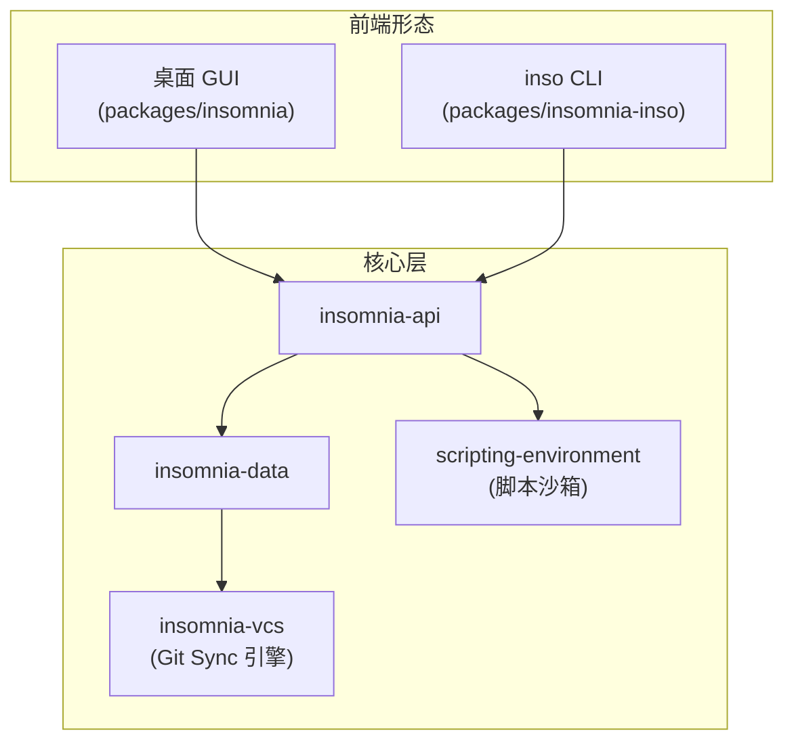

# Insomnia 项目导读：一套 collection 串起多协议调试、Git 协作与 CI 测试

> **目标读者**：后端/全栈工程师，需要在多个协议上调试、测试、设计 API 的开发者
> **前置知识**：用过 Postman 或同类 API 客户端，对 HTTP/GraphQL/gRPC 有基本概念
> **预计阅读时间**：12 分钟 | **难度**：⭐⭐

---

## 一、核心判断

[Insomnia](https://github.com/Kong/insomnia) 是一个老牌、跨协议、跨平台的开源 API 客户端，主仓库由 Kong 维护。它真正解决的问题是：让 REST、GraphQL、WebSocket、SSE、gRPC 这些不同协议的调试产物，落在**同一份 collection 数据模型**上——桌面 GUI 点鼠标是一种用法，Git 仓库里做 code review 是一种用法，CI 流水线里跑回归也是一种用法，三者操作的是同一份数据。本文所有数据核实于 2026-09。

先交代几个基本盘：仓库创建于 2016-04-23，约 40K stars、2.4K forks，TypeScript + Electron，Apache-2.0 协议，默认分支是 `develop`（不是 `main`）。截至 2026-09-25 仍有持续提交，最新稳定版 core@13.3.0 发布于 2026-09-23。

理解这套系统的入口不在 GUI，而在 **monorepo 的边界设计**——每个包承担一层职责：

- `insomnia`（主包，Electron 桌面应用）
- `insomnia-inso`（命令行工具，CI/CD 集成入口）
- `insomnia-api` / `insomnia-data`（核心 API 与数据访问层）
- `insomnia-scripting-environment`（pre-request / post-response 脚本沙箱）
- `insomnia-testing` / `insomnia-smoke-test`（测试基础设施）
- `insomnia-analytics`（共享埋点）

桌面 GUI、inso CLI、第三方插件共用 `insomnia-api` 和 `insomnia-data` 这两层核心能力，UI 与编排逻辑彼此独立。后面会看到一个具体案例如何穿过这些边界。

## 二、系统地图

| 包 | 角色 |
|------|------|
| `packages/insomnia` | Electron + React 桌面端，路由层用 react-router |
| `packages/insomnia-inso` | Node.js CLI，入口 `bin/inso`，供 CI/CD 与本地脚本调用 |
| `packages/insomnia-api` | 不依赖 Electron 的 API 业务逻辑，随 core 统一版本发布 |
| `packages/insomnia-data` | 数据持久化抽象与 collection 等核心模型 |
| `packages/insomnia-vcs` | Git Sync 的版本控制引擎，负责与任意 Git 仓库同步 collection |
| `packages/insomnia-scripting-environment` | 脚本沙箱，暴露 `insomnia.*` 对象并内置 chai、ajv、crypto-js 等常用库 |
| `packages/insomnia-testing` | 单元测试工具与 collection runner |
| `packages/insomnia-smoke-test` | Playwright 端到端测试 |
| `packages/insomnia-component-docs` | 组件文档 |
| `packages/insomnia-analytics` | 桌面与 CLI 共享的埋点 SDK |



> 注意点：仓库默认分支是 `develop`，新 PR 默认开向 develop。克隆时记得 `git clone -b develop`。

## 三、存储：先选落点，再谈协作

Insomnia 把"数据放在哪"做成了显式选择。不登录账号也能用——本地 **Scratch Pad** 模式，全部数据存本机，适合个人单干；登录账号后才能解锁完整的协作能力，而登录本身不改变数据落点，你在每个项目上仍可任选下面三种存储之一：

| 存储 | 适用人群 | 数据落点 | 费用 |
|------|----------|----------|------|
| **Local Vault** | 个人本地开发，数据 100% 存本机 | 本机，零外部依赖 | 免费 |
| **Git Sync** | 团队想用 Git 做 collection 协作 | 任意第三方 Git 仓库（GitHub、GitLab、内部 Gitea） | 付费（Essentials 起订，限每组织 3 用户） |
| **Cloud Sync** | 多设备、跨地域协作 | Kong 云端，传输采用加密存储，可选端到端加密（E2EE） | 免费额度 + 付费协作 |

Git Sync 是付费功能，这一点在做选型时容易踩空：README 把它列在 premium capabilities 里，官方存储文档进一步明确 Essentials 计划二选一——要么开 Git Sync（每组织最多 3 个用户），要么关掉它换不限用户数。个人开发者在免费计划里能用的是 Scratch Pad 和 Local Vault。

Scratch Pad 与 Local Vault 的官方区别只有一条：两者数据都在本地，但 **Local Vault 项目可以再叠加 Git Sync**，Scratch Pad 不能。另外存储类型可以随时互转，比如把 Cloud Sync 项目转回 Local Vault——官方文档明确这个操作会**永久删除该项目的云端数据**，协作随之终止，转换前要让所有协作者先 pull 最新版本。

还有一个与存储解耦的 **Private Environments** 特性：环境变量永远存在本地、从不进入云端，无论项目选了哪种存储。对企业里"环境变量不能出内网"的合规要求，这是官方给出的专用出口。

## 四、协议与能力

README 对 Insomnia 的定位一句话：开源、跨平台的 API 客户端，覆盖 GraphQL、REST、WebSockets、SSE、gRPC "以及任何其他 HTTP 兼容协议"。能力按动作分四类，这是 README 的原始口径：

- **调试（Debug）**：主流协议上直接发请求看响应；
- **设计（Design）**：内置 OpenAPI 编辑器与可视化预览；
- **测试（Test）**：原生测试套件与 collection runner；
- **Mock（模拟）**：云端或自托管 mock server。

每类协议在桌面端有对应的 UI 形态：REST 是经典的 Request/Response 视图，GraphQL 带 schema 探索，gRPC 通过导入 `.proto` 文件选择方法发起调用。官网还单独列出了 Socket.io 调试与 MCP Client 能力——后者是 2026 年 AI 工具链语境下的新入口，可以让编码 agent 直接调用 Insomnia 的调试能力。

## 五、inso CLI

`insomnia-inso` 是把 Insomnia 能力带进 CI/CD 流水线的关键。从源码开发运行的路径（README 原文口径）：

```shell
# 安装 monorepo 依赖
npm i

# 启动 watch 模式编译 inso
npm run inso-start

# 跑 inso
./packages/insomnia-inso/bin/inso -v
```

inso 的子命令是一组两层结构，以下直接对照源码 `packages/insomnia-inso/src/cli.ts` 的 commander 注册：

| 子命令 | 用途 |
|--------|------|
| `run test <id>` | 跑 Insomnia 测试套件，identifier 可以是测试套件 id 或 API Spec id |
| `run collection <id>` | 按工作区跑请求集合，支持延迟、超时、代理、迭代次数、`--output` 输出 JSON 报告等参数 |
| `lint spec <id>` | 用 Spectral 校验 API Spec，支持 `.spectral.yml` 自定义规则集 |
| `export spec <id>` | 把 collection 里的 API Spec 导出到文件 |
| `script <name>` | 执行 `.insorc` 配置文件里定义的脚本 |

全局参数里有三个在 CI 里最常用：`-w, --workingDir` 指向 `.insomnia` 目录、`.db.json` 或导出文件；`--ci` 关闭所有交互提示；`--config` 指定 `.insorc` 配置文件。命令行识别不到本地数据时，优先检查 `-w` 指向的路径是否符合这三种形态。

一个典型的流水线片段：

```shell
# 1. 校验接口规范（Spectral 规则，含自定义 .spectral.yml）
inso lint spec openapi.yaml

# 2. 跑回归测试，--env 指定环境，失败时进程退出非零
inso run test "Echo Test Suite" -w ./fixtures --env Dev --verbose --ci
```

Node.js 与 Electron 依赖不同的 `node-libcurl` 预编译产物，根 `package.json`（`@getinsomnia/node-libcurl`）提供两个脚本按需切换：

```shell
npm run install-libcurl-node      # inso 运行环境（Node runtime）
npm run install-libcurl-electron  # 桌面端运行环境（Electron runtime）
```

顺手排查两个高频报错：如果 `node-libcurl` 装不上，Fedora 系需要 `sudo dnf install libcurl-devel`，Ubuntu/Debian 系开发桌面端需要 `libfontconfig-dev`；Electron 安装过程卡死时，清 `~/.cache/electron` 再试。这些都是 README 开发章节的官方指引。

## 六、一次接口回归如何流过系统

把前面的静态结构串起来。假设一个常见场景：团队在 PR 里改了接口，需要在合并前跑一遍 collection 回归。

1. 开发者在桌面端（`packages/insomnia`）写好请求和测试，项目存储选 Git Sync，`packages/insomnia-vcs` 把 collection 提交到团队仓库，reviewer 直接在 Git 上看到接口定义的 diff——这是 Postman 免费版给不了的 review 体验；
2. CI 流水线检出代码，`inso run test "Echo Test Suite" -w ./repo --ci` 启动：inso 走 `packages/insomnia-api` 加载 collection 模型，数据来自 `packages/insomnia-data` 的解析；
3. 每个请求执行前，脚本沙箱（`packages/insomnia-scripting-environment`）先跑 pre-request 脚本——取环境变量、算签名、改 header；
4. 网络层用 `@getinsomnia/node-libcurl` 发出请求，断言在沙箱里执行，chai 断言失败即测试失败；
5. 全部跑完，进程以非零码退出，PR 被卡住。

同一份 collection 文件，在桌面端是可点击的调试界面，在 Git 里是可 review 的文本，在 CI 里是可断言的测试集。这就是第一节说的"同一份数据模型"在三端的兑现。

## 七、插件与脚本沙箱

桌面端开放插件系统，[Insomnia Plugin Hub](https://insomnia.rest/plugins/) 提供官方与社区插件，常见用途包括自定义主题、第三方认证/OAuth 流程、自定义渲染器、文档生成等。

README 列出的社区项目值得关注：

- [Insomnia Documenter](https://github.com/jozsefsallai/insomnia-documenter)——配合 `insomnia-plugin-documenter` 插件，或直接拿 collection 的 export 文件，生成静态 API 文档站
- [GitHub API Spec Importer](https://github.com/swinton/github-rest-apis-for-insomnia)——把 GitHub REST API 全套路由规格导入 Insomnia
- [Swaggymnia](https://github.com/mlabouardy/swaggymnia)——从已有 API 生成 Swagger 文档

脚本与插件的运行边界在 `packages/insomnia-scripting-environment`：脚本通过 `insomnia.*` 对象（如 `insomnia.environment.get()` / `set()`）读写环境，内置库覆盖 JSON Schema 校验（ajv）、断言（chai）、加解密（crypto-js）、CSV/XML 解析（csv-parse、xml2js）等常见需求，主进程与脚本执行隔离。

## 八、安全与合规

README 对账号数据的承诺是：遵循 ISO27001、SOC 2 Type II、ISO27018 与 Gold CSA STAR。注意合规声明的对象是**账号体系**，不自动覆盖每一条 API 数据——对 API 数据本身的保护，靠的是第三节那些存储选择：敏感 collection 走 Local Vault 或 Git Sync，环境变量走 Private Environments，Cloud Sync 可选 E2EE。

如果你的企业对标这些认证，"Cloud Sync + E2EE"是现成路径；如果红线是"数据不出门"，Local Vault 与 Git Sync 组合才是对口的答案。

## 九、维护状态

- **活跃度**：截至 2026-09-25 仓库仍有提交，社区维护健康，star 增速平稳。
- **发版节奏**：monorepo 各包统一使用 `core@` 版本号发布，最新稳定版 core@13.3.0（2026-09-23）。历史遗留的 npm 包 `insomnia-inso` 停在 3.6.0（2022 年），已不是分发渠道，认准 GitHub Releases 即可。
- **桌面端**走 Electron + React；仓库根目录已引入 `.claude`、`.codegraph` 等约定文件，用于 AI agent 协作开发。
- **Kong 收购后定位**：核心功能持续开源，Cloud Sync、Git Sync、高级协作走付费；license 为 Apache-2.0，第三方可商用但不可使用 Insomnia 商标。README 里 Kong 把话说得比较直白：开源软件免费使用，但维护成本要靠把一部分免费用户转化为付费客户来覆盖。

## 十、采用顺序与边界

| 场景 | 推荐度 | 说明 |
|------|--------|------|
| 日常 REST/GraphQL/gRPC 调试 | ⭐⭐⭐⭐⭐ | 免费、比 Postman 轻，多协议原生支持 |
| CI/CD 接口测试（inso） | ⭐⭐⭐⭐⭐ | `inso run test` 直接复用桌面端的 collection 与断言 |
| 团队 API 协作（Git Sync） | ⭐⭐⭐⭐ | commit-driven review 很强，但注意付费且每组织限 3 用户 |
| Mock Server | ⭐⭐⭐⭐ | 云端开箱即用；内网场景可用官方 Mockbin 镜像自托管（Docker + Redis） |
| 离线/内网企业部署 | ⭐⭐⭐ | Local Vault 可解存储，协作能力依赖 Git 基建 |

对个人开发者，Insomnia 与 Postman 拉开差距的是三件免费的事：原生 GraphQL 与 gRPC 调试、Local Vault 纯本地存储、inso 驱动的 CI 回归；Git Sync 这条杀手锏要等团队付费解锁。对已有 Git 工作流的团队，"collection 即代码"省掉的是平台锁定，而不是工具迁移本身。反过来，如果你的工作流以 REST 为主、只在 GUI 里点鼠标、不接 CI，迁移收益相对有限——这类场景换工具的成本大于收益，留在原地也没问题。
