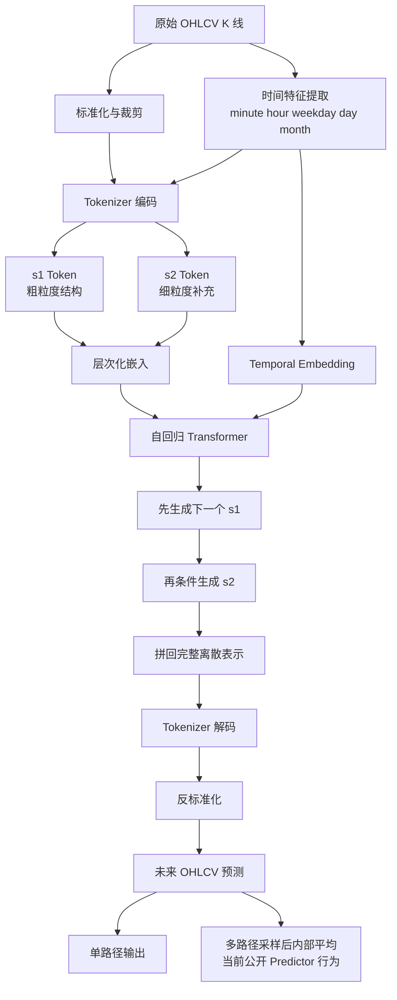
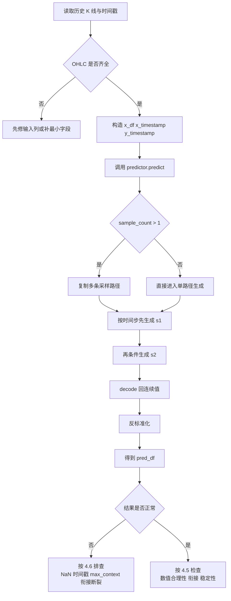
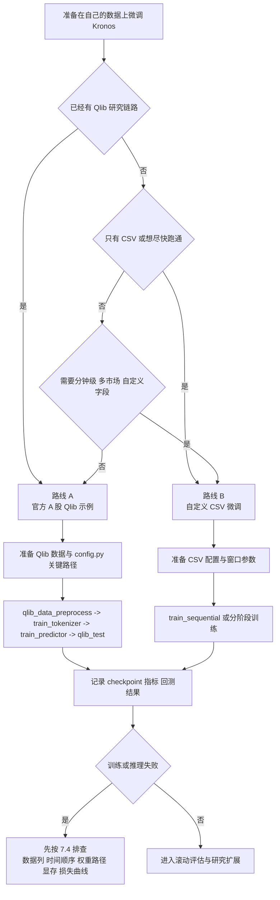
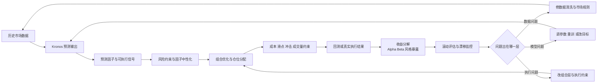

> 目标读者：想从零开始理解 Kronos，并进一步做到“能跑、能改、能评估、能提出改进方案”的开发者、研究者与量化学习者。
> 写作原则：本文只写能从论文摘要、官方 README 与公开代码交叉核实的内容；对公开资料里没有直接证实的说法，本文不会写成既成事实。

## 阅读地图

| 阶段 | 你会得到什么 | 完成标准 |
| ---- | ---- | ---- |
| 新手 | 理解 Kronos 的定位、输入输出与基本用法 | 能跑通官方预测示例 |
| 入门 | 看懂 Tokenizer、时间特征、推理流程 | 能解释预测为什么这样生成 |
| 进阶 | 掌握批量预测、微调、回测边界 | 能在自定义数据上做实验 |
| 专家 | 能评估论文、定位系统边界并提出改进方案 | 能设计自己的 Kronos 改进实验 |

## §0 三分钟结论

如果你时间有限，先记住下面 6 点：

1. **Kronos 是一个面向金融 K 线序列的解码式基础模型家族（decoder-only foundation model family）。**它不是通用时间序列模型的简单改名，而是把连续的 OHLCV 数据先离散化成层次化 Token，再交给自回归 Transformer 建模。
2. **当前公开版本最可信的能力主线是：预测、微调、演示型回测（demo）。**公开 README 和代码能直接支撑的，是价格预测、波动率预测、合成 K 线建模方向，以及配套的预测脚本、微调脚本和回测示例。
3. **论文摘要里能直接核实的核心数据是：45 个全球交易所、120 亿条 K 线记录。**摘要同时给出了三类结果：价格预测的秩信息系数（Rank Information Coefficient，RankIC）相对领先的时间序列基础模型（Time Series Foundation Model，TSFM）提升 93%，相对最佳非预训练基线提升 87%；波动率预测 MAE 下降 9%；合成 K 线保真度提升 22%。
4. **你不应该把 Kronos 的预测结果直接当成交易信号。**官方 README 明确把微调回测流程称为 demo，并强调生产级量化系统还需要组合优化、风险因子中性化、交易成本与冲击成本建模。
5. **这篇文章会主动剔除不可靠内容。**比如在当前公开论文摘要、README 与代码中，我没有找到可以直接证实的“两级检索系统”“Kronos-Chat”“500B+ Tokens”“92% 基准 SOTA”这类说法，所以本文不会把它们写成确定事实。
6. **如果你想在 Kronos 基础上做出真正有研究价值的下一步，最值得优先投入的是：外生信息融合、不确定性校准、跨标的排序目标、显式多尺度目标，以及执行约束感知的评估链路。**

## §1 为什么 Kronos 值得认真学

### 1.1 把 K 线当成“语言”，到底是什么意思

Kronos 的核心思想，不是把价格序列硬套成自然语言，而是借用语言模型里最成功的一条路线：

1. 先把连续信号转成更稳定、更可离散建模的 Token。
2. 再用大规模自回归模型去学习“下一个 Token 在什么上下文里更可能出现”。

对金融时间序列来说，这样做有两个直接好处：

- **连续值的噪声更容易被压缩。**金融数据的瞬时波动、量纲差异和极端值很多，直接在原值空间上建模，优化往往不稳定。
- **模型可以学习更抽象的价格行为模式。**例如上涨延续、震荡收敛、放量突破、缩量回落，这些结构化模式更接近“序列语法”，而不是单点数值回归。

Kronos 试图学到的不是“下一秒价格一定是多少”，而是“在当前上下文中，下一段 K 线形态最可能落在哪个模式簇里”。

### 1.2 它想解决的是哪一类传统难题

| 传统难题 | 常见后果 | Kronos 的思路 |
| ---- | ---- | ---- |
| 金融数据噪声高、分布漂移快 | 模型在一个市场有效，换市场就失灵 | 用大规模跨市场预训练学习更稳的基础表示 |
| 连续数值直接建模难 | 对极端值、尺度变化很敏感 | 先离散化，再做 Token 序列建模 |
| 下游任务多样 | 预测、波动率、生成往往要拆成多套系统 | 尝试用统一预训练模型服务多类任务 |
| 金融评估不等于普通回归 | 点误差低，不代表交易价值高 | 在论文里加入秩信息系数（RankIC）、波动率与生成质量等多视角评估 |

### 1.3 它和“普通时间序列基础模型”差在哪里

官方 README 明确强调了一点：**Kronos 是专门针对金融 K 线序列预训练的，而不是一般时间序列基础模型（TSFM）的金融包装版。**

这句话很重要，因为金融数据相比工业时序、传感器数据、流量数据有三个特殊性：

- **噪声占比更高。**你看到的每一次波动，未必都携带可持续的经济信息。
- **任务目标更复杂。**你不只是关心误差，还关心排序能力、波动率刻画、生成保真度，甚至最终可交易性。
- **市场机制会干预数据形态。**涨跌停、停牌、交易时段、不同市场日历，都会让“同样一段数值”在不同市场里含义不同。

所以，学 Kronos 不只是学一个模型，而是学一套更贴近金融数据特性的建模方法——离散化编码、层次化 Token、日历特征嵌入，这些设计选择对金融场景都有直接的理由。

## §2 先纠正几个最容易被写错的点

如果你真想达到专家水平，第一步不是会复述宣传语，而是会区分事实层、推断层和想象层。

### 2.1 当前公开资料里可以直接核实的事实

| 项目 | 当前可以核实的公开信息 |
| ---- | ---- |
| 论文 | [arXiv:2508.02739](https://arxiv.org/abs/2508.02739) |
| 模型定位 | 面向金融 K 线序列的 foundation model family |
| 数据规模 | 来自 45 个全球交易所、超过 120 亿条 K 线记录 |
| 基础结构 | 专用 Tokenizer + 自回归 Transformer |
| 下游方向 | 价格预测、波动率预测、合成 K 线生成 |
| 公开模型 | mini、small、base、large 四档，其中前三档公开可用 |
| 公开 demo | BTC/USDT 的 24 小时预测可视化 demo |
| 公开微调 | A 股 Qlib 路线 + 自定义 CSV 路线 |

### 2.2 当前公开资料里没有直接证实、本文不写成事实的说法

| 说法 | 问题 | 本文处理方式 |
| ---- | ---- | ---- |
| “500B+ Tokens、25+ 数据集、92% 基准 SOTA” | 我没有在当前论文摘要、官方 README 与公开代码里看到这些表述的直接证据 | 不写进本文的结论层 |
| “Kronos-Chat 已公开” | 当前公开 README、模型入口与代码里没有直接对应模块 | 不写成现成能力 |
| “两级检索系统已经是 Kronos 核心模块” | 当前公开代码主线集中在 Tokenizer、Predictor、微调与回测 | 作为潜在改进方向讨论，而不是现有功能 |
| “MTSP 是当前公开版本明确命名的官方模块” | 公开摘要与 README 没有直接给出这一命名 | 如需讨论多尺度思想，只作为研究解释，不当成官方已发布模块 |

这一步看起来像“删内容”，其实是在给文章加分。高水平技术文档最重要的不是写得多，而是**把能证实的写扎实，把不能证实的收回来**。

## §3 架构拆解：论文与公开代码共同指向什么系统

### 3.1 Kronos 的两阶段主链路

```text
原始 OHLCV / K 线数据
    -> 时间特征提取（minute / hour / weekday / day / month）
    -> Tokenizer 编码
    -> 层次化离散 Token（s1 / s2）
    -> 自回归 Transformer 建模
    -> 按时间步先生成 s1，再生成 s2
    -> Tokenizer 解码回连续数值空间
    -> 反标准化
    -> 未来 OHLCV 预测结果
```

这条链路里，真正值得你重点理解的是两件事：

- **为什么必须先离散化。**
- **为什么生成时要分成 s1 和 s2 两级 Token。**

如果你更习惯先看系统架构全景，再拆解模块细节，下面这张 **Kronos 总体架构图** 可以帮你直接建立当前公开主链路的心智模型：



读图方法：左侧是原始连续值和时间上下文，中间是离散化与层次化 Token 建模，右侧是自回归生成、解码和最终输出。后面 3.2 到 3.7 的内容，本质上就是把这张总图里的关键节点逐个拆开讲清楚。

### 3.2 离散化编码器（Tokenizer）不是配角，而是 Kronos 的第一主角

从公开代码看，`KronosTokenizer` 不是一个“简单归一化器”，而是一个带有 Transformer 编码器、解码器与量化器的独立模块。它的职责是把连续的多维输入压缩成适合语言建模的离散表示，再从离散表示重建回连续空间。

其初始化参数可以概括成下面这类结构：

```python
KronosTokenizer(
    d_in,
    d_model,
    n_heads,
    ff_dim,
    n_enc_layers,
    n_dec_layers,
    ffn_dropout_p,
    attn_dropout_p,
    resid_dropout_p,
    s1_bits,
    s2_bits,
    beta,
    gamma0,
    gamma,
    zeta,
    group_size,
)
```

代码里最关键的三个信号是：

1. **它使用了二进制球面量化（Binary Spherical Quantization，BSQ）。**公开代码里的 `BSQuantizer` 负责把连续隐表示映射到离散索引。
2. **它天然支持层次化 Token。**`codebook_dim = s1_bits + s2_bits`，说明离散表示不是单层码本，而是拆成了两个部分。
3. **它既能编码也能解码。**Tokenizer 并不只是为“压缩输入”服务，它还决定了模型最终能恢复出怎样的连续数值。

从研究角度看，这个设计很重要。因为在金融场景里，**离散化误差本身就是建模误差的一部分**。如果 Tokenizer 把有效微结构抹平了，后面的 Transformer 再强也只能在损失过的信息上继续学习。

### 3.3 s1 / s2 两级 Token 在推理里怎么工作

公开代码表明，Kronos 在生成时不是一步直接吐出“下一个连续价格”，而是按下面的次序进行：

1. 用已有上下文 Token 与时间戳，先预测下一个 `s1` Token。
2. 再把 `s1` 作为条件输入，预测对应的 `s2` Token。
3. 把生成出的 s1 / s2 Token 拼回完整离散表示。
4. 用 Tokenizer 的 `decode` 把离散表示映射回 OHLCV 数值空间。

如果你第一次接触两级 Token，可以先用下面这个工程直觉来理解。它不是论文原句，而是帮助你建立脑内模型：

| 层级 | 你可以先把它想成什么 | 主要作用 |
| ---- | ---- | ---- |
| `s1` | 骨架、粗轮廓 | 先决定未来 K 线大致落在什么状态或形态簇里 |
| `s2` | 细节、修饰层 | 在 `s1` 已经给出的骨架上补充更细粒度差异 |

这种做法的直觉是：

- `s1` 更像“粗粒度的先验结构”；
- `s2` 更像“在先验结构之上的细化补充”。

你可以把它理解成一种“先定大轮廓，再补细节”的序列生成机制。对高噪声金融序列来说，这通常比一次性直接生成完整连续向量更稳。

### 3.4 基础模型本体：时间嵌入 + Transformer + 依赖感知解码

从 `Kronos` 主模型的构造可以看出，公开版本至少包含以下几个关键部件：

- `HierarchicalEmbedding`：把 s1 / s2 Token 映射到共同的表示空间。
- `TemporalEmbedding`：把时间戳特征加入序列表示。
- 多层 `TransformerBlock`：负责上下文建模。
- `DependencyAwareLayer`：负责在 s1 与 s2 之间显式建模依赖关系。
- `DualHead`：输出两级 Token 的预测分布。

如果你觉得 `DependencyAwareLayer` 这个名字太抽象，可以先记住一个最直观的理解：**它的作用不是让 `s1` 和 `s2` 各自独立猜，而是尽量保证细粒度 Token 的生成始终受粗粒度结构约束。**公开代码展示出的设计思路是“先有骨架，再在骨架内补细节”，而不是两层并列、互不相干地各自输出。

这说明 Kronos 不是“纯粹的普通 Decoder 加一点时间特征”，而是显式承认了**层次化离散 Token 之间存在条件依赖**。

### 3.5 时间信息不是简单的位置编号，而是日历特征

`KronosPredictor` 暴露出的时间列是：

- `minute`
- `hour`
- `weekday`
- `day`
- `month`

当前公开版本不是单纯靠序列下标做位置编码，而是把市场时间上下文也纳入了输入。它的好处是明显的：

- 交易日内不同时间段的微结构不同。
- 周一和周五的市场行为可能不同。
- 月末、节前、财报季附近的分布可能不同。

但它也有边界：

- 它并没有天然编码“宏观事件”“财报发布时间”“市场停牌规则”等更高层上下文。
- 如果你跨市场使用，同样的 `weekday` 和 `hour`，在不同市场未必语义一致。

这件事在实务里经常被低估。下面这张表可以帮你快速建立“同样的日历特征，跨市场未必同义”的意识：

| 市场 | 同样的 `hour` / `weekday` 为什么可能含义不同 |
| ---- | ---- |
| A 股 | 存在午间休市、涨跌停、T+1 等规则，某些时间段的行为会被制度约束强烈塑形 |
| 美股 | 盘前盘后、财报与宏观数据发布时间，会让同样的时钟位置对应不同信息密度 |
| 加密市场 | 7x24 连续交易，没有传统开收盘边界，同样的 `weekday` 往往更多对应全球流动性节律 |

所以，如果你计划把同一套 Kronos 流程横跨多市场复用，至少要先问一句：**我现在喂给模型的时间特征，到底是“真实上下文”，还是只是“看起来统一的钟表字段”。**

这正是后面“如何改进 Kronos”部分要讨论的重点。

### 3.6 预测器封装（Predictor）做了哪些你容易忽略的预处理

很多文章在讲模型时，只讲架构，不讲输入清洗。实际工程里，这往往是最容易导致“论文效果”和“自己效果”差很多的地方。

公开代码里的 `KronosPredictor` 至少做了下面几件事：

1. 检查 DataFrame 是否包含 `open`、`high`、`low`、`close`。
2. 如果缺少 `volume`，会补零；如果缺少 `amount` 但有 `volume`，会按均价近似补全。
3. 如果价格或成交量字段里存在 `NaN`，会直接报错，而不是默默吞掉。
4. 对输入做按特征维度的标准化，并裁剪到固定区间。

标准化逻辑可以概括为：

$$
x_{norm} = \mathrm{clip}\left(\frac{x - \mu}{\sigma + 10^{-5}}, -\text{clip}, \text{clip}\right)
$$

这里的启发非常直接：**Kronos 的效果并不只来自大模型本身，也来自“输入先被整理成了更适合预测的统计形态”。**

### 3.7 自回归推理的真实行为

从 `auto_regressive_inference` 看，Kronos 的推理流程大致是：

1. 把输入样本按 `sample_count` 复制多份。
2. 编码成 s1 / s2 Token。
3. 在给定 `max_context` 的窗口内循环生成未来 Token。
4. 每个未来时间步先采样 s1，再采样 s2。
5. 解码为连续值。
6. 如果 `sample_count > 1`，最后对多条样本路径做平均。

这有一个很关键的专家级结论：**当前公开的预测器接口（Predictor API）并不会直接返回整组未来分布，而是会把多条样本路径内部平均后再返回一个结果。**

所以，如果你要做严格的不确定性估计，下一步通常不是简单把 `sample_count` 调大，而是要改推理接口，让它保留样本路径而不是立刻求均值。

## §4 从零开始：跑通第一个预测示例

### 4.1 环境准备

如果你只是想先把公开版本跑起来，最稳的路线是直接跟随官方仓库：

```bash
git clone https://github.com/shiyu-coder/Kronos.git
cd Kronos
python -m venv .venv
source .venv/bin/activate
pip install -r requirements.txt
```

官方 README 要求 Python 3.10+。如果你只关心推理，先把环境跑通，再做数据准备就够了。

### 4.2 加载 Tokenizer、模型和 Predictor

```python
from model import Kronos, KronosTokenizer, KronosPredictor

# 1. 载入 Tokenizer（负责连续数值与离散 Token 的双向转换层）
tokenizer = KronosTokenizer.from_pretrained("NeoQuasar/Kronos-Tokenizer-base")

# 2. 载入模型权重（部署 Transformer 自回归本体）
model = Kronos.from_pretrained("NeoQuasar/Kronos-small")

# 3. 封装高级推理器（挂载上下文限制与自回归采样代理）
max_context = 512
predictor = KronosPredictor(model, tokenizer, max_context=max_context)
```

这里有两个实务细节：

- 如果你不手动指定设备，`KronosPredictor` 会自动尝试 `cuda:0`、Apple Silicon 的 `mps`，否则回落到 `cpu`。
- `Kronos-small` 和 `Kronos-base` 的公开上下文长度是 512，这会直接影响你的 `lookback` 选择。

### 4.3 准备输入数据

公开 README 给出的最小输入约束是：

- 必需列：`open`、`high`、`low`、`close`
- 可选列：`volume`、`amount`
- 时间列需要单独传给 `x_timestamp` 和 `y_timestamp`

一个最常见的准备方式如下：

```python
import pandas as pd

# 1. 读取历史底表数据并严格标准化时间戳类型
df = pd.read_csv("./data/XSHG_5min_600977.csv")
df["timestamps"] = pd.to_datetime(df["timestamps"])

lookback = 400  # 提供给模型的上下文观测窗口长度
pred_len = 120  # 需要模型向未知未来持续生成的 K 线数量

# 2. 分离关键预测特征集与时间戳序列，避免信息污染
x_df = df.loc[:lookback - 1, ["open", "high", "low", "close", "volume", "amount"]]
x_timestamp = df.loc[:lookback - 1, "timestamps"]
y_timestamp = df.loc[lookback:lookback + pred_len - 1, "timestamps"]
```

对新手来说，最容易犯的错误有三个：

1. `y_timestamp` 的长度和 `pred_len` 不一致。
2. 数据里包含 `NaN`，但自己没先清洗。
3. 把超长 `lookback` 当成“上下文越大越好”，却忽略了小模型的有效窗口限制。

### 4.4 生成预测

```python
# 3. 激发预测接口调度底层自回归生成引擎
pred_df = predictor.predict(
    df=x_df,                  # 基础历史行情特征（将被进行跨切片 Normalizaion）
    x_timestamp=x_timestamp,  # 历史时间戳用以抽取对应市场日历属性 
    y_timestamp=y_timestamp,  # 目标的驱动预测时间轴
    pred_len=pred_len,        # 指示强行连续生成的循环深度
    T=1.0,                    # 采样温度系数（极低则刻板守旧，极高则随意跳动）
    top_p=0.9,                # 核采样选取大概率集合的概率质量阈
    sample_count=1,           # 采样独立路径线束（当模型支持均一融合策略时使用）
)

print(pred_df.head())
```

返回值是一个以 `y_timestamp` 为索引的 DataFrame，列通常包括：

- `open`
- `high`
- `low`
- `close`
- `volume`
- `amount`

如果你想先从全流程视角上把本次推理链路“看顺”，可以搭配下面这张 **Kronos 预测推理执行流全景图** 来排查自己当前正卡在哪一步：



读图方法：先看输入是否满足最小约束，再看推理阶段的单路径或多路径分支，最后看结果检查和失败回溯。它对应的就是第 4 节“准备输入 -> 调用 Predictor -> 读结果 -> 排查问题”的完整顺序。

### 4.5 第一次看结果时，应该关注什么

新手最容易犯的误区，是看到一串未来价格就立刻想“该不该买”。

你第一次看 `pred_df`，应该先做的是下面这三步：

1. **看数值是否合理。**有没有出现负价格、极端跳变、异常量级。
2. **看预测段与历史段是否平滑衔接。**如果预测第一根 K 线就和最后一根历史 K 线出现巨大断裂，先怀疑输入清洗和时间索引。
3. **看同样参数下的稳定性。**调整 `T`、`top_p` 和 `sample_count` 后，预测形态是否完全失控。

如果你确实想做一个最基础的方向性检查，可以先这样写：

```python
last_close = x_df["close"].iloc[-1]
first_pred_close = pred_df["close"].iloc[0]
change_pct = (first_pred_close - last_close) / last_close * 100

print(f"next-step close change: {change_pct:.2f}%")
```

但请记住，这只是**最粗的预测解释**，不是交易信号生成系统。

### 4.6 第一次跑失败时，按这个顺序排查

如果你第一次就报错，不要立刻怀疑模型本身。Kronos 新手最常见的问题，大多出在输入、时间戳和上下文窗口上。

先排这 5 件事：

1. **列是否齐全。**至少要有 `open`、`high`、`low`、`close`。
2. **关键列是否含 `NaN`。**公开 Predictor 遇到关键字段缺失会直接报错。
3. **时间戳是否单调递增，且 `y_timestamp` 长度是否等于 `pred_len`。**
4. **`lookback` 是否超过你设置的 `max_context`。**上下文设定不一致时，最容易出现你以为“喂了更多历史”，实际却被裁掉的情况。
5. **输出是否异常断裂。**第一根预测 K 线如果和最后一根历史 K 线差距过大，先查数据清洗和时间对齐，再讨论模型质量。

如果你想更快定位问题，也可以先用“症状 -> 第一怀疑点”的方式粗排一次：

| 现象 | 第一怀疑点 |
| ---- | ---- |
| 一运行就报列缺失或字段错误 | `x_df` 没按 OHLC 最小约束准备 |
| 能跑通，但结果里出现 `NaN` 或极端值 | 原始输入含缺失值，或时间戳与预测窗口没对齐 |
| 结果并不报错，但第一根预测 K 线和历史末尾断裂很大 | 数据清洗、时间频率、市场规则处理存在问题 |
| 推理特别慢或设备内存吃紧 | `lookback`、`sample_count`、模型尺寸或设备选择不匹配 |

下面这段最小排查脚本可以直接复用：

```python
required_cols = ["open", "high", "low", "close"]

# === 阶段 1/3：强前置过滤，拦截“必崩点” ===
assert all(col in x_df.columns for col in required_cols), "致命报错：缺少模型必需的最小可推断 OHLC 列集合"
assert not x_df[required_cols].isna().any().any(), "严重清洗事故：进入 Predictor 容器前的数据中仍携带有未决的 NaN 脏项"
assert len(x_df) == len(x_timestamp), "尺寸错位：历史行情的样本容量与独立输入的时间序列长度没有同步"
assert len(y_timestamp) == pred_len, f"预测目标时间界限缺失：引擎预期需求得到足量 {pred_len} 行目标索引"
assert x_timestamp.is_monotonic_increasing, "历史输入序列的时间流发生逆流，并非严格物理递增"
assert y_timestamp.is_monotonic_increasing, "待预测待验证序列的时间轴发生倒错异常"
assert lookback <= max_context, f"上下文内存泄漏警告：试图切分的 {lookback} 窗口大小强行超出核许 {max_context} 极值"

# === 阶段 2/3：核心驱动调用环节 ===
pred_df = predictor.predict(
  df=x_df,
  x_timestamp=x_timestamp,
  y_timestamp=y_timestamp,
  pred_len=pred_len,
  T=1.0,
  top_p=0.9,
  sample_count=1,
)

# === 阶段 3/3：基础结果集业务后验环节 ===
assert pred_df.notna().all().all(), "核心算法崩溃：后端给到业务层的反演生成连续序列在解码段触发了 NaN 熔断"
assert (pred_df[["open", "high", "low", "close"]] > 0).all().all(), "逻辑破坏异常：部分被生成的 K 线价格失控击穿至 0 元底线以下"

# 测试第一笔生成价格是否有发生恶性的“断头崖”效应
bridge_gap = abs(pred_df["close"].iloc[0] - x_df["close"].iloc[-1]) / max(abs(x_df["close"].iloc[-1]), 1e-6)
print(f"起步桥接价格偏离度 (Bridge Gap Validation): {bridge_gap:.2%}")
```

如果你已经通过这 5 项，结果仍然很差，再去调整 `T`、`top_p`、`sample_count`，才是更高效的排查顺序。

### 4.7 一份可以直接运行的最小完整脚本

如果你不想在前面的代码片段之间来回拼接，下面这份脚本可以直接作为最小起点。你只需要改 3 个地方：

1. 把 `csv_path` 改成你的数据文件路径。
2. 确认 CSV 至少包含 `timestamps`、`open`、`high`、`low`、`close`。
3. 按你的任务调整 `lookback` 和 `pred_len`。

```python
import pandas as pd
from model import Kronos, KronosTokenizer, KronosPredictor

# ==============================================================
# 配置段：控制工作流执行策略的核心基准参数
# ==============================================================
csv_path = "./data/XSHG_5min_600977.csv"
model_name = "NeoQuasar/Kronos-small"
tokenizer_name = "NeoQuasar/Kronos-Tokenizer-base"

lookback = 400       # 灌入到模型的有效历史窗口极宽
pred_len = 120       # 要求模型持续前瞻解码的未来长度
max_context = 512    # 从 Transformer 参数侧硬性锁定的处理顶限

required_cols = ["timestamps", "open", "high", "low", "close"]

# ==============================================================
# 数据段：具备极高自我审查严谨性底座的清洗调度
# ==============================================================
df = pd.read_csv(csv_path)
assert all(col in df.columns for col in required_cols), "致命：CSV 数据源格式不符合骨架结构刚性标准"

# 强时序化处理并洗落混乱的时间分布噪音
df["timestamps"] = pd.to_datetime(df["timestamps"])
df = df.sort_values("timestamps").reset_index(drop=True)

# 对不具备强金融意图的辅助特征项（成交量及金额）执行可容忍补丁
if "volume" not in df.columns:
    df["volume"] = 0.0
if "amount" not in df.columns:
    df["amount"] = 0.0

feature_cols = ["open", "high", "low", "close", "volume", "amount"]
assert not df[feature_cols].isna().any().any(), "数据预验收拦截：主训练通道尚未清除隐蔽的插值型 NaN 脏数据"
assert lookback <= max_context, f"OOM 规避告警：强行给定远超设定阈值 ({max_context}) 的 {lookback} 将必定失效"
assert len(df) >= lookback + pred_len, "余量枯竭告警：本集内包含的净可用记录不足以支撑构建一个合规的测试切片"

# ==============================================================
# 内核段：权重加载与装配驱动初始化
# ==============================================================
tokenizer = KronosTokenizer.from_pretrained(tokenizer_name)
model = Kronos.from_pretrained(model_name)
predictor = KronosPredictor(model, tokenizer, max_context=max_context)

x_df = df.loc[: lookback - 1, feature_cols]
x_timestamp = df.loc[: lookback - 1, "timestamps"]
y_timestamp = df.loc[lookback : lookback + pred_len - 1, "timestamps"]

# ==============================================================
# 生成段：运行态自回归并封存产出的业务信号数据流
# ==============================================================
pred_df = predictor.predict(
    df=x_df,
    x_timestamp=x_timestamp,
    y_timestamp=y_timestamp,
    pred_len=pred_len,
    T=1.0,
    top_p=0.9,
    sample_count=1,
)

assert pred_df.notna().all().all(), "严重隐患捕获：输出端的预测数组遭遇内敛式数字奔溃错误引发全盘 NaN"

# 对系统最致命的断裂带隐患给出显像追踪：查验最后一条历史点与第一条预测线
last_close = x_df["close"].iloc[-1]
first_pred_close = pred_df["close"].iloc[0]
bridge_gap = abs(first_pred_close - last_close) / max(abs(last_close), 1e-6)

print("==== 模型自回归推理输出表前 5 行一览 ====")
print(pred_df.head())
print(f">>> 历史到生成域第一根接力棒产生的跳点偏移度: {bridge_gap:.2%}")

pred_df.to_csv("./kronos_prediction_output.csv")
print("✅ 本次预测引擎调用已无瑕运转完毕，成果落盘至 ./kronos_prediction_output.csv")
```

如果这份脚本能顺利跑通，你就已经完成了本文 Level 1 的核心目标。下一步最合理的动作不是立刻换更大的模型，而是先按第 4.6 节和第 5 节的方法，分别检查输入质量、参数稳定性和上下文窗口设置。

## §5 进阶使用：批量预测、采样参数与上下文窗口

### 5.1 如何批量预测多个序列

公开版本支持 `predict_batch`：

```python
pred_df_list = predictor.predict_batch(
    df_list=df_list,
    x_timestamp_list=x_timestamp_list,
    y_timestamp_list=y_timestamp_list,
    pred_len=pred_len,
    T=1.0,
    top_p=0.9,
    sample_count=1,
    verbose=True,
)
```

但它不是“想堆多少序列都行”。当前实现要求：

- 所有序列的历史长度一致。
- 所有序列的预测长度一致。
- 每个 DataFrame 至少包含 OHLC 四列。

这是因为批量推理底层会把输入堆成统一张量，长度不一致就没法并行处理。

### 5.2 `T`、`top_p` 和 `sample_count` 应该怎么理解

| 参数 | 作用 | 实务理解 |
| ---- | ---- | ---- |
| `T` | 温度 | 越高越发散，越低越保守 |
| `top_p` | Nucleus Sampling 截断范围 | 越高保留的候选概率质量越多 |
| `sample_count` | 并行采样路径数 | 当前公开 Predictor 会对多路径内部平均 |

如果你不想一上来就盲试参数，可以先从下面 3 组起点开始。它们更接近“工程起步配置”，不是全局最优答案：

| 场景 | `T` | `top_p` | `sample_count` | 更适合什么目标 |
| ---- | ---- | ---- | ---- | ---- |
| 保守点预测 | `0.7` | `0.8` | `1` | 先看输出是否平滑、是否容易解释 |
| 常规研究起点 | `1.0` | `0.9` | `1` | 和公开示例风格接近，适合先做可复现实验 |
| 探索式多路径采样 | `1.0` | `0.9` | `5` | 想观察多样本均值前的稳定性变化 |

本文前面示例里使用的 `T=1.0`、`top_p=0.9`、`sample_count=1`，更适合当成**公开示例常见起点**来理解，而不是把它当成已经验证过的全局最优参数。

这带来一个很重要的工程含义：

- 如果你想做“点预测更稳”，可以适度增加 `sample_count`。
- 如果你想研究“预测分布长什么样”，就要改接口保留每条路径，而不是只拿平均结果。

### 5.3 不同模型该怎么选

根据公开 Model Zoo：

| 模型 | 上下文长度 | 参数量 | 适合场景 |
| ---- | ---- | ---- | ---- |
| Kronos-mini | 2048 | 4.1M | 更轻量、长上下文 |
| Kronos-small | 512 | 24.7M | 入门和推理平衡 |
| Kronos-base | 512 | 102.3M | 更高质量的公开基础版 |
| Kronos-large | 512 | 499.2M | 当前未公开权重 |

实务建议是：

- **刚上手**：从 `small` 开始。
- **更看重质量**：试 `base`。
- **更在意上下文窗口**：关注 `mini`，但别把小参数量和“更强效果”混为一谈。

### 5.4 官方 A 股日线示例给了你什么启发

仓库里的 `prediction_cn_markets_day.py` 是个很值得看的例子，因为它展示了三件教程里常被忽略、实际却很重要的事：

1. **真实抓数与清洗。**它用 `akshare` 拉取日线数据，并修复无效开盘价、缺失成交额等问题。
2. **市场规则感知。**它在输出后对预测价格应用了 A 股的涨跌停约束示例。
3. **业务友好的输出。**它不只打印数值，还会保存图表与结果文件。

这说明一个专家级结论：**真正可用的金融模型工作流，不会停在 `pred_df.head()`。**

## §6 论文结果应该怎么读，而不是怎么背

### 6.1 当前公开摘要能直接支持的结果

| 任务 | 摘要中的公开结果 | 应该如何理解 |
| ---- | ---- | ---- |
| 价格预测 | RankIC 相对领先 TSFM 提升 93%，相对最佳非预训练基线提升 87% | 它强调的是排序能力提升，而不是单点价格“必然更准” |
| 波动率预测 | MAE 下降 9% | 在波动率任务上，误差更低 |
| 合成 K 线生成 | 生成保真度提升 22% | 模型不仅能预测，也能生成更像真实分布的 K 线 |

### 6.2 为什么 RankIC 对金融任务很关键

如果你来自传统回归背景，可能会默认用 MSE、MAE 看一切。但在很多量化任务里，**你真正关心的不只是“绝对数值误差”，而是“排序是否有用”**。

RankIC 的直觉可以理解为：

- 模型给出的相对强弱排序，和未来真实收益排序是否一致。

这比“收盘价误差少 1 毛钱”更接近很多实际选股、排序、打分任务的核心目标。

### 6.3 但你不能把这些结果直接翻译成“可稳定赚钱”

从研究结果到可交易策略，中间至少还有 4 层鸿沟：

1. **任务目标不同。**预测排序能力，不等于已经完成组合构建。
2. **回测条件不同。**训练集、测试集、市场区间、滑点设置都会影响结果。
3. **市场机制约束不同。**涨跌停、停牌、成交量约束会改变可执行性。
4. **经济意义不自动等于统计意义。**一个统计上显著的提升，未必足以覆盖现实交易成本。

### 6.4 代码层面如何做更稳妥的复现

如果你要认真复现，至少做下面这些事：

- 固定模型 revision 与 Tokenizer revision。
- 固定随机种子。
- 固定 `lookback`、`pred_len`、`T`、`top_p`、`sample_count`。
- 明确记录是 CPU、CUDA 还是 MPS。
- 把预测任务、波动率任务、生成任务分开复现，不要混成一个“总效果”。

公开仓库里的 `tests/test_kronos_regression.py` 也传达了一个有价值的工程习惯：

- 对固定输入与固定模型 revision 做回归测试。
- 对随机采样样本做 MSE 基准检查。

如果你要把 Kronos 接入自己的研究平台，这是非常值得保留的纪律。

### 6.5 一份可以直接执行的论文复现实验清单

如果你不想把“复现论文”做成一句空话，最好的方法不是继续读概念，而是把任务拆成可验收的 4 个层级。

| 层级 | 目标 | 必做项 | 验收标准 |
| ---- | ---- | ---- | ---- |
| L1 推理复现 | 跑通公开模型预测链路 | 固定 Python 版本、依赖、`lookback`、`pred_len`、设备与采样参数 | 成功输出有效的 `pred_df`，且数值范围合理 |
| L2 回归复现 | 对齐公开实现稳定性 | 固定模型 revision、Tokenizer revision、随机种子 | 同一输入多次运行结果一致，或在允许误差内稳定 |
| L3 微调复现 | 跑通官方 demo 或自定义 CSV 微调 | 保存完整 config、checkpoint 路径、数据切分与日志 | 能完成训练、推理与回测链路 |
| L4 研究复现 | 从“跑通”升级到“可解释比较” | 引入基线、指标、失败判据和消融实验 | 能解释效果变化来自哪里，而不只是贴最终结果 |

你可以按下面的顺序执行：

1. **环境锁定**：记录 Python 版本、依赖安装方式、设备类型，以及模型与 Tokenizer 的来源。
2. **数据锁定**：记录原始数据文件、时间范围、频率、是否补全 `volume` 与 `amount`、是否清洗异常值。
3. **推理锁定**：记录 `lookback`、`pred_len`、`T`、`top_p`、`sample_count`、`max_context`。
4. **结果锁定**：保存预测输出、关键图表、日志与异常信息，避免“下次又跑不出同样结果”。
5. **评估锁定**：区分点误差、排序能力、波动率误差与生成保真度，不把不同任务混成一个总分。

下面这张表可以直接拿来做你的实验记录模板：

| 项目 | 你要记录什么 | 示例 |
| ---- | ---- | ---- |
| 模型版本 | 权重名、revision、上下文长度 | `NeoQuasar/Kronos-small`, `max_context=512` |
| Tokenizer 版本 | 名称、revision、量化配置 | `NeoQuasar/Kronos-Tokenizer-base` |
| 数据来源 | 文件、市场、周期、时间范围 | A 股 5 分钟线，2022-01 到 2025-12 |
| 输入窗口 | `lookback`、`pred_len` | `lookback=400`, `pred_len=120` |
| 推理参数 | `T`、`top_p`、`sample_count` | `T=1.0`, `top_p=0.9`, `sample_count=1` |
| 训练参数 | batch、epoch、学习率、seed | `batch=50`, `epochs=30`, `seed=123` |
| 评估指标 | 点误差、RankIC、回测指标 | MAE、RankIC、Sharpe、Max Drawdown |
| 结论 | 成功/失败、主要偏差、下一步 | 波动率任务稳定，排序能力需继续验证 |

如果你准备做严谨复现，至少补上下面这 5 个检查项：

- [ ] 我能说清这次实验用的是哪一个模型 revision 与 Tokenizer revision。
- [ ] 我保存了原始输入数据与清洗后的数据版本，而不是只保存截图。
- [ ] 我区分了“预测结果长得像”和“指标真的对齐”。
- [ ] 我把任务分成了推理复现、训练复现和研究扩展，而不是一次混做。
- [ ] 我能解释失败是环境问题、数据问题、参数问题，还是评估口径问题。

## §7 把论文落到自己的数据：两条微调路径

在进入两条路线之前，先用这张 30 秒决策表决定自己应该走哪条路：

| 你的情况 | 优先路线 | 原因 |
| ---- | ---- | ---- |
| 你想尽量贴近官方 A 股 demo 与回测流程 | 路线 A | 最接近官方公开演示链路 |
| 你只有自己的 CSV 数据，想尽快跑通 | 路线 B | 数据接入成本最低 |
| 你已经在用 Qlib 做研究 | 路线 A | 能直接接已有数据与回测体系 |
| 你要做分钟级、多市场、自定义字段实验 | 路线 B | 自由度更高，工程改动更小 |

如果你更喜欢先鸟瞰整体决策骨架，再深入到具体的分支流里探究操作盲区，下面这张 **Kronos 微调系统路线指引全景图** 将为你理清本节的所有落地选择脉络：



读图方法：先判断你现在的数据与研究基础更接近 Qlib 还是 CSV 路线，再看训练完成后的统一出口是否进入评估扩展，或者回到 7.4 做故障排查。这样读，第 7 节后面的两条微调路线就不会像并列说明，而会更像一棵真正的决策树。

### 7.1 路线 A：官方 A 股 Qlib 示例

这条路线更像“论文 demo 复现”。

准备工作：

1. 安装官方依赖。
2. 额外安装 `pyqlib`。
3. 准备本地 Qlib 数据。
4. 修改 `finetune/config.py` 里的关键路径。

公开 README 给出的关键路径包括：

- `qlib_data_path`
- `dataset_path`
- `save_path`
- `backtest_result_path`
- `pretrained_tokenizer_path`
- `pretrained_predictor_path`

官方命令链路如下：

```bash
pip install pyqlib
python finetune/qlib_data_preprocess.py
torchrun --standalone --nproc_per_node=NUM_GPUS finetune/train_tokenizer.py
torchrun --standalone --nproc_per_node=NUM_GPUS finetune/train_predictor.py
python finetune/qlib_test.py --device cuda:0
```

这条路线适合你在以下场景使用：

- 你想尽量贴近官方 demo。
- 你已经有 Qlib 数据体系。
- 你更关注 A 股日频实验与回测流程。

### 7.2 路线 B：自定义 CSV 数据集微调

如果你没有 Qlib 体系，只想用自己的 CSV 数据，公开仓库的 `finetune_csv/` 更实用。

它支持：

- 顺序训练：先训 Tokenizer，再训 Predictor。
- 单独训练：只训其中一个组件。
- 分布式训练：通过 `torchrun` 跑 DDP。

一个最小配置会长这样：

```yaml
data:
  data_path: "/path/to/your/data.csv"
  lookback_window: 512
  predict_window: 48
  max_context: 512

training:
  tokenizer_epochs: 30
  basemodel_epochs: 30
  batch_size: 50
```

最省事的方式是顺序训练：

```bash
python train_sequential.py --config configs/your_config.yaml
python train_sequential.py --config configs/your_config.yaml --skip-existing
```

如果你想更细控制，也可以拆成两个阶段分别训练。

### 7.3 微调到底能带来什么，不会带来什么

| 问题 | 微调可能帮到你 | 微调帮不了你的部分 |
| ---- | ---- | ---- |
| 你的数据分布和公开模型差太远 | 能更贴近你的市场与周期 | 不能自动解决错误标签和脏数据 |
| 你想做更贴近任务的 horizon | 能调整窗口、预测长度、训练数据 | 不能替代高质量评估设计 |
| 你要提升特定市场效果 | 有机会提高局部场景表现 | 可能牺牲跨市场泛化 |

专家视角里，微调从来不是“把模型调一下就会更强”，而是**用更贴近任务的数据分布，换取更高的任务适配性，同时承担更高的过拟合风险**。

### 7.4 微调失败时，优先排这 5 件事

真正让微调卡住的，通常不是“模型不够先进”，而是下面这些基础问题没有先排干净：

1. **数据列名和类型不对。**先确认时间列能被解析，OHLC 至少齐全，数值列不是字符串。
2. **时间顺序或切分方式有问题。**如果时间戳不递增、训练验证测试混在一起，结果会直接失真。
3. **预训练权重路径写错。**`pretrained_tokenizer_path` 和 `pretrained_predictor_path` 找不到时，后面很多错误都只是连锁反应。
4. **显存或内存不够。**先缩 `batch_size`，再缩 `predict_window` 或 `max_context`，不要一开始就怀疑模型逻辑错了。
5. **训练损失不下降。**先在一个很小的数据切片上尝试过拟合；如果小切片都学不动，优先查数据和配置，而不是继续堆训练轮数。

下面这段检查脚本适合在正式开训前先跑一遍：

```python
from pathlib import Path

import pandas as pd

df = pd.read_csv("/path/to/your/data.csv")
required_cols = {"timestamps", "open", "high", "low", "close"}

assert required_cols.issubset(df.columns), "CSV 缺少必要列"
df["timestamps"] = pd.to_datetime(df["timestamps"])
assert df["timestamps"].is_monotonic_increasing, "时间戳不是递增的"
assert not df[["open", "high", "low", "close"]].isna().any().any(), "关键价格列存在 NaN"

pretrained_tokenizer_path = Path("/path/to/tokenizer.ckpt")
pretrained_predictor_path = Path("/path/to/predictor.ckpt")

assert pretrained_tokenizer_path.exists(), "Tokenizer 权重路径不存在"
assert pretrained_predictor_path.exists(), "Predictor 权重路径不存在"
```

如果你已经做完这些排查，仍然觉得结果“不像论文里那样漂亮”，下一步不要先问“为什么没赚钱”，而是先回到第 6.5 节，重新核对你的实验层级到底还停留在 L1、L2、L3 还是 L4。

## §8 从 demo 到 production：真正的难点不在模型加载

官方 README 对这一点其实说得很清楚：当前示例是演示示例（demo），不是生产级量化交易系统。

### 8.1 原始预测信号不等于可交易 Alpha

公开 README 明确提醒：模型输出的是原始预测信号。现实量化流程里，这通常还要再经过：

- 风险暴露约束
- 因子中性化
- 组合优化
- 仓位管理

所以你真正该问的不是“模型会不会涨跌预测”，而是“这个预测信号进入组合层后还能剩下多少独立信息量”。

### 8.2 交易成本、滑点和冲击成本必须进回测

如果你的回测没把以下因素纳入：

- 手续费
- 滑点
- 冲击成本
- 成交量约束

那你得到的更可能是“实验室收益率”，不是现实收益率。

### 8.3 分布漂移会比你想象得更快

金融市场的市场状态切换（regime change）比很多工业时序场景更剧烈。过去一段时间有效的价格语法，未来可能突然失效。

因此，真正靠谱的流程应该至少包含：

- 滚动窗口评估
- 多市场区间测试
- 牛市 / 熊市 / 高波动阶段分开分析

如果你准备把 Kronos 放进持续运行的研究流程，至少维护一个最小漂移监控面板：

| 监控项 | 你要看什么 | 一旦持续恶化，优先怎么做 |
| ---- | ---- | ---- |
| 预测层 | MAE、方向准确率、RankIC 是否在多个滚动窗口连续下滑 | 先确认是不是数据口径变了，再决定是否重训 |
| 分布层 | 预测波动率、真实波动率、极端值频率是否明显脱节 | 检查是否出现新的市场状态，必要时分 regime 评估 |
| 执行层 | 换手率、成本、最大回撤是否突然恶化 | 先排组合与执行约束，再判断是不是模型信号失效 |

一个实务上更稳的原则是：**不要因为单个窗口失手就立刻重训，也不要因为回测长期好看就忽略在线退化。**更合理的做法，是当多个连续窗口同时出现指标劣化、且你能排除数据故障后，再决定是否重训、换参数，或改用新的市场状态切片重新评估。

### 8.4 数据清洗与市场规则，往往比换模型更值钱

在公开示例里，你已经能看到这种迹象：

- 修无效开盘价
- 补缺失成交额
- 应用涨跌停约束

这些看似“琐碎”的工程处理，往往比把 `small` 换成 `base` 更能影响最终结果。

## §9 专家视角：如何像读论文一样读 Kronos

如果你只是想使用 Kronos，知道 API 怎么调就够了。可如果你要到“专家能改进”的层次，你需要换一套问题意识。

### 9.1 问题一：Tokenizer 到底保留了什么，丢掉了什么

你应该追问：

- 量化后的 Token 还保留了多少高频波动信息？
- 不同资产类别是否需要不同的 Tokenizer 配置？
- `s1_bits` 和 `s2_bits` 的划分，会怎样影响表达上限？

这决定了 Kronos 的“信息瓶颈”在哪里。

### 9.2 问题二：时间嵌入够不够表达金融上下文

当前公开版本的时间特征主要是日历维度：分钟、小时、星期、日期、月份。

你应该继续问：

- 财报日、宏观事件、假期前后效应怎么编码？
- 不同市场交易时段不一致时，统一日历特征是否会引入噪声？
- 是否需要引入市场状态标签，而不是只用静态时间字段？

### 9.3 问题三：自回归下一个 Token 的目标，和你的业务目标一致吗

Kronos 的基础训练逻辑和语言模型一样，本质是“预测下一个离散 Token”。

但在金融应用里，你最终关心的可能是：

- 排名能力
- 风险暴露
- 波动率区间
- 交易后收益

这就带来一个专家级判断：**预训练目标和业务目标通常不完全一致。**真正高质量的下游系统，往往要在预训练之上再叠一层任务对齐。

### 9.4 问题四：当前接口把多样本平均掉了，会不会损失不确定性信息

这件事非常值得重视。因为金融预测不是“只要一个数就够了”，你通常更关心：

- 置信区间有多宽
- 左尾风险有多深
- 多路径是否分叉成不同市场状态（regime）

如果所有样本最后都被平均成一条路径，那不确定性结构就被部分抹掉了。

### 9.5 代码层面的专家阅读顺序

如果你准备真正读源码，建议按这个顺序：

| 路径 | 为什么先看它 |
| ---- | ---- |
| `model/kronos.py` | 主模型、Tokenizer、Predictor 和自回归推理都在这里 |
| `model/module.py` | 量化器、时间嵌入、依赖层、Transformer 细节在这里 |
| `tests/test_kronos_regression.py` | 看官方如何做稳定性与回归测试 |
| `finetune/config.py` | 看官方 demo 默认假设了什么训练与回测条件 |
| `finetune_csv/` | 看自定义数据集怎么接入、怎么顺序训练 |

## §10 如果你要在论文基础上继续改，优先做哪 6 件事

这一节是本文最关键的“从精通到能创新”的部分。下面 6 个方向，不是空泛愿景，而是我认为最值得你优先投入的改进路线。

### 10.1 引入外生信息，而不只看 OHLCV

当前公开主线聚焦在 K 线本身。可现实市场里，很多决定性信息来自：

- 新闻
- 公告
- 宏观数据
- 行业事件
- 订单簿或更细粒度成交结构

最直接的改进思路，是把 Kronos 从“纯价格语言模型”升级为“价格 + 外生上下文”的条件模型。

### 10.2 把多样本预测真正变成不确定性建模

当前公开接口的多样本更接近“采样后求均值”。如果你想走向更强的风险建模能力，可以把它改成：

- 保留全部样本路径
- 输出分位数区间
- 评估覆盖率与校准误差
- 用 CRPS 或分位数损失替代单一均值视角

这会让 Kronos 更接近一个真正可用于风险评估的概率模型。

### 10.3 显式加入跨标的排序目标

论文摘要里的价格预测成绩是用 RankIC 描述的，这已经在提醒你：

- 金融任务往往更看重排序，而不是点回归。

那么一个自然的下一步就是：

- 在预训练表示之上加横截面排序头（cross-sectional ranking head）
- 或者把排名损失与自回归损失联合训练

这样会让模型目标和实际选股、打分场景更一致。

### 10.4 把“多尺度”从传播概念变成正式实验设计

当前公开材料没有直接把 MTSP 当成明确模块公开出来，但“多尺度”仍然是一个非常值得做的研究方向。

一个可执行的改进路线是：

- 用 5 分钟、1 小时、1 天多种频率构造共享 Tokenizer。
- 在 Predictor 层做部分参数共享与部分参数专属。
- 增加跨尺度一致性损失，让短周期与长周期预测互相约束。

如果你要真正把“从公开版本出发改出下一篇论文”作为目标，这条线很有潜力。

### 10.5 增加 regime-aware memory 或检索增强

注意，这里我把它写成**改进方向**，不是当前公开能力。

为什么值得做？因为金融市场存在明显的状态切换：

- 流动性危机
- 高波动恐慌
- 长期趋势市
- 事件驱动短期冲击

如果能在推理阶段检索相似历史 regime，再把相似上下文显式注入模型，就有机会让 Kronos 在罕见事件上更稳。

### 10.6 把评估链路升级成“预测到执行”的闭环

很多时间序列论文停在预测指标，很多量化 demo 停在简化回测。真正有研究价值的升级，是把两者连起来：

- 预测输出如何转为可执行信号
- 信号如何约束仓位
- 仓位如何计入成本与冲击
- 收益如何分解成 Alpha、Beta 与风格暴露

如果你想把实验室里的“模型效果”变成线上可运营的“系统效果”，这套 **Kronos 预测到交易全流程闭环图** 则是你迈进业界最该深入骨髓的一张心智网络：



读图方法：从左到右看，是预测如何一步步进入真实研究链路；从右到左看，是一旦结果变差，你该回到哪一层定位问题。闭环的关键不在“多画了几步”，而在于它强迫你把失败拆成数据层、模型层、组合执行层，而不是把所有问题都粗暴归因给模型本身。

如果你能把 Kronos 接进这条闭环，并做出严谨的消融实验（ablation），你的工作就不再只是“用了一个开源模型”，而是“完成了一次有研究含量的系统扩展”。

## §11 从新手到专家的四级练习路线

### 11.1 Level 1：把公开示例完整跑通

目标：你不再只是看文章，而是能真正得到第一份预测结果。

练习：

1. 跑通 `Kronos-small` 的单序列预测。
2. 分别用 `lookback = 128`、`400`、`512` 对比结果差异。
3. 把 `volume` 与 `amount` 去掉，验证最小 OHLC 输入是否还能工作。

完成标准：你能解释 `df`、`x_timestamp`、`y_timestamp`、`pred_len` 各自是什么。

### 11.2 Level 2：把推理链路讲清楚

目标：你不只是会调用 API，而是能解释它内部在做什么。

练习：

1. 读懂 `KronosPredictor.predict` 的标准化与反标准化逻辑。
2. 读懂 `auto_regressive_inference` 里“先生成 s1，再生成 s2”的过程。
3. 解释为什么 `sample_count > 1` 最终仍只返回一条平均路径。

完成标准：你能用自己的话把整条推理链路讲给别人听。

### 11.3 Level 3：在自己的数据上微调并做严谨评估

目标：从“用公开模型”升级到“做自己的实验”。

练习：

1. 选一份自己的 CSV 金融数据，完成 `finetune_csv` 训练。
2. 固定随机种子，记录训练参数、数据切分和模型 checkpoint。
3. 设计一份滚动窗口评估，而不是只看单次样本结果。
4. 如果你还在 Qlib 与 CSV 两条路线之间犹豫，先回到第 7 节的决策表做路线选择；如果训练经常报错，先完成第 7.4 节的排查再继续。

完成标准：你能提交一份可复现实验记录，而不是只展示一张漂亮曲线图。

### 11.4 Level 4：做出一个可 defend 的改进方案

目标：达到“可以在论文基础上往前推进”的水平。

练习：

1. 在第 10 节的 6 个方向里选 1 个，写出实验设计。
2. 明确基线、变量、指标和失败判据。
3. 至少补一个你自己的消融实验，而不是只报最终最优结果。

完成标准：你能回答下面这个问题：

> 你改的，到底是表示学习更强了，还是数据清洗更好了，还是评估口径变了？

### 11.5 自测清单

- [ ] 我能区分 Kronos 当前公开能力与未证实传播说法。
- [ ] 我能解释 Tokenizer 在 Kronos 里为什么是核心，不是附属。
- [ ] 我能跑通单序列与批量预测。
- [ ] 我知道 `sample_count` 在当前公开实现里的真实含义。
- [ ] 我能在自己的数据上选择 Qlib 路线或 CSV 路线完成微调。
- [ ] 我能提出至少 2 个靠谱的 Kronos 改进实验。

## §12 常见问题

### Q1：我只有 OHLC，没有 `volume` 和 `amount`，还能跑吗？

可以。公开代码会在缺少 `volume` 时补零；若缺少 `amount` 但有 `volume`，会做近似补全。但从建模质量上讲，完整特征通常更好。

### Q2：预测结果能直接拿来做交易吗？

不能直接这么做。公开 README 已明确把回测链路定义为 demo。真正可交易系统至少还需要组合优化、成本建模、风险控制与执行约束。

### Q3：为什么我每次跑出来的结果不完全一样？

因为推理里有采样过程。你需要固定随机种子、固定 revision、固定参数，才能做更稳定的复现对比。

### Q4：`small`、`base`、`mini` 应该先选哪个？

大多数人先选 `small` 就够了。它是入门最平衡的起点；如果你更看重质量，再试 `base`；如果你更在意长上下文，再关注 `mini`。

### Q5：`lookback` 一定越长越好吗？

不一定。超过模型有效上下文后，额外历史不会自动带来更好效果，反而可能引入无效噪声。`small` 和 `base` 的公开上下文长度是 512。

### Q6：我一定要用 Qlib 吗？

不一定。如果你只想在自己的 CSV 上快速实验，`finetune_csv/` 路线更直接。Qlib 更适合你已经在使用它的研究工作流。

### Q7：为什么这篇文章没有继续讲“Kronos-Chat”和“两级检索”？

因为在当前公开论文摘要、README 与代码里，我没有找到可以直接核实的公开实现或正式说明。高质量技术文档应该优先保证准确性，而不是迎合传播里的扩展叙事。

## §13 资源与延伸阅读

| 资源 | 链接 | 用途 |
| ---- | ---- | ---- |
| 论文摘要 | [Kronos: A Foundation Model for the Language of Financial Markets](https://arxiv.org/abs/2508.02739) | 看论文定位与核心结果 |
| 官方仓库 | [shiyu-coder/Kronos](https://github.com/shiyu-coder/Kronos) | 看 README、示例与微调脚本 |
| Hugging Face | [NeoQuasar/Kronos](https://huggingface.co/NeoQuasar) | 获取公开模型与 Tokenizer |
| 在线 demo | [Kronos Demo](https://shiyu-coder.github.io/Kronos-demo/) | 体验 BTC/USDT 预测可视化 |
| Qlib | [microsoft/qlib](https://github.com/microsoft/qlib) | A 股 demo 所依赖的数据与回测框架 |

## §14 这篇文章真正想教会你的事

如果你一路读下来，最重要的收获不应该只是“我知道 Kronos 怎么调用了”，而应该是下面这 4 句话：

1. **会用一个模型是起点，会判断哪些说法可信才算入门。**
2. **理解 Tokenizer、时间特征和推理接口，比背宣传指标有用。**
3. **金融模型好不好，得放在完整研究与执行链路里判断，光看一段预测曲线说明不了什么。**
4. **专家能力体现在：在公开版本的边界上，提出下一步该怎么改，并把它设计成可验证的实验。**

如果你已经能做到这些，Kronos 对你来说就不再只是一个“热门开源项目”，而是一个很好的金融时间序列研究起点。
