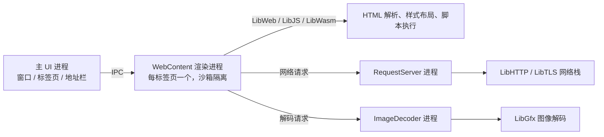

## 判断：它解决的不是「再造一个浏览器」

浏览器引擎是赢者通吃的生意。桌面流量基本被 Chromium（Chrome、Edge、Brave 等）、Gecko（Firefox）和 WebKit（Safari）三家瓜分，其中 Chromium 系占大头。它们共享一个特征：引擎都从既有代码库演进或 fork 而来。十多年来，真正从零起步、并把规范符合度做到值得关注的独立引擎，Ladybird 是第一个——不 fork 上述任何一家，代码全部原创，由 501(c)(3) 非营利组织 Ladybird Browser Initiative 治理。

它真正要回答的问题不是「再给用户一个浏览器」，而是一场可行性实验：没有商业公司背书、没有现成引擎代码可抄，靠赞助运行的非营利团队，能把 Web 引擎的规范符合度推到什么水平。目前的答案是：WPT（Web Platform Tests）通过 200 万+ 个子测试，test262（ECMAScript 官方一致性套件）通过率 97.8%。「从零写引擎」从口号变成了可验证的进度。

对读者来说，现阶段最确定的价值不在产品，而在代码库：一个可读、可改、能对照规范逐条检查的引擎实现样本。

| 指标 | 数值（截至 2026-08 中旬） |
|------|------|
| GitHub Stars | 约 6.5 万 |
| Forks | 约 3,100 |
| Commits | 82,285 |
| 主要语言 | C++（Rust 迁移进行中） |
| 许可证 | BSD 2-Clause |
| 治理 | Ladybird Browser Initiative（501(c)(3) 非营利） |

## 系统地图：三组进程 + 一组库

Ladybird 是多进程浏览器：主 UI 进程管窗口和标签页，每个标签页一个独立的 WebContent 渲染进程，图片解码和网络请求分别由 ImageDecoder、RequestServer 两个进程承担。



多进程的思路和现代浏览器（如 Chromium）一致，但实现全部自研：HTML 解析、CSS 样式与布局、JS 引擎、WebAssembly、TLS，一路到事件循环和进程间通信，都是仓库自己的代码，不依赖 Skia、V8、NSS 这类浏览器领域现成的轮子。「独立引擎」在这里是完整含义——不是换壳，而是全栈自研。

| 库 | 职责 |
|---|---|
| **LibWeb** | 渲染引擎：HTML 解析、CSS 样式与布局、DOM |
| **LibJS** | JavaScript 引擎，ECMAScript 规范实现 |
| **LibWasm** | WebAssembly 运行时 |
| **LibCrypto / LibTLS** | 密码学原语与 TLS |
| **LibHTTP** | HTTP/1.1 客户端 |
| **LibGfx** | 2D 图形、图像解码与渲染 |
| **LibMedia** | 音视频解码 |
| **LibUnicode** | Unicode 与 locale |
| **LibCore / LibIPC** | 事件循环、OS 抽象、进程间通信 |

这套库最初继承自 SerenityOS——创始人 Andreas Kling 的个人操作系统项目，2024 年把浏览器部分独立出来成立 Ladybird。库的演进方向从此由 Ladybird 决定，但起源留下烙印：不少组件按「系统库」而非「浏览器专用库」的形态设计。

## 问题拆分：先分清三件容易混淆的事

- 「独立引擎」和「单一语言」是两回事。Ladybird 主流代码是 C++，但正逐步迁向 Rust，二者长期共存。独立指的是不抄既有引擎，不是只用一种语言。
- 「不 fork 引擎」不等于「每样都自研」。PDF 用 pdf.js 渲染，调试器借 Firefox 的 DevTools 协议，独立的是引擎核心，不是每个功能都要重造。
- 「规范符合度高」和「能跑所有真实网站」之间还有一段路。真实网站依赖大量文档外的历史行为（quirks），这是独立引擎最容易翻车的地方。Ladybird 甚至需要在 UA 字符串里带上 Chrome/AppleWebKit 字样，很多站点才肯给它正常内容。

这三条界线，决定了后面怎么看它的架构和数据。

## 核心机制：四条主线

### 1. 多进程：把不安全操作踢出去

浏览器漏洞的两类高发入口是「恶意图片触发解码器内存损坏」和「网络协议解析缺陷」。Ladybird 把这两类操作各放一个独立进程，即使解码器或网络栈被攻破，攻击者也够不到渲染进程的堆。每个标签页一个渲染进程再加沙箱，一页崩溃不会拖垮整个浏览器。进程外解码和进程外网络，是这个架构里最值得抄的两个点。

### 2. Rust 迁移：从可验证的组件下手

2026 年 2 月，LibJS 的前端管线（词法分析、语法解析、AST、作用域收集、字节码生成）整体重写为 Rust，同时删光了此前试水的 Swift 代码。这次迁移用 Claude Code 和 Codex 做翻译、人工把关，验证方式是逐字节比对：52,898 个 test262 测试加 12,461 个项目自带测试，新旧管线输出一致、零回归，随后默认启用（可设 `LIBJS_CPP=1` 切回旧实现）。

先动 JS 前端而不是整个引擎，因为它是一条边界清晰的纯函数管线：源码进、字节码出，能用测试套件穷举验证「改坏了没有」。7 月延续同一思路，把样式系统和布局引擎迁到 Rust，官方给的理由是内存安全，以及为后续把树遍历并行化留空间。这不是为 Rust 而 Rust，而是挑可验证、可并行化的组件先落地。

### 3. JS 解释器：造一门带类型的语言

LibJS 解释器原本用一套无类型的汇编式方言手写，183 个字节码 handler，类型信息埋在宏里，生成器不做优化。团队为此造了门叫 flap 的类型语言，构建时由编译器翻译成 x86-64 和 AArch64：类型可检查、寄存器分配可证明、hot/cold 路径物理分离，普通 JS 只触碰解释器里小而热的片段，指令缓存友好。切换本身性能中性，随后引入 `specialize` 机制（例如为「右操作数是已知整数」生成专门 handler），在计算密集的 JS 基准上又换来约 5%。

### 4. 性能工程：以真实站点为靶子

月报里大量优化是「开着某个真实站点，用 profiler 找热点，改掉，再验证」。这类数字不能跨站点推广，但能说明工程节奏：

- Gmail 收件箱加载砍掉约 1 秒（2026-01）：缓存 parser 数据、优化 `getComputedStyle()` 等。
- Discord 从约 65 FPS 到 120 FPS（2026-02，M4 MacBook）：跳过零面积裁剪下的命令、改 mask 合成方式。
- 动画图片改按需解码，仅 cloudflare.com 一处就省 1 GiB+ 内存（2026-02）。
- WebGL 命令走共享内存，纹理密集页面主线程占用从约 40% 降到约 6%（2026-07）。

## 一次页面加载如何流过系统

用「地址栏输入 URL 回车」这个最小任务，串起整条链路：

```text
1. 主 UI 进程把导航意图经 IPC 交给 WebContent 渲染进程
2. WebContent 经 RequestServer 发请求，TLS 握手走 LibTLS
3. 响应体边下载边解析；遇到同步脚本时，推测式解析器提前扫描后续资源并预取
4. 字节码生成已挪到后台线程池，仅 YouTube 一处就移出约 200ms 主线程时间
5. LibWeb 构建 DOM/CSSOM，算样式、排布局，每个 Navigable 独立栅格化
6. 图片交给 ImageDecoder 进程解码，结果经 IPC 回传
7. compositor 只重绘变化区域，把帧合成上屏；WebGL 场景走共享内存避免每帧拷贝
```

每一步后面都站着验证：test262 在每个 PR 上自动跑，WPT 通过数按月跟踪。「规范符合度」不是汇报口径，而是 CI 里跑出来的数字。

## benchmark 解读：这些数字说明了什么

**WPT 通过数**（2026-04 月报：2,067,263 个通过的 subtest，上期 2,003,537）。WPT 是跨厂商的规范一致性套件，测的是引擎对标准的实现程度。这个增长反映 LibWeb 对 HTML/CSS/DOM 的覆盖在推进；它不能推出「能正常浏览今天的互联网」，因为真实网站还有 quirks、性能要求和未文档化行为，WPT 覆盖不到。2025 年 10 月跨过 90% 关口时，官方自己的态度也是「测试分数只是地基，下一步要啃真实站点」。

**test262 通过率 97.8%**（52,045 / 53,207）。这是 ECMAScript 官方一致性套件。数字好看是因为 LibJS 单独跑了多年 test262，且这套测试是纯语言行为、边界清晰。它说明 JS 语言层和规范咬合得紧；它不能推出「JS 引擎性能好」——一致性是正确性问题，性能是另一回事。

**性能数字**（Discord 120 FPS、Gmail -1s、Wasm 调用微基准 20x-50x）都是针对特定站点或微基准的 profiling 结果，反映「某个热点被修掉了」，不能推出「整体比 Chrome 快」。要等 alpha 之后的跨站点横向比较，才有意义。

## 采用顺序：谁现在用，谁等一等

- **当研究对象用（不是主力浏览器）**：浏览器引擎开发者、Web 标准实现者、安全研究者。Ladybird 把一个完整多进程引擎摊开给你读，进程外解码/网络、Rust 迁移顺序、typed interpreter 都是能直接参考的工程决策。构建步骤在仓库 `Documentation/BuildInstructionsLadybird.md`，支持 Linux、macOS、Windows（WSL2）。
- **等 alpha 再评估**：想在真实产品里评估兼容性的前端开发者。当前是 pre-alpha，官方明说「只适合开发者使用」，站点兼容性还在快速变化，现在得出的结论几周后可能过期。
- **普通用户**：没有理由现在换过去，等公开 alpha（2026 年内计划，Linux/macOS）再看。
- **想贡献代码的人**：注意治理变化。2026 年 6 月起 Ladybird 关闭了公开 PR，代码只由维护者合入——理由是生成式 AI 让「看起来认真」的代码变更成本趋近于零，而浏览器每天处理来自整个互联网的不可信输入。社区贡献现在主要走 bug 报告、最小复现用例、标准讨论和站点测试。

## 结尾判断

Ladybird 处于一个微妙的位置：规范符合度足够证明「从零可行」，离「可用」还有距离。它真正的长期价值，是给浏览器生态留一条不依赖任何一家商业公司的路——当三大引擎对 Web 的解释出现分歧时，多一个独立实现，标准就多一份约束。跟踪它，与其盯 star 数，不如盯两个指标：WPT 通过数的增速，以及 alpha 版是否按计划落地。
