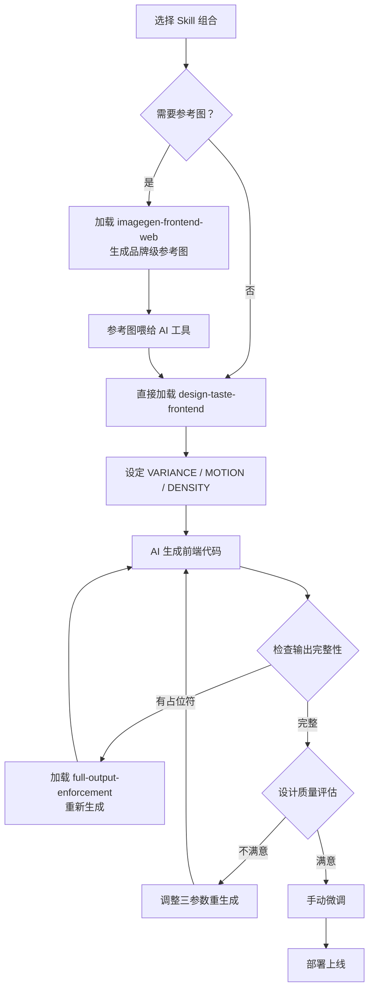

+++
date = '2026-05-26T16:16:40+08:00'
draft = false
title = 'Taste Skill：给AI的前端注入「审美品味」，告别千篇一律的slop UI'
+++

让 AI 写一个登录页，你大概率会得到：居中卡片、渐变按钮、`box-shadow: 0 4px 12px rgba(0,0,0,0.15)`。让 AI 写一个 Dashboard，它给你三列卡片网格配蓝色 CTA。这不是模型不够聪明——你让它写 JSON Schema 它能精确到字段级别的约束，让它写 SQL 它能给出三套优化方案。问题出在**前端设计意图的传递通道是断的**。

代码质量 ≠ 设计质量。LLM 能理解语法，但不理解「这个页面应该有呼吸感」或者「按钮的微交互应该给用户一种可靠的触觉反馈」。你没法用自然语言精确描述设计意图，于是 AI 退回到它见过最多的安全模式：居中、sans-serif、system color scheme。这就是所谓的 **slop**。

[Taste Skill](https://github.com/Leonxlnx/taste-skill) 是 Leonxlnx 开源的答案。不是又一个 UI 组件库，不是 Tailwind 插件，而是一套嵌入 AI 编程工具（Claude Code、Codex CLI、Cursor）的**设计指导 Skills**，让 AI 在生成代码之前先建立起设计约束。项目在 GitHub 上积累了 20K+ Stars，MIT 协议。

> 延伸阅读：[stop-slop：把 AI 写作从套话和模板句里拽出来的 skill]() 处理文字成稿的 slop；本文聚焦界面生成阶段的 slop。

---

## Skill 矩阵：从保守到激进，覆盖九种设计意图

通过 `npx skills add` 一键安装，Skill 文件本身是符合 Vercel Agent Skills 规范的 Markdown，框架无关——React、Vue、Svelte 均可用。

| Skill | 安装名 | 定位 |
|---|---|---|
| **taste-skill (v2)** | `design-taste-frontend` | 默认首选，含 VARIANCE / MOTION / DENSITY 三参数调节 |
| **taste-skill-v1** | `design-taste-frontend-v1` | 保守版，已依赖 v1 行为的项目用 |
| **gpt-taste** | `gpt-taste` | 针对 GPT/Codex 强化布局差异化 + GSAP 动画指导 |
| **image-to-code** | `image-to-code` | 参考图 → 设计语言分析 → 前端实现，端到端流水线 |
| **redesign** | `redesign-existing-projects` | UI 审计后修复，适合遗产项目翻新 |
| **soft** | `high-end-visual-design` | 低对比度、大留白、Spring 动效，高端柔和风格 |
| **minimalist** | `minimalist-ui` | Notion/Linear 级别的编辑产品 UI |
| **brutalist** | `industrial-brutalist-ui` | 瑞士印刷风格，硬核机械语言 |
| **output** | `full-output-enforcement` | 强制完整输出，阻断 AI 的「TODO: implement later」占位符 |

另有图像生成类 Skills（`imagegen-frontend-web`、`imagegen-frontend-mobile`、`brandkit`），配合 ChatGPT Images 或 Codex image mode 使用——先生成参考图，再喂给 AI 工具实现。还提供 `stitch-skill`，导出标准 `DESIGN.md` 格式对接 Google Stitch 工作流。

---

## 三个旋钮控制设计输出：VARIANCE / MOTION / DENSITY

Taste Skill v2 的灵魂不在规则列表里，而在三个连续刻度上。每个参数 1-10，不同组合产生完全不同的设计语言。这不是简单的「高更好」或「低更好」——一组好的参数取决于你要构建什么。

### DESIGN_VARIANCE（布局实验度，1-10）

控制 AI 对布局规范的偏离程度。

| 值 | 行为 |
|---|---|
| 1-3 | 居中对称、经典栅格、可预测的信息架构 |
| 4-6 | 局部打破对称、非均匀间距、有意识的视觉节奏 |
| 7-10 | 激进的非对称布局、打破视口边界、杂志级排版实验 |

### MOTION_INTENSITY（动效深度，1-10）

控制 AI 注入多少动画代码及动画的复杂度层级。

| 值 | 行为 |
|---|---|
| 1-3 | 仅 `:hover` 和 `transition` 基础反馈 |
| 4-6 | 滚动触发 reveal、stagger 序列、CSS `@keyframes` |
| 7-10 | 视差滚动、磁吸光标、GSAP timeline、`useScroll`/`useTransform` |

### VISUAL_DENSITY（信息密度，1-10）

控制单位视口内承载的信息量与留白策略。

| 值 | 行为 |
|---|---|
| 1-3 | 大留白、大字号、单屏只传递一个核心信息（Landing Page 典型） |
| 4-6 | 中等密度，信息分组清晰，留白做功能分区 |
| 7-10 | 数据密集型仪表盘、多列实时数据、紧凑但有序 |

---

## 实战：三组参数配置的对照效果

下面用同一个场景——「SaaS 产品 Landing Page + Dashboard」——展示不同参数组合如何产出完全不同的设计结果。

### 配置 A：「极简叙事型」——品牌展示页

```
VARIANCE: 3, MOTION: 5, DENSITY: 2
```

AI 生成的设计特征：

- **布局**：居中 Hero，大标题 + 副标题垂直堆叠，单列内容流
- **动效**：Hero 区域 SVG 背景微动 + 滚动触发 sections fade-in
- **密度**：每屏只承载一个核心信息块、80px+ 间距、标题字号 48-72px
- **配色倾向**：低饱和主色 + 大量 neutral 灰阶留白

适合：SaaS 官网 Hero、产品发布页、品牌故事页。

### 配置 B：「现代 SaaS」——兼顾展示与转化

```
VARIANCE: 6, MOTION: 7, DENSITY: 5
```

AI 生成的设计特征：

- **布局**：非对称 Hero（左文右图偏移 15%）、Features 区三列不等宽栅格、CTA 区打破网格突出
- **动效**：Hero 区视差层叠（前景图速率 1.2x 背景）、Feature 卡片 hover 时 3D rotate + glow、CTA 按钮 magnetic 光标效果
- **密度**：中等留白、信息分组用 subtle border + 浅色背景块区分、字号层级 5 档
- **配色倾向**：品牌主色 + 辅助 accent 色点缀、dark section 穿插

适合：SaaS 产品主页、开发者工具 Landing、技术产品官网。

### 配置 C：「数据密集型」——实时运营大屏

```
VARIANCE: 8, MOTION: 4, DENSITY: 9
```

AI 生成的设计特征：

- **布局**：非标准 4+4+2 列网格、左上 KPI 卡片组、右半区时序折线图 + 实时日志流、底部横向滚动事件时间线
- **动效**：KPI 数字滚动动画、折线图实时推进、新事件淡入（克制动画以免分散注意力）
- **密度**：每视口 20+ 数据点、紧凑 8px grid、字体 11-13px、颜色做数据编码
- **配色倾向**：深色背景、数据用高对比度单色系、告警用红/橙

适合：运营 Dashboard、实时监控、数据分析平台。

### 组合矩阵速查

```
         VARIANCE  MOTION  DENSITY  典型场景
配置 A      3         5        2    品牌 Landing Page
配置 B      6         7        5    SaaS 产品主页
配置 C      8         4        9    实时数据大屏
极端实验   10         9        3    创意作品集 / 艺术家页面
保守落地    1         2        5    企业内部工具 / 管理后台
```

---

## 完整工作流：从零到可上线 UI 的闭环



流程的关键节点：

1. **参考图不是必须的**——简单场景直接设参数即可，参考图用于需要精确品牌表达的场合
2. **三参数决定了 80% 的设计差异**——同样是 Landing Page，配置 A 和配置 B 产出像是两个设计师的作品
3. **`full-output-enforcement` 是最后一道防线**——阻止 AI 输出 `// Add responsive styles here` 这类半成品
4. **迭代成本极低**——改一个参数值重新对话，而不是重写 prompt

---

## 安装与第一天使用

```bash
npx skills add https://github.com/Leonxlnx/taste-skill
```

单个 skill 安装：

```bash
npx skills add https://github.com/Leonxlnx/taste-skill --skill "design-taste-frontend"
```

没有 `npx skills` 环境的话，直接把仓库中对应 `SKILL.md` 内容粘贴到 Claude Code / ChatGPT / Codex 对话窗口，效果一致。

**第一天建议路径**：安装 `design-taste-frontend` → 用配置 A（V3, M5, D2）生成一个简单 Landing Page → 观察输出 → 调参重试 → 感受参数对设计的影响。

---

## 与 stop-slop 的定位边界

| 工具 | 作用域 | 机制 |
|---|---|---|
| **stop-slop** | AI 文本输出 | Prompt 规则约束，去除 hallmark、delve 等套话 |
| **Taste Skill** | AI 前端代码输出 | 设计约束框架，在代码生成阶段注入设计意图 |

一个管文字，一个管界面。同一个仓库里两个项目解决的是 AI 输出质量的不同维度。

---

## FAQ

### Q1: Taste Skill 和直接用 Figma 出设计稿再给 AI 有什么区别？

Figma 设计稿是像素级精确的，但制作成本高、迭代慢。Taste Skill 走的是另一种路径：用参数化约束在代码生成阶段引导 AI 的设计决策。适合快速原型和独立开发场景——你不需要先成为设计师才能产出不丑的界面。

### Q2: VARIANCE / MOTION / DENSITY 三个参数会不会互相冲突？

不会冲突，但会产生不同的「化学效应」。例如高 VARIANCE（9）+ 高 DENSITY（9）会让页面非常激进且信息量爆炸——适合创意作品集，不适合企业后台。关键不是参数高低，而是组合是否匹配场景。建议从默认组合（V5, M5, D5）开始，一次只调一个参数来感受变化。

### Q3: 我是后端开发者，完全不懂设计，能用好吗？

这正是 Taste Skill 的目标用户。你不需要懂设计术语，只需要描述场景（「我要一个 SaaS Landing Page」）并设定参数。三个参数的含义比 CSS Grid 简单得多——数字越大越激进/更有动效/更密集。

### Q4: 生成的代码质量如何？需要大量手改吗？

代码本身是可运行的标准前端代码（HTML/CSS/JS 或 React/Vue/Svelte 组件），不需要为了让它跑起来而修改。风格层面的微调通常集中在间距、颜色、字体这些 5 分钟内能改完的细节。搭配 `full-output-enforcement` 可以避免 AI 输出半成品。

### Q5: 能否和其他 Agent Skills 叠加使用？

可以。Taste Skill 聚焦设计层面，你可以同时加载测试类 Skill、数据库 Skill、API 设计 Skill 等，它们分别控制 AI 输出的不同维度。叠加时注意不要在 prompt 中出现互相矛盾的设计指令。

### Q6: v1 和 v2 怎么选？

新项目直接用 v2（`design-taste-frontend`）。v1 保留给已有项目——如果你的项目之前已经基于 v1 产出了大量代码，贸然切换 v2 可能导致风格不一致。v1 行为更保守，生成的 UI 更接近传统 Web 范式。

### Q7: Taste Skill 适合移动端吗？

适合。`imagegen-frontend-mobile` 专门针对 iOS/Android 生成移动端设计参考图。核心 Skill 本身框架无关，生成的 React/Vue/Svelte 代码配合响应式断点即可适配移动端。DENSITY 参数对移动端尤其关键——小屏上 DENSITY 建议不超过 5。

---

## 自检测试

完成安装和首次使用后，按以下清单逐项验证：

- [ ] **调用验证**：在 AI 编程工具中输入 `/design-taste-frontend` 或对应 skill 名，确认 AI 能正确识别并加载设计约束
- [ ] **参数生效**：分别用 V1 和 V9 生成同一个页面的 Hero Section，确认布局从「居中对称」变为「明显非对称」
- [ ] **反 slop 检查**：生成代码中不出现 `box-shadow: 0 4px 12px` + 标准渐变按钮的组合，配色不使用 `#3B82F6` 蓝色 + `#10B981` 绿色的默认 system palette
- [ ] **Image-to-Code 管线**：用 `imagegen-frontend-web` 生成参考图 → 加载 `image-to-code` → 确认生成的代码结构与参考图的视觉布局一致
- [ ] **完整输出**：加载 `full-output-enforcement` 后生成代码，确认不包含 `// TODO`、`/* implement */`、`placeholder` 等占位符
- [ ] **动效层次**：MOTION ≥ 6 时，生成代码应包含至少两种不同类型的动画（如 scroll-triggered reveal + hover micro-interaction），且动画性能使用 GPU 加速属性（`transform`/`opacity`）
- [ ] **响应式行为**：生成的页面在 375px / 768px / 1440px 三个断点下布局正常、无横向溢出、可点击区域 ≥ 44px

---

## 技术事实

- 实现语言：Shell + Markdown（Skill 定义文件，含 YAML 元数据）
- 分发机制：`npx skills add`，基于 Vercel Agent Skills 规范
- 兼容性：框架无关，React / Vue / Svelte / 原生 HTML 均可
- 协议：MIT，2026
- 官网：[tasteskill.dev](https://tasteskill.dev)

---

20K+ Stars 不是偶然。当 AI 编程从「能不能写」走到「写得好不好」的阶段，设计质量会像代码质量一样成为刚需。Taste Skill 目前是这个方向上最完整的开源方案。

建议从 `design-taste-frontend`（v2）开始，花 15 分钟用三个不同参数组合生成同一个页面——你会直观感受到「给 AI 注入品味」到底意味着什么。