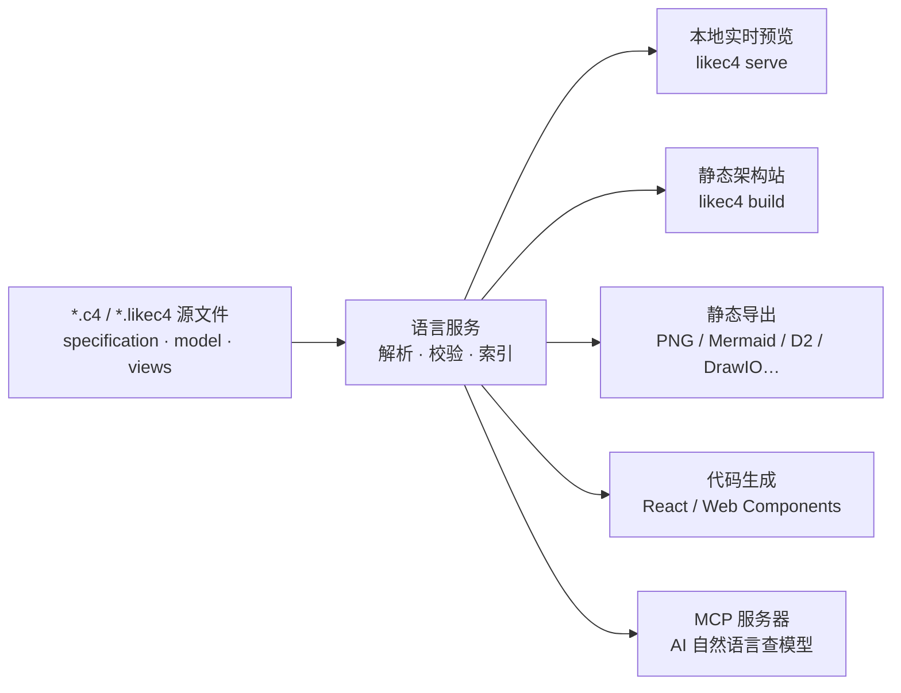

## 核心判断

架构图的宿命是过时。你在 Confluence 里找到的那张系统架构图，大概率是三个月前某个人用 Draw.io 画的，之后系统已经变了五次。

LikeC4 的判断是：架构图不应该是手工维护的产物，而应该是从代码生成的、与实际系统同源的视图。它提供一门专门的 DSL 来描述架构，配上一个实时预览工具链——改一行 DSL，图立刻变；系统演进以 Git 提交的形式沉淀，图的演进历史就是提交历史。

## 它是什么

[LikeC4](https://github.com/likec4/likec4) 是一个架构建模语言加工具链，TypeScript 编写，MIT 许可，2023 年 3 月创建，截至目前（2026-09-25 GitHub 读数）约 5700 stars。官方一句话定位：**用始终最新的、由代码生成的动态图表来可视化、协作和演进软件架构**。

灵感来自 [C4 Model](https://c4model.com/) 和 Structurizr DSL，README 原话说它 "provides some flexibility"——你可以自定义元素类型、表示法，嵌套层级也不受 C4 四层（Person/System/Container/Component）的约束。所以 LikeC4 不是 C4 的严格实现，而是"C4 风格但按你的团队习惯塑形"的建模工具。顺带一提，它的灵感来源之一 Structurizr DSL 仓库已在 2025 年底并入 [structurizr/structurizr](https://github.com/structurizr/structurizr) monorepo，旧链接已失效。

先看系统全景，后文逐块展开：



左边是输入：一组纯文本源文件，进 Git 版本控制。右边是同一份模型派生出的五种形态——开发时预览、发布成网站、导出静态图、嵌入应用、交给 AI 查询。架构描述只写一遍。

## DSL：specification、model、views 三块

源文件以 `.c4` 或 `.likec4` 为扩展名，仓库里所有源文件会被合并成一个模型，所以大团队可以按服务拆文件。每个文件由若干顶层语句组成，最核心的三块是 `specification`、`model`、`views`。

`specification` 定义你的架构词汇表——元素种类、关系种类、标签、颜色。`person` 和 `container` **不是**内置关键字（这是它与 Structurizr DSL 的关键区别），你定义什么，模型里就有什么：

```likec4
specification {
  element actor
  element system
  element component

  tag experimental
}
```

`model` 用这些词汇描述真实的元素、嵌套和关系：

```likec4
model {
  customer = actor 'Customer'

  pay = system 'Payment Platform' {
    console = component 'Merchant Console' {
      style {
        shape browser
      }
    }
    api = component 'Payment API'
    ledger = component 'Ledger Service' {
      #experimental
      technology 'Go'
    }
  }

  customer -> console 'opens in browser'
  console -> api 'HTTPS'
  api -> ledger 'gRPC'
}
```

元素可以带标题、技术栈、标签、样式；关系可以带标签（`'HTTPS'` 这类交互说明）。元素种类还能在 `specification` 里预置默认属性和样式——比如让所有 `queue` 类型自动渲染成队列形状。

`views` 从模型投影出图。图不是画出来的，是用谓词（include/exclude）从模型筛出来的：

```likec4
views {
  view index {
    title 'Landscape'
    include *
  }

  view pay of pay {
    include *
  }
}
```

`include *` 只取顶层元素，并把嵌套元素间的已知关系向上归纳——所以一张全景图和一张局部放大图读的是同一个模型，天然不会互相矛盾。视图支持 `extends` 继承（在父视图基础上加细节）、命名视图之间的点击跳转；如果不定义 `index` 视图，工具会自动生成一张包含全部顶层元素的默认图。

两块进阶能力值得一提。**动态视图**（dynamic views）把一个具体用例——比如"一笔支付请求的完整链路"——作为场景定义在视图里，不污染共享模型，适合画时序式的交互讲解。**部署模型**（deployment）则用独立的 `deploymentNodes` 语义描述服务实际跑在哪些环境里，与逻辑模型分开维护。这两块语法较深，建议直接读官方 [Views](https://likec4.dev/dsl/views/) 与 [Deployment](https://likec4.dev/dsl/deployment/model/) 文档。

## 工具链：一个 CLI 和一排编辑器

`likec4` 是个 npm 包（Node.js 20+），当前版本线 1.59.x。子命令覆盖了架构图的完整生命周期：

```sh
# 本地实时预览：递归搜索 *.c4/*.likec4，起本地服务器，改源码热更新
npx likec4 serve        # start / dev 是它的别名

# 构建单页静态架构站，可直接部署到 GitHub Pages / Netlify
likec4 build -o ./dist

# 导出静态图：PNG（经 Playwright 截图）、Mermaid、Dot、D2、PlantUML、DrawIO
likec4 export png -o ./assets
likec4 codegen mermaid

# 反向迁移：把存量 DrawIO 图转成 LikeC4 源码
likec4 import drawio diagram.drawio -o src/model.c4

# 生成代码：React 组件、Web Components，把图嵌进自己的应用
likec4 codegen react --outfile ./src/likec4.generated.tsx

# 启动 MCP 服务器（下节展开）
likec4 mcp --http
```

编辑器侧，官方 [VS Code 扩展](https://marketplace.visualstudio.com/items?itemName=likec4.likec4-vscode)提供校验与错误报告、语义高亮、可交互的实时预览、补全与跳转、查找引用、安全重命名。其他编辑器各有路径：JetBrains IDE 有官方插件（[likec4/jetbrains-plugin](https://github.com/likec4/jetbrains-plugin)，语法高亮加 LSP 集成），Neovim 有 [likec4.nvim](https://github.com/likec4/likec4.nvim)，Emacs 用 Eglot（29 内置）或 lsp-mode 接独立语言服务器，Zed 有社区扩展。非 VS Code 系编辑器的通用底座是 `npm install -g @likec4/lsp`——一个零依赖的独立语言服务器。CI 侧有官方 GitHub Action [`likec4/actions@v1`](https://likec4.dev/tooling/github/)，支持构建站点、导出 PNG、生成代码三类任务。

## AI 集成：Agent Skills 与 MCP 服务器

这是 LikeC4 区别于上一代架构即代码工具的地方，官方文档专门有 [AI Tools](https://likec4.dev/tooling/ai-tools/) 一节。

**Agent Skills** 让 AI 编码助手学会 DSL 语法。一条命令装进项目：

```sh
npx skills add https://likec4.dev/
```

它通过 Agent Skills 发现协议分发 `likec4-dsl` 技能——一份完整的 DSL 参考，Claude Code、Cursor、Windsurf 等支持该协议的智能体在编辑 `.c4` 文件时自动加载，按官方说法，目的是让智能体写 DSL 时"不靠幻觉"。

**MCP 服务器**把架构模型暴露给大模型查询。三种启动方式：VS Code 扩展内置（装好扩展即自动注册）；`likec4 mcp`（stdio 或 HTTP 传输，HTTP 默认端口 33335）；独立的 `@likec4/mcp` 包。装好后你可以直接问：

- "找出 backend api 的所有入向依赖"
- "列出所有打了 legacy 标签的元素"
- "Backend 和 Amazon SQS 之间的关系导出成 CSV"

服务器提供 20 个工具，覆盖列出项目、按标签/元数据检索元素、查询上下游依赖图、多跳关系路径发现、甚至不落盘直接预览一段 DSL 草稿（`preview-view`，适合在对话里边聊边改图）。架构知识从此有了机器可读的出口——这对维护上百个服务的大型团队，比"图好看"重要得多。

## 一次改动如何流过系统

假设支付平台要新增一个风控服务，看看架构图在这个流程里的位置：

1. **改模型**：在 `model` 里给 `pay` 系统加一行 `risk = component 'Risk Service'`，加上 `api -> risk '同步校验'` 的关系。保存，VS Code 里的预览即时更新——不需要打开任何画图软件。
2. **调视图**：全景图 `include *` 自动把新服务纳入；如果担心全景太密，给风控链路单独做一个 `view`，用 `extends` 从现有视图继承再收窄范围。
3. **过评审**：提 PR。CI 里 `likec4/actions` 导出最新 PNG，图随 PR 走；评审者看到的关系变更就是 diff 里的两行 DSL，而不是一张无从对账的截图。
4. **发布**：合并后 GitHub Pages 上的架构站自动重建。任何人打开看到的都是当前主干的真实结构。
5. **问模型**：三周后有人想知道"谁依赖风控服务"，不用翻图——对 MCP 服务器说一句话，拿到准确的上下游清单。

图和代码从此是同一份事实的两个视图。这正是"架构即代码"要兑现的承诺。

## 与其他工具怎么比

| 工具 | 方式 | 版本控制 | 自定义程度 |
|------|------|---------|---------|
| Draw.io / Lucidchart | 手动拖拽 | 困难（XML 可入库但与代码无关联） | 高，但无结构约束 |
| PlantUML | 文本生成图 | 支持 | 中，语法固定 |
| Structurizr DSL | 面向 C4 模型的 DSL | 支持 | 低，类型集固定为 C4 抽象 |
| **LikeC4** | DSL + 本地实时预览 + 多形态导出 | 支持 | 高，词汇表自定义 |

LikeC4 的差异化是三件事同时成立：源文件进 Git、本地预览随写随变、表示法不锁死在 C4 四层上。代价是要学一门 DSL——好在语法面不大，核心就是 specification、model、views 三个块，而且 AI 技能包可以让助手代写大部分样板。

## 适用边界

**适合**：

- 微服务/分布式系统的架构文档化——服务越多，"图跟代码走"的收益越大
- 架构需要多团队共享、且希望 AI 能查询架构知识的组织
- 已有 C4 或 Structurizr 背景的团队，词汇表可以无缝映射
- 存量 DrawIO 图想升级为可维护源码的团队（有官方导入通道）

**不适合**：

- 画一张就扔的一次性示意图——打开 Draw.io 更快
- 需要自由绘制非结构化图形（插画、流程图嵌套画布）的场景，DSL 的结构约束此时是负担
- 团队无法接受"先学一点语法"的前置成本且没有 AI 助手兜底的情况

## 上手建议

按这个顺序最省力：先在 [Playground](https://playground.likec4.dev/) 里花十分钟过一遍[官方教程](https://likec4.dev/tutorial/)，感受 specification-model-views 的三层结构；然后在你的仓库里建一个 `docs/architecture/` 目录，只给**最核心的一条调用链路**建模——不要试图一次画完整个系统；装上 VS Code 扩展和 Agent Skills，让编辑器和 AI 帮你补细节；等模型稳定了，再用 `likec4 build` 发布架构站、接上 GitHub Actions 自动化。模板仓库 [likec4/template](https://github.com/likec4/template) 有可参照的完整工程结构（部署示例见 [template.likec4.dev](https://template.likec4.dev/)）。

判断标准很简单：如果你的架构图更新频率追不上系统变更频率，就该让图变成代码；如果图一个月才变一次，手动画仍然是更便宜的选择。

---

### 参考来源与口径说明

- 项目数据（stars/forks/创建时间/许可证/语言）来自 GitHub API，2026-09-25 读数；版本口径以 npm `likec4` 1.59.4（2026-09 发布）与文档站 Changelog 为锚。
- DSL 语法、CLI 子命令、MCP 工具清单、编辑器支持、Agent Skills 安装方式，均对照 2026-09 的官方来源核实：GitHub README 与 `packages/likec4/README.md`、likec4.dev 各文档页（Tutorial / Specification / Views / AI Tools / Editors / GitHub Actions）。MCP 工具数为官方工具表逐项计数。
- `person`/`container` 等类型在 LikeC4 中需经 `specification` 定义，系与 Structurizr DSL 的关键语法差异，依据官方 Tutorial 全文。
- Structurizr DSL 仓库（github.com/structurizr/dsl）已于 2025 年底并入 structurizr/structurizr monorepo（monorepo 创建于 2025-11-30），旧链接 404；文中已改用新地址。
- 模板部署示例的深链（`/view/index`、`/view/boutique/`）在核查时均已 404（官方 README 中的深链同样失效），文中只引用仍然有效的根域名。
