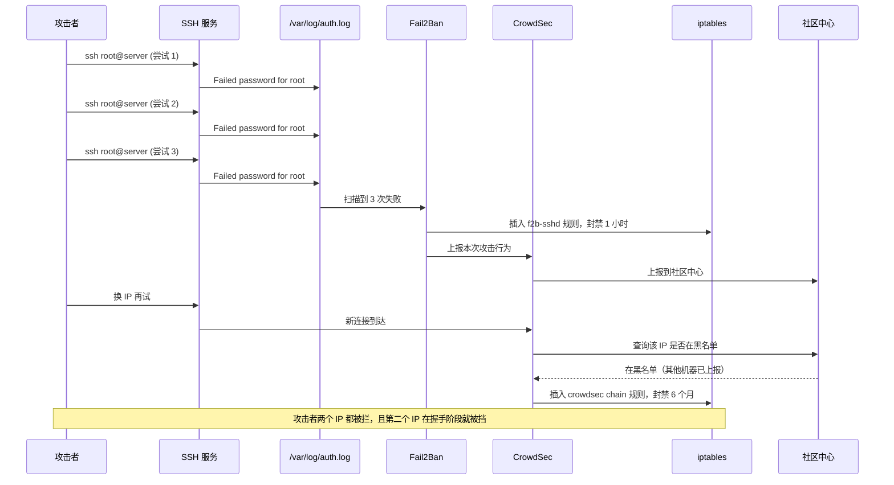
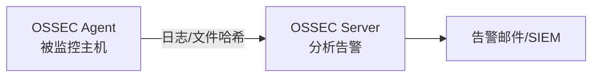

# Linux 服务器安全加固实战指南：从 SSH 到防火墙的完整清单

Linux 服务器安全加固的核心是按攻击面分层收敛——身份认证、网络入口、文件系统、运行时检测——每一层都有最小必要措施，也都有过度加固的代价。工具装多了不一定更安全：规则互相冲突会让合法流量被误伤，日志被噪声淹没会让真正的入侵信号沉到底部。

底本是社区共建项目 **How-To-Secure-A-Linux-Server**（GitHub: imthenachoman/How-To-Secure-A-Linux-Server，27,000+ Stars，持续更新）。项目本身是一份很好的 Checklist，缺的是"为什么这一项排在前面""什么时候不该照搬"——这两件事正是下面要补的。

## 这篇指南适合谁、解决什么问题

适合已经能在 Linux 上跑服务、但还没系统做过安全加固的运维工程师和 DevSecOps 实践者。读完后应该能回答三个问题：

- 每一项加固措施挡的是哪类攻击，不装会怎样
- Fail2Ban、CrowdSec、PSAD、OSSEC 这些工具的职责边界在哪里，哪些会重叠
- 个人服务器、企业生产、多租户环境分别该上到哪一层，停在哪里

文章不覆盖内核漏洞利用、0day 防御、物理安全这些超出主机加固范畴的话题。如果对手是国家级 APT，主机加固只是底线，不是终点。

## 目录

1. [这篇指南适合谁、解决什么问题](#这篇指南适合谁解决什么问题)
2. [加固地图：四层攻击面与对应措施](#加固地图四层攻击面与对应措施)
3. [第一道关口：SSH 从开放服务收成受邀入口](#第一道关口ssh-从开放服务收成受邀入口)
4. [身份与权限：让 root 退出日常操作](#身份与权限让-root-退出日常操作)
5. [防火墙与入侵检测：UFW、Fail2Ban、CrowdSec 各管什么](#防火墙与入侵检测ufwfail2bancrowdsec-各管什么)
6. [安全审计与恶意软件检测：发现"已经被攻破"](#安全审计与恶意软件检测发现已经被攻破)
7. [/proc 与内核参数：多租户环境的关键隔离](#proc-与内核参数多租户环境的关键隔离)
8. [适用边界与采用顺序](#适用边界与采用顺序)
9. [快速部署清单](#快速部署清单)
10. [常见问题](#常见问题)
11. [加固的判断标准：能不能答清楚四个问题](#加固的判断标准能不能答清楚四个问题)

## 加固地图：四层攻击面与对应措施

Linux 服务器的攻击面可以粗略拆成四层。从外到内依次是：身份认证（谁能登录）、网络入口（哪些端口能被触达）、文件系统（被登录之后能看到什么）、运行时检测（被攻破之后能不能发现）。四层之间是兜底关系——前一层失守，后一层要把损失限制住。

```mermaid
flowchart TB
    A[攻击者] --> B{身份认证层}
    B -->|密码爆破| C[Fail2Ban / CrowdSec]
    B -->|密钥泄露| D[2FA / 来源 IP 限制]
    B -->|通过| E{网络入口层}
    E -->|端口扫描| F[UFW / iptables]
    E -->|通过| G{文件系统层}
    G -->|提权| H[sudo 限制 / PAM]
    G -->|信息收集| I[/proc 隔离]
    G -->|持久化| J[Lynis / OSSEC / Rkhunter]
    J --> K[运行时检测层]
    C --> K
    K --> L[告警 / 封禁 / 审计报告]
```

四层职责对照如下：

| 层级 | 主要威胁 | 核心措施 | 过度加固的代价 |
|------|---------|---------|---------------|
| 身份认证 | 密码爆破、密钥泄露、凭证复用 | 密钥认证、2FA、来源 IP 限制 | 2FA 设备丢失导致锁死自己 |
| 网络入口 | 端口扫描、未授权服务暴露 | UFW 默认拒绝、Fail2Ban、CrowdSec | 规则过严导致业务流量被误伤 |
| 文件系统 | 提权、信息泄露、持久化后门 | sudo 收敛、PAM 策略、/proc 隔离 | 多租户场景下误杀正常用户 |
| 运行时检测 | 已被攻破但未发现 | Lynis 体检、OSSEC 完整性监控、Logwatch | 告警噪声过大，真实事件被淹没 |

每一层先说"为什么需要"，再给具体配置，最后给排查与回滚。

## 第一道关口：SSH 从开放服务收成受邀入口

SSH 是 Linux 服务器暴露面最大的服务，也是绝大多数自动化攻击的入口。Shodan 上 22 端口暴露的主机数以百万计，每台暴露的主机每天收到的 SSH 暴力破解尝试通常以千计。把 SSH 从对全网开放的登录服务收成只对受邀来源开放的入口，这一步收益最大、成本最低。

### 为什么密码登录是最大的攻击面

密码登录的根本问题是密码可以被穷举，"密码不够强"只是把穷举难度调高了一档。即使设置了 `minlen = 14`、要求大小写数字符号组合，攻击者只要字典足够大、时间足够长，总有机会撞中——更何况很多用户的"强密码"其实是 `Welcome2024!` 这种符合规则但出现在泄露字典里的字符串。密钥认证把信任从"你知道什么"换成"你持有什么"，攻击者必须先拿到私钥文件才能开始尝试，攻击成本从"跑脚本"上升到"入侵你的本地机器"。

### 公私钥认证：禁用密码登录

```bash
# 本地生成密钥对
ssh-keygen -t ed25519 -C "my-server-key"

# 上传公钥到服务器
ssh-copy-id -i ~/.ssh/id_ed25519.pub user@your-server-ip

# 服务端禁用密码登录
sudo vim /etc/ssh/sshd_config
```

```bash
# /etc/ssh/sshd_config 关键配置
PasswordAuthentication no
PubkeyAuthentication yes
PermitRootLogin no
MaxAuthTries 3
ClientAliveInterval 300
TCPKeepAlive yes
```

```bash
sudo systemctl restart sshd
```

`PasswordAuthentication no` 是这一组配置里最关键的一行。改之前务必确认两件事：一是公钥已经能正常登录，二是有一个开着的 root 会话或带 sudo 的会话作为回滚通道——`sshd` 重启失败时你不会想靠"密码登录"救场，因为密码登录已经被关了。

`PermitRootLogin no` 强制所有特权操作走 `sudo`，这样 root 的操作会被记录到 `/var/log/auth.log`，事后能审计。如果允许 root 直接登录，攻击者拿到 root 密码就等于拿到一切，且没有审计痕迹。

### 限制 SSH 访问的 IP 段

```bash
# 仅允许特定 IP 访问 SSH（建议配合 VPN 或堡垒机）
AllowUsers user@10.0.0.0/8
AllowUsers user@192.168.1.0/24
```

`AllowUsers` 比 `PasswordAuthentication no` 更靠前的一道防线：不在白名单里的来源连 TCP 握手都过不了 SSH 进程。代价是来源 IP 变了就得改配置——出差、临时办公网络、家庭宽带动态 IP 都会让这条规则变成"自己锁死自己"。生产环境通常配合堡垒机或 VPN 使用，让 SSH 来源收敛到一个固定网段。

### 2FA：在密钥泄露和密钥未泄露之间加一道时间窗

密钥认证挡住了密码爆破，但挡不住密钥泄露——笔记本被偷、备份同步到云盘、CI runner 上的 deploy key 被拉走，都会让私钥落到攻击者手里。2FA（双因素认证）解决的就是这个问题：即使私钥泄露，攻击者还需要拿到用户手机上 30 秒一变的 TOTP 码才能登录。

```bash
# 安装 Google Authenticator PAM 模块（Ubuntu/Debian）
sudo apt install libpam-google-authenticator

# 用户端配置（每个用户运行一次）
google-authenticator

# 服务端 /etc/pam.d/sshd 添加
auth required pam_google_authenticator.so

# /etc/ssh/sshd_config 启用
AuthenticationMethods publickey,keyboard-interactive
```

`AuthenticationMethods publickey,keyboard-interactive` 这一行把认证从"任一通过即可"改成"两者都要通过"。注意 OpenSSH 8.2 之前的版本对 `keyboard-interactive` 的支持有限，老系统升级前先确认版本。

2FA 的代价是运维负担：每个用户都要在自己机器上跑一次 `google-authenticator`、扫码绑定、保存应急码。用户换手机、丢手机、应急码丢失都会导致账号锁死。团队规模大时建议配合中央身份系统（如 FreeIPA、JumpCloud）统一管理 TOTP，而不是每台机器各自配置。

### 排查与回滚

SSH 加固最容易踩的坑是"改完配置重启 sshd 后自己进不去了"。两个原则：

- 改 `sshd_config` 前先开第二个会话作为回滚通道，验证新配置生效后再关闭
- 用 `sudo sshd -t` 在重启前做语法检查，能挡住 90% 的配置错误

如果真的被锁在外面，回滚路径通常是：云厂商控制台的 VNC/串口 控制台、带外管理（IPMI/iLO）、或者挂载磁盘改配置。这些路径在生产环境不一定都开放，所以"改前先验证"比"出事再救"成本低得多。

## 身份与权限：让 root 退出日常操作

SSH 加固挡住了"外人登录"，但登录之后的权限管理同样重要。一个普通用户账号被攻破，如果 sudo 配置宽松，攻击者几步就能拿到 root。这一层的目标是：即使某个用户账号失守，攻击者能做的事也被限制在最小范围。

### sudo 限制：收敛到具体命令，而不是给整个组开 ALL

```bash
# 查看当前 sudo 组成员
getent group sudo

# 限制只有特定用户组可以使用 sudo
echo "%sudo ALL=(ALL) ALL" | sudo tee /etc/sudoers.d/sudo-group

# 为特定用户配置无密码 sudo（谨慎使用）
username ALL=(ALL) NOPASSWD: /usr/bin/apt, /usr/bin/systemctl
```

`NOPASSWD` 看起来方便，实际是把"知道密码"这道确认环节去掉了。CI/CD runner 上常用 `NOPASSWD` 让部署脚本免交互，但范围必须严格收敛到具体命令——写成 `NOPASSWD: ALL` 等于把 root 权限完全交给这个用户，一旦账号被攻破，攻击者直接拿到 root。

给 CI 专用账号时，只允许 `NOPASSWD` 执行部署脚本本身，而不是 `apt`、`systemctl` 这些通用命令。`systemctl` 能跑任意 unit，`apt` 能装任意包，都比"跑一个固定脚本"危险得多。

### 强密码策略：在密钥登录之外给本地登录兜底

```bash
# Ubuntu/Debian 安装 libpam-pwquality
sudo apt install libpam-pwquality

# /etc/security/pwquality.conf 配置
minlen = 14
dcredit = -1  # 至少一位数字
ucredit = -1  # 至少一位大写
lcredit = -1  # 至少一位小写
maxclassrepeat = 4  # 同一字符最多连续出现4次
```

如果已经禁用了密码登录，密码策略还有没有用？有。本地控制台登录、`su` 切换、`sudo` 提权、单用户模式恢复——这些场景仍然走密码。密码策略管的是这些"非 SSH"路径的兜底强度。`pwquality` 的规则只能挡住"明显弱"的密码，挡不住"符合规则但出现在泄露字典里"的密码——配合 `libpam-cracklib` 或订阅 Have I Been Pwned 之类的泄露库查询能进一步收敛，但成本和复杂度也更高。

### 自动化安全更新：补丁装没装，得有邮件回执

```bash
# Ubuntu/Debian：配置无人值守升级
sudo apt install unattended-upgrades
sudo dpkg-reconfigure -plow unattended-upgrades
```

配置 `/etc/apt/apt.conf.d/50unattended-upgrades`：

```bash
Unattended-Upgrade::Mail "root@your-domain.com";
Unattended-Upgrade::AutomaticReboot "true";
Unattended-Upgrade::AutomaticRebootTime "03:00";
```

`unattended-upgrades` 默认只装安全补丁，不装功能升级，所以稳定性风险较低。这里要权衡的是 `AutomaticReboot "true"`：内核补丁需要重启才生效，自动重启意味着服务会中断一次。对个人服务器和小规模服务可以接受；对有严格 SLA 的生产服务，更常见的做法是 `AutomaticReboot "false"`，把重启纳入维护窗口统一调度。

`Mail` 配置很重要——它让你知道"今天装了什么补丁"。补丁管理最容易出问题的环节是"以为装了其实没装"，邮件报告比"我去检查一下"靠谱得多。

## 防火墙与入侵检测：UFW、Fail2Ban、CrowdSec 各管什么

这一层工具多，职责容易混。先划清边界：

- **UFW / iptables**：静态规则，决定哪些端口长期开放
- **Fail2Ban**：本地日志驱动，对短期重复失败行为做临时封禁
- **CrowdSec**：社区情报驱动，把本地攻击行为上报，同时拉取全球封禁列表
- **PSAD**：iptables 日志分析，介于 Fail2Ban 和 CrowdSec 之间，社区较小

它们覆盖的是不同时间尺度和不同来源的威胁，重叠有限。

### UFW：默认拒绝，按端口放行

```bash
# 安装并启用
sudo apt install ufw
sudo ufw enable

# 默认策略：拒绝入站，允许出站
sudo ufw default deny incoming
sudo ufw default allow outgoing

# 开放必要端口
sudo ufw allow 22/tcp comment 'SSH'
sudo ufw allow 80/tcp comment 'HTTP'
sudo ufw allow 443/tcp comment 'HTTPS'

# 限制 SSH 来源 IP（重要！）
sudo ufw allow from 10.0.0.0/8 to any port 22

# 查看规则
sudo ufw status verbose
```

`ufw enable` 之前一定要先 `ufw allow 22/tcp`，否则 SSH 会话会被立即切断。这是 UFW 最经典的"自己锁死自己"场景。`default deny incoming` 配合 `default allow outgoing` 是最稳的默认策略——入站严格白名单，出站默认放行，避免业务应用因为出站被拒而出现诡异故障。

### Fail2Ban：基于日志的本地封禁

```bash
sudo apt install fail2ban
sudo systemctl enable fail2ban

# /etc/fail2ban/jail.local
[DEFAULT]
bantime  = 3600
findtime  = 600
maxretry = 5

[sshd]
enabled  = true
port     = 22
filter   = sshd
logpath  = /var/log/auth.log
maxretry = 3

[nginx-http-auth]
enabled  = true
port     = 80,443
```

Fail2Ban 的工作方式是：扫描日志（`logpath`），用正则（`filter`）匹配失败行为，达到阈值（`maxretry`）就在指定时间窗口（`findtime`）内封禁一段时间（`bantime`）。它解决的是"低水平自动化扫描"——那些不会绕过密码登录但会持续骚扰日志的脚本。

`bantime = 3600` 只是起点。对真实攻击者来说，1 小时封禁等于"换 IP 再来"。生产环境常见做法是把 `bantime` 调到 24 小时甚至 1 周，或者配合 `recidive` jail 对反复犯事的 IP 做长期封禁。但 `bantime` 越长，误伤的成本越高——NAT 出口 IP 被封会导致整个办公室都连不上。

### CrowdSec：基于社区情报的协同封禁

```bash
# 安装
curl -s https://packagecloud.io/install/repositories/crowdsec/crowdsec/script.deb.sh | sudo bash
sudo apt install crowdsec crowdsec-firewall-bouncer-iptables

# 注册场景（自动下载防御规则）
sudo cscli scenarios list
sudo cscli scenarios enable crowdsecurity/http-crawlers
sudo cscli collections install crowdsecurity/linux
```

CrowdSec 和 Fail2Ban 的关键区别在情报来源。Fail2Ban 只看本机日志，封禁决策基于"这台机器上发生了什么"；CrowdSec 把本机检测到的攻击行为上报到社区中心，同时从社区拉取全球攻击者列表，在本机直接封禁。所以即使一台机器第一次被某个 IP 探测，只要这个 IP 在别处作过恶，CrowdSec 就能提前封掉。

### Fail2Ban 和 CrowdSec 怎么搭配

很多人问"装了 CrowdSec 还要不要 Fail2Ban"。答案取决于威胁模型：

- **个人服务器**：CrowdSec 单独够用，社区情报已经覆盖常见 SSH 爆破
- **企业生产**：两者并存。Fail2Ban 处理本机定制的失败模式（比如自研应用的登录失败），CrowdSec 处理通用攻击情报
- **多租户**：CrowdSec 优先，因为它能在攻击者碰到租户边界之前就拦掉

两者同时跑要注意：都往 iptables 写规则可能造成规则顺序混乱。CrowdSec 的 `firewall-bouncer` 默认用自己的 chain，Fail2Ban 默认用 `f2b-` 前缀的 chain，互不干扰，但调试时要分别用 `sudo iptables -L f2b-sshd -n` 和 `sudo cscli decisions list` 查看各自状态。

### 一次暴力破解攻击的完整路径

把上面三个工具串起来看一次真实攻击怎么流过系统：



这次攻击的几个关键点：

- Fail2Ban 响应快（秒级），但只看本机日志，挡不住"换 IP"
- CrowdSec 响应稍慢（依赖社区上报），但能跨机器共享情报
- 两者都通过 iptables 落地，所以封禁是内核层的，不会消耗用户态进程

### iptables + PSAD

```bash
# 安装 PSAD
sudo apt install psad

# /etc/psad/psad.conf 配置
EMAIL_ADDRESSES     your-email@example.com;
HOSTNAME            your-server;
IPT_SYSLOG_FILE     /var/log/syslog;
```

PSAD 会分析 iptables 日志，自动 ban 可疑 IP。它和 Fail2Ban 的区别是：Fail2Ban 看应用层日志（auth.log、nginx log），PSAD 看网络层日志（iptables 的 LOG target）。在 UFW 已经接管 iptables 规则的现代部署里，PSAD 的配置成本比 Fail2Ban 高不少，社区也较小，新部署更推荐 Fail2Ban + CrowdSec 组合。PSAD 适合已经维护了一套复杂 iptables 规则、需要网络层告警的存量环境。

## 安全审计与恶意软件检测：发现"已经被攻破"

前面几层都在挡"被攻破"，这一层换一个前提：假设机器已经被攻破，怎么发现。很多团队装了防火墙就以为安全工作做完了，直到数据泄露才发现机器三个月前就被种了后门。

### Lynis：配置层面的体检

```bash
sudo apt install lynis
sudo lynis audit system
```

Lynis 会输出一份完整的安全审计报告，包含建议修复项：

```text
[+] System Tools
-----------
  - Scanning for tools...
  - [WARNING] Missing tool: auditd (audit subsystem)
  - [WARNING] Missing tool: chkrootkit
  - [INFO] Present tool: iptables
```

Lynis 检查的是配置层面——有没有装 auditd、sudoers 是否宽松、SSH 配置是否合规。它不检测活跃入侵，而是告诉你"当前配置有哪些可被利用的弱点"。建议在每次重大变更后跑一次，把报告纳入变更评审。Lynis 的告警很多，不必每条都修，但要看懂每条告警对应的风险等级——`[WARNING]` 是配置缺陷，`[SUGGESTION]` 是最佳实践建议，优先级不同。

### OSSEC：文件完整性监控



```bash
# 服务端安装
sudo apt install ossec-hids

# 监控配置（/var/ossec/etc/ossec.conf）
<localfile>
  <log_format>syslog</log_format>
  <location>/var/log/auth.log</location>
</localfile>
```

OSSEC 最实用的是文件完整性监控（FIM）：对 `/etc`、`/usr/bin`、`/sbin` 等关键目录做哈希基线，文件被修改就告警。攻击者植入后门通常要改这些目录里的文件，FIM 能在"配置看起来正常但二进制被替换"的场景下发现入侵。代价是哈希基线需要维护——每次合法升级都会触发告警，需要人工确认。生产环境通常把 OSSEC 部署为 Agent-Server 架构，集中分析多台主机的告警。

### ClamAV 与 Rkhunter：恶意软件和 Rootkit 检测

```bash
sudo apt install clamav clamav-daemon
sudo systemctl stop clamav-freshclam
sudo freshclam  # 更新病毒库（首次较慢）

# 扫描指定目录
sudo clamscan -r /home -i --remove
# -r: 递归  -i: 只显示感染文件  --remove: 删除感染文件
```

```bash
sudo apt install rkhunter
sudo rkhunter --update
sudo rkhunter --check
```

ClamAV 是病毒扫描，主要针对文件上传服务、邮件网关这类"用户内容会落到磁盘"的场景。对纯 Linux 服务器，ClamAV 的价值有限——Linux 恶意软件样本少，且大多不靠"文件落地"传播。`--remove` 参数要慎用，误报会直接删用户文件，先 `-i` 只报告，人工确认后再处理。

Rkhunter 检测 Rootkit——检查系统二进制是否被替换、`/dev` 下有没有异常文件、内核模块是否被篡改。它和 OSSEC 的 FIM 互补：Rkhunter 是点检式扫描，OSSEC 是持续监控。Rkhunter 适合定期跑（比如每周 cron），OSSEC 适合常驻。

### Logwatch：把日志变成可读报告

```bash
sudo apt install logwatch

# 生成每日报告邮件
sudo logwatch --output mail --service all --range 'today'
```

Logwatch 把 `/var/log` 下的日志按服务汇总成每日邮件报告。它不负责发现攻击——攻击告警应该走 Fail2Ban/CrowdSec 的实时通道——它的作用是让你"每天扫一眼就知道昨天有没有异常"。SSH 登录成功次数、sudo 调用次数、磁盘错误、新装软件包这些信息分散在十几个日志文件里，Logwatch 把它们聚合成一封邮件，5 分钟就能看完。

## /proc 与内核参数：多租户环境的关键隔离

```bash
# 隐藏 PID（防止窥探进程）
sudo sysctl kernel.pid_max=99999

# 禁止查看其他用户进程
sudo sysctl kernel.yama.ptrace_scope=2

# /etc/sysctl.conf 永久配置
kernel.yama.ptrace_scope = 2
kernel.pid_max = 99999
fs.suid_dumpable = 0
```

这一组参数在个人服务器上几乎无感，但在多租户环境里是关键隔离。`ptrace_scope = 2` 意味着普通用户不能 `ptrace` 别人的进程——这挡住了"用 `strace` 偷看邻居进程内存"这类攻击。`pid_max` 限制 PID 取值范围，间接限制了信息泄露面（虽然 99999 仍然不小）。`fs.suid_dumpable = 0` 禁止 SUID 程序产生 core dump，避免敏感信息（如 `/etc/shadow` 的内容）通过 core dump 落到磁盘被读取。

多租户场景特别需要这些参数，因为攻击者本身就是合法用户——他有账号、能登录、能跑进程。前几层"挡住外人"的思路在这里失效，必须靠内核参数限制"登录之后能看到什么"。共享主机、CI runner、教学用服务器都属于这类场景。

## 适用边界与采用顺序

不同场景该上到哪一层，停在哪里：

| 场景 | 必上 | 推荐 | 可选 | 不建议 |
|------|------|------|------|--------|
| 个人 VPS | 密钥认证、UFW、unattended-upgrades | Fail2Ban、Lynis | 2FA、CrowdSec | OSSEC（维护成本高于收益） |
| 企业生产 | 全部个人 VPS 项 + sudo 收敛、来源 IP 限制 | 2FA、CrowdSec、Logwatch | OSSEC、ClamAV | NOPASSWD: ALL |
| 多租户 | 全部企业生产项 + /proc 隔离、ptrace_scope | OSSEC FIM、Rkhunter | CrowdSec 多机器联邦 | 允许租户间互访 |
| 高合规要求 | 全部多租户项 + 审计日志集中化 | OSSEC + SIEM 对接 | 文件完整性基线签名 | 任何形式的 NOPASSWD |

采用顺序上，建议按收益从高到低排：

1. **第一天**：密钥认证 + 禁用密码登录 + UFW 默认拒绝 + unattended-upgrades。这三项挡住 90% 的自动化攻击
2. **第一周**：Fail2Ban + sudo 收敛 + Lynis 首次审计。把"已经能登录"之后的权限边界收紧
3. **第一个月**：2FA + CrowdSec + Logwatch。建立持续检测和日报机制
4. **按需**：OSSEC、ClamAV、Rkhunter、/proc 隔离。根据威胁模型决定是否上

不要试图一次全装。每装一项都要验证它真的在工作（用 `fail2ban-client status sshd` 看 jail 状态、用 `sudo ufw status verbose` 看规则、用 `sudo cscli metrics` 看 CrowdSec 采集），否则只是装了个心理安慰。

## 快速部署清单

下面这份清单对应"第一天 + 第一周"的最小必要集，Ubuntu 22.04 验证通过：

```bash
# 一键安全加固（Ubuntu 22.04）
sudo apt update && sudo apt install -y \
  unattended-upgrades ufw fail2ban lynis clamav rkhunter logwatch

# 启用防火墙
sudo ufw default deny incoming && \
sudo ufw default allow outgoing && \
sudo ufw allow OpenSSH && \
sudo ufw enable

# 限制 SSH 来源
sudo ufw allow from YOUR_IP/32 to any port 22

# 启动 fail2ban
sudo systemctl enable fail2ban && sudo systemctl start fail2ban
```

这份清单是"装完之后还要做的几件事"的起点：确认公钥登录可用后再禁用密码登录、确认 `ufw allow OpenSSH` 生效后再 `ufw enable`、确认 `fail2ban-client status sshd` 显示 jail active 后再离开。

## 常见问题

**Q：禁用密码登录后还能用 `su` 切换用户吗？**

能。`PasswordAuthentication no` 只影响 SSH 登录，`su` 和 `sudo` 走的是 PAM 本地认证，不受影响。但 `su` 目标用户的密码要符合 `pwquality` 策略，否则切换会失败。

**Q：Fail2Ban 把自己 IP 封了怎么办？**

通过云厂商控制台 VNC 或带外管理登录，执行 `sudo fail2ban-client unban YOUR_IP`。预防方法是配置 `ignoreip = 127.0.0.1/8 YOUR_TRUSTED_IP/32` 把自己的固定 IP 加白名单。动态 IP 环境下不要加白名单——IP 变了白名单就失效，反而产生虚假安全感。

**Q：CrowdSec 上报会泄露本机信息吗？**

会上报攻击者的 IP、攻击类型、时间戳，不上报本机业务数据。社区情报是去标识化的。如果合规要求严格，可以配置 `api.server.disable_ssl` 之外的字段过滤，或干脆只拉取情报不上报（但这样失去了社区贡献价值）。

**Q：unattended-upgrades 自动重启把生产服务打挂了？**

把 `AutomaticReboot` 改成 `false`，重启纳入维护窗口。或者用 `Unattended-Upgrade::AutomaticRebootTime` 配置在业务低峰期。内核补丁不重启不生效，但功能补丁不需要重启——`unattended-upgrades` 默认只装安全补丁，重启频率比想象中低。

**Q：Lynis 报告里几百条告警，怎么处理？**

按 Lynis 给出的 hardening index 优先级处理，先看 `[WARNING]` 再看 `[SUGGESTION]`。不必追求 100 分——Lynis 满分意味着把所有服务都关掉，这不现实。目标是把分数从默认的 60+ 提到 80+，剩下的告警逐条评估"这个风险我能接受吗"。

**Q：启用 UFW 后 SSH 会话被切断了？**

这是 UFW 最经典的"自己锁死自己"场景。`ufw enable` 会立即激活默认策略，如果之前没有执行 `ufw allow 22/tcp`，SSH 会话会被立即切断。回滚路径：通过云厂商控制台的 VNC/串口控制台登录，执行 `sudo ufw allow 22/tcp` 或 `sudo ufw disable`。预防方法：先 `ufw allow 22/tcp` 再 `ufw enable`，并在另一个终端里验证 SSH 连接正常后再关闭当前会话。

**Q：CrowdSec 误封了办公室 NAT 出口 IP，整个办公室都连不上了？**

CrowdSec 的社区情报是共享的，如果某个 IP 在别处有过恶意行为，CrowdSec 会直接封禁。NAT 出口 IP 被封会导致整个办公室都无法访问。回滚路径：通过 VNC 登录后执行 `sudo cscli decisions delete --ip YOUR_OFFICE_IP`。预防方法：在 `/etc/crowdsec/acquis.yaml` 里将办公室 IP 段加入 `whitelists` 配置。

**Q：所有工具都装完后，/var/log 增长很快，磁盘报警了？**

Fail2Ban、CrowdSec、OSSEC、Logwatch 都会产生日志。默认配置下 `/var/log` 的增长速度可能超出预期。排查步骤：用 `du -sh /var/log/* | sort -h` 找出增长最快的日志文件。处理方案：配置 `logrotate` 限制日志大小；降低 Logwatch 报告频率（从每日改为每周）；如果 OSSEC 的 FIM 产生过多告警，细化监控目录，排除频繁变动的路径（如 `/tmp`、`/var/cache`）。

## 加固的判断标准：能不能答清楚四个问题

回到开头的判断：Linux 服务器安全加固的核心是按攻击面分层收敛。本文覆盖的四层——身份认证、网络入口、文件系统、运行时检测——每一层都有最小必要措施，也都有过度加固的代价。工具堆多了，规则冲突、日志噪声、维护负担会反过来把真正的入侵信号淹没。

判断加固是否到位，可以拿四个问题自测：攻击者最可能从哪条路径进来？这条路径上有几道防线？每道防线失效了下一道能不能接住？被攻破之后多久能发现？答得清楚，加固就到位了；答不清楚，再多工具也只是心理安慰。

### 自测清单

读完本文后，尝试不翻正文回答以下问题。答得清楚说明理解到位，答不清楚说明哪一层还需要回看。

1. **SSH 加固的三道关口各挡什么？** 密钥认证、来源 IP 限制、2FA，三道关口之间是哪道失效后哪道接住？如果三道全失效，攻击者能做什么？
2. **Fail2Ban 和 CrowdSec 的分工是什么？** 什么场景下只需要其中一个？什么场景下两者都必须有？
3. **四层防御之间的兜底关系是什么？** 画出攻击者从 SSH 爆破到拿到 root 的完整路径，并在每一层标出本文介绍了哪些工具可以拦住它。
4. **UFW 的 `default deny incoming` 为什么配套 `default allow outgoing`？** 如果改成 `default deny outgoing`，会遇到什么具体问题？
5. **采用顺序为什么是"第一天 → 第一周 → 第一个月 → 按需"？** 反过来先装 CrowdSec 再改 SSH 配置，会遇到什么具体问题？

这五个问题覆盖本文的核心判断，不只是命令本身。

Ansible 自动化版本：[moltenbit/How-To-Secure-A-Linux-Server-With-Ansible](https://github.com/moltenbit/How-To-Secure-A-Linux-Server-With-Ansible)
