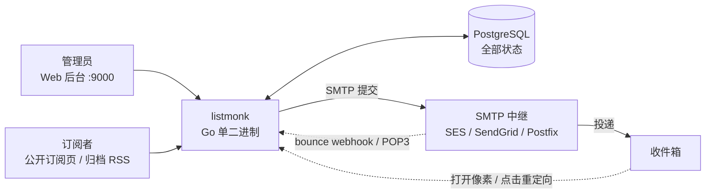

# listmonk：自托管邮件通讯平台部署与运营指南

> **判断**：listmonk 把「Newsletter 这件事的每一环都发生在自己的服务器上」做成了唯一目标——订阅者、列表、模板、Campaign 全部存进自己的 PostgreSQL，邮件交给外部 SMTP 中继投递，自身只是一个 Go 单二进制加一套 Web 后台。这个取舍划出了清晰的能力边界：内容管理和发送编排是它的强项；投递质量取决于你选的 SMTP 服务商；商业平台里的 A/B 测试、营销自动化、出站 Webhook 它一概不做——不是没做好，而是没做。
>
> **目标读者**：想自托管 Newsletter 的独立开发者与博主、需要邮件列表和事务邮件的中小团队、在 Mailchimp 类 SaaS 和自建之间做权衡的技术决策者
> **预计阅读时间**：25 - 40 分钟
> **前置知识**：Docker Compose 基础、SMTP 与 SPF / DKIM / DMARC 的概念、REST API 调用
> **数据来源**：[knadh/listmonk](https://github.com/knadh/listmonk) 仓库与 [listmonk.app](https://listmonk.app) 官方文档（当前版本 v6.2.0，2026-06-26 发布；23.4K Stars，AGPL-3.0，2026-09-18 查询）+ 仓库内 docker-compose.yml 与 CLI 源码（`cmd/init.go`）+ SendGrid / AWS SES 官方定价页（2026-09 查询）

## 目录

- [§1 系统地图：三个部件的边界](#1-系统地图三个部件的边界)
- [§2 数据模型：两套状态系统](#2-数据模型两套状态系统)
- [§3 发送链路：Campaign 状态机、模板与追踪](#3-发送链路campaign-状态机模板与追踪)
- [§4 任务流案例：一期周报从创建到统计](#4-任务流案例一期周报从创建到统计)
- [§5 部署：官方 Docker Compose 流程](#5-部署官方-docker-compose-流程)
- [§6 SMTP 配置与送达率](#6-smtp-配置与送达率)
- [§7 REST API 与自动化](#7-rest-api-与自动化)
- [§8 运维与故障排查](#8-运维与故障排查)
- [§9 采用顺序与选型边界](#9-采用顺序与选型边界)
- [§10 结尾判断](#10-结尾判断)
- [§11 事实核验与引用](#11-事实核验与引用)

## 读完能做什么

1. 说清「单二进制 + PostgreSQL 存一切 + SMTP 中继投递」的分工，判断哪些事 listmonk 管、哪些事归 SMTP 服务商。
2. 用官方 docker-compose.yml 从零起一套实例，完成管理员初始化和第一路 SMTP 配置。
3. 写出正确的邮件模板：`{{ template "content" . }}` 正文插入点、`{{ UnsubscribeURL }}` 退订链接、`{{ TrackView }}` 追踪像素各放在哪里。
4. 走通一次 Campaign 从草稿、定时、发送到统计的状态流转，并用 API 完成订阅者创建、CSV 导入和事务邮件发送。
5. 配置 bounce 处理（POP3 信箱或 SES / SendGrid webhook 回传），让硬退回自动进黑名单。
6. 在 listmonk 和商业平台之间做选型，算得出各自的真实成本。

## §1 系统地图：三个部件的边界

listmonk 对自己的定义是「one-way mailing list and newsletter manager」——单向邮件列表与 Newsletter 管理器。整套系统只有三个活动部件，先分清谁管什么，后面所有问题定位都依赖这张图：

| 部件 | 承担的事 | 不承担的事 |
|------|---------|-----------|
| listmonk（Go 单二进制 + Vue/Buefy 管理后台） | 订阅者与列表管理、模板渲染、Campaign（邮件活动）排程与限速、打开/点击统计、bounce（退回）记录、REST API、公开订阅页与归档 | 不直接投递邮件；不管理发件域信誉 |
| PostgreSQL | 唯一状态存储：订阅者、列表、订阅关系、模板、Campaign、统计、bounce | — |
| SMTP 中继（AWS SES / SendGrid / 自建 Postfix） | 实际把邮件送进收件方服务器，决定送达率 | 不理解 Campaign 语义，只管投递 |



架构上最值得点名的取舍是：投递质量——IP 信誉、域名预热、退回循环处理——整体外包给了 SMTP 层。listmonk 只负责「把正确的内容发给正确的人，并记录结果」。这让它保持单二进制的简单，也意味着部署里影响最大的决定是选哪家 SMTP 服务商，超过任何 listmonk 参数 tuning。

## §2 数据模型：两套状态系统

理解 listmonk 的关键，是分清「订阅者状态」和「订阅状态」是两回事：

- **订阅者（subscriber）状态**：`enabled` / `disabled` / `blocklisted`。blocklisted 是全局黑名单，不再接收任何邮件。
- **订阅关系（subscription）状态**：`unconfirmed` / `confirmed` / `unsubscribed`，挂在「订阅者 × 列表」上。double opt-in 流程改变的是这个状态——订阅者点确认邮件里的链接，unconfirmed 才变 confirmed。

列表（list）本身有两个正交属性：`private` / `public`（public 列表会出现在公开订阅页上），`single` / `double` opt-in。订阅者身上可以挂任意 JSON 属性（attribs，比如城市、套餐），既用于查询分段，也能当模板变量用。

这个模型带来两个实际后果。其一，退订是按列表的订阅关系退，不是全局删人——读者退订你的周刊后仍可能留在你的产品通知列表里（拉黑除外）。其二，所有状态都在自己的 Postgres 里，清洗、迁移、分析可以直接写 SQL；官方文档甚至把直接读写 `subscribers`、`lists`、`subscriber_lists` 三张表列为对外集成的正式方式之一。

## §3 发送链路：Campaign 状态机、模板与追踪

### Campaign 类型与状态机

Campaign 分 `regular`（普通群发）和 `optin`（双确认邀请）两类；内容类型支持 visual（可视化编辑器）、richtext、HTML、Markdown、plain。状态机如下，转移是受限的：

```text
draft ──→ scheduled ──→ running ──→ paused ──→ running …
  ↑            │            │          │
  └────────────┘            ├──→ cancelled
  只有 scheduled 能回 draft  └──→ finished（发完）
只有 draft/paused 能进 running；只有 running 能转 paused/cancelled
```

定时发送靠创建或更新时的 `send_at` 字段（格式 `YYYY-MM-DDTHH:MM:SSZ`，UTC），然后把状态转成 `scheduled`。没有独立的「发送」端点——启动发送就是改状态。

### 模板系统

模板用 Go `html/template` 语法，主题行同样支持模板表达式（2020 年加入）。有一条硬规则：每个模板必须包含 `{{ template "content" . }}` 恰好一次——Campaign 正文从这里注入，没有 `{{ .HTMLBody }}` 这种东西。

常用变量与函数（注意函数式写法没有点前缀，`{{ UnsubscribeURL }}` 是函数调用，不是字段）：

| 写法 | 含义 |
|------|------|
| `{{ .Subscriber.Name }}` / `{{ .Subscriber.Email }}` | 订阅者字段（另有 `.FirstName` / `.LastName` / `.UUID` / `.Status`） |
| `{{ .Subscriber.Attribs.city }}` | 自定义属性 |
| `{{ .Campaign.Subject }}` / `{{ .Campaign.FromEmail }}` | Campaign 字段 |
| `{{ UnsubscribeURL }}` | 退订与偏好管理入口，`?manage=true` 直接进偏好页 |
| `{{ MessageURL }}` | 本封邮件的网页版链接 |
| `{{ OptinURL }}` | 双确认链接 |
| `{{ TrackView }}` | 插入 1×1 追踪像素 |
| `{{ TrackLink "https://…" }}` 或在 URL 后加 `@TrackLink` | 点击追踪重定向 |
| `{{ Date "2006-01-02" }}` | 日期格式化 |
| Sprig 函数库 | 100+ 字符串 / 列表 / 哈希函数可直接用 |

自定义模板的最小骨架：

```html
<!DOCTYPE html>
<html>
<head>
  <meta charset="utf-8">
  <style>/* 邮件客户端兼容的内联样式 */</style>
</head>
<body>
  <p>你好 {{ .Subscriber.Name }}，</p>

  <!-- Campaign 正文注入点，必须恰好出现一次 -->
  {{ template "content" . }}

  <p><a href="{{ MessageURL }}">在浏览器中查看</a></p>
  <p><a href="{{ UnsubscribeURL }}">退订</a></p>

  <!-- 打开追踪：不想要打开率统计就不放 -->
  {{ TrackView }}
</body>
</html>
```

### 打开与点击追踪

listmonk 的追踪是「模板显式启用」，不是创建 Campaign 时勾选开关：像素要放 `{{ TrackView }}`，链接要用 `TrackLink` 或 `@TrackLink` 标记。全局策略在 Settings → Privacy：可以整体关闭追踪（`privacy.disable_tracking`）、匿名化追踪（`privacy.individual_tracking`，不留个体记录），以及打开 List-Unsubscribe 退订头（`privacy.unsubscribe_header`）。

两条现实约束要写进判断里。第一，退订链接不是可选项：CAN-SPAM 和 GDPR 都要求商业邮件提供退订途径，Gmail、Yahoo 对批量发件人更是强制检查一键退订头，`{{ UnsubscribeURL }}` 和退订头开关应视为必配。第二，打开率只是下限估计——相当比例的客户端默认不加载远程图片，Gmail 会把图片代理到自家服务器再展示，各家的像素策略差异很大。

### bounce（退回）处理

退回事件有三个入口，最终都落进 Settings → Bounces 配置的规则里：

1. **POP3 信箱**：把 Campaign 的 From 收件箱或专用 Return-Path 信箱配置进来，listmonk 定期去拉退回邮件。
2. **自建脚本**：`POST /webhooks/bounce` 手动上报退回。
3. **服务商 webhook**：SES、SendGrid/Twilio、Postmark、Azure ACS、Forward Email、Lettermint 各有专用端点（如 `/webhooks/service/ses`），服务商收到退回直接打回来。

分类靠状态码启发式：4.x.x 记为软退回，5.x.x 记为硬退回，认不出的按软退回处理。处理规则按退回类型配置「次数 + 动作」，动作只有两种：什么都不做，或 blocklist。官方文档以 SES 为例给的推荐配置是：软退回 2 次不动作，硬退回 1 次拉黑，投诉 1 次拉黑。注意没有「默认 3 次软退回自动拉黑」这种出厂规则——不配就是零动作，退回只会静静躺在记录里。

### 事务邮件（TX）

密码重置、订单通知这类触发邮件走 `POST /api/tx`，不经过 Campaign 队列。它要求使用独立的事务模板（`template_id` 必填），业务数据通过 `data` 字段传入，模板里以 `{{ .Tx.Data.* }}` 取用。收件人有三种模式：`default`（必须已是数据库里的订阅者）、`fallback`（查不到也照发）、`external`（完全不查库）。附件走 multipart 表单。

### 公开侧与集成边界

public 列表聚合出公开订阅页；Campaign 可以发布到公开归档页，归档带 RSS feed（Settings 里控制是否输出全文）。对外集成官方只列了两条路：REST API 和直接读写 §2 提到的三张表。**没有出站 webhook**——想在投递事件上挂自动化，只能轮询 API 或查库，这是它和商业平台差异最大的地方之一。

## §4 任务流案例：一期周报从创建到统计

用一个具体场景把上面的机制串起来：独立开发者的 AI 周刊，1.2 万订阅者，AWS SES 投递，列表开了 double opt-in。

1. **周三，写内容**。管理后台新建 Campaign（或 API 创建草稿），选 regular 类型、HTML 内容，套用上周调好的模板。此刻状态是 draft。
2. **周四，排期**。把 `send_at` 设为周六 09:00 UTC，状态转 scheduled。到点前一切可改。
3. **周六 09:00，启动**。调度器把 Campaign 转 running：listmonk 从 Postgres 按批次拉订阅者（Settings → Performance 里的 batch size 控制批大小），逐个渲染模板——每个收件人拿到的是独立的退订链接、独立参数化的像素和追踪链接，不是群发的同一份 HTML——然后推入发送队列。
4. **发送限速**。队列按 concurrency 和 message rate 控制提交节奏；如果开了滑动窗口限速（比如每小时最多 3,000 封），超速部分排队等待。邮件经 STARTTLS 提交给 SES 的 SMTP 端点。
5. **退回回流**。SES 检测到硬退回，把事件打到 `/webhooks/service/ses`；listmonk 记 bounce，命中「硬退回 1 次」规则，订阅者自动 blocklist。
6. **读者交互**。打开邮件时像素请求回到 listmonk，打开计数 +1；点链接先经 listmonk 重定向记一笔点击，再跳目标网站。
7. **统计收敛**。Campaign 详情页的 views / clicks / bounces 数字随之更新；垃圾投诉比打开率更值得盯，因为它直接作用在发件域信誉上。

失败定位看哪里：

| 症状 | 第一步检查 |
|------|-----------|
| 到点没发 | Campaign 是不是卡在 draft / scheduled；`docker compose logs -f listmonk` |
| 全部没发出去 | SMTP 配置本身：Settings → SMTP 的测试发送；日志里的握手/认证错误 |
| 部分人没收到 | SMTP 服务商控制台的退回明细；Settings → Bounces 的规则与记录 |
| 打开率是 0 | 模板里有没有 `{{ TrackView }}`；Settings → Privacy 是否关了追踪 |
| 邮件里链接指错域名 | Settings → General 的 Root URL——退订、网页版、追踪链接都由它拼出来 |

## §5 部署：官方 Docker Compose 流程

官方部署只有三步。配置全部走环境变量，连 config.toml 文件都不需要：

```bash
curl -LO https://github.com/knadh/listmonk/raw/master/docker-compose.yml
docker compose up -d
# 打开 http://localhost:9000，首次访问会引导创建超级管理员
```

官方 docker-compose.yml 的关键内容（可以直接读原文件，这里按要点摘录）：

```yaml
services:
  app:
    image: listmonk/listmonk:latest
    container_name: listmonk_app
    restart: unless-stopped
    ports:
      - "9000:9000"
    depends_on:
      - db
    # 启动命令链：装库（幂等）→ 跑迁移 → 启动服务，重启安全
    command: [sh, -c, "./listmonk --install --idempotent --yes --config '' && ./listmonk --upgrade --yes --config '' && ./listmonk --config ''"]
    environment:
      LISTMONK_app__address: 0.0.0.0:9000
      LISTMONK_db__host: db
      LISTMONK_db__port: 5432
      LISTMONK_db__user: listmonk
      LISTMONK_db__password: listmonk     # 改掉
      LISTMONK_db__database: listmonk
      LISTMONK_ADMIN_USER: ${LISTMONK_ADMIN_USER:-}      # 可选：设置后首次启动自动建管理员
      LISTMONK_ADMIN_PASSWORD: ${LISTMONK_ADMIN_PASSWORD:-}
    volumes:
      - ./uploads:/listmonk/uploads:rw
  db:
    image: postgres:17-alpine
    container_name: listmonk_db
    restart: unless-stopped
    ports:
      - "127.0.0.1:5432:5432"             # 数据库只绑本机回环
    healthcheck:
      test: ["CMD-SHELL", "pg_isready -U listmonk"]
      interval: 10s
      timeout: 5s
      retries: 6
    volumes:
      - listmonk-data:/var/lib/postgresql/data
```

几处设计值得说破：

- **环境变量即配置**。变量名规则是 `LISTMONK_` 前缀加双下划线代替层级：`LISTMONK_db__host` 对应 config.toml 里的 `[db] host`。同类变量还支持 `LISTMONK_*_FILE` 形式从文件读值，配合 Docker secrets 管理密码。
- **启动命令是幂等的**。`--install --idempotent` 只在空库时装 schema，`--upgrade --yes` 每次启动自动跑数据库迁移。所以升级整个系统就是 `docker compose pull && docker compose up -d`，迁移自动完成。
- **管理员账号不在配置文件里**。要么首次访问 Web 后台时创建，要么在首次启动前设置 `LISTMONK_ADMIN_USER` / `LISTMONK_ADMIN_PASSWORD` 环境变量自动创建。
- **媒体文件**。容器内路径是 `/listmonk/uploads`，compose 已挂载到宿主机 `./uploads`；要在 Settings → Media 里把上传路径改成 `/listmonk/uploads` 才会真正用上。媒体也支持 S3 兼容存储（Settings → Media 配置 endpoint 和桶）。

如果不走 Docker，裸二进制的流程是：`./listmonk --new-config` 生成 config.toml（只有 `[app] address` 和 `[db]` 两个配置节，数据库连接池参数 `max_open` / `max_idle` / `max_lifetime` 也在这里），手工改好后 `./listmonk --install` 装库，再直接运行 `./listmonk`。完整 CLI 参数只有这些：

| 参数 | 作用 |
|------|------|
| `--new-config` | 生成示例配置文件 |
| `--install` | 初始化数据库 schema |
| `--idempotent` | 让 `--install` 只在未安装的库上生效 |
| `--upgrade` | 升级数据库到当前版本 |
| `--yes` | 跳过交互确认 |
| `--config` | 指定配置文件，传空字符串 `''` 表示纯环境变量模式 |
| `--version` / `--passive` | 查看版本 / 被动模式（只跑 Web，不处理发送队列） |

不存在 `--init`、`--migrate` 或 `--reset-admin-password` 这类参数——网上教程如果出现这些，是旧版本或以讹传讹。

生产环境最后一步：listmonk 自己不带 TLS，把 9000 端口放在 Nginx / Caddy 反代后面配 HTTPS，应用服务器和数据库端口不直接暴露公网。

## §6 SMTP 配置与送达率

SMTP 在 **Settings → SMTP** 里配置，不在 config.toml。支持添加多个命名的 SMTP 块，每个块有独立字段：host、port、认证协议、用户名密码、`max_conns`（连接数）、`idle_timeout` / `wait_timeout`、`max_msg_retries`（发送重试）、`tls_type`（`STARTTLS` / `TLS` / `NONE`）、`tls_skip_verify`。创建 Campaign 时可以指定走哪一路。

三条路线的真实成本（2026-09 官方定价页）：

**AWS SES——大多数自托管场景的默认答案。** 出站邮件按量计费，à la carte 档 $0.10/1,000 封，另收附件流量 $0.12/GB；套餐制（Essentials）10M 封/月以内 $0.16/1,000。新 AWS 账号另有最高 $200 的免费额度 credit 可抵扣。SMTP 端点 `email-smtp.<region>.amazonaws.com:587`，凭据在 SES 控制台生成。注意新账号默认在沙箱里，只能发给已验证的邮箱，正式使用前要申请生产权限（production access）。

```text
Settings → SMTP 配置 SES：
host = email-smtp.us-east-1.amazonaws.com   # 换成你的区域端点
port = 587
username / password = SES 控制台生成的 SMTP 凭据
tls_type = STARTTLS
```

**SendGrid——适合已在 Twilio 生态的团队。** 免费档只是 60 天试用（每天 100 封），Essentials 套餐 $19.95/月起（5 万封/月），Pro $89.95/月起。SMTP 端点 `smtp.sendgrid.net:587`，用户名固定填 `apikey`，密码填 API Key。

**自建 Postfix——零按量成本，全部责任自担。** listmonk 通过 submission 端口（587，STARTTLS）把邮件交给自己的 Postfix，但 SPF、DKIM 签名（opendkim 或 rspamd）、DMARC、IP 信誉、IP 预热这些送达率基础全都自己维护。只适合发自己域名的低频事务邮件；拿来发 Newsletter，大概率把发件域信誉烧掉。

无论哪条路线，这几件事共同决定能不能进收件箱：

1. **发件域三件套**：SPF 放行 SMTP 服务商、DKIM 签名公钥进 DNS、DMARC 策略记录。用 `newsletter@yourdomain.com` 这类专用子域/发件地址，不要用个人邮箱。
2. **接通 bounce 回流**：用 SES / SendGrid 就配好 webhook，这一步不做，退回数据不回流，坏地址会一直收。
3. **退订头开起来**：Settings → Privacy 的 List-Unsubscribe 项，收件方对批量发件人的硬性检查项。
4. **新账号预热**：IP 和域名的发件信誉只能靠时间养。行业通行做法是从每天几十封起步、按周翻倍，没有官方标准数字，但「注册当天就发一万封」几乎必然进垃圾箱。

## §7 REST API 与自动化

API 覆盖订阅者、列表、Campaign、模板、媒体、bounce、事务邮件全部资源。认证两种：HTTP BasicAuth，或 `Authorization: token <user>:<token>` 请求头；API 用户和 token 在 **Admin → Users** 里创建——日常集成不要用超级管理员。响应统一为 `{"status": "success", "data": …}` 信封。

| 资源 | 端点 | 要点 |
|------|------|------|
| 订阅者 | `GET/POST /api/subscribers`，`GET/PUT/PATCH/DELETE /api/subscribers/{id}` | 查询用数字 ID，不是 UUID；创建必填 `email` / `name` / `status`（`enabled` 或 `blocklisted`），`lists` 传列表 ID 数组，`attribs` 传 JSON 属性 |
| 列表 | `GET/POST /api/lists`，`PUT/DELETE /api/lists/{id}` | 创建必填 `name` / `type`（`private` / `public`）/ `optin`（`single` / `double`）；GET 默认带 `subscriber_count`，`minimal=true` 关闭 |
| 导入 | `POST /api/import/subscribers` | multipart：`params` 字段传 JSON（`mode`、`delim`、`lists`、`overwrite`），`file` 传 CSV 或 ZIP；另有 GET 查进度、DELETE 终止 |
| Campaign | `POST /api/campaigns`，`PUT /api/campaigns/{id}/status` | 创建必填 `name` / `subject` / `lists` / `type`（`regular` / `optin`）/ `content_type` / `body`；发送与暂停都是改状态；测试发送走 `POST /api/campaigns/{id}/test` |
| 事务邮件 | `POST /api/tx` | `template_id` 必填，收件人 `subscriber_email`（或 `subscriber_id` / 复数形式），业务数据放 `data` |
| bounce | `POST /webhooks/bounce`，`GET /api/bounces` | 上报与查询退回 |

把最常用的三个场景写成可直接运行的调用：

```bash
# 1. 注册订阅者（比如接入自己的注册表单）
curl -X POST http://localhost:9000/api/subscribers \
  -u "api_user:token" \
  -H "Content-Type: application/json" \
  -d '{
    "email": "reader@example.com",
    "name": "Reader",
    "status": "enabled",
    "lists": [1],
    "attribs": {"plan": "free"}
  }'

# 2. CSV 批量导入
curl -X POST http://localhost:9000/api/import/subscribers \
  -u "api_user:token" \
  -F 'params={"mode": "subscribe", "delim": ",", "lists": [1], "overwrite": false}' \
  -F 'file=@subscribers.csv'

# 3. 创建并启动一期 Campaign（发送就是改状态）
curl -X POST http://localhost:9000/api/campaigns \
  -u "api_user:token" \
  -H "Content-Type: application/json" \
  -d '{
    "name": "第 12 期周报",
    "subject": "AI 周刊 #12",
    "lists": [1],
    "type": "regular",
    "content_type": "html",
    "body": "<p>本期内容……</p>"
  }'

curl -X PUT http://localhost:9000/api/campaigns/12/status \
  -u "api_user:token" \
  -H "Content-Type: application/json" \
  -d '{"status": "running"}'
```

定时自动化不需要额外的轮子。每周日 09:00 UTC 发一期，用系统 cron 调两个 API 就够——先创建草稿（带 `send_at`），再转 scheduled：

```bash
# crontab：每周日 09:00 UTC 排期
0 9 * * 0 /usr/local/bin/weekly-newsletter.sh
```

```bash
#!/bin/sh
# weekly-newsletter.sh — 内容可由上游脚本生成后拼进 body
TOKEN="api_user:token"
BASE="http://localhost:9000/api"

CID=$(curl -s -X POST "$BASE/campaigns" \
  -u "$TOKEN" -H "Content-Type: application/json" \
  -d "{\"name\":\"weekly-$(date +%F)\",\"subject\":\"AI 周刊\",\"lists\":[1],\"type\":\"regular\",\"content_type\":\"html\",\"body\":\"<p>本期内容</p>\"}" \
  | jq -r '.data.id')

curl -s -X PUT "$BASE/campaigns/$CID/status" \
  -u "$TOKEN" -H "Content-Type: application/json" \
  -d '{"status": "running"}'
```

更重的集成（CRM 同步、事件触发）同样走 API；官方明确不建议绕开它另起炉灶，但对「只读分析」场景，直接查 `subscribers` / `subscriber_lists` 表是文档认可的路径。

## §8 运维与故障排查

**备份**——一切都在 Postgres 里，备份就是 pg_dump：

```bash
# 手动备份
docker compose exec db pg_dump -U listmonk listmonk > listmonk_$(date +%F).sql

# crontab 每天凌晨 3 点
0 3 * * * docker compose -f /path/to/docker-compose.yml exec -T db pg_dump -U listmonk listmonk > /backups/listmonk_$(date +\%F).sql
```

**升级**——`docker compose pull && docker compose up -d`。启动命令链里的 `--upgrade --yes` 会自动跑 schema 迁移，迁移是幂等的，失败可安全重试。

**性能**——发送节奏的旋钮都在 Settings → Performance：`app.concurrency`（并行 worker）、`app.message_rate`（每秒推送速率）、`app.batch_size`（批次大小）、滑动窗口限速（`app.message_sliding_window` + 速率 + 时长，用于满足服务商的小时配额）。大型列表还能打开慢查询缓存（默认每天 03:00 刷新），官方另外建议大库每周跑一次 `VACUUM ANALYZE`——注意它是阻塞操作，挑低峰执行。Postgres 连接池（`max_open` / `max_idle`）在 `[db]` 配置节。

**常见问题**：

- **首次部署登录不了**。管理员账号是首次访问 Web 后台时创建的；如果想在部署时自动建，用 `LISTMONK_ADMIN_USER` / `LISTMONK_ADMIN_PASSWORD` 环境变量（仅对空库首次启动生效）。密码丢失：配置好 SMTP 后走 Web 端的忘记密码（forgot password）流程，重置链接通过邮件发送；或由其他超级管理员在 Admin → Users 里重置。
- **502 / 起不来**。十有八九是 Postgres 未就绪。官方 compose 自带 `pg_isready` 健康检查；自写的 compose 文件要记得加 `depends_on` + healthcheck。看日志：`docker compose logs -f db listmonk`。
- **邮件全部发不出**。Settings → SMTP 里用测试发送功能定位：认证失败、端口被云厂商封禁（25 端口常被封，用 587）、`tls_type` 选错。
- **部分收件人没收到**。查服务商控制台的退回明细和 Settings → Bounces 的记录；bounce 回流没接通时，listmonk 对投递失败完全无感。
- **打开率 0**。按可能性排序：模板里没放 `{{ TrackView }}` → Privacy 里关了追踪 → 收件客户端不加载图片。
- **升级后 500**。确认启动命令包含 `--upgrade`，容器重启时会自动补齐迁移；迁移是逐条按版本号执行的，卡住时看 listmonk 日志里最后一条迁移。升级前先备份数据库，官方升级文档的第一条建议就是这个。

## §9 采用顺序与选型边界

按风险从小到大，推荐四步走：

1. **先跑起来**：官方 compose 三条命令起服务，SES 沙箱内验证（沙箱只能发已验证邮箱，正好当测试环境）。走通「建列表 → double opt-in → 发测试 Campaign」全链路，判断功能集是否覆盖需求。这一步零成本。
2. **正式发刊**：申请 SES 生产权限，配 SPF / DKIM / DMARC，接 SES bounce webhook，设硬退回自动拉黑，打开 List-Unsubscribe 头。
3. **接入业务**：建专用 API 用户，把订阅者注册接进自己的表单或产品，事务邮件（密码重置、通知）走 `POST /api/tx`。
4. **自动化运营**：cron + API 定时排刊，或者上 n8n / 自建调度，做每周自动生成与发送。

什么时候不用 listmonk：需要原生 A/B 测试、营销自动化旅程、与 Shopify / WordPress 这类平台的深度集成——这些商业平台功能它没有，官方态度也明确（A/B 测试的 feature request 在 2020 年被关闭，作者认为超出项目范围，只顺手给主题行加上了模板支持）；每天百万级的发送量——该上专用投递基础设施而不是「单二进制 + 单 Postgres」；想要双向讨论组（成员互相回复、大家都能看到的 mailing list）——listmonk 是 one-way，单向的。

成本上算一笔账：1 万订阅者的周刊，每月 4 期是 4 万封。SES à la carte 档约 $4/月（不含附件流量）；SendGrid Essentials $19.95/月起；Mailchimp 级别的营销 SaaS 按订阅者人数计费，同规模通常每月数十到数百美元。订阅费为零、数据完全自持，是 listmonk 相对商业平台真正的价格优势——代价是把送达率和自动化这两块拼图自己补齐。

## §10 结尾判断

listmonk 的价值不在功能多，而在边界清楚：它把「内容、订阅者、排程、统计」这些必须自持的东西做成了单二进制，把「投递」这个重运营的活交给你选的 SMTP 服务商，把「增长玩法」留给商业平台。如果你的核心诉求是数据自持和零订阅费，且能接受自己管 SPF/DKIM 和 bounce 策略，它是目前自托管 Newsletter 里最成熟的默认选项；如果你的诉求是开箱即用的增长工具箱，那省下的订阅费会以另一种方式还回去。

## §11 事实核验与引用

| 事实 | 来源 |
|------|------|
| 版本 v6.2.0（2026-06-26）、23.4K Stars、AGPL-3.0、Go + Vue/Buefy、「one-way」定位 | GitHub 仓库与 API（2026-09-18 查询）、README |
| CLI 参数全集（`--new-config` / `--install` / `--idempotent` / `--upgrade` / `--yes` / `--passive` 等；无 `--init` / `--reset-admin-password`） | 仓库 `cmd/init.go` 的 `initFlags()` |
| config.toml 仅 `[app] address` 与 `[db]` 两节；`max_open` / `max_idle` / `max_lifetime` | 仓库 `config.toml.sample` |
| 官方 docker-compose：环境变量配置、`--config ''`、`--install --idempotent`、`--upgrade --yes`、postgres:17-alpine、`LISTMONK_ADMIN_USER/PASSWORD`、`LISTMONK_*_FILE` secrets | 仓库 `docker-compose.yml`、官方安装与配置文档 |
| 订阅者状态 `enabled/disabled/blocklisted`；订阅状态 `unconfirmed/confirmed/unsubscribed`；列表 `private/public` + `single/double` opt-in | 官方文档 Concepts、Subscribers API、Lists API |
| 模板变量 `{{ template "content" . }}`、`{{ UnsubscribeURL }}`、`{{ MessageURL }}`、`{{ TrackView }}`、`{{ TrackLink }}`、`{{ Date }}`、Sprig；主题行模板支持 | 官方文档 Templating |
| Campaign 类型与 `content_type` 枚举、`send_at`、状态转移规则、无 `/send` 端点、测试端点 | 官方文档 Campaigns API |
| 导入端点 `/api/import/subscribers` 与 `params` 参数、TX API（`template_id` 必填、`subscriber_mode`）、API 认证（BasicAuth / token，Admin → Users） | 官方文档 Import / Transactional / APIs |
| bounce 三来源（POP3、webhook API、SES/SendGrid/Postmark 等服务商端点）、次数+动作配置、无默认阈值 | 官方文档 Bounces |
| 无出站 webhook；官方集成方式为 API 与直读 `subscribers`/`lists`/`subscriber_lists` 表 | 官方文档 External integration |
| 无原生 A/B 测试；issue #132 于 2020-07 关闭，作者仅为主题行加模板支持 | GitHub issue #132 及作者评论 |
| 发送与性能旋钮（`app.concurrency` / `app.message_rate` / `app.batch_size` / 滑动窗口 / 慢查询缓存）、`VACUUM ANALYZE` 建议 | 仓库 `models/settings.go`、官方文档 Performance |
| SES 定价（à la carte $0.10/1,000 + 附件 $0.12/GB；Essentials $0.16/1,000；$200 新用户免费额度 credit）、SendGrid 定价（60 天试用 100 封/天；Essentials $19.95/月起） | AWS SES 与 Twilio SendGrid 官方定价页（2026-09 查询） |
