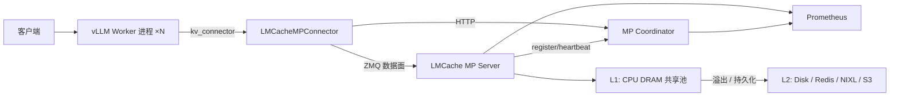
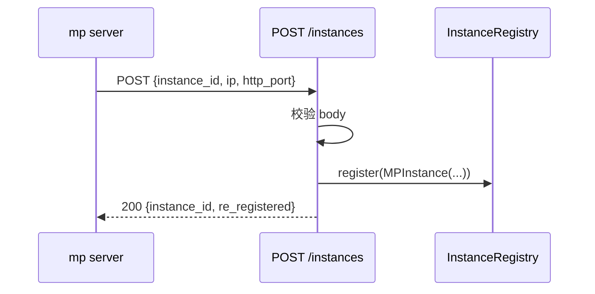

# LMCache 深度解析：把 LLM 推理的 KV Cache 从临时状态改造成可复用资产

## 核心判断

LMCache 解决的是 **"把 KV Cache 从单个推理进程内的临时状态，升级成跨进程、跨节点、可观测、可分层的系统级资产"**。vLLM 等推理引擎自带的 HBM（前缀缓存是 GPU 高速显存）前缀缓存只解决"同一个进程、同一个 GPU 实例内的前缀复用"，而 LMCache 试图解决的是更上一层的两个问题：多轮对话与 RAG（Retrieval-Augmented Generation，检索增强生成）场景下的跨请求复用，以及 Data Parallel（数据并行，多个推理实例并行处理不同请求）部署下被切割在不同 GPU 进程里的 KV Cache 如何被统一看到。

这种定位决定了它和 vLLM 原生 prefix cache、SGLang HiCache、Moonshot Mooncake、Microsoft CacheGen 不是一个维度上的竞品——它是一层插在推理引擎和存储之间的独立中间件。所以 LMCache 一定要做成一个独立守护进程（daemon）、为什么一定要把存算分离（存储资源和计算资源互相独立、按需扩展）做到进程级别、为什么 v0.4.7（2026-06-13 发布）开始往 FastAPI 协调器方向扩展。

## 系统地图：LMCache 的分层与运行时拓扑

打开 `LMCache/LMCache` 仓库的 `lmcache/v1/` 目录，会发现它是一组互相解耦的子系统，不是单一进程、单一职责的库。下表把这套分层按"职责"和"实现位置"切成几块，方便在头脑里先建立地图。

| 层级 | 关键模块 | 职责 |
|------|----------|------|
| 入口与硬件抽象 | `lmcache/__init__.py` 中 `_detect_device()` | 一次性探测 CUDA / XPU / HPU / CPU，导出 `torch_dev` 与 `torch_device_type` 作为统一设备入口 |
| 核心引擎 | `lmcache/v1/cache_engine.py`、`cache_interface.py`、`ec_engine.py` | 对外暴露 `store` / `retrieve` / `lookup` 接口，并分离 KV 引擎与 Encoder Cache 引擎 |
| 存储后端 | `lmcache/v1/storage_backend/` 下多个 backend | 把 KV 块按需落到 L1（CPU DRAM）、L2（Local Disk / Redis / NIXL / S3 等） |
| 内存管理 | `memory_management.py`、`lazy_memory_allocator.py`、`kv_layer_groups.py` | 用 Paged（分页）/Pinned（页锁定）/Mixed/Lazy/HMA（Hybrid Memory Allocator，混合内存分配器） 等多种分配器对接不同硬件 |
| GPU 连接器 | `lmcache/v1/gpu_connector/` | 真正的"搬运工"：负责把 CPU 端 KV 张量按层或按块灌进 vLLM 的 Paged KV Cache |
| 多进程服务 | `lmcache/v1/multiprocess/` | 把 LMCache 跑成独立进程，对外提供 ZMQ（ZeroMQ，高性能消息队列库）数据面 + FastAPI HTTP 控制面 |
| 协调器 | `lmcache/v1/mp_coordinator/` | v0.4.7 新增的 FastAPI 进程，负责多实例注册、quota、blend-lookup 路由 |
| 控制器 | `lmcache/v1/cache_controller/` | 历史遗留的 worker-side 控制器，包含 `controllers/`、`executor.py` 等 |
| 集成适配 | `lmcache/integration/{vllm,tensorrt_llm,sglang}/` | 对接不同推理引擎的 connector 入口 |
| 观测 | `observability.py`、`mp_observability/` | Prometheus 指标（一种标准化的监控数据采集格式）、事件总线、健康检查 |

**运行时拓扑（MP 模式 + vLLM）**：



要分清两件事：

- `Cache Engine` 是单进程内的"主从式"实现（vLLM 启动时随进程拉起）。
- `Multiprocess Server`（`lmcache server`）是独立进程，可以被多个 vLLM pod 共享。两者代码上有不少共用模块（都通过 `cache_engine.py`），但生命周期完全不同：前者随推理进程崩溃而消亡，后者是常驻守护进程。

## 并行机制拆解：四套容易被混淆的"cache"

LMCache 文档和源码里反复出现四种容易混淆的"缓存"，先把它们切清楚才能继续往下读。

### 1. vLLM 自身的前缀缓存（`prefix caching`）

存在 GPU HBM 里，命中条件是 token 前缀完全相同、单进程、单模型实例。它的好处是延迟极低（GPU 片上访存），局限是显存有限，跨进程或长上下文场景下会快速被 LRU（Least Recently Used，最近最少使用）淘汰。

### 2. LMCache 的 prefix KV cache

写入位置是 L1（CPU DRAM）或 L2（Disk/Remote），以 `CacheEngineKey`（含 `model_name`、`world_size`、`worker_id`、`chunk_hash`、`dtype`、`request_configs`）作为键。命中条件同样是 prefix 相同，但缓存容量和生命周期不再受 GPU 显存限制，可以跨请求、跨会话保留。

### 3. LMCache 的非 prefix 复用（CacheBlend）

2025 年 SOSP/EuroSys 上发表的 CacheBlend 论文（Yao et al., 2025）提出：把 KV 块按任意位置复用，再对缺失 attention 的位置做"局部重算 + 融合"。LMCache 在 v0.4.7 里把这种非 prefix 复用提升为 **token 级匹配**（`Token-level matching for non-block-aligned KV reuse`），意味着即便不是按 16/64 token 对齐的块，也能命中并选择性重算。

### 4. Encoder Cache（EC）

一个常被忽视的子模块，存在于 `lmcache/v1/ec_engine.py` 和 `lmcache/integration/vllm/vllm_ec_adapter.py`。它不是 KV 缓存，而是 vLLM 多模态 encoder 的输出缓存——一张图片如果两次被同一个 hash 引用，第二次就跳过视觉塔（vision encoder）。EC 与 KV 缓存构造**独立的 StorageManager**（这一点在仓库的 `docs/design/v1/encoder-cache.md` 设计文档中明确：不同访问模式，混合在一起会让热 KV 驱逐冷 EC，资源核算也会失真），按 `mm_hash` 作为 key，世界尺寸（world_size）和 worker_id 全部折叠为 sentinel（哨兵）值（TP=N 即张量并行度为 N 的部署下，多个 GPU 算出来的 encoder 输出一致，只存一份）。

把这四条切清楚后，再去看 LMCache 的设计就能避免一个常见误读——把它当成 "vLLM prefix cache 的替代品"。它实际上是 vLLM prefix cache 之上的**二级系统**，两者可以共存（同一份工作负载可以同时获得 HBM L0 + LMCache L1/L2 的多层命中）。

## 核心机制一：多进程模式（MP Mode）—— 解决"DP 部署下 KV 互相看不见"

### 为什么 vLLM 进程内 offload 不够

LMCache 团队在 2026-04-03 发布的博文中（《LMCache's New Architecture Boosts MoE Inference Performance by 10×》）给出了一个具体场景：用 vLLM 0.18.1 跑 `Qwen3-235B-A22B-Instruct-2507-FP8`，部署形态是 8 卡 H100 上的 8 路 Data Parallel（`--data-parallel-size 8`）配合 Expert Parallel（专家并行，把 MoE 模型的不同专家放在不同 GPU 上以提升推理效率）。即便启用了 vLLM 的进程内 CPU offload（`--kv-offloading-size 50`），每张卡仍然只能看到自己那份 50 GB 的 CPU 池，DP rank 之间不共享。如果两个 rank 收到的请求共享同一段 100k token 的 system prompt，每个 rank 都要各自重新做 prefill（预填充，即让模型一次性处理完所有输入 token 以生成首个输出 token 的过程），浪费的 GPU 算力是 1×DP 倍以上。

### MP 模式的解法

`lmcache/v1/multiprocess/server.py` 起一个独立进程，配置上写明 `--l1-size-gb 400`，代表 400 GB 主机 DRAM 统一池。vLLM 侧用 `--kv-transfer-config '{"kv_connector":"LMCacheMPConnector","kv_role":"kv_both"}'` 注册。运行时：

1. vLLM worker 启动时通过 `vllm_multi_process_adapter.py` 与 LMCache server 建立 ZMQ 连接；
2. prefill 完成后，KV 块通过 ZMQ 推送到 LMCache server；
3. 后续请求到达任意 vLLM worker，命中相同 prefix 时直接走 LMCache，绕过 prefill；
4. 同一节点不同 vLLM pod 都连到同一个 LMCache server，跨 pod 共享同一份缓存。

**关键解耦点**：LMCache 与 vLLM 是两个独立进程，崩溃域（crash domain）分离。LMCache 自身的 CPU 哈希、内存管理、磁盘 I/O 不再和 vLLM 推理线程抢 GIL（Global Interpreter Lock，Python 全局解释器锁，限制同一时刻只有一个线程执行 Python 字节码）；反之 vLLM 挂了不会把已经持久化的 KV 拖下水。

### v0.4.7 引入的关键能力

v0.4.7 Release Notes 里有几项针对 MP 的增量改动值得拆开看：

- **`multi_layer_block_kv_transfer`**：统一的多层块传输原语，取代之前 per-layer 单独发送的链路，显著降低 ZMQ 小消息数量。
- **SHM-based data transfer**：当 sender 和 receiver 在同一节点、且都是 GPU 进程时，改用 POSIX 共享内存（POSIX SHM，进程间通过映射同一块内存区域来传递数据）传输，避免走网络栈。这对 PD 分离（Prefill-Decode 分离，把"处理输入"和"生成输出"两个阶段放在不同机器上执行）场景下的延迟敏感传输尤其重要。
- **MP coordinator backbone**：新增 FastAPI 协调器进程（详见下一节）。
- **L1 / L2 quota** 配额、usage、eviction 驱逐策略由 coordinator 统一管。

## 核心机制二：MP Coordinator —— 把"实例"从内存中抽出来管理

`docs/design/v1/mp_coordinator/README.md` 描述得很清楚：v0.4.7 之前，MP server 之间彼此独立，quota 是进程内内存里的，没有跨节点的 token-match 路由；v0.4.7 之后引入一个 FastAPI coordinator 进程。

### 通信契约

Coordinator 暴露的 REST 接口是薄薄一层：

| 方法 + 路径 | 方向 | 用途 |
|------------|------|------|
| `POST /instances` | mp server → coordinator | 注册或重新注册 |
| `PUT /instances/{id}/heartbeat` | mp server → coordinator | 心跳，404 触发重注册 |
| `DELETE /instances/{id}` | mp server → coordinator | 注销（幂等，204） |
| `GET /instances` | 运维 / 工具 | 列出 fleet |
| `GET /healthz` | k8s 探针 | 存活 |

数据流是单向的：coordinator 不主动推送状态给 mp server，它只负责"知道谁还活着"。如果要调用某个 mp server 的具体能力（比如 `/pin` 或 `/quota`），coordinator 从 registry 里取出该实例的 `ip` + `http_port`，用 `httpx.AsyncClient` 发起普通 HTTP 请求。coordinator 没有自己的 RPC 协议，复用 mp server 已有的 HTTP API 即可。

### 注册时序



### 横向扩展点

按设计文档的描述，coordinator 现在只做"成员管理 + 健康检查"，其余能力挂在同一个 FastAPI 应用的不同 router 上：quota reconcile、blend-lookup 路由、KV 操作 fan-out 都按"加一个 `http_apis/<feature>_api.py` 文件"的方式扩展。这种约定让 v0.4.7 的"未来工作"路径非常清晰：等真的需要跨节点 token 路由时，不需要再动 coordinator 的 backbone，只补一个 router。

## 核心机制三：存储后端与内存分配——分页、Pinned、Lazy、HMA

要看清 LMCache 是怎么处理"几十 GB 到几 TB 量级 KV 块"的，必须先把它的存储后端和内存分配器拆开看。这一层是性能与稳定性的真正分水岭。

### 多种分配器并存的设计动机

仓库 `lmcache/v1/` 下的内存相关模块至少有五种实现并存：`MixedMemoryAllocator`、`PinMemoryAllocator`、`LazyMemoryAllocator`、`XPUMemoryAllocator`、`PagedTensorMemoryAllocator`，外加 v0.4.7 新引入的**混合内存分配器 HMA**（Hybrid Memory Allocator）。乍看这是"重复造轮子"，但每一种对应一种不同的物理设备与生命周期假设：

- `PinMemoryAllocator`：分配 page-locked 的 host memory，H2D（Host-to-Device，主机到设备）拷贝时走 DMA（Direct Memory Access，直接内存访问，绕过 CPU 直接搬运）通道，延迟最低，是 L1 的默认选择。
- `MixedMemoryAllocator`：在 GPU 与 host memory 之间按需混合分配，适合既要在 GPU 又要在 CPU 留缓存的混合策略。
- `LazyMemoryAllocator`：懒分配——只在真正写入时才分配物理页，避免"预留一大块 CPU DRAM 但实际只用了 1/3"的浪费。
- `XPUMemoryAllocator`：XPU 专用，调用 `torch.xpu` 的设备 API。
- `PagedTensorMemoryAllocator`：把 KV 张量按 page 切分，对接 vLLM 的 PagedAttention。
- **HMA（v0.4.7 新增）**：在 Mamba / GDN（一种状态空间模型，区别于标准 Transformer 的注意力层）等混合架构下，attention 层与 SSM（State Space Model，状态空间模型）层的缓存需求不同（前者 KV 大、后者状态量小），HMA 给每组 layer 设独立的 `tokens_per_chunk` / `slots_per_chunk`，混部更精细。

v0.4.7 的 release notes 明确把"per-group `tokens_per_chunk` / `slots_per_chunk` now used instead of inferring from `cache_config.block_size`"列为行为变更。意思是以前从全局 `block_size` 推断出的 chunk 尺寸，现在按 layer group 单独配，运维能更精准地控制不同模型层的内存压力。

### 多层后端（L1 + L2）的工作机制

`lmcache/v1/storage_backend/storage_manager.py` 起到"调度员"的作用：写入时按"热度策略"自动选 L1 还是 L2；查询时按 L1 → L2 顺序逐层 `lookup` 命中。具体的热点判定由 `cache_policy/` 下的策略模块决定，主流是 LRU，但仓库也提供 LFU（Least Frequently Used，最不经常使用）与 ARC（Adaptive Replacement Cache，自适应替换缓存，能在 LRU 和 LFU 之间动态切换）等可选策略。

值得专门说的是 NIXL。NIXL 是 NVIDIA 在 Dynamo 生态里推的统一 KV 传输与存储抽象，v0.4.7 起 LMCache 在 NIXL 之上又做了两件事：

1. **多路径 KV 缓存 offloading**（multipath KV-cache offloading）：同一条数据可以经由 NIXL 的不同 backend（如 POSIX、HF3FS、GDS）并发传输，链路利用率提升。
2. **DOCA_MEMOS** 接入：DOCA（NVIDIA 数据中心加速器 SDK）里的 CMX 通信栈被纳入 NIXL 后端，跨节点带宽与延迟进一步降低。

这两项都是 v0.4.7 才合并进来的生产可用能力，意味着 LMCache 在"跨节点 KV 中心"方向上对标的对象是 Moonshot Mooncake 与 Microsoft CacheGen 这类 KV-centric 存储，而不是传统 Redis 风格的 KV 库。

### 后端选择的几个非显然约束

- **P2P 后端**（`p2p_backend.py`）是节点间点对点共享。从仓库 `docs/blog/2026-01` 的描述看，这条路径 2026-01 才从实验性转为生产，因此 v0.4.7 在 P2P 上仍偏保守——多节点环境下优先 L2 远程后端，跨节点直连只在网络条件受控的内部集群里打开。
- **PD Backend**（含 `pd_backend_async.py`）是为 PD 分离场景特别设计的：异步的预取、写入与确认路径更短，配套前面提到的 reservation 协议。
- **Remote Backend** 是"远程后端协议抽象"，不是单一存储实现。所有满足"通过 HTTP/gRPC/RDMA 可达的 KV 池"——包括自建的 Redis 集群、对象存储、甚至另一台 LMCache server——都能挂进来。

## 核心机制四：PD 异步预留（PD Async Reservation）—— 解决 chunked prefill 死锁

`docs/design/v1/pd_async_reservation_design.md` 描述了一个具体的死锁场景：

> 缓冲 = 10 chunks，Req A 需 8，Req B 需 8。
> A 分配 5 → B 分配 5 → 缓冲满。
> A 还要 3，被阻塞；B 还要 3，被阻塞。死锁。

传统做法是"串行 admission"：A 全部传完再放 B 进来；这在多节点 PD 分离下会浪费掉 B 那段时间的带宽。LMCache 的解法是**先预留、后分配**：

```
A 申请预留（8 chunks）→ reserved=8, available=2
B 申请预留（8 chunks）→ 8 > 2 → 等待
A 全部 RDMA（Remote Direct Memory Access，远程直接内存访问，
            允许两台机器的 GPU/CPU 直接读写对方内存）完成
   → release → available=10
B 准入 → reserved=8, 继续
```

### 收 / 发两端的职责划分

- **Receiver** 维护 `ReservationManager`，作为唯一可信的缓冲容量来源。`async_try_admit(req_id, total_chunks)` 在第一批到达时预留整轮所需的 chunk；后续批次复用既有预留。
- **Sender** 不做预留。Sender 走的是"物理暂存缓冲 + 条件变量"：vLLM worker 线程调 `allocate()`，满了就在 `_staging_condition` 上 sleep；sender 协程在 RDMA 写完后 `ref_count_down()` 释放缓冲，唤醒等待者。

### 协议违规保护

设计上对协议违规做了 fail-fast：sender 在 `AllocRequest` 第一批必须声明 `total_chunks > 0`，否则 receiver 直接抛 `RuntimeError`。如果累计已分配 chunks 超过 `total_chunks`，也抛 `RuntimeError` 并触发全请求回滚（roll back 所有已分配 chunks、释放预留、清理 `_req_allocated_keys`）。这种"宁可崩也不让数据半生不熟"的风格和它把 KV 当作"长期资产"的定位是一致的——一个半残的缓存条目比丢一条请求更危险。

### 旧 sender 兼容

Release Notes 明确写了"legacy senders that do not set total_chunks are no longer supported"。这是一个**硬性破坏性变更**，所有下游 PD 发送端必须升级。LMCache 团队选择让 receiver 端直接 `RuntimeError`，是为了避免"伪装兼容"导致更隐蔽的死锁——这种取舍比"保留兼容 + 限速"更符合系统级中间件的工程风格。

## 核心机制五：Encoder Cache（EC）—— 把多模态 encoder 输出也纳入复用

`docs/design/v1/encoder-cache.md` 把 EC 子系统单独成文，说明它和 KV 缓存的关系是"兄弟而非一部分"。

### EC 与 KV 的关键差异

- **数据形态**：EC 缓存的是单张张量（一次多模态 encoder 前向的输出），KV 缓存是一组分页的键值对；EC 没用 token chunking、没有 layerwise（逐层）流式、没有 paged gather/scatter。
- **键的设计**：`CacheEngineKey` 复用，但 `world_size` 与 `worker_id` 被强制折叠为 sentinel 值（1 / 0）。原因是在张量并行（TP=N）部署下，多个 GPU 跑同一个 encoder 得到的输出是 bit-identical 的，按真实 worker_id 索引会存 N 份冗余数据。
- **dtype 解耦**：EC 的 key 不使用 `metadata.kv_dtype`（KV 量化的数据类型），而是显式取 `vllm_config.model_config.dtype`。如果混用，未来某天把 KV 量化从 fp16 切到 fp8 时，会顺带把所有 EC 磁盘项无效化，造成隐性失效。
- **独立 StorageManager**：设计文档把这一点列为"刻意为之"。EC 访问模式与 KV 完全不同——EC 是单张量、请求作用域、低频；KV 是分块、逐层、高吞吐。混合在一起会让热 KV 驱逐冷 EC，资源预算也无法审计。

### 配置路径

EC 引擎的 config 通过 `load_ec_engine_config()` 在基础 LMCache config 上叠加 `ec_` 前缀的 YAML key 或 `LMCACHE_EC_*` 环境变量。即便用户没显式配置 EC，loader 也会兜底启用 `local_cpu`，并把 `max_local_cpu_size` 默认填到 1 GiB——也就是"EC 永远有地方放东西"的兜底策略。`local_disk` 则相反，没有显式路径就不会强制启用磁盘后端，因为强制占一个磁盘目录有覆盖用户数据的风险。

### vLLM 侧的接入

EC 的实现是 `lmcache/integration/vllm/vllm_ec_adapter.py`，类名 `LMCacheECConnectorImpl`，继承自 vLLM 的 `ECConnectorBase`。注意一个**反直觉的细节**：scheduler 侧和 worker 侧的方法被合并到同一个类里，因为 vLLM 的 `ECConnectorBase` API 是单类多 role。LMCache 这边在调用 `create_lmcache_metadata` 时**强制把 `role` 钉死为 `"worker"`**，不跟随 vLLM 侧的 role 切换。原因是 LMCache 的 `CreateStorageBackends` 在 `role == "scheduler"` 时会短路掉 CPU backend，然后 `LocalDiskBackend` 反过来 assert "必须有 CPU backend"——传真实 role 会直接启动失败。设计文档里承认这是个临时妥协，等 LMCache 补齐 scheduler 友好的 storage 路径后会修正。

## 核心机制六：CacheBlend 与非 prefix 复用

CacheBlend（Yao et al., EuroSys 2025）解决的是一个 vLLM prefix cache 解决不了的问题：**复用非 prefix 的 KV 块**。典型场景是 RAG：检索回来的若干段文档按相似度排序后并不连续，传统的 prefix cache 没法命中。

LMCache 把 CacheBlend 的能力合入到生产代码后，带来的实际能力是：

- **任意位置的 KV 块复用**。不要求 prompt 头部完全相同，prompt 中间任意片段只要此前被算过、缓存里有，就能拉出来。
- **选择性局部重算**。把命中的 KV 块灌回 attention 后，对缺失 attention 的位置（"用错了 K/V"）只重算这些位置的 token，再做 attention 融合（blend）。重算量远小于完整 prefill。
- **Token 级匹配**（v0.4.7 新增）。之前 CacheBlend 要求块大小严格对齐（典型 16/32/64 token），v0.4.7 支持 token 级匹配，不再受 block boundary 限制。

但要警惕两条边界：

- CacheBlend 不保证输出与原模型 bit-identical。它通过"小比例重算 + 融合"逼近原始 attention，质量损失与重算比例正相关。LMCache 在 release notes 里没有给出"在哪些任务上质量损失可忽略"的统一结论。
- Release notes 没有给出 v0.4.7 上 CacheBlend 的端到端加速 benchmark。生产引用加速比时必须回到原论文数据，不要从 release notes 推导。

## 核心机制七：可观测性与 Prometheus 指标

LMCache 把"可观测性"提到和存储后端并列的位置，是因为它认为自己是"系统级中间件"，不是单纯的缓存库。`docs/source/production/observability/index.rst` 与 `mp_observability/` 目录下给出至少四类指标：

1. **K8s 通用指标**：health、liveness、performance diagnostic 等，对接 Prometheus Operator 与 k8s probe。
2. **KV 特定指标**：request-level 与 token-level 的 prefix cache 命中率、KV 生命周期、request-level KV 缓存性能（TTFT 节省、prefill 跳过 token 数）。
3. **管理指标**：按用户 / 按 namespace / 按模型统计的 KV 使用量、quota 占用、eviction 速率。
4. **事件流**：除了 Prometheus pull 模式，还提供 telemetry event 推送模式（push-based）。

`v0.4.7` 的 release notes 还引入了"`report_status` is now per-kernel-group"——指标粒度从单实例细分到 kernel group，方便在 HMA 等多分配器并存场景下定位瓶颈。"`LMCacheGroupView` renamed to `EngineGroupInfo`" 是同方向上的命名调整，把"group"作为核心抽象提到 CLI 和 HTTP API。

`mp_coordinator` 同样会暴露 Prometheus 指标，coordinator 与 mp server 的指标聚合之后，运维能看到 fleet-level 的 KV 命中率与驱逐速率，而不只是单实例视图。

## 任务流案例：一次多轮对话的请求如何穿过 LMCache

把上面三个机制串成一个真实任务流。假设用户在和 vLLM 部署下的 Qwen3-235B-A22B 模型做多轮 RAG 对话，每轮都带 80k token 的 system prompt + 检索上下文。

**第一次请求**（冷启动）：

1. 客户端把 80k token 送进 vLLM。
2. vLLM 调度器发现 GPU HBM prefix cache 命中率 0，把整段 prompt 路由到 prefill。
3. Prefill 完成后，vLLM 通过 `LMCacheMPConnector` 把 KV 块按层推到 LMCache MP server。
4. MP server 写入 L1（CPU DRAM 池），异步将 L1 热度高的块 flush 到 L2（Local SSD 或 Redis）。
5. 客户端收到第一个 token，TTFT 取决于纯 prefill 时间（这是 baseline）。

**第二次请求**（同 session，第二轮对话）：

1. 80k token 中 79.5k 仍是上一轮的 prefix，0.5k 是新的 user 消息。
2. vLLM 调用 `LMCacheMPConnector.lookup()`，对 79.5k token 逐块查 LMCache。命中率 ~99%。
3. vLLM 跳过 79.5k 的 prefill，只对 0.5k 新 token 跑 prefill。
4. MP server 通过 SHM 路径把命中的块直接灌进 vLLM 的 Paged KV Cache。
5. TTFT 比 baseline 降低一个数量级。

**第三个 vLLM pod 起来后，第一个 pod 上的多轮 session 转到新 pod**：

1. 旧 pod 宕 / 缩容，新 pod 启动并注册到 MP coordinator。
2. 新 pod 收到 client 重连的请求，prefill 路径和上一步完全一致。
3. 命中走 LMCache L1（即便旧 pod 已死，L1 仍在独立进程里）。
4. 这正是 in-process offload 做不到的事——LMCache MP 把"GPU pod 生命周期"和"KV 缓存生命周期"解耦了。

**故障路径**：

- LMCache MP server 挂了：vLLM 拿不到缓存，降级为走自己的 HBM prefix cache（如果还有），再降级为全量 prefill。不会因为缓存层宕机而连累推理。
- 协调器挂了：mp server 之间仍然能工作，只是 quota reconcile / blend-lookup 这类跨实例能力暂时关闭。

这个案例能直接对应到 LMCache 团队 2026-04 公布的 benchmark：在 8×H100 上跑 Qwen3-235B-A22B 的多轮对话，**TTFT 均值 0.29s vs 3.98s（in-process offload），p99 1.30s vs 13.55s，解码吞吐 37.47 tok/s vs 9.81 tok/s**。13× 的 TTFT 改善与 4× 的吞吐改善之间存在强一致性：缓存命中率高 → prefill 量少 → GPU 算力释放给 decode → 整体吞吐上升。

## 基准测试与数字边界

### 真实 benchmark 数字

**MoE 多轮场景（Qwen3-235B-A22B-Instruct-2507-FP8, 8×H100, vLLM 0.18.1, LMCache 0.4.3-dev）**：

| 指标 | 统计 | LMCache MP Mode | In-Process Offload |
|------|------|-----------------|---------------------|
| TTFT (s) | 均值 | 0.29 | 3.98 |
| TTFT (s) | p99 | 1.30 | 13.55 |
| 解码速度 | 均值 (tok/s) | 37.47 | 9.81 |
| 解码速度 | p99 (tok/s) | 45.14 | 34.27 |

**AMD MI300X Agentic 场景（MiniMax-M2.5, 2×MI300X, 32 用户 / 100k context / 739 条 Claude Code 真实轨迹）**：

- LMCache vs HBM-only：TTFT 均值降低 3.0×，p95 降低 2.1×，max 降低 2.6×，请求数提升 2.3×。

### 这些数字"测的什么"和"不能推出什么"

**测的什么**：

- 都是**多轮 / 长上下文**工作负载，多轮对话或 agentic 轨迹天然 prefix 复用率 ≥90%。
- 都是**单节点多 GPU**部署（L1 都在本地 CPU DRAM 上），不涉及跨节点 P2P（Peer-to-Peer，点对点）共享——后者是 2026-01 才从实验性推到生产的特性。
- MoE benchmark 显式开了 Data Parallel（`--data-parallel-size 8`），所以收益主要来自"跨 DP rank 共享"，而不是单一进程内的多轮复用。

**不能直接推出**：

- 不能推出"LMCache 在所有工作负载下都 13× 加速"。单轮、无 prefix 复用的工作负载，LMCache 只能提供"常驻 L2 持久化"的价值，加速接近 0。
- 不能推出"TTFT 13× 在单 GPU pod 上也能复现"。原始 benchmark 是 8 卡 DP，单 pod 多轮复用只能拿到 1×DP 收益。
- 不能推出"AMD MI300X 的 3× 数字等价于 NVIDIA H100 的 13× 数字"。两个 benchmark 用的是不同模型、不同并发、不同上下文长度，数字不可直接比较。
- 也不能推出"装上 LMCache 就一定更快"。安装包默认带 CUDA 链接的 `c_ops.so`，在 ROCm 上必须 `BUILD_WITH_HIP=1` 源码构建；同时必须设 `PYTHONHASHSEED=0` 保证 cache key 稳定（AMD 团队的博客把这一点列为强制项）。

### 关于 CacheBlend 数字的边界

LMCache 把 CacheBlend 论文（Yao et al., EuroSys 2025）的能力引入到了生产代码中。但仓库里没有"CacheBlend 在 v0.4.7 上 RAG 端到端吞吐"的 release-time benchmark——能直接看到的数字仍然是论文里那批早期实验数据。**v0.4.7 的 release notes 里只承诺 "token-level matching for non-block-aligned KV reuse" 这条能力本身被合入，不承诺具体加速比。** 引用 CacheBlend 加速比时要回到论文而不是 release notes。

## 硬件与后端：从 CUDA 到 ROCm，从 CPU 到 NIXL

### 硬件支持矩阵

LMCache 的硬件抽象靠 `lmcache/__init__.py` 的 `_detect_device()`，调用时一次性探测，返回 `torch_dev` 和 `torch_device_type`：

- **CUDA**：NVIDIA 卡主路径，`gpu_connector/` 里有 `VLLMPagedMemGPUConnectorV2/V3` 多个版本。
- **XPU**：Intel GPU，对应 `VLLMPagedMemXPUConnectorV2`。
- **HPU**：Habana / Intel Gaudi，`VLLMPagedMemHPUConnector`。
- **CPU-only stub**：当没有任何加速器时（CI 或 lmcache-cli 场景），返回 `StubCPUDevice`，是 `lmcache.v1.platform.cpu.stub_cpu_device` 的 no-op 实现。`is_available()` 返回 False，所有走 `hasattr(torch_dev, 'xxx')` 守卫的代码会进入"degraded path"。CPU stub 不是 CPU connector——调 `CreateGPUConnector(device_type="cpu")` 会直接抛 `RuntimeError("No supported cpu connector found.")`。

新增硬件的标准动作：扩 `_detect_device()`、在 `gpu_connector/` 加实现、在 `gpu_connector/__init__.py` 路由里加分支、在 `c_ops/` 加 kernel 或在 `python_ops_fallback.py` 加 fallback。中层代码（Cache Engine / Storage / Multiprocess）一行都不用动——这是把"硬件细节锁在叶子节点"的具体实践。

### 存储后端清单

按 README 与 `lmcache/v1/storage_backend/` 目录，对外可即插即用的后端包括：

- `LocalCPUBackend`：CPU DRAM 池，对应 L1。
- `LocalDiskBackend`：本地 NVMe/SSD，对应 L2 冷层。
- `RemoteBackend`：通用远程抽象，下挂具体实现。
- `Redis/Valkey`：KV 风格的远程池，2025-07 Redis 官方博客专门写了集成案例。
- `Mooncake`：面向 LLM 推理的 KV 中心存储（Moonshot 开源）。
- `InfiniStore`：RDMA 中心化对象池。
- `S3-compatible object storage`：标准对象存储后端。
- `NIXL`：NVIDIA 提出的统一 KV 传输与存储抽象，PD 分离、RAG 跨节点都靠它。
- `GDS`：GPU Direct Storage，让 NVMe 直接喂 GPU，绕过 CPU 拷贝。
- `PD Backend`（含 async 版）：PD 分离场景的专用后端。
- `P2P Backend`：节点间点对点共享。
- `NIXL DOCA_MEMOS`：v0.4.7 新增，NVIDIA CMX 网络栈的存储后端。
- `Cloud Bigtable`：v0.4.7 新增，云上宽列存储。
- `Moore Threads MUSA`：v0.4.7 新增国产 GPU 后端。

每一类后端都按 `AbstractBackend` 协议实现，所以加一个新后端的核心工作量在传输 / 序列化层，而不是 cache engine 本身。

### SERDE 层（可插拔的 KV 变换）

仓库内提到一个常被忽视的能力：**pluggable SERDE**（Serializing/Deserializing，序列化/反序列化）。LMCache 允许研究者在 SERDE 接口上写压缩（如 INT8、INT4 量化）、token dropping（丢 token 节省空间）、自定义字节布局（比如 `naive_serde/` 下的多种实现）。LMCache 不只是一个缓存层，也是一个**研究 KV cache 压缩算法的实验平台**。CacheGen 论文（Liu et al., SIGCOMM 2024）的压缩思路在仓库里有专门的后端实现。

## 采用顺序：先在哪个场景用，什么时候不必用

LMCache 官方建议 + 仓库 benchmark 给出的"什么场景用、什么场景不用"清单：

### 应该用 LMCache 的场景

1. **多轮对话 / Agent / RAG**：prefix 复用率 ≥80% 的长上下文负载，TTFT 收益最大。
2. **Data Parallel 部署的 MoE**：跨 DP rank 共享 KV，是 MP mode 真正的杀手锏。如果只用单进程 vLLM、不开 DP，MP mode 的价值会小很多。
3. **跨 pod 滚动 / 缩容后冷启动**：MP 模式解耦了"GPU 进程生命周期"和"缓存生命周期"，对长生命周期会话尤其友好。
4. **多模型、多硬件混部**：vLLM + TensorRT-LLM + SGLang 共用同一份 L1 缓存——这也是 LMCache "vendor-neutral" 立场的工程兑现。

### 不必用的场景

1. **短上下文单轮请求**：cache 命中率本身就低，额外的 hash 检索 + ZMQ 序列化反而是负优化。
2. **没有 DP、没有多 pod**：L1 与 vLLM 进程内 offload 在这种场景下基本等价，没必要为"未来多 pod"提前引入。
3. **强一致实时要求**：LMCache 的 cache 命中是 best-effort，缓存层不可用时推理降级为不命中；如果业务对"必须命中"有强保证，LMCache 不是合适的层（应该在业务层做 prompt 缓存，而不是 KV 缓存）。
4. **硬件不在支持列表**：CPU stub 只用于 lmcache-cli 和 smoke test；想用 vLLM 路径必须有 CUDA / XPU / HPU。Moore Threads MUSA 是 v0.4.7 才合入的，需要具体验证稳定性。

### 落地顺序建议

1. **先打 in-process offload 基线**：单 pod 内启用 vLLM 的 `--kv-offloading-size`，跑多轮 benchmark，拿到"无 LMCache"的基线数字。
2. **再上 LMCache in-process（v1 connect）**：vLLM 加 `--kv-transfer-config` 走 `LMCacheConnectorV1`，看 prefix 命中率与 TTFT 改善。
3. **然后才考虑 MP mode**：只有当 DP 部署、跨 pod 复用真的发生时，把 L1 抬到独立进程才有价值。
4. **最后加 coordinator**：单集群单 coordinator 不必急着上，先把 L1/L2 配额和驱逐策略在 mp server 本地跑稳，再考虑 fleet 视图。

## 与几个常见替代方案的对比

| 方案 | 范围 | 跨进程 | 跨节点 | 定位 |
|------|------|--------|--------|------|
| vLLM prefix cache | 单进程 HBM | ❌ | ❌ | 进程内加速 |
| vLLM CPU offload | 单进程 L1 | ❌ | ❌ | 同上，但容量扩到 CPU |
| SGLang HiCache | 单进程多层 | ❌ | ❌ | SGLang 引擎内置 |
| NVIDIA Dynamo + LMCache | 跨进程 / 跨节点 | ✅ | ✅（Dynamo 路由层） | LMCache 是 Dynamo 的 KV 层 |
| Moonshot Mooncake Store | 跨节点 KV 中心 | ✅ | ✅ | KV-centric 对象存储 |
| **LMCache** | **跨进程 + 跨节点 + 引擎无关** | ✅ | ✅（P2P 实验→生产） | **KV Cache 中间件标准层** |

LMCache 2025-10 加入 PyTorch Foundation、2025-09 接入 NVIDIA Dynamo、2025-11 与 CoreWeave 联合优化 Cohere 推理——这三个节点合起来看，定位是**事实上的 KV Cache 中间件标准层**，而不是某家推理引擎的"插件"。理解这一点比理解它的 API 重要。

## 安装、配置与可调旋钮

LMCache 的可调旋钮多到可以单独写一篇配置手册，这里只挑几条与架构选择强相关的。

### 安装路径

仓库 `docs/source/getting_started/installation.rst` 给出的官方路径有四种：

- **Stable wheel（PyPI，CUDA 13.0）**：`uv venv --python 3.12 && source .venv/bin/activate && uv pip install lmcache`。这是最省事的路径，但**默认走 CUDA 13**。
- **Stable wheel（CUDA 12.9，GitHub Release）**：PyPI 之外，CUDA 12.9 wheel 发布在 GitHub Release 资产里，需要显式指定 `--extra-index-url https://download.pytorch.org/whl/cu129` 与 `--find-links .../v0.4.7-cu129`。这条路径在 2025 下半年的存量 vLLM 集群上仍是主流。
- **Nightly wheel**：每天 07:30 UTC 由 dev 分支构建，`--pre` 直接拉最新。
- **源码构建**：含 `--no-build-isolation`（避免 c_ops 链接到错误的 torch），以及 ROCm（`BUILD_WITH_HIP=1` + `PYTORCH_ROCM_ARCH="gfx942,gfx950"`）、Intel XPU（`BUILD_WITH_SYCL=1`）的开关。

> 一个常见踩坑：PyPI 上的 `lmcache` wheel 是 CUDA 链接的，在 AMD MI300X 上直接装会报 `libcudart.so.12: cannot open shared object file`。必须源码构建，并 `BUILD_WITH_HIP=1`。

### 运行时配置

`lmcache/v1/config.py` 与 `config_base.py` 把配置源分成三类：

1. **环境变量**：`LMCACHE_*` 前缀（例 `LMCACHE_LOCAL_CPU`、`LMCACHE_MAX_LOCAL_CPU_SIZE`）。
2. **YAML 配置文件**：通过 `LMCACHE_CONFIG_FILE` 指定。
3. **CLI flag**：`lmcache server --l1-size-gb 400 --eviction-policy LRU`。

v0.4.7 引入了 `mp_transfer_mode` 这个新配置项，用来在 SHM 与传统 ZMQ 路径之间切换。当 sender 与 receiver 都在同一节点且都是 GPU 进程时，SHM 路径延迟更低、吞吐更高；不同节点只能走传统 ZMQ + RDMA。

### 与 vLLM 协同的关键 flag

vLLM 侧的 connector 配置由 `--kv-transfer-config '{"kv_connector":"LMCacheMPConnector","kv_role":"kv_both"}'` 控制。`kv_role` 至少有三个值：

- `kv_producer`：prefill 端，只发不收。
- `kv_consumer`：decode 端，只收不发。
- `kv_both`：prefill + decode 在同一进程中（如单机部署）。

`kv_role` 与 LMCache MP server 端不需要额外配置，但 LMCache 端的角色判断（producer / consumer）是通过该字段透传的。生产部署里常见的双进程 PD 分离架构，会把 prefill pod 设为 `kv_producer`、decode pod 设为 `kv_consumer`，再各自连到同一个 LMCache MP server。

### 一个最简的 MP 部署示例

```bash
# 1. 启动 LMCache MP server（8 卡 H100 节点）
lmcache server --l1-size-gb 400 --eviction-policy LRU --l2-disk-path /mnt/nvme/lmcache

# 2. 启动 vLLM（注意 kv_connector 名称）
vllm serve Qwen/Qwen3-235B-A22B-Instruct-2507-FP8 \
  --data-parallel-size 8 \
  --enable-expert-parallel \
  --gpu-memory-utilization 0.8 \
  --max-num-batched-tokens 1024 \
  --max-model-len auto \
  --kv-transfer-config '{"kv_connector":"LMCacheMPConnector","kv_role":"kv_both"}'

# 3. （可选）启动 coordinator
lmcache coordinator --host 0.0.0.0 --port 9100 --instance-timeout 30
```

> 注意：MoE 模型在 vLLM 上跑 LMCache MP 时，需要 `--disable-hybrid-kv-cache-manager`（在 vLLM 0.18.x 路径上）。这条与 `LMCACHE_CUDA_MAJOR=12` 等环境变量属于"半官方、半经验"配置，LMCache 官方文档并未主动写进 installation 文档，遇到具体问题先看对应 release 的 blog（如 2026-04 团队发的 MoE 10× 那篇）。

## 客户端 CLI：`lmcache-cli` 与子命令

LMCache 单独发布了一个轻量级的 `lmcache-cli` 包（仅 CLI，无 CUDA 依赖），提供对远程 LMCache server 的只读 / 运维入口：

- `lmcache ping`：健康探活。
- `lmcache describe`：列出当前缓存的统计信息。
- `lmcache query`：按 key 查存在性 / 元数据。
- `lmcache bench engine`：基准测试客户端，配合 `multi_round_qa.py` 之类的真实工作负载。
- `lmcache coordinator`：启动 v0.4.7 引入的 FastAPI 协调器。

CLI-only 包的设计动机在 `ARCHITECTURE_MULTI_HARDWARE.md` 里写得很清楚：没有 GPU 的运维机器不应该被强制拉一整套 torch 才能跑 `lmcache ping`。这条边界在 LMCache 早期版本里被反复违反，v0.4.7 把 `lmcache-cli` 独立出来是一个明确的工程改进。

CLI 在 CI / 自动化测试里的价值在于：它和服务器之间走的是和 LMCache 多进程模式同一套 HTTP / ZMQ 协议，所以"用 CLI 调通一个 5 节点的 MP 集群"几乎是"在生产中调通"的前置子集。

## 给读者的几条非显然结论

1. **LMCache 与 vLLM prefix cache 是叠加关系，不是替代关系**。同一份工作负载可以同时享受 HBM L0 + L1/L2 的多层命中，二者协同而不是竞争。
2. **MP 模式真正的价值在 DP 部署**。单 pod 单进程场景下，in-process offload 几乎等价；只有当存在多个 vLLM 进程希望共享同一份缓存时，独立守护进程才有意义。
3. **Coordinator 在 v0.4.7 仍是 backbone 而非完整功能**。quota reconcile、blend-lookup 路由、KV 操作 fan-out 都列在"未来工作"里，现在用它主要是为了"占位 + 健康检查"。
4. **PD 异步预留是 v0.4.7 的一次硬破坏性变更**。Legacy sender（不设 `total_chunks`）会被 receiver 直接 `RuntimeError`。下游所有 PD 发送端必须升级。
5. **v0.4.7 的多硬件后端扩张很激进**。NIXL DOCA_MEMOS、Cloud Bigtable、Moore Threads MUSA、multipath KV-cache offloading 在同一 release 一起合入，意味着 LMCache 正在尝试从"vLLM 优先"扩到"全硬件 + 全存储"的中立层。
6. **LMCache 的稳定版本号仍偏小**（v0.4.7）。Cache key 协议、传输协议、配置字段名在最近几个版本里仍有 breaking change。生产环境锁定一个版本后，跟随 dev 升级需要做完整的回归测试。

## 适用边界与采用决策

如果你的工作负载满足下面三个条件中的任意一个，LMCache 值得在评估清单里：

- 多轮对话或 agentic 工作负载，TTFT 是核心 SLA。
- Data Parallel 部署 MoE，单 pod 内 prefix 复用率低、跨 pod 复用率高。
- 多模型 / 多引擎混部，希望有一层统一的 KV 缓存而非每个引擎各自实现。

如果三个都不满足，LMCache 大概率不是这一阶段的瓶颈。把它装进去看到的"加速"很可能是 benchmark 工具的工件（synthetic cache-rate 在 agentic 场景下会低估真实价值 10–17%，AMD 团队的实验也提醒过这一点），而不是生产真实数字。

最后强调一条铁律：**LMCache 是 KV cache 管理层，而不是 prompt 缓存层**。前者让 LLM 推理引擎跳过 prefill 算力，后者是应用层让 API 不发重复 token。两者适用边界完全不同——把 prompt 缓存问题塞给 LMCache 是常见的误用。

## v0.4.7 几个被忽视的细粒度变化

Release notes 里的高亮条目之外，v0.4.7 还有几条值得专门指出的细粒度变化，因为它们会影响既有部署的兼容性。

1. **`EngineGroupInfo` 替代 `LMCacheGroupView`**。这是一个命名层面的破坏性变更，任何显式依赖旧名称的监控仪表盘、告警规则、CI 脚本都会在升级后失效。
2. **`create_cache_context` 工厂**。v0.4.7 引入了统一的 cache context 工厂，把原本散落在多处的 context 构造逻辑集中到 `create_cache_context()` 入口。这不是性能变更，是为后续可观测性扩展铺路的重构。
3. **`mp_transfer_mode` 新配置项**。在 SHM 和 ZMQ 之间显式切换。对混部集群（部分 pod 在同一节点、部分 pod 跨节点）来说，这条配置决定了能否在低延迟路径和高兼容路径之间做精细切分。
4. **CLI 启动横幅（startup banner）**。v0.4.7 在 `lmcache` CLI 和 vLLM connector 启动时统一打印 banner。这条变化看似只是 DX（Developer Experience，开发者体验）小改进，但它的工程意义是：后续所有 CLI 行为变化会通过 banner 上的版本号直接被运维感知，降低"无人知情的破坏性升级"概率。
5. **L2 quota / usage / eviction 提升为 coordinator 职责**。`lmcache_coordinator` 文档里写得很明确：单实例内 LRU 不变，但 fleet 视图下的配额、跨实例使用统计、按用户/namespace 的驱逐都由 coordinator 接管。这条变更意味着"以前通过自定义脚本统计的 L2 使用量"会被官方指标取代，自建监控需要切到新字段。

## 几个常见的认知偏差与纠正

根据 LMCache 仓库的代码与文档，集中纠正几条社区里常见的认知偏差。这些偏差大多是把 LMCache 想象成"vLLM 的缓存插件"而忽略它作为独立中间件的工程定位。

**偏差一："LMCache 是 vLLM 的子项目。"**
不。LMCache 2025-10 加入 PyTorch Foundation，是独立项目。vLLM 侧的集成是社区驱动的，仓库 `lmcache/integration/vllm/` 下的 connector 是 LMCache 自己维护的，不是 vLLM 仓库里的代码。

**偏差二："用 LMCache 必须放弃 vLLM prefix cache。"**
不。两者是叠加关系。LMCache v1 connector 的标准做法是 `--enable-prefix-caching`（保留 HBM L0）+ `--kv-transfer-config ...LMCacheConnectorV1`（叠 L1/L2）。LMCache MP 模式同理。

**偏差三："MP 模式 = 多台机器。"**
不。MP 模式的"多进程"指**同一节点内多个 vLLM pod 共享一个 LMCache 守护进程**。跨节点共享 P2P 仍属实验/生产转化中，不是 MP 模式的核心场景。理解这一点对评估集群拓扑很重要：单节点 8 卡 + DP=8 是 MP 模式收益最大的部署形态。

**偏差四："LMCache 解决了所有 LLM 推理的缓存问题。"**
不。LMCache 只解决 KV cache 与 encoder output 复用。hidden state 缓存、logits 缓存、tool 调用的中间状态缓存都不在范围内。把它当成"万能推理缓存"是过度宣传。

**偏差五："CacheBlend 加速比可直接套用到生产。"**
不。CacheBlend 论文里的加速比来自固定 dataset 的实验，v0.4.7 release notes 并没有承诺生产负载下复现该加速比。生产引用时必须自己做 A/B。

**偏差六："LMCache 是 0.x 版本，不要上生产。"**
未必。LMCache 已被 NVIDIA Dynamo、CoreWeave + Cohere、阿里 PAI 等多个生产环境采用（参考 2025-09、2025-11、2025-06 团队博客），且 2025-10 加入 PyTorch Foundation。版本号偏低是因为 KV cache 领域本身较新，迭代节奏快，0.x 不等于实验性。

## 一份可被验证的事实清单

写完上面所有内容后，把可被仓库直接验证的硬事实列在最后，供读者对照核查：

- 仓库地址：`https://github.com/LMCache/LMCache`，Apache-2.0 许可。
- 截至 2026-06-13：8.7k stars、1.3k forks、1,765 commits、46 个 release、46 个 issue、188 个 PR 处于打开状态。
- 最新 release：v0.4.7，发布于 2026-06-13T00:08:59Z（CUDA 13.0 主力版本），v0.4.7-cu129 发布于同日 01:25:53Z。
- 主要语言占比（GitHub 自动统计）：Python 87.2%、Go 3.5%、Shell 3.2%、C++ 2.4%、Rust 1.2%、Cuda 1.2%。
- 引用论文：LMCache: An Efficient KV Cache Layer for Enterprise-Scale LLM Inference（arXiv 2510.09665，2025）；CacheGen（SIGCOMM 2024）；CacheBlend（EuroSys 2025）。
- 2025-10 加入 PyTorch Foundation；2025-09 被 NVIDIA Dynamo 集成。
- 主要赞助方：Tensormesh（按仓库 README 描述，社区运营与持续开发由其支持）。
- 2026-04 团队博客公布的 MoE 8×H100 benchmark：TTFT 均值 0.29s vs 3.98s（约 13× 加速），p99 TTFT 1.30s vs 13.55s（约 10× 加速），解码吞吐 37.47 vs 9.81 tok/s（约 4× 加速）。
- 2026-05 AMD 团队公布的 MI300X agentic benchmark（739 条 Claude Code 真实轨迹、32 用户、100k 上下文）：LMCache vs HBM-only，TTFT 均值 3.0×、p95 2.1×、max 2.6×、吞吐 2.3×。
- v0.4.7 release notes 提到的硬破坏性变更：PD receiver 对 `total_chunks == 0` 的 legacy sender 抛 `RuntimeError`；`LMCacheGroupView` → `EngineGroupInfo` 改名；`goblin` 标记 deprecated；`python_ops_fallback` 必须配套 completion recorder ops。
- v0.4.7 release notes 提到的新增后端：NIXL DOCA_MEMOS（NVIDIA CMX）、Cloud Bigtable remote storage、Moore Threads MUSA、multipath KV-cache offloading。
- v0.4.7 release notes 提到的新增传输路径：SHM-based data transfer（POSIX SHM 跨进程 IPC）。
- v0.4.7 release notes 提到的新增模型层支持：HMA（Hybrid Memory Allocator）、Mamba/GDN 混合模型（Qwen3.5）、vLLM CPU 2-fused KV layout。

数字之外的内容：以上所有架构判断（多进程守护进程、MP coordinator、PD 异步预留、CacheBlend、EC、内存分配器分层）均来自仓库 `docs/design/`、`docs/source/`、`docs/blog/` 三个目录下的设计文档与官方博客，可在仓库 `dev` 分支直接核对。

## 写在最后

LMCache 这套系统的有趣之处不在于"它把 KV 缓存搬到了 CPU 上"——这件事 Redis、文件系统、对象存储都能做。它的有趣之处在于它把 KV cache 当作"长期、跨进程、跨节点、可观测"的一等公民来设计，并把这种设计变成 vLLM、TensorRT-LLM、SGLang、Dynamo 共同依赖的中间层。理解了它从"vLLM 插件"演化为"PyTorch Foundation 旗下 KV Cache 标准层"的轨迹，再去看 v0.4.7 的 release notes——`EngineGroupInfo`、`mp_coordinator`、HMA、MUSA、NIXL DOCA_MEMOS——就能看出每一条变更背后都是同一条主线的延伸：**让 KV Cache 不再是推理引擎的私产**。

如果你正在为 vLLM / TensorRT-LLM / SGLang 的多轮 / RAG / agentic 场景优化 TTFT，LMCache 应该是评估清单里排在 vLLM HBM prefix cache、SGLang HiCache、Moonshot Mooncake 之后的一项——是补足"跨进程、跨节点"这一层，而不是替代它们 vLLM 自身不提供的能力。
