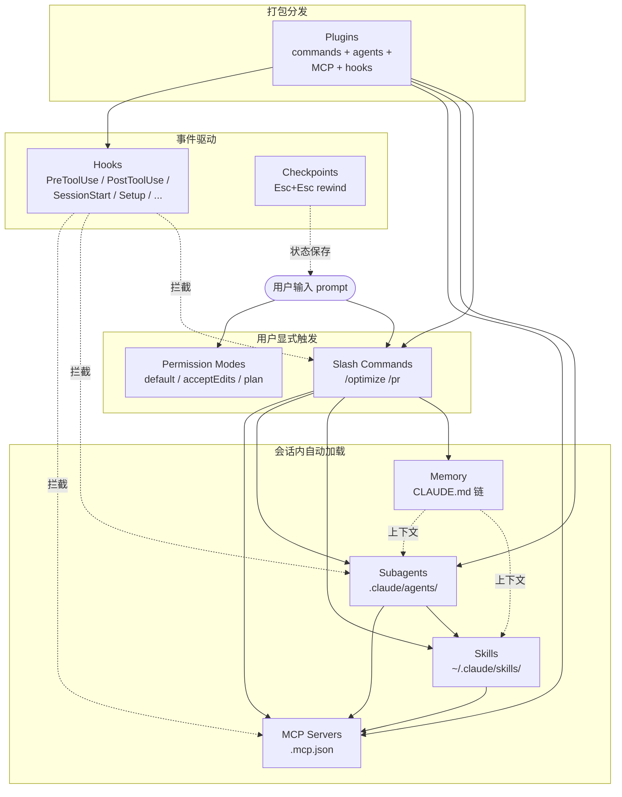
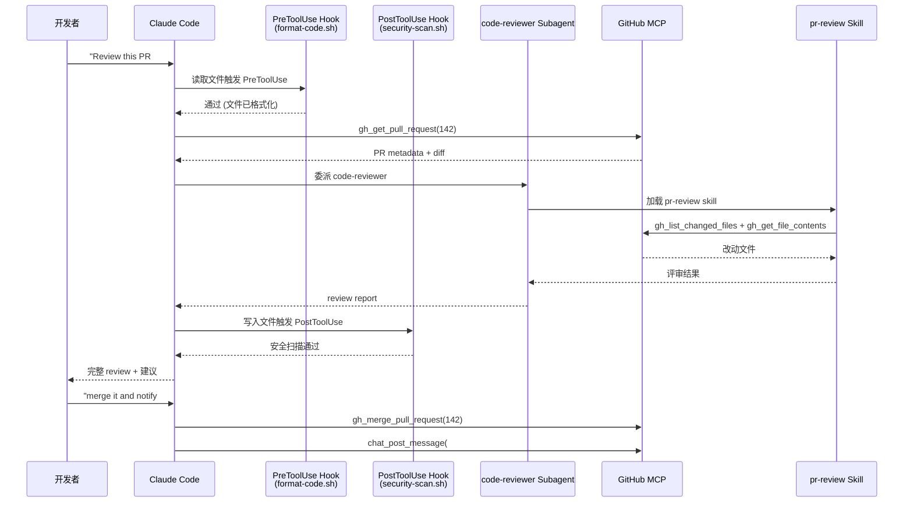

# Claude-Howto 实战指南：一份跟着 Claude Code 节奏同步更新的视觉化教程

## 核心判断

`luongnv89/claude-howto`（仓库 [luongnv89/claude-howto](https://github.com/luongnv89/claude-howto)）是 GitHub Trending 上常年挂在榜单前列的 Claude Code 中文实战教程仓库——当前版本 v2.1.160（2026-06-02），Stars 38.7k、Forks 4.6k，已经与 Claude Code 主线版本同步到 2.1+。

它的核心价值不是"再讲一遍 Claude Code 是什么"，而是把 Claude Code 拆成 **10 个渐进式模块 + 7 张交叉引用图 + 几十份 copy-paste 模板**，让一个能写出 `claude "explain this project"` 的人可以在一个周末内走完 slash commands → memory → skills → hooks → MCP → subagents → plugins 的完整链路，并且每一步都给出"为什么这样配"的可视化解释。

**它和 Anthropic 官方文档的边界**：

| 维度 | 官方文档（docs.anthropic.com） | Claude-Howto |
|------|-------------------------------|--------------|
| 形态 | 按功能列出的参考手册 | 渐进式学习路径 + 模板 + 图表 |
| 深度 | 每个 feature 的字段、行为 | feature 之间的组合方式 + 内部机制图 |
| 示例 | 最小可运行片段 | production-ready 模板，可直接 cp 进项目 |
| 更新节奏 | 与 Claude Code release 同步 | 紧随官方 release，目前滞后约 1 个 minor 版本 |
| 适合谁 | 查字段、看 spec | 想用 Claude Code 搭自动化工作流的人 |

> 一句话：官方文档告诉你**有什么**，Claude-Howto 告诉你**怎么把它们拼起来**。

## 项目地图

| 维度 | 关键信息 |
|------|----------|
| 仓库 | [luongnv89/claude-howto](https://github.com/luongnv89/claude-howto) |
| 官网 | [luongnv.com/claude-howto](http://luongnv.com/claude-howto/) |
| 当前版本 | v2.1.160（2026-06-02） |
| Stars / Forks | 38.7k / 4.6k（截至 2026-06-28） |
| 许可证 | MIT |
| 语言 | Python（少量 hooks 脚本 + 配套脚本） |
| 本地化 | English / 中文 / Tiếng Việt / 日本語 / Українська |
| 文档形态 | Markdown 教程 + Mermaid 图 + EPUB 离线版（4 种语言各一册） |

### 10 模块分布

| # | 模块 | 等级 | 时长 | 主线内容 |
|---|------|------|------|----------|
| 1 | [Slash Commands](https://github.com/luongnv89/claude-howto/tree/main/01-slash-commands/) | Beginner | 30 min | 用户主动调用的快捷指令、`/optimize`、`/pr`、`/generate-api-docs` 等 |
| 2 | [Memory](https://github.com/luongnv89/claude-howto/tree/main/02-memory/) | Beginner+ | 45 min | 跨会话持久上下文：`CLAUDE.md`、目录级、个人级 |
| 3 | [Checkpoints](https://github.com/luongnv89/claude-howto/tree/main/08-checkpoints/) | Intermediate | 45 min | 对话状态快照 + rewind，`Esc+Esc` 触发 |
| 4 | [CLI Basics](https://github.com/luongnv89/claude-howto/tree/main/10-cli/) | Beginner+ | 30 min | `claude -p`、headless、CI/CD 集成 |
| 5 | [Skills](https://github.com/luongnv89/claude-howto/tree/main/03-skills/) | Intermediate | 1 h | 自动触发的可复用能力（脚本 + 指令） |
| 6 | [Hooks](https://github.com/luongnv89/claude-howto/tree/main/06-hooks/) | Intermediate | 1 h | 事件驱动的 shell 自动化，5 类 29 种事件 |
| 7 | [MCP](https://github.com/luongnv89/claude-howto/tree/main/05-mcp/) | Intermediate+ | 1 h | Model Context Protocol：连外部工具与数据 |
| 8 | [Subagents](https://github.com/luongnv89/claude-howto/tree/main/04-subagents/) | Intermediate+ | 1.5 h | 隔离上下文的专项 agent，分工协作 |
| 9 | [Advanced Features](https://github.com/luongnv89/claude-howto/tree/main/09-advanced-features/) | Advanced | 2-3 h | Planning Mode、Extended Thinking、Background Tasks、Permission Modes、Headless Mode |
| 10 | [Plugins](https://github.com/luongnv89/claude-howto/tree/main/07-plugins/) | Advanced | 2 h | 把 commands + agents + MCP + hooks 打成一个可分发的包 |

> 完整 11-13 小时学习路径详见仓库内 [LEARNING-ROADMAP.md](https://github.com/luongnv89/claude-howto/blob/main/LEARNING-ROADMAP.md)；目录顺序按"由浅到深 + 前置依赖"排列，并不是按数字顺序——这是仓库设计的一个细节。

## 10 个模块怎么协作：一张系统地图

Claude Code 的特性看似零散，实际是一组可以彼此调用的能力组合。仓库在每个模块里都画了 Mermaid 图，下面这张是按**调用关系**重排的总览：



读这张图有三条主线：

1. **从左到右是"用户控制力递减"**：Slash Commands 是用户主动按下；Memory / Skills / MCP / Subagents 由 Claude Code 在调度时自动加载；Hooks 是事件触发的后台拦截。
2. **Skills 和 MCP 是被多个上游共享的能力**：Slash Commands、Subagents、Plugins 都能挂载同一份 Skill 或 MCP 配置。
3. **Plugins 是横切所有四层的打包形态**：一份插件可以同时提供 slash commands、subagents、MCP 配置、hooks。

## 一个任务流案例：从 PR review 到部署的自动化

仓库的 [Blog Posts](https://medium.com/@luongnv89) 与各模块 README 里反复出现一个组合：**"PR 审阅 + 自动格式化 + 安全扫描 + 测试 + 部署通知"**。下面把它拆成可复现的任务流，串起 6 个模块。



这里每个环节都对应一个模块：

| 环节 | 涉及的模块 | 仓库位置 |
|------|-----------|----------|
| 输入 + Claude Code 调度 | Slash Commands / Subagents | `01-slash-commands/` + `04-subagents/` |
| 读 PR 元数据 | MCP | `05-mcp/github-mcp.json` |
| 自动格式化拦截 | Hooks (PreToolUse) | `06-hooks/format-code.sh` |
| 安全扫描拦截 | Hooks (PostToolUse) | `06-hooks/security-scan.sh` |
| 委派专项评审 | Subagents | `04-subagents/code-reviewer.md` |
| 自动触发 pr-review | Skills | `03-skills/code-review-specialist/` |
| 合并 + 通知 | MCP (GitHub + Slack) | `05-mcp/multi-mcp.json` |

> 这套组合不是仓库"虚构"的——`/plugin install pr-review` 在 `07-plugins/` 目录里给出了完整可安装的版本，5 分钟就能跑通。

## 与 Anthropic 官方文档的边界

仓库明确把自己的定位放在"教程"，不替代官方文档。具体的边界：

### 仓库告诉你

- **怎么把多个 feature 拼成 workflow**：仓库的核心单元是"Use Case → Features You'll Combine"对照表，覆盖 7 类典型场景：自动化代码评审、团队 onboarding、CI/CD 自动化、文档生成、安全审计、DevOps 流水线、复杂重构。
- **每个 feature 内部的执行流**：每个模块的 README 都用 Mermaid 图描述该 feature 何时被加载、如何与 session 状态交互、什么时候会失败。例如 Hooks 模块的图会标明 `Setup` 事件只在每个 session 启动时执行一次，而不是每次 prompt 都跑。
- **跨版本差异**：仓库的 CHANGELOG.md 标注了每个版本同步到的 Claude Code 版本，例如 v2.1.160 同步了 v2.1.157 的 `claude plugin init`、v2.1.158 的 Bedrock/Vertex/Foundry Auto Mode、v2.1.160 的 `acceptEdits` 写安全文件提示等。
- **本地化版本**：每个模块都有 4 个翻译版本（中文 / Tiếng Việt / 日本語 / Українська），README 顶部用徽章切换。

### 仓库不告诉你（或不替你做）

- **Claude Code 本身的功能字段定义**：所有 `--flag`、`config key`、`env var` 的完整字段表仍然要去 [docs.anthropic.com](https://docs.anthropic.com) 查。
- **Anthropic 内部的模型选择策略**：仓库只覆盖到 `claude-opus-4-7` / `claude-sonnet-4-6` / `claude-haiku-4-5` 的命名与 `effort` 等级（`low`/`medium`/`high`/`xhigh`/`max`），不讨论 pricing 或 routing。
- **企业级 managed settings 的合规建议**：v2.1.160 文档化了 `parentSettingsBehavior`、`autoMode.hard_deny` 等 admin 字段，但没有托管部署的合规流程模板。

## 快速上手：15 分钟把第一份模板装进项目

仓库设计了"15 分钟起步 + 1 小时周末配置"两段路径。下面是按 [README](https://github.com/luongnv89/claude-howto/blob/main/README.md) 的 Get Started in 15 Minutes 章节整理的最小可运行流程。

### 第 1 步：克隆 + 装第一个 slash command

```bash
# 1. 克隆仓库
git clone https://github.com/luongnv89/claude-howto.git
cd claude-howto

# 2. 把第一个 slash command 装进你自己的项目
mkdir -p /path/to/your-project/.claude/commands
cp 01-slash-commands/optimize.md /path/to/your-project/.claude/commands/
```

### 第 2 步：装项目级 Memory

```bash
cp 02-memory/project-CLAUDE.md /path/to/your-project/CLAUDE.md
```

`CLAUDE.md` 是 Claude Code 在每个会话开始时自动加载的持久上下文。仓库提供 3 种粒度：

| 文件 | 加载时机 | 适用 |
|------|----------|------|
| `~/.claude/CLAUDE.md` | 个人级，每个项目都会加载 | 个人偏好 |
| `<repo>/CLAUDE.md` | 项目级，团队成员共享 | 团队规范 |
| `<repo>/src/api/CLAUDE.md` | 目录级，进入该目录时加载 | 子模块约定 |

### 第 3 步：装第一个 Skill

```bash
# 个人级（所有项目可见）
cp -r 03-skills/code-review-specialist ~/.claude/skills/

# 项目级（只在该项目生效）
cp -r 03-skills/code-review-specialist /path/to/your-project/.claude/skills/
```

Skill 与 Slash Command 的差别：Slash Command 需要用户主动 `/cmd` 调用，Skill 由 Claude Code 根据任务上下文自动触发。例如 `code-review-specialist` 会在你写完代码后自动进入评审流程。

### 第 4 步（可选）：装第一个 Hook

```bash
mkdir -p ~/.claude/hooks
cp 06-hooks/format-code.sh ~/.claude/hooks/
chmod +x ~/.claude/hooks/format-code.sh
```

然后在 `~/.claude/settings.json` 里挂载：

```json
{
  "hooks": {
    "PreToolUse": [{
      "matcher": "Write",
      "hooks": ["~/.claude/hooks/format-code.sh"]
    }]
  }
}
```

Hooks 在 Claude Code 触发工具调用前后拦截事件，可用于自动格式化、安全扫描、shell 日志、用户输入校验等。仓库文档化了 **5 类共 29 种事件**（v2.1.138 后新增 `Setup` 事件，用于会话级一次性环境准备）。

## 五条能力边界与适用人群

写教程的仓库最常见的反模式是"包打天下"。Claude-Howto 的边界相对克制：

### 仓库适合的场景

- **第一次接触 Claude Code，需要一份渐进式路径**：从 `claude` 命令起步，到把 6 类 feature 拼成自动化工作流。
- **想把已有项目接进 Claude Code**：10 个模块的模板都可以直接 cp，每个 README 都标注了 install / usage 两条命令。
- **需要离线和多语言**：每个 release 都附带 4 种语言的 EPUB（en / vi / zh / ja），GitHub Pages 也部署了静态站 [luongnv.com/claude-howto](http://luongnv.com/claude-howto/)。
- **需要追 Claude Code 的版本变化**：仓库每个 release 都同步官方最新版本，并明确写"v2.1.160 同步到 Claude Code 2.1.160 (2026-06-02)"。
- **需要一套参考实现写自己的内部教程**：MIT 许可，可以 fork、改造、二次分发。

### 仓库不适合的场景

- **寻找 Claude Code 之外的 AI 编程工具对比**：仓库聚焦 Claude Code，不涉及 Cursor、Aider、Cody、Continue 等竞品。
- **寻找量化交易 / Agent 投研 / 多 agent 协作等垂直场景教程**：那是 [HKUDS/Vibe-Trading](https://github.com/HKUDS/Vibe-Trading) 等专门项目的工作。
- **寻找企业 SSO、审计、合规部署指南**：仓库覆盖 `parentSettingsBehavior`、`autoMode.hard_deny` 等 admin 字段，但合规模板与审计日志结构需要自己拼。
- **寻找 LLM API 接入教程**：仓库讨论的是 Claude Code 这个 CLI 客户端，不是 Anthropic API / Messages API 的开发指南。

## 读这篇仓库的最短路径

如果你只有 15 分钟，按下面的顺序读：

1. **README 顶部的对比表**（"How Claude How To Fixes This"）—— 5 分钟，决定要不要继续。
2. **01-slash-commands/README.md** + **02-memory/README.md** —— 10 分钟，建立"用户主动触发"和"会话自动加载"两条主线的直觉。
3. **LEARNING-ROADMAP.md** —— 决定走哪条模块路径。

如果你有完整周末（11-13 小时），按 README 给出的 10 模块顺序走，每完成一个模块就跑一次 `/lesson-quiz [topic]` 自测，再进入下一个。Skill 评分会标出你的薄弱模块。

## 不覆盖什么

- **Claude Code 的内部实现**（Anthropic 私有），仓库只描述公开行为。
- **与 IDE 插件（VS Code / JetBrains）的深度集成细节**，仓库偏向 CLI + 文件配置视角。
- **token 用量计费与成本优化**：v2.1.160 文档化了 `effort.level` 字段对 hook 可见，但不展开价格估算。
- **多 agent 协作的市场模拟 / 投研场景**：那是其他专门项目的工作。
- **Hooks 5 类 29 种事件的全部示例**：仓库只给出 6 个常用 hook 脚本，更详细的列表需要读模块 README 全文。