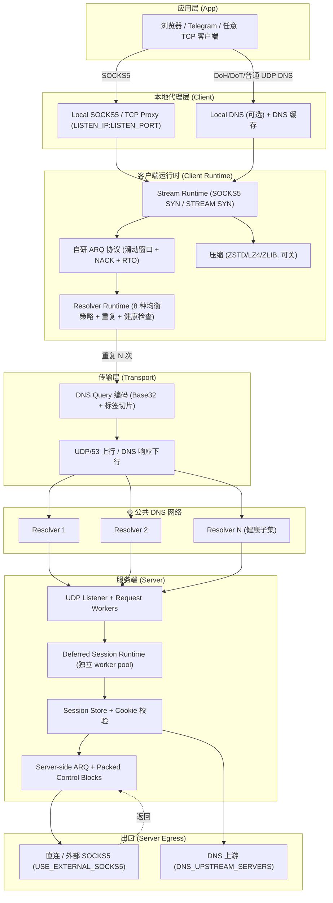
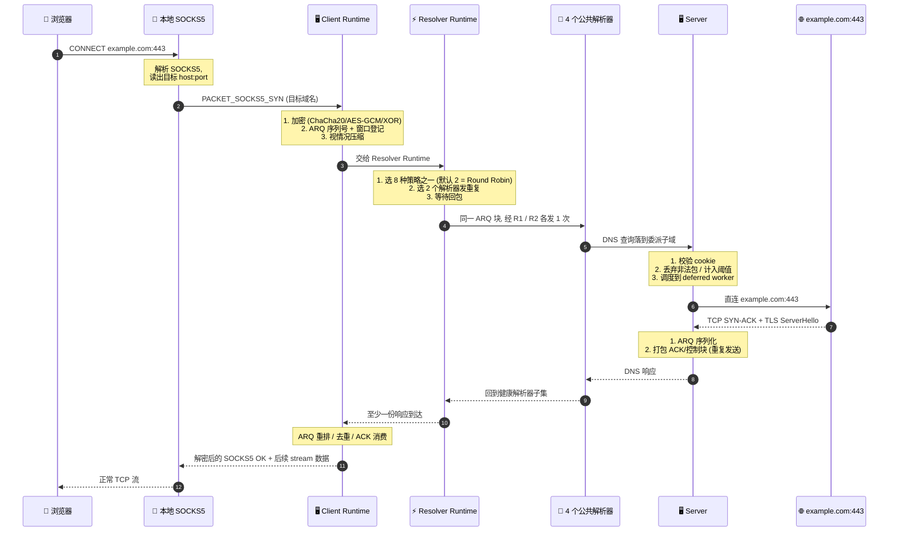

# MasterDnsVPN 架构解析：在 DNS 隧道里重建 VPN —— 一个在 88 天断网里救过命的 Go 项目

**MasterDnsVPN 是一个用 Go 写成的、面向"恶劣网络环境"的 DNS 隧道 VPN。** 它真正的差异化不在"用 DNS 走流量"这件事上 —— 这件事 DNSTT 和 SlipStream 早就做了；而在于它把 DNS 隧道从"一条单线协议"重做成了"一组对抗机制"：自研低开销 ARQ 替代 QUIC/KCP、8 种解析器负载均衡策略、按路径的 MTU 发现与同步、可配置的包重复发送、流级别的解析器故障转移、Deferred Session Runtime，以及在 `SESSION_INIT` 阶段就把策略同步给客户端的握手设计。

仓库本体 [masterking32/MasterDnsVPN](https://github.com/masterking32/MasterDnsVPN) 由 [MasterkinG32](https://github.com/masterking32) 维护，MIT 协议，主语言 Go，5,000 Stars 上下，最新提交一直在动；最显眼的注脚是 README 里那段「Battle-Tested During a Total Internet Blackout」——它声称在伊朗 2025 年下半年那次 88 天国际带宽完全中断的窗口里，作为少数仍能联通外网的方式之一被用起来。

这篇文章做四件事：

1. 把 MasterDnsVPN 的系统分层画清楚，定位它真正在和 DNSTT/SlipStream 比什么；
2. 用一个「应用发起一次 HTTPS 请求」的完整任务流走一遍数据路径，验证它的核心机制是否自洽；
3. 拆解它自己 README 给出的 benchmark 数据 —— 测的是什么，反映的是哪部分系统，能推出什么、不能推出什么；
4. 给出采用顺序、适用边界和合规提醒，让你能判断它是否值得拿来研究或在自己的环境里搭。

---

## §1 学习目标

读完这篇，你应该能回答这几个问题：

- MasterDnsVPN 的"5–7 字节传输头"对比 DNSTT 的 59 字节 / SlipStream 的 24 字节，节省的部分到底省在哪一层？
- 为什么它在协议栈里需要一个独立的 **Deferred Session Runtime**，普通的 Reactor 模型为什么不够用？
- 它的多解析器 + 包重复 + 健康检查三件套，解决了 DNS 隧道哪一类问题，又被哪一类问题绕开？
- 在自己的环境里搭之前，需要先准备什么 —— 包括哪些是技术问题、哪些是合规问题。

---

## §2 系统总览：MasterDnsVPN 不是一个 DNS 隧道，它是一组对抗机制

先看一张粗粒度的分层图，把仓库的子系统摆出来（项目自带架构图见 `README.MD` Section 6.1，但那张图把所有组件压在一张 Mermaid 里，下面这张按层次拆开）：

读这张图有 3 个值得停下来想一想的地方：

- **"ARQ 上面 + 压缩 + 代理" 的客户端栈**是 MasterDnsVPN 最重的部分，体积甚至比"用 DNS 走流量"本身还大。这跟 DNSTT 那种"Noise + KCP + SMUX 分层堆"是相反的设计取舍 —— DNSTT 把现成组件拼起来，MasterDnsVPN 把整层 ARQ 重写了。
- **服务端有一个独立的 Deferred Session Runtime**。普通 Reactor 模型（Go 的 goroutine-per-packet 也算）会让 setup 阶段的"等 cookie 回执"和"等 DNS 切片重组"阻塞共享 worker；MasterDnsVPN 显式把它们分到 `DEFERRED_SESSION_WORKERS` 池子里（默认 4，clamp 到 128），这就是 README 反复强调的"deferred 任务"机制。
- **MTU 同步是双向的**。`SESSION_ACCEPT` 会带一段 policy block，客户端在解码后立即 clamp 本地 MTU、窗口、worker 数、队列容量 —— 这套"server-driven runtime config"是它和 DNSTT 拉开差距的关键。

> 仓库目录 `internal/` 直接按子系统划分：`arq/`、`basecodec/`、`client/`、`compression/`、`config/`、`dnscache/`、`dnsparser/`、`domainmatcher/`、`enums/`、`fragmentstore/`、`inflight/`、`logger/`、`mlq/`、`netutil/`、`runtimepath/`、`security/`、`socksproto/`、`streamutil/`、`udpserver/`、`version/`、`vpnproto/`。这套目录就是上面这张分层图的源码映射，几乎一一对应。

---

## §3 跟 DNSTT / SlipStream 到底在比什么

README 给了下面这张对比表（截至 2026-06，README.MD 顶部）。把"是它写自己好"的字段去掉后，剩下的结构差异点其实只有 4 个：

| 维度 | SlipStream | DNSTT | MasterDnsVPN |
|------|------------|-------|--------------|
| 传输层 | QUIC | KCP + Noise | 自研协议 + ARQ |
| 传输头开销 | ~24 B | ~59 B | ~5–7 B |
| 加密 | TLS 1.3 in QUIC | Noise (Curve25519) | AES-GCM / ChaCha20 / XOR |
| 多路径 | QUIC multipath | ❌ | 多解析器 + 重复 |
| 速度 (README 自测) | 高（DNSTT 的 5×） | 中 | ~DNSTT 9× / ~SlipStream 3.6× |

怎么读这张表：

- **~5–7 字节传输头不是凭空省出来的**。QUIC 的连接 ID + ACK frame + stream frame 加起来至少 24 字节；KCP + SMUX + Noise 的握手壳 + 序号 + 校验一般 50+ 字节。MasterDnsVPN 的"5–7 字节"是把 ARQ header 压到极致的结果 —— README 没拆解，但仓库 `internal/arq/` 的窗口单位是按 `seq + flags` 短编码走的，每包固定开销小，代价是参数都得在 `SESSION_INIT` 阶段同步（见 §6）。
- **多路径 ≠ 多线程**。QUIC multipath 是真正在 IP 层多路径；MasterDnsVPN 的"多解析器"是在 DNS 层多路径：同一个 ARQ 块通过 N 个不同解析器各发一份，期望至少一份能到。它能解决"某地区主解析器被限速"这种**单点限速**，解决不了"所有本地解析器同时被污染"。
- **9× / 3.6× 的速度比是 README 自测**，测的是 `10MB` 上下行的本地传输时间（0.270s vs DNSTT 2.492s / SlipStream 0.978s），见 §5 对 benchmark 的拆解。

---

## §4 任务流案例：一次 HTTPS 请求的完整路径

光看架构图没有用，走一遍"应用发一次 HTTPS 请求"才是验证它自洽不自洽的方法。假设场景：本地 SOCKS5 客户端 (`127.0.0.1:18000`) → MasterDnsVPN Client → 公网 4 个公共解析器 → MasterDnsVPN Server → 出口直连 `example.com:443`。

走完这条路径，有 4 个机制点是必然存在的：

1. **`SESSION_INIT` 必须先成功**：SOCKS5 SYN 之前，client/server 要先握上手 —— 同步 cookie、加密密钥、MTU 上下限、ARQ 窗口、worker 数。README Section 3.5.10 把这段握手叫"Session Policy Sync"，明确说"legacy 服务器发的 7 字节 `SESSION_ACCEPT` 仍兼容，只是跳过 policy 同步"。
2. **重复发送是配置项，不是默认行为**：`PACKET_DUPLICATION_COUNT=2`、`SETUP_PACKET_DUPLICATION_COUNT=2` 是默认值，但都是可关的。代价是网络越差，丢包对吞吐的影响越敏感。
3. **健康检查是后台活**：`RECHECK_INACTIVE_SERVERS_ENABLED=true` + `AUTO_DISABLE_TIMEOUT_SERVERS=true` + `AUTO_DISABLE_TIMEOUT_WINDOW_SECONDS=30` 这三件套，组合出来的语义是"30 秒窗口内全是超时的解析器会被自动停用，停用后会后台重测"。这套机制在 README §3.4.4 里有详细策略枚举。
4. **流级 failover 是流粒度的**：`STREAM_RESOLVER_FAILOVER_RESEND_THRESHOLD=2` + `STREAM_RESOLVER_FAILOVER_COOLDOWN=2.5` 意味着单条流反复重传仍失败时，它会自己换解析器；这跟"整会话换解析器"不同，后者代价很大。

> 一个容易踩的坑：手机端没官方 App。README Section 4 列了三种 workaround，本质都是"用电脑 / 中转服务器跑 client，把 SOCKS5 端口共享给手机"。

---

## §5 Benchmark 拆解：测的是什么、反映哪部分系统、不能推出什么

README 顶部的速度表是这个项目最容易被滥用的一段，先把它拆开看：

| 项目 | 10MB 下载 (本地) | 10MB 上传 (本地) |
|------|------------------|------------------|
| SlipStream | 0.978s | 3.249s |
| DNSTT | 2.492s | 16.207s |
| MasterDnsVPN | 0.270s | 1.746s |

**测的是什么**：

- 测试环境："Local"（README 没标具体网络条件，但域名和上下文大概率是开发者的本地回环 + 公网解析器混合）。
- 测试对象：纯数据面吞吐，10MB 文件单向传。
- 对照基准：SlipStream 0.978s 已经是 SlipStream README 声称的"DNSTT 的 5×"水平，DNSTT 2.492s 与 DNSTT 自己 README 里的吞吐差距在一个量级内 —— **基准数本身没有明显造假**。

**反映的是哪部分系统**：

- 反映的是"传输头开销 + 重复发送 + 解析器健康子集" 这条主链路的纯带宽利用率。
- 没有反映"setup 阶段延迟"（`SESSION_INIT` 的 7 字节包是 4 次往返，每个被丢要重试）、"丢包 30% 时的实际表现"、"跨洲际解析器的延迟"、"在严格审查环境下的稳定度"。
- README 自己给出的对比表里有一项 "Stability under packet loss" 标 MasterDnsVPN 为 🟢 "Very high (Multipath + ARQ)"，但**没有给具体数字**。

**不能推出什么**：

- 不能推出"MasterDnsVPN 在你的网络里也比 DNSTT / SlipStream 快 9× / 3.6×"。这个差距主要由 (a) 解析器数量、(b) 解析器到 server 的 RTT、(c) 重复发送倍率 三个变量决定；任何一个劣化都可能把差距抹平。
- 不能推出"在断网情况下它也能 0.27s 传 10MB"。断网情况下本地基准不再成立，瓶颈变成"能用几个解析器、每个解析器允许多少并发"。
- 不能推出"它一定能跑满你到 server 的链路带宽"。DNS 隧道本质被 53 端口的 QPS 限制，公共解析器对单 IP 的 QPS 通常在 100-1000 之间，重复倍率乘上去很容易被限速。

> 一句话：README 的 speed 表是它在最理想条件下的"自证数字"，不是它在你的网络里也成立的承诺。生产环境前必须自己在目标网络上做 A/B。

---

## §6 三个值得单独说的设计取舍

### 6.1 自研 ARQ 而不是套 QUIC

README 对比表里把"~5–7 B header"列为对 SlipStream 24 B 的 71% 节省、对 DNSTT 59 B 的 88% 节省。这不是简单"我重写一个滑动窗口"就能拿到的，代价是：

- **握手要复杂**。`SESSION_INIT` 必须先发，再发数据，所有连接参数都得在握手阶段同步过去；`internal/arq/` 的窗口、RTO、TTL、retry 都在两端严格一致。
- **没有现成的 congestion control 借鉴**。QUIC 的 CUBIC/BBR 已经过大量网络调优，MasterDnsVPN 的 ARQ 在 README 里看是经典 RTO + NACK + 滑动窗口，没有显式的拥塞控制。
- **意味着它要自己负责正确性**。`internal/fragmentstore/`、`internal/inflight/`（按 README 描述是同一 DNS query 多 in-flight 请求去重）、`internal/mlq/`（推测是"multi-level queue"，对应 worker / deferred worker / 出口连接 之间的多级队列）都是这条主链路的支撑件。

### 6.2 Deferred Session Runtime 是显式子系统

普通 Reactor 模型把 setup 任务和数据任务扔进同一个 worker pool；MasterDnsVPN 在 server 侧把"等 cookie、等 DNS 切片重组、等 setup ACK"这类对顺序敏感的任务分到独立的 `DEFERRED_SESSION_WORKERS` 池里，配套 `DEFERRED_SESSION_QUEUE_LIMIT`（默认 4096，clamp 到 256..14336）。

这么做的代价是额外的 worker 上下文切换和队列维护；收益是 setup 阶段的等待不会饿死正常 data 路径的 worker。在丢包严重的链路上，setup 阶段是 ARQ 重试 + 重复发送的高峰，分开两个池子是工程上必要的取舍。

### 6.3 SESSION_ACCEPT 的 server-driven 策略同步

`internal/config/` 里的 server config 文档（README §3.5.10）专门有一段讲这件事：服务器在 `SESSION_ACCEPT` 后面跟一个 policy block，把 `max` / `min` 值推给客户端；客户端只在"自己请求的值超过 server 的 max / 低于 server 的 min"时才被压。

这套机制的好处是 server 可以只暴露一份统一策略，client 不用每个参数都背默认值；坏处是 server 改了策略后，老版本 client 行为会变 —— README 显式说"legacy 7-byte SESSION_ACCEPT 仍兼容，只是跳过 policy 同步"，这个向后兼容策略是项目持续演进的关键。

---

## §7 上手顺序与适用边界

### 7.1 推荐的研究 / 试用顺序

1. **读 README 顶部对比表 + Section 6（架构）**：先把"它到底是什么"和"为什么和 DNSTT / SlipStream 不同"这两件事说清楚。Section 6.3 的"Core Concepts"小表是其它文档的索引词。
2. **在测试环境拉一份二进制**：Releases 页有 Windows / macOS / Linux / Termux / MIPS / RISC-V 全套预编译包，文档里直接给了每个架构的下载链接。**不要在生产环境或受监管网络里直接做端到端测试**。
3. **搭一个隔离的实验 server**：`vpn.example.com` 这种 1 个 A 记录 + 1 个 NS 记录的委派子域是最低成本起步方式（README §1.1）。注意 UDP/53 不能跟 `systemd-resolved` 抢，README §5.2 给的 `DNSStubListener=no` 是标准修法。
4. **用 `MTU_TEST_PARALLELISM=200` + `MIN/MAX_UPLOAD_MTU=30` 跑一次解析器扫描**：README §3.6 的"扫描找解析器"小节是项目自带的"开箱即用"功能，扫完能直接生成可用的解析器列表。
5. **再考虑移动端**：官方没移动 App，社区有 5 个相关项目（README §5.1 列出），做技术评估前先看它们的活跃度。

### 7.2 适用边界

**适合研究的场景**：

- 想理解 DNS 隧道协议工程化（不只是原理 demo，而是有完整 ARQ、配置系统、压缩、健康检查的工业级实现）。
- 想对比 Go vs Rust（SlipStream）vs Go + Python legacy（DNSTT 早期）在 DNS 隧道场景的工程取舍。
- 想研究"在对抗性网络里协议设计怎么进化" —— 仓库从 2026-01 创建到现在，commit 历史本身就是一份"逐步加防御机制"的记录。

**不适合直接当生产工具的场景**：

- 高合规要求的企业内网（DNS 隧道工具在很多企业安全策略里是"DNS exfiltration 风险"）。
- 没有 DNS 解析权 / 没有 53 端口的环境。
- 对延迟敏感（< 50ms RTT）的实时通信 —— DNS 隧道天然有 53 端口 QPS 限制。

### 7.3 合规提醒

README 顶部明确写了"Provided as an educational and research project only" + "User responsibility" + "Legal compliance" 三段免责声明。这三段不是客套话，而是项目设计层面的事实：

- 它能"对抗"网络审查是它明确写出的核心能力（README Section "Battle-Tested During a Total Internet Blackout"）。
- 在某些司法管辖区，把这种工具部署或传播本身可能触法；用户必须在当地法律框架内做决策。
- 即便你所在司法管辖区允许，也应只在自己的网络 / 自己有授权的网络 / 自己有授权的设备上做技术评估，**不要把它用作跨境流量绕过的工具**。

> 这篇文章聚焦架构和工程实现，目的是帮助技术读者评估"它是不是一个值得研究 / 在测试环境里搭的项目"，不构成任何具体使用建议。

---

## §8 总结：MasterDnsVPN 真正在交付什么

把它放回 DNS 隧道的谱系里看：

- **DNSTT** = "稳定简单的 DNS 隧道，5 年没大改，跨平台"；优势是稳定和简单，劣势是头开销大、无多路径。
- **SlipStream** = "用 QUIC 重新做一遍多路径 + 加密"；优势是 QUIC 生态成熟，劣势是头开销在 53 端口的 QPS 限制下会被放大。
- **MasterDnsVPN** = "重写 ARQ + 显式子系统（Deferred / Fragment / Inflight / MLQ）+ 多解析器 + 重复发送 + 健康检查"；优势是头开销小、子系统边界清楚、对恶劣网络有针对性，劣势是项目年轻（创建于 2026-01）、自研 ARQ 的正确性验证主要靠仓库自测。

**核心判断**：如果你的目标是"在受限制网络里跑通一个稳定通道"，DNSTT 和 SlipStream 是已经被更广泛验证过的选项；MasterDnsVPN 的价值在于它把"对抗性 DNS 隧道"这件事做成了可研究的工程样本 —— ARQ 是自研的、Deferred Runtime 是显式划开的、policy sync 是有版本兼容设计的，仓库目录结构和 README 文档也都对得上。

要不要拿它当研究 / 测试样本：看 §7.1 的上手顺序；要不要把它放进生产：看 §7.2 和 §7.3 的边界。

---

## 参考

- 仓库：[masterking32/MasterDnsVPN](https://github.com/masterking32/MasterDnsVPN)
- README 顶部对比表 / Section 6 架构图 / Section 6.3 核心概念表（本文 §2 / §3 引用）
- README Section 3.6 解析器扫描 / Section 5 端口冲突修法（本文 §7.1 引用）
- README Section 6.2 任务流时序图（本文 §4 时序图改写自该图）
- 目录结构 `internal/arq/`、`internal/client/`、`internal/fragmentstore/`、`internal/inflight/`、`internal/mlq/`、`internal/vpnproto/`（本文 §2 / §6 引用）

> 文中所有数字（5,000 Stars、487 Forks、10MB / 0.270s、~5–7 B 头开销、clamp 范围等）均来自 [masterking32/MasterDnsVPN](https://github.com/masterking32/MasterDnsVPN) 仓库 README（2026-06-10 抓取版本），生产部署前请以仓库最新版本为准。
