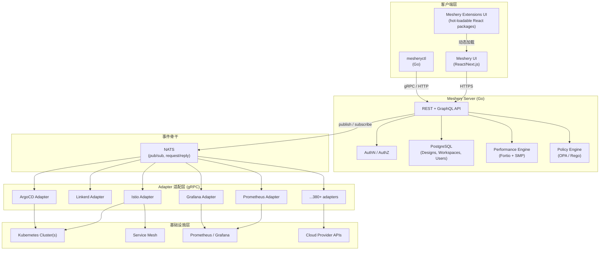

## 学习目标

通过本文，你将能够：

- 理解 Meshery 不是 Kubernetes dashboard，而是平台工程层的统一协调面
- 区分 Meshery 的 4 类组件（Server、UI、mesheryctl、Adapters、Operator）及其职责
- 理解 Meshery 的 4 个核心机制：Designer 与 Design 模型、Adapter 适配层、Performance Management、GitOps 集成
- 知道 Meshery 与 ArgoCD、Backstage、Prometheus 等工具的边界
- 能够评估 Meshery 是否适合你的团队和组织规模

## 目录

1. [核心判断](#核心判断)
2. [系统地图：Meshery 真正由什么组成](#系统地图 meshery-真正由什么组成)
3. [边界拆分：4 个容易混淆的并行机制](#边界拆分 4-个容易混淆的并行机制)
4. [核心机制 1：Designer 与 Design 模型](#核心机制-1designer-与-design-模型)
5. [核心机制 2：Adapter 适配层与 NATS 总线](#核心机制-2adapter-适配层与-nats-总线)
6. [核心机制 3：Performance Management 与 SMP 规范](#核心机制-3performance-management-与-smp-规范)
7. [核心机制 4：GitOps 集成与 PR Snapshot](#核心机制-4gitops-集成与-pr-snapshot)
8. [任务流案例：把 Istio 装到两个集群并做性能基线](#任务流案例把-istio-装到两个集群并做性能基线)
9. [性能基准：怎么看 Meshery 给出的数字](#性能基准怎么看-meshery-给出的数字)
10. [扩展点：4 条独立的可插拔路径](#扩展点 4-条独立的可插拔路径)
11. [部署形态与运维边界](#部署形态与运维边界)
12. [采用建议与适用边界](#采用建议与适用边界)
13. [结尾判断](#结尾判断)
14. [自测题](#自测题)
15. [练习](#练习)
16. [进阶路径](#进阶路径)
17. [资料口径说明](#资料口径说明)

---

## 核心判断

Meshery 不是一个 Kubernetes dashboard。它解决的不是"怎么把 kubectl 命令画到网页里"这个老问题，而是把"设计 → 仿真 → 多集群协调 → GitOps 同步 → 性能基线 → 协作审阅"这条原本散落在 6、7 个工具里的链路，收敛到一个统一管理面里。

把它当成 kubectl 的 Web 化版本，会错过它真正在做的事：

- 一份 Meshery Design（YAML/JSON）可以同时描述多个 cluster、多种 service mesh、多种工作负载的关系图，而不只是 k8s manifest 的列表。
- 它的 adapter（适配器）体系（gRPC 接口，Go / 多语言实现）让你用同一套 REST/GraphQL API 去管理 380+ 种云原生基础设施——Istio、Linkerd、Consul、Prometheus、Grafana、 ArgoCD、HashiCorp Vault、Cilium、Nginx……每接入一个新东西，写一个新的 adapter 即可。
- 它的 performance management 走的是 [SMP（Service Mesh Performance）](https://smp-spec.io) 规范，用 Fortio 做负载生成，能在不同 release、不同 mesh、不同云上做可比的延迟/吞吐量基线——这是它直接连到 CNCF 性能标准化的入口。
- 它的 GitOps 不是"仓库里放 YAML，工具同步"那套——而是把 Meshery 自己的 Design 当作 source of truth，PR 里直接给出"我的集群前后长什么样"的 snapshot diff，让设计评审变成可视化对比。

所以读 Meshery 的正确姿势，是把它当成 **平台工程（Platform Engineering）层的统一协调面**——介于 IDP（Internal Developer Platform，内部开发者平台）和具体基础设施之间，向上对应用开发者屏蔽 mesh/k8s 的差异，向下对不同云和不同 mesh 提供一致的操作语义。

如果你正在做下面任何一件事，本文会帮你判断 Meshery 该不该出现在你那张工具表上：

- 你的组织同时跑 2 套以上 Kubernetes 集群（多云、本地+云、staging+prod）需要统一管理面
- 你在做 service mesh 选型或跨 mesh 迁移，需要可复现的性能基线
- 你在搭内部 IDP，希望"应用开发者只要点几下就能创建一个完整可观测、可治理的工作负载"
- 你的平台工程团队被一堆 adapter、operator、GitOps 工具拼凑得疲惫，想收拢到一个统一控制面

下面从系统地图开始拆。

## 系统地图：Meshery 真正由什么组成

Meshery 项目不是单一进程，而是 4 类互相协作的组件 + 1 个事件总线 + 1 个可选的 Kubernetes Operator。

| 组件 | 语言/技术栈 | 角色 | 关键职责 |
| --- | --- | --- | --- |
| **Meshery Server** | Go | 中心控制面 | REST + GraphQL API、用户/权限、Design 存储、connection 管理、benchmark 编排 |
| **Meshery UI** | React/Next.js | 浏览器/桌面客户端 | 可视化 Designer、MeshMap 拓扑图、Workspaces 协作、性能结果可视化 |
| **mesheryctl** | Go | CLI 客户端 | 终端入口、CI 集成、远程 Server 调用 |
| **Meshery Adapters** | Go / 任意支持 gRPC 的语言 | 集成适配层 | 针对每种 cloud native 基础设施的 gRPC 适配（Istio、Linkerd、Prometheus……） |
| **Meshery Operator**（可选） | Go / Kubernetes CRD | K8s 侧守护 | 在 K8s 集群内部署 Meshery Server 时，Operator 负责生命周期管理 |
| **Event Bus** | NATS | 事件骨干 | Server ↔ Adapters、Server ↔ Server 之间的异步消息 |

光看这张表还不够直观，下面这张 Mermaid 图把组件之间的关系画出来：

这张图想说明三件事：

1. **Server 是唯一有状态组件**：用户的 Design、Workspace、连接信息、性能历史都在 Server 端。客户端和 Adapter 都是无状态的，可以随时扩缩。
2. **NATS 是事实上的"应用层 ESB"**：所有 Server ↔ Adapter 通信都走 NATS 上的 pub/sub 或 request/reply。这一层让 Adapter 可以独立部署、独立升级、独立扩展。
3. **380+ integrations 是 adapter 数量的总和**：每接一个 cloud native 工具，就有一个 gRPC adapter 在 NATS 上应答 Meshery Server 的请求。Meshery 的"广度"实际上来自这套 adapter 协议，不来自 Meshery 核心代码。

读懂这三层，就理解了 Meshery 扩展性为什么可以做到"插拔式"——接新工具不需要改 Server 也不需要改 UI，只需要在 NATS 上注册一个新的 gRPC adapter。

## 边界拆分：4 个容易混淆的并行机制

在动 Meshery 之前，先把 4 套"看起来像，但其实独立"的机制分清楚，否则你会在它 3 万多行的 Go 代码里迷路。

### 1. Adapter 协议 vs. Kubernetes Operator

Meshery Adapter 是 **gRPC 进程**，跑在 Meshery Server 旁边或独立部署。它的作用是"把 Meshery 的统一 API 翻译成具体工具的命令"。比如 "Meshery 要给 Linkerd 装 mTLS"——这个动作是 Linkerd adapter 通过 K8s API 调用 helm install 完成的。

Meshery Operator 则是 **K8s 内的 CRD Controller**，它管的是 Meshery Server 本身在 K8s 集群里的生命周期（部署、升级、HA）。它和 Adapter 没有直接调用关系。

> **混淆点**：很多人看到 "Meshery Operator" 就以为它是用来管理 mesh / workload 的——实际上它的目标是"管 Meshery 自身"。要管 mesh，用的是 adapter。

### 2. Design vs. Manifest

Meshery Design 是 Meshery 自己的领域模型，描述"一个完整的应用拓扑：哪些 component、哪些 relationship、跑在哪个 cluster"。一份 Design 可以同时引用多种 K8s 资源、多种 mesh 配置、多种非 K8s 资源。

它会在 Server 端被 **分解**成多个 K8s manifest，然后由对应的 adapter 应用到各个 cluster。Design 本身不直接等于 kubectl apply 的输入——它是更高一层的"业务级"描述。

> **混淆点**：把 Design 当成 "超级 Helm chart"——Helm chart 是模板渲染后的产物，Design 是关系图模型。两者的设计目的不在一个抽象层。

### 3. Workspaces vs. Environments

Workspaces 是 **协作单元**——一队人共享的命名空间，承载 Design、performance profile、成员、权限。

Environments 是 **连接单元**——一组 K8s 集群连接、Prometheus 端点、credentials 的集合。一个 Workspace 可以包含多个 Environment（dev、staging、prod、跨云集群）。

> **混淆点**：把 "Workspace = 集群"——不是。Workspace 是"团队的项目"，一个 Workspace 可以跨多个集群；一个集群也可以被多个 Workspace 共享（通过 RBAC 控制）。

### 4. Performance Management vs. Monitoring

Meshery 的 Performance Management 走的是 **主动负载 + 测量**——它会用 Fortio 主动发 HTTP/gRPC/TCP 流量到目标，收集 p50/p95/p99 延迟和吞吐量。

Prometheus/Grafana 集成是 **被动采集**——把 K8s 集群和应用的指标拉过来做面板。

两件事可以并行（先看大盘，再做主动打点），但目标和数据来源不同。

> **混淆点**：以为 Meshery 帮你"看监控"——它主要在帮你"做基准"和"打主动流量"。被动的 metrics 面板，它只是借 Prometheus/Grafana。

把这 4 条边界记住，下面的架构细节就不会读串。

## 核心机制 1：Designer 与 Design 模型

Meshery UI 里的 Designer（也叫 MeshMap 早期形态）是一个可视化关系编辑器。你拖一个 Istio VirtualService 节点，拖一个 K8s Deployment 节点，拖一条边表示"流量从 VirtualService 路由到 Deployment 端口"——Meshery 会自动识别这种"边关系"对应的语义（route-to、bind-to、expose-to）。

这种"智能推断关系"的能力来自 Meshery 维护的 [relationships schema](https://docs.meshery.io/concepts/logical/relationships)。它为每种 component 预定义了它能"连接"到哪些其他 component，以及连接的类型。Designer 维护一张类型化的图，然后导出成 Design。

Design 本身是一份可版本管理的文件（YAML/JSON），所以它可以走 PR 流程，可以做 snapshot diff，可以进 Git。

**关键设计取舍**：Meshery 选了一条和"纯 CRD"相反的路——它没有要求所有基础设施都抽象成 K8s CRD。Istio 已经是 CRD，但 Grafana dashboard 不是 K8s 资源，Vault 策略不是 K8s 资源，AWS IAM 也不是。Meshery 用 Design 这样的"超集图模型"覆盖所有这些类型，然后由不同 adapter 翻译到不同后端——这是它能接 380+ integrations 的根本原因。

代价是：Design 模型的语义比 K8s manifest 复杂，关系图的推理需要维护一份不断扩展的 schema。

## 核心机制 2：Adapter 适配层与 NATS 总线

Adapter 是 Meshery 真正"广"的原因。一个典型的 adapter 生命周期：

1. **注册**：Adapter 启动后向 NATS 广播自己支持的 component 类型。
2. **被发现**：Meshery Server 通过 NATS 订阅到这份注册表，更新自己的 adapter registry。
3. **接收请求**：用户在 UI 上"Apply Design"——Server 把 Design 里属于这个 adapter 的部分打包成 gRPC 请求，通过 NATS 发到对应 adapter。
4. **执行**：Adapter 翻译成 K8s API、Cloud API 或其他协议的调用，落地到目标基础设施。
5. **回调**：Adapter 把执行结果（成功、失败、变更摘要）通过 NATS 回报给 Server。
6. **快照**：Server 把结果存进 PostgreSQL，下次同样的 Design + 同一 cluster 可以做 diff。

这套流程的几个关键工程取舍：

- **用 NATS 而不是直接 gRPC stream**：NATS 的 request/reply + pub/sub 让 Server 不用关心 adapter 进程死活——adapter 挂了，Server 只会收不到回复，不会阻塞。这对"插件式"扩展至关重要。
- **gRPC + protobuf IDL**：adapter 之间的协议是严格定义的 protobuf，每个 component 类型对应一个 message schema。Meshery 用 Nighthawk / AsyncAPI 的方式把"长什么样"和"怎么发"分离。
- **hot-loadable React packages for UI**：adapter 不仅提供 backend 翻译，还能在 UI 里动态加载对应的 component palette。这意味着接一个新工具，后端写 gRPC 服务，前端写 React 组件包，Server 端不需要重新部署。

理解这一层之后，Meshery 到底"开源在哪"就清楚了：**Server 的 REST/GraphQL + UI 的 React 框架 + Adapter 的 gRPC 协议定义**全部开源。具体某个 adapter 是不是官方维护，要看 [meshery-extensions](https://github.com/meshery-extensions) 组织下的仓库——这是它社区化扩展的物理位置。

## 核心机制 3：Performance Management 与 SMP 规范

这是 Meshery 在 CNCF 生态里最被低估、但最有价值的一块。

### 它在解决什么

Service mesh 选型（Istio、Linkerd、Consul、Cilium service mesh）最大的痛点不是"哪个支持更多协议"——而是"在我这个真实工作负载下，mesh 加进去之后多出来的延迟和吞吐损耗有多大"。各家厂商都会说自己的 mesh overhead 低，但没有一个公认的测量口径。

[SMP（Service Mesh Performance）](https://smp-spec.io) 是 Meshery 团队参与起草的 CNCF 沙箱规范，定义了一组**标准的负载生成 + 测量 + 报告**流程。它规定：

- 用什么负载（HTTP/1.1、HTTP/2、gRPC、TCP）
- 怎么调度（warmup、duration、cooldown、并发曲线）
- 测什么指标（latency histogram、requests per second、error rate）
- 怎么报告（一份可比的 JSON / 报告卡片）

Meshery 是 SMP 的**参考实现**——你不需要自己搭一套测量平台，用 Meshery + Fortio（也是 CNCF 项目）就能跑出符合 SMP 规范的报告。

### 一次 SMP 测量在 Meshery 里怎么走

1. 用户在 UI 或 mesheryctl 里选一个 Performance Profile（HTTP/1.1、100 并发、持续 30s 之类的参数）。
2. Meshery Server 把 profile 序列化，通过 NATS 发到 meshery-perf 这个内置 adapter。
3. perf adapter 拉起 Fortio，按 SMP spec 的标准流程打负载。
4. Fortio 的输出（原始 latency histogram）回到 Server。
5. Server 把数据存入 PostgreSQL，渲染成 SMP 标准报告格式。
6. 同一份 profile 可以在不同时刻、不同 mesh 版本、不同 K8s 集群上重跑，生成历史曲线。

### 测什么 / 不测什么

要小心，**SMP 测的是 mesh 的 overhead，不是 mesh 本身的能力，也不是你应用的整体性能**。

- **测的是**：在标准化负载下，sidecar proxy 引入的额外延迟、CPU、内存开销；不同 mesh 配置的 p99 对比；同一个 mesh 跨版本的回归。
- **不测的是**：你的应用本身的性能上限（那是 JMeter / k6 / wrk 的活儿）；mesh 的安全能力（mTLS 强度、零信任策略）；跨 region 的真实网络表现（SMP 默认是同集群内的）。

把这两件事混在一起做决策，是很多团队看完 SMP 报告后踩坑的根源。Meshery 在 README 里也直接说："Meshery enables you to measure the value provided by Docker, Kubernetes, or other cloud native infrastructure in the context of the overhead incurred."——价值是 overhead，不是绝对性能。

## 核心机制 4：GitOps 集成与 PR Snapshot

Meshery 的 GitOps 不是另起炉灶——它是"Design 进 Git，PR 触发可视化对比"。

**典型流程**：

1. 平台工程师把 Meshery Design 文件 commit 到 GitHub repo。
2. 当有人提 PR 修改 Design 时，Meshery 通过 GitHub App 接到 webhook。
3. Meshery Server 用 PR 里的新 Design 跑 dry-run，对照上一次成功部署的 Design，生成一张"前后差异"的拓扑图。
4. 这张图作为 PR comment 回到 GitHub，reviewer 在 PR 页面就能直接看到"我这次改完，集群会长成什么样"。

底层用的是 K8s 的 server-side dry-run——Meshery 把 Design 拆成 manifest 后，**用 dry-run 模式调用 K8s API**，得到 K8s 会怎么 apply 的结果，但不真正落地。这样既安全又便宜，PR 检查可以在几秒内完成。

这条链路把"设计评审"从"读完 500 行 YAML 想象它长什么样"改造成"直接看图"——这是 Meshery 在 GitOps 上的差异化点。ArgoCD / Flux 解决的是"集群状态往 Git 同步"，Meshery 解决的是"在 Git 还没同步之前，让 reviewer 提前看到效果"。

## 任务流案例：把 Istio 装到两个集群并做性能基线

把上面的机制串起来，看一次"真实任务"在 Meshery 里怎么流过。

**场景**：平台工程团队要在 staging 集群装 Istio，在 production 集群装 Linkerd，跑一份 SMP 性能基线报告，结论发到 Slack。

**步骤 1：在 Designer 里建 Design**

- 打开 Meshery UI，进 workspace `platform-eng`。
- 拖 component: K8s Namespace `istio-system`、Istio Control Plane、3 个 sample Deployment、VirtualService。
- 拖关系边：VirtualService → Deployment（route-to）。
- 导出 Design 文件 `mesh-baseline.yaml`，commit 到 Git。

**步骤 2：定义多集群 Environment**

- 在 Meshery Server 里建两个 Environment：`staging-k8s`、`production-k8s`，分别填入 K8s API server 地址 + service account token。
- 给 staging 选 Istio adapter，给 production 选 Linkerd adapter（同一个 Design，部署时按 Environment 分流）。

**步骤 3：Dry-run**

- mesheryctl 设计 apply --design mesh-baseline.yaml --env staging-k8s --dry-run
- Server 拿到 Design，识别出 Istio 相关 component，走 Istio adapter，adapter 把这些 component 翻译成 Istio Helm chart，调用 K8s API 用 server-side dry-run 模式校验。
- 返回一份 "would-create / would-update / would-noop" 摘要。
- 同一个 Design 对 production-k8s 跑，识别 Linkerd 部分，走 Linkerd adapter。

**步骤 4：真实 Apply**

- 验证 dry-run 没问题，去掉 --dry-run，apply 到两个集群。
- Adapter 通过 NATS 把 apply 结果回报，Server 存 snapshot。

**步骤 5：跑 SMP Performance Profile**

- mesheryctl perf run --profile http-100conn-30s --target staging-k8s
- perf adapter 拉起 Fortio，按 SMP spec 的标准流程向 sample Deployment 注入负载。
- 结果存进 PostgreSQL，生成 SMP 报告。

**步骤 6：对比 + 通知**

- 同一 profile 在 production-k8s 上再跑一次。
- 在 UI 的 Performance 页面选两次 run，生成对比图。
- 把报告导出 / 截图，slack 通知架构评审组。

**整个流程里，Meshery 充当的是"统一入口 + 翻译 + 测量 + 历史"**——上面这些步骤如果不用 Meshery，至少要 kubectl + helm + istioctl + linkerd + Fortio + Prometheus + Grafana + 手写对比脚本七件套。

## 性能基准：怎么看 Meshery 给出的数字

Meshery 自己在 README 里说"create and reuse performance profiles for consistent characterization"——这意味着它**自己**的产物体现在"可比性"，而不是"绝对性能"。

所以读 Meshery 的 benchmark 数据，要看三件事：

1. **负载是不是符合 SMP spec**：meshery-perf 的报告卡片格式是公开的（[smp-spec.io](https://smp-spec.io)）。如果一份报告不符合 SMP 标准格式（缺 warmup、缺 histogram、没声明 mesh 版本），就不能直接和别的报告对比。
2. **对比的是哪两个 mesh / 哪两个版本**：单看一个数字没用，要看 v(sidecar) 的 p99、p95、p50 在不同 mesh 下的分布。SMP spec 的核心价值就是"用同一把尺子量不同 mesh"。
3. **负载侧和服务侧的版本是否一致**：K8s 版本、OS、kernel、CNI、CPU 型号都会影响结果。Meshery 的好处是 profile 可复现，profile 里可以记录这些元数据，下次重跑时核对环境是否一致。

**不能从 Meshery 报告里推出**：

- "Istio 在所有场景下都比 Linkerd 慢 / 快"——SMP 测的是当下 profile 的 overhead，跨场景不直接外推。
- "我的应用上线后性能就一定和报告一样"——profile 用的是 sample workload，不等于生产真实流量。
- "装上 mesh 后一定增加 X% 延迟"——profile 数字和你的 sidecar 配置、资源限制、流量模式强相关。

把这三点记住，Meshery 的 performance 段才不会被读成"竞品对比"或"性能保证"。

## 扩展点：4 条独立的可插拔路径

Meshery 把自己定位为 platform engineering 基础，公开了 4 类扩展点（[docs.meshery.io/extensibility](https://docs.meshery.io/extensibility)）：

1. **gRPC Adapters**：后端集成新工具的标准路径。写一个 gRPC service，实现 Meshery 定义的 component proto，注册到 NATS。
2. **Golang Plugins**：以 .so 形式 hot-load 到 Meshery Server 进程内，绕过 gRPC 序列化开销。适合对延迟敏感的自定义操作。
3. **NATS Topic Subscriptions**：直接订阅 Meshery 内部事件流（apply 完成、perf 完成、policy 触发等），做异步联动。比如"每次 perf 跑完，自动发一条飞书 / Slack 通知"就是一条 NATS 订阅。
4. **React Packages（UI Extensions）**：往 Meshery UI 里动态加载新的 panel、新的 Designer component palette。和 backend adapter 一一对应，但生命周期独立。

这 4 条路径不是 4 种做同一件事的方式，而是 4 个**不同抽象层**的可插拔点：

| 扩展点 | 适合场景 | 部署形态 |
| --- | --- | --- |
| gRPC Adapter | 接一个全新的 cloud native 工具 | 独立进程 / sidecar |
| Golang Plugin | 需要调用方进入 Meshery Server 进程内逻辑（如自定义 policy） | .so hot-load |
| NATS Subscription | 做事件联动、跨工具集成 | 任意能连 NATS 的进程 |
| React Package | 给现有 adapter 加 UI 面板 | 动态 bundle |

理解这张表之后，你可以判断"我要做 X，应该走哪条路"——这是评估 Meshery 是否适合做内部 IDP 底座的关键判断点。

## 部署形态与运维边界

Meshery 自己有 5 种主流部署路径（README 列了 16+ supported platforms），但抽象下来是 3 类：

- **本地（Mac / Linux / Windows）**：`curl -L https://meshery.io/install | bash -` 拉起 Docker Desktop 上的 Meshery Server + UI。开发/评估用。
- **Kubernetes 集群内部署**：用 Helm chart 或 Operator 部署到一个集群，Operator 负责升级和 HA。生产用。
- **多集群场景**：Meshery Server 集中部署（可以放在一个 management cluster），各个业务集群上**不需要**部署 Meshery——Server 通过 K8s API + 服务账号 token 远程操作。

**运维边界**：

- Meshery Server 是有状态服务（PostgreSQL 后端），需要单独考虑 HA 和备份。
- NATS 可以用 Meshery 自带的内置实例（开发用），生产建议用外部 NATS 集群。
- Adapter 进程可以根据环境数量水平扩展——一个 adapter 进程可以同时服务多个 Environment。
- Meshery UI 是无状态前端，可以 CDN 化（事实上 meshery.io 的 cloud playground 就是这么做的）。

## 采用建议与适用边界

**先评估清楚再决定**。Meshery 不是"装上就有用"的工具，强行上反而增加复杂度。

### 适合先用 Meshery 的团队

- **平台工程团队，跨多 K8s 集群 + 多 mesh** 协调是日常工作——Meshery 的多 Environment + 多 Adapter 模型正好对应这个场景。
- **正在做 service mesh 选型 / 升级决策**——SMP 性能基线给了你一个可比的决策依据。
- **已经在用 GitOps，希望 PR 评审可视化**——Meshery 的 PR snapshot 是补这块短板成本最低的方式。
- **搭内部 IDP**——Meshery 的 adapter + workspace 机制可以作为 IDP 的 backend。

### 暂时不适合的团队

- **单集群、单 mesh、工作负载数量 < 50**——Meshery 的复杂度收益撑不起来。kubectl + ArgoCD 就够了。
- **没有 platform engineering 角色**——Meshery 是给"管平台的人"用的，不是给应用开发者直接用的。应用开发者通过 IDP 间接触达。
- **数据合规要求极严，不允许把集群连接信息集中存储**——Meshery 把 credentials 存进 PostgreSQL，需要评估这一点的合规风险。
- **已经在用一套成熟的 Backstage + ArgoCD + Prometheus + 自研脚本**——Meshery 和 Backstage 高度重叠（都做 IDP 协调面），引入 Meshery 之前要算清楚替换成本。

### 推荐的采用顺序

1. **第 1 步：评估**——用 mesheryctl 跑一份 SMP profile，测一下你现在的 mesh overhead，得到基线数字。这一步零风险，可以放在任何集群。
2. **第 2 步：试水**——在 staging 集群上跑一份多集群 Design，用 PR snapshot 验证设计评审流程。仍然不涉及生产。
3. **第 3 步：扩展**——把更多 adapter 接入（Prometheus、Grafana、ArgoCD），把 Meshery Server 部署到生产 management 集群。
4. **第 4 步：制度化**——把 Design 文件 commit 流程写进团队 RFC 模板，把 SMP perf 跑通到 release pipeline 里。

### 它不能替代的工具

- **不替代 ArgoCD / Flux**：Meshery 的 apply 是命令式的（通过 adapter 调 K8s API），不是声明式的 reconciliation loop。它擅长"做一次性配置变更 + 测量"，ArgoCD 擅长"持续把状态往 Git 拉齐"。
- **不替代 Datadog / Prometheus**：Meshery 的 metrics 面板是借 Prometheus/Grafana 的。它的强项是"主动打点 + 标准化基线"，不是"全栈可观测"。
- **不替代 Backstage**：两者在 IDP 协调面重叠。Backstage 偏"开发者门户 + 服务目录"，Meshery 偏"基础设施操作 + 性能基线"。可以一起用，但要先想清楚谁的边界在哪。

## 常见问题（FAQ）

### Meshery 和 Kubernetes Dashboard 有什么区别？

Meshery 不是 Kubernetes Dashboard。它是一个平台工程层的统一协调面，支持多集群管理、Service Mesh 性能基线、GitOps 可视化对比等高级功能。Kubernetes Dashboard 主要是 kubectl 的 Web 界面，而 Meshery 做的是把"设计 → 仿真 → 多集群协调 → GitOps 同步 → 性能基线"整条链路收敛到一个统一管理面。

### Meshery 的 Performance Management 能替代 Prometheus 监控吗？

不能。Meshery 的 Performance Management 做的是主动负载 + 测量（用 Fortio 打流量，收集延迟/吞吐量），Prometheus 做的是被动采集。两者的目标和数据来源不同，可以并行使用。

### 我需要多少个集群才适合用 Meshery？

如果你只有一个集群、单 mesh、工作负载数量 < 50，Meshery 的复杂度收益撑不起来，用 kubectl + ArgoCD 就够了。Meshery 适合跨多 K8s 集群 + 多 mesh 协调的场景。

### Meshery 的 Design 和 Helm Chart 是什么关系？

Design 是 Meshery 自己的领域模型，描述完整的应用拓扑（可以包含多种 K8s 资源、多种 mesh 配置、多种非 K8s 资源）。它会在 Server 端被分解成多个 K8s manifest，然后由对应的 adapter 应用到各个 cluster。Design 不是"超级 Helm chart"，它是更高一层的"业务级"描述。

### Meshery 的 License 是什么？

Meshery 是 Apache 2.0 License（根据 GitHub 仓库信息）。这是宽松的开源许可证，允许商业使用、修改和分发。

---

## 结尾判断

Meshery 的价值不在于"380+ integrations"这个广度数字——它是开源项目生态覆盖的衡量，不是质量指标。真正值得注意的，是它用一套统一的 gRPC adapter + NATS 事件总线 + Design 图模型 + SMP 测量规范，把原本散落在 cloud / k8s / mesh / observability / GitOps / perf testing 的多个工具栈，收敛到一个统一管理面里。

CNCF 给它的生态定位是"service mesh 管理 + 性能标准化"——这是它最不容易被替代的一块。即便你不打算全面采用 Meshery，单跑一份 SMP 性能基线，也是值得的入门动作。

读到这里，你应该能回答三个问题：

- Meshery 适合你这种规模的组织吗？（看"采用建议"段）
- 它的能力边界在哪、不能替代什么？（看"它不能替代的工具"段）
- 如果要试，从哪里开始最稳？（看"推荐的采用顺序"段）

## 自测题

1. **Meshery 的核心定位是什么？**
   

   
点击查看答案

   Meshery 是平台工程层的统一协调面，介于 IDP 和具体基础设施之间，向上对应用开发者屏蔽 mesh/k8s 的差异，向下对不同云和不同 mesh 提供一致的操作语义。
   

2. **Meshery 的 Adapter 和 Operator 有什么区别？**
   

   
点击查看答案

   Adapter 是 gRPC 进程，负责把 Meshery 的统一 API 翻译成具体工具的命令；Operator 是 K8s 内的 CRD Controller，负责 Meshery Server 本身在 K8s 集群里的生命周期管理。
   

3. **Meshery 的 Design 和 K8s manifest 有什么区别？**
   

   
点击查看答案

   Design 是 Meshery 自己的领域模型，描述完整的应用拓扑；它会在 Server 端被分解成多个 K8s manifest，然后由对应的 adapter 应用到各个 cluster。
   

4. **SMP 规范测的是什么？不测的是什么？**
   

   
点击查看答案

   SMP 测的是 mesh 的 overhead（sidecar proxy 引入的额外延迟、CPU、内存开销）；不测的是应用本身的性能上限、mesh 的安全能力、跨 region 的真实网络表现。
   

5. **Meshery 的 GitOps 集成与 ArgoCD/Flux 有什么区别？**
   

   
点击查看答案

   ArgoCD/Flux 解决的是"集群状态往 Git 同步"；Meshery 解决的是"在 Git 还没同步之前，让 reviewer 提前看到效果"（PR snapshot）。
   

---

## 练习

### 练习 1：安装 Meshery 并探索 UI
1. 使用 `curl -L https://meshery.io/install | bash -` 安装 Meshery
2. 启动 Meshery Server 和 UI
3. 浏览 Meshery UI，查看可用的 Adapter 和 Integration
4. 尝试创建一个简单的 Design

### 练习 2：运行 SMP Performance Profile
1. 在 staging 集群上部署一个 sample 应用
2. 使用 Meshery 创建一个 Performance Profile（HTTP/1.1、100 并发、持续 30s）
3. 运行 Performance Profile
4. 查看 SMP 报告，理解 p50/p95/p99 延迟和吞吐量数据

### 练习 3：配置 Meshery GitOps
1. 创建一个 GitHub 仓库用于存储 Meshery Design 文件
2. 配置 Meshery GitHub App
3. 提交一个 Design 文件到 GitHub 仓库
4. 查看 PR 中的 snapshot diff

---

## 进阶路径

1. **深入 Meshery 架构**：阅读 Meshery 源码，理解 Server、Adapter、NATS 之间的通信协议
2. **开发自定义 Adapter**：基于 Meshery 的 gRPC Adapter 协议，开发一个自定义基础设施的 Adapter
3. **集成到 CI/CD 流水线**：把 Meshery Performance Profile 集成到 Jenkins/GitHub Actions，实现性能回归检测
4. **参与 Meshery 社区**：加入 Meshery Slack/Discord，参与社区讨论和贡献
5. **研究 SMP 规范**：深入理解 SMP 规范的设计原理，评估是否适合你的组织

---

## 资料口径说明

1. **信息来源**：本文基于 Meshery 官方文档（2026-06 版本）、GitHub 仓库 README 和架构文档
2. **版本时效性**：Meshery 仍在快速发展中，本文描述的功能和架构可能在未来版本中变化
3. **技术准确性**：本文的架构描述基于公开文档，未验证所有技术细节的实现准确性
4. **性能数据**：SMP 性能数据取决于具体环境，本文未提供具体的性能基准数字
5. **适用边界**：本文的采用建议基于一般性评估，具体决策需要结合你的组织实际情况

---

## 参考资料

- [Meshery GitHub 仓库](https://github.com/meshery/meshery)
- [Meshery 官方文档](https://docs.meshery.io/)
- [SMP（Service Mesh Performance）规范](https://smp-spec.io)
- [Meshery Cloud Native Playground](https://play.meshery.io)
- [meshery-extensions 组织](https://github.com/meshery-extensions)（adapter 与扩展的社区仓库）
- [Meshery 安装文档（多平台）](https://docs.meshery.io/installation)
- [Meshery Relationships Schema](https://docs.meshery.io/concepts/logical/relationships)
- [Meshery Extensibility 文档](https://docs.meshery.io/extensibility)
