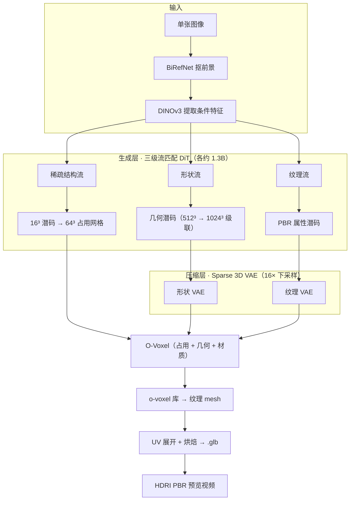

# TRELLIS.2：用 O-Voxel 把图像到 3D 生成推到 4B 参数级别

`microsoft/TRELLIS.2` 是微软 TRELLIS 原班团队（Jianfeng Xiang 等 11 人）的二代模型，论文《Native and Compact Structured Latents for 3D Generation》（[arXiv 2512.14692](https://arxiv.org/abs/2512.14692)）。它把"图像到 3D 生成"从传统 iso-surface 场的限制里拉了出来：核心是 **O-Voxel**——一种 field-free 稀疏体素结构，配合三个共约 4B 参数的流匹配（flow matching）DiT 和 Sparse 3D VAE（16× 下采样），在 H100 上约 3 秒生成 512³ 全纹理资产、约 17 秒生成 1024³、约 60 秒生成 1536³，并能原生表达开放表面、非流形几何和内含封闭结构。

对使用者来说，它真正改变的只有一件事：以前生成"带洞的衣物、薄壳叶片、内嵌机械结构"要靠事后修补，现在模型直接输出。本文基于 2026 年 9 月的仓库与模型卡现状，拆解它的表达结构、生成流水线和部署边界。

## 系统地图：一条三级流匹配流水线，一套 O-Voxel 表达

TRELLIS.2 的全部机制围绕两层展开。**表达层**只有一样东西——O-Voxel，几何和材质都长在稀疏体素上；**生成层**是三个流匹配 DiT 的级联：先在粗网格上定"哪里有东西"，再在细网格上出几何，最后补 PBR 纹理。三级采样、稀疏 VAE 解码与导出在一条流水线里串起来：

| 层 | 组件 | 职责 | 关键事实 |
|----|------|------|---------|
| 表达 | O-Voxel | 稀疏体素同时携带占用、几何、PBR 属性 | field-free，与 mesh 双向即时转换 |
| 压缩 | Sparse 3D VAE（形状 / 纹理各一组） | 16× 空间下采样，进紧凑潜空间 | 1024³ 资产编码为约 9.6K 潜 tokens |
| 生成 ① | 稀疏结构流模型（约 1.3B） | 定粗结构，解码为 64³ 占用网格 | 12 步采样，解码器沿用一代 TRELLIS |
| 生成 ② | 形状流模型（约 1.3B） | 在稀疏结构内生成几何潜码 | 512³ 与 1024³ 两档检查点，级联精化 |
| 生成 ③ | 纹理流模型（约 1.3B） | 条件于图像 + 形状，生成 PBR 属性潜码 | 基本不用分类器引导（guidance 1.0） |
| 转换 | o-voxel 库 | O-Voxel ↔ 纹理 mesh | 单 CPU < 10s / CUDA < 100ms |

三个流模型的检查点命名都带 `dit_1_3B`，各约 1.3B 参数，合计约 4B——与官方"4B 参数"口径吻合。每个 DiT 是 30 层、1536 通道、12 头的标准配置，位置编码用 RoPE。

## O-Voxel：不再被 iso-surface 束缚

传统 3D 生成普遍走 SDF / occupancy field，再 marching cubes 出 mesh。这条 field-based 路线有两个硬伤：

- **开放表面表达力差**——衣物、树叶会被强制闭合
- **非流形几何会塌陷**——薄壳、自相交结构

O-Voxel 是 **field-free sparse voxel**：每个体素直接携带"是否属于物体" + 几何 + 材质信息，跳过 iso-surface 中间层，自然能处理：

- ✅ Open surfaces（衣物、叶片）
- ✅ Non-manifold geometry
- ✅ Internal enclosed structures（空腔、内嵌零件）

几何端靠**柔性对偶网格**（Flexible Dual Grid）落地：对每个表面体素解一个增强的二次误差函数（QEF），不要求水密网格就能精确捕捉锐利特征和开放边界。材质端把 Base Color、Metallic、Roughness、Opacity 作为体积属性直接存在体素上，与几何网格对齐。整个转换不需要 SDF 求值、flood-fill 或迭代优化，这是"双向转换只要毫秒级"的前提。

O-Voxel 还有自己的压缩格式 `.vxz`，用 Z-order / Hilbert 曲线编码稀疏结构，适合数据集场景的紧凑存储。

## Sparse 3D VAE：16× 下采样，1024³ 压到约 9.6K tokens

模型用的不是普通 3D VAE，而是 **Sparse 3D VAE with 16× spatial downsampling**，专为稀疏体素设计。模型卡给出的口径是：一个 1024³ 资产编码后只占约 9.6K 个潜 tokens，感知损失可忽略——16× 下采样把 1024³ 网格缩到 64³，这约 9.6K 就是稀疏激活后真正参与计算的潜码数量。

这条路线的代价是 VAE 必须做稀疏运算——普通 dense conv 在 1024³ 上显存直接爆。收益是：

- 潜空间紧凑 → 流模型训练和推理都在小张量上
- 解码端直接还原 1024³ 全纹理 mesh
- 形状、纹理各一组编解码器，全分辨率档位共用

第三点值得展开：发布的三档分辨率用的都是同一组 VAE——`pipeline.json` 里形状、纹理各只有一个解码器。1024³ 档不是"再训一个更大的 VAE"，而是把形状流模型在更高分辨率上微调出一份独立检查点（`slat_flow_img2shape_dit_1_3B_1024_bf16` 等）。这意味着更高的分辨率档位是生成端升级，表达和压缩层保持稳定。

## 完整 PBR 材质建模

TRELLIS.2 不只生成颜色，还建模完整的 PBR 属性：

- Base Color
- Roughness
- Metallic
- Opacity（支持半透明）

生成的资产可以直接送进 Blender / Unity / Unreal Engine 渲染，无需补材质。

一个导出时的小坑：官方示例导出的 `.glb` 默认是 `OPAQUE` 模式，alpha 通道虽然保留在贴图里，但初始并不生效。要半透明效果，需在 3D 软件里手动把贴图的 alpha 通道连到材质的 opacity / alpha 输入。

## 性能档位（H100 GPU）

| 分辨率 | 总耗时 | 拆解（几何 + 材质） |
|--------|--------|-------------------|
| 512³ | ~3s | 2s + 1s |
| 1024³ | ~17s | 10s + 7s |
| 1536³ | ~60s | 35s + 25s |

读这张表先明确三件事。第一，测的是单张 H100 上从输入图到全纹理资产的完整流水线（三段采样 + VAE 解码），不是单次模型前向。第二，时间随分辨率涨约 6 倍/档，主要涨在稀疏体素数量和纹理潜码规模上——采样步数是固定的（每阶段 12 步 Euler 采样，稀疏结构与形状阶段的引导强度 7.5，纹理阶段 1.0），变的只是每个 token 的计算量和 token 数。第三，官方未给出消费级显卡的对应数字，4090 级别只能按 24GB 显存门槛预估，别直接按 H100 算力比例折算。

数据流做到 "rendering-free + optimization-free"：纹理 mesh → O-Voxel 在单 CPU 上 < 10s；O-Voxel → 纹理 mesh 在 CUDA 上 < 100ms。这对训练数据生产是关键——把 Objaverse-XL 这类公开数据集转成 O-Voxel 不需要渲染农场，仓库的全部训练示例配置也都以 Objaverse-XL 为例。

## 一次任务流：从单张照片到可渲染资产

以官方 `example.py` 的流程为准，一张咖啡杯照片变成资产会经过这些步骤：

1. **抠前景**：输入图先过 BiRefNet 分割模型（`briaai/RMBG-2.0`），去掉背景干扰
2. **图像编码**：DINOv3 ViT-L/16（`facebook/dinov3-vitl16-pretrain-lvd1689m`）提取特征作为三级共用的条件向量——一代 TRELLIS 用的是 DINOv2，这里升级到了 DINOv3
3. **稀疏结构采样**：4B 中的第一个流模型在 16³ 潜码上生成结构，解码为 64³ 占用网格，12 步；这一步用的解码器直接来自一代 `TRELLIS-image-large` 的检查点，新旧两代在"哪里有物体"这一层是兼容的
4. **形状生成**：默认走 1024 级联——形状流模型先出 512³ 潜码，解码器把坐标上采样 4 倍后，交给 1024³ 微调检查点精化
5. **纹理生成**：纹理流模型以图像 + 形状潜码为条件生成 PBR 属性潜码，再由纹理 VAE 解码到体素
6. **导出**：`o_voxel.postprocess.to_glb()` 做 UV 展开和纹理烘焙（示例参数：面数抽稀到 100 万、贴图 4096），输出 `.glb`；同一条流水线还能顺手用 HDRI 环境贴图渲染一段 PBR 预览视频

生成的 mesh 在渲染前要 `simplify(16777216)`——nvdiffrast 对面数有上限，示例代码里这行不是可选项。

官方另提供了 `example_texturing.py`：给定一个已有 3D 形状 + 参考图，只跑第三段纹理流，给旧模型补 PBR 材质。这为"只借纹理能力"留了一条窄入口。

## 部署门槛：Linux + 24GB 显存起步

官方要求明确：仅在 Linux 上测试过；NVIDIA GPU 显存至少 24GB，在 A100 和 H100 上验证过；Python 3.8+，CUDA Toolkit 推荐 12.4。注意力后端默认 flash-attn，V100 这类不支持的卡需要手动装 xformers 并设置 `ATTN_BACKEND=xformers`。

依赖安装走 `setup.sh`，除基础依赖外还要编译 flash-attn、nvdiffrast、nvdiffrec、CuMesh、o-voxel、FlexGEMM 六个组件——后几个是团队为这套流水线写的高性能配套：FlexGEMM 是基于 Triton 的稀疏卷积，CuMesh 负责 CUDA 加速的网格后处理（重网格、抽稀、UV 展开），o-voxel 就是表达层本体。许可证层面代码与模型都是 MIT，但 nvdiffrast 和 nvdiffrec 走各自的开源协议，商用集成时需要单独看一眼。

安装耗时不短，仓库建议逐个 flag 装依赖排错。想先看效果可以走 [Hugging Face Spaces 在线 demo](https://huggingface.co/spaces/microsoft/TRELLIS.2)，[项目主页](https://microsoft.github.io/TRELLIS.2)有完整质量的效果视频。

## 适用边界

**适用场景：**

- 有 24GB 以上显存（A100 / H100 验证过）想批量做 image-to-3D 的团队
- 需要 PBR 材质属性（不是单色 Lambert）的下游管线（游戏、电商、AR/VR）
- 对开放表面、薄壳、内嵌结构表达力有要求的场景（衣物、植物、机械内腔）

**不适合的场景：**

- 大场景重建（建筑级、城市级）：模型按单资产训练，跨资产拼接不是它的目标
- 实时交互生成：60s / 1536³ 的耗时决定它不能做实时预览
- 严格的 3D 打印用途不设防：官方模型卡明确说生成网格可能有小孔或轻微拓扑不连续，需要水密几何时要跑仓库配套的孔洞填补脚本
- 直接当"美术成品"用要掂量：4B 是预训练基座模型，未经过人类偏好对齐或美学微调，输出风格跟随训练数据分布，模型卡建议用户在输入图上多试

最后一条是选型时最容易忽略的：TRELLIS.2 给的是"高保真底模"，不是"开箱即用的美术管线"。想要稳定的风格输出，要么自己做微调（训练代码已开源），要么把它当资产生成的前置环节接进人工修整流程。

## 开源定位：与商业 SaaS 服务不是同一套约束

拿 TRELLIS.2 与 Tripo、Meshy 这类商业服务比，有意义的维度不是"谁生成得更好看"，而是约束不同：

| 维度 | TRELLIS.2 | 商业 SaaS 生成服务 |
|------|-----------|-------------------|
| 部署形态 | 开源权重 + 推理代码，可本地部署、可改管线 | 云端 API / 网页，管线黑盒 |
| 学术透明度 | 论文 + 推理/训练代码 + 检查点齐备 | 通常不放训练细节 |
| 材质输出 | 4 通道 PBR 原生建模，含透明度 | 以贴图色为主，PBR 支持程度各家不一 |
| 门槛 | 自己管 GPU 与依赖 | 注册即用 |
| 可定制 | 可微调、可只借纹理段 | 受限于产品功能 |

前两行是硬事实：仓库 MIT 协议，论文、推理与训练代码、4B 检查点、在线 demo 全部公开；SaaS 服务则相反，便利性换透明度。至于生成质量的直接对比，官方论文只给了自家评测结论（"几何与材质质量远超现有模型"），独立第三方基准目前未见公认结果，建议拿自己的业务图实测再下判断。

## 路线图：六项全部落地

仓库路线图现状：

- [x] Paper release（[arxiv 2512.14692](https://arxiv.org/abs/2512.14692)）
- [x] Image-to-3D 推理代码
- [x] 4B 预训练检查点（[Hugging Face](https://huggingface.co/microsoft/TRELLIS.2-4B)）
- [x] Hugging Face Spaces demo
- [x] Shape-conditioned 纹理生成推理代码
- [x] 完整训练代码（含 SC-VAE、三级流模型的训练与高分辨率微调配置）

从零复现或在自己数据上微调的路径已经打通：`data_toolkit/` 负责把原始资产转成 O-Voxel 数据，`train.py` 按 config 分别训练形状 VAE、纹理 VAE、稀疏结构流、形状流、纹理流，再用 `*_ft1024.json` 配置微调出高分辨率档。

## 采用建议

- **游戏 / 电商资产管线**：值得现在就试。PBR 四通道 + 任意拓扑是实打实的管线价值，24GB 单卡即可起步，先用 1024_cascade 默认档跑通，再决定要不要上 1536³。
- **做 3D 生成研究的团队**：这是目前少数"表达、VAE、生成、数据工具链"四层全开源的 4B 级基座，`.vxz` 数据格式和训练代码让复现与改进都有抓手。
- **只是偶尔要几个模型的内容创作者**：直接用 HF Spaces demo 或商业 SaaS 更省事，自部署的运维成本不划算。
- **对网格质量零容忍的场合**（3D 打印、精密制造）：保留孔洞填补后处理这一步，或者等生态里的修网工具成熟。

TRELLIS.2 的真正价值不是"再快一点"，而是"终于敢生成带孔的衣物和内嵌机械结构了"——field-free 表达把过去必须人工修补的一类资产变成了模型可以直接输出的东西。这一步对 3D 资产生成管线的意义，比速度数字大得多。

## 参考来源与口径说明

- 仓库现状：[microsoft/TRELLIS.2](https://github.com/microsoft/TRELLIS.2)（main 分支，最后推送 2026-07-10，本文写作时点后无更新；README、`o-voxel/README.md`、`example.py`、训练配置均按当前 main 核对）
- 模型卡：[microsoft/TRELLIS.2-4B](https://huggingface.co/microsoft/TRELLIS.2-4B)（作者名单、模型类型、约 9.6K 潜 tokens、已知局限的出处）；`pipeline.json` / `texturing_pipeline.json`（三级采样器参数、DINOv3 编码器、BiRefNet 前景分割、1024 级联默认档的出处）
- 论文：[arXiv 2512.14692](https://arxiv.org/abs/2512.14692)《Native and Compact Structured Latents for 3D Generation》
- 数据读数：GitHub stars 11356 / forks 1366，HF downloads 约 175 万 / likes 1245，均为 2026-09-25 读数
- 生成耗时表为官方在 H100 上的实测口径，本文未在消费级显卡上独立复测
