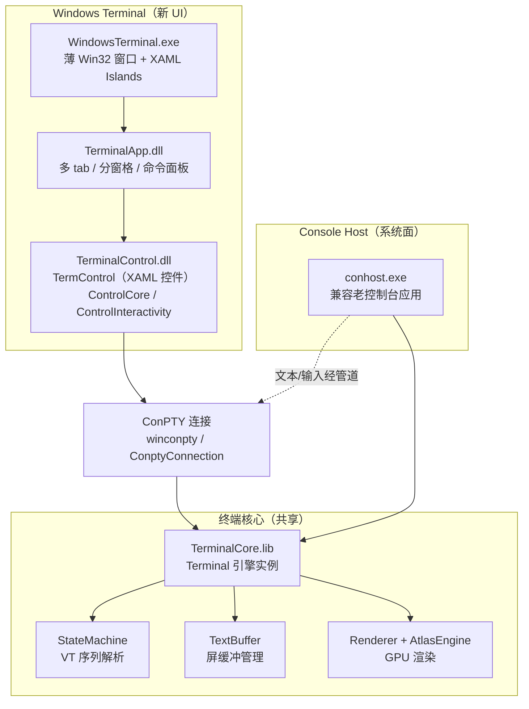

# microsoft/terminal：从 conhost 到 ConPTY，Windows Terminal 到底重构了什么

## 一句话判断

microsoft/terminal 不是普通的「终端模拟器」项目。它同时承载两个产品：**Windows Terminal**（新终端应用，多 tab / 分窗格 / GPU 渲染）和 **Windows Console Host**（系统原生 `conhost.exe` 的现代化重写，保证老控制台应用兼容）。两者共用同一套终端核心（VT 解析、屏缓冲、渲染）。

真正让它成立的，是 2018 年随它一起落地的 **ConPTY（Pseudo Console）**。在 ConPTY 之前，Windows 的命令行应用必须亲手画自己的窗口和缓冲；ConPTY 把这件事拆开——shell 只管读写一个伪终端管道，UI 负责把流渲染出来。Windows Terminal 因此可以不碰老控制台，却能让 cmd / PowerShell / WSL 全部跑在自己的多 tab 引擎里。

截至本文写作时，仓库约 10 万+ stars（MIT 协议，C++ 实现），是微软在 GitHub 上社区参与度最高的项目之一。

## 学习目标

读完这篇，你将能：

- 说清 Windows Terminal 与 conhost 是「同源共享核心」的两个产品，而不是替代关系
- 讲明白 ConPTY 的三条管道分别承担什么，以及为何它是 Windows 命令行架构的分水岭
- 理解 VT 序列为什么成了 Windows 命令行生态的「统一语言」，以及为什么微软要把传统控制台 API 逐步退役
- 看懂 `IRenderEngine` + `Renderer` + AtlasEngine 的分层，以及纹理图集（glyph atlas）为什么比逐字 GDI 绘制快
- 识别本文对常见误传的纠正（默认终端版本、UI 框架是 WinUI 3 还是 XAML Islands）
- 判断你该不该用 Windows Terminal，以及 `conhost` 什么时候仍是唯一选择

## 目录

- [为什么 Windows 的命令行卡了 20 年](#为什么-windows-的命令行卡了-20-年)
- [全景地图：同源核心的两个产品](#全景地图同源核心的两个产品)
- [ConPTY：让 shell 与 UI 解耦](#conpty让-shell-与-ui-解耦)
- [VT 序列：命令行生态的统一语言](#vt-序列命令行生态的统一语言)
- [渲染管线：从 GDI 到 AtlasEngine](#渲染管线从-gdi-到-atlasengine)
- [屏缓冲与可访问性](#屏缓冲与可访问性)
- [UI 层：XAML Islands 上的多 tab 工作台](#ui-层xaml-islands-上的多-tab-工作台)
- [WSL 与动态 Profile](#wsl-与动态-profile)
- [安装、发布渠道与默认终端](#安装发布渠道与默认终端)
- [C++ 工程实践：大型仓库的治理范式](#c-工程实践大型仓库的治理范式)
- [和其他终端怎么选](#和其他终端怎么选)
- [适用与不适用](#适用与不适用)
- [自测题](#自测题)
- [源码阅读路径](#源码阅读路径)
- [相关资源](#相关资源)

## 为什么 Windows 的命令行卡了 20 年

要理解 Windows Terminal，先理解它取代的东西为什么卡住了。

Windows 的经典控制台架构由四部分组成：**客户端（Client）**、**设备（Device）**、**服务器（Server）**、**终端（Terminal）**。客户端是 cmd / PowerShell 这类命令行应用；设备是内核里的控制台驱动 `ConDrv.sys`，负责在客户端和服务器之间转发消息；服务器是 `conhost.exe`，它既解释客户端发来的控制台 API 调用，又负责把屏缓冲画到屏幕上。

问题出在最后一步：**conhost 把「控制台逻辑」和「绘制」焊死在一起**。绘制用的是 GDI 逐字符渲染，代价是三件事：

1. **渲染能力老化**。GDI 不支持 GPU 加速，长输出滚动、高 DPI、高刷新率屏上都吃力；emoji、连字、复杂的从右到左文本支持都很差。
2. **屏蔽了第三方终端**。历史上任何想要「更好的终端」的程序，都只能自己画 UI，同时用传统控制台 API 去猜 conhost 的屏缓冲长得什么样。这就是为什么 Windows 上第三方终端（如 ConEmu / Cmder）总是带着或多或少的兼容性脏活。
3. **会话无法复用**。每个控制台窗口就是一次独立会话，还没有原生 tabs，多开几个 shell 桌面就乱成一团。

后来出现的 WSL、PowerShell，面对的都是同一套老旧 host。微软从 2017 年开始着手这项重构，2018 年先随 Windows 10 1809 落地 ConPTY，2019 年 5 月再把 Windows Terminal 开源。重构的结论是：必须从底层把「渲染」从「控制台逻辑」里抽出来。ConPTY 就是这把手术刀。

## 全景地图：同源核心的两个产品

仓库的物理布局一眼就能看出两个产品的分工（以下路径均相对仓库根目录）：

| 产品 | 源码路径 | 职责 |
|------|----------|------|
| Windows Terminal（用户面） | `src/cascadia/` | TerminalApp（UI）、TerminalControl（终端控件）、TerminalSettingsModel（配置模型） |
| Console Host（系统面） | `src/host/` | `conhost.exe` 主程序，服务历史控制台应用 |
| 终端核心（共享） | `src/terminal/`、`src/renderer/`、`src/types/` | VT 解析、屏缓冲、渲染引擎、字符宽度、颜色表 |

架构上，两个产品各自通过不同的入口，最终都落到同一套终端核心上：

关键点：**逻辑在一个地方**。两个产品共享 `src/terminal` 的终端核心，差异只在入口和 UI。老批处理还是能跑，但它的输出不再由 conhost 自己画，而是走 ConPTY 管道，最终由 Windows Terminal（或任何终端）的 AtlasEngine 在 GPU 上渲染。

## ConPTY：让 shell 与 UI 解耦

ConPTY（Pseudo Console）是 Windows 10 1809 / Server 2019 引入的 API，是这次重构的灵魂。它的作用是：**生成一个「无头」的控制台会话，让命令行应用以为自己在一个真实控制台里跑，实际它的输入输出被接到一对匿名管道上，由外面的终端程序接管渲染。**

### 三个句柄

一次 ConPTY 会话围绕三条管道展开：

- **输入管道（hInput）**：终端把键盘、鼠标事件按 VT 编码写进来，交给 shell 的 stdin。
- **输出管道（hOutput）**：shell 的 stdout / stderr 以**文本 + VT 序列**的形式流出来，终端负责解析并渲染。
- **信号管道（hSignal）**：带外控制通道，专门传 resize、clear、show/hide 这类不经过数据流的指令。

把「控制」和「数据」分开是有意为之：终端调整列数、清屏时，不会污染正在传输的正文数据流。

### 无头的 conhost 进程

创建伪控台时，系统会启动一个**无窗口**的 `conhost.exe`（Windows Terminal 的打包版里则换成自带的 `OpenConsole.exe`，与终端同包分发）。这个隐藏 host 负责给命令行应用提供真实的 console 环境（传统控制台 API 仍可用），同时通过管道把输出转发给终端。它的生命周期由句柄引用计数维护——即使终端程序崩溃，只要 shell 进程还活着，会话就不会被提前销毁。

### 为什么这件事是分水岭

在 ConPTY 之前，「在 Windows 上写一个现代终端」意味着要和 conhost 的私有状态搏斗。ConPTY 之后，**渲染权被交还给了终端**：

- 任意终端程序都能以标准方式托管 cmd / PowerShell / WSL；
- resize 由终端通过信号管道下发，shell 侧感知到新的列宽，重新自动换行；
- 微软官方博客明确说，ConPTY 就是要让 Windows 与 Linux / macOS 拥有同样「终端与 shell 分离」的模型。

此后出现的第三方终端（WezTerm 等）在 Windows 上普遍经由 ConPTY 托管 shell，本质上都是受益于这同一个 API。

## VT 序列：命令行生态的统一语言

ConPTY 能成立，前提是双方说同一种语言。这种语言就是 **VT 序列（Virtual Terminal Sequences）**——一组以 `ESC` 开头的字节序列，用来表达「移动光标」「设置颜色」「清屏」等终端操作。

仓库里 `src/terminal/parser` 是这套语言的实现：**StateMachine** 逐字节地吃进输出，识别某个序列属于哪一个控制语义，然后把它翻译成对 TextBuffer 的操作。同时 `src/terminal/input` 负责反方向——把键盘输入编码成 shell 认识的序列。

这对 Windows 是一次观念转变：过去命令行程序用**传统控制台 API**（如直接 `WriteConsole` 到屏缓冲）做同样的事；现在官方要它们改用 VT 序列。微软已在文档中把传统控制台 API 标记为「逐步退役」，理由是同一套 VT 语义在 conhost 和所有现代终端里完全一致，消除了「换一个 host 行为就不一样」的分裂。

> 实践提示：老程序只要写 `VT` 风格输出，Windows Terminal 与 conhost 都能正确解释；如果一个程序仍重度依赖传统控制台 API，它会走 conhost 的兼容路径——这也是 conhost 至今保留的原因。

## 渲染管线：从 GDI 到 AtlasEngine

conhost 时代的 GDI 逐字符绘制是性能瓶颈。Windows Terminal 用一套分层的渲染系统取代它。

**第一层：接口隔离。** 仓库定义了一个渲染接口 `IRenderEngine`，任何具体引擎只负责「把一帧画出来」。协调者 `Renderer` 跑在一个后台线程上，每帧：加锁读取屏缓冲 → 遍历脏区域（dirty region）→ 把绘制指令派发给已注册的引擎 → 解锁后在锁外做 GPU `Present()`。把 Present 放在锁外避免了长时间占锁阻塞输入处理。

**第二层：引擎实现。** 关键引擎包括：

- **AtlasEngine**（主渲染器，Windows Terminal 默认）：用 Direct3D 11 + DirectWrite。核心技法是**纹理图集**——把用到的字形（glyph）提前栅格化到一张 GPU 纹理上，同一字符反复出现时直接采样纹理，而不是每次重新调用字体引擎布局。配合**脏区域追踪**，屏幕上没变化的地方不重画。它把 API 线程（提交状态）和呈现线程（绘制）分开，允许边输入边渲染而不互相阻塞，还支持自定义 HLSL 像素着色器实现诸如背景模糊等效果。
- **GDI 引擎**：遗留路径，供 conhost 或兼容场景回退用。
- **WddmCon / DX 引擎**：面向特殊环境（如远端会话）的变体。
- **UiaRenderer**：专门给屏幕阅读器等可访问性（UIA）客户端用的渲染，保证终端内容对无障碍工具可见。

顺带一提：Windows Terminal 对西文文本用 DirectWrite 做亚像素抗锯齿与 ClearType 提示，对 CJK、emoji 及从右到左文本按字形 fallback 链处理——这正是老 conhost 长期做不好的部分。

## 屏缓冲与可访问性

屏缓冲（**TextBuffer**）是终端状态的载体：每一格单元记录字符、前/背景色、覆盖样式。Windows Terminal 的滚动区（scrollback）默认保留 9001 行历史（`historySize` 默认值，可在 settings.json 调整），翻页由终端 UI 直接操作缓冲，不需要 shell 重新输出。

可访问性不是插件，而是内建管线：`src/types` 里有字符宽度计算（东亚宽字符对齐）、颜色表，以及基于 UIA 的 provider。这让 NVDA 等屏幕阅读器能读出终端内容——微软在这条路上投入了持续数年的工程，对无障碍是硬需求而非彩蛋。

## UI 层：XAML Islands 上的多 tab 工作台

Windows Terminal 的 UI 是 **C++/WinRT 应用，用 XAML Islands 托管 UWP XAML（WinUI 2）**，外面套一层薄薄的 Win32 窗口。

这里有一段经常被误传的史实：微软从未用「WinUI 3」构建 Windows Terminal；它是**2018 年的架构决策**——`WindowsTerminal.exe` 只负责拉一个原生窗口、启动 XAML 托管设施；真正的界面是一个并不知道自己是被托管的 **C++/WinRT UWP XAML 应用**，通过 XAML Islands 嵌进那个 Win32 窗口。如此既拿到了 UWP XAML / Fluent 的现代 UI 能力（tab、动画、控件），又保住了 Win32 的完整权限（能启动任意 shell、能改工作目录）。仓库 `src/cascadia/WindowsTerminal/` 下的 `IslandWindow` 就来自这段设计。

在 UI 层之上是一套**配置文件（settings.json）体系**：

- **Profiles**：一个 profile 绑定一个命令行（PowerShell / cmd / WSL / 自定义 shell），可独立设置字体、配色、图标、起始目录、背景图、透明度、启动参数。
- **Tabs 与 Panes**：多 tab，且每个 tab 可再水平/垂直分割成多个窗格（pane），每个 pane 是独立的 shell 会话。
- **命令面板**：`Ctrl+Shift+P` 召回所有可用操作（快捷键绑定、动作），改配置不必全靠手写 JSON。
- **配色方案 / 键位绑定**：全部通过 settings.json 声明式配置，可用 Git 管理、随仓库分发。

## WSL 与动态 Profile

Windows Terminal 把 WSL 当一等公民。启动时它会**动态发现**系统里的 WSL 发行版，为每个发行版自动生成一个 profile。WSL 之所以能在 Terminal 里获得近乎原生的体验，底层仍是 ConPTY：WSL 的终端 I/O 被接到伪控台，WSLg 的 GUI 应用也能从 Terminal 里拉起。

同样被自动发现并生成 profile 的还有：PowerShell 的多个版本、Visual Studio 开发者 PowerShell、以及用户自定义的命令。这就是「动态 profile」的机制——profile 列表不是死的，而是系统枚举结果。

## 安装、发布渠道与默认终端

官方推荐从 Microsoft Store 安装（自动更新、集成最好）。无法用 Store 时：

| 渠道 | 方式 |
|------|------|
| GitHub Releases | 下载 `.msixbundle` 手动 `Add-AppxPackage`（注意可能需要 VC++ v14 框架包） |
| winget | `winget install --id Microsoft.WindowsTerminal -e` |
| Chocolatey | `choco install microsoft-windows-terminal` |
| Scoop | `scoop install windows-terminal` |
| Canary 渠道 | 基于 main 的每日构建，最不稳定，尝鲜用 |

从 GitHub 手动安装的版本**不会自动更新**；企业可借此锁定版本做回归验证。

**关于「默认终端」的版本，有一处常见误传要纠正**：Windows Terminal 成为系统默认终端，是从 **Windows 11 22H2**（2022 年 10 月更新）开始的，不是 24H2。条件包括 Terminal 版本 ≥ 1.15；Windows 10 22H2 在安装 2023 年 5 月的 **KB5026435** 后也支持同样的设置。要开启/切换，在「设置 → 隐私和安全性 → 开发者选项」的「终端」区域，或 Terminal 设置页的「启动 → 默认终端应用程序」里选择。系统会写 `HKCU\Console\%%Startup` 注册表项选择一个 host GUID，因此即便暂不支持该 UI 的旧版 Windows，也可用注册表手动指定。

最低系统要求：**Windows 10 2004（build 19041）或更高**。

## C++ 工程实践：大型仓库的治理范式

microsoft/terminal 是学习大型 C++ 工程管理的范例：

- **C++/WinRT**：用标准 C++17 的 WinRT 语言投影，替代老的 C++/CX，接口定义走 Windows Runtime 元数据。
- **WIL（Windows Implementation Library）**：微软的 RAII / 智能句柄库，贯穿全仓库，`wil::` 类型随处可见。
- **XAML 与 Composition**：UI 依赖 XAML 运行时；终端内容的帧由 AtlasEngine 经自己的 D3D 交换链呈现，窗口合成交给系统调度，UI 层不自行管理像素合成。
- **vcpkg / CMake（近年）**：依赖与构建系统持续演进，仓库已能跨平台（含 Linux）构建终端核心做测试。
- **测试**：大量的单元测试（渲染、状态机、缓冲）+ UI 测试 + 与上游系统交互的集成验证。

文档方面，仓库把治理制度化：

- `doc/STYLE.md`：代码风格约定
- `doc/ORGANIZATION.md`：代码目录与归属
- `doc/EXCEPTIONS.md`：遗留代码的异常处理约定

> 提示：仓库随版本演进会调整构建入口（解决方案文件已从 `OpenConsole.sln` 迁到 `OpenConsole.slnx`），动手构建前先看最新的根 README 与 CONTRIBUTING，别以过时教程为准。

## 和其他终端怎么选

| 维度 | Windows Terminal | conhost（经典控制台） | 对比项（WezTerm / Alacritty / Ghostty） |
|------|------------------|----------------------|------------------------------------------|
| 定位 | Windows 官方新终端 | 系统级兼容层 | 跨平台第三方终端 |
| 渲染 | AtlasEngine（D3D11 + DirectWrite） | GDI 逐字（遗留） | 各家 GPU 后端 |
| 多 tab / 分窗格 | 原生 | 无 | 大多原生 |
| 配置文件 | settings.json 声明式 | 对话框 / 注册表 | TOML / lua 等 |
| 跨平台 | 仅 Windows | 仅 Windows | 多平台 |
| 依赖 | 需 store / 打包 | 系统自带 | 需另装运行时 |

Windows 上想要系统级保真度与零额外依赖，选 Windows Terminal；在非 Windows 环境或想要可脚本化配置与更极致的轻量，再考虑 WezTerm 等第三方。

## 适用与不适用

**适合**：

- Windows 上的日常命令行（把 cmd / PowerShell / WSL / SSH 统一进一个多 tab 界面）
- 依赖 emoji、连字、Unicode 全支持、高 DPI / 高刷屏的长输出工作
- WSL、远程 SSH（需要时配 Anaconda / profile）与容器类工作流
- 想给团队交付可版本化、可共享的终端配置（settings.json 入 Git）

**不适合**：

- 需要在「终端之外」以传统控制台 API 驱动屏缓冲的遗留应用——这类场景 conhost 仍是兜底
- 追求极致轻量、只想一个纯 shell 的极简派——Windows Terminal 是功能齐全的「重客户端」
- Linux / macOS 环境的终端使用——项目是 Windows 专属

## 自测题

1. Windows Terminal 与 conhost 是「替代」关系吗？它们共享哪部分代码、差别在哪里？
2. ConPTY 的三条管道分别做什么？为什么要把「resize / clear」放到独立信号管道，而不是数据管道？
3. 为什么说 ConPTY 是 Windows 命令行架构的分水岭？它对第三方终端意味着什么？
4. AtlasEngine 的「纹理图集」和「脏区域追踪」各自解决什么问题？为什么不直接用 GDI 逐字画？
5. 把传统控制台 API 替换为 VT 序列，这一迁移的长远收益是什么？conhost 为什么至今仍被保留？

## 源码阅读路径

1. 只想用：Microsoft Store 安装，体验多 tab + 分窗格 + 命令面板；`Ctrl+,` 进设置，熟悉 settings.json。
2. 想理解架构：先读 `doc/ORGANIZATION.md`，对照本文的分层图在 `src/` 里找到对应目录。
3. 想研究伪控制台：看 `src/winconpty/` 与 `src/cascadia/TerminalConnection/` 的 ConptyConnection，理解三管道与 headless host。
4. 想研究渲染：看 `src/renderer/atlas/` 的 AtlasEngine，以及 `src/renderer/base/renderer.hpp` 的 Renderer 编排。
5. 想研究终端状态机：看 `src/terminal/parser/` 的 StateMachine，配合 VT 序列文档对照。

## 相关资源

- 仓库：[microsoft/terminal](https://github.com/microsoft/terminal)
- 官方文档：[learn.microsoft.com/windows/terminal](https://learn.microsoft.com/windows/terminal/)
- ConPTY 介绍：[Windows Command Line：Introducing the Windows Pseudo Console（ConPTY）](https://devblogs.microsoft.com/commandline/windows-command-line-introducing-the-windows-pseudo-console-conpty/)
- 架构细节：[Windows Terminal Architecture（Build Windows Terminal with WinUI）](https://blogs.windows.com/windowsdeveloper/2020/09/08/building-windows-terminal-with-winui/)
- 默认终端公告：[Windows Terminal is now the Default in Windows 11](https://devblogs.microsoft.com/commandline/windows-terminal-is-now-the-default-in-windows-11/)
- 控制台生态 Roadmap：[learn.microsoft.com/windows/console/ecosystem-roadmap](https://learn.microsoft.com/windows/console/ecosystem-roadmap)