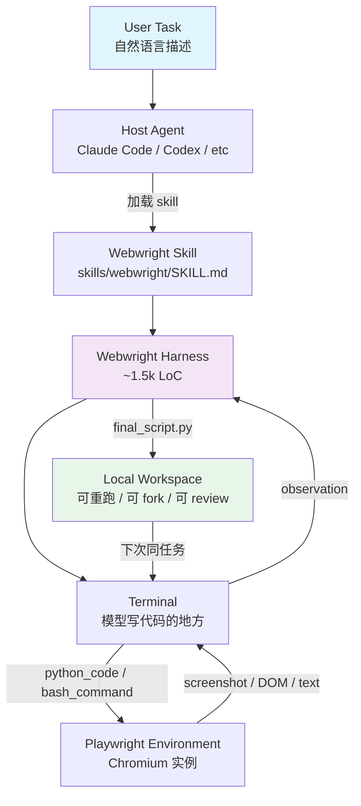

# Webwright：把 Coding Model 变成 Browser Agent，只需 1.5k LoC

过去两年做 web agent 的团队几乎都在往一个方向堆：更好的 DOM 理解、更精准的 selector 预测、更鲁棒的 multi-step planning。harness 越来越复杂，模型被锁在一个持久化的浏览器 session 里，每一步预测一个 click 或 type，step budget 烧完任务也跟着丢了。

微软研究院的 Webwright 换了个问法：既然 LLM 已经能写 Python、能 debug、能调用 Playwright，为什么还要把它当成一个逐动作预测的点击机器人？

他们的做法很直接：让模型写整段可执行的 Playwright 脚本，然后把脚本存到本地 workspace，变成可以重跑、可以 fork、可以 code review 的持久化产物。整个 harness 只有 ~1,500 行代码，没有 LangChain、没有 AutoGen、没有多 agent 编排框架。

---

## 阅读导航

| 你在找什么 | 跳到 |
|------------|------|
| 架构总览，它和传统 web agent 的分歧在哪 | [§2 系统总览](#§2-系统总览webwright-和传统-web-agent-的根本分歧) |
| 一次任务怎么从自然语言流到最终 Python 脚本 | [§6 一次任务的完整生命周期](#§6-一次任务的完整生命周期从自然语言到-python-脚本) |
| benchmark 数字怎么读，哪些结论不能直接推 | [§9 Benchmark 解读](#§9-benchmark-解读867-和-601-测的是什么) |
| Claude Code / Codex / OpenClaw / Hermes 怎么接入 | [§7 Plugin 集成](#§7-plugin-集成claude-code--codex--openclaw--hermes-共享一个-skill) |
| 我的场景适不适合用 Webwright | [§11 适用边界](#§11-适用边界long-horizon-是甜区其他场景有代价) |
| 现在要不要试，从哪开始 | [§13 采用顺序](#§13-采用顺序谁该先用谁可以等等) |

---

## §1 先划清边界：Webwright 不是什么

Webwright 不是一个「更好的 browser-use」。

browser-use、Stagehand、agent-browser 这一路的共同前提是：模型应该在浏览器 session 里一步一步行动，agent harness 负责把「当前页面状态」转换成「模型输入」，再把「模型输出」转换成「浏览器操作」。这个范式在 LLM 写代码能力还弱的时候是必要的——它把复杂的 web 交互拆解成模型可以预测的原子动作。

Webwright 绕开了这个前提。它和 SWE-agent 共享同一条设计血缘：把模型当成一个可以写代码、跑代码、看执行结果的程序员，而不是一个每步预测下一个 token 的分类器。SWE-agent 里模型面对的是 terminal 和 local repo，Webwright 里模型面对的是 terminal 和 Playwright 浏览器环境。

> browser-use 这类框架在教模型「怎么用浏览器」；Webwright 假设模型已经「会用 Python 驱动浏览器」，只教它「这个任务该怎么写成代码」。

---

## §2 系统总览：Webwright 和传统 Web Agent 的根本分歧

### 2.1 传统 Web Agent 的执行循环

```
传统 Web Agent 的每一步：
┌─────────────────────────────────────────────┐
│ 1. 截取当前页面（截图 / DOM snapshot / a11y tree） │
│ 2. 模型预测「下一步操作」——一个 click、一个 type、一个坐标 │
│ 3. harness 执行操作，刷新观察                      │
│ 4. 循环，直到任务完成或 step budget 耗尽           │
└─────────────────────────────────────────────┘
```

这个循环的瓶颈肉眼可见：模型每一步都要重新「理解」页面状态，但理解的结果无法沉淀成可复用的东西。任务一旦超过 20 步，早期的决策上下文就会被 token budget 挤掉，从头来过。

### 2.2 Webwright 的反方向：Code as Action

```
Webwright 的每一步：
┌─────────────────────────────────────────────┐
│ 1. 模型在 terminal 里写 Python 代码（Playwright 脚本） │
│ 2. harness 执行代码，把截图 / 文本结果返回给模型      │
│ 3. 模型根据执行结果修代码，或者写下一步代码          │
│ 4. 循环，直到任务完成 → 产出 final_script.py      │
└─────────────────────────────────────────────┘
```

两种范式的分歧在状态载体上。传统范式里，浏览器的持久化 session 扛着所有状态——cookie、DOM、tab、scroll 位置全在里面；Webwright 把状态搬到了本地 workspace 的 Python 文件里，浏览器 session 退化成一次性的执行环境：spawn、inspect、discard。

### 2.3 一张表看清两种范式

| 维度 | 传统 Web Agent | Webwright |
|------|---------------|-----------|
| 模型角色 | 预测下一个原子动作 | 写出整段可执行 Python |
| 浏览器角色 | 持久化工作区（state holder） | 一次性环境（spawn → inspect → discard） |
| 状态存在哪 | browser session（cookie、DOM、tab） | 本地 workspace（`final_script.py`、screenshots、logs） |
| 任务完成后的产物 | 一段被遗忘的 session history | 一个 re-runnable Python script |
| 循环形态 | observe → predict → execute → repeat | write code → execute → inspect → repair |
| 出错怎么办 | 重试同一个原子动作 | 修代码，重新跑 |
| 中断后能否续跑 | 受 session state 限制 | 完整：脚本在文件系统里 |

### 2.4 系统架构



User Task 进入 Host Agent（Webwright 也可以直接跑，不依赖 host），加载 Webwright Skill，驱动 Webwright Harness。Harness 的核心是一个 terminal loop——模型在 terminal 里写代码，代码驱动 Playwright 环境，执行结果以 observation 形式回流。最终产物落在 Local Workspace 里。

---

## §3 四层抽象：terminal / browser / script / skill

Webwright 把整个系统压成 4 个正交的抽象。把这四层拆开看，整个仓库的结构就清楚了。

### 3.1 Terminal：模型看到的唯一界面

模型不直接驱动浏览器，而是面对一个 terminal。每一步，模型在 terminal 里写 Python（`bash_command` 或 `python_code`），harness 执行，把结果回传给模型。

这个设计直接从 SWE-agent 搬过来。让模型在一个有文件系统的环境里「思考」，而不是在一个无状态的对话里「每步预测」——terminal 提供了文件持久化、命令执行、错误反馈三重能力，这正好匹配 coding model 的训练分布。

`src/webwright/agents/default.py` 里的 system prompt 模板：

```yaml
agent:
  system_template: |
    You are a browser agent. You have access to a terminal where you can
    write Python code that uses Playwright to control a browser session.
    Each turn:
      1. Inspect the current page (screenshot or DOM).
      2. Write Python code that produces the next observation OR
         completes the task.
      3. Receive the observation and continue.
    When the task is done, set done=true and provide final_response.
  step_limit: 15
  debug_log: true
  keep_last_n_observations: 1   # 只保留最近一条 observation 的 ARIA snapshot
```

`keep_last_n_observations: 1` 是处理长 horizon task 上下文膨胀的关键配置。旧 observation 里的 ARIA accessibility tree 极占 token，但文本 observation 保留供后续步骤参考——所以只剪 ARIA，不删整条 message。

### 3.2 Browser：被脚本 spawn 的环境，不是 state holder

浏览器在 Webwright 里是环境，不是状态载体。模型用 `playwright.async_api` 启动 Chromium、打开页面、操作 DOM、拿截图。一个 step 完成后可以关闭 session，也可以留着继续 inspect。

```python
# Webwright 生成的典型脚本片段
async def search_flights(page, origin, destination, depart, return_date):
    await page.goto("https://www.google.com/flights")
    await page.get_by_role("textbox", name="Where from?").fill(origin)
    await page.get_by_role("textbox", name="Where to?").fill(destination)
    await page.get_by_role("textbox", name="Departure").fill(depart)
    await page.get_by_role("textbox", name="Return").fill(return_date)
    await page.get_by_role("button", name="Search").click()
    await page.wait_for_load_state("networkidle")
    return await page.locator(".flight-result").all_text_contents()
```

这段代码被模型写出来之后就独立存在了。下次同样任务，加载同样的脚本，传不同参数——不需要重新跑 agent loop。

### 3.3 Script：持久化产物本身

这是 Webwright 里最容易被低估的设计决策：一个 web task 的完整 trajectory 等于一个 single code file。

这个文件包含完整的 Playwright 操作序列，可以在没有 agent 的环境下 re-run（装好 Playwright 和 Python deps 就行），可以被参数化（用 `argparse` 包一层）变成 CLI tool，可以被人 review、被同事 fork、被 CI 集成。

`/webwright:craft` 命令专门做这件事——把 one-shot 任务升级成可复用 CLI tool：

```python
# final_script.py（craft 模式产出）
"""Search flights on Google Flights.

Args:
    origin: Departure airport code (e.g. SEA).
    destination: Arrival airport code (e.g. JFK).
    depart_date: Departure date (YYYY-MM-DD).
    return_date: Return date (YYYY-MM-DD).
"""
import argparse, asyncio
from playwright.async_api import async_playwright


async def search(origin, destination, depart_date, return_date):
    async with async_playwright() as p:
        browser = await p.chromium.launch(headless=True)
        page = await browser.new_page()
        await page.goto("https://www.google.com/flights")
        await page.get_by_role("textbox", name="Where from?").fill(origin)
        await page.get_by_role("textbox", name="Where to?").fill(destination)
        # ...
        await browser.close()


if __name__ == "__main__":
    parser = argparse.ArgumentParser()
    parser.add_argument("--origin", default="SEA")
    parser.add_argument("--destination", default="JFK")
    parser.add_argument("--depart-date", default="2026-08-15")
    parser.add_argument("--return-date", default="2026-08-20")
    asyncio.run(search(**vars(parser.parse_args())))
```

下次跑 `python final_script.py --origin LAX --destination SFO`，不需要 agent，不需要 LLM 调用。

### 3.4 Skill：跨 host 的统一描述

`skills/webwright/SKILL.md` 是 Webwright 跨 host 的「操作手册」——它不是 Python 代码，是一个给 host agent（Claude Code、Codex、OpenClaw、Hermes）读的 description。

用户在 host 里说「用 Webwright 帮我查机票」，host agent 加载这个 skill 描述，按描述里的指令驱动 Webwright loop。一份 skill 描述、四种 host 通用——Webwright 把「webwright CLI」和「具体 host agent」解耦的关键就在这里。

---

## §4 核心机制：write code → execute → inspect → repair

### 4.1 一次 step 里发生的事

`DefaultAgent.forecast_step()`（核心 loop，约 450 行）的执行序列：

```
Step N 开始
│
├─ 1. 渲染 system prompt（注入 workspace_dir 等）
├─ 2. 渲染 instance template（注入任务描述 + 历史）
├─ 3. 调 model.query(messages)
│      → 模型返回 thought + python_code / bash_command
├─ 4. 把 assistant_message 写进 self.messages
├─ 5. 在 env 里执行模型给出的代码
├─ 6. 拿到 outputs（截图 / 文本 / ARIA snapshot）
├─ 7. 把 outputs 包装成 observation message
├─ 8. 写 self.messages（user role = observation）
└─ 9. 检查 step_limit / format_errors → 继续或停
```

loop 里有几个约束设计得比较刻意：每一步模型必须输出 thought + 可执行代码，不允许只输出文字；observation（截图 / ARIA / 文本）作为 `user` role 消息回流；`step_limit` 默认 15 步，超过就 abort——和 SWE-agent 的默认值对齐。

### 4.2 上下文管理：为什么只保留最近一条 ARIA snapshot

长 horizon task 跑 50+ 步后，message 列表里堆满历史 observation，token 暴涨。`keep_last_n_observations` 解决这个问题：

```python
# 简化后的剪枝逻辑
if config.keep_last_n_observations > 0:
    n_keep = config.keep_last_n_observations
    for msg in reversed(messages[:-n_keep]):
        if msg["role"] == "user" and "aria_snapshot" in msg:
            msg.pop("aria_snapshot")  # 只剪 ARIA，保留文本 observation
```

注意剪的是 ARIA snapshot，不是整条 message。文本 observation 保留供后续步骤参考，ARIA 树太占 token 直接 drop。这个取舍很实际：长任务里模型真正需要回溯的是之前发现了什么 selector、踩了什么坑，而不是 30 步前的 accessibility tree 长什么样。

### 4.3 Summary 机制：每 N 步做一次上下文压缩

`summary_every_n_steps` 是给超长任务用的主动压缩开关。每 N 步，模型走一次「总结模式」，把历史压缩成一段 concise summary：

```python
summary_user_prompt = """
You are about to have your working context compacted.
Write a concise but COMPLETE summary of everything relevant so that
a fresh agent (with only this summary + system prompt + task) can
continue without losing progress:
- Original task goal + constraints
- Workspace dir + key files (plan.md, final_script.py, final_runs/)
- Which critical points satisfied, which open, known blockers
- Prior exploration findings (selectors, URLs, ARIA labels, pitfalls)
- Latest final_runs/run_<id>/ state + next action to take
"""
```

压缩会丢细节，所以只适合超长任务；需要精确复现的场景不建议开。

### 4.4 self_reflection：截屏后再确认一次

`tools/self_reflection.py` 是可选开关——模型写完一段代码、跑完操作后，强制再调一次 `image_qa` 看截图。DOM 结构看起来对，但页面有 overlay、modal、异步渲染导致实际状态和 selector 假设不一致的场景里，这个兜底路径很有用。模型靠 DOM 选择器走精准路径，靠视觉确认走兜底路径，两条路互相校验。

实际跑下来，self_reflection 对 SPA 和大量动画的站点帮助最大——这类站点 DOM 经常在 JS 执行完之前就返回了，selector 命中了但元素还没渲染出来。代价是每步多一次模型调用，token 成本大约增加 30%-50%。简单表单类任务可以关掉，长任务和复杂站点建议开着。

---

## §5 模型后端：三个 backend 的极简抽象

`src/webwright/models/` 目录下 3 个 backend，每个 ~150-200 行。没有 LangChain、没有 AutoGen 这类中间层——直接 `httpx` 调 HTTP API。

| Backend | 协议 | Image 处理 | 默认模型 | 适用场景 |
|---------|------|-----------|----------|----------|
| **OpenAI** | `/v1/chat/completions` 直连 | base64 inline | GPT-5.4（benchmark 默认） | Online-Mind2Web 86.7% / Odysseys 60.1% 都用这个 |
| **Anthropic** | `/v1/messages` 直连 | base64 inline | Claude Opus 4.7（benchmark 对照） | Online-Mind2Web 84.7% / hard split 80.5% |
| **OpenRouter** | OpenAI 兼容协议 | 透传 | 任意 OpenRouter 支持的模型 | 不想直连 OpenAI/Anthropic 时 |

三个 backend 有几个实现细节处理得很干净：

- `base.py` 里把三个 backend 的 rate limit、auth fail、timeout 归一化成 `ProviderError` 类型，agent loop 不需要 `if/else` 处理每个 backend 的特有错误。
- 截图通过 `image_url: data:image/png;base64,...` 直接塞进 multimodal message，省一次文件 IO。
- `image_qa` 和 `self_reflection` 复用同一个 model，所以「Anthropic 后端 + Anthropic 模型看图」是自洽的，不需要额外配 OpenAI key。

SWE-agent 默认只绑 OpenAI 一个 backend；Webwright 从一开始就同时支持 3 个，Anthropic 后端的代码和 OpenAI 并列 first-class。

---

## §6 一次任务的完整生命周期：从自然语言到 Python 脚本

用 README 里的 Google Flights 例子，走完一次完整任务——从 CLI 输入到 `final_script.py`。

### 6.1 CLI 入口

```bash
python -m webwright.run.cli \
  -c base.yaml -c model_openai.yaml \
  -t "Search for flights from SEA to JFK on 2026-08-15 to 2026-08-20" \
  --start-url https://www.google.com/flights \
  --task-id demo_openai \
  -o outputs/default
```

flags 含义：

- `-c base.yaml -c model_openai.yaml`：配置文件叠加（base 提供 agent/environment，model_openai 提供 backend）
- `-t`：任务描述（自然语言）
- `--start-url`：起始 URL
- `--task-id`：输出子目录名
- `-o`：输出根目录

### 6.2 env.prepare() 启动浏览器

`env.prepare()` 启动 Chromium（headless or headed），访问 `--start-url`，把初始观察打包回传给 agent：

```
初始 observation 包含：
├── 当前 URL
├── 页面 title
├── 顶部 viewport 截图（base64）
└── ARIA snapshot（accessibility tree）
```

### 6.3 Agent 循环：典型 5 步走完

**Step 1**：模型观察首页，看到 Google Flights 主搜索表单，生成代码：

```python
await page.get_by_role("textbox", name="Where from?").fill("SEA")
await page.get_by_role("textbox", name="Where to?").fill("JFK")
await page.get_by_role("textbox", name="Departure").fill("2026-08-15")
await page.get_by_role("textbox", name="Return").fill("2026-08-20")
await page.get_by_role("button", name="Search").click()
```

Observation：URL 跳转到搜索结果页、截图显示航班列表。

**Step 2**：模型观察搜索结果页，看到 N 条航班，生成数据抽取代码：

```python
await page.wait_for_load_state("networkidle")
results = await page.locator(".flight-result").all()
flights = []
for r in results[:5]:
    airline = await r.locator(".airline-name").text_content()
    price = await r.locator(".price").text_content()
    duration = await r.locator(".duration").text_content()
    flights.append({"airline": airline, "price": price, "duration": duration})
return flights
```

Observation：5 条 flight dict 序列化后的 JSON。

**Step 3**：模型写 `final_script.py`——把 step 1 + step 2 整合成单脚本，保存到 workspace。

**Step 4**：self_reflection——再调一次 `image_qa` 让模型看截图，确认输出格式正确。

**Step 5**：模型设 `done=true`，harness 关浏览器，trajectory 写到 `outputs/default/demo_openai_<timestamp>/trajectory.json`。

### 6.4 输出目录结构

```
outputs/default/demo_openai_<timestamp>/
├── trajectory.json           # 完整 message 历史 + 每步 observation
├── runtime_errors.jsonl      # model 调用错误流
├── debug/
│   ├── steps/
│   │   ├── step_0001.json    # 每步 thought + code + outputs
│   │   ├── step_0002.json
│   │   └── ...
│   └── steps.md              # 人类可读的 step-by-step 汇总
├── final_script.py           # /webwright:craft 模式会生成
└── final_runs/
    └── run_<id>/
        ├── script.py
        └── screenshots/
```

`trajectory.json` 是 ground truth——可以 re-run、可以 diff、可以喂给 trajectory viewer 跟 Codex/Copilot 轨迹对比。

---

## §7 Plugin 集成：Claude Code + Codex + OpenClaw + Hermes 共享一个 Skill

### 7.1 四个 Host 的安装矩阵

| Host | 清单文件 | 安装命令 | 触发方式 |
|------|----------|----------|----------|
| **Claude Code** | `.claude-plugin/plugin.json` | `/plugin marketplace add microsoft/Webwright` 然后 `/plugin install webwright@webwright` | 自然语言触发，或 `/webwright:run` / `/webwright:craft` |
| **OpenAI Codex** | `.codex-plugin/plugin.json` | `codex plugin marketplace add microsoft/Webwright` 然后 `/plugins` 浏览器内安装 | 自然语言，或 `@webwright` 显式调用 |
| **OpenClaw** | 不需独立清单 | `openclaw plugins install /abs/path/to/Webwright` + `openclaw gateway restart` | `/webwright run <task>` 触发 |
| **Hermes Agent** | 不需独立清单 | `ln -sfn /abs/path/to/Webwright/skills/webwright ~/.hermes/skills/webwright` | 自然语言触发，或 `/webwright` |

### 7.2 同一份 `skills/webwright/`，四种 Host 共用

仓库根目录的 `skills/webwright/` 是所有 host 共享的入口。README 把它定义为「the shared skill」——加载方式由各 host 决定，但 skill 描述只有一份。

> Hermes 用户需要注意：`/webwright:run` 和 `/webwright:craft` 是 Claude Code / Codex 的命名约定，在 Hermes 里不生效（README 明示）。Hermes 用户用自然语言或 `/webwright`（单层冒号，不是双层）。

### 7.3 Token 成本：直接跑比通过 Host Agent 快 7.7 倍

同一个任务——「找最便宜的 2005-2015 年 25k-50k 美元 8 缸 BMW，里程 < 50k」——两种调用方式的 token 消耗：

| | Webwright Harness（直接跑） | Codex 作为 Host 加载 Webwright Skill |
|---|---:|---:|
| Input | 420,433 | 3,271,143 |
| Output | 3,593 | 20,040 |
| Reasoning | 0 | 4,410 |
| Cached | 217,216 | 3,081,344 |
| **Total** | **424,026** | **3,291,183** |

差距不在模型，在有没有 host agent 在中间包一层。Codex 路径里 host agent 先把任务理解一遍、决定调 Webwright skill、然后 Webwright 内部的 agent 再跑一遍；Webwright Harness 路径里只有「Webwright 直接对任务」，省了 host 那层 token。

短任务里这个成本差异尤其明显。让 Claude Code 或 Codex 当 host 时，每一步都要先说服 host agent「我应该调 Webwright skill」——这套 meta reasoning 在 1-3 步的短任务里完全不划算。实际使用建议：一次性研究任务直接跑 Webwright CLI，长期集成场景再走 plugin 模式。

---

## §8 代码仓库地图：1.5k LoC 分布在哪

```
Webwright/
├── src/webwright/
│   ├── agents/
│   │   └── default.py            # ~450 行核心 agent loop（DefaultAgent）
│   ├── environments/             # ~570 行 Playwright browser workspace
│   ├── tools/                    # image_qa, self_reflection
│   ├── models/
│   │   ├── base.py               # Model 接口 + 统一错误归一化
│   │   ├── openai_model.py       # OpenAI backend（~150-200 行）
│   │   ├── anthropic_model.py    # Anthropic backend（~150-200 行）
│   │   └── openrouter_model.py   # OpenRouter backend（~150-200 行）
│   ├── config/
│   │   ├── base.yaml             # agent + environment 默认配置
│   │   ├── model_openai.yaml     # OpenAI backend 专属
│   │   └── model_claude.yaml     # Anthropic backend 专属
│   └── run/
│       └── cli.py                # ~150 行 CLI 入口（Typer）
├── skills/webwright/             # 跨 host 的统一 skill 描述
│   ├── SKILL.md
│   └── commands/
│       ├── run.md                # /webwright:run（one-shot）
│       └── craft.md              # /webwright:craft（reusable CLI tool）
├── .claude-plugin/plugin.json    # Claude Code 插件清单
├── .codex-plugin/plugin.json     # OpenAI Codex 插件清单
└── assets/
    ├── task_showcase/            # Flask dashboard 展示可重复 task
    └── compare_trajectory/       # trajectory 对比工具
```

整个仓库主体 ~1,500 行代码。依赖只有 `httpx`、`pydantic`、`playwright`、`typer` 四个，没有 hidden framework。

---

## §9 Benchmark 解读：86.7% 和 60.1% 测的是什么

README 的 Performance 段列了 4 个声明，这里逐一拆解这些数字在测什么、反映系统的哪部分、哪些结论不能直接往外推。

### 9.1 四个数字分别测什么

| 基准 | 任务类型 | 样本数 | Webwright 成绩 | 对照 |
|------|----------|--------|----------------|------|
| **Online-Mind2Web** | 多网站真实任务（AutoEval 类别） | 300 tasks | **86.7%**（GPT-5.4） | Claude Opus 4.7: 84.7% |
| **Odysseys** | long-horizon（avg 76.1 steps） | 200 tasks | **60.1%**（GPT-5.4） | prior SOTA: 44.5%（Opus 4.6） |
| **Code-as-action vs Coordinate** | 同一模型，两种 harness 形态 | 同 Odysseys | +26.6 pp | GPT-5.4 xy-coordinate: 33.5% |
| **Qwen-3.5-9B + tools** | 小模型 + 可复用工具 | Online-Mind2Web | 能完成（无具体数字） | - |

### 9.2 这些数字反映了什么

86.7% 和 60.1% 是三者的乘积：GPT-5.4 本身的 coding ability（同一框架下 Opus 4.7 是 84.7%，模型能力对最终成绩影响很大）；Webwright 框架的 terminal-native 形态（把「预测动作」改成「写代码」，释放了模型的 coding 能力）；100 step budget（两个 benchmark 共用上限，步数超限算失败）。不能单独归功于「框架好」，也不能单独归功于「模型好」。

### 9.3 最有说服力的对比：+26.6 个百分点

同一模型（GPT-5.4）、同一 task（Odysseys）、同一 budget（100 steps），只换 harness 形态：

| Harness 形态 | Odysseys 成绩 | 区别在哪 |
|--------------|--------------|----------|
| GPT-5.4 + Webwright（code-as-action） | **60.1%** | 模型写 Python 脚本，DOM selector + Playwright API |
| GPT-5.4 + xy-coordinate prediction（persistent browser） | **33.5%** | 模型预测像素坐标，每次 screenshot 后点 |

这个对比单独隔离了「harness 形态」这一个变量。结论很直接：把模型锁在逐动作预测里，卡住的是范式，不是模型能力的天花板。

### 9.4 哪些结论推不出来

- **「Webwright 让所有模型变强」**——Qwen-3.5-9B 在 5+ tools 可用的站上能完成 task，但没有数字说它超过 GPT-5.4。小模型能不能用好 code-as-action 范式，还是个开放问题。
- **「Webwright 适合短任务」**——两个 benchmark 都是 long-horizon（Online-Mind2Web 元素级 step 30+、Odysseys 平均 76 步）；短交互任务的可用性没测。
- **「Webwright 比 Computer Use / Operator 强」**——benchmark 不重叠，Webwright 测 web task，Computer Use / Operator 测 GUI 任务，没法直接比。
- **「60.1% 有直接生产价值」**——200 个 long-horizon task 的 success rate 不能直接推到「我的 X 业务 task 的 success rate」。

---

## §10 与 SWE-agent / Operator / Computer Use / browser-use 的关系

### 10.1 与 SWE-agent 家族的关系

Webwright 直接借鉴 SWE-agent / mini-swe-agent 的 minimal agent loop 设计，README Credits 段明确写了设计灵感来源。

| 维度 | SWE-agent | Webwright |
|------|-----------|-----------|
| 目标环境 | local Python repo + bash | remote browser |
| Action space | bash / python code | python + Playwright |
| 持久化产物 | patch file | re-runnable script |
| 任务规模 | SWE-bench 单 bug | long-horizon web task |
| 后端 | OpenAI 为主 | OpenAI + Anthropic + OpenRouter |

mini-swe-agent 是 SWE-agent 的进一步简化版（更少的 scaffold、更通用的 prompt），Webwright 可以理解为「mini-swe-agent + Playwright」。

### 10.2 与 Operator / Computer Use 的关系

OpenAI Operator 和 Anthropic Computer Use 是 GUI 通用 agent——它们不绑定 web 任务，可以做桌面软件、远程桌面、移动 app 等。

| 维度 | Webwright | Operator | Computer Use |
|------|-----------|----------|--------------|
| 作用域 | web only | GUI 通用 | GUI 通用 |
| Action space | Playwright Python | 鼠标键盘 + API | 鼠标键盘 |
| 状态载体 | workspace 文件 | 屏幕截图 + DOM | 屏幕截图 |
| 长 horizon | 强（code-as-action） | 中（受 vision 限制） | 中（受 vision 限制） |
| 编程可控 | 强（脚本可重跑） | 弱 | 弱 |
| 部署成本 | 低（Python + Playwright） | 高（云端服务） | 中（API） |

Webwright 占的精确象限是「web-only + code-as-action + 程序员可改」——这象限里目前没有第二个完全开源的同类实现。

### 10.3 在 web agent 生态里的位置

| 框架 | Action Space | State 载体 | 适用场景 |
|------|-------------|-----------|----------|
| **Webwright** | Free-form Python | workspace + 脚本 | long-horizon + 重跑需求 |
| **Stagehand** | Playwright code + NL primitives | browser session | 短到中等任务 + NL 友好 |
| **agent-browser**（Vercel） | CLI 子命令 | browser session（daemon） | host agent 调用 web task |
| **browser-use** | Indexed click/type | browser session | 短到中等任务 + 自动 loop |

Webwright 和 browser-use 在用户场景上有重叠也有分叉。browser-use 在中等长度任务（数步到 30 步左右）用 DOM snapshot 跑得很顺；long-horizon 场景（多步累积、跨页持久化、失败重试）下，Webwright 的 code-as-action 路线会拉开差距。

原因在于 Webwright 把 selector 和操作持久化到脚本里，失败可以改代码重跑；DOM snapshot 路径每次重新从截图开始推断，30 步以后上下文丢了就很难救回来。

---

## §11 适用边界：Long-Horizon 是甜区，其他场景有代价

### 11.1 甜区：符合以下条件的任务

- 任务需要 ≥ 10 步交互（搜索 + 选日期 + 填表 + 提交 + 验证）
- 任务完成后产物可重跑（航班搜索、价格监控、表单填写、CRM 操作）
- 用户愿意为一次任务接受 1-5 分钟延迟
- 模型可以接受 OpenAI / Anthropic / OpenRouter 后端

典型场景：

- 跨多个表单页面的预订流程（机票、酒店、租车）
- 重复性的网页数据抽取（deals / inventory / listings / job boards / weather）
- 自动化办公（CRM 操作、企业内部系统、表单审批）
- Coding agent 扩展出的「先 web 调研后写代码」工作流

### 11.2 边界外：短交互任务

- 单步操作（「点这个按钮」、「改这个 dropdown 的值」）
- 需要 sub-second latency 的 UI 操作
- CAPTCHA 验证、登录墙、bot detection 严重的网站
- 需要真实浏览器 user-agent + cookie 持久化的 SPA（Playwright 支持 profile，但 harness 还没做 profile 隔离）

一个容易踩的坑：Webwright 每次起新的 browser context，不继承 cookie，所以需要登录的站点第一次跑会卡在登录页。临时解法是第一次手动登录后导出 storage state，后续用 `--storage-state` 参数复用；正式解法是等 harness 层面加上 profile 持久化支持。

### 11.3 边界外：视觉理解重于代码理解的任务

Webwright 默认让模型写 Playwright 代码 + DOM selector——走的是结构化查询路径。如果任务本质是「看图判断」（电商选款、设计审稿、医学影像标注），Webwright 不是首选，直接 multi-modal 视觉模型更合适。

### 11.4 Token 成本不友好的场景

| 场景 | Webwright cost | 备注 |
|------|----------------|------|
| 1 个一次性任务 | 模型 API 费 + ~1-5 min 延迟 | 太重 |
| 1000 个 task/天 | 模型 API 费 + compute | 除非用 caching，否则 token 成本是关键变量 |
| 实时 UI 测试 | 不适合 | harness 设计就不是实时场景 |

---

## §12 Task Showcase：本地 Dashboard 展示可重复任务

`assets/task_showcase/` 是 Webwright 的「长期任务可见性」组件——一个 Flask dashboard 展示所有被 Webwright 跑过的可重复 task。

每个 repeatable task 对应 `assets/task_showcase/tasks/<short_id>/` 下两个文件：

- **`task.json`**：metadata（task 描述、起始 URL、创建日期）
- **`report.json`**：curated output（结构化结果）

默认 base.yaml run 只产出 trajectory + debug artifacts，不写 `report.json`。要触发 report 模式，叠加 `task_showcase.yaml`：

```bash
python -m webwright.run.cli \
  -c base.yaml -c model_openai.yaml -c task_showcase.yaml \
  -t "Find weekly deals on RTX 4070 laptops in Seattle" \
  --task-id weekly_deal_4070 \
  -o outputs/default
```

单独跑 dashboard：

```bash
pip install flask
python assets/task_showcase/app.py    # http://127.0.0.1:5005
```

没有数据库、没有用户系统、没有云端——纯本地 Flask 模板。

---

## §13 采用顺序：谁该先用、谁可以等等

### 13.1 现在就值得试 Webwright 的团队

- 已经在做 long-horizon web automation，希望脚本可重跑、可 fork、可维护
- 已经在用 Claude Code 或 Codex 作为 host agent，想给它加 web 能力（plugin 装上即可）
- 想要一个 < 2k LoC 的可读 web agent 框架，能自己改、能 debug、能 fork
- 在做 coding agent 扩展，想给它加「先 web 调研后写代码」的工作流
- 在做 browser-use / Stagehand 的 long-horizon 痛点研究，需要一个 code-as-action 的 baseline

### 13.2 等等再看的团队

- 只做短交互任务（1-3 步），browser-use 的 DOM snapshot 路径足够
- 需要 Operator / Computer Use 那种 GUI 通用能力
- 已经有成熟的 web automation pipeline，不愿意重写
- 团队不熟悉 Python / Playwright
- 任务对 latency 敏感（< 5s 端到端），Webwright 的多步 loop 不适合

### 13.3 决策矩阵

| 你的场景 | 推荐方案 | 理由 |
|----------|----------|------|
| Long-horizon + 可重跑 + 程序员可改 | **Webwright** | 甜区，1.5k LoC 可改 |
| Long-horizon + 不可重跑 + 一次性研究 | Webwright 也行，但 browser-use 更轻 | 看 token 预算 |
| 短到中等（< 30 步）+ auto loop | **browser-use** | harness 更简单 |
| 短到中等 + NL primitives 友好 | **Stagehand** | `act` / `extract` / `agent` API |
| Host agent（Claude Code / Codex）调用 web | **Webwright 作为 plugin** | 装一次跨 host 通用 |
| GUI 通用（不只 web） | **Operator / Computer Use** | 不在 Webwright 作用域 |
| 实时 UI 测试 | **Playwright 直接 + 编程** | Webwright harness 太重 |

### 13.4 第一次试的最小路径

1. 跑 Quick Start 的 Google Flights demo——确认基本 loop 在你的环境 work
2. 读 `src/webwright/agents/default.py`——450 行核心 loop，30 分钟能读懂
3. 认真看 §9 的 benchmark 解读——不要把数字直接搬到生产
4. 把你的第一个真实 task 改成 `task_showcase.yaml` 模式——跑一遍 dashboard，看 output 格式
5. 如果想 fork / 改 Webwright：读 `skills/webwright/SKILL.md` 和 §4 核心机制

---

## §14 已知限制（README 显式声明）

- **Hermes Agent 不支持 `/webwright:run` / `/webwright:craft` 双冒号命名**——用自然语言或 `/webwright`
- **Trajectory viewer 单独跑**（`cd assets/compare_trajectory/ && python3 -m http.server`），不是 Webwright 主进程一部分
- **Webwright 不解决 CAPTCHA / bot detection / login wall**
- **Browser profile 不持久化**——每次任务新 session（Playwright 支持但不默认启用）
- **`summary_every_n_steps` 的压缩会丢失细节**——适合超长任务，不适合需要精确复现的场景

---

## §15 参考与引用

- [microsoft/Webwright 仓库](https://github.com/microsoft/Webwright)
- [Webwright Blog: A Terminal Is All You Need For Web Agents](https://www.microsoft.com/en-us/research/articles/webwright-a-terminal-is-all-you-need-for-web-agents/)（Microsoft Research 官方 blog）
- [microsoft.github.io/Webwright 项目页](https://microsoft.github.io/Webwright/)
- [SWE-agent/mini-swe-agent](https://github.com/SWE-agent/mini-swe-agent/tree/main) —— 设计灵感来源
- [Playwright](https://playwright.dev/) —— 底层浏览器自动化

```bibtex
@misc{webwright2026,
  title        = {Webwright: A terminal is all you need for web agents},
  author       = {Lu, Yadong and Xu, Lingrui and Huang, Chao and Awadallah, Ahmed},
  year         = {2026},
  howpublished = {\url{https://github.com/microsoft/Webwright}},
  note         = {GitHub repository}
}
```
