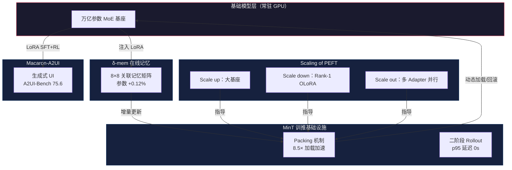

# Mind Lab 四件套深度解读：LoRA 持续学习如何从「廉价平替」变成智能体基础设施

## 一、核心判断

2026 年 6 月 2 日，机器之心转载了 Mind Lab 连续发布的 LoRA / PEFT 研究进展。这家归属于 Mindverse（心洲科技）的实验室在不到一个月内放出了四块拼图：

- **δ-mem**：基于 LoRA 的混合线性注意力在线记忆机制，参数增加 0.12%，Memory Agent Bench 性能提升 1.31 倍
- **MinT**：面向百万级 LoRA 的训练与服务基础设施，模型交接时间缩短 18.3 倍
- **Scaling of PEFT**：LoRA 的 Scale up / Scale down / Scale out 三大扩展轴
- **Macaron-A2UI**：用 LoRA 训练出来的生成式 UI 模型，A2UI-Bench 75.6 分

四块拼图拼在一起的方向是：**少数几个强大的万亿参数基础模型，支撑数百万个参数极小、但有独立记忆、技能和 UI 交互能力的可持续学习智能体**。

理解这个方向的关键，是把 LoRA 从"大模型全参数后训练的廉价平替"重新定位为"持续学习智能体的核心架构机制"。Mind Lab 这一系列研究要填的，就是这两个定位之间的工程鸿沟。

### 四件套关系总览

四条线在工程上的分工：δ-mem 负责"记住"，MinT 负责"管住"，Scaling of PEFT 负责"为什么能 scale"，Macaron-A2UI 负责"产出什么"。下面从"为什么传统方法解决不了持续学习"开始拆。

### 阅读指引

三个问题贯穿全文：

1. **为什么全参数微调和长上下文都不是持续学习的答案？**（§二）
2. **Mind Lab 四件套各自在解决什么工程问题，它们之间怎样协作？**（§三、§四）
3. **如果你是创业者、大模型工程师或投资人，这些技术进展对你意味着什么？**（§六、§七）

时间有限的话，先读 §一（核心判断 + 总览图）、§四（任务流案例）和 §七（决策建议），三节加起来大约 10 分钟。

## 二、问题切入：大模型为什么"持续学习"一直没解决

### 2.1 KV cache 是个冻结的临时缓存

Transformer 推理时的 KV cache 只在单次推理生命周期内存在。它的本质是"当前上下文的中间状态"——会话结束就丢弃。这与人脑的工作记忆机制不同，人脑的工作记忆会被编码进长期记忆，下次还能调用。

工程上目前的两个补救方向都各有问题：

| 方向 | 做法 | 局限性 |
|------|------|--------|
| 长上下文窗口 | 把历史塞进 prompt | 上下文长度受限于注意力 O(n²) 计算；过长的上下文会"中间遗忘" |
| 外部 RAG 检索 | 写库 + 检索 | 检索粒度受限于文本切块；事实性更新需要重建索引；延迟高 |

这两个方向的共同缺陷是：**它们都不进入参数层**。模型的权重本身不会因为使用而更新。

### 2.2 全参数后训练成本太高

要让模型真的"持续学习"，最直接的做法是全参数后训练。但这个路径的代价是：

- 单次微调成本：1T 稀疏 MoE 的 RL 微调，单次实验 GPU 成本数百万美元
- 存储成本：每用户一个 checkpoint，几百万用户就是几个 EB
- 推理成本：每个用户部署一份完整模型，集群规模无法扩展
- 回滚成本：策略回退需要重新加载整模型，分钟级延迟

这些代价让"全参数持续学习"在工程上不可行。

### 2.3 LoRA 提供了第三条路

LoRA（Low-Rank Adaptation）的核心思想是冻结主干权重，在旁路注入一对低秩矩阵。Adapter 文件大小通常不到基础模型的 1%，rank-1 配置下可降到约 0.1%。

但传统 LoRA 用法是"训练一次，部署一次"，没有把"持续更新"作为核心架构能力。Mind Lab 的四件套要做的，就是把 LoRA 改造成"支持运行时更新、可管理、可扩展"的基础设施层。

## 三、四件套技术拆解

### 3.1 δ-mem：基于 LoRA 的混合线性注意力在线记忆

**问题：** 传统 Transformer 的注意力是 O(n²) 的，处理长上下文时计算和显存都不可控。

**方案：** δ-mem 提出平行混合线性注意力架构，把冻结的全注意力主干网络与一个紧凑的在线关联记忆状态（Online State of Associative Memory）结合起来。

**关键参数：**
- 8×8 在线记忆状态矩阵
- 参数增加：0.12%
- 增量更新规则：delta-rule learning
- 训练开销：在 Attention Query 和 Output 上施加低秩校正

**性能数据：**

| 基准 | 性能提升 |
|------|---------|
| Memory Agent Bench | 1.31× |
| LoCoMo（长上下文记忆） | 1.20× |

0.12% 的额外参数就能在重度记忆基准上换来 30% 以上的提升——"长上下文"的瓶颈不在注意力机制本身，而在参数层容量。δ-mem 把工作记忆从上下文层下沉到参数层，绕过了 O(n²) 的算力墙。

**Reddit 验证案例：** 一名网友在论文发布后把 δ-mem 集成到自己的 Apple Silicon 小龙虾 agent 中，也获得了记忆表现提升——这说明 δ-mem 的训练成本低到可以在消费级硬件上跑通。

### 3.2 MinT：百万级 LoRA 的训推基础设施

**问题：** 持续学习的智能体系统意味着每个用户都有自己的 LoRA Adapter。系统的工程问题变成"管理一大群模型变体"，而不是"管理一个模型"。

**方案：** MinT 是一个专为 LoRA 训练和在线服务打造的托管基础设施系统。

**核心设计原则：**
- 基础模型长期保留在训练和推理服务中
- 训练导出的是 LoRA Adapter，不是完整模型
- 评估、上线、回滚只移动和加载 Adapter

**关键性能指标：**

| 指标 | 数值 | 含义 |
|------|------|------|
| Adapter 文件大小 | < 1%（rank-1 时 0.1%） | 单 Adapter 存储成本极低 |
| 模型交接时间 | 缩短 18.3 倍 | 训练完成到服务可用的端到端时间 |
| 实时加载速度 | 8.5-8.7 倍 | 通过打包 MoE LoRA 张量实现 |
| LoRA 加载 p95 | 0 秒 | 用户可见的加载延迟 |
| 首请求 TTFT p95 | 缩短 2.3 倍 | 端到端首次响应时间 |

**两个核心工程机制：**

1. **Packing 机制：** 打包 MoE LoRA 张量，去除大量小对象的读写风暴。单次冷加载速度提升 8.5-8.7 倍。

2. **二阶段 Rollout：** 预热阶段在 admission 控制下完成，LoRA 仅在就绪后才对用户流量可见。混合负载测试下，用户可见的加载 p95 降至 0，首请求 TTFT p95 缩短 2.3 倍。

MinT 的设计本质是把模型仓库和推理服务做物理分离——基础模型是 CPU/GPU 上的热工作集，LoRA Adapter 是持久化的策略目录。百万级 LoRA 同时在线不再是理论推演，而是 MinT 已经验证过的工程结果。

### 3.3 Scaling of PEFT：LoRA 的三大扩展轴

Mind Lab 把 LoRA 的扩展性拆解为三个互相正交的轴：

**轴一：Scale up（大基座）**

直觉是更大参数量的基础模型能让微小的 LoRA 更新产生更大的杠杆效应。但实际工程上，1T 规模的稀疏 MoE 上做 LoRA RL 面临训推不一致的难题——MoE 在训练和推理过程中专家的激活路径不同。

Mind Lab 发现了现有 Router Replay 机制在前沿 MoE 模型上失效的原因，并提出相应修正以消除训练和推理的差异。

**轴二：Scale down（小 Adapter）**

业界通常把 LoRA rank 设在 16-32。Mind Lab 通过 OLoRA-tail 方法把 rank 压到 1 仍然保持稳定：

- 利用预训练权重的次要奇异向量（minor singular vectors）进行初始化
- 移除可能导致强化学习不稳定的奇异值缩放因子
- 在不增加参数量的前提下，大幅提升 Rank-1 适配器的稳定性与性能

**轴三：Scale out（多 Adapter 并行）**

这是最关键的一轴。MinT 让上百个 LoRA adapter 同时在线，"模型数量"本身成为可调节的 scaling 变量。

具体实现是 **LoRA as Memory**：

- LoRA 容量约 tokens/param，是一种有限介质
- 应留给 skill、persona 等持久行为状态而非可编辑事实
- 由 Context Learning 让不同的 adapter 沿不同路径分化

具体验证来自多数投票实验：准确率随模型数量 k 呈现经验上的对数增长关系。这是从三个扩展轴上涌现出来的、基于模型数量的 scaling law，它把模型数量从工程负担变成了 scaling 杠杆。

### 3.4 Macaron-A2UI：生成式 UI 智能交互

**问题：** 纯文本对话在处理复杂用户任务时存在认知负荷高、流程繁琐的瓶颈。

**方案：** Macaron-A2UI 是一个根据用户专属习惯持续学习的生成式 UI 模型。模型不仅输出文本，还能在实时交互中生成结构化的 A2UI 可执行动作（多选框、滑块、确认卡片等）。

**训练流程：**
- 基座：30B / 235B / 754B 三种规模
- 平台：MinT 基础设施
- 阶段一：基于 LoRA 的 SFT（监督微调）建立文本到 UI 的对齐
- 阶段二：GRPO 强化学习提升可执行交互的质量

**性能数据：**
- Macaron-A2UI-Venti（754B 基底）在 A2UI-Bench 上综合得分 **75.6**
- 超越了输入了完整冗长 Schema（长度约 27 倍）提示的最强前沿模型基线

复杂 UI 生成能力可以通过高效微调内化到模型权重里，它不是巨型模型的"原生能力"，而是训练出来的小型能力。这与生成式 UI 的主流思路——超大模型配超长 prompt——走在完全相反的方向上。

## 四、任务流案例：一个持续学习智能体的日常

以"小李的个性化 AI 助理"为例，看 Mind Lab 四件套怎么协作：

### 阶段 1：冷启动（用户首次使用）

- 加载基础模型（30B 规模，常驻在推理集群）
- 加载通用 LoRA Adapter
- 初始化 δ-mem 在线记忆状态（8×8 矩阵，全零）

**耗时：** ~100ms（MinT Packing 机制预热）

### 阶段 2：用户偏好学习（前 100 次交互）

- 每次交互，δ-mem 累积用户偏好
- OLoRA-tail 增量更新通用 LoRA Adapter 的 Rank-1 子空间
- 不重训基础模型

**性能：**
- 100 次交互后，δ-mem 已经能预测用户的下一步操作（Memory Agent Bench 1.31x）
- LoRA Adapter 文件大小：~30MB

### 阶段 3：用户专门技能习得（垂直任务）

- 用户在某个垂直领域（如烹饪）做了 1000 次交互
- MinT 在原 Adapter 基础上，scale out 出一个新 Adapter
- 原 Adapter 保留，新 Adapter 进入预热阶段（二阶段 Rollout）

**耗时：** 用户无感（p95 加载延迟 0 秒）

### 阶段 4：多任务并行

- 用户在工作流中同时调用烹饪、财务、写作三个 Adapter
- MinT 调度器根据上下文动态加载对应 Adapter
- δ-mem 在切换 Adapter 时保留跨任务的长期记忆

**性能：**
- TTFT p95 < 200ms（缩短 2.3 倍后）
- 三个 Adapter 累计文件大小：~90MB（不到基础模型 1%）

### 阶段 5：用户群体聚合（运营视角）

- 1000 个用户的 Adapter 聚合投票
- 准确率随 k 呈对数增长
- 异常用户 Adapter 被 MinT 自动检测 + 回滚

**运营指标：**
- 单用户存储成本：~100MB
- 单次模型上线时间：< 1 秒（18.3 倍提速后）
- 集群 GPU 利用率：> 80%（常驻基础模型 + 动态 Adapter 切换）

## 五、benchmark 数据深度解读

### 5.1 δ-mem：0.12% 参数换 31% 性能的含义

Memory Agent Bench 1.31x 这个数字的工程含义是：

**模型的"工作记忆"瓶颈不在注意力机制，而在参数容量。**

传统思路认为"模型记不住东西"是因为上下文窗口太短，所以拼命扩窗口、扩 KV cache。δ-mem 反过来证明：在参数层加 0.12% 的容量，可以比"加 10 倍上下文长度"更有效。

这对所有"长上下文派"的公司（包括 Anthropic 的 200K 上下文、Magic 的 100M token 上下文）都是一个信号：**单纯堆上下文长度的边际收益已经很低，把容量塞进参数才是正路。**

**不能直接推出的是：** δ-mem 目前只在特定记忆基准上验证，LoCoMo（长对话记忆）的 1.20× 和 Memory Agent Bench 的 1.31× 不等同于"所有长上下文任务都能提升 30%"。δ-mem 的增量更新规则在百万 token 级别的超长序列上是否存在数值漂移，论文尚未给出结论。

### 5.2 MinT：18.3 倍提速的工程含义

18.3 倍提速对应的是"训练完成到推理服务可用"的端到端时间。这个数字的工程含义是：

**传统的"训练 + 模型导出 + 重新部署"流程在持续学习场景下完全失效**。

持续学习意味着每天可能有成千上万次小规模训练。如果每次小训练后都要重新部署完整模型，GPU 集群的抖动会让 SLA 不可控。MinT 通过"基础模型常驻 + Adapter 动态加载"把部署开销降到了工程可接受的水平。

**不能直接推出的是：** 18.3 倍是"训练完成到服务可用"的端到端时间对比，不代表推理吞吐提升 18.3 倍。MinT 的 Packing 机制在 MoE 架构上验证，对于 Dense 模型的 LoRA 调度效率需要单独评估。二阶段 Rollout 的 p95 延迟 0 秒是在受控混合负载下测得的，线上极端流量模式下的表现仍需验证。

### 5.3 多数投票对数增长定律的工程含义

"准确率随模型数量 k 呈对数增长"这个发现的工程含义是：

**多 Adapter 聚合可以替代巨型单模型。**

传统思路认为模型越大能力越强，所以拼命堆参数。Mind Lab 的发现反过来说：与其训练一个 1T 的单一模型，不如训练 1000 个 100B 的 LoRA Adapter，让它们聚合投票。

这种思路在 RLHF / RL 训练上特别有价值——多策略聚合相当于天然的 ensemble，能提供比单策略更稳定的输出。

**不能直接推出的是：** 对数增长意味着边际收益递减——从 10 个 Adapter 加到 100 个的提升幅度远大于从 100 个加到 1000 个。聚合收益的饱和点（k 多大时增长趋于零）目前没有明确结论。同时，聚合投票的准确率优势在需要确定性输出的场景（如代码生成、数学推理）下未必成立，需要单独评估。

## 六、产业链意义：PEFT 从"工程技巧"变成"基础设施"

### 6.1 PEFT 工具链

| 公司 | 产品 | 与 Mind Lab 四件套的关系 |
|------|------|------------------------|
| HuggingFace PEFT | LoRA、AdaLoRA、QLoRA | 上下游：PEFT 库是 MinT 调用的基础组件 |
| Together AI | Inference 平台 | 上下游：可参考 MinT 架构做 Adapter 调度 |
| Replicate | Cog | 上下游：可借鉴 MinT 的 Packing 机制 |
| Anyscale | Ray + LoRA | 上下游：分布式 LoRA 训练的参考架构 |

### 6.2 推理芯片

δ-mem 的低秩校正对硬件的乘法累加（MAC）密度有特定要求。MinT 的 MoE LoRA Packing 需要芯片支持稀疏访存。

| 芯片类型 | 与 Mind Lab 适配性 |
|---------|------------------|
| NVIDIA H100/H200 | 高度适配：Tensor Core 支持低秩 MAC |
| Groq LPU | 中度适配：线性架构对低秩校正友好 |
| Apple Silicon M-series | 中度适配：δ-mem 已在 M 系列上验证 |
| 国产 GPU | 待验证：稀疏访存支持是关键 |

### 6.3 商业化路径

Mind Lab 所属公司是 Mindverse（心洲科技）。从发布的节奏看，他们在押注"持续学习智能体"赛道：

- δ-mem 解决"记忆"问题
- MinT 解决"规模化"问题
- Scaling of PEFT 解决"理论"问题
- Macaron-A2UI 解决"应用"问题

商业化上可能的路径：
- 卖 API：把 MinT 包装成"持续学习智能体托管平台"
- 卖模型：Macaron-A2UI 直接面向 ToB 客户
- 卖基础设施：MinT 授权给其他 AI 公司
- 卖技术许可：δ-mem 论文发表后，其他公司可能需要付费集成

## 七、决策建议：不同角色的应对

### 7.1 AI 创业公司（智能体方向）

**优先级 P0（0-6 个月）：**
- 评估 δ-mem 集成到自家产品中的可行性
- 内部用 MinT 架构做 LoRA Adapter 调度

**优先级 P1（6-12 个月）：**
- 跟踪 OLoRA-tail 工程化进展
- 储备"多 Adapter 聚合投票"作为输出稳定性方案

### 7.2 大模型公司

**优先级 P0（0-6 个月）：**
- 内部建立 LoRA 持续训练的数据飞轮
- 评估 PEFT 工具链与自家 infra 的兼容性

**优先级 P1（6-12 个月）：**
- 投资或收购 PEFT 基础设施公司
- 在下一代基础模型设计中预留 Adapter 友好接口

### 7.3 投资人

四个核心问题：

1. 这家公司是否在押注"持续学习"方向，而不是"AGI"或"长上下文"？
2. 它是否有完整的工程闭环（算法 + 系统 + 理论）？
3. 它的客户是否真的需要 Adapter 级个性化（而不是统一的"超级 GPT"）？
4. 它的商业化路径是"卖 API"、"卖模型"还是"卖基础设施"？

### 7.4 研究者

开放的工程问题：
- **δ-mem 与 MoE 的结合**：8×8 记忆状态能否推广到 N×N（N 是专家数）？
- **OLoRA-tail 的稳定性证明**：为什么 minor singular vectors 初始化能稳定 RL 训练？
- **MinT 的 Packing 算法**：MoE LoRA 张量打包的最优策略是什么？
- **多 Adapter 聚合的相变点**：k 增加到多大时聚合收益饱和？

## 八、边界与风险

### 8.1 Mind Lab 数据未独立验证

- 所有性能数据来自论文与官方转发
- 第三方独立测试尚未发布
- Reddit 网友的"小龙虾"实验是个例，不是 benchmark

### 8.2 论文级别的工程化挑战

- δ-mem 的增量更新规则在长序列下可能存在数值漂移
- MinT 的 Packing 机制在异构硬件上通用性存疑
- OLoRA-tail 在 1T+ 模型上的扩展性未验证

### 8.3 商业化挑战

- "持续学习智能体"的市场需求尚未完全验证
- 与基础模型公司的差异化竞争难度大
- 国产化的硬件支持还在路上

### 8.4 适用边界

- **本报告适合**：AI 基础设施创业者、大模型架构师、智能体产品经理、PEFT 方向研究者
- **不适合**：纯应用层创业（不是基础设施赛道）
- **样本有效期**：2026 年 6 月初数据，3-6 个月内有效

## 九、常见问题

**Q1：δ-mem 和 RAG 有冲突吗？能不能一起用？**

不冲突。δ-mem 解决的是"参数层的工作记忆"，RAG 解决的是"外部知识的检索召回"。两者的协作方式可能是：RAG 负责冷 facts（如产品文档、新闻），δ-mem 负责热 patterns（如用户偏好、交互习惯）。MinT 的 Adapter 调度层可以为两者提供统一的加载和切换机制。

**Q2：OLoRA-tail 的 rank-1 比 rank-16 的常规 LoRA 差多少？**

论文给出的结论是"rank-1 保持稳定"，但这里的"稳定"指的是 RL 训练过程中不出现剧烈波动。在绝对性能上，rank-1 通常低于 rank-16——差异取决于任务的复杂度和基座模型的容量。Mind Lab 把 rank-1 定位为"最小化 Adapter 尺寸的极限方案"，而不是"无代价的最佳方案"。

**Q3：MinT 只能用于 LoRA 吗？QLoRA、AdaLoRA 等其他 PEFT 方法呢？**

MinT 的 Packing 和二阶段 Rollout 机制设计上对 PEFT 方法是通用的，论文中明确提到支持 QLoRA。但目前公开的性能数据主要集中在 LoRA 场景下。其他 PEFT 变体（如 AdaLoRA 的动态秩分配）需要额外的调度策略，MinT 论文未展开。

**Q4：Macaron-A2UI 的 75.6 分在 A2UI-Bench 上到底什么水平？**

A2UI-Bench 是一个相对新的基准。75.6 分本身不提供绝对参照系，论文的关键比较点是"超越了输入完整 27 倍长度 Schema 的最强前沿模型"。Macaron-A2UI 通过 LoRA 训练内化了对 UI Schema 的理解，而不是在推理时依赖超长 prompt 注入格式定义。

**Q5：这套方案对国产 GPU 或消费级硬件友好吗？**

δ-mem 已在 Apple Silicon M 系列上被社区验证可行，说明低秩校正本身对硬件要求不高。但 MinT 的 MoE LoRA Packing 依赖 GPU 的稀疏访存能力，在国产 GPU 上未经测试。如果你的部署目标是消费级硬件，δ-mem + 单 Adapter 的方案可行；百万级 Adapter 调度仍然需要数据中心级 GPU 集群。

## 十、自测清单

5 个问题快速检验理解程度：

1. LoRA 做持续学习的三个核心优势是什么？（提示：对比 §2.2 全参数训练的成本）
2. δ-mem 的 8×8 记忆矩阵在 Transformer 的哪个位置注入？为什么选这个位置？
3. MinT 的"基础模型常驻 + Adapter 动态加载"方案中，如果基础模型需要更新怎么办？
4. Scale up / Scale down / Scale out 三条轴中，哪一条最直接影响推理成本？为什么？
5. 多 Adapter 聚合投票的对数增长定律对你正在做的项目有什么启示——是否值得把单模型替换为多 Adapter ensemble？

第 3 题如果没有明确答案，建议回看 §3.2 中 MinT 的"模型仓库与推理服务物理分离"的设计原则。基础模型更新时 MinT 相当于"换底座"——所有 Adapter 需要重新对齐，这是 MinT 尚未完全解决的工程难题。

## 十一、结语

Mind Lab 四件套的工程价值，是**把 LoRA 从"大模型的廉价平替"重新定位为"智能体时代的基础设施"**。

过去 5 年，LoRA 在学界和工业界被广泛使用，但大家默认它是"穷人版的全参数微调"。Mind Lab 的四块拼图让 LoRA 走出这个定位：δ-mem 让它能"记住"，MinT 让它能"规模管理"，Scaling of PEFT 让它能"作为 scaling 杠杆"，Macaron-A2UI 让它能"产出应用价值"。

接下来 12-24 个月，是这些研究从论文走向产品的关键期。如果 MinT 真的能稳定支持百万级 LoRA 调度，如果 δ-mem 真的在主流模型上跑通，**整个 AI 行业的个性化范式会从"大模型 + RAG"转向"小 Adapter + 在线记忆"**。

对 AI 基础设施创业者来说，2026 年下半年押注 PEFT 方向不会太早。大模型公司则需要把 LoRA 从工程技巧升级到基础设施战略层面。投资人这边，一个务实的动作是把"持续学习智能体"和"AGI 路线"放进不同的估值框架——前者是工程问题，后者是哲学问题，工程问题的回报曲线更可预测。

## 参考资料

1. 机器之心 Pro，《Mind Lab 连续发布 LoRA 最新进展，大模型「持续学习」新范式浮现》，2026-06-02。
2. Mind Lab δ-mem 论文（基于 X / HuggingPapers 转发，2054431768779067542）。
3. Mind Lab On the Scaling of PEFT 论文（X / HuggingPapers 2056021071862575448）。
4. Mind Lab Macaron-A2UI 论文（基于机器之心转载）。
5. Awais 推文解读 MinT（X / drawais_ai 2056301110906757464）。
6. VentureBeat 关于 δ-mem 的报道。
7. Reddit r/LocalLLaMA 网友的 δ-mem Apple Silicon 集成案例。
8. Mindverse（心洲科技）公司公开资料。
