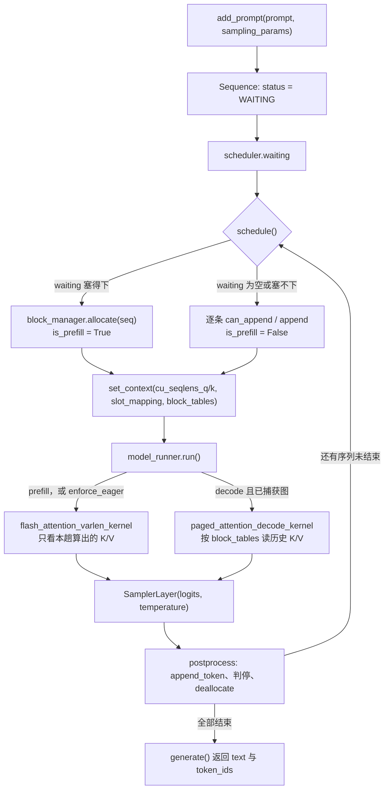

> **目标读者**：读过 vLLM 论文、但对 PagedAttention 到底落在哪几行代码仍然模糊，需要一份能整仓读完的实现来对齐理解的工程师；以及打算把 MinivLLM 当脚手架、得先判断它承受到哪一步的人。
>
> **本文口径**：核对对象是 `main` 分支 HEAD `00db3b4`，仓库最近一次推送 2026-08-29。文件行数、配置键、方法名取自 2026-09-21 本机一份全新浅克隆；调度与前缀缓存的行为结论取自本机实跑（Python 3.11.16 + numpy + xxhash，不需要 GPU）。没有实跑支撑的部分，句子里会直接写明。

## 目录

- [一句话判断](#一句话判断)
- [项目坐标](#项目坐标)
- [六个步骤各自管什么](#六个步骤各自管什么)
- [一次请求的完整流转](#一次请求的完整流转)
- [分页缓存的账本](#分页缓存的账本)
- [前缀缓存真正生效的条件](#前缀缓存真正生效的条件)
- [张量并行与权重加载的错位](#张量并行与权重加载的错位)
- [注意力内核的三个分支](#注意力内核的三个分支)
- [调度器的四条硬规则](#调度器的四条硬规则)
- [三个基准测试分别测什么](#三个基准测试分别测什么)
- [跑起来与常见报错排查](#跑起来与常见报错排查)
- [谁该读这套代码](#谁该读这套代码)
- [五道练习](#五道练习)
- [下一步读什么](#下一步读什么)
- [参考资料](#参考资料)
- [复核口径与失效条件](#复核口径与失效条件)

## 一句话判断

MinivLLM 的产物不是一台能用的推理引擎，而是一条被跑通了的读代码路径。从一个激活函数出发，六步拼出一个大语言模型（LLM）推理引擎，能加载 Qwen3-0.6B 的权重、批量出词。它只有 3,258 行 Python 核心代码，因此"整仓读完"在这里不是修辞。

它的价值上限来自另一件事：代码与文档之间有四处对不上，恰好都落在读者最想抄的那几个能力上。CUDA Graph 在演示配置里根本进不去，前缀缓存跨会话不生效。多卡下的权重加载绕开了自家的分片约定，仓库自带的 8 个调度器测试在 HEAD 上全部跑不起来。此外还有两处 README 对演示脚本的描述已经过期。把这六点都对准之后，剩下的部分质量相当高。

所以更准的说法是：把 MinivLLM 当"读懂 vLLM"的地图用，收益很实在；把它当可裁剪的生产起点，需要先补掉那四处。本文按这个顺序展开——先讲清六步怎么搭、一次请求怎么流，再逐条给出分岔的证据。

## 项目坐标

| 项 | 值（2026-09-21 核对） |
|:---|:---|
| 仓库 | [Wenyueh/MinivLLM](https://github.com/Wenyueh/MinivLLM)，默认分支 `main`，HEAD `00db3b4` |
| 自述定位 | 基于 Nano-vLLM 的 vLLM 复刻，把分页注意力机制（Paged Attention）与 Flash Attention 两份内核都自己实现了一遍 |
| 许可 | Apache-2.0（仓库根目录有 `LICENSE`） |
| 关注度 | 1,042 stars、176 forks、18 个未关闭 issue 与 PR 合计 |
| 时间线 | 建仓 2025-12-29，最近一次推送 2026-08-29 |
| 分支 | 11 个，含 `multi-gpu`、`sparse_attn`、`tokenparallel`、`attn_batch`、`fix_loading` |
| 代码体量 | 受版本控制的文件 39 个；`src/myvllm/` 合计 3,258 行 Python |
| 运行门槛 | Python `>=3.11,<3.12`、CUDA 可用的 GPU；依赖 `transformers`、`torch`、`xxhash`、`vllm>=0.15.0` |
| 已支持模型 | Qwen3-0.6B 与 Llama-3.2-1B-Instruct，按 `model_name_or_path` 的目录名匹配 |
| 配套指南 | `HowToApproachvLLM.md` 987 行、`HowToApproachvLLM_zh.md` 1,001 行，中英各一份 |

有一行值得单独指出来：`vllm>=0.15.0` 是 `pyproject.toml` 里的直接依赖，不是可选组。装这个仓库会连带把 vLLM 装上，因为 `benchmark_tps.py` 要拿它当对照组。

## 六个步骤各自管什么

作者把学习路径写成六个 Step，指南里就是这六个小节，其余代码文件都挂在对应小节下。它们的边界是清楚的，行数为证：

| 步骤 | 组件 | 管什么 | 落在哪 |
|:---|:---|:---|:---|
| 1 | 层组件 | 激活、归一化、并行线性层、嵌入与 LM Head、注意力、旋转位置编码 | `src/myvllm/layers/`，1,380 行 |
| 2 | 模型 | 把层拼成可前向的完整模型 | `models/qwen3.py` 353 行、`models/llama.py` 313 行 |
| 3 | 序列与内存块 | 一条序列有多少个词元、占哪些块、每块被几条序列引用 | `engine/sequence.py` 114 行、`engine/block_manager.py` 160 行 |
| 4 | 模型运行器 | 显存预算、数据准备、内核选择、CUDA Graph、跨进程通信 | `engine/model_runner.py` 457 行 |
| 5 | 调度器 | 组批、抢占、判停 | `engine/scheduler.py` 117 行 |
| 6 | 引擎 | 进程生命周期与顶层应用程序接口（API） | `engine/llm_engine.py` 112 行 |

第 3 步和第 4 步之间有一条最容易读混的界线：`BlockManager` 只记"哪个块归谁、还有几个块能发"，它不碰显存里的数值；真正把 K/V 写进块的是 `model_runner` 准备、由 `layers/attention.py` 的 `store_kvcache` 执行的那次拷贝。两边对接的数据结构只有一个整数列表 `slot_mapping`，和一张 `block_table`。



图里 `set_context` 那一步是理解整套代码的钥匙：层与内核之间不传参数，全部经由 `utils/context.py` 里一个模块级 `_context` 对象。`Attention.forward` 读它决定走哪条内核分支，`Qwen3DecoderLayer.forward` 也读它算位置编码。代价是这条链上有隐式全局状态，好处是模型定义里每个 `nn.Module` 的签名保持干净。

## 一次请求的完整流转

下面这条示例走的是 `main.py` 实际发出的第一条提示词（Prompt）：它先过分词器（Tokenizer）套上聊天模板，长度约五十个词元（令牌），远低于配置里的 `block_size: 256`。

第一步，入口。`LLMEngine.generate(prompts, sampling_params)` 对每条 prompt 调一次 `add_prompt`，把它 encode 成整数列表再包成 `Sequence`，塞进 `scheduler.waiting`。此时没有分配任何块。`Sequence.__init__` 用 `copy(token_ids)` 做浅拷贝，注释写得很直白：防止外部改动波及内部状态。

第二步，组批。`step()` 调 `scheduler.schedule()`，它返回的不是"一个序列加阶段标记"这种结构，而是一个二元组 `(list[Sequence], is_prefill)`。waiting 非空且 `can_allocate` 通过时，本轮走 Prefill。

第三步，记账。`block_manager.allocate(seq)` 从 `free_block_ids` 的**队头**取块，把块号追加进 `seq.block_table`。这条序列只有一个不满的块，所以不产生哈希。

第四步，准备数据。`prepare_prefill()` 把批次内各序列的词元拍平成一维张量，算出 `cu_seqlens_q` 与 `cu_seqlens_k`，按块展开 `slot_mapping`，最后用 `pin_memory=True` 加 `non_blocking=True` 送上 GPU，再经 `set_context` 存进全局上下文。函数返回的只有 `input_ids` 一个张量，其余都留在那个上下文对象里。

第五步，前向。嵌入向量（Embedding）查表 → 逐层：RMSNorm（含残差融合）→ QKV 投影 → Q/K 各自的按头归一化 → RoPE → 注意力 → 输出投影 → MLP → LM Head。Prefill 走 `flash_attention_varlen_kernel`，因果掩码在 kernel 里生成。

第六步，采样与判停。`SamplerLayer` 拿到 logits 和温度张量，返回本批次每个序列的下一个词元。`scheduler.postprocess()` 给序列 `append_token`，再按三个条件判停：命中 EOS（除非 `ignore_eos`）、生成长度到 `max_tokens`、总长度到 `max_model_length`。任一成立就置 `FINISHED`、`deallocate` 归还块、从 running 摘掉。

第七步，转入 Decode。下一轮 `schedule()` 时 waiting 已空，走 decode 分支；`prepare_decode()` 每序列只喂上一个词元，但把 `context_lens` 设为整条序列长度，`block_table` 补 `-1` 对齐成矩形。注意力切到 `paged_attention_decode_kernel`。

第八步，收尾。`generate()` 的 while 循环每轮打印一行词元数与词元/秒，直到 `scheduler.is_finished()`；结束时按 `seq_id` 排序、解码文本，返回一个同时带 `text` 与 `token_ids` 两个键的字典。

流转里有三个切换点值得记住：序列状态在 Prefill 结束时从 `WAITING` 变 `RUNNING`；内核在每轮 `run()` 时按 `is_prefill` 二选一；CUDA Graph 只在 Decode 且 `enforce_eager` 为 False 时才可能被用到——而最后这一条，正是第一处分岔。

## 分页缓存的账本

`block_manager.py` 全文 160 行，是这套代码里最值得逐行读的文件，因为它把"虚拟内存"这件事压缩到了四个数据结构：

```python
class BlockManager:
    def __init__(self, num_blocks: int, block_size: int):
        # block_size: number of tokens per block
        self.block_size: int = block_size
        # list of all blocks
        self.blocks: list[Block] = [Block(i) for i in range(num_blocks)]
        # hash to block id: this is for prefix caching
        self.hash_to_block_id: dict[int, int] = {}
        # free block ids
        self.free_block_ids: deque[int] = deque(range(num_blocks))
        # used block ids
        self.used_block_ids: set[int] = set()
```

对外方法只有六个，加两个内部方法。逐个对上语义，比记概念有用：

| 方法 | 真实判据 |
|:---|:---|
| `compute_hash(token_ids, prefix_hash_value)` | `xxh64`；`prefix_hash_value != -1` 时先把前缀哈希按 8 字节小端拼进去 |
| `can_allocate(seq)` | `len(free_block_ids) >= seq.num_blocks`，整条序列一次问清 |
| `allocate(seq)` | 逐块查缓存；**只有满块参与哈希**，不满的块哈希恒为 `-1` |
| `can_append(seq)` | 仅当 `seq.num_tokens % block_size == 1` 才需要空闲块 |
| `append(seq)` | 满块落哈希、开新块、或只跑断言，三种取模分支各有断言 |
| `deallocate(seq)` | 逐块减引用，归零才回收；顺带清空 `block_table` 与 `num_cached_tokens` |
| `_allocate_block` / `_deallocate_block` | 账本搬运；`Block.reset()` 把 `ref_count` 直接置 1 |

`can_append` 是里面最反直觉的一个。它被调用的时机是"新词元已经计进 `num_tokens`、但还没落块"，于是取模结果和直觉差一：

```python
    # this is to check whether we can append tokens to this sequence
    # when that token would require allocating a new block.
    def can_append(self, seq: Sequence) -> bool:
        # Called after the new token is already counted in seq.num_tokens, so the
        # condition must match append()'s allocation branch: a fresh block is only
        # needed when that token is the first of a new block (num_tokens % size == 1).
        # At num_tokens % size == 0 the token still fits in the block the sequence
        # already holds, and append() merely finalizes its hash.
        if seq.num_tokens % self.block_size == 1:
            return len(self.free_block_ids) > 0
        return True
```

本机实跑（`block_size=4`，人为把空闲集合清空）：

| `seq.num_tokens` | 4 | 5 | 6 | 7 | 8 | 9 | 12 | 13 |
|:---|:---|:---|:---|:---|:---|:---|:---|:---|
| 模 4 | 0 | 1 | 2 | 3 | 0 | 1 | 0 | 1 |
| `can_append` | True | False | True | True | True | False | True | False |

余数为 0 时返回 True 不是 bug：那一刻最后那块刚被填满、还没落哈希，`append()` 要做的只是补一个哈希，不需要新块。真需要新块的时刻是余数 1。

另一处细节在 `Block.reset()`。它把 `ref_count` 置成 1 而不是 0，并留了注释解释原因：`reset()` 只会经由 `_allocate_block` 到达，而后者正是"把块从空闲表摘给某一条序列"，分配本身就是第一次引用；若留 0，配对的 `deallocate()` 会把计数减到 -1，块就永久泄漏。读到这里可以顺手记住一个检查点——凡是引用计数体系，先确认 0 归谁。

## 前缀缓存真正生效的条件

这是第二处分岔，也是最容易高估的一处。README 与指南都在"高级优化"清单里列了 prefix caching，但它要同时满足三个条件才会命中：

```python
    def _deallocate_block(self, block_id: int) -> None:
        assert self.blocks[block_id].ref_count == 0, "Block is still in use"
        block = self.blocks[block_id]
        # Clearing token_ids deliberately keeps the prefix cache scoped to blocks that
        # are still referenced: a freed block can no longer match in allocate(), so a
        # cache hit never spans a finished sequence. Reuse across sequences is not
        # enabled yet because the prefill path cannot consume it -- the Triton kernel
        # in layers/attention.py attends only over the K/V computed in that pass and
        # ignores context.block_tables, and qwen3 derives RoPE positions from
        # cu_seqlens_q, so both would be wrong by num_cached_tokens. Enabling reuse
        # means a paged prefill kernel (cu_seqlens_q != cu_seqlens_k) plus a position
        # offset; until then this line is what keeps the engine correct.
        block.token_ids = []
        self.used_block_ids.remove(block_id)
        self.free_block_ids.append(block_id)
```

第一条，只有满块可缓存。`allocate()` 里那行三元表达式决定了这一点：不满 `block_size` 的块哈希恒为 `-1`，也就永远不进 `hash_to_block_id`。演示配置的 `block_size` 是 256，而 `main.py` 的三条 prompt 都远短于 256 个词元——因此**演示里一次缓存都不会命中**。把这两点放在一起测，效果非常直观：

| 场景 | prompt | `block_size` | 第二条序列的 `num_cached_tokens` |
|:---|:---|:---|:---|
| 演示形状 | 相同的 80 个词元 | 256 | 0（`hash_to_block_id` 始终为空） |
| 改小块 | 相同的 80 个词元 | 4 | 80 |

表里第二行那个结果——整条提示词全部命中——看着漂亮，但它恰好落进这个实现撑不住的情形，原因见下面的第三条。

第二条，两条序列得同时活着。`_deallocate_block` 会清空 `block.token_ids`，而 `allocate()` 的命中判据是 `self.blocks[block_id].token_ids != token_ids`；空掉的块永远匹配不上。所以跨会话、跨请求的复用是被主动关掉的，不是"暂时没测到"。同批次内并发存活的序列之间是真的能共享：本机跑三条共享 8 个词元前缀的序列（`block_size=4`），结果如下。

```python
pre = [10, 20, 30, 40, 50, 60, 70, 80]          # 恰好两个满块的前缀
seqs = [Sequence(pre + [i], 4) for i in (1, 2, 3)]
```

先只把 A 排进一轮 `schedule()`，再把 B、C 一起排进下一轮，读回来的状态是：

```text
A: block_table = [0, 1, 2]   num_cached_tokens = 0
B: block_table = [0, 1, 3]   num_cached_tokens = 8
C: block_table = [0, 1, 4]   num_cached_tokens = 8
ref_count: {0: 3, 1: 3, 2: 1, 3: 1, 4: 1}
```

块 0 与块 1 被三条序列共同引用，B 和 C 各少算 8 个词元。这一段就是 PagedAttention 论文里"共享物理块"的最小可运行版本，也是这个项目教学价值最高的一处。

第三条，Prefill 内核读不了历史 K/V。上面注释里作者自己写了原因：`layers/attention.py` 的 Flash 内核只在本趟算出的 K/V 上开窗，完全不碰 `context.block_tables`；同时 `models/qwen3.py` 从 `cu_seqlens_q` 反推位置编码。两条合起来意味着——一旦某条序列有 `num_cached_tokens` 个词元被跳过，位置就会整体错位。这不是"缓存没做好"，而是内核契约与缓存语义没接上。因此上一条表格里那个"命中 80"其实是这个实现目前不能安全消费的结果。

顺带一个同源的现象：`allocate()` 里"块已登记哈希但还没进 used 集合"的分支，作者标注为在当前实现下不可达，保留是为了将来打开跨会话复用时不必重写。

## 张量并行与权重加载的错位

`layers/linear.py` 里有 5 个具体的并行线性层，外加一个 `LinearBase` 基类：

| 类 | 切哪一维 | 前向是否通信 |
|:---|:---|:---|
| `ReplicatedLinear` | 不切 | 否 |
| `ColumnParallelLinear` | 输出维 ÷ `tp_size`，构造时断言整除 | 否，就是一次 `F.linear` |
| `MergedColumnParallelLinear` | 先合并多个输出尺寸再切 | 否 |
| `QKVColumnParallelLinear` | 按 head 数切，**head 内部不切** | 否 |
| `RowParallelLinear` | 输入维 ÷ `tp_size` | 是，`dist.all_reduce(..., SUM)` |

`QKVColumnParallelLinear` 的构造函数把"每卡保留完整 head"这件事写成了显式算术：`self.num_heads = num_heads // self.tp_size`，再把 `total_output_size = head_size * (num_heads + 2 * num_kv_heads)` 交给父类去除以 `tp_size`。切分发生在 head 边界上，所以任何一张卡上的 K 都自带完整 128 维。

`embedding_head.py` 里两处通信值得单独看。`VocabParallelEmbedding.forward` 先按词表分片做掩码，再 `all_reduce`，注释指出**必须掩码第二次**，否则越界的 id 会取到本分片 0 号位置的向量。`ParallelLMHead.forward` 则相反，用 `dist.gather(..., dst=0)` 把各卡 logits 收齐到 0 号卡再拼接、裁剪到原词表大小——一个聚合到一处，一个广播到全部，选型取决于谁来采样。

还有一个容易漏的优化：LM Head 在 Prefill 阶段只取每条序列的最后一个位置。

```python
        if context.is_prefill:
            # cu_seqlens_q = [0, 5, 8, 12]
            # last_indices = [5, 8, 12] - 1 = [4, 7, 11]
            last_token = context.cu_seqlens_q[1:] - 1  # exclude the first element which is 0
            x = x[last_token].contiguous()
```

拿它换一笔账：4 条序列、每条 60 个词元的批次，不做裁剪要为 240 个位置各算一次 151,936 维投影，做了裁剪只算 4 次。

第三处分岔就出在权重加载上。`linear.py` 里那段作为说明保留的注释写明了约定：每个 `param.weight_loader` 挂在参数上，加载时应调它来切出本卡分片。可 `utils/loader.py` 对 `qkv_projection` 与 `gate_up` 这两类合并权重并没有走这个约定，而是把 `torch.cat` 拼出的整份权重直接 `param.data.copy_()` 进去。单卡时分片与整份等大，没有问题；`world_size > 1` 时二者尺寸必然不一致。

更麻烦的是它怎么失败。合并分支被包在 `try/except Exception` 里，异常被收进 `skipped_params`，原因字符串以 `Error:` 开头；而末尾打印只统计 `"Merged"`、`"not found"`、`"No mapping"` 三类。也就是说这类跳过的权重不会出现在任何一条汇总里。我没有两块卡可以证实这条路径的后果，以上结论来自对代码路径的逐行追读；如果你要在多卡下用这份代码，先去看 `Weight Loading Summary` 之外还差了什么。

## 注意力内核的三个分支

`layers/attention.py` 544 行、三个 Triton 内核，全部自己写，这也是它区别于"套一层 vLLM"的地方。

`store_kvcache_kernel` 负责把新算出的 K/V 落到分页缓存里，网格是 `(num_tokens, num_kv_heads)`，缓存布局 `(num_blocks, block_size, num_kv_heads, head_dim)`。它有一个不显眼但全局依赖的行为：

```python
    slot_idx = tl.load(slot_mapping_ptr + token_idx)
    
    if slot_idx == -1:
        return
```

`-1` 就是"这一行是凑形状补出来的，别写"。`prepare_decode()` 用 `-1` 把 `block_table` 补齐成矩形，`run_model()` 在回放 CUDA Graph 前对 `slot_mapping` 先 `fill_(-1)` 再拷有效区。三处约定共用同一个哨兵值。

`flash_attention_varlen_kernel` 只在 Prefill 走。分块尺寸按 `head_dim` 定：≤64 用 64×64，≤128 用 32×32，更宽退到 16×16，注释里给的理由是把共享内存压在 48 KB 以下。它需要 `max_seq_len` 来定网格，而算法是 `cu_seqlens.cpu()` 差分取最大值——每次 Prefill 都夹一次设备到主机的同步。

`paged_attention_decode_kernel` 只在 Decode 走，网格 `(batch_size, num_heads)`，`BLOCK_N` 在 `head_dim <= 128` 时取 64。它的一个设计取向写在内核的文档字符串（docstring）里，和多数人的直觉相反：块表是**逐词元**取的，不是逐块取的，

```text
        token t  ->  block_tables[batch, t // block_size], slot t % block_size
```

因此一个 chunk 可以跨任意多个块，`BLOCK_N` 与 `block_size` 之间不需要任何整除关系。GQA 也在这条分支里处理：`kv_head_idx = head_idx // (num_heads // num_kv_heads)`。

`Attention.forward` 的选择逻辑一共只有三行值得记：先写缓存（前提是缓存已分配且 `slot_mapping` 不为空），再 `if context.is_prefill` 走 Flash、否则走 Paged。缩放系数是 `self.scale / (head_dim ** 0.5)`，所以 `main.py` 里写 `'scale': 1` 并不是取消了平方根缩放。另外 `Attention.__init__` 的 `block_size` 默认值是 16，而所有真实配置传的是 256——`benchmark_decoding.py` 的命令行注释专门提醒了这一点。

CUDA Graph 的入口在 `model_runner.py:406`，而分岔在这里：

```python
    @torch.inference_mode()
    def capture_cudagraph(self) -> None:
        max_bs = self.config['max_num_seqs']
```

`max_num_seqs` 这个键在全仓只出现这一次，就出现在读取处。三份入口配置（`main.py`、`main_llama32.py`、`benchmark_tps.py`）写的都是 `max_num_sequences`。于是把 `enforce_eager` 改成 False，捕获阶段第一行就会抛 `KeyError`；三份配置又都把 `enforce_eager` 设成 True，演示因此跑的是纯 eager 路径。我本机没有 CUDA，这条没有实跑，但结论只依赖一次全仓键名检索。

捕获本身的形状也值得一读：批大小列表是 `[1, 2, 4, 8] + list(range(16, max_bs + 1, 16))`，逆序捕获并共享同一个 `graph_pool`；回放时取"不小于当前批大小的最小图"，多出来的行靠 `slot_mapping` 的 `-1` 空转。

## 调度器的四条硬规则

`engine/scheduler.py` 117 行，能读出四条规则，每条都有代码依据。

规则一，Prefill 优先，且优先到"把已开始的 Decode 整轮停下来"。代码结构就是先扫 waiting、一旦组出 Prefill 批就直接 return：

```python
        # try schedule for prefilling from waiting queue if not exceeding limits
        while self.waiting and len(scheduled_sequences) < self.max_num_sequences:
            seq = self.waiting[0]
            if self.block_manager.can_allocate(seq) and len(seq) + current_scheduled_tokens <= self.max_num_batched_tokens:
                seq = self.waiting.popleft() # remove from waiting
                self.block_manager.allocate(seq)
                seq.status = SequenceStatus.RUNNING
                self.running.append(seq)
                scheduled_sequences.append(seq)
                current_scheduled_tokens += len(seq)
            else:
                break
        if scheduled_sequences:
            return scheduled_sequences, True
```

本机实跑印证了这条：running 里已有一条序列时再来新序列，`schedule()` 返回的批次只含新序列，老序列那一步 Decode 被跳过。为什么这样取舍？因为首词元响应时间（TTFT）在交互场景里比解码吞吐更先被用户感觉到，而 Prefill 的计算量远大于单个 Decode 步。

规则二，Prefill 是批量组批，不是逐条。同一个探针里，5 条新序列被一次 `schedule()` 全收进 Prefill 批；把 `max_num_batched_tokens` 压到 8、每条序列 6 个词元，则本轮只进 1 条，剩下 3 条留在 waiting。这里有个键名要盯住：调度器读 `max_num_batched_tokens`（1024），而 `warmup_model()` 读的是另一个几乎同名的键 `max_num_batch_tokens`（4096）。

规则三，抢占只有重算这一种，受害者是队尾。

```python
    def preempt(self, seq: Sequence) -> None:
        self.block_manager.deallocate(seq)
        seq.status = SequenceStatus.WAITING
        self.waiting.appendleft(seq)
```

Decode 分支里 `can_append` 失败时，它把当前序列放回队头、`running.pop()` 摘掉**队尾**那条去抢占。没有优先级、没有按已生成长度挑选。被抢序列的块全部归还、`num_cached_tokens` 清零，重新排队时按一次全新 Prefill 重算。本机实测：两条序列各占一块、块池只有 2 时，把两条都推进到需要新块，被踢回 waiting 的正是 `running` 尾部那条。

规则四，空转要报错，不要静默。

```python
        elif not preempted and (self.waiting or self.running):
            # Nothing was scheduled and nothing was preempted, so no engine state
            # changed: every later schedule() would take the same decisions and
            # LLMEngine.generate() would spin forever. Fail loudly instead.
            raise RuntimeError(
                "Scheduler made no progress: "
                f"{len(self.waiting)} waiting and {len(self.running)} running sequences, "
                f"{len(self.block_manager.free_block_ids)} of "
                f"{len(self.block_manager.blocks)} blocks free. "
                "This means either a sequence that cannot fit in the KV cache, or "
                "blocks leaked because their ref_count never returned to 0."
            )
```

异常消息本身就把两种成因说清了：要么有条序列根本塞不进 KV 缓存，要么有块的引用计数没能归零、漏在那儿。同一思想也体现在 `add_sequence()`：序列需要的块数超过总容量时，它在入队前就抛 `ValueError`，而不是让它躺在 waiting 里把引擎卡死。

第四处分岔在这个文件身上：`tests/test_scheduler.py` 188 行、`tests/scheduler_tests.md` 记录了三组用例（`can_append` 失败丢序列、词元预算截断丢序列、正常路径），标题里直白写着 Bug1 与 Bug2。本机跑 `python3 -m pytest tests/test_scheduler.py -q` 的结果是 **8 个测试全部失败**，报错一致：

```text
E   TypeError: Sequence.__init__() missing 1 required positional argument: 'block_size'
```

测试夹具还在用 `Sequence([1, 2])`，而 `Sequence.__init__` 的第二个位置参数已经是必需的 `block_size`。这不是环境差异，是测试没跟上签名。想拿这份实现当改造底座的人，这里恰恰是最该接手的入口：把夹具补上参数，三组防丢序列的用例就会立刻变成可用的回归保护。

## 三个基准测试分别测什么

README 只介绍了两个脚本，仓库里其实有三个，而且最靠近决策的那个没被写进 README。

| 脚本 | 比什么 | 默认扫描范围 | 报什么 |
|:---|:---|:---|:---|
| `benchmark_prefilling.py` | Prefill 阶段三种注意力实现 | (2×60、4×64、2×1024、1×4096) 词元，`num_heads=32/8`、`head_dim=128` | 只有毫秒 |
| `benchmark_decoding.py` | Decode 阶段四种实现 | `--batch-sizes 1 8 32` × `--seq-lens 128 512 2048`，块大小 256 | 毫秒、对 float32 参考的最大误差、加速比 |
| `benchmark_tps.py` | MinivLLM 对 vLLM 对 transformers 的端到端速度 | Qwen3-0.6B、3 条 prompt、256 个输出词元、预热 2 步 | 每个系统产出的词元数与 tps |

先说清楚它们测的对象，再谈数字。两个内核脚本都**不测显存**。在这三个基准文件里检索 `memory_allocated`、`max_memory_allocated`、`memory_stats`，命中为零；读显存的那几行全在 `model_runner.py`，用途是定 KV 缓存的块数上限，不进 benchmark 报表。表格上标的 `O(N²)` / `O(N)` 是各实现的算法性质，不是被量出来的东西。谁要是把这两个 benchmark 读成"FlashAttention 省了多少显存"，就把结论借错了。

Prefill 那份还有一处会误导人的地方。Naive Triton 把整段序列的注意力矩阵装进一次 tile，因此受共享内存限制：

```python
    if head_dim <= 64:
        BLOCK_SIZE = 128  # Risky but might work
    else:
        BLOCK_SIZE = 64   # Safe choice
```

外层还有一道闸：`max_safe_seq = 64 if head_dim > 64 else 128`，超过就打印 `SKIPPED`。也就是说在 `head_dim=128` 的默认设置下，Naive Triton 只在 60 和 64 这两组参与，1024 与 4096 两组直接被跳过。README 里那句 "≤128 tokens" 对应的是 `head_dim<=64` 那一支；默认 `head_dim=128` 时，真正的门槛是 64 个词元。

脚本末尾还接了两个分析函数，其中一个数内核启动次数：Naive 的网格是 `num_seqs × num_heads`，Flash 的是 `cdiv(seq_len, BLOCK_M) × num_heads × num_seqs`。`seq_len=60`、`BLOCK_M=32` 时 Flash 要开两倍于 Naive 的程序数。这解释了为什么值得跑 `find_crossover_point()`——短序列上分块反而不占优，长序列才是它的主场。

Decode 那份比 README 说的多一种实现，`IMPLS` 实际是四项：Naive PyTorch、Fast PyTorch、Triton (old)、Triton (new)。old 与 new 的差别正是上一节那条"逐词元取块表"的改动。它还会先校验正确性再计时：

```python
        correct = err < tol
        ms = time_ms(call, warmup=warmup, iters=num_iterations)
```

打印末尾两行提示值得抄进任何一次内核评测里：`max_err` 是相对 float32 参考的，速度比相对第一种实现；`correct` 列出现 NO 时，那一行的耗时没有意义，因为该实现算的不是同一批词元。它还专门处理了越界读——CUDA 上下文一旦被污染，同进程后续所有内核都会连带失败，所以选择直接 `SystemExit(1)` 并提示换小配置重跑。

至于不能推出什么：两个内核脚本测不到连续批处理的收益，它们喂进去的是构造好的张量，而吞吐提升里有相当一部分来自 `scheduler.schedule()` 的组批与 `BlockManager` 的块复用。想要端到端的那个数，只有 `benchmark_tps.py` 够格——它跑的是完整引擎，也正因为如此它需要 vLLM 与 matplotlib，而 `vllm>=0.15.0` 这条直接依赖就是从它来的。

## 跑起来与常见报错排查

上手命令与仓库现状仍然一致：`uv.lock` 在版本控制里，四个入口脚本都在根目录。README 给的那四条照抄可用（本文作者没有 GPU，未实跑这一步）：

```bash
curl -LsSf https://astral.sh/uv/install.sh | sh   # 安装 uv 包管理器
uv sync                                          # 同步依赖
uv run python main.py                            # Qwen3-0.6B 完整推理演示
uv run python main_llama32.py                    # Llama-3.2-1B-Instruct 演示
```

内核层的两个脚本用 `uv run python benchmark_prefilling.py` 与 `benchmark_decoding.py`。`main.py` 顶部那行 `sys.path.insert(0, str(Path(__file__).parent / "src"))` 就是全部的安装胶水——项目以 `myvllm` 为包名发布，但演示脚本直接吃源码目录。

四类最容易撞上的错误，按现象分类：

`uv sync` 阶段 CUDA 版本不匹配。PyTorch 轮子的 CUDA 版本要落在驱动支持范围内，先用 `nvidia-smi` 看驱动上限，再回 `pyproject.toml` 挑 torch 版本；仓库不锁这个组合。`requires-python = ">=3.11,<3.12"` 是硬区间，3.12 与 3.13 都不落在里面，uv 在解析阶段就会停住。

启动即卡在 `dist.init_process_group`。`ModelRunner.__init__` **无条件**调用它，用 `nccl` 与 `tcp://localhost:12345`。单卡时这是与自己会合，多卡时它是一个集合屏障：rank 0 会等所有 worker 到齐。`llm_engine.py` 里 Scheduler 特意建在 ModelRunner 之后，注释就写着这条依赖——初始化顺序错了，表现就是永久挂住。

`KeyError: 'max_num_seqs'`。把 `enforce_eager` 改成 False 之后的必然结果，原因见 CUDA Graph 那一节。要么把它设回 True，要么在配置里补上这个键。

推理跑通但输出乱码。检查三处配置与模型是否对得上：`vocab_size`、`eos`、`max_position`。`main.py` 的 `eos` 注释就写着"应与 `tokenizer.eos_token_id` 一致"（Qwen3 用 151645，Llama 用 128009）。再看 `max_position`：它写的是 32768，而 Hugging Face 上 Qwen3-0.6B 的 `config.json` 是 40960。这个值只用来预生成 `cos_sin_cache` 的行数，当前配置够不着边界（`max_model_length` 只有 128），但位置一旦越过它，查表就越界。

顺带记一条前文已核实的前提：默认的 `block_size: 256` 意味着短 prompt 永远不满一块，前缀缓存不参与，所以调它并不会改变演示的输出，只会改变显存占用与块数上限。

还有一条不属于报错、但会让人误判代码的事：两份 README 都写着 `main.py` 用"随机初始化的小版本 Qwen3"。代码不是这样。`model_runner.py` 会按 `model_name_or_path` 调 `load_weights_from_checkpoint`，后者用 `huggingface_hub.snapshot_download` 拉 `*.safetensors`（显式忽略 `.bin` 与 `.msgpack`）灌进模型。而 `main.py` 那组超参就是完整的 0.6B 结构。hidden 1024、层 28、头 16、KV 头 8、head_dim 128、词表 151936、`rope_theta` 一百万、权重绑定，逐项与 Hugging Face 上的 `config.json` 对得上。既没缩小，也不是随机权重。同理，README 说"60 条 prompt（两条各重复 30 次）"，而 `main.py` 里重复写法已被注释掉，实发 3 条。

## 谁该读这套代码

适合三种人。要在纸面上弄懂 PagedAttention 与连续批处理怎么落到数据结构，读 `block_manager.py` 与 `scheduler.py` 这两个文件就够了，合计 277 行。把分页内核也一并写出来的教学实现并不多见，这是它相对同类复刻项目的主要差异。要写 Triton 注意力内核的，`attention.py` 里那三个内核自带 old/new 对照，且 `benchmark_decoding.py` 会先校验正确性再计时，是少见的"可自证"教材。要给内部平台挑一个可读可控起点做定制的，它的分层边界干净，替换面清楚。

不适合两种场景。要直接上线的，vLLM 与 SGLang 在量化、分布式、观测上的积累不是几万行代码能替代的，而本项目自己就把 vLLM 当对照组。完全没有 GPU 编程与 PyTorch 分布式基础的读者，会在 `linear.py` 的分片算术和 `-1` 哨兵约定上连撞两次。

上手顺序，我建议这样排：先跑 `main.py` 看它确实出词；再按 Step 1→6 读指南，中文那份 1,001 行与代码同仓、逐节对应；然后只精读 `block_manager.py`，把本文那张方法表和取模实测对着源码看一遍；最后才碰 `attention.py`，因为它是唯一需要 Triton 知识的入口。若目标是定制，从 Step 3 与 Step 5 改起最省力。那两处也是当前能力缺口最集中的地方：跨会话缓存、CUDA Graph 的键名、失效的测试夹具，都落在这两层。

## 五道练习

仓库自带一个正式练习，写在指南末尾：把 `meta-llama/Llama-3.2-1B-Instruct` 加进 MinivLLM。作者的布置方式很特别。那四个相关文件仓库里全都已经实现，读者要做的只是 `rm src/myvllm/models/llama.py`，再自己把它写回来，参考对象是 mini-sglang 里的 Llama 实现。

下面五道题不需要额外依赖，答案都能在上面读过的代码里找到：

1. `can_append` 在 `block_size=8`、`num_tokens=24` 且空闲块为 0 时返回什么？为什么这一刻不需要新块？
2. 两条 prompt 完全相同、各 300 个词元，`block_size=256`。第二条能命中缓存吗？换成 512 个词元呢？
3. `_deallocate_block` 里那行 `block.token_ids = []` 如果删掉，`allocate()` 会在什么场景下命中一个刚被释放的块？届时哪个内核读不到它？
4. CUDA Graph 回放时把 `vars['slot_mapping'][:bs].fill_(-1)` 删掉，凑形状的那几行会发生什么？依据在哪个文件的哪两处，又由哪个内核实现？
5. 把 `main.py` 的 `block_size` 从 256 改成 16，块数上限和显存占用各朝哪个方向变？`allocate_kv_cache()` 里哪一行决定这件事？

## 下一步读什么

三个方向，按投入产出排。

想把这个实现推到"能安全复用前缀"，就照注释里作者自己写的路线走：让 Prefill 内核消费 `block_tables`（即 `cu_seqlens_q != cu_seqlens_k` 的分页 Prefill），再给 RoPE 位置补一个 `num_cached_tokens` 偏移。`prepare_prefill()` 里那句 `if cu_seqlens_q[-1] < cu_seqlens_k[-1]` 和它下面补 `block_tables` 的循环，说明数据侧已经先备好了。

想对照生产实现，vLLM 当前的 v1 内核在 `vllm/v1/core/`：`block_pool.py` 与 `kv_cache_manager.py` 管块和缓存，`vllm/v1/core/sched/scheduler.py` 管调度。vLLM 最新公开版本是 v0.29.0，而它 `main` 分支的文件树里 `block_manager` 这个路径检索结果为零——那是 v0 时代的布局，很多旧教程还在照着引用。

想补理论，两篇原文足够。PagedAttention 出自 vLLM 论文（arXiv:2309.06180，2023-09-12 提交，九位作者，资深作者含 Ion Stoica）。它的思路借自操作系统的分页与虚拟内存。分块在线 softmax 出自 FlashAttention（arXiv:2205.14135，Tri Dao 等），参考实现在 [Dao-AILab/flash-attention](https://github.com/Dao-AILab/flash-attention)。站内另一篇 [LMCache：把 KV 缓存从引擎里拆出来]() 处理的是同一块显存的另一种管理思路，可以和本文的 `block_manager` 一节配读。

至于 `block_manager.py` 里那句"引用计数为 0 才回收"，读完之后不妨顺手问一句：如果两条序列共享一个块、其中一条被抢占，另一条会看到什么？答案在 `deallocate()` 的循环里，那里没有做任何拷贝。

## 参考资料

- 仓库：<https://github.com/Wenyueh/MinivLLM>（`main`，HEAD `00db3b4`，Apache-2.0）
- 中文指南：`HowToApproachvLLM_zh.md`，英文 `HowToApproachvLLM.md`，六步结构与本文一一对应
- 练习参考实现：[sgl-project/mini-sglang 的 `models/llama.py`](https://github.com/sgl-project/mini-sglang/blob/main/python/minisgl/models/llama.py) 与 `layers/rotary.py`
- 论文：[arXiv:2309.06180](https://arxiv.org/abs/2309.06180)（PagedAttention）、[arXiv:2205.14135](https://arxiv.org/abs/2205.14135)（FlashAttention）
- 模型配置比对：<https://huggingface.co/Qwen/Qwen3-0.6B/resolve/main/config.json>
- vLLM 侧对照：<https://github.com/vllm-project/vllm/tree/main/vllm/v1/core>

## 复核口径与失效条件

文中每一条数字都能在本地重跑出来，前提是 `python3` 不低于 3.11，且不需要 GPU：

```bash
git clone --depth 1 https://github.com/Wenyueh/MinivLLM && cd MinivLLM
git log -1 --format='%h %ci'                     # 期望 00db3b4，2026-08-29
git ls-tree -r --name-only HEAD | wc -l          # 39 个受控文件
git ls-tree -r --name-only HEAD | grep '^src/.*\.py$' | xargs wc -l | tail -1
grep -rn "max_num_seqs" src/                     # 只在 model_runner.py 的捕获函数出现一次
grep -rn "pin_memory\|non_blocking" src/myvllm/engine/model_runner.py | wc -l   # 10 处，全在数据准备与采样上
python3 -m pip install --quiet numpy xxhash pytest
python3 -m pytest tests/test_scheduler.py -q     # 当前 HEAD：8 failed
```

前缀缓存那张表和那段探针输出来自同一个脚本：把 `src` 加进 `sys.path`，直接构造 `Sequence(token_ids, block_size)` 与 `Scheduler(...)`，读 `num_cached_tokens`、`block_table` 和 `blocks[i].ref_count`。这四个字段都是普通 Python 对象上的属性，不依赖 CUDA。

四个位置最可能随版本漂移，重看本文时优先查它们：`Scheduler` 是否仍是"返回二元组 + 队尾抢占"；`_deallocate_block` 是否还清空 `token_ids`（一旦不清，跨会话复用就打开了，「前缀缓存真正生效的条件」一节那两行实测要重测）；`max_num_seqs` 这个键名是否被改正（改正之后 `enforce_eager=False` 才是可跑路径）；`tests/test_scheduler.py` 的夹具是否补上 `block_size`。星标数与最近推送时间每次都可能变，正文里那两个值只作 2026-09-21 的快照使用。
