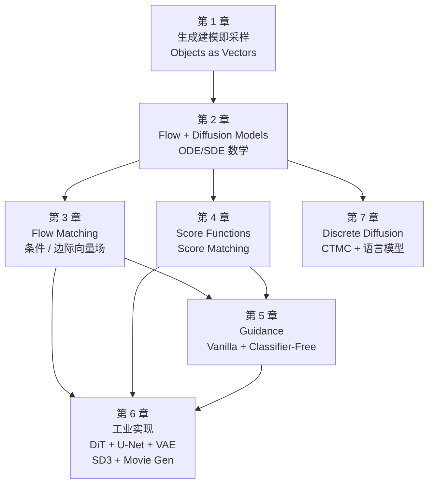

## 学习目标

读完本文,你应当能够:

- 说清 MIT 2026 新课 6.S184 的核心论点:flow matching 和 denoising diffusion 属于同一个 ODE/SDE 家族。
- 区分 flow matching、score matching、guidance 三个机制各自解决什么问题、彼此如何衔接。
- 用一次 text-to-image 的完整任务流(从 prompt 到像素)走通 DiT + VAE + classifier-free guidance 的工业级实现。
- 判断 discrete diffusion 在连续扩散之外解决的是什么问题,以及 CTMC 为什么是它在离散空间的"自然对应物"。
- 决定要不要按这门课的系统读下去,以及在你的工作里应该先学哪一章。

阅读建议:第一遍先读「核心判断」和「系统地图」两节,建立全局视角;之后按 1→7 章的顺序挑你最关心的章节读;文末「采用顺序」一节可以反向决定从哪里开始。

### 读者背景假设

本文假设读者已熟悉神经网络基础(MLP、CNN、Transformer)、基本概率论(密度、条件分布、期望),并对 Stable Diffusion、Midjourney 这类图像生成模型有使用经验。文章会从这些基础出发,但不会解释 Transformer 的注意力机制或变分推断的细节。

如果你刚开始接触生成模型,建议先读一篇入门综述(例如 Lilian Weng 的《From Autoencoder to Beta-VAE to Autoencoders》或 Lilian Weng 的《What are Diffusion Models?》),对"为什么 diffusion 不是 GAN 的替代品"形成直觉后再回来。

---

## 目录

- [核心判断](#核心判断)
- [系统地图:8 章结构的依赖关系](#系统地图-8-章结构的依赖关系)
- [三种生成模型的边界](#三种生成模型的边界)
- [Flow Matching:把训练目标拆干净](#flow-matching把训练目标拆干净)
- [Score Matching:flow matching 的对偶视角](#score-matchingflow-matching-的对偶视角)
- [Guidance:让结果符合 prompt](#guidance让结果符合-prompt)
- [任务流案例:一次 text-to-image 完整路径](#任务流案例一次-text-to-image-完整路径)
- [工业实现:DiT、U-Net、VAE 的选择](#工业实现ditu-netvae-的选择)
- [离散 Diffusion:CTMC 与语言模型](#离散-diffusionctmc-与语言模型)
- [Benchmark:MIT 新课隐含的对比基准](#benchmarkmit-新课隐含的对比基准)
- [采用顺序:谁应该读这门课,按什么顺序读](#采用顺序谁应该读这门课按什么顺序读)
- [结尾判断](#结尾判断)
- [自检清单](#自检清单)
- [进阶路径](#进阶路径)
- [常见问题](#常见问题)

---

## 核心判断

MIT 2026 年新开了一门 6.S184 课程,名字叫《Generative AI With Stochastic Differential Equations》,由 Peter Holderrieth 和 Ezra Erives 主讲。课程 84 页讲义的核心论点只有一句话:

> **Flow matching 和 denoising diffusion 不是两种算法,而是同一个 ODE/SDE 家族的两种表达。**

讲义在第 1 章就抛出了这个判断([PDF p.3][1]):

> "All of these generative models generate objects by iteratively converting noise into data. This evolution from noise to data is facilitated by the simulation of ordinary or stochastic differential equations (ODEs/SDEs). Flow matching and denoising diffusion models are a family of techniques that allow us to construct, train, and simulate, such ODEs/SDEs at large scale with deep neural networks."

如果只读这一段,你会以为这门课是关于 ODE/SDE 数学的--这种理解不准确。这门课真正要解决的问题是:**当你打开 Stable Diffusion 3 的代码仓库时,里面同时出现了 flow matching、score matching、classifier-free guidance、DiT、VAE、CTMC 这些看起来完全不相关的概念,它们之间的依赖关系是什么?**

工业界目前的普遍做法是「按模型分块学」:先看 Stable Diffusion 1 的代码,再看 SDXL、SD3、Flux、Movie Gen。每一代都比上一代多几块新东西,学到第 4 代就忘了第 1 代为什么这样设计。

MIT 这门课换了一种组织方式:先把 flow matching 和 score matching 还原成同一个数学对象(向量场)的两种学习目标,再用 ODE/SDE 的语言把它们统一起来。所有具体模型(SD3、Movie Gen、AlphaFold 3)都被看作是这个统一框架下的不同实例化。

[1]: https://diffusion.csail.mit.edu/2026/docs/lecture_notes.pdf

---

## 系统地图:8 章结构的依赖关系

讲义分为 7 个主体章节 + 5 个附录。章节之间不是平行结构,而是层层依赖。下面这张图给出依赖关系,箭头表示"先读"指向"后读"。



这张图里有三条主线,初读者最容易把它们混成一条故事线:

| 主线 | 解决什么问题 | 关键章节 |
|------|-------------|---------|
| **采样数学** | 如何把噪声变成数据(ODE/SDE 演化) | 2 → 3 → 4 |
| **学习目标** | 如何训练神经网络预测"下一步往哪走" | 3(向量场)+ 4(得分) |
| **条件控制** | 如何让生成结果符合 prompt | 5(guidance) |

主线 1 和主线 2 在第 2 章会合流,第 3、4 章分别从不同角度切入会合点。这两条主线在数学上等价,只是参数化方式不同(一个用向量场 u,一个用得分 ∇log p)。第 5 章是工程问题--你不想随机采样,你想让结果符合 prompt。第 6 章把这三章内容包装成工业级模型。第 7 章是连续扩散在离散空间的扩展。

附录 A 是概率论速成,B-E 分别是 Fokker-Planck 证明、CTMC 存在唯一性、VAE 额外视角、文献指南。如果第 2 章的数学让你卡壳,先翻附录 A 而不是跳到第 3 章。

---

## 三种生成模型的边界

讲义第 1 章反复强调一个区分--很多文章把 flow model、diffusion model、score-based model 当成三类算法。这是错的。它们是同一类对象的三种参数化。

| 参数化方式 | 训练目标 | 采样方式 | 代表模型 |
|-----------|---------|---------|---------|
| **Flow model** | 学习向量场 u_θ(x, t) | 解 ODE:dx/dt = u_θ(x, t) | Rectified Flow(SD3) |
| **Diffusion model** | 加噪 → 学会去噪 | 解反向 SDE 或概率流 ODE | DDPM、Score SDE |
| **Score-based model** | 学习得分函数 ∇_x log p_t(x) | 朗之万动力学 + SDE | NCSN、SDE-based |

这张表容易让人误以为 flow model 和 diffusion model 是"用同样的采样方式但不同训练目标"。事实是反过来的:**它们的训练目标数学等价,区别在于采样时的数值积分方式**。Flow model 在 ODE 上积分(确定性、可逆、易控制步长),diffusion model 在 SDE 上积分(随机性、收敛性更稳、但需要额外校正项)。

讲义在第 4 章明确写了这两个视角的等价关系:

> "There exists a fundamental equivalence between score-based models and flow models. The vector field of a flow model can be obtained from the score function and vice versa."

读到这里你应该意识到:当你看到一篇论文写"we use flow matching"或"we use score-based diffusion"时,它们大概率在做同一件事,只是用了不同的积分器和不同的损失函数。如果你只想学一种,先学 **flow matching**--它的训练目标更直接,采样数学更干净,而且工业界目前主流(Stable Diffusion 3、Nano Banana、Movie Gen)都基于 flow matching。

---

## Flow Matching:把训练目标拆干净

讲义第 3 章是 flow matching 的核心。它的训练目标可以写成一行:

```python
loss = ||u_theta(x_t, t) - u_target(x_t, t)||^2
```

其中 `x_t` 是 t 时刻的状态,`u_target` 是已知的"目标向量场"(来自条件概率路径),`u_theta` 是神经网络。这个公式简单到让人怀疑它为什么有效--但有效性的来源不在公式本身,而在 `u_target` 的选择。

flow matching 的设计技巧:直接把"目标向量场"定义为条件向量场的期望:

```
u_target(x_t, t) = E[u_target(x_t, t | x_1) | x_t]
```

其中 `x_1` 是数据点。这个期望在数学上等于**边际向量场**--也就是把整个数据集的样本都当成条件,然后求平均。直觉上:你训练神经网络去预测"在 t 时刻 x 应该往哪个方向走",而正确答案是所有可能终点方向上的期望。

讲义给出了一个具体的概率路径选择:最简单的条件概率路径是条件高斯路径:

```
p_t(x | x_1) = N(x; alpha_t * x_1, sigma_t^2 * I)
```

其中 `alpha_t` 从 0 增加到 1(典型选择 `alpha_t = t`),`sigma_t` 从 1 减少到 0(典型选择 `sigma_t = 1 - t`)。t=0 时是纯噪声,t=1 时是数据。

对应的条件向量场是:

```
u_t(x | x_1) = d/dt alpha_t * x_1 - d/dt sigma_t / sigma_t * (x - alpha_t * x_1)
```

神经网络的训练目标就是拟合这个向量的期望。讲义把这个推导做了完整证明(包括第 2 章的 Fokker-Planck 方程和第 3 章的边际向量场等价性),但**核心思想其实就两行**:条件概率路径定义 → 条件向量场定义 → 取期望得到边际向量场 → 神经网络去拟合这个边际向量场。

这就是 flow matching 的全部数学。剩下的工程问题(如何选 alpha_t、如何加 classifier-free guidance、如何把 x 当成高维图像)都在第 5、6 章。

---

## Score Matching:flow matching 的对偶视角

讲义第 4 章给了另一个视角--不学向量场,学得分函数 ∇_x log p_t(x)。直觉上:得分函数指向密度增长最快的方向。如果你站在数据分布的山坡上,得分函数告诉你哪个方向更"像数据"。

score matching 的训练目标是 Fisher 散度:

```
loss = E[||s_theta(x_t, t) - nabla_x log p_t(x_t)||^2]
```

这个目标看起来需要知道真实密度 p_t(不可知)。讲义给出了一个巧妙的恒等式:

> "The score matching objective can be rewritten without explicitly knowing p_t, by using integration by parts (or denoising score matching)."

具体公式(讲义 [PDF p.31][1]):

```
loss = E[||s_theta(x_t, t) - nabla_x log p_t(x_t | x_1)||^2] + const
```

这叫 **denoising score matching**--把得分函数的学习目标改成"预测从 x_t 中恢复出的 x_1",等价于预测加到 x_t 上的噪声。结果是:训练 score model 和训练 denoiser 是同一件事。

flow matching 和 score matching 的等价关系:

```
u_theta(x, t) = f_t(x) - g_t^2 / 2 * s_theta(x, t)
```

其中 `f_t` 是漂移系数(确定项),`g_t` 是扩散系数(随机项),`s_theta` 是得分函数。这个公式的含义是:flow 的"下一步往哪走"= 漂移项 - 扩散项 × 得分。当 g_t = 0 时退化为纯 flow model,当 f_t = 0 时退化为纯 score-based diffusion。

这条等价关系解释了为什么 Stable Diffusion 3 可以从 score-based diffusion 改写成 flow matching 而几乎不损失质量--它们在数学上是同一个对象的不同参数化。

---

## Guidance:让结果符合 prompt

第 5 章是工程问题。你训好了一个无条件生成模型 p(x),但你想生成符合 prompt y 的样本 p(x|y)。

讲义给出了 classifier guidance 的标准公式:

```
nabla_x log p(x|y) = nabla_x log p(x) + nabla_x log p(y|x)
```

意思是:条件得分 = 无条件得分 + 分类器对输入的梯度。如果你有一个训练好的图像分类器 ∇p(y|x),就可以用它把无条件生成"引导"到符合 y 的方向。

这个方法在 2022 年之前的 diffusion 模型里很常见。但它有两个问题:

1. 需要训练一个独立的分类器(增加成本)
2. 分类器只对 x 有意义,对 x 的中间状态(带噪声的)几乎没意义

Ho & Salimans 在 2022 年提出了 **classifier-free guidance**([PDF p.35][1])--直接训练一个 conditional model p(x|y),然后用:

```
predicted_score = (1 + w) * score(x|y) - w * score(x)
```

其中 w 是 guidance scale。直觉上:条件得分 - 无条件得分 = prompt 想让你往哪走,乘以 w 强化这个方向。w 越大,结果越符合 prompt,但多样性也越差(这就是为什么高 CFG scale 的图会"过饱和")。

讲义用两页推导这个公式的几何含义,然后给出 SD3、Movie Gen 的实际 CFG scale 选择--大多数模型在训练时用 w=3 或 w=4,推理时给用户 1-15 的可选范围。

---

## 任务流案例:一次 text-to-image 完整路径

用一次"输入 prompt 'a corgi wearing a beret',输出一张 1024×1024 图片"的任务,把第 1-6 章的所有机制串起来。

**第 1 步:Prompt 嵌入**

输入文本经过 CLIP(或 T5)文本编码器,得到一个序列嵌入 `y ∈ R^{S × k}`,其中 S 是 token 数,k 是嵌入维度。CLIP 是在图文对上训练出来的,所以同一个嵌入空间既能理解文字也能理解图像。

**第 2 步:噪声初始化**

从标准高斯分布采样 `x_0 ∈ R^{4×128×128}`。注意这里不是 1024×1024 的 RGB 图像--这是 VAE 编码后的潜空间表征,4 通道、128×128 分辨率。后面会解释为什么这样做。

**第 3 步:DiT 迭代去噪**

DiT(Diffusion Transformer)是一个 L 层 Transformer,每层包含多头自注意力和前馈网络。输入是当前带噪声的 x_t(t 从 1 演化到 0),加上时间嵌入(用傅里叶特征把 t 编码成向量)和 prompt 嵌入 y。输出是预测的"下一步往哪走"--在 flow matching 框架下是向量场 u_θ,在 score matching 框架下是得分 ∇log p。

每一步都用 guidance scale w 调整方向:

```
output = (1 + w) * conditional_output - w * unconditional_output
```

通常跑 20-50 步 ODE 积分(用 Euler 或 Heun 求解器)。每一步的成本是 1 次 DiT forward pass。

**第 4 步:VAE 解码**

去噪完成后得到 `x_0 ∈ R^{4×128×128}`,这是潜空间表征。把它送进 VAE 的解码器,得到 `R^{3×1024×1024}` 的 RGB 图像。

**为什么在潜空间做去噪,而不是直接在像素空间?**

因为像素空间太贵。一张 1024×1024 RGB 图像是 3M 维向量,DiT 在这个维度上自注意力的复杂度是 O(N2) ≈ 1013,硬件跑不动。VAE 把图像压缩到 4×128×128 = 65K 维(压缩比 ~46×),DiT 的注意力成本降低 ~2000×。这就是 Stable Diffusion(注意不是 Stable Diffusion 1 之前的 DDPM)的核心工程贡献。

**第 5 步:输出**

把 RGB 张量转成 PNG,完成。整个流程耗时 2-10 秒(取决于步数和硬件),显存占用 8-24GB。

---

## 工业实现:DiT、U-Net、VAE 的选择

第 6 章用三个子章节讲工业级架构。下面这张对照表是讲义没明确写、但隐含的:

| 架构 | 输入维度 | 注意力机制 | 代表模型 | 优势 | 劣势 |
|------|---------|-----------|---------|------|------|
| **U-Net** | 像素空间或潜空间 | 2D 空间卷积 + 跳跃连接 | Stable Diffusion 1/2, DDPM | 归纳偏置强,小数据集友好 | 难扩展到超大规模 |
| **DiT (Diffusion Transformer)** | 潜空间 | 全局自注意力 | SD3, Movie Gen, FLUX 2.0 | 易于扩展到 10B+ 参数 | 需要更多数据 |
| **VAE** | 像素 ↔ 潜空间 | 卷积编码/解码 | SD 全系列 | 大幅降低计算量 | 重建损失(小细节丢失) |

Stable Diffusion 3 同时使用了 DiT 和 VAE:DiT 在潜空间做去噪,VAE 负责像素 ↔ 潜空间转换。Movie Gen 视频生成在 SD3 基础上把 2D 注意力扩展为 3D 时空注意力。

讲义给了两个 case study([PDF p.52][1]),分别是 SD3 和 Movie Gen,但讲义的篇幅不长,重点是架构选择背后的 tradeoff:

- **SD3 选 DiT 而非 U-Net**:因为 DiT 易于扩展到 8B 参数。
- **Movie Gen 选 3D DiT 而非 2D + 时间卷积**:因为 3D 注意力建模时空联合分布更稳定。
- **两个都用 VAE**:因为潜空间是 SD 家族的核心设计哲学。

如果你正在做工业级 diffusion 模型部署,第 6 章的 case study 比 SD3、Movie Gen 原始论文更值得读--讲义把每个架构选择的 tradeoff 都列了出来。

---

## 离散 Diffusion:CTMC 与语言模型

第 7 章是讲义最有前瞻性的一章:连续 diffusion 用 ODE/SDE,离散 diffusion 用什么?

答案是 **CTMC(Continuous-Time Markov Chain,连续时间马尔可夫链)**。

SDE 是连续状态空间的随机过程;CTMC 是离散状态空间的随机过程。它们的数学结构高度平行:

| 连续(ODE/SDE) | 离散(CTMC) |
|----------------|-------------|
| 向量场 u_θ(x, t) | 速率矩阵 Q_t(y\|x) |
| 福克-普朗克方程 | 主方程(master equation) |
| 朗之万动力学 | 状态跳转采样 |
| Score matching | 速率矩阵学习 |

讲义定义了连续时间马尔可夫链的状态空间 S = V^d(V 是词表,d 是序列长度),转移概率 p_{t+h|t}(y|x),以及速率矩阵 Q_t(y|x)。条件(1)出向速率为正,(2)停留在 x 的速率为所有出向速率的相反数。

训练目标变成:

```
loss = E[Q_t(y|x) - Q_theta(y|x) | x, y]^2
```

直觉上:神经网络的速率矩阵要尽量接近真实的速率矩阵。推理时,从随机 token 出发,按速率矩阵跳到下一个 token,直到收敛。

这个方法在 2024-2025 年开始出现工业级突破--LLaDA、Diffusion Language Model、SEDD 等模型在语言建模任务上接近或超过同等规模的自回归 LLM。讲义把这条线放进第 7 章,说明 MIT 认为这是未来 5 年生成式 AI 的重要方向之一。

把连续 diffusion 和离散 diffusion 并列看:它们不是两条独立的线,而是同一族数学对象在不同状态空间上的实例化。理解 flow matching 的边际向量场后,CTMC 的速率矩阵几乎可以"读懂"--它就是离散版的边际向量场。

---

## Benchmark:MIT 新课隐含的对比基准

讲义没有专门的 benchmark 章节,但第 6、7 章的 case study 隐含了一些对比。这里按 benchmark 解读的三问(测什么 / 反映什么 / 不能推出什么)拆开来谈。

**测的是什么**

- **图像生成质量**:用 FID(Fréchet Inception Distance)和 CLIP score 衡量。FID 越低越好,CLIP score 越高越好。
- **视频生成质量**:用 FVD(Fréchet Video Distance)和人工评估。
- **语言建模**:用 perplexity 和下游任务(QA、推理)准确率。

**反映什么**

- FID/CLIP 主要反映"模型生成的图像与真实图像分布的距离"--但它们对细节(如手指、文本渲染)不敏感。
- FVD 主要反映视频片段的统计相似度--但对长时一致性(人物持续性、物理合理性)几乎无感。
- 离散 diffusion 在 perplexity 上接近自回归 LLM,但在 few-shot 任务上仍落后。

**不能推出什么**

- 高 FID 分数不能说明模型"理解物理"--它可能只是记住了训练集的分布。
- 视频模型的高 FVD 不能说明它能生成"长时一致"的视频--它可能只能生成几秒。
- 离散 diffusion 在小 benchmark 上的胜利不能推出它能替代 GPT-4 级别的 LLM。

讲义没有回避这些 caveat--它在第 6 章末提到 "the exact choice of model and architecture heavily depends on the data modality and the scale at which you operate"([PDF p.52][1])。

---

## 采用顺序:谁应该读这门课,按什么顺序读

如果你正在做生成式 AI 相关的研究或工程,这门课适合以下几类读者:

**第一类:你已经会 Stable Diffusion 的推理,想理解训练原理**

按顺序读:第 1 章(基础)→ 第 3 章(flow matching)→ 第 4 章(score matching)→ 第 5 章(guidance)。跳过第 2 章的 ODE/SDE 数学,除非你想读原始论文。

**第二类:你正在训练 diffusion 模型,但 loss 曲线一直不收敛**

重点读:第 3 章(条件/边际向量场的关系)→ 第 4 章(denoising score matching)→ 第 6 章(DiT 配置)。90% 的训练问题出在这三章。

**第三类:你想做视频/3D/蛋白质结构生成**

按顺序读:第 1 章 → 第 6 章(架构)→ 第 6.3 节(SD3 + Movie Gen 案例)→ 第 7 章(如果你的数据是离散的)。

**第四类:你对离散 diffusion 作为 LLM 替代品感兴趣**

按顺序读:第 1 章 → 第 2 章(SDE 数学)→ 第 4 章(score matching 思想)→ 第 7 章(CTMC)。

**第五类:你只是好奇,不用真的学**

只看第 1 章的"Generative Modeling as Sampling"和这个总结就行。MIT 把课程视频也放到 [diffusion.csail.mit.edu][2],可以先看视频再决定要不要读讲义。

[2]: https://diffusion.csail.mit.edu/

**不要做的事**:不要从第 2 章开始读。讲义的数学密度从第 2 章开始陡升,如果你没有 ODE 基础(特别是对 Fokker-Planck 方程不熟),前 30 页就会劝退。先读第 1 章建立直觉,再用第 2 章补数学。

---

## 结尾判断

MIT 6.S184 这门课最值得读的不是具体算法,而是它把"看起来不一样"的概念还原成"同一个数学对象的不同参数化"这种讲法:

- Flow matching、score matching、guidance 是同一个向量场学习问题的三个切面。
- 连续 diffusion、离散 diffusion 是 ODE/SDE 数学在连续/离散状态空间的两种实例化。
- U-Net、DiT、VAE 是同一个潜空间设计哲学在不同规模/模态下的工程选择。

读完之后你会意识到:未来 5 年生成式 AI 的主战场,大概率不是"再发明一种新算法",而是"在统一框架下选择最合适的参数化"。AlphaFold 3 把蛋白质结构生成做成 diffusion、SD3 把图像生成做成 flow matching、Movie Gen 把视频生成做成 3D DiT--它们是同一个故事的不同章节。

如果你正在选下一个研究方向，这条主线值得考虑：不是"再训一个更大的模型"，而是"在统一框架下找出当前还没有被实例化的状态空间"——比如音频、3D mesh、机器人轨迹。这些空间都还没被认真用 diffusion 处理过。

---

## 适用边界与常见失败模式

MIT 6.S184 这门课讲的是 state-of-the-art 工业路径，但“统一框架”不是万能药。下面这些场景是 flow matching / diffusion 当前还搞不好的：

**1. 离散序列生成仍以自回归 LLM 为主**

离散 diffusion（第 7 章的 CTMC）在 perplexity 上接近自回归 LLM，但在 few-shot 推理、长上下文、多轮对话上仍落后。原因不是数学上做不到，而是推理时的状态跳转路径难以优化。2026 年的 GPT/Claude 系列仍然使用自回归 + RLHF，离散 diffusion 目前主要用于非交互式生成。

**2. 实时生成仍是难题**

flow matching 采样需 20-50 步 ODE 积分，每步一次 DiT forward pass。即使在 A100 上，SOTA 模型生成一张 1024×1024 图需 2-10 秒。实时视频（30 FPS）当前还做不到，只能预生成后回放。

**3. 可控生成的边界**

classifier-free guidance 在全局语义上效果好（“猫”还是“狗”），但在细粒度控制上仍然不准（“三只耳朵”还是“两只耳朵”）。需要在 inference-time 做 latent optimization 或额外训练条件。

**4. 训练数据质量要求极高**

flow matching 的边际向量场期望是“数据集中所有样本”的期望——数据偏差会直接进入模型。SD3 使用 LAION 的 5B 图文对，Movie Gen 使用 100M+ 视频。在数据集小或偏的场景下（如医学影像），需要额外设计条件路径。

**5. 小模型 + 小数据集 = 不推荐**

讲义推荐的路径都是“10B+ 参数 + 10M+ 样本”。如果你只有 1B 参数或 100K 样本，GAN 或 VAE 可能仍是更实用的选择。

如果你的场景不命中以上边界，diffusion 是首选。命中任何一个，需要额外评估。

## 自检清单

阅读本文后,你可以用以下问题自检:

- [ ] 能否用一句话说清 flow matching 和 denoising diffusion 的关系?
- [ ] 能否写出 flow matching 的损失函数和它的"目标向量场"含义?
- [ ] 能否解释 classifier-free guidance 为什么能用 `score(x|y) - score(x)` 加权?
- [ ] 能否走通一次 text-to-image 的完整流程(CLIP → 噪声 → DiT → VAE)?
- [ ] 能否解释为什么 diffusion 在潜空间做,而不是像素空间?
- [ ] 能否区分连续 diffusion 和离散 diffusion 的核心数学对象(向量场 vs 速率矩阵)?
- [ ] 能否说清 MIT 新课给的 5 类读者各自的最佳读法?

## 进阶路径

如果你读完想继续深入:

- **数学层**:把第 2 章和附录 B 的 Fokker-Planck 证明手推一遍,配 [Lipman et al. 2023][3] 的 flow matching 原论文。
- **工程层**:跟讲义配套的 [labs][2],从零实现一个 MNIST diffusion 模型,然后做 CIFAR-10、ImageNet。
- **前沿层**:读 [LLaDA][4](离散 diffusion 语言模型)和 [AlphaFold 3][5] 论文,看统一框架在生物领域的实例化。
- **替代课程**:Stanford CS236(生成模型,更理论)、UC Berkeley CS294(深度生成模型,更工程)。

## 动手任务

读完本文后,建议选一个任务动手跱一遍:

**任务 A(1 小时,只读代码)**:打开 [Hugging Face diffusers][6] 仓库,跳到 `src/diffusers/pipelines/stable_diffusion_3/pipeline_stable_diffusion_3.py`。只看 `__call__` 方法的 forward 逻辑,逐行对账本文"任务流案例"那一节的 5 步。你会看到一些与本文不一致的细节(比如他们用 rectified flow 不是 flow matching)——记录下来,这是你需要进一步学习的点。

**任务 B(3 小时,跑起来)**:用 `diffusers` 的 `StableDiffusion3Pipeline.from_pretrained("stabilityai/stable-diffusion-3-medium")` 加载 SD3-medium,生成一张 512×512 的"a corgi wearing a beret"。看 default CFG scale、num_inference_steps、guidance_rescale。改 CFG=1, 7.5, 15, 各生成 4 张,看变化。

**任务 C(1 周,从零写)**:从零实现一个 MNIST flow matching 模型。讲义配套的 [lab 1][2] 给出了完整骨架。完成后尝试改 alpha_t 从线性变为 cosine——你会发现 loss 曲线和生成质量都有变化。

[6]: https://github.com/huggingface/diffusers/tree/main/src/diffusers/pipelines/stable_diffusion_3

[3]: https://arxiv.org/abs/2210.02747
[4]: https://arxiv.org/abs/2503.09607
[5]: https://www.nature.com/articles/s41586-024-07487-w

## 常见问题

**Q: 我只有 PyTorch 基础,能读这门课吗?**

可以。第 1 章不需要数学,第 3 章只需要懂高斯分布,第 6 章需要懂 Transformer。数学最重的第 2、4 章可以先跳过。

**Q: flow matching 和 DDPM 哪个更好?**

数学上等价。工程上 flow matching 在 SD3 上表现更好(更稳定的训练、更少的采样步数),DDPM 在小数据集上更稳定。如果你是从零开始,建议直接学 flow matching。

**Q: 离散 diffusion 能替代 GPT 吗?**

2026 年还不能。离散 diffusion 在 perplexity 上接近自回归 LLM,但在 few-shot、in-context learning、长上下文上仍落后。但它在并行生成(一次出整段文本)上有结构性优势--这是自回归 LLM 做不到的。

**Q: 我应该先看视频还是先读讲义?**

如果你只有 2 小时:看视频。讲义的信息密度更高,但视频讲解能把数学直觉建立起来。如果你能投入 10+ 小时:先读讲义第 1 章建立框架,再看视频补充数学直觉。

## 文档元信息

- 写作时间:2026-06-21
- 写作依据:MIT 6.S184 2026 讲义 v1([PDF][1])