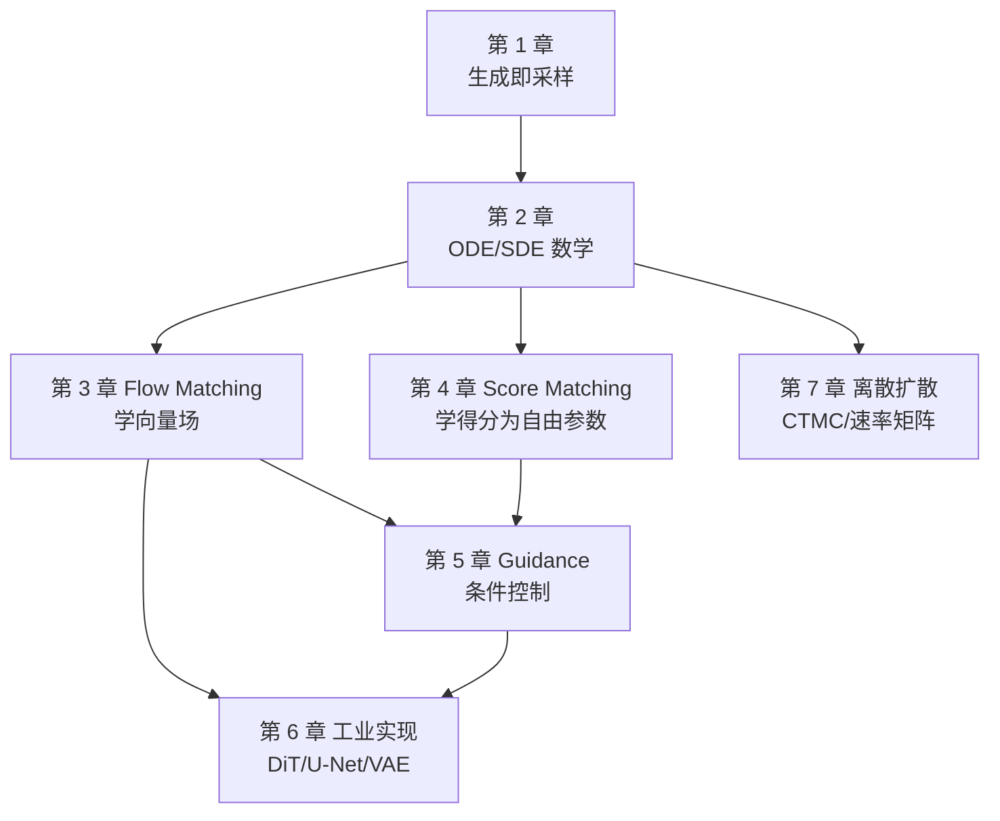

## 这篇精读解决什么问题

打开 Stable Diffusion 3 的代码仓库，你会同时撞见 flow matching、score matching、classifier-free guidance、MM-DiT、VAE、rectified flow 这些来历各异的名词。它们的依赖关系是什么，谁是谁的特例，换掉其中一个会不会推翻另外几个——多数文章按模型分块回答，读者学完第四代模型就忘了第一代为什么那样设计。

MIT 6.S184 的 2026 版讲义换了一种组织方式：先给一条从噪声到数据的概率路径，再说明同一件事至少有三种写法（向量场、得分、去噪器），最后把采样器写成带一个自由参数的方程。这份精读按讲义的实际章节走一遍，标出每一步能落到第几页、哪个公式编号，以及哪些流传很广的说法是讲义并没有说的。

读完应当能回答这几个问题：flow matching 与 diffusion 的等价关系具体写在哪个式子里；引导强度为什么会在不同论文里对不上号；Stable Diffusion 3 与 Movie Gen 在架构上各自的取舍是什么；以及把这套框架搬到离散的词元（token）上时，哪块数学必须整个换掉。

## 目录

- [这篇精读解决什么问题](#这篇精读解决什么问题)
- [核心判断：统一在哪里](#核心判断统一在哪里)
- [课程与讲义的基本事实](#课程与讲义的基本事实)
- [系统地图：七个 Section、六场讲座、三个 Lab](#系统地图七个-section六场讲座三个-lab)
- [Flow Matching：训练目标为什么能写成一行](#flow-matching训练目标为什么能写成一行)
- [Score Matching：同一个网络的第二种读法](#score-matching同一个网络的第二种读法)
- [一条路径两副面孔：SDE 扩展术](#一条路径两副面孔sde-扩展术)
- [Guidance：把提示词写进向量场](#guidance把提示词写进向量场)
- [任务流案例：一次出图在 SD3 里怎么走完](#任务流案例一次出图在-sd3-里怎么走完)
- [潜空间为什么是必需的](#潜空间为什么是必需的)
- [工业实现：MM-DiT 与 Movie Gen 的时空自编码器](#工业实现mm-dit-与-movie-gen-的时空自编码器)
- [Benchmark 怎么读：附录 D 里那个真实权衡](#benchmark-怎么读附录-d-里那个真实权衡)
- [离散扩散：没有 SDE 的地方用什么](#离散扩散没有-sde-的地方用什么)
- [采用顺序与适用边界](#采用顺序与适用边界)
- [自测、报错与动手任务](#自测报错与动手任务)
  - [五道自测题](#五道自测题)
  - [动手时会遇到的几类报错](#动手时会遇到的几类报错)
  - [三档动手任务](#三档动手任务)
- [常见问题](#常见问题)
- [下一步读什么](#下一步读什么)
- [参考资料](#参考资料)

## 核心判断：统一在哪里

讲义第 3 页开场就给了论点，这段是原文：

> "All of these generative models generate objects by iteratively converting noise into data. This evolution from noise to data is facilitated by the simulation of ordinary or stochastic differential equations (ODEs/SDEs). Flow matching and denoising diffusion models are a family of techniques that allow us to construct, train, and simulate, such ODEs/SDEs at large scale with deep neural networks."

值得抠字眼的是最后一句里的 a family：它说的是同一个家族的两种技术，不是两套竞争方案。讲义把这个判断落在一个具体结果上，也就是第 27 页的 Theorem 17（SDE Extension Trick）：

```text
X_0 ~ p_init,  dX_t = [ u_t(X_t) + (σ_t²/2) ∇log p_t(X_t) ] dt + σ_t dW_t
             ⇒ X_t ~ p_t 对所有 0 ≤ t ≤ 1 成立
```

`u_t` 是 flow matching 学出来的那个向量场，`p_t` 是训练时定义好的那条概率路径，`σ_t` 是随机项强度。这个式子说了两件事。第一，把 `σ_t` 设为 0，它就是 flow 的 ODE 采样器；`σ_t > 0`，它变成一条带噪声注入的 SDE 采样器，而边际分布 `p_t` 一个字都没改。第二，`σ_t` 可以在网络训练完之后才决定，讲义原文用的是 "the above result is striking in that we can choose any diffusion coefficient σ_t ≥ 0 even after having trained the networks"。

所以「flow 还是 diffusion」这个问题的正确粒度是采样器，而不是模型类别：同一个网络、同一条路径，配 ODE 还是配 SDE 是数值实现的选择。

代价也写在同一段：理论上任意 `σ_t` 都行，实际上有训练误差（网络没学准 `u_t` 和 `∇log p_t`）和离散化误差（`σ_t` 太大会逼你把步长压到不可用），因此对一个训好的模型存在一个经验最优的 `σ_t`，需要试出来。

## 课程与讲义的基本事实

课程全称 MIT Course 6.S184: Generative AI with Stochastic Differential Equations，2026 年独立活动期（IAP，一月的短学期）开课。讲义标题是《Introduction to Flow Matching and Diffusion Models》，84 页，作者 Peter Holderrieth 与 Ezra Erives，课程页同时给出 arXiv:2506.02070 作为引用编号，代码与素材按 CC BY-NC-SA 授权。

| 项目 | 2026 版 |
|------|---------|
| 讲课 | Peter Holderrieth（博士生） |
| Lab 编写 | Ron Shprints（MEng 学生）、Ezra Erives（D. E. Shaw Research） |
| 讲座场次 | 6 场（编号 1、2、3-A、3-B、4、5） |
| Lab | 3 个，.ipynb 格式，可在 Colab 打开，附答案 |
| 先修要求 | 线性代数、多元微积分、基础概率论；会用 Python，有少量 PyTorch 经验 |
| 结课产出 | 从零搭出一个 latent diffusion 模型（潜空间扩散模型） |
| 赞助与指导 | Tommi Jaakkola 提供指导与资助 |

它不是新开的课。同一个站点留有 2025 版，那一年的课程编号写作 6.S184/6.S975，也是 IAP，也是 3 个 Lab，但讲座内容不同：第 5、6 场分别是 Toyota Research 的 Benjamin Burchfiel 讲生成式机器人、MIT 的 Jason Yim 讲蛋白质设计，结课产出是「一个玩具图像扩散模型」。

| 变化点 | 2025 版 | 2026 版 |
|--------|---------|---------|
| 第 5、6 场 | 机器人、蛋白质两场客座讲座 | 合并改写为离散扩散与大语言模型一章 |
| 得分匹配与引导 | 得分匹配与 flow matching 同在第 3 场，引导与网络架构同在第 4 场 | 拆成 3-A（得分函数与得分匹配）与 3-B（无分类器引导） |
| 结课产出 | 玩具图像扩散模型 | 潜空间扩散模型 |

这个对比有用，因为它说明离散扩散这一章不是顺带提一句的方向展望，而是替换掉了两整场客座讲座的位置。

## 系统地图：七个 Section、六场讲座、三个 Lab

讲义正文按 Section 1 到 7 连续编排，第 8 节是参考文献，附录 A 到 E 补充数学与文献脉络。先把原目录按打印页抄在这里，回查公式时用它定位：

```text
1 Introduction                                        3
  1.1 Overview   1.2 Course Structure
  1.3 Generative Modeling As Sampling
2 Flow and Diffusion Models                           7
  2.1 Flow Models   2.2 Diffusion Models
3 Flow Matching                                      14
  3.1 Conditional and Marginal Probability Path
  3.2 Conditional and Marginal Vector Fields
  3.3 Learning the Marginal Vector Field
4 Score Functions and Score Matching                 25
  4.1 Conditional and Marginal Score Functions
  4.2 Sampling with SDEs   4.3 Score Matching
5 Guidance: How To Condition on a Prompt             34
  5.1 Vanilla Guidance   5.2 Classifier-Free Guidance
6 Building Large-Scale Image or Video Generators     41
  6.1 Neural Network Architectures
  6.2 Working in Latent Space: (Variational) Autoencoders
  6.3 Case Study: Stable Diffusion 3 and Meta Movie Gen
7 Discrete Diffusion Models: Building Language Models with Diffusion  54
  7.1 Continuous-Time Markov chain (CTMC) models
  7.2 Training CTMC models
8 References                                         66
A A Reminder on Probability Theory                   70
B A Proof of the Fokker-Planck equation              72
C Existence and Uniqueness of Continuous-time Markov chains  74
D Additional Perspectives on VAEs                    77
E A Guide to the Diffusion Model Literature          81
```

讲座编号与讲义章节不是逐项对齐的，下表按章重排。

| 讲义章节 | 页码 | 对应讲座 | 承担什么 |
|---------|------|---------|---------|
| 第 1 章 生成建模即采样 | 3 | 1 | 把「生成一张图」改写成从分布采样 |
| 第 2 章 流与扩散模型 | 7 | 1 | 常微分与随机微分方程的数值求解，流与向量场 |
| 第 3 章 Flow Matching | 14 | 2 | 条件／边际概率路径、条件／边际向量场、训练目标 |
| 第 4 章 得分函数与得分匹配 | 25 | 3-A | 得分函数、随机微分方程采样、去噪得分匹配 |
| 第 5 章 如何条件化到一个提示词 | 34 | 3-B | 条件注入、分类器引导、无分类器引导 |
| 第 6 章 搭建大规模图像与视频生成器 | 41 | 4 | 条件嵌入、DiT 与 U-Net、自编码器与潜空间、两个案例 |
| 第 7 章 离散扩散（官方标为可选） | 54 | 5 | 连续时间马尔可夫链、速率矩阵、离散扩散训练 |
| 附录 A 概率论回顾 | 70 | 无 | 随机向量、条件密度与条件期望 |
| 附录 B Fokker-Planck 方程证明 | 72 | 穿插在第 4 章 | 把正文省略的证明补全 |
| 附录 C 马尔可夫链解的存在唯一性 | 74 | 无 | 第 7 章的数学后路 |
| 附录 D 关于自编码器的额外视角 | 77 | 无 | 重建与生成的度量冲突 |
| 附录 E 扩散模型文献导航 | 81 | 无 | 前向过程与概率路径两条脉络 |

三条主线容易讲成一条：


```mermaid
graph TD
  A["第 1 章<br/>生成即采样"] --> B["第 2 章<br/>ODE/SDE 数学"]
  B --> C["第 3 章 Flow Matching<br/>学向量场"]
  B --> D["第 4 章 Score Matching<br/>学得分为自由参数"]
  C --> E["第 5 章 Guidance<br/>条件控制"]
  D --> E
  C --> F["第 6 章 工业实现<br/>DiT/U-Net/VAE"]
  E --> F
  B --> G["第 7 章 离散扩散<br/>CTMC/速率矩阵"]
```

第一条是**采样数学**（第 2 章到第 4 章），管「噪声如何一步步变成数据」。第二条是**学习目标**（第 3 章与第 4 章），管「网络到底被要求拟合什么量」。第三条是**条件控制**（第 5 章），管「为什么结果得听提示词的」——提示词（prompt）的嵌入在这里才第一次进入公式。第 6 章把前三条包装成能跑的模型，第 7 章换掉状态空间重演一遍。

## Flow Matching：训练目标为什么能写成一行

第 3 章把生成过程写成一条插值路径。取两个端点条件 `p_0 = p_init`（通常是标准高斯）、`p_1 = p_data`，最常用的是高斯条件概率路径：

```text
p_t(x|z) = N(x; α_t z, β_t² I),   α_t: 0 → 1,   β_t: 1 → 0
```

`z` 是一个真实样本。取直线调度 `α_t = t`、`β_t = 1 − t`，则 `t = 0` 是纯噪声、`t = 1` 是数据。一处记号要提前说明：讲义在这里把路径的标准差写作 `σ_t`，第 6.3 节也沿用这个写法，而本文「核心判断」一节那条采样方程里 `σ_t` 指的是随机项强度，两者不是同一个量；为避免混淆，下文统一把路径标准差记作 `β_t`。给定这条路径，能把它「推过去」的向量场由讲义式 (20) 给出：

```text
u_t(x|z) = (α̇_t − (β̇_t/β_t) α_t) z + (β̇_t/β_t) x
        =  α̇_t z + (β̇_t/β_t) (x − α_t z)
```

把直线调度代回去，`α̇_t = 1`、`β̇_t = −1`，上式塌缩成 `u_t(x|z) = (z − x)/(1 − t)`：在时刻 `t`，指向终点 `z` 的速度就是「剩下的路程除以剩下的时间」。rectified flow 的直线插值就是这个特例。

但 `u_t(x|z)` 只服务一个已知终点：用它积分到底，所有轨迹都收在 `X_1 = z` 上，等于把训练数据重播一遍。讲义在 3.2 节开头先承认这个「看起来没用」，再给出出路——Theorem 9（边际化技巧）：把条件向量场按数据点的后验加权平均，得到的边际向量场 `u_t(x)` 其 ODE 恰好走完整条边际概率路径（式 (18)、(19)），于是 `X_1 ~ p_data`。训练目标就是对它做均方回归（式 (24)）：

```text
u_t(x) = ∫ u_t(x|z) · p_t(x|z) p_data(z) / p_t(x) dz   式 (18)
L_FM(θ)  = E[ ‖ u_t^θ(x) − u_t(x) ‖² ]                 式 (24)
L_CFM(θ) = E[ ‖ u_t^θ(x) − u_t(x|z) ‖² ]               式 (26)
```

第一行的信息量全在期望上：先随机取一个时刻，再随机取一个数据点，按路径给它加噪得到 `x`，然后要求网络预测「所有可能终点的平均方向」。麻烦在于式 (18) 那个积分不可算，`L_FM` 因此也没法直接优化。第 20 页的 Theorem 12 换了一条路：`L_FM` 与 `L_CFM` 只差一个与 `θ` 无关的常数，梯度相同，所以拟合可算的条件版本 `u_t(x|z)` 就等于拟合不可算的边际版本，最优点上网络输出恰为 `u_t(x)`。

把这条等价链走完，训练循环就剩三行（讲义 Algorithm 3，第 22 页）。取直线调度时 `x = t·z + (1 − t)·ϵ`，把它代进前面化简出的 `u_t(x|z) = (z − x)/(1 − t)`，分子里的 `(1 − t)` 正好约掉，训练目标变成

```text
L(θ) = ‖ u_t^θ(x) − (z − ϵ) ‖²
```

也就是说，网络被要求回归的量就是「数据减噪声」，一个采样时已经知道答案的向量。这就是 flow matching 的全部数学。剩下的是工程选择：调度怎么选、条件怎么进网络、`x` 是不是图像的高维张量，分别在第 5 章和第 6 章。

## Score Matching：同一个网络的第二种读法

第 4 章换成问「往哪个方向走密度上升最快」，也就是得分函数 `∇log p_t(x)`。两个损失并排写在第 31 页：

```text
L_SM(θ)  = E[ ‖ s_t^θ(x) − ∇log p_t(x) ‖² ]      边际, 不可算
L_CSM(θ) = E[ ‖ s_t^θ(x) − ∇log p_t(x|z) ‖² ]    条件, 可算
```

对高斯路径，条件得分有闭式 `∇log p_t(x|z) = (α_t z − x)/β_t²`，代进去后网络学到的东西换了个名字：讲义第 32 页指出，此时 `s_t^θ` 本质上在预测当初加进去的那个噪声 `ϵ`，这就是 denoising score matching 名字的由来，也正是 DDPM 里 `-β_t s_t(x) = ϵ_t(x)` 那个重参数化。

同一页还记了一笔工程史：上面这个加权形式在 `β_t` 接近 0 时数值不稳定，早期工作（DDPM）于是把损失里的常数因子 `1/β_t²` 丢掉，直接以噪声预测器为网络输出。今天大量实现沿用这个简化权重，读论文时值得留意——它和严格等价的条件 score matching 已经不是同一个目标函数了。

至于两种读法的关系，讲义在第 26 页用 Proposition 1 给得很实在。对高斯概率路径，向量场与得分之间是仿射换算：

```text
u_t(x|z) = a_t ∇log p_t(x|z) + b_t x,   边际情形同形
```

紧接着的 Remark 16 补了一句限定：这个换算之所以成立，是因为对高斯路径而言向量场和得分对 `x` 与 `z` 都是线性的；一旦边缘化，关系就只是线性重参数化，不再有更结构化的含义。换句话说，「学向量场等于学得分」是有条件的结论，不能推广到任意概率路径。

第 27 页还留了一个容易被跳过的直觉：去噪器 `D_t(x)` 的含义是「给定带噪的 `x`，最干净的 `z` 是哪个」，也就是条件期望 `E[z|x]`，而学 `D_t` 与学 `u_t` 理论上等价。顺带一提，讲义在此处提了一个思考题——去噪器的输出总是「干净」的数据点吗？答案取决于数据分布本身有多集中。

## 一条路径两副面孔：SDE 扩展术

把前两章缝起来的是 Fokker-Planck 方程（第 29 页 Theorem 19）：给定路径 `p_t` 与随机强度 `σ_t`，什么样的漂移项能让过程的边际始终是 `p_t`。Theorem 17 是它的正向用法，前文已经写出。这里想强调的是它反过来解释了两件常被当成矛盾的事。

第一件：为什么 DDPM 用随机采样、Stable Diffusion 3 用确定性积分，两边都说自己学到了数据分布。因为二者共享 `p_t`，区别只在 `σ_t` 取 0 还是取正数，以及由此决定的步长与方差。

第二件：为什么讲义坚持用「概率路径」而不说「前向过程」。附录 E 第 83 页给了理由：扩散模型文献里的前向过程实际上从没被真的模拟过，训练时只是从 `p_t(·|z)` 抽样；而且它只在 `t → ∞` 时才收敛到高斯，有限时间内永远差一点。用概率路径这套语言，两个问题都消失。同一段还交代了前向过程为什么总是仿射形式 `u_t^forw(x) = a_t x`——只有这样才能写出 `X_t|X_0 = z` 的闭式分布，否则训练时就得真的去模拟整条前向 SDE。

附录 E 另外补了一条脉络：早期扩散模型（Anderson 1982 那条线）不是靠 Fokker-Planck 造训练目标，而是对前向过程做时间反演（time-reversal），要求反演的过程在轨迹分布上与原过程一致。两条路线得到同一族采样方程。这解释了为什么读老论文时符号体系与这份讲义格格不入，但公式能一一翻译过来。

## Guidance：把提示词写进向量场

条件生成的起点是贝叶斯拆分：

```text
∇log p_t(x|y) = ∇log p_t(x) + ∇log p_t(y|x)
```

第二项是「带噪的 `x` 有多符合条件 `y`」的梯度。classifier guidance（Dhariwal 与 Nichol，2021 年）训一个能识别噪声图像类别的分类器，再把这一项放大：

```text
ũ_t(x|y) = u_t(x) + w · a_t · ∇log p_t(y|x)          式 (62), w > 1
```

讲义在这里插了一句限定，很多人引用时漏掉：`w ≠ 1` 时 `ũ_t(x|y)` 已经不是真正的引导后向量场，这一步是启发式。

classifier-free guidance 的动机是把那个额外分类器省掉。第 37 页列出两个理由：一是多训一个网络；二是当 `y` 是高维文本嵌入而不只是类别标签时，`p_t(y|x)` 本身就很难学。做法是把式 (62) 里的 `∇log p_t(y|x)` 换成 `∇log p_t(x|y) − ∇log p_t(x)`，式 (62) 里的 `a_t` 就是 Proposition 1（式 (41)）中那个换算系数。再用「同一个网络以空条件 `∅` 代替 `y`」的技巧，最终落到式 (65)：

```text
ũ_t(x|y) = (1 − w) u_t(x|∅) + w · u_t(x|y),   w > 1
```

注意这里的 `w > 1` 约定，与 Ho 和 Salimans 原论文里 `(1 + w)·cond − w·uncond`（`w ≥ 0`）差一个常数平移：`w_讲义 = w_Ho + 1`。落到工具链上，diffusers 的 SD3 pipeline 用的正是讲义这套写法，源码里合成一步是

```python
noise_pred = noise_pred_uncond + self.guidance_scale * (noise_pred_text - noise_pred_uncond)
```

也就是说 `guidance_scale = 7.0` 与式 (65) 的 `w = 7` 是同一个数，`guidance_scale > 1` 才启用引导；而同一份强度写成 Ho–Salimans 的记号要减 1。读论文里的 CFG 数值时先确认它挂在哪套约定上，否则会差 1。

至于强度该取多少，第 39 页的 MNIST 实验给了三个可对照的值：`w = 1.0`（不引导）、`2.0`、`4.0`，图像逐次更贴合标签、多样性相应收缩。第 6.3 节的 SD3 案例（第 52 页）则记录了官方配方：classifier-free guidance 权重区间 2.0 到 5.0。

## 任务流案例：一次出图在 SD3 里怎么走完

把前面几条主线串起来，看一次 1024×1024 的出图请求在 SD3 这条技术路线上经过哪些环节。环节名称取自讲义第 41 页起的三部分结构。

**第一步，条件嵌入。** 文本进三个不同的冻结编码器：CLIP 提供整句的粗粒度语义，T5-XXL 编码器输出逐 token 的序列嵌入，两者互补。讲义第 42 页把动机讲得很直白——有时不希望把整个提示词压成单个向量；第 52 页的 SD3 案例补了原因：逐 token 嵌入保留了「让模型注意到条件文本里特定成分」的可能。时间 `t` 则用 Fourier 特征嵌入（式 (68)），归一化到单位长度。

**第二步，初始化潜变量。** 采一个高斯噪声张量 `X_0 ~ p_init`。注意此刻它是纯噪声，而按讲义的约定 `t = 0` 对应噪声、`t = 1` 对应数据。

**第三步，积分向量场。** 从 `t = 0` 走到 `t = 1`，`σ_t = 0`，也就是 Euler 法求解 ODE（第 9 页 Algorithm 1），每步做一次向量场评估；SD3 案例记录的实际配置是 50 步（第 52 页）。每步用的向量场按上一节的式 (65) 合成：一次有条件前向、一次空条件前向，两个结果加权——所以每步实际跑两次网络，显存成本主要在这里。

**第四步，解码。** 用自编码器的均值解码器把 `X_1` 映回像素空间。讲义第 51 页在这里有个细节：推理时取 `q_φ(z|x)` 的均值而不是抽样，「以避免噪声引起的伪影」。

**第五步，交还像素。** 张量转图像文件。

第五步之前还有个问题值得单独回答：为什么整个去噪过程在潜空间做。

## 潜空间为什么是必需的

讲义第 47 页给的例子是每边下采样 16 倍：`3×1024×1024` 的输入得到 `3×64×64` 的潜表示，约 315 万个坐标压到约 1.2 万个，即 1/256。生成器要把这些坐标排成序列再做两两注意力，序列长度缩到 1/256，成对交互的次数就按平方掉到约 1/65000（实际网络还会再分块，比例另算，但量级由这一步决定）。这是能不能跑得动的差别，不是快慢的差别。

第二个理由常被忽略，写在第 51 页：自编码器得先于扩散模型训练。整条流水线实际是两个模型串起来，前者的质量决定后者的天花板——6.2 节末尾那句「性能现在同样取决于自编码器把图像压进潜空间、再还原出观感不错的图像的能力」说的就是这件事。附录 D 把这种依赖量化成一个可测的冲突，下一节谈。

## 工业实现：MM-DiT 与 Movie Gen 的时空自编码器

第 6.3 节用两个模型收尾。它们的公开配置可以直接当作「这套框架落到工业规模时长什么样」的样本。

| 项目 | Stable Diffusion 3 | Meta Movie Gen Video |
|------|--------------------|---------------------|
| 训练目标 | 条件 flow matching（讲义 Algorithm 4） | 条件 flow matching，同样取直线调度（讲义写作 `α_t = t`、`σ_t = 1 − t`） |
| 最大模型参数 | 80 亿 | 300 亿 |
| 表示空间 | 预训练自编码器的潜空间 | 预训练自编码器的潜空间，外加时间维度 |
| 网络 | 多模态扩散 Transformer 架构（MM-DiT） | 类 DiT 骨干，时间与空间一起分块 |
| 条件 | 三类文本嵌入（含 CLIP 与 T5-XXL 编码器输出） | 图像 patch 间自注意力 + 与语言模型嵌入的交叉注意力 |
| 采样 | 50 步 Euler，CFG 权重 2.0–5.0 | 讲义未给采样超参 |

SD3 那一栏还有一句值得抄下来：论文作者对比过若干 flow 与 diffusion 的替代方案，结论是 flow matching 表现最好。这句话的分层很重要——它是同一份论文的实验结论，不是「flow 天生优于 diffusion」的推论。前文 Theorem 17 与 Proposition 1 已经说明两者可以指向同一个 `p_t`，能被比较的只有有限步数、有限网络容量下的实际表现，以及路径与调度怎么挑。

Movie Gen 的关键增量是把自编码器从 2D 换成 temporal autoencoder（TAE）：`x' ∈ R^{T'×3×H×W}` 映到 `x ∈ R^{T×C×H×W}`，时间、高、宽三个方向各下采样 8 倍；长视频再靠 temporal tiling 切片编码、拼接潜变量。讲义顺势给出一条现实约束——自编码器对视频比对图像更要紧，「这就是现在多数视频生成模型能生成的长度都很有限」。

## Benchmark 怎么读：附录 D 里那个真实权衡

讲义没有 benchmark 章节，全文没有出现基准表格，也没有报过任何 FID 数值。它提供的是一个更基本的东西：附录 D 第 81 页把潜空间模型的评测拆成两个互相对着干的指标。

同一对自编码器可以有两种「生成」：一种从真实图像出发，编码再解码（重建采样器），另一种从潜空间生成模型采样再解码（生成采样器）。分别对真实分布算 Fréchet Inception Distance，得到 rFID 与 gFID。矛盾在于：rFID 低说明潜空间几乎没丢信息，`q_φ(z)` 长得像数据分布本身，于是让潜空间模型去学它就更难，gFID 反而高；rFID 高意味着丢弃得多，潜分布好学，gFID 低。附录 D 用信息论里的 rate–distortion 前沿来组织这个取舍，并指出问题在于「信息损失该由自编码器还是由潜空间生成模型承担」。

按讲义给出的三问来读：

- 测的是什么。rFID 与 gFID 测的都是「某个分布与 `p_data` 在 Inception 特征上的距离」，但两者的输入分布不同，一个是重建链路，一个是生成链路。
- 数字变化更可能反映哪一部分。gFID 变好可能来自自编码器换了一个更容易学的潜空间，与扩散网络本身的能力无关；只看 gFID 排名挑模型，挑到的可能是「丢信息丢得巧」。
- 不能推出什么。FID 是单一标量，不涉及文字渲染、手指、结构合理性，也不区分「像真实分布」与「记住真实分布」；rFID 与 gFID 都推不出模型是否理解物理，也推不出跨模态（视频、蛋白质）的可迁移性。

讲义之外的事实请按讲义之外的来源核对：图像领域常配的 CLIP score、视频领域的 FVD、语言建模的困惑度，都不是这份材料讨论过的对象。

## 离散扩散：没有 SDE 的地方用什么

第 7 章（讲座表里标着可选）处理文本、DNA 这类离散数据。开篇先划掉一个幻觉：

> "it is important to keep in mind that there is no mathematical diffusion process (SDEs don't exist in discrete state spaces)."

替换方案是连续时间马尔可夫链（CTMC）。状态空间取 `S = V^d`，`V` 是词表、`d` 是序列长度。方向感没了，取而代之的是跳转速率矩阵 `Q_t(y|x)`，由两条约束定义（式 (85)(86)）：异状态间速率非负，对角元等于所有出向速率之和取负。它的演化方程是 Kolmogorov 前向方程（第 61 页 Proposition 2），地位对应连续情形的 Fokker-Planck。

噪声怎么加？第 7 章用的是 factorized mixture path：每个位置独立地以概率 `1 − κ_t` 被破坏掉，`κ_0 = 0`、`κ_1 = 1`。讲义特意标出它与高斯路径的一处不同：高斯路径在搬概率质量，有方向可谈；混合路径不搬运，只是把一个分布淡出、另一个淡入。所以「往哪个方向走」在离散空间没有对应物，能问的只有「跳到哪个状态」。

最有意思的结论是第 64 页的 Theorem 38：边际速率矩阵被证明是一个逐位置后验的重新参数化——

```text
Q_t(v_{i,j}|x) = (κ̇_t/(1 − κ_t)) · ( p(z_j = v_i | x) − 1[x_j = v_i] )
```

括号里那一项就是「给定当前被破坏的序列 `x`，第 `j` 个位置的原始 token 是 `v_i` 的概率」。于是网络输出形状是 `d × V`，每个位置接一个 softmax，损失就是逐位置交叉熵，也就是第 64 页的 Discrete Flow Matching 目标：

```text
L_DFM(θ) = E[ Σ_j −log p^θ(z_j | x) ]
```

讲义自己的评语是 "This is remarkable: To train a generative model, all we need to do is to train a classifier model per position j." 这一句同时解释了为什么扩散语言模型可以直接沿用自回归模型的整套训练设施，也解释了差别在哪：监督信号来自「看被破坏的 `x` 猜原始 `z`」，而不是「看前缀猜下一个 token」。

采样端也换了：条件速率矩阵只允许跳到终点 `z` 的取值（Example 37 的三分类讨论），因此生成过程是按速率矩阵逐位置把被破坏的 token 换成终值，而不是沿某个方向移动。

这条线上的工作，讲义的参考文献落在 LLaDA 2.0（arXiv:2512.15745）：用一个三阶段的块级训练方案，把预训练的自回归模型改写成总参数达千亿的扩散语言模型。它的初代 LLaDA（arXiv:2502.09992）走的是另一条路，按预训练加监督微调的范式从零训练，论文的说法是与作者自建的同规模自回归基线表现相当。「接近」的口径由论文作者给定，读的时候记得核对基线是不是同一个配方。

## 采用顺序与适用边界

按你要解决的问题挑章节，比从头顺读省时间。

| 你的处境 | 建议顺序 | 可以先跳过 |
|---------|---------|-----------|
| 会调 SD 推理，想懂训练 | 1 → 3 → 4 → 5 | 第 2 章的数值分析细节 |
| 自己在训，损失不降 | 3 → 4（重点看第 32 页的 `1/β_t²` 权重问题）→ 6.1 | 第 7 章 |
| 想搞清「flow 还是 diffusion」 | 3 → 4 → 6.3，再回到 Theorem 17 | 附录 B |
| 做视频、3D、蛋白质 | 1 → 6 全章（含附录 D）→ 3 | 第 5 章细节 |
| 关心扩散语言模型 | 1 → 2 → 4 → 7 | 第 6.1 节 U-Net 部分 |
| 只想判断要不要系统学 | 第 1 章 + 本文前两节 + 讲座录像 | 全部公式 |

官方先修要求只有线性代数、多元微积分、基础概率论加一点 PyTorch 经验，比多数人预期的低；真正劝退的地方在第 2 章的数值部分和第 4 章的 Fokker-Planck，卡住就回去翻附录 A 和附录 B，别硬啃。

以下是这套框架目前不提供保证的地方，都对应到讲义里的具体限定：

1. **`σ_t` 没有理论最优值。** 只有训练误差与离散化误差共同决定的经验甜点（第 28 页），换数据集要重找。
2. **CFG 是启发式。** `w ≠ 1` 时用到的向量场已经不是真实引导场（第 37 页），提升贴合度与牺牲多样性是同一件事的两面。
3. **潜空间的收益与代价同时到。** 压缩越好、潜分布越难学（附录 D 的 rFID／gFID 矛盾），选自编码器不是选「分辨率越低越好」。
4. **视频长度受记忆限制。** 讲义把这一点归因于自编码器压缩不足（第 53 页），而不是算法缺陷。
5. **离散情形丢掉了方向。** 混合路径不搬运概率质量，连续空间里那些依赖「运输」直觉的技巧（路径重排、直线化的 cost 意义）不能直接搬过去。
6. **第 7 章被官方标为可选。** 它是这份讲义的扩展方向，不是主干前置。

## 自测、报错与动手任务

### 五道自测题

答不出就回到对应章节，别急着往下读：

1. Theorem 17 里哪个量可以被认为「训练之后才决定」？它对边际分布的影响是什么？
2. 写出高斯概率路径的 `u_t(x|z)`，再代 `α_t = t`、`β_t = 1 − t` 化简，说明结果的几何含义。
3. 为什么学 `s_t^θ`（得分）与学 `ϵ_t^θ`（噪声）是一回事？DDPM 对严格等价形式做了什么改动，代价是什么？
4. 式 (65) 与 Ho–Salimans 的 `(1+w)·cond − w·uncond` 怎么换算？讲义的 `w = 1` 与 Ho–Salimans 的 `w = 0` 分别意味着什么？
5. 离散扩散的 `L_DFM` 为什么是交叉熵而不是平方误差？网络输出形状是什么？

### 动手时会遇到的几类报错

跟 Lab 与 diffusers 时容易卡住的几类问题，按下表从报错现象直接排查：

| 现象 | 原因 | 处理 |
|------|------|------|
| `from_pretrained` 报仓库不存在或需要登录 | SD3 在 Hugging Face 上是受限模型，且 diffusers 格式的版本号另有后缀 | 用 `stabilityai/stable-diffusion-3-medium-diffusers` 并按页面提示接受许可 |
| 想传 `guidance_rescale` 却报未知参数 | 该参数属于 SD/SDXL 那条线的 pipeline，SD3 pipeline 没有它 | 去掉，改调 `guidance_scale` 与 `mu` |
| 生成结果与步数设置不符 | 类签名里的默认值与 docstring（文档字符串）里写死的数字可能不同步 | 以 `inspect.signature` 打出来的实际默认值为准 |
| 看不懂调度器为什么叫 rectified | `StableDiffusion3Pipeline` 用的是 `FlowMatchEulerDiscreteScheduler`：flow matching 配 Euler 步；rectified flow 指的是同一条直线路径在文献里的另一个名字 | 对照本文「Flow Matching」一节末尾那个化简结果读调度器源码 |

Lab 的分工也要认清，别按顺序猜：Lab 1 是 Working with ODEs and SDEs（纯数值练习，还没有网络），Lab 2 是 Flow Matching and Score Matching（两种学习目标在此对齐），Lab 3 是 Diffusion Transformer and VAEs（第 6 章的内容，也包含本文「Guidance」一节那组 CFG 演示）。课程页对三个 Lab 都提供了 Colab 链接与答案。

### 三档动手任务

**任务 A（约一小时，读代码）。** 打开 `src/diffusers/pipelines/stable_diffusion_3/pipeline_stable_diffusion_3.py`，只看 `__call__`：定位潜变量初始化、逐步去噪循环、引导合成、VAE 解码四个位置，与本文「任务流案例」一节逐条对账。顺手把 `__call__` 的默认参数打印出来，和你手上的 diffusers 版本一起记下来，这一步是后面所有对照的基准。

**任务 B（约三小时，跑起来）。** 加载 SD3-medium 权重，生成 1024×1024 的一张图，把 `guidance_scale` 分别设为 1.0、2.0、4.0、7.0，各出 4 张，观察贴合度与饱和度的变化方向是否与第 39 页那三张 MNIST 图一致。想看清潜张量的形状，`pipe.vae.config` 与 `pipe.transformer.config.in_channels` 各打一次，比猜通道数可靠。

**任务 C（约一周，从零写）。** 按 Lab 2 与 Lab 3 走完全程，结课时你手上应该有一个自己写出来的潜空间扩散模型。做完后再试一处改动：把直线调度换成 cos 型调度，看训练损失与生成质量怎么变——这是把「Flow Matching」一节那段公式变成体感的最快路径。

## 常见问题

**只有 PyTorch 基础，能读这门课吗。** 官方先修里还有多元微积分和基础概率论。第 1、3 章不需要太多，第 2 章开始要能读常微分方程的数值解，第 4 章要能接受「密度演化方程」这个视角。卡住就查附录 A、B。

**flow matching 和 DDPM 哪个更好。** 在边际分布这个层面，二者由同一个 `p_t` 决定，不存在谁更准（Theorem 17）。可比的是有限步数下的实际表现，SD3 的论文做了这组对照并选择了 flow matching。小数据、小网络场景下这份讲义没有给出结论。

**离散扩散能替代大语言模型吗。** 大语言模型（LLM）这个说法要分开看：讲义只负责给出 CTMC 与逐位置交叉熵这套训练框架，能不能替代自回归不是这份材料回答的。可以核对的是两篇论文的自述——LLaDA 从零训练并在自建基线上比较，LLaDA 2.0 从自回归模型改写而来。至于基于人类反馈的强化学习（RLHF）在扩散语言模型上怎么接，讲义与这两篇都没有替下结论。

**先看视频还是先读讲义。** 只有两小时：看录像，数学直觉起得快。愿意投入十小时以上：先读第 1 章建框架，再进第 2、3 章，录像当补充。三个 Lab 是按讲次配套的，课程页的说法是边听边做；真正需要整块时间的是 Lab 3，它要求前 6 章的目标函数都已经写稳。

## 下一步读什么

**数学层。** 附录 B 的 Fokker-Planck 证明适合手推一遍，配 Theorem 19 看。想补随机微分方程的严格性，讲义在第 2 章明确推荐了 Mao 的教材；参考文献里另列了一本 Coddington–Levinson 的常微分方程教材。

**原始论文。** 按这份讲义的引用编号回读更省事：Lipman 等的 flow matching 原论文（arXiv:2210.02747）、rectified flow（arXiv:2209.03003）、DiT（arXiv:2212.09748）、Score SDE（arXiv:2011.13456）、CFG（arXiv:2207.12598）、SD3（arXiv:2403.03206）、Movie Gen（arXiv:2410.13720）。第 8 章的参考文献表本身就是分类好的阅读地图。

**附录 E。** 一份写给扩散模型的文献导航，按「前向过程／时间反演」与「概率路径／Fokker-Planck」两条线组织，适合在读完整本讲义后再翻，用来决定接下来查哪一类工作。

## 参考资料

- 课程主页（含录像、讲义、Lab 与答案）：<https://diffusion.csail.mit.edu/>
- 2026 版讲义 PDF（84 页）：<https://diffusion.csail.mit.edu/2026/docs/lecture_notes.pdf>
- 讲义 arXiv 版本：arXiv:2506.02070
- Stable Diffusion 3 pipeline 源码：<https://github.com/huggingface/diffusers/blob/main/src/diffusers/pipelines/stable_diffusion_3/pipeline_stable_diffusion_3.py>
- Flow Matching Guide and Code（arXiv:2412.06264），与第 3 章对照阅读的扩展版本

写作依据为上述 2026 版讲义全文与课程页，课程结构与 Lab 信息同时核对了 2025 版页面；公式编号、页码、参数数量、采样步数均取自讲义正文。文中提到的 diffusers 参数默认值随版本变化，以你实际安装的版本为准。
