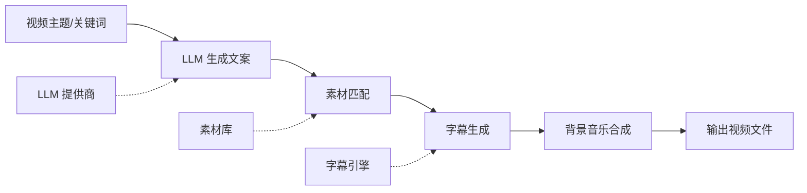

## 学习目标

- MoneyPrinterTurbo 的生成管线分几个阶段，每个阶段做什么决定
- 不同部署方式（一键包 / Docker / 手动）各自适合什么场景
- LLM 提供商怎么选，国内用户为什么优先考虑 DeepSeek 或 Moonshot
- 这套工具适合什么视频类型，不适合什么类型

---

## MoneyPrinterTurbo 解决了一个很具体的问题

把一段文案变成视频，拆开来看不算难：写稿、找素材、加字幕、配乐、合成。但手工走完这条流水线很耗时——哪怕每个环节只是几分钟，加起来也够喝一壶。MoneyPrinterTurbo 做的事情就是把这条流水线连起来：你给一个主题，它负责从文案到成品视频的全部环节。

它是一个**从主题到视频的自动化流水线**，而非视频编辑工具。它能做什么、不能做什么，都取决于这条流水线的设计边界，而不是 AI 的聪明程度。

项目地址：[harry0703/MoneyPrinterTurbo](https://github.com/harry0703/MoneyPrinterTurbo)，GitHub ⭐ 70.2k。

---

## 系统总览：一条流水线，三个外部依赖

整个工具的核心是一条线性流水线，但它依赖三类外部服务来决定最终视频的质量和风格：



流水线本身是固定的，但每一环背后挂的外部服务可以替换。这意味着：

- **文案质量取决于 LLM**：换一个更强的模型，文案会更好；模型不支持中文或输出不稳定，整个视频就会崩。
- **画面丰富度取决于素材库**：项目自带一批无版权素材，也可以挂本地素材；但素材匹配逻辑是关键词检索，不是语义理解，所以匹配不上的时候会出现“画面和文案各说各的”。
- **字幕质量取决于引擎选择**：Edge TTS 模式速度快但偶尔有识别偏差，Whisper 模式更准但要额外算力。

如果你把 MoneyPrinterTurbo 当成一个“导演”，它其实更像一个剪辑助理——它没有审美判断，只按流水线执行。

---

## 核心模块拆解

项目代码按 MVC 分了三层，但更有用的是按职责看：

| 模块 | 路径 | 职责 | 可替换 |
|------|------|------|--------|
| Web 界面 | `webui/` | Streamlit 面板，填主题、选参数、点生成 | 也可以用 API 绕过去 |
| 业务编排 | `app/` | 串联流水线：调 LLM → 匹配素材 → 合成字幕 → 渲染视频 | 不改代码的话这一层不动 |
| 资源配置 | `resource/`、`config.example.toml` | 背景音乐文件、字幕字体、API Key、素材路径 | 部署时必须改 `config.toml` |

关键文件只有两个：`config.example.toml` 决定外部服务怎么连，`app/` 决定流水线怎么跑。改配置不用碰代码；改行为才需要进去看。

### LLM 提供商怎么选

支持的主流模型列表比较长，但决策归结成两个问题：

1. **能不能在国内直接访问** — DeepSeek、Moonshot 可以直接用，OpenAI、Gemini 需要代理。
2. **中文文案质量够不够** — DeepSeek、Moonshot 的中文生成效果在实际使用中口碑靠前，注册就送额度，启动成本很低。

其他选项（通义千问、文心一言、MiniMax、Ollama 本地部署等）都可用，但需要自己对照 `config.example.toml` 填对应的 `api_base` 和 `api_key`。核心逻辑只有一行：流水线不关心你用的是哪个模型，只要接口兼容 OpenAI chat/completions 格式就行。

### 视频素材从哪来

素材匹配走的是关键词检索：从 LLM 生成的文案中提取关键词，在素材库中搜索文件名或标签。所以：

- 素材库越丰富，画面变化越大。
- 关键词提取越准，匹配率越高——但 LLM 有时候会把抽象概念词提取出来，而素材库只有具象画面，这种情况会落空。
- 项目提供无版权素材包，但数量有限。大量生产时建议自己攒素材库。

### 字幕引擎：Edge 和 Whisper 的区别

两个引擎在同一个位置发挥作用（音频转时间轴文本），但区别不小：

| 特性 | Edge TTS | Whisper |
|------|----------|---------|
| 速度 | 快，在线调用 | 慢，需要本地计算 |
| 准确率 | 日常够用 | 更高，尤其嘈杂场景 |
| 依赖 | 网络 | GPU/CPU 算力 |
| 适合 | 快速试跑 | 正式发布 |

选 Edge 主要是快，选 Whisper 主要是准。如果你的 TTS 语音本身咬字清晰、背景音乐音量低，Edge 的准确率已经够用。

---

## 一次完整的生成过程

假设你输入主题“三分钟讲清楚什么是 HTTP/3”，整个流水线是这样走的：

1. **文案生成**：系统把主题包装成 prompt 发给配置的 LLM。LLM 返回一段带有时间戳分段标记的文案，每个段落对应未来视频的一个片段。
2. **素材匹配**：系统从文案中提取关键词（“HTTP/3”“QUIC”“UDP”等），在素材库中搜索匹配的视频片段。搜到的素材按文案时间轴排列；搜不到的片段会用默认占位画面。
3. **语音合成**：将文案文本送入 TTS 引擎，生成整段旁白音频，同时记录每个时间戳分段的起止时间。
4. **字幕叠加**：根据时间轴信息，在对应画面位置叠加字幕文本。字幕的字体、大小、颜色、位置可以在 `config.toml` 中调整，也可以直接改 `webui/` 里的默认参数。
5. **背景音乐混音**：将旁白音频与背景音乐（从 `resource/` 目录选取）混音，音乐音量默认低于人声。
6. **渲染输出**：FFmpeg 将画面序列、字幕轨道、音频轨道合成一个 MP4 文件，分辨率按你选的竖屏（1080×1920）或横屏（1920×1080）输出。

这里面最容易出问题的环节是第 2 步——素材匹配失败时视频会显得“画面空洞”，但工具不会告诉你哪些片段没匹配上。如果你对画面质量有要求，批量生成前先跑几个主题，手动看一下匹配效果。

### 支持的视频尺寸

| 类型 | 分辨率 | 适用平台 |
|------|--------|----------|
| 竖屏 | 1080×1920 | 抖音、快手、视频号 |
| 横屏 | 1920×1080 | YouTube、B 站 |

尺寸切换是纯渲染参数，不影响流水线的任何其他环节。

---

## 部署方式

### Windows 一键启动包（v1.2.6）

最省事的方式。下载解压后先跑 `update.bat` 拉最新代码，再跑 `start.bat`。弊端是只能在 Windows 上用，而且出问题时排查的空间很小——你基本只能重装。

### Docker 部署

```bash
git clone https://github.com/harry0703/MoneyPrinterTurbo.git
cd MoneyPrinterTurbo
docker-compose up
```

启动后 Web 界面在 `http://127.0.0.1:8501`，API 文档在 `http://127.0.0.1:8080/docs`。

Docker 部署的好处是环境隔离干净，坏处是如果你要挂本地素材库或改字体，需要额外挂载卷。另外 Whisper 字幕模式在 Docker 里跑会比较吃资源。

### 手动部署（macOS / Linux）

```bash
git clone https://github.com/harry0703/MoneyPrinterTurbo.git
cd MoneyPrinterTurbo
uv python install 3.11
uv sync --frozen
# 安装 ImageMagick（字幕渲染依赖）
brew install imagemagick  # macOS
# 启动 WebUI
uv run streamlit run ./webui/Main.py --browser.gatherUsageStats=False
```

手动部署给了最大的控制权：换模型、挂本地素材、调参数都很直接。代价是你需要自己搞定 Python 环境和依赖。Python 版本卡在 3.11 是因为部分依赖还没适配更高版本——如果装 3.12+ 可能会踩坑。

三种方式没有绝对的好坏：只是想体验走一键包，要稳定可复现走 Docker，要深度定制走手动部署。

---

## 常见问题

**Q: 生成一个视频大概要多久？**

取决于文案长度和素材匹配量。简单主题（30 秒左右）大约 1-2 分钟；长文案（3 分钟以上）可能要 5-10 分钟。主要耗时在素材搜索和 FFmpeg 渲染，反而 LLM 调用很快。

**Q: 为什么视频画面和文案对不上？**

素材匹配是关键词检索，不是语义匹配。如果你用的是抽象主题（比如“什么叫幸福”），关键词提取结果大概率跟素材库里的标签不沾边。尝试把主题改成更具体的场景描述，匹配率会好很多。

**Q: 字幕有错别字怎么办？**

优先切换到 Whisper 引擎。如果仍然有错，可以在 `config.toml` 里调整 TTS 语速——过快的语速会降低识别准确率。极端情况下可以关闭自动字幕，自己用剪映等工具手动加。

**Q: Docker 部署后访问不了界面？**

检查 `docker-compose.yml` 里的端口映射。默认是 `8501:8501`（WebUI）和 `8080:8080`（API）。如果宿主机端口被占用，改映射即可。

**Q: 能不能用自己的素材？**

可以。在 `config.toml` 里把素材路径指向你的本地目录。素材文件名或目录名建议用中文关键词命名——匹配逻辑就是简单的字符串搜索，文件名越接近可能的提取关键词，命中率越高。

---

## 自测

以下问题用于检查你对 MoneyPrinterTurbo 的理解程度：

1. 如果 LLM 生成的文案质量很差，你应该优先排查哪个环节？是整个工具的问题还是模型选择的问题？
2. 竖屏切换到横屏，除了分辨率变化外，还有哪些环节会受影响？
3. 素材匹配失败的根因通常有哪两类？分别怎么处理？
4. 在什么情况下，你宁可用 Edge TTS 也不用 Whisper？
5. Docker 部署和手动部署在“挂载本地素材库”这个操作上有什么区别？

（答案见文末）

---

## 采用建议

按场景给优先级：

| 场景 | 建议 | 理由 |
|------|------|------|
| 想快速体验 AI 视频生成 | ✅ 直接上，一键包或 Docker 都可以 | 5 分钟跑出第一个视频 |
| 批量生成同主题短视频（科普/营销/知识类） | ✅ 很适合，调好一个模板后批量跑 | 流水线固定、输出可预期 |
| 需要精确控制每个画面的视频创作 | ❌ 不适合，素材匹配不可控 | 这个工具不是剪辑软件 |
| 依赖离线环境或纯内网部署 | ⚠️ 需要额外配置 | LLM 和素材下载都依赖网络，离线需要挂本地模型和素材库 |
| 生产级视频（客户交付级别） | ⚠️ 需要人工复核 | 文案和画面匹配的可靠性不足以直接交付 |

如果你不想部署，[reccloud.cn](https://reccloud.cn) 提供在线版本，可以直接使用。

**先从哪开始**：打开 WebUI，用 DeepSeek 或 Moonshot 的免费额度，输入一个你熟悉的简单主题跑一遍。看到成品之后再考虑换模型、换素材库、调参数。不要一上来就追求最佳配置——先把流水线跑通，再逐个环节优化。

---

## 进阶阅读

- `config.example.toml` → 理解所有可配置项
- `app/` 核心逻辑 → 理解流水线怎么串联，方便改行为
- [项目 GitHub](https://github.com/harry0703/MoneyPrinterTurbo) → Issue 区有大量真实使用反馈和踩坑记录

---

*自测答案：1. 优先怀疑 LLM 模型选择——换 DeepSeek 或 Moonshot 试试。文案质量本质上是模型能力问题，不是工具问题。2. 几乎不受影响。分辨率是渲染参数，文案、素材匹配、字幕、音乐都不依赖画幅。3. 两类：素材库缺少对应内容；关键词提取结果与素材标签不匹配。分别用扩充素材库和改写主题描述来处理。4. 网络稳定且追求生成速度时——Edge TTS 快得多，准确率在日常场景够用。5. Docker 需要在 `docker-compose.yml` 中挂载卷；手动部署直接在 `config.toml` 写本地路径即可。*