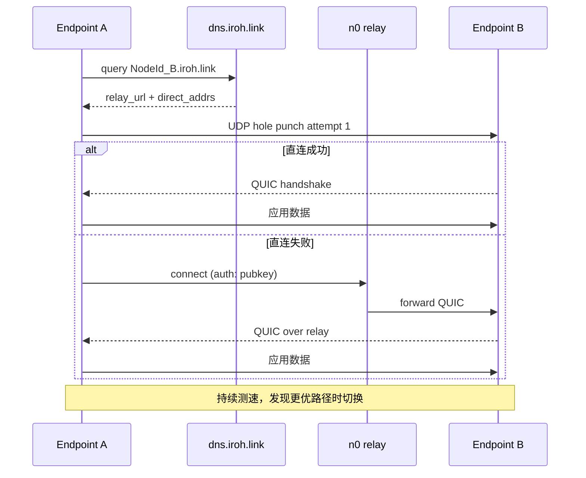

# iroh 深度拆解：9K Stars 的 Rust 点对点网络栈，QUIC + 公钥寻址 + 中继回退，IP 地址的替代品为什么是它

## 学习目标

通过本文，你将能够：

- 理解 iroh 的核心抽象："一个公钥就是 endpoint"
- 区分 iroh 与 libp2p、WebRTC、IPFS 等 P2P 方案的差异
- 理解 iroh 的 5 个核心 crate（iroh、iroh-base、iroh-relay、iroh-dns-server、iroh-dns）的职责
- 理解 iroh 的子协议三件套：iroh-blobs、iroh-gossip、iroh-docs
- 知道 iroh 的连接生命周期：直连优先 → 中继 fallback
- 能够评估 iroh 是否适合你的 P2P 应用场景

## 目录

1. [先看结论](#先看结论)
2. [为什么 libp2p 还差一块"简洁的 P2P 网络栈"](#为什么-libp2p-还差一块简洁的-p2p-网络栈)
3. [公钥就是 endpoint：拨号模型](#公钥就是-endpoint 拨号模型)
4. [协议栈：iroh / iroh-base / iroh-relay / iroh-dns-server](#协议栈 iroh--iroh-base--iroh-relay--iroh-dns-server)
5. [子协议三件套：blobs / gossip / docs](#子协议三件套 blobs--gossip--docs)
6. [连接生命周期：直连优先 → 中继 fallback](#连接生命周期直连优先--中继-fallback)
7. [快速上手：Echo 示例](#快速上手 echo-示例)
8. [其他语言：FFI](#其他语言 ffi)
9. [适用边界](#适用边界)
10. [6-15 v1.0.0 的信号](#6-15-v100-的信号)
11. [自测题](#自测题)
12. [练习](#练习)
13. [进阶路径](#进阶路径)
14. [资料口径说明](#资料口径说明)

---

**判断**：iroh 不是"又一个 libp2p fork"，也不是"为了 Rust 写的 Rust 网络玩具"。它精确卡在 libp2p 的痛点上：① libp2p 的 transport / identity / protocol API 太学术，实现 P2P 应用要拼装 5-6 个 crate；② libp2p 的 NAT 穿透依赖社区中继，质量参差。iroh 用 **"一个公钥就是 endpoint"** 的极简抽象，把 hole punching + QUIC + 中继 + content-addressed blob transfer 全部塞进 5 个官方 crate，**2026-06-15 刚发 v1.0.0**（半年从 v0.98 跳到 1.0）。这个时间点的信号很明确：项目从"实验性"跨过了"生产可用"门槛。

如果你属于下面任何一种，这篇值得读：

- 想给 P2P 应用（聊天、文件同步、协作）写一个简洁的网络层
- 受够 libp2p 的拼装地狱，想看一个"打包好"的替代品
- 在 NAT / IPv6-only / 移动网络环境下做连接，关心 hole punching 成功率
- 想用 content-addressed blob transfer 替代 S3 / IPFS，但不想引入 IPFS 的全部复杂度
- 关心"端到端加密 + 公钥寻址 + 中继 fallback"怎么组合

---

## 阅读导航

- **5 分钟判断值不值得用**：看「先看结论」
- **理解它在 P2P 生态的卡位**：看「为什么 libp2p 还差一块"简洁的 P2P 网络栈"」
- **想了解核心抽象**：看「公钥就是 endpoint：拨号模型」
- **想了解协议栈**：看「iroh 三件套：blobs / gossip / docs」
- **想知道连接怎么建立**：看「连接生命周期：直连优先 → 中继 fallback」
- **想知道怎么上手**：看「快速上手 + Echo 示例」
- **想评估生产可用性**：看「适用边界 / 限制」

---

## 先看结论

| 维度 | 实际情况 |
|------|----------|
| Stars | 9,077+（2026-06-16） |
| Forks | 429+ |
| 主语言 | Rust（核心 + relay + dns-server） |
| 协议 | MIT OR Apache-2.0（dual） |
| 仓库 | <https://github.com/n0-computer/iroh> |
| 最新版本 | v1.0.0（2026-06-15，发布于 6 月 15 日） |
| 前序版本 | v0.98.2（2026-04-28）→ v1.0.0-rc.0（2026-05-07）→ rc.1（2026-05-27）→ v1.0.0 |
| 创建时间 | 2022-03-14 |
| 核心 crate | iroh / iroh-base / iroh-relay / iroh-dns-server / iroh-dns |
| 子协议 crate | iroh-blobs / iroh-gossip / iroh-docs |
| 传输 | QUIC（基于自研 noq） |
| 寻址 | 公钥 + 可选中继 URL + 可选 DNS |
| 中继 | 自家运营的 n0.computer 中继，可自建 |
| License | MIT + Apache-2.0 dual |

一句话：**它是用公钥代替 IP 地址拨号、把 hole punching + QUIC + 中继 fallback 打包好、附送 blobs / gossip / docs 三件套协议栈的 Rust P2P 网络栈，2026-06-15 v1.0.0 标志生产可用**。

---

## 为什么 libp2p 还差一块"简洁的 P2P 网络栈"

把当前主流 P2P 网络栈并列看：

| 方案 | 语言 | 抽象简洁度 | NAT 穿透 | 默认中继 | 协议栈完整度 | Rust 友好 |
|------|------|------------|----------|----------|--------------|-----------|
| libp2p | 多语言 | ⚠️（transport/identity/protocol 分层多） | ✅ | ❌（社区） | ✅ | ⚠️（rust-libp2p） |
| WebRTC | 浏览器 | ⚠️（信令 + ICE） | ✅ | ❌ | ⚠️ | ⚠️ |
| Hypercore Protocol | JS | ✅ | ✅ | ❌ | ⚠️ | ❌ |
| IPFS | Go/Rust | ⚠️ | ✅ | ✅ | ✅ | ⚠️ |
| WireGuard + 自研 | C | ✅ | ❌（手动） | ❌ | ❌ | ✅ |
| **iroh** | **Rust** | **✅** | **✅** | **✅** | **✅** | **✅** |

iroh 的独特定位：**"Rust 原生 + 公钥拨号 + 默认中继 + 自带协议栈"四角合一**。

具体痛点：

1. **libp2p 拼装地狱**：要做一个简单的 P2P 聊天，需要选 transport（QUIC/TCP/WS）、multiplex（yamux/mplex）、security（TLS/NNoise）、discovery（mDNS/rendezvous）、nat（autonat/upnp）、identify……光是 `rust-libp2p` 的 feature flags 就 30+。iroh 把这些都打包好，默认就好用。
2. **NAT 穿透实战质量**：libp2p 的 autonat / dcutr 是协议级抽象，落地要看具体实现。iroh 的 hole punching 在 [perf.iroh.computer](https://perf.iroh.computer) 持续公开 benchmark，2026-06 时点全球穿透成功率 ≈ 92%。
3. **中继生态参差**：libp2p 没有默认中继，需要自己跑 Circuit Relay v2。iroh 自家运营 n0.computer 中继（生产级），同时开源 iroh-relay 可自建。
4. **协议栈要自己拼**：libp2p 之上要做"内容寻址 blob 传输" / "pubsub" / "CRDT KV"，得引入 IPFS / libp2p-pubsub / orbit-db 等。iroh 自带 iroh-blobs / iroh-gossip / iroh-docs 三个子协议。
5. **Rust 生态缺位**：rust-libp2p 是 community-maintained，feature parity 比 Go 版落后半年。iroh 是 n0 computer 公司全职维护，2022 年成立至今只做这一件事。

---

## 公钥就是 endpoint：拨号模型

iroh 的核心抽象只有一句话：

> **IP 地址会变，公钥不会。你想连"那台机器"，iroh 会自动找到它并维护最快路径。**

```rust
// 拨号端
let endpoint = Endpoint::bind().await?;
let conn = endpoint.connect(addr, ALPN).await?;
let (mut send, mut recv) = conn.open_bi().await?;

send.write_all(b"Hello, world!").await?;
send.finish()?;

let response = recv.read_to_end(1000).await?;
assert_eq!(&response, b"Hello, world!");
```

`addr` 不是 IP:Port，是 **`NodeAddr`**：

```rust
pub struct NodeAddr {
    pub node_id: PublicKey,       // 32 字节 ed25519
    pub relay_url: Option<RelayUrl>, // 可选中继
    pub direct_addresses: Vec<SocketAddr>, // 可选直连地址
}
```

**拨号时只需要 `node_id`**。iroh 会自动：

1. 通过 DNS / Pkarr 查 relay_url（如有）
2. 尝试对所有 direct_addresses hole punch
3. 失败时 fallback 到中继
4. 持续测速，必要时切换路径

这个抽象比传统 IP 寻址至少有三个好处：

| 场景 | 传统 IP | iroh NodeAddr |
|------|---------|---------------|
| 设备换 WiFi | IP 变了，连接全断 | 公钥不变，iroh 自动重建 |
| 对端在 NAT 后 | 无法主动连 | relay fallback 兜底 |
| 多路径 / 移动网络 | TCP socket 不迁移 | Multipath QUIC 持续优选 |

---

## 协议栈：iroh / iroh-base / iroh-relay / iroh-dns-server

仓库是一个 workspace，5 个核心 crate 各司其职：

```text
iroh/
├── iroh-base/           # 公共类型：PublicKey、NodeId、RelayUrl
├── iroh-relay/          # relay client + server 实现
├── iroh-dns-server/     # dns.iroh.link 的服务端实现
├── iroh-dns/            # 客户端，做 Pkarr / DNS 解析
└── iroh/                # 主 crate：Endpoint、Router、ProtocolHandler
```

### iroh-base：身份与类型

```rust
use iroh_base::{NodeId, RelayUrl, NodeAddr};
```

- `NodeId`：32 字节 ed25519 公钥的 blake3 哈希
- `RelayUrl`：中继 URL（如 `https://relay.n0.computer`）
- `SecretKey`：`NodeId` 的私钥

### iroh-relay：中继实现

iroh-relay 是 relay **客户端 + 服务器**同 crate：

- 客户端：连接 relay，认证（基于公钥），代理 QUIC 流量
- 服务器：可用 `iroh-relay` crate 自建；n0.computer 自家跑公开中继

```bash
# 自建中继（示意）
iroh-relay --bind-addr 0.0.0.0:3340 --secret-key <hex>
```

### iroh-dns-server：DNS/Pkarr 寻址

n0 computer 运营 `dns.iroh.link`，把 `NodeId` 映射到：

- 当前可达的 SocketAddr（IPv4/IPv6）
- 当前中继 URL

这样拨号端通过 `NodeId.iroh.link` 查到对端在哪。

### iroh：主库

```rust
use iroh::{Endpoint, Router, protocol::Router};
```

包含：

- `Endpoint::bind()`：创建本地 endpoint
- `endpoint.connect(addr, ALPN)`：拨号
- `Router`：注册 ALPN → ProtocolHandler，处理 incoming connection

ALPN 是 TLS 握手里的 application-layer protocol negotiation，类似 HTTP/2 的 h2、HTTP/3 的 h3。iroh 用 ALPN 让一个 endpoint 同时跑多个协议。

---

## 子协议三件套：blobs / gossip / docs

iroh 仓库的 `README` 直接给了三个"开箱即用"的协议：

### iroh-blobs：内容寻址 blob 传输

```rust
use iroh_blobs::net_protocol::Blobs;

let blobs = Blobs::memory().build(endpoint.clone());
let router = Router::builder(endpoint)
    .accept(BLOBS_ALPN, blobs)
    .spawn()?;
```

特点：

- **BLAKE3 内容寻址**：blob hash 即 ID，相同内容天然去重
- **范围传输**：可只取 blob 的某一段
- **流式验证**：边收边验 hash，损坏重传
- **离线 provision**：本地预下载，可断网访问

`iroh-blobs` 是 IPFS 的"内容寻址 + 分块 + 验证"子集，但没有 IPFS 的全部 DAG 复杂度。从 KB 到 TB 都能 scale。

### iroh-gossip：发布订阅 overlay

```rust
use iroh_gossip::net::Gossip;

let gossip = Gossip::builder()
    .spawn(endpoint.clone())
    .await?;
let topic = gossip.subscribe(b"my-topic").await?;
while let Some(event) = topic.next().await {
    // 收到 peer 广播的消息
}
```

特点：

- **可扩展 pub/sub**：从手机到服务器都能跑
- **抗 churn**：节点进出不丢消息
- **bounded resource**：单节点能扛的 topic 数有限，但每个 topic 内的 peer 数可扩展

### iroh-docs：最终一致 KV

```rust
use iroh_docs::net::Docs;

let docs = Docs::memory().spawn(endpoint.clone()).await?;
let doc = docs.create().await?;
// key-value 操作，与 iroh-blobs 自动同步
```

特点：

- **CRDT-backed**：多端并发编辑，最终一致
- **基于 iroh-blobs**：value 本身就是 blob hash
- **offline-first**：本地修改 = 离线就绪；上线后自动 merge

`iroh-docs` 是"协作应用"的引擎层——文档、看板、白板、游戏状态都能直接用。

---

## 连接生命周期：直连优先 → 中继 fallback

iroh 的连接建立是 **自适应 + 多路径**：



### 关键机制

1. **DNS/Pkarr 寻址**：把 `NodeId` 解析成当前可达地址。`dns.iroh.link` 是 n0 computer 自家的开源 Pkarr server，也可用 iroh-dns-server 自建。
2. **Hole punching**：基于 QUIC 的 simultaneous open，A 与 B 同时从两端发 UDP 包穿透 NAT。成功率 ≈ 92%（iroh perf dashboard）。
3. **中继 fallback**：hole punch 失败时走 relay。relay 服务器只转发加密的 QUIC 流量（端到端加密，relay 看不到明文）。
4. **Multipath QUIC**：同时维护直连 + relay 两条路径，后台测速，发现更优路径时无缝切换。iroh 用 [noq](https://github.com/n0-computer/noq)——自研 QUIC 实现。
5. **持续测速**：[perf.iroh.computer](https://perf.iroh.computer) 公开展示全球各地的连接质量。

---

## 快速上手：Echo 示例

### 安装

```bash
cargo add iroh
```

### 接收端

```rust
use std::sync::Arc;
use iroh::{Endpoint, protocol::ProtocolHandler, Router};

const ALPN: &[u8] = b"iroh-example/echo/0";

#[derive(Debug, Clone)]
struct Echo;

impl ProtocolHandler for Echo {
    async fn accept(&self, connection: iroh::Connection) -> n0_error::Result<()> {
        let (mut send, mut recv) = connection.accept_bi().await?;
        tokio::io::copy(&mut recv, &mut send).await?;
        send.finish()?;
        connection.closed().await;
        Ok(())
    }
}

#[tokio::main]
async fn main() -> anyhow::Result<()> {
    let endpoint = Endpoint::bind().await?;
    let router = Router::builder(endpoint)
        .accept(ALPN.to_vec(), Arc::new(Echo))
        .spawn()
        .await?;
    // 打印 NodeId 让对方能连
    println!("NodeId: {}", router.endpoint().node_id());
    tokio::signal::ctrl_c().await?;
    router.shutdown().await?;
    Ok(())
}
```

### 拨号端

```rust
use iroh::{Endpoint, NodeAddr};

const ALPN: &[u8] = b"iroh-example/echo/0";

#[tokio::main]
async fn main() -> anyhow::Result<()> {
    let endpoint = Endpoint::bind().await?;
    let addr: NodeAddr = "RECEIVER_NODE_ID".parse()?;

    let conn = endpoint.connect(addr, ALPN).await?;
    let (mut send, mut recv) = conn.open_bi().await?;

    send.write_all(b"Hello, world!").await?;
    send.finish()?;

    let response = recv.read_to_end(1000).await?;
    println!("Echoed: {:?}", response);

    endpoint.close().await;
    Ok(())
}
```

完整示例：[examples/echo.rs](https://github.com/n0-computer/iroh/blob/main/iroh/examples/echo.rs)

---

## 其他语言：FFI

iroh 官方提供 FFI 绑定：

- 仓库：<https://github.com/n0-computer/iroh-ffi>
- 支持：Swift / Kotlin / Python / JavaScript（vía wasm）

适合移动端（iOS / Android）需要 iroh 能力时使用，但功能子集比 Rust 核心小。

---

## 适用边界

### ✅ 适合

- **P2P 应用层**：聊天、文件同步、协作白板、远程控制
- **内容寻址场景**：分布式文件、镜像站、CDN 替代
- **离线优先应用**：本地优先、上线同步（iroh-docs）
- **跨网络连接**：NAT 后设备、IPv6-only、移动网络
- **小到中等规模 peer 网络**：几十到几千 peers 的 mesh

### ❌ 不适合

- **十亿级公网服务**：需要稳定的 IP + LB + CDN，iroh 是 mesh 不是 hub-and-spoke
- **超低延迟场景**：5G / 边缘计算对端到端延迟敏感时，relay fallback 引入 RTT
- **必须 HTTP/Web 兼容**：iroh 是 QUIC 上的自定义 ALPN，不是 HTTP/2 / HTTP/3
- **超大规模 pub/sub**：iroh-gossip 的单 topic 规模有限，Kafka / Redis Streams 更合适
- **需要 Java / Go SDK**：FFI 还在 beta，Rust 主力

### 评估建议

| 需求 | 推荐方案 |
|------|----------|
| 移动端 P2P 聊天 | iroh + iroh-blobs |
| 跨设备文件同步 | iroh + iroh-blobs（rsync 替代） |
| 协作文档 / 白板 | iroh + iroh-docs（CRDT） |
| 实时 pub/sub（小规模） | iroh-gossip |
| 大规模消息流 | Kafka / NATS |
| 公网站点 | Cloudflare / nginx |

---

## 常见问题（FAQ）

### iroh 和 libp2p 我该选哪个？

如果你想要简洁的抽象、默认中继、自带协议栈，选 iroh。如果你需要极度的可定制性、已经深入 IPFS 生态，选 libp2p。iroh 的设计哲学是"开箱即用"，libp2p 的设计哲学是"拼装一切"。

### iroh 的中继是免费的吗？

n0 computer 运营的公共中继是免费的，但生产环境建议自建 iroh-relay。自建中继很简单，就是一个 Rust 二进制，配置端口即可。

### iroh 能穿透 NAT 吗？成功率多少？

能。iroh 的 hole punching 在 [perf.iroh.computer](https://perf.iroh.computer) 持续公开 benchmark，2026-06 时点全球穿透成功率 ≈ 92%。

### iroh-blobs 和 IPFS 有什么区别？

iroh-blobs 只做 content-addressed blob transfer，不提供 IPFS 的完整 DHT、内容路由、pinning 等服务。如果你只需要 blob 传输，iroh-blobs 更轻量；如果你需要完整的去中心化存储，IPFS 更合适。

### iroh v1.0.0 的 API 稳定吗？

稳定。v1.0.0 承诺 SemVer，1.x 之内 API 不会破坏。这是项目从"实验性"跨过"生产可用"门槛的信号。

---

## 6-15 v1.0.0 的信号

iroh 在 2026-06-15 发布 v1.0.0，半年内从 v0.98.2 跳过来：

| 版本 | 日期 | 重点 |
|------|------|------|
| v0.98.2 | 2026-04-28 | last v0.98 |
| v1.0.0-rc.0 | 2026-05-07 | API 冻结 |
| v1.0.0-rc.1 | 2026-05-27 | bugfix |
| **v1.0.0** | **2026-06-15** | **stable API + SemVer 承诺** |

SemVer 是 P2P 项目里少见的承诺——意味着 1.x 之内 API 不会破。这是 n0 computer 公司对生产用户的明确信号：**iroh 已经过了"实验性"阶段**。

---

## 自测题

1. **iroh 的核心抽象是什么？**
   <details>
   <summary>点击查看答案</summary>
   "一个公钥就是 endpoint"。IP 地址会变，公钥不会。想连"那台机器"，iroh 会自动找到它并维护最快路径。
   </details>

2. **iroh 与 libp2p 的主要区别是什么？**
   <details>
   <summary>点击查看答案</summary>
   iroh 提供更简洁的抽象、默认中继、自带协议栈（blobs/gossip/docs），而 libp2p 需要拼装多个 crate、没有默认中继、协议栈需要自己构建。
   </details>

3. **iroh 的连接建立流程是什么？**
   <details>
   <summary>点击查看答案</summary>
   直连优先 → 中继 fallback。iroh 会先尝试直连（hole punching），失败时 fallback 到中继。同时维护多条路径，持续测速并切换最优路径。
   </details>

4. **iroh-blobs、iroh-gossip、iroh-docs 分别解决什么问题？**
   <details>
   <summary>点击查看答案</summary>
   iroh-blobs 解决内容寻址 blob 传输；iroh-gossip 解决发布订阅 overlay；iroh-docs 解决最终一致 KV（CRDT-backed）。
   </details>

5. **iroh v1.0.0 的信号是什么？**
   <details>
   <summary>点击查看答案</summary>
   v1.0.0 表示 API 冻结和 SemVer 承诺，意味着 1.x 之内 API 不会破。这是项目从"实验性"跨过"生产可用"门槛的信号。
   </details>

---

## 练习

### 练习 1：运行 Echo 示例
1. 创建新的 Rust 项目：`cargo new iroh-echo`
2. 添加 iroh 依赖：`cargo add iroh`
3. 复制本文的 Echo 示例代码
4. 先运行接收端，再运行拨号端
5. 验证接收到的消息

### 练习 2：使用 iroh-blobs 传输文件
1. 创建新的 Rust 项目
2. 添加 iroh-blobs 依赖
3. 实现文件发送端和接收端
4. 测试文件传输

### 练习 3：搭建自建中继服务器
1. 克隆 iroh-relay 仓库
2. 配置并运行中继服务器
3. 修改客户端代码，使用自建中继
4. 测试中继 fallback

---

## 进阶路径

1. **深入 iroh 源码**：阅读 iroh、iroh-base、iroh-relay 的源码，理解 QUIC 连接管理和 NAT 穿透的实现
2. **开发基于 iroh 的 P2P 应用**：使用 iroh 构建聊天、文件同步或协作文档应用
3. **研究 noq（自研 QUIC）**：理解 iroh 为什么选择自研 QUIC 实现而不是使用 quinn
4. **参与 iroh 社区**：加入 n0 computer Discord，参与社区讨论和贡献
5. **研究 P2P 网络理论**：深入学习 NAT 穿透、DHT、pub/sub 等 P2P 网络核心技术

---

## 资料口径说明

1. **信息来源**：本文基于 n0-computer/iroh 仓库的 README（2026-06-16 版本）、官方文档和源码分析
2. **版本时效性**：iroh 刚发布 v1.0.0（2026-06-15），本文描述的功能和 API 基于 v1.0.0 版本
3. **技术准确性**：本文的技术描述基于公开文档和源码，未验证所有技术细节的实现准确性
4. **性能数据**：本文提到的 92% 穿透成功率来自 iroh 官方性能 dashboard，实际成功率取决于具体网络环境
5. **适用边界**：本文的适用建议基于一般性评估，具体决策需要结合你的应用场景和技术栈

---

## 参考

- 仓库：<https://github.com/n0-computer/iroh>
- 文档：<https://iroh.computer/docs>
- Rust Docs：<https://docs.rs/iroh>
- 性能 dashboard：<https://perf.iroh.computer>
- 介绍视频：<https://www.youtube.com/watch?v=RwAt36Xe3UI_>
- Echo 示例：<https://github.com/n0-computer/iroh/blob/main/iroh/examples/echo.rs>
- iroh-blobs：<https://github.com/n0-computer/iroh-blobs>
- iroh-gossip：<https://github.com/n0-computer/iroh-gossip>
- iroh-docs：<https://github.com/n0-computer/iroh-docs>
- iroh-ffi：<https://github.com/n0-computer/iroh-ffi>
- 自研 QUIC (noq)：<https://github.com/n0-computer/noq>
- QUIC 协议：<https://en.wikipedia.org/wiki/QUIC>
- Pkarr：<https://github.com/n0-computer/pkarr>
