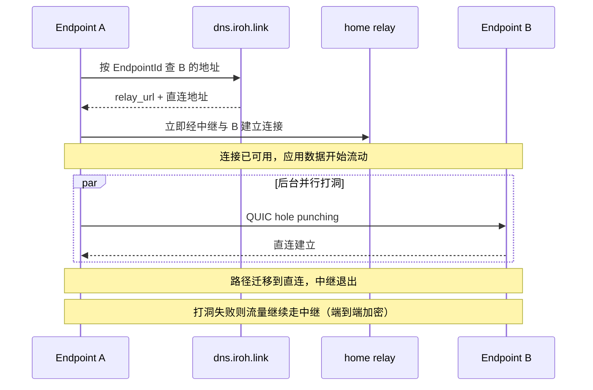

# iroh 深度拆解：公钥就是地址的 Rust 点对点网络栈，QUIC + 中继回退，v1.0 之后它想把 IP 寻址变成历史

## 学习目标

通过本文，你将能够：

- 理解 iroh 的核心抽象："一个公钥就是 endpoint"，以及它如何取代 IP:Port 成为拨号的入口
- 区分 iroh 与 libp2p、WebRTC、IPFS 等 P2P 方案的定位差异
- 理解 iroh 仓库 workspace 里 5 个核心 crate（iroh、iroh-base、iroh-relay、iroh-dns-server、iroh-dns）各自的职责
- 理解三个子协议 crate：iroh-blobs、iroh-gossip、iroh-docs 分别解决什么问题
- 说清 iroh 的连接建立顺序：中继先通、打洞并行、直连后中继退出
- 能够评估 iroh 是否适合你的 P2P 应用场景

## 目录

1. [先看结论](#先看结论)
2. [为什么还需要一个新网络栈](#为什么还需要一个新网络栈)
3. [公钥就是地址：拨号模型](#公钥就是地址拨号模型)
4. [协议栈：workspace 里的 5 个核心 crate](#协议栈workspace-里的-5-个核心-crate)
5. [连接怎么建立：中继先通，直连随后](#连接怎么建立中继先通直连随后)
6. [子协议三件套：blobs / gossip / docs](#子协议三件套blobs--gossip--docs)
7. [快速上手：Echo 示例](#快速上手echo-示例)
8. [其他语言：FFI 绑定](#其他语言ffi-绑定)
9. [适用边界](#适用边界)
10. [版本演进：v1.0.0 到 v1.2.0](#版本演进v100-到-v120)
11. [自测题](#自测题)
12. [练习](#练习)
13. [进阶路径](#进阶路径)
14. [资料口径说明](#资料口径说明)

---

iroh 解决的问题用它的 v1.0.0 发布标题就能说完：**Dial keys, not IPs**——拨公钥，不拨 IP。IP 地址随网络环境漂移，NAT 把大部分设备藏在了无法主动连入的位置，于是点对点应用的作者们把大半精力花在"怎么连上"而不是"连上之后做什么"。iroh 的回答是：把设备身份收敛成一把 ed25519 公钥，连接的建立、路径的选择、NAT 的穿透全部交给库。你说"连那台设备"，它负责找到并维持最快的路径。

这个抽象不是新想法，但 iroh 把它做成了三件此前要自己拼的事：**hole punching + QUIC + 中继回退**打包为一个 API；官方运营公共中继和 DNS 寻址服务，开箱即可用；内容寻址传输（blobs）、发布订阅（gossip）、键值同步（docs）三个子协议现成可组合。2026-06-15 发布 v1.0.0 之后，项目进入 SemVer 纪律下的 1.x 阶段，到本文核对时（2026-09-28）已推进到 v1.2.0。本文以 v1.2.0 为口径。

---

## 先看结论

| 维度 | 实际情况 |
|------|----------|
| Stars | 12,598（2026-09-28 GitHub API 读数） |
| Forks | 761 |
| 贡献者 | 66 |
| crates.io 总下载 | 约 279 万 |
| 主语言 | Rust |
| 协议 | MIT OR Apache-2.0（仓库同时带 LICENSE-MIT 与 LICENSE-APACHE） |
| 仓库 | <https://github.com/n0-computer/iroh> |
| 最新版本 | v1.2.0（2026-09-11） |
| 1.0 时间线 | v0.98.2（2026-04-28）→ v1.0.0-rc.0（2026-05-07）→ rc.1（2026-05-27）→ v1.0.0（2026-06-15，标题 "Dial keys, not IPs"） |
| 创建时间 | 2022-03-14 |
| 核心 crate | iroh / iroh-base / iroh-relay / iroh-dns-server / iroh-dns |
| 子协议 crate | iroh-blobs / iroh-gossip / iroh-docs（独立仓库） |
| 传输 | QUIC，基于 n0 自研的 [noq](https://github.com/n0-computer/noq) |
| 寻址 | EndpointId（ed25519 公钥）+ TransportAddr（中继 URL / IP / 自定义） |
| 中继 | n0 运营公共中继，`iroh-relay` 可自建 |
| 维护方 | n0 computer（公司全职维护，README 落款 "created with love by the n0 team"） |

一句话：**iroh 用公钥代替 IP 地址作为拨号入口，连接先经中继立即建立、同时后台打洞、直连打通后中继退出；它把连接层做成一个 crate，把存储、广播、同步做成三个可选子协议**。

---

## 为什么还需要一个新网络栈

把主流 P2P 网络方案放在一起看，差异不在"能不能穿透 NAT"，而在"你要为此拼装多少东西"：

| 方案 | 语言 | 抽象起点 | 默认中继 | 自带协议栈 | Rust 友好 |
|------|------|----------|----------|------------|-----------|
| libp2p | 多语言 | transport/identity/protocol 分层拼装 | ❌ | 需自行组合 | ⚠️（rust-libp2p） |
| WebRTC | 浏览器 | 信令 + ICE | ❌ | ❌ | ⚠️ |
| IPFS | Go/Rust | 内容寻址 | ✅ | ✅ | ⚠️ |
| **iroh** | **Rust** | **拨公钥** | **✅** | **✅** | **✅** |

iroh 卡的位置很具体：libp2p 给你一堆协议零件（transport、security、multiplex、discovery、autonat），一个简单的 P2P 聊天也要自己决定每一层用什么；IPFS 给你完整的去中心化存储，但如果你只想在两台设备间可靠地传文件、广播消息，DHT 和内容路由的开销大部分是浪费。iroh 的取舍是只做"连接"这一层，把内容寻址这类上层需求交给独立子协议，用得上就加一个 crate，用不上就不引入。

三个具体差异：

1. **连接是 API 而不是项目**。libp2p 没有默认中继，要自己部署 Circuit Relay；iroh 的 `Endpoint` 默认连接 n0 运营的公共中继（`RelayMode::Default`），生产环境可以用 `iroh-relay` 自建，官方把生产环境在用的服务端实现原样开源。
2. **穿透质量持续公开测量**。n0 在 [perf.iroh.computer](https://perf.iroh.computer) 持续测量并公开展示 iroh 的连接质量，而不是只在博客里给一个一次性数字。具体成功率取决于你的网络环境，这个 dashboard 是评估时最该看的一手数据。
3. **公司全职维护**。iroh 由 n0 computer 全职维护，2022 年建仓库至今只做这一件事，这是它与多数社区维护的 P2P 库在可持续性上的差别。

---

## 公钥就是地址：拨号模型

iroh 的核心抽象，README 原话是 "Iroh gives you an API for dialing by public key. You say 'connect to that phone', iroh will find & maintain the fastest connection for you, regardless of where it is."

拨号端代码长这样：

```rust
use iroh::{Endpoint, EndpointAddr, endpoint::presets};

let endpoint = Endpoint::bind(presets::N0).await?;

// addr 只需要包含对端的公钥，地址信息交给 address lookup 去解析
let addr = EndpointAddr::new(peer_endpoint_id);
let conn = endpoint.connect(addr, ALPN).await?;
```

`peer_endpoint_id` 的类型是 `EndpointId`，在源码里就是公钥的类型别名：

```rust
pub type EndpointId = PublicKey;  // iroh-base/src/key.rs
```

它是 32 字节的 ed25519 公钥本身，不是哈希——公钥既当身份又当加密凭证。iroh 的连接用 TLS 加密（与标准 QUIC 一致），但没有服务器证书链：每个 endpoint 用自己的 `SecretKey` 认证，拨号方用对端的 `PublicKey` 确认"连上的确实是这台设备"。这也是为什么 `EndpointId` 是建立连接的必填参数。

地址信息则是 `EndpointAddr`，摘自 `iroh-base/src/endpoint_addr.rs`（v1.2.0）：

```rust
pub struct EndpointAddr {
    pub id: EndpointId,
    pub addrs: BTreeSet<TransportAddr>,
}

pub enum TransportAddr {
    Relay(RelayUrl),    // 中继地址
    Ip(SocketAddr),     // 直连 IP 地址
    Custom(CustomAddr), // 自定义传输的地址（v0.97 引入自定义传输）
}
```

注意三点：

- **只凭公钥就能拨号**。`connect` 接受 `impl Into<EndpointAddr>`，一个裸 `EndpointId` 就能转成 `EndpointAddr`；缺的地址信息由 address lookup 服务补齐。
- **地址是个集合而不是单值**。中继、IPv4、IPv6、自定义传输地址可以并存，`connect` 会并发尝试。
- **IP 地址只是缓存不是身份**。设备换网络后 IP 失效，公钥不变，下一次拨号通过 lookup 拿到新地址。

`Endpoint::bind(presets::N0)` 里的 `N0` preset 一并配置了 n0 的公共中继和 DNS address lookup——这就是"开箱即用"的实际含义：不配置任何东西，你就有中继回退和"只凭公钥拨号"的能力。想完全自定义，`Endpoint::builder()` 暴露了逐项配置的入口。

---

## 协议栈：workspace 里的 5 个核心 crate

主仓库是一个 Cargo workspace，`Cargo.toml` 里的成员就是这 5 个 crate（外加一个 bench 目录）：

```text
iroh/
├── iroh-base/        # 公共类型：EndpointId、RelayUrl、EndpointAddr
├── iroh/             # 主库：Endpoint、Router、连接与路径管理
├── iroh-relay/       # 中继客户端 + 服务端（生产环境在用的同一套代码）
├── iroh-dns-server/  # DNS/Pkarr 服务器，n0 用它运营 dns.iroh.link
└── iroh-dns/         # 通过 DNS 发布/解析 endpoint 信息的核心类型
```

**iroh-base**：类型层。`EndpointId`、`RelayUrl`、`EndpointAddr`、`SecretKey` 都在这里，被所有其他 crate 共享。

**iroh**：主库。`Endpoint` 管理一个本地 endpoint 的全部生命周期——绑定端口、选择 home relay、维护到其他 endpoint 的连接；`Router` 把 ALPN 映射到 `ProtocolHandler`，让一个 endpoint 同时服务多个协议。这里也藏着 iroh 的路径管理：源码 `socket/` 模块维护每条连接的多条路径，按 RTT 偏好选择，直连可用时从中继迁移过去。

ALPN 是 TLS 握手里的应用层协议协商（HTTP/2 协商 `h2`、HTTP/3 协商 `h3` 用的同一个机制）。iroh 用它区分同一 endpoint 上的不同应用协议：连接由 QUIC 层建立，数据进哪个 `ProtocolHandler` 由 ALPN 决定。

**iroh-relay**：中继的客户端和服务端在同一个 crate。服务端带完整 CLI，`cargo build --profile optimized-release --package iroh-relay --features server` 编译出 `iroh-relay` 二进制，行为用 TOML 配置——包括访问控制（默认 `everyone`，也可按 endpoint ID 设 allowlist/denylist，或配 Bearer token）。README 明确说"这是我们在公共中继上跑的代码（你也可以跑）"。

**iroh-dns-server**：一个同时扮演 Pkarr relay 和 DNS 服务器的服务，暴露 DNS（UDP/TCP）、`/pkarr`（GET/PUT 签名包）和 DNS-over-HTTPS（`/dns-query`）三类接口。n0 运营的实例在 `dns.iroh.link`，配置分 `config.dev.toml` 和 `config.prod.toml` 两档。

**iroh-dns**：客户端侧的核心类型，负责把 endpoint 信息以 pkarr 签名包的格式发布到 DNS、以及解析别人的。Pkarr 本身是 "Public Key Addressable Resource Records"——用公钥签名 DNS 记录，让"这个域名属于这台设备"无需中心化 CA。

拨号时的完整链路：你给出公钥 → `DnsAddressLookup` 服务把 `EndpointId` 当域名查询（如 `<hex>.dns.iroh.link`）→ 拿到对端当前的中继 URL 和直连地址 → 发起连接。对端上线时会主动把自己的地址以 pkarr 签名包发布上去。

---

## 连接怎么建立：中继先通，直连随后

这里是 iroh 最容易被讲反的地方。它**不是**"先打洞、失败才走中继"，而是反过来——先让连接立刻可用，再把路径优化到最好。源码文档（`iroh/src/lib.rs`）的原话：

> An iroh connection between two iroh endpoints is usually established with the help of a Relay server. […] they first establish connection via this home relay. As soon as connection between the two endpoints is established they will attempt to create a direct connection, using hole punching if needed. Once the direct connection is established the relay server is no longer involved in the connection.

画成时序：


```mermaid
sequenceDiagram
    participant A as Endpoint A
    participant DNS as dns.iroh.link
    participant Relay as home relay
    participant B as Endpoint B

    A->>DNS: 按 EndpointId 查 B 的地址
    DNS-->>A: relay_url + 直连地址
    A->>Relay: 立即经中继与 B 建立连接
    Note over A,B: 连接已可用，应用数据开始流动
    par 后台并行打洞
        A->>B: QUIC hole punching
        B-->>A: 直连建立
    end
    Note over A,B: 路径迁移到直连，中继退出
    Note over A,B: 打洞失败则流量继续走中继（端到端加密）
```

几个关键机制：

1. **Home relay**。endpoint 启动时连接到最近的中继并指定为 home relay，对端拨号时首先经它建立连接。中继的意义是**把连接延迟从"打洞时间"变成"一个 RTT"**——不管 NAT 多难缠，连接立刻可用。
2. **打洞并行进行**。连接建立后，两端立即尝试 QUIC 打洞（simultaneous open：两端同时互发包，在各自 NAT 上开出映射）。中继同时辅助这个过程——它提供 QAD（QUIC 地址发现）等地址探测服务，帮两端搞清楚自己的网络位置。
3. **直连后无缝迁移**。直连建立后流量切换过去，中继不再参与。这一切发生在同一条 QUIC 连接内，应用层无感知——不是重连，是连接迁移。
4. **打洞失败的兜底**。部分网络组合（如对称 NAT 双方）打洞成功率低，此时连接就持续走中继。中继只转发加密流量：endpoint 之间是 TLS 加密的 QUIC，中继按 `EndpointId` 转发，看不到明文。注意走中继时承载协议是 HTTP/1.1 + TLS 起步、升级后的自定义 TCP 中继协议，不是裸 QUIC。
5. **持续测速**。`socket/` 模块维护每条连接的路径状态，按 RTT 偏好选择路径；n0 把生产网络的测量数据公开在 perf.iroh.computer 上。

这个设计的代价要说清楚：**中继是基础设施依赖**。自建部署时如果你的中继挂了，打洞失败的场景会直接连不上；公共中继免费但流量经他人服务器，延迟取决于中继位置。这是"连接立刻可用"换来的运营责任。

---

## 子协议三件套：blobs / gossip / docs

连接层之上，n0 维护三个独立的子协议仓库，都能用 `Router` 挂到同一个 endpoint 上：

| crate | 解决什么 | 一句话机制 | 状态 |
|-------|----------|------------|------|
| [iroh-blobs](https://github.com/n0-computer/iroh-blobs) | 内容寻址的 blob 传输 | BLAKE3 验证流，请求哈希与字节区间 | 当前 main 非生产级，生产用 0.35 |
| [iroh-gossip](https://github.com/n0-computer/iroh-gossip) | 发布订阅 overlay | epidemic broadcast trees（HyParView + PlumTree） | 活跃开发 |
| [iroh-docs](https://github.com/n0-computer/iroh-docs) | 多维键值文档同步 | range-based set reconciliation | 活跃开发 |

### iroh-blobs：内容寻址传输

协议很简单：请求方打开一条 QUIC 流，发送"我要这些 BLAKE3 哈希对应的（或这些哈希的某个字节区间的）数据"；提供方在同一流上以 BLAKE3 验证流回答——边传边校验哈希，损坏的数据立刻被发现。核心概念四个：**Blob**（任意字节序列）、**Link**（32 字节 BLAKE3 哈希）、**HashSeq**（一串 link 组成的 blob，用来表达"一组文件"）、**Provider/Requester**（同一节点可兼任两者）。

README 开头有一条必须转告的提示：**当前 main 上的版本"尚未达到生产质量"，需要生产可用请用 iroh-blobs 0.35**。引用官方原话："NOTE: this version of iroh-blobs is not yet considered production quality. For now, if you need production quality, use iroh-blobs 0.35." 选型时别把"主分支最新"当成"生产就绪"。

与 IPFS 的关系：iroh-blobs 只做"内容寻址 + 验证传输"这一层，没有 DHT、内容路由和 pinning 服务。它没有 IPFS 的 DAG 复杂度，也没有 IPFS 的去中心化检索——想找"谁有这个哈希"，你得自己知道 Provider 是谁。

### iroh-gossip：发布订阅

实现基于两篇经典论文：**HyParView**（成员管理，维护部分视图的 gossip 协议）和 **PlumTree**（epidemic broadcast trees，消息广播树）。README 的定位是 "publish-subscribe overlay networks that scale, requiring only resources that your average phone can handle"——设计目标是普通手机资源就能参与。

一个 topic 由 32 字节的 `TopicId` 标识，加入 swarm 需要 bootstrap peers（初始对端列表）。`Gossip::builder().spawn(endpoint.clone())` 创建，挂到 Router 的 ALPN 上，之后 `subscribe(topic_id)` 拿到事件流。它适合中小规模 swarm 的消息扇出；不要拿它对标 Kafka 那种有持久化、有序性和分区语义的消息队列——gossip overlay 的消息到达语义由广播树决定，不提供队列级承诺。

### iroh-docs：多维键值同步

官方定位 "Multi-dimensional key-value documents with an efficient synchronization protocol"。数据模型是 **Replica**（副本）包含任意多个 **Entry**：每个 entry 由 namespace、author、key 三元组标识，value 是内容数据的 32 字节 BLAKE3 哈希加大小和时间戳——**内容本体不进副本**，同步的是索引，大内容交给 iroh-blobs 传。

写权限用双密钥表达：**Namespace key** 是写能力的凭证（公钥即 namespace ID），**Author key** 标署名。同步算法基于 Aljoscha Meyer 的 **range-based set reconciliation**（arXiv:2212.13567）：递归二分集合、比对分区指纹、只对有差异的分区继续交换——两端只需要对齐差异部分。存储上提供内存和 redb（嵌入式 KV 存储、单文件持久化）两种实现。

注意它**不是**通常意义的 CRDT 框架：官方文档全程没有用 CRDT 这个词，机制是基于集合对账的同步协议。多端并发写各自签名、最终通过对齐收敛，冲突语义由应用层在读取时处理。

---

## 快速上手：Echo 示例

```bash
cargo add iroh
```

接收端（完整代码在仓库 [iroh/examples/echo.rs](https://github.com/n0-computer/iroh/blob/main/iroh/examples/echo.rs)，以下为 v1.2.0 版本）：

```rust
use iroh::{
    Endpoint, endpoint::presets,
    protocol::{AcceptError, ProtocolHandler, Router},
};
use n0_error::{Result, StdResultExt};

const ALPN: &[u8] = b"iroh-example/echo/0";

#[derive(Debug, Clone)]
struct Echo;

impl ProtocolHandler for Echo {
    async fn accept(&self, connection: iroh::endpoint::Connection) -> Result<(), AcceptError> {
        let (mut send, mut recv) = connection.accept_bi().await?;
        // 把收到的字节原样回写，直到对方 finish
        tokio::io::copy(&mut recv, &mut send).await?;
        send.finish()?;
        connection.closed().await;
        Ok(())
    }
}

#[tokio::main]
async fn main() -> Result<()> {
    let endpoint = Endpoint::bind(presets::N0).await?;
    let router = Router::builder(endpoint)
        .accept(ALPN, Echo)
        .spawn();
    router.endpoint().online().await;
    println!("本机 EndpointId: {}", router.endpoint().id());
    tokio::signal::ctrl_c().await.ok();
    router.shutdown().await.anyerr()?;
    Ok(())
}
```

拨号端：

```rust
use iroh::{Endpoint, EndpointId, endpoint::presets};
use n0_error::{Result, StdResultExt};

const ALPN: &[u8] = b"iroh-example/echo/0";

#[tokio::main]
async fn main() -> Result<()> {
    let endpoint = Endpoint::bind(presets::N0).await?;

    // 只凭对端公钥拨号：EndpointId 支持 hex / base32 字符串解析
    let peer: EndpointId = "RECEIVER_ENDPOINT_ID".parse().expect("valid endpoint id");

    // connect 接受 impl Into<EndpointAddr>，裸公钥直接传
    let conn = endpoint.connect(peer, ALPN).await?;
    let (mut send, mut recv) = conn.open_bi().await.anyerr()?;

    send.write_all(b"Hello, world!").await.anyerr()?;   // 必须先写数据，对端 accept_bi 才会返回
    send.finish().anyerr()?;

    let response = recv.read_to_end(1000).await.anyerr()?;
    println!("Echoed: {:?}", response);

    conn.close(0u32.into(), b"bye!");    // 只排队关闭消息，非 async
    endpoint.close().await;              // 等 close 真正发出去
    Ok(())
}
```

三个容易踩的细节，官方示例注释里都专门强调了：

1. **QUIC 流是惰性创建的**：只调 `open_bi` 而不写数据，对端的 `accept_bi` 不会返回。发送方必须先写。
2. **`conn.close()` 不是 async**：它只是把关闭消息排入队列，要 `endpoint.close().await` 才保证消息发完、连接优雅关闭。
3. **`online().await`**：拨号前等 endpoint 完成 address lookup 的发布，否则对端可能查不到你。

代码里的 `.anyerr()` 来自 n0 维护的 `n0_error` crate，把标准库风格的错误桥接进统一的错误类型；`accept_bi`、`tokio::io::copy` 这类返回值已经兼容，直接 `?` 即可。

---

## 其他语言：FFI 绑定

[iroh-ffi](https://github.com/n0-computer/iroh-ffi) 为 iroh 提供官方绑定，已发布正式包：

| 语言 | 包 |
|------|-----|
| Python | PyPI `iroh` |
| Swift | SwiftPM / CocoaPods `IrohLib` |
| Kotlin / JVM | Maven Central `computer.iroh:iroh` |
| JavaScript | npm `@number0/iroh` |
| Go | 社区维护（非官方） |

范围有明确边界：绑定"mirror the stabilized iroh 1.0 surface"——endpoint、连接、路径、ticket、中继、服务这些 1.0 稳定面；blobs/gossip/docs 三个子协议**不在绑定范围内**。移动端（iOS/Android）想用 iroh 做连接层是 FFI 的主要场景，但需要内容传输等子协议能力时，目前得回到 Rust 侧。

---

## 适用边界

### 适合

- **设备间直连**：聊天、文件同步、协作、远程控制——两端都是自己控制的设备，不需要公网入口
- **离线优先应用**：本地写、联网同步，iroh-docs 的副本模型就是为此设计的
- **NAT 后、IPv6-only、移动网络**：公钥寻址对网络漂移免疫，中继兜底保证可达
- **中小规模 swarm**：gossip 的设计目标就是手机可参与的规模

### 不适合

- **对外公网服务**：需要稳定 IP + LB + CDN 的服务端场景，iroh 是点对点 mesh，不是服务发现框架
- **极低延迟**：路径经过中继时延迟是两段 RTT；对延迟极敏感的场景要先测直连率
- **浏览器内运行**：iroh 是 QUIC + 自定义 ALPN，浏览器的 WebAssembly 沙箱拿不到原始 UDP socket
- **大规模持久消息流**：有持久化、分区、有序性需求的用 Kafka/NATS
- **去中心化内容检索**：需要"全网找内容"的是 IPFS 的场景，iroh-blobs 只负责"和已知的对端传内容"

### 选型对照

| 需求 | 建议 |
|------|------|
| 两台设备间同步文件 | iroh + iroh-blobs（生产用 0.35） |
| 多人群聊 / 状态广播 | iroh + iroh-gossip |
| 协作文档 / 离线优先 KV | iroh + iroh-docs |
| 移动端集成 | iroh-ffi（Swift/Kotlin 包已发布） |
| 大规模消息基础设施 | Kafka / NATS |
| 公网站点 | 常规 Web 栈 |

---

## 版本演进：v1.0.0 到 v1.2.0

| 版本 | 日期 | 要点 |
|------|------|------|
| v0.97.0 | 2026-03-16 | 自定义传输 + noq（自研 QUIC） |
| v0.98.2 | 2026-04-28 | 0.98 系列末版 |
| v1.0.0-rc.0 | 2026-05-07 | API 收口 |
| v1.0.0-rc.1 | 2026-05-27 | "The last one" |
| **v1.0.0** | **2026-06-15** | **"Dial keys, not IPs"，1.0 稳定面** |
| v1.0.1 – v1.0.3 | 2026-06-29 – 07-20 | 修复批次（空 ALPN 报错、n0 preset 加 pkarr 解析器等） |
| v1.1.0 | 2026-08-25 | 中继连接指标、限速告知、CustomAddr 序列化修复（标注 breaking） |
| v1.2.0 | 2026-09-11 | noq 1.3.0、可配置回退 DNS、中继鉴权原因暴露 |

从 v0.98.2 到 v1.0.0 只隔了七周，之前四年多的迭代在 1.0 收口。API 兼容性由 CI 里的 cargo-semver-checks 守护（workspace 配置了对各类 API 变更要求 minor 版本号提升的 lint）。要留意的是 1.x 并非绝对零破坏：v1.1.0 就有一处标注 breaking 的 CustomAddr 序列化修复——属于修复错误行为的例外，但升级时读一遍 changelog 的习惯在 1.x 也应该保持。

对使用者的直接含义：**1.x 之上可以规划长期项目了**，依赖升级的预期成本从"可能重写"降到"读 changelog"。子协议三件套不在此列——blobs 官方自述未达生产级，gossip/docs 也在活跃演进，跟着它们走要接受 API 变动。

---

## 自测题

1. **iroh 的核心抽象是什么？**
   <details>
   <summary>点击查看答案</summary>
   拨公钥（Dial keys, not IPs）。IP 随网络漂移，公钥不变；EndpointId 就是 32 字节 ed25519 公钥本身，iroh 负责找到对端并维持最快路径。
   </details>

2. **iroh 的连接建立顺序和直觉有什么不同？**
   <details>
   <summary>点击查看答案</summary>
   先经 home relay 立即建立连接（应用马上可用），打洞在后台并行进行；直连打通后流量在同一条 QUIC 连接内迁移到直连、中继退出；打洞失败则继续走中继兜底。
   </details>

3. **只凭公钥拨号是怎么做到的？**
   <details>
   <summary>点击查看答案</summary>
   Address lookup 服务（默认 DNS/Pkarr）：对端把中继 URL 和直连地址以 pkarr 签名包发布到 DNS，拨号方按 EndpointId 查询即得地址。n0 运营的实例是 dns.iroh.link。
   </details>

4. **blobs、gossip、docs 分别解决什么问题，依据什么机制？**
   <details>
   <summary>点击查看答案</summary>
   blobs 做内容寻址传输（BLAKE3 验证流，按哈希和字节区间请求）；gossip 做发布订阅（HyParView 成员管理 + PlumTree 广播树）；docs 做多维键值同步（range-based set reconciliation，内容本体走 blobs）。
   </details>

5. **v1.0.0 对使用者意味着什么，有什么保留项？**
   <details>
   <summary>点击查看答案</summary>
   进入 SemVer 纪律的 1.x，CI 用 cargo-semver-checks 守护 API 兼容，长期项目可以放心规划。保留项：1.x 仍可能有标注 breaking 的行为修复（v1.1.0 已有一例）；子协议三件套不在 1.0 稳定面内，iroh-blobs 官方自述未达生产级。
   </details>

---

## 练习

### 练习 1：跑通 Echo

1. `cargo new iroh-echo && cd iroh-echo`
2. `cargo add iroh`，再 `cargo add tokio --features full`
3. 把本文接收端代码跑起来，记下打印的 EndpointId
4. 另开目录跑拨号端，替换 `RECEIVER_ENDPOINT_ID`
5. 两台真机（或一台真机 + 一台虚拟机）再跑一次，观察与同机回环的差异

### 练习 2：观察路径迁移

在 Echo 基础上打开 `RUST_LOG=debug`，观察连接先经 relay 建立、随后迁移到直连的日志顺序。把两台设备放到不同 NAT 后，对比打洞成功与失败时日志的走向。

### 练习 3：自建中继

1. 在主仓库目录执行 `cargo build --profile optimized-release --package iroh-relay --features server`
2. 参考 `iroh-relay` 的配置说明写一份 TOML（先 `access = "everyone"`，再试 allowlist）
3. 客户端把 relay URL 指向自建实例，验证连接仍可建立

---

## 进阶路径

1. **读连接管理源码**：`iroh/src/socket/` 下的路径状态与 RTT 偏好选择是 iroh 网络层的精华；`endpoint/hooks.rs` 展示连接生命周期钩子
2. **读 TRANSPORTS.md**：v0.97 引入的自定义传输如何在不改 QUIC 栈的情况下扩展地址类型
3. **跑 patchbay**：仓库里的 patchbay 测试套件模拟真实网络拓扑，是理解打洞行为最直接的实验场
4. **参与社区**：Discord（README 有入口）、GOOD_FIRST_ISSUE 标签；n0 的 YouTube 频道有核心开发者的架构讲解
5. **补 P2P 理论**：HyParView、PlumTree、range-based set reconciliation 三篇论文是 gossip 与 docs 的地基

---

## 资料口径说明

1. **版本口径**：本文以 iroh v1.2.0（2026-09-09 tag、2026-09-11 发布）为基准核对，仓库数据（stars/forks/贡献者/下载量）为 2026-09-28 GitHub API 与 crates.io API 读数。`EndpointAddr`/`EndpointId` 这套类型名自 v1.0.0 起即如此，`Endpoint::bind` 需要 preset 参数；阅读 1.0 之前的资料时注意旧文常写作 `NodeAddr`/`NodeId`。
2. **代码**：所有 Rust 代码取自 v1.2.0 的 `iroh/examples/echo.rs` 与 crate 文档，`EndpointAddr` 结构摘自 `iroh-base/src/endpoint_addr.rs`。
3. **机制描述**：连接建立顺序、中继行为、加密与 ALPN 机制以 `iroh/src/lib.rs` 的 crate 文档原文为据；三个子协议的机制与状态提示（blobs 非生产级提示、gossip 论文出处、docs 同步算法）以各自仓库 README 为据。
4. **性能数据**：iroh 的穿透成功率、延迟等性能数据以 perf.iroh.computer 的持续测量为准。该 dashboard 是需要浏览器渲染的 JS 应用，本文不引用一次性快照数字；评估时建议直接查看与你目标网络环境相近的时段。
5. **SemVer 表述**：1.x 的兼容性纪律以 CI 的 cargo-semver-checks 配置与 v1.0.3 changelog 中 "Update semver checks for 1.0 stability" 条目为据；v1.1.0 存在一处标注 breaking 的修复，故本文不对"1.x 内零破坏"做绝对承诺。

---

## 参考

- 仓库：<https://github.com/n0-computer/iroh>
- 文档：<https://docs.iroh.computer>
- Rust Docs：<https://docs.rs/iroh>
- 性能 dashboard：<https://perf.iroh.computer>
- 介绍视频（Introducing iroh）：<https://www.youtube.com/watch?v=RwAt36Xe3UI>
- Echo 示例：<https://github.com/n0-computer/iroh/blob/main/iroh/examples/echo.rs>
- iroh-blobs：<https://github.com/n0-computer/iroh-blobs>
- iroh-gossip：<https://github.com/n0-computer/iroh-gossip>
- iroh-docs：<https://github.com/n0-computer/iroh-docs>
- iroh-ffi：<https://github.com/n0-computer/iroh-ffi>
- noq（自研 QUIC）：<https://github.com/n0-computer/noq>
- Pkarr：<https://github.com/nuhvi/pkarr>
- Range-based set reconciliation（arXiv:2212.13567）：<https://arxiv.org/abs/2212.13567>
- QUIC 协议：<https://en.wikipedia.org/wiki/QUIC>
