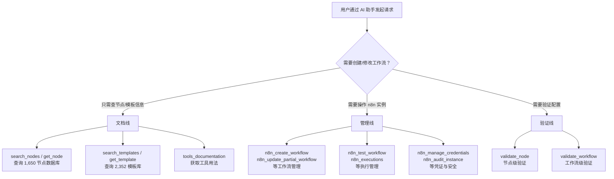

> **学习目标**：读完这篇文章，你应该能回答三个问题：n8n-MCP 到底解决了什么具体问题、它的 7 个核心工具分别承担什么角色、以及你在自己的项目里该从哪里开始用。

## 目录

1. [这篇文章的判断](#这篇文章的判断)
2. [系统总览：三条主线](#系统总览三条主线)
3. [核心 MCP 工具详解](#核心-mcp-工具详解)
4. [一个任务如何流过系统](#一个任务如何流过系统)
5. [Claude Project 最佳配置](#claude-project-最佳配置)
6. [安装与部署](#安装与部署)
7. [支持的 IDE](#支持的-ide)
8. [安全注意事项](#安全注意事项)
9. [架构设计](#架构设计)
10. [采用建议：谁该先用，谁可以等等](#采用建议谁该先用谁可以等等)
11. [自测检查](#自测检查)
12. [常见问题](#常见问题)
13. [延伸阅读](#延伸阅读)

## 这篇文章的判断

n8n-MCP 真正解决的问题不是"让 AI 能调用 n8n API"，而是让 AI 助手在 1,650 个节点、上万种参数组合面前，不依赖默认值、不犯配置错误，一步到位生成可运行的工作流。

它把节点文档、模板元数据和 n8n 实例管理包装成 MCP 工具，AI 助手通过这些工具完成从选型、配置、验证到部署的完整闭环。仓库地址：[czlonkowski/n8n-mcp](https://github.com/czlonkowski/n8n-mcp)，MIT 许可证，当前版本 2.50.0（2026-05-02）。

- **节点总数**：1,650 个（820 个核心节点 + 830 个社区节点，其中 741 个已验证）
- **节点属性覆盖率**：99%
- **节点操作覆盖率**：63.6%
- **官方文档覆盖率**：87%（含 AI 节点文档）
- **模板库**：2,352 个工作流模板，元数据 AI 标注覆盖率 99.96%
- **AI 工具变体**：265 个具备 AI 能力的工具变体

### n8n 是什么

n8n 是一个开源的工作流自动化平台，类似 Zapier，但支持自托管，数据完全掌握在自己手里。与 AI 编程助手结合后，你可以直接用自然语言描述需求，AI 助手帮你构建、修改、验证和部署工作流。

### MCP 在其中的角色

MCP（Model Context Protocol，模型上下文协议）是 Anthropic 提出的标准化协议，让 AI 编程助手与外部工具和数据源结构化通信。n8n-MCP 把 n8n 的节点系统、工作流模板和实例管理能力封装为标准化的 MCP 工具——AI 助手不再需要"记住"1,650 个节点的用法，而是在构建时实时查询、验证、纠正。

## 系统总览：三条主线

n8n-MCP 内部实际上是三条独立但互相关联的能力线，在开始之前把它们拆开看会更清楚：



| 主线 | 职责 | 是否需要 n8n 实例 | 典型场景 |
|------|------|:---:|------|
| 文档线（7 个工具） | 查询节点文档、搜索模板、验证节点配置 | 不需要 | 设计阶段：AI 助手根据你的需求查找合适的节点和模板 |
| 管理线（13 个工具） | 创建/更新/删除/部署工作流、管理凭证、安全审计 | **需要** | 部署阶段：AI 助手把设计好的工作流写入你的 n8n 实例 |
| 验证线（横切） | 节点级（`validate_node`）→ 工作流级（`validate_workflow`） | 看情况 | 贯穿始终：每次修改后验证，不依赖默认值 |

三条线里，文档线是所有操作的起点——不管你是要新建工作流还是修改现有工作流，AI 助手都得先从文档线里查出节点怎么配置。

## 核心 MCP 工具详解

n8n-MCP 提供 **7 个核心文档类工具**（无需 n8n 实例即可使用）和 **13 个 n8n 管理工具**（需要配置 `N8N_API_URL` 和 `N8N_API_KEY`）。

### 文档类工具（7 个）

#### 1. `tools_documentation`

获取所有 MCP 工具的使用文档。AI 助手启动后的第一步通常是调用这个工具，了解每个工具的输入输出格式和约束。

```
tools_documentation()
```

#### 2. `search_nodes`

全文搜索所有 n8n 节点。

```json
search_nodes({
  "query": "slack notification",
  "includeExamples": true
})
```

支持通过 `source` 参数过滤社区节点：

```json
search_nodes({
  "query": "openai",
  "source": "verified"
})
```

#### 3. `get_node`

统一节点信息查询工具，支持多种模式：

```json
// 获取基本信息（默认）
get_node({
  "nodeType": "n8n-nodes-base.slack",
  "detail": "standard",
  "includeExamples": true
})

// 获取极简元数据（约 200 tokens）
get_node({
  "nodeType": "n8n-nodes-base.slack",
  "detail": "minimal"
})

// 获取完整信息（约 3000-8000 tokens）
get_node({
  "nodeType": "n8n-nodes-base.slack",
  "detail": "full"
})

// 获取人类可读的 Markdown 文档
get_node({
  "nodeType": "n8n-nodes-base.slack",
  "mode": "docs"
})

// 搜索特定属性（如认证相关）
get_node({
  "nodeType": "n8n-nodes-base.slack",
  "mode": "search_properties",
  "propertyQuery": "auth"
})

// 版本信息与迁移指南
get_node({
  "nodeType": "n8n-nodes-base.slack",
  "mode": "versions"
})
```

> **注意**：LangChain 节点使用 `@n8n/n8n-nodes-langchain.` 前缀（如 `@n8n/n8n-nodes-langchain.agent`），核心节点使用 `n8n-nodes-base.` 前缀。

#### 4. `validate_node`

节点配置验证工具，支持三级验证策略：

```json
// 级别 1：快速检查，仅验证必填字段（<100ms）
validate_node({
  "nodeType": "n8n-nodes-base.slack",
  "config": {"resource": "message", "operation": "post"},
  "mode": "minimal"
})

// 级别 2：全面验证，含修复建议
validate_node({
  "nodeType": "n8n-nodes-base.slack",
  "config": {"resource": "message", "operation": "post"},
  "mode": "full",
  "profile": "runtime"
})

// 级别 3：AI 友好级别
validate_node({
  "nodeType": "n8n-nodes-base.slack",
  "config": {"resource": "message", "operation": "post"},
  "mode": "full",
  "profile": "ai-friendly"
})
```

> **关于默认值**：文档明确指出默认值是运行时失败的第一大原因。AI 助手在构建工作流时应显式配置所有控制节点行为的参数，不要依赖默认值。

#### 5. `validate_workflow`

工作流完整性验证，包括连接有效性、表达式语法、AI Agent 配置等。

```json
validate_workflow(workflow)
```

#### 6. `search_templates`

模板搜索工具，支持四种搜索模式：

```json
// 按关键词搜索（默认）
search_templates({
  "query": "slack notification"
})

// 按任务类型搜索
search_templates({
  "searchMode": "by_task",
  "task": "webhook_processing"
})

// 按节点类型搜索
search_templates({
  "searchMode": "by_nodes",
  "nodeTypes": ["n8n-nodes-base.slack"]
})

// 按元数据过滤
search_templates({
  "searchMode": "by_metadata",
  "complexity": "simple",
  "maxSetupMinutes": 30,
  "targetAudience": "developers"
})
```

过滤策略建议：

| 受众 | 参数组合 |
|------|---------|
| 初学者 | `complexity: "simple"` + `maxSetupMinutes: 30` |
| 营销人员 | `targetAudience: "marketers"` |
| 快速上手 | `maxSetupMinutes: 15` |
| AI 集成 | `requiredService: "openai"` |

#### 7. `get_template`

获取完整工作流 JSON，包含三种模式：

```json
// 仅节点列表
get_template("template-id", {mode: "nodes_only"})

// 工作流结构
get_template("template-id", {mode: "structure"})

// 完整工作流 JSON（可直接部署）
get_template("template-id", {mode: "full"})
```

### n8n 管理工具（13 个，需要配置 N8N_API_URL 和 N8N_API_KEY）

#### 工作流管理

| 工具 | 功能 |
|------|------|
| `n8n_create_workflow` | 创建新工作流 |
| `n8n_get_workflow` | 获取工作流详情 |
| `n8n_update_full_workflow` | 全量更新工作流 |
| `n8n_update_partial_workflow` | 通过 diff 操作更新工作流（推荐） |
| `n8n_delete_workflow` | 删除工作流 |
| `n8n_list_workflows` | 列表查询与分页 |
| `n8n_validate_workflow` | 在 n8n 实例中验证工作流 |
| `n8n_autofix_workflow` | 自动修复常见错误 |
| `n8n_workflow_versions` | 版本历史与回滚 |
| `n8n_deploy_template` | 从 n8n.io 模板市场直接部署 |

#### 执行管理

| 工具 | 功能 |
|------|------|
| `n8n_test_workflow` | 触发测试执行 |
| `n8n_executions` | 执行记录管理（列表、查看、删除） |

#### 凭证与安全

| 工具 | 功能 |
|------|------|
| `n8n_manage_credentials` | 凭证管理（创建、读取、更新、删除、获取 schema） |
| `n8n_audit_instance` | 安全审计（结合 n8n 内置 audit API 与深度工作流扫描） |
| `n8n_health_check` | n8n API 连接状态与功能特性检查 |

### 关键操作注意事项

#### `n8n_update_partial_workflow` 的 diff 操作

推荐使用 diff 操作而非全量覆盖，可以实现精细化更新：

```json
n8n_update_partial_workflow({
  "id": "wf-123",
  "operations": [
    {"type": "updateNode", "nodeId": "slack-1", "changes": {...}},
    {"type": "updateNode", "nodeId": "http-1", "changes": {...}},
    {"type": "cleanStaleConnections"}
  ]
})
```

#### `addConnection` 的四个参数要求

```json
{
  "type": "addConnection",
  "source": "node-id-string",
  "target": "target-node-id-string",
  "sourcePort": "main",
  "targetPort": "main"
}
```

#### IF 节点多输出路由

IF 节点有两个输出（TRUE 和 FALSE），必须使用 `branch` 参数明确指定路由目标：

```json
// 正确写法
{"type": "addConnection", "source": "If Node", "target": "True Handler",
 "sourcePort": "main", "targetPort": "main", "branch": "true"}
{"type": "addConnection", "source": "If Node", "target": "False Handler",
 "sourcePort": "main", "targetPort": "main", "branch": "false"}
```

## 一个任务如何流过系统

只看工具列表，很容易觉得 n8n-MCP 就是一堆 API 的 MCP 包装。下面用一个具体任务把三条主线串起来，看 AI 助手在构造一个"Slack 消息通知"工作流时，实际走过哪些工具：

```text
用户输入：
  "帮我建一个工作流：当收到 GitHub webhook 时，
   判断 issue 是否带 'bug' 标签，如果是就发 Slack 通知。"

AI 助手内部执行路径：

1. [文档线] tools_documentation()
   → 确认可用工具清单和调用方式

2. [文档线] search_templates({query: "github slack notification"})
   → 找到 3 个相关模板，其中 "GitHub to Slack Notifications"
     复杂度 simple，包含 GitHub Trigger + IF + Slack 三个节点

3. [文档线] get_template("github-slack-notify", {mode: "structure"})
   → 确认节点拓扑：GitHub Trigger → IF → Slack
     IF 节点有两个输出分支（TRUE/FALSE）

4. [文档线] get_node("n8n-nodes-base.github", {detail: "standard"})
   → 查看 GitHub Trigger 的 event 参数可选值
     需要 repository owner 和 name 字段

5. [验证线] validate_node({
     nodeType: "n8n-nodes-base.github",
     config: {event: "issues", owner: "myorg", name: "myrepo"},
     mode: "full", profile: "ai-friendly"
   })
   → 通过 ✓

6. [验证线] validate_node({
     nodeType: "n8n-nodes-base.if",
     config: {
       conditions: {
         string: [{
           value1: "={{ $json.issue.labels }}",
           operation: "contains",
           value2: "bug"
         }]
       }
     },
     mode: "full", profile: "ai-friendly"
   })
   → 通过，但 AI 友好分析提示：labels 是数组，contains 可能误匹配
     "debug" 等，建议改用正则或精确匹配

7. [文档线] get_node("n8n-nodes-base.slack", {mode: "search_properties", propertyQuery: "auth"})
   → 确认需要 Slack Bot Token，authentication 类型为 OAuth2

8. [管理线] n8n_create_workflow({name: "GitHub Bug → Slack Notify", nodes: [...], connections: {...}})
   → 在 n8n 实例创建草稿工作流

9. [管理线] n8n_validate_workflow("wf-new-456")
   → 节点连接有效 ✓, 表达式语法正确 ✓, 凭证未配置 ⚠️

10. [管理线] n8n_manage_credentials({
      action: "create",
      nodeType: "n8n-nodes-base.slack",
      credentials: {accessToken: "xoxb-..."}
    })
    → 凭证创建完成

11. [管理线] n8n_test_workflow("wf-new-456")
    → 工作流执行成功 ✓
```

这个案例里，文档线（步骤 1-4,7）承担了全部的知识检索，验证线（步骤 5-6）在写配置时即时纠错，管理线（步骤 8-11）负责落地和执行。三条线分工明确，没有哪条线试图包揽不属于自己的活。

## Claude Project 最佳配置

n8n-MCP 仓库提供了针对 Claude Projects 优化的系统指令（`CLAUDE.md`），推荐将其保存到 Claude Project 配置中以获得最佳效果。核心原则如下：

### 五大核心原则

1. **静默执行**：工具调用期间不输出说明文字，所有工具调用完成后统一响应
2. **并行执行**：独立的操作并行执行以提升效率
3. **模板优先**：始终先搜索模板（2,352 个可用），再从零构建
4. **多级验证**：minimal → full → workflow 三级验证递进
5. **绝不信任默认值**：所有控制节点行为的参数必须显式配置

### 推荐工作流

```
1. 调用 tools_documentation() 获取最佳实践
2. 搜索模板：search_templates() 按复杂度、任务或关键词搜索
3. 如无合适模板：search_nodes() 搜索节点，get_node() 获取配置
4. 配置阶段：validate_node() 以 minimal 和 full 两个级别验证
5. 构建阶段：使用 get_template() 获取完整 JSON，显式设置所有参数
6. 验证阶段：validate_workflow() → validate_workflow_connections()
   → validate_workflow_expressions()
7. 部署阶段：n8n_create_workflow() → n8n_validate_workflow()
```

## 安装与部署

### 最快上手（无需安装）

访问 **[dashboard.n8n-mcp.com](https://dashboard.n8n-mcp.com)**：

- 免费额度：每天 100 次工具调用
- 即时访问，无需基础设施维护
- 始终保持最新的节点和模板

### npx（快速本地安装）

```bash
npx n8n-mcp
```

Claude Desktop 配置（`~/Library/Application Support/Claude/claude_desktop_config.json`）：

```json
{
  "mcpServers": {
    "n8n-mcp": {
      "command": "npx",
      "args": ["n8n-mcp"],
      "env": {
        "MCP_MODE": "stdio",
        "LOG_LEVEL": "error",
        "DISABLE_CONSOLE_OUTPUT": "true"
      }
    }
  }
}
```

> ⚠️ **重要**：`MCP_MODE: "stdio"` 是 Claude Desktop 的必需配置，缺少此环境变量会导致 JSON 解析错误。

开启完整 n8n 管理功能：

```json
{
  "mcpServers": {
    "n8n-mcp": {
      "command": "npx",
      "args": ["n8n-mcp"],
      "env": {
        "MCP_MODE": "stdio",
        "N8N_API_URL": "https://your-n8n-instance.com",
        "N8N_API_KEY": "your-api-key"
      }
    }
  }
}
```

### Docker 部署

```bash
docker run -p 3000:3000 \
  -e MCP_MODE=http \
  -e N8N_API_URL=https://your-n8n-instance.com \
  -e N8N_API_KEY=your-api-key \
  ghcr.io/czlonkowski/n8n-mcp
```

### Railway 一键部署

仓库提供了 Railway 部署按钮和生产级 Dockerfile，支持自动构建和横向扩展。

### HTTP 部署模式

对于远程服务器部署，可以启用 HTTP 模式：

```bash
MCP_MODE=http node dist/mcp/index.js
# 或
npm run start:http
```

仓库提供了详细的 [HTTP Deployment 文档](./docs/HTTP_DEPLOYMENT.md) 和 [N8N HTTP Streamable Setup](./N8N_HTTP_STREAMABLE_SETUP.md)。

## 支持的 IDE

n8n-MCP 与多个主流 AI 编程 IDE 无缝集成：

- **Claude Desktop**：本地桌面集成，适合日常使用
- **Claude Code**：命令行工具，适合 CI/CD 场景
- **Cursor**：支持 MCP 协议的配置
- **Windsurf**：支持项目级规则配置
- **Codex**：OpenAI 的编程辅助工具
- **Antigravity**：另一个 MCP 集成方案

各 IDE 的详细配置文档位于仓库的 `docs/` 目录下。

## 安全注意事项

项目 README 中有一条**重要的安全警示**：

> **⚠️ 永远不要直接在生产环境工作流上使用 AI 编辑！** 始终在操作前：
> - 创建工作流副本
> - 先在开发环境测试
> - 导出重要工作流的备份
> - 部署前验证变更

n8n-MCP 还提供了详细的安全加固文档（`docs/SECURITY_HARDENING.md`）和隐私/遥测说明（`PRIVACY.md`），包含信任模型分析、工作流限制选项等企业级部署所需的内容。

## 架构设计

从源码结构来看，n8n-MCP 采用了模块化架构：

```
src/
├── mcp/              # MCP 协议入口
├── services/         # 核心服务层（数据库、存储）
├── handlers/          # MCP 工具处理函数
├── n8n/              # n8n API 交互层
├── database/         # SQLite 存储服务
├── templates/        # 模板处理
├── nodes/            # 节点数据管理
├── errors/           # 统一错误处理
├── telemetry/        # 遥测数据收集
└── scripts/          # 数据抓取与维护脚本
```

依赖的核心库：

- `@modelcontextprotocol/sdk`：MCP 协议官方 SDK（版本 1.28.0）
- `n8n-core`、`n8n-nodes-base`、`n8n-workflow`：n8n 核心包
- `@n8n/n8n-nodes-langchain`：LangChain 集成节点
- `sql.js`：SQLite wasm 实现，支持无 native 依赖运行
- `zod`：运行时类型验证
- `express` + `express-rate-limit`：HTTP 模式下的 API 服务

数据存储使用 **SQLite**（通过 `sql.js`），节点数据库在构建时预填充，包含完整的节点 schema、文档摘要和模板元数据。

## 采用建议：谁该先用，谁可以等等

**推荐先用的团队：**

- 已经在用 n8n 且有 AI 编程助手（Claude Code、Cursor 等）在开发流程中——n8n-MCP 让你从"手动查文档配节点"变成"用自然语言描述需求，AI 直接构建"。
- 工作流数量多、节点种类杂——2,352 个模板和 1,650 个节点的知识库能让 AI 助手在选型时少走弯路。
- 正在教团队成员上手 n8n——把它当成交互式学习工具，AI 助手可以实时解释每个节点的用法和最佳实践。

**可以先观望的情况：**

- 你的 n8n 使用场景非常固定，只有 3-5 个节点来回用——直接手写配置可能更快。
- 团队还没有用 MCP 生态的习惯，AI 编程助手的使用频率低——前置成本（配置 MCP 服务、学习工具用法）可能不值得。
- 工作流涉及大量敏感凭证，且没有独立开发环境做隔离——安全警示里明确说了不要直接在生产环境用 AI 编辑。

**建议的落地顺序：**

1. 先用 dashboard（免费额度每天 100 次），不部署、不配 API，纯体验文档查询功能。
2. 在 Claude Desktop 上配置 npx 模式，练几个简单的模板改造任务。
3. 接一个开发环境的 n8n 实例，开管理工具，试着让 AI 帮你创建和部署工作流。
4. 确认安全审计和凭证管理符合团队要求后，再引入正式项目。

## 自测检查

读完这篇文章，检查一下自己是否搞清楚了以下问题：

1. n8n-MCP 的三条主线（文档线、管理线、验证线）各自负责什么？为什么文档线是所有操作的起点？
2. `validate_node` 的三个级别（minimal / full / ai-friendly）分别用在什么场景？为什么文档说"默认值是运行时失败的第一大原因"？
3. IF 节点的 `branch` 参数为什么不能省略？如果省略会发生什么？
4. 在"Slack 通知"的任务流案例里，AI 助手一共调用了哪些工具？每个工具分别处于哪条主线？
5. n8n-MCP 的安全警示是什么？为什么不能直接在生产环境用 AI 编辑工作流？

## 常见问题

**Q: n8n-MCP 和直接用 n8n REST API 有什么区别？**

n8n-MCP 多了一层"理解层"。直接调 REST API 需要你知道每个节点的 type name、参数 schema 和配置约束——它只负责执行，不负责告诉你该填什么。n8n-MCP 在 API 上面叠了节点文档库（1,650 个节点的完整 schema + 文档摘要）和验证层，AI 助手可以在调用 API 之前先查文档、验证配置、纠正错误。简单说：REST API 是执行层，n8n-MCP 是"理解 + 执行"层。

**Q: 我需要自托管 n8n 才能用 n8n-MCP 吗？**

不需要。7 个文档类工具（`search_nodes`、`get_node`、`search_templates` 等）完全不需要 n8n 实例，通过 dashboard 或本地 npx 就能用。13 个管理工具才需要接 n8n 实例。

**Q: 模板库的 99.96% AI 标注覆盖率意味着什么？**

意味着 2,352 个模板里，几乎所有模板都有结构化的元数据（复杂度、预计搭建时长、目标受众、所需服务等）。AI 助手不用读整个工作流 JSON 就能根据这些元数据快速过滤和匹配模板。

**Q: 如果在工作流里用了社区节点，验证工具能覆盖吗？**

社区节点的文档覆盖率低于核心节点（核心节点 87%，社区节点部分验证）。`search_nodes` 支持 `source: "verified"` 过滤只返回已通过验证的 741 个社区节点。对于未验证的节点，AI 助手仍能读取基本 schema，但验证和文档质量不如核心节点。

**Q: `LOG_LEVEL: "error"` 和 `DISABLE_CONSOLE_OUTPUT: "true"` 为什么要同时设置？**

这是为了适配 MCP stdio 传输模式。MCP 协议通过 stdin/stdout 传输 JSON，如果 n8n-MCP 在 stdout 上输出日志，会污染协议消息，导致 JSON 解析错误。`LOG_LEVEL: error` 把日志降到最少，`DISABLE_CONSOLE_OUTPUT: true` 完全禁止 console 输出——日志只走 stderr。

---

## 延伸阅读

- [n8n-MCP 官方 GitHub 仓库](https://github.com/czlonkowski/n8n-mcp)
- [n8n-MCP 在线 Dashboard](https://dashboard.n8n-mcp.com)
- [n8n 官方文档](https://docs.n8n.io)
- [Model Context Protocol 规范](https://modelcontextprotocol.io)
- [n8n-skills 仓库](https://github.com/czlonkowski/n8n-skills)（Claude Skills 增强包）