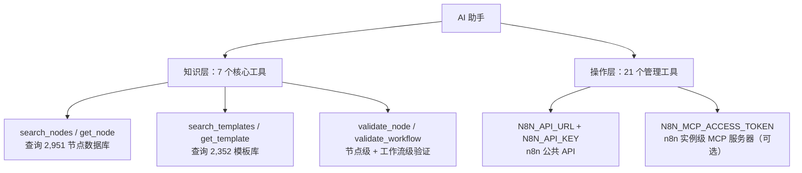

n8n-MCP 要解决的问题比"让 AI 能调用 n8n API"具体得多：AI 助手面对几千个节点、每个节点几十个参数，靠记忆写配置必然出错。它把节点文档、模板元数据和 n8n 实例管理包装成 MCP 工具，让 AI 助手在构建工作流时实时查询、验证、纠正，而不是凭训练数据猜参数。仓库地址：[czlonkowski/n8n-mcp](https://github.com/czlonkowski/n8n-mcp)，MIT 许可证。

这篇文章 2026 年 5 月初首发，当时项目刚发 v2.50.0。到 2026 年 10 月初复核时，版本走到 2.91.0，五个月打了 91 个新 tag。节点知识库在月度重建中持续膨胀，管理工具从一个只有内部口径不一致的清单，长成了一套分层接进 n8n 实例的操作台。下文全部按 2.91.0 的现行口径写，关键数字同时给出两个时点的读数。

## 先看两组数：五个月的变化

| 指标 | 发文时（2.50.0，2026-05-02） | 复核时（2.91.0，2026-10-01） |
|------|------|------|
| 节点总数 | 1,650（820 核心 + 830 社区） | 2,951（838 核心 + 2,113 社区） |
| 已验证社区节点 | 741 | 1,730 |
| 节点属性覆盖率 | 99% | 99% |
| 节点操作覆盖率 | 63.6% | 66.5% |
| 官方文档覆盖率 | 87% | 86% |
| AI 工具变体 | 265 | 267 |
| 工作流模板 | 2,352（99.96% 带 AI 元数据） | 不变 |
| n8n 管理工具 | README 标 13、实列 15 | 21 |
| 适配的 n8n 版本 | 2.18.4 | 2.41.4 |

社区节点从 830 涨到 2,113 是最大的一处膨胀——社区节点目录经过了整体刷新，2,113 个里有 2,100 个带文档摘要（其余 13 个来自不发布 README 的 npm 包）。模板库倒是稳住了：2,352 个模板一个没涨，官方把力气花在了节点库和实例集成上。

这些数字全部来自 README 当前口径。覆盖率类的数字（99%、66.5%）是项目自己对自家数据库的统计，没有独立第三方复核，看个量级就好。

## 系统总览：两层工具，两种凭证

n8n-MCP 的工具面可以按"需不需要连接 n8n 实例"一刀切成两层：


```mermaid
graph TD
    A["AI 助手"] --> B["知识层：7 个核心工具"]
    A --> C["操作层：21 个管理工具"]
    B --> B1["search_nodes / get_node\n查询 2,951 节点数据库"]
    B --> B2["search_templates / get_template\n查询 2,352 模板库"]
    B --> B3["validate_node / validate_workflow\n节点级 + 工作流级验证"]
    C --> C1["N8N_API_URL + N8N_API_KEY\nn8n 公共 API"]
    C --> C2["N8N_MCP_ACCESS_TOKEN\nn8n 实例级 MCP 服务器（可选）"]
```

| 层 | 工具数 | 凭证要求 | 典型场景 |
|------|:---:|------|------|
| 知识层 | 7 | 不需要 | 设计阶段：查节点文档、搜模板、验证配置 |
| 操作层（公共 API） | 大部分 | `N8N_API_URL` + `N8N_API_KEY` | 部署阶段：创建、更新、执行工作流，管凭证 |
| 操作层（实例级 MCP） | 6 个 ⚑ | 另配 `N8N_MCP_ACCESS_TOKEN` | 进阶：管 n8n Agents、解析节点动态下拉选项 |

知识层是所有操作的起点——不管新建还是修改工作流，AI 助手都得先从节点数据库里查出配置方式。操作层里有个五个月里的重要变化：n8n 自己在 2.34 版本后带上了实例级 MCP 服务器，n8n-MCP 从 2.75.0 起可以接上它，解锁公共 API 做不到的几件事（后文细说）。实例级 token 的覆盖面比想象的大：`n8n_manage_agents`、`n8n_explore_node_resources` 整体依赖它，`n8n_list_catalog` 的项目列表回退、`n8n_test_workflow` 的 prepare/pinned/direct 三档、`n8n_manage_datatable` 的改列操作、`n8n_workflow_versions` 的 native 历史，也都走这条路——下表用 ⚑ 标出。

## 知识层：7 个核心工具

### `tools_documentation`

获取所有 MCP 工具的使用文档。AI 助手启动后的第一步通常是调用它，了解每个工具的输入输出格式和约束。

```
tools_documentation()
```

### `search_nodes`

全文搜索所有 n8n 节点：

```json
search_nodes({
  "query": "slack notification",
  "includeExamples": true
})
```

`includeExamples: true` 会返回从热门模板里提取的真实配置——这类配置共 156 条，按热度排序，覆盖面随节点流行度浮动。社区节点可以用 `source` 参数过滤：

```json
search_nodes({
  "query": "openai",
  "source": "verified"
})
```

`source: "verified"` 只返回通过验证的 1,730 个社区节点；不传则搜全部 2,951 个。

### `get_node`

统一节点信息查询工具，按模式和细节级别取内容：

```json
// 获取基本信息（默认，detail: "standard"）
get_node({ "nodeType": "n8n-nodes-base.slack", "detail": "standard" })

// 极简元数据（约 200 tokens）
get_node({ "nodeType": "n8n-nodes-base.slack", "detail": "minimal" })

// 完整信息（约 3000-8000 tokens）
get_node({ "nodeType": "n8n-nodes-base.slack", "detail": "full" })

// 人类可读的 Markdown 文档
get_node({ "nodeType": "n8n-nodes-base.slack", "mode": "docs" })

// 搜索特定属性（如认证相关）
get_node({
  "nodeType": "n8n-nodes-base.slack",
  "mode": "search_properties",
  "propertyQuery": "auth"
})

// 版本信息与迁移指南
get_node({ "nodeType": "n8n-nodes-base.slack", "mode": "versions" })
```

2.75.0 起有个实用增强：`standard` 级别会标记动态属性（`dynamicOptions` 字段），提示哪些属性的选项要靠运行时拉取（比如 Slack 的频道列表）——这类属性正是 AI 凭空编 ID 的高发区。配套的新工具 `n8n_explore_node_resources` 可以用真实凭证把这些动态选项解析成实际存在的 ID（见操作层一节）。

节点类型前缀有讲究：LangChain 系节点用 `@n8n/n8n-nodes-langchain.` 前缀（如 `@n8n/n8n-nodes-langchain.agent`），核心节点用 `n8n-nodes-base.` 前缀。

### `validate_node`

节点配置验证。这里容易混淆的是两个维度：`mode` 控制验证的深度，`profile` 控制校验的严格取向。

- `mode: "minimal"`——只查必填字段，100 毫秒内出结果，适合构建前快速过一遍
- `mode: "full"`——完整验证，配 `profile` 使用：`runtime`（贴运行时行为，带修复建议）、`ai-friendly`（默认档，面向 AI 助手给建议）、`strict`（最严）、`minimal`（最宽）

```json
// 快速检查
validate_node({
  "nodeType": "n8n-nodes-base.slack",
  "config": {"resource": "message", "operation": "post"},
  "mode": "minimal"
})

// 完整验证（runtime 档，带修复建议）
validate_node({
  "nodeType": "n8n-nodes-base.slack",
  "config": {"resource": "message", "operation": "post"},
  "mode": "full",
  "profile": "runtime"
})
```

`ai-friendly` 是源码里的默认 profile，不需要显式传。README 另有一套跨工具的验证策略：`validate_node(minimal)` → `validate_node(full)` → `validate_workflow`，建完再上部署后检查——那是流程层面的"三级"，和参数里的 mode/profile 是两回事。

关于默认值，README 的原话值得照录："Default parameter values are the #1 source of runtime failures"（默认参数值是运行时失败的第一大来源）。官方给的例子：Slack 发消息只配 `resource: "message", operation: "post", text: "Hello"` 会在运行时失败，必须显式写 `select: "channel", channelId: "C123"`。AI 助手构建工作流时应显式配置所有控制节点行为的参数。

### `validate_workflow`

工作流完整性验证，覆盖连接有效性、表达式语法、AI Agent 配置：

```json
validate_workflow(workflow)
```

连接和表达式不是独立工具，而是它的 `options` 开关：`validateNodes` / `validateConnections` / `validateExpressions` 三项默认全开，可以按需关掉。README 的 Claude Project 指令里仍以 `validate_workflow_connections(workflow)`、`validate_workflow_expressions(workflow)` 的独立调用形式出现——那是滞后于源码的旧写法，实际按 options 传参。

### `search_templates`

模板搜索，四种模式：

```json
// 按关键词（默认 searchMode: "keyword"）
search_templates({ "query": "slack notification" })

// 按任务类型
search_templates({ "searchMode": "by_task", "task": "webhook_processing" })

// 按节点类型
search_templates({
  "searchMode": "by_nodes",
  "nodeTypes": ["n8n-nodes-base.slack"]
})

// 按元数据过滤
search_templates({
  "searchMode": "by_metadata",
  "complexity": "simple",
  "maxSetupMinutes": 30,
  "targetAudience": "developers"
})
```

元数据过滤是 99.96% AI 标注覆盖率的用武之地——AI 助手不用读整个工作流 JSON，靠复杂度、预计搭建时长、目标受众、所需服务这几个字段就能筛模板。几种现成的组合：

| 场景 | 参数组合 |
|------|---------|
| 初学者 | `complexity: "simple"` + `maxSetupMinutes: 30` |
| 非技术角色 | `targetAudience: "marketers"` |
| 快速上手 | `maxSetupMinutes: 15` |
| AI 集成 | `requiredService: "openai"` |

### `get_template`

获取完整工作流 JSON，三种模式：

```json
get_template("template-id", { "mode": "nodes_only" })  // 仅节点列表
get_template("template-id", { "mode": "structure" })   // 工作流结构
get_template("template-id", { "mode": "full" })        // 完整 JSON，可直接部署
```

用模板建工作流时有一条硬性规则：必须署名模板作者——"Based on template by **[author.name]** (@[username]). View at: [url]"。README 把这条写成 MANDATORY ATTRIBUTION，AI 助手的系统指令里也带了。

## 操作层：21 个管理工具

这层工具需要配置 `N8N_API_URL` 和 `N8N_API_KEY`（n8n 实例 Settings → API 里生成）。发文时 README 标"13 个工具"、实际列出 15 个（官方自己的口径就没对齐）；现行 README 标 21 个、实列 21 个，分组也清晰了：

| 分组 | 工具 | 说明 |
|------|------|------|
| 工作流（10 个） | `n8n_create_workflow` / `n8n_get_workflow` / `n8n_update_full_workflow` / `n8n_update_partial_workflow` / `n8n_delete_workflow` / `n8n_list_workflows` / `n8n_validate_workflow` / `n8n_autofix_workflow` / `n8n_workflow_versions` ⚑ / `n8n_deploy_template` | 增删改查、验证、自动修复、版本回滚（⚑ 仅 native 历史选项）、从 n8n.io 直接部署模板 |
| 节点资源发现 | `n8n_explore_node_resources` ⚑ | 用真实凭证解析节点的动态下拉（loadOptions）与资源定位器搜索（listSearch）——Slack 频道、Google Sheets 工作表、模型列表——让配置里写的是真实存在的 ID 而非编造值 |
| 执行（3 个） | `n8n_test_workflow` ⚑ / `n8n_executions` / `n8n_evaluations` | 触发测试执行（⚑ 仅 prepare/pinned/direct 三档）、执行记录管理、运行与读取评估测试 |
| 文件夹 | `n8n_manage_folders` | 工作流文件夹管理（n8n 2.19+） |
| 数据表 | `n8n_manage_datatable` ⚑ | n8n 数据表的行列增删改查（⚑ 仅改列操作走实例级） |
| 凭证 | `n8n_manage_credentials` | 凭证 CRUD 与 schema 查询 |
| 安全审计 | `n8n_audit_instance` | 结合 n8n 内置 audit API 与深度工作流扫描 |
| Agents | `n8n_manage_agents` ⚑ | 管理 n8n Agents（持久化助手：模型、指令、工具、任务、记忆、渠道） |
| 系统 | `n8n_health_check` / `n8n_list_catalog` ⚑ | 连接与功能检查（含实例级 MCP 状态）；列出实例级项目或标签（⚑ 项目回退走实例级） |

带 ⚑ 的功能需要额外的 `N8N_MCP_ACCESS_TOKEN`——这是 2.75.0（2026-08-28）加入的实例级 MCP 集成：n8n 2.34+ 的实例自带一个 MCP 服务器，在实例的 Settings → Instance-level MCP 里启用并取 token（与 `N8N_API_KEY` 是两个独立凭证），n8n-MCP 的实例级 MCP 端点直接从 `N8N_API_URL` 派生，不用单独配地址。公共 API 做不到的事走这条路：改数据表已建好的列、跑没有 webhook 触发器的工作流、管 Agents。

`n8n_test_workflow` 的 `method` 参数值得一说：`auto`（默认）走 HTTP 触发 webhook/form/chat；`prepare`/`pinned`/`direct` 三档走实例级 MCP，专治没有 HTTP 触发器的工作流。`n8n_workflow_versions` 也分了双历史：`source: "local"` 是 n8n-MCP 自己在每次改动前拍的快照（默认），`source: "native"` 是 n8n 自带的、包含 UI 手工编辑在内的历史。

源码里还有两个 README 没列的系统工具：`n8n_diagnostic`（环境感知的故障诊断）和 `n8n_list_available_tools`（按当前配置列出可用工具）——排查连接问题时直接调它们比翻文档快。

### diff 更新与 IF 分支

改工作流推荐 `n8n_update_partial_workflow` 而不是全量覆盖，一次调用可以打包多个操作：

```json
n8n_update_partial_workflow({
  "id": "wf-123",
  "operations": [
    {"type": "updateNode", "nodeId": "slack-1", "changes": {"parameters": {"text": "新文案"}}},
    {"type": "cleanStaleConnections"}
  ]
})
```

两个高频坑，README 都用了 CRITICAL 级别的标题：

**`addConnection` 必须四个独立字符串参数**（出处：[issue #327](https://github.com/czlonkowski/n8n-mcp/issues/327)）：

```json
{
  "type": "addConnection",
  "source": "node-id-string",
  "target": "target-node-id-string",
  "sourcePort": "main",
  "targetPort": "main"
}
```

**IF 节点必须用 `branch` 参数指定输出**。IF 节点有 TRUE/FALSE 两个输出口，省略 `branch` 两条连接可能挂到同一个出口，逻辑就错了：

```json
{"type": "addConnection", "source": "If Node", "target": "True Handler",
 "sourcePort": "main", "targetPort": "main", "branch": "true"}
{"type": "addConnection", "source": "If Node", "target": "False Handler",
 "sourcePort": "main", "targetPort": "main", "branch": "false"}
```

## 一个任务如何流过系统

用一个具体任务把两层工具串起来：让 AI 助手建一个"收到 GitHub webhook，issue 带 bug 标签就发 Slack 通知"的工作流。下面的调用序列是真实工具与真实参数，工具的返回输出做了示意化简写：

```text
1. [知识层] tools_documentation()
   → 确认可用工具清单和调用方式

2. [知识层] search_templates({query: "github slack notification"})
   → 命中若干模板，挑一个含 GitHub Trigger + IF + Slack 的 simple 模板

3. [知识层] get_template("<模板ID>", {mode: "structure"})
   → 确认节点拓扑：GitHub Trigger → IF → Slack
     IF 节点有两个输出分支（TRUE/FALSE）

4. [知识层] get_node({nodeType: "n8n-nodes-base.github",
             detail: "standard"})
   → 查看 GitHub Trigger 的 event 参数可选值

5. [知识层] validate_node({nodeType: "n8n-nodes-base.github",
             config: {event: "issues", ...}, mode: "minimal"})
   → 必填字段通过

6. [知识层] validate_node({nodeType: "n8n-nodes-base.if", ...,
             mode: "full"})
   → 发现标签匹配条件写 contains "bug" 可能误命中 "debug"，
     改成正则匹配后通过

7. [知识层] get_node({nodeType: "n8n-nodes-base.slack",
             mode: "search_properties", propertyQuery: "auth"})
   → 确认需要 Bot Token 类凭证

8. [操作层] n8n_create_workflow({name: "...", nodes: [...],
             connections: {...}})
   → 在 n8n 实例创建工作流

9. [操作层] n8n_validate_workflow({id: "wf_abc123"})
   → 连接有效、表达式正确、凭证未配置

10. [操作层] n8n_manage_credentials({action: "create", ...})
    → 凭证创建完成

11. [操作层] n8n_test_workflow({workflowId: "123"})
    → 测试执行通过
```

第 6 步是 n8n-MCP 设计意图的缩影：AI 助手最容易在"labels 是数组却用字符串 contains"这类地方埋下运行时才爆的雷，验证层把这些雷提前到配置阶段。如果第 4 步查到的属性带 `dynamicOptions` 标记（比如要填频道 ID），第 7 步之后还可以加一步 `n8n_explore_node_resources`，用真实凭证把合法 ID 拉出来再落配置。

## Claude Project 最佳配置

README 的 Claude Project Setup 节内嵌了一套针对 Claude Projects 的系统指令（注意：仓库根目录的 `CLAUDE.md` 是给参与开发的开发者看的构建指南，不是这份指令），推荐保存到 Claude Project 配置使用。核心原则五条：

1. **静默执行**：工具调用期间不输出说明文字，全部完成后统一响应
2. **并行执行**：相互独立的操作并行调用
3. **模板优先**：先搜模板（2,352 个可用），再考虑从零构建
4. **多级验证**：`validate_node(minimal)` → `validate_node(full)` → `validate_workflow` 递进
5. **绝不信任默认值**：所有控制节点行为的参数显式配置

配套的推荐工作流：`tools_documentation()` 起步 → 按复杂度/任务/关键词搜模板 → 没有合适模板就 `search_nodes` + `get_node` 逐节点配置 → `validate_node` 两级验证 → `get_template(mode: "full")` 取完整 JSON → `validate_workflow` → `n8n_create_workflow` 部署 → `n8n_validate_workflow` 复查。部署后还有第四级：`n8n_autofix_workflow` 自动修常见错误，`n8n_executions` 盯执行状态。

指令里还写明了模板署名规则和 Code 节点的使用纪律——能用标准节点就不写代码，Code 节点是最后手段；任何节点都能当 AI 工具用，不限标注过的那些。

## 安装与部署

### 最快上手（无需安装）

访问 **[dashboard.n8n-mcp.com](https://dashboard.n8n-mcp.com)**：免费额度每天 100 次工具调用，注册拿 API key 接到任意 MCP 客户端即可，节点和模板数据由官方保持最新。

### npx（本地运行）

```bash
npx n8n-mcp
```

Claude Desktop 配置（`~/Library/Application Support/Claude/claude_desktop_config.json`）：

```json
{
  "mcpServers": {
    "n8n-mcp": {
      "command": "npx",
      "args": ["n8n-mcp"],
      "env": {
        "MCP_MODE": "stdio",
        "LOG_LEVEL": "error",
        "DISABLE_CONSOLE_OUTPUT": "true"
      }
    }
  }
}
```

> ⚠️ `MCP_MODE: "stdio"` 是 Claude Desktop 的必需配置。官方文档原话：缺了它就会看到 `"Unexpected token..."` 之类的 JSON 解析错误——MCP 协议走 stdin/stdout 传 JSON-RPC，任何混进 stdout 的日志输出都会污染协议消息。`LOG_LEVEL: error` 和 `DISABLE_CONSOLE_OUTPUT: true` 就是为此把日志输出压到最低。

如果同时跑多个 MCP 客户端（比如 Claude Desktop + Claude Code）都用 npx 启动，官方提示给每个客户端配不同的 `npm_config_cache` 目录，否则会撞 npm 缓存锁。

接上 n8n 实例开管理功能，在 env 里加：

```json
"N8N_API_URL": "https://your-n8n-instance.com",
"N8N_API_KEY": "your-api-key"
```

实例跑在本机的话，n8n 官方默认端口是 5678；Docker 里跑的 n8n-MCP 访问宿主机用 `http://host.docker.internal:5678`，并且要在 SSRF 门禁里放行 localhost（见安全一节）。

### Docker

日常挂 Claude Desktop 用 stdio 形式（官方推荐写法）：

```json
{
  "mcpServers": {
    "n8n-mcp": {
      "command": "docker",
      "args": ["run", "-i", "--rm", "--init",
        "-e", "MCP_MODE=stdio",
        "-e", "LOG_LEVEL=error",
        "-e", "DISABLE_CONSOLE_OUTPUT=true",
        "ghcr.io/czlonkowski/n8n-mcp:latest"]
    }
  }
}
```

远程服务器部署用 HTTP 形式，官方流程是写好 `.env` 后一行起容器：

```bash
docker run -d \
  --name n8n-mcp \
  --restart unless-stopped \
  --env-file .env \
  -p 3000:3000 \
  ghcr.io/czlonkowski/n8n-mcp:latest

curl http://localhost:3000/health   # 验证部署
```

镜像约 280 MB，官方自述比典型 n8n 镜像小 82%，因为它不含 n8n 依赖、只带运行时和预构建节点数据库。详细配置见 [HTTP Deployment 文档](https://github.com/czlonkowski/n8n-mcp/blob/HEAD/docs/HTTP_DEPLOYMENT.md)（含只读部署配方）和根目录的 [N8N HTTP Streamable Setup](https://github.com/czlonkowski/n8n-mcp/blob/HEAD/N8N_HTTP_STREAMABLE_SETUP.md)。

### Railway

仓库带 Railway 部署按钮和独立的 `Dockerfile.railway`，部署说明在 `docs/RAILWAY_DEPLOYMENT.md`。

## 支持的 IDE

README 的 Connect your IDE 节给了六份官方配置文档，都在 `docs/` 目录：

- **Claude Code**（`CLAUDE_CODE_SETUP.md`）——命令行，适合 CI/CD
- **Visual Studio Code**（`VS_CODE_PROJECT_SETUP.md`）——GitHub Copilot 集成
- **Cursor**（`CURSOR_SETUP.md`）
- **Windsurf**（`WINDSURF_SETUP.md`）——含项目级规则配置
- **Codex**（`CODEX_SETUP.md`）
- **Antigravity**（`ANTIGRAVITY_SETUP.md`）

Claude Desktop 虽不在这份清单里，却是 README 部署文档的主客户端，配置见上一节。另有 [n8n-skills](https://github.com/czlonkowski/n8n-skills) 仓库提供 Claude Skills 增强包，教 AI 助手写生产级工作流的专门技巧。

## 安全注意事项

README 顶部有一条加粗警示，条目如下：

> **⚠️ 永远不要直接在生产环境工作流上用 AI 编辑！** 始终：
> - 操作前创建工作流副本
> - 先在开发环境测试
> - 导出重要工作流的备份
> - 部署前验证变更

五个月里安全面扩了不少，几个值得企业部署留意的点：

- **只读部署**：`DISABLED_TOOLS` 整工具级禁用（2.56.0 起），`DISABLED_TOOL_OPERATIONS` 细到单工具内的单个操作（2.60.0 起）——比如只禁 `n8n_executions` 的 `delete`、保留 `list` 和 `get`。README 现在直接给了一份完整的只读部署配方，连容易漏的细节都写了：`n8n_test_workflow` 的四个 method 值里有三个会真跑工作流，`expose` 不是普通操作而是"把工作流标记为 MCP 可用"的同意写入，漏禁它等于留了后门。再配一把只读的 n8n API key 做纵深防御。
- **SSRF 门禁**：`N8N_API_URL` 经过 SSRF 校验，本地 n8n（localhost / 内网地址）默认被拦，需要在配置里显式放行——这是防止 MCP 服务器被诱导访问内网的标准动作。
- **实例级 token 的边界**：`N8N_MCP_ACCESS_TOKEN` 只发往 `N8N_API_URL` 同源，webhook 若走另一个域名（拆分的 `WEBHOOK_URL`）不会带上它，官方明说是为了防 token 泄漏。
- **Cloudflare Access**：n8n 实例在 Cloudflare Zero Trust 后面时，配 `N8N_CF_CLIENT_ID` / `N8N_CF_CLIENT_SECRET` 服务令牌（2.64.0 起）。

配套文档：`docs/SECURITY_HARDENING.md`（信任模型与加固选项）、`THREAT_MODEL.md`、`PRIVACY.md`（遥测内容与退出方式）。

## 架构设计

从源码看，`src/` 顶层按职责切了十八个目录，五个月里结构稳定（发文时的文章把 `handlers/`、`nodes/` 画进了目录树，这两个目录实际不存在——工具处理器在 `src/mcp/` 里，节点数据在 `src/data/` 和仓库根的 SQLite 数据库里）：

```text
src/
├── mcp/            # MCP 协议入口与工具处理器
├── services/       # 核心服务（验证、节点库、模板、凭证…）
├── n8n/            # n8n API 客户端
├── database/       # SQLite 适配层
├── templates/      # 模板处理
├── community/      # 社区节点目录抓取与文档生成
├── data/           # 节点数据管理
├── loaders/ parsers/ mappers/   # 数据装载、解析、映射
├── triggers/       # 触发器处理
├── telemetry/      # 遥测（PRIVACY.md 可退出）
├── errors/ types/ config/ constants/ utils/
└── scripts/        # 数据抓取与维护脚本
```

依赖面的关键项（2.91.0 的 package.json）：`@modelcontextprotocol/sdk` 1.30.0（MCP 官方 SDK，发文时还是 1.28.0）、`n8n-core` / `n8n-nodes-base` / `n8n-workflow` / `@n8n/n8n-nodes-langchain` 四个 n8n 官方包、`zod` 做运行时校验、`express` + `express-rate-limit` 撑 HTTP 模式。

SQLite 有两个适配器：`better-sqlite3` 是可选依赖，Docker 镜像默认装它（原生绑定，官方明说是为了避免 sql.js 的内存泄漏问题）；`sql.js`（SQLite 的 wasm 实现）是编译失败时的回退，零原生依赖。节点数据库 `n8n-nodes.db` 在构建时预填充（现约 66 MiB），随 n8n 上新版本月度重建——2.91.0 的更新日志完整记录了一轮重建：新核心节点、schema 变更、社区目录刷新、六百多行版本记录，这套"节点库怎么跟上 n8n 演进"的流水线本身是项目持续维护成本的大头。依赖里的 `openai` 包不参与运行时服务，用在模板元数据和社区节点文档的生成管线上。

## 采用建议：谁该先用，谁可以等等

**推荐先用的团队：**

- 已经在用 n8n 且开发流程里有 AI 编程助手（Claude Code、Cursor 等）——从"手动查文档配节点"变成"用自然语言描述需求，AI 构建并验证"
- 工作流数量多、节点种类杂——2,951 个节点和 2,352 个模板的知识库能替 AI 助手省掉大量试错
- 正在带团队成员上手 n8n——把它当交互式学习工具，AI 助手能实时解释每个节点和参数

**可以先观望的情况：**

- n8n 场景非常固定，翻来覆去就三五个节点——手写配置更快，不值得为知识库付维护成本
- 团队还没有 MCP 生态的使用习惯——前置成本（配 MCP 服务、学工具用法）收不回来
- 工作流涉及大量敏感凭证且没有独立开发环境隔离——安全警示里写得很直白，别在生产上直接让 AI 编辑

**落地顺序：**

1. 先用 dashboard（免费额度每天 100 次），不部署、不配 API，纯体验节点查询和模板检索。
2. 在 Claude Desktop 上配 npx 模式，练几个模板改造任务，熟悉验证层怎么拦错误。
3. 接一个开发环境的 n8n 实例，开管理工具，让 AI 完整走一遍"创建 → 验证 → 测试执行"。
4. 生产引入前，按 README 的只读部署配方把写操作收进白名单，核对凭证管理与审计是否符合团队要求。

## 常见问题

**Q: n8n-MCP 和直接用 n8n REST API 有什么区别？**

直接调 REST API，你得自己知道每个节点的 type name、参数 schema 和配置约束——API 只管执行，不告诉你该填什么。n8n-MCP 在 API 上面叠了两样东西：节点知识库（2,951 个节点的 schema 与文档摘要）和验证层，AI 助手调用 API 之前先查文档、验配置、纠错误。一句话：REST API 是执行层，n8n-MCP 是"理解 + 执行"层。

**Q: 必须自托管 n8n 才能用吗？**

不需要。7 个知识层工具完全离线工作（数据内置在 SQLite 数据库里），通过 dashboard 或本地 npx 就能用；21 个管理工具才需要接 n8n 实例。

**Q: 社区节点能用吗？验证工具覆盖吗？**

2,113 个社区节点里 1,730 个通过验证、2,100 个带文档摘要。`search_nodes` 的 `source: "verified"` 可以只搜已验证的。对未验证节点，AI 助手仍能读到基本 schema，但验证与文档质量不如核心节点——生产环境建议锁定 verified 范围。

**Q: 五个月 91 个版本，会不会不稳定？**

版本号涨得快，但主体是跟着 n8n 上新节奏重建节点库加功能迭代。真正要留意的是管理工具面在快速扩张（13→21），新工具依赖的 n8n 版本也不同（文件夹要 2.19+、评估要 2.30+、Agents 要 2.34+）——部署前核对自己 n8n 实例的版本，别照抄 README 的最新功能清单。

---

## 延伸阅读

- [n8n-MCP 官方 GitHub 仓库](https://github.com/czlonkowski/n8n-mcp)
- [n8n-MCP 在线 Dashboard](https://dashboard.n8n-mcp.com)
- [Official MCP Setup](https://github.com/czlonkowski/n8n-mcp/blob/HEAD/docs/OFFICIAL_MCP_SETUP.md)——实例级 MCP 接入全流程
- [n8n 官方文档](https://docs.n8n.io)
- [Model Context Protocol 规范](https://modelcontextprotocol.io)
- [n8n-skills 仓库](https://github.com/czlonkowski/n8n-skills)（Claude Skills 增强包）
