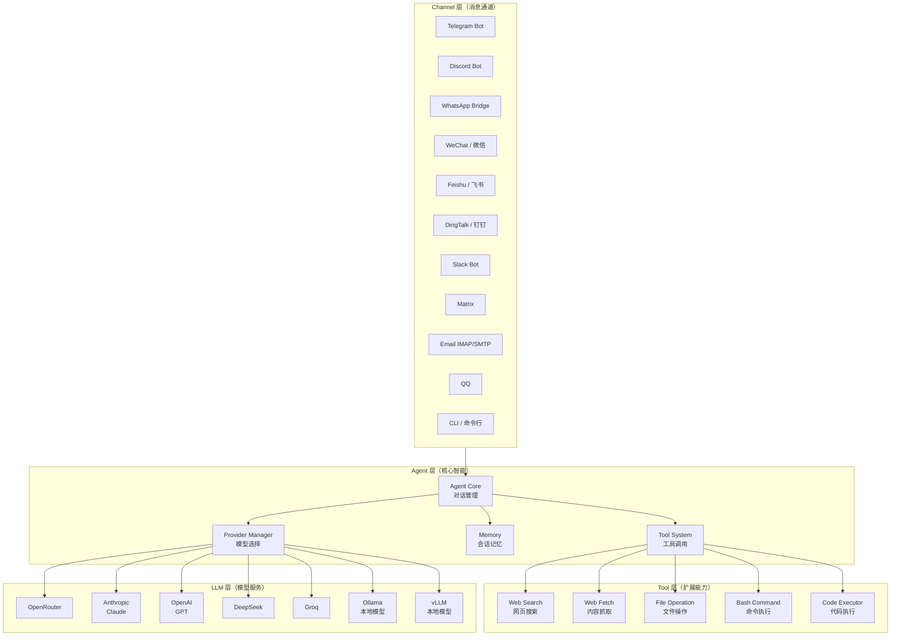
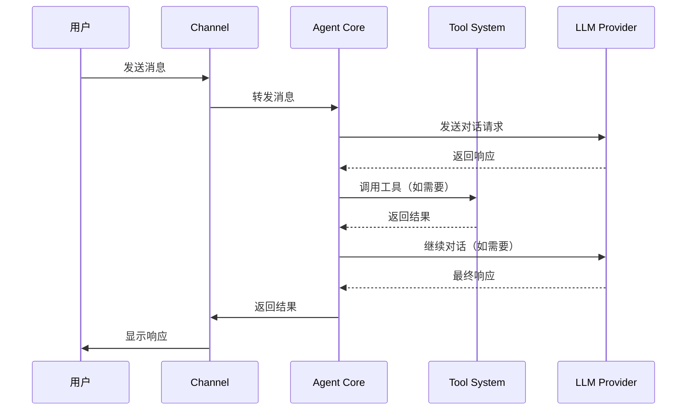

# Nanobot：超轻量级个人 AI 助手

> **目标读者**：想要掌握 Nanobot 的开发者、AI 爱好者和技术决策者
> **核心问题**：Nanobot 是什么？如何设计架构？如何定制和扩展？

---

## 1. 项目定位

### 1.1 什么是 Nanobot？

**Nanobot** 是一个**超轻量级的个人 AI 助手**，灵感来源于 OpenClaw。与 OpenClaw 相比，Nanobot 代码量减少了 **99%**，但保留了核心的 Agent 功能。

### 1.2 Nanobot 的核心定位

| 维度 | Nanobot | OpenClaw | LangChain | AutoGPT |
|------|----------|-----------|------------|----------|
| **代码量** | 极简（~1%） | 庞大 | 单体 | 单体 |
| **核心场景** | 个人 AI 助手 | 通用 Agent 平台 | LLM 应用框架 | 自主 Agent |
| **多平台支持** | ✅ 10+ 平台 | ✅ 多平台 | ❌ | ❌ |
| **Agent Runtime** | ✅ 原生 | ✅ 原生 | ✅ 支持 | ✅ 原生 |
| **记忆系统** | ✅ 内置 | ✅ 内置 | ❌ 需集成 | ❌ |
| **工具调用** | ✅ 内置 | ✅ 内置 | ✅ 支持 | ✅ 原生 |
| **学习门槛** | 低 | 高 | 中 | 高 |
| **许可证** | MIT | MIT | MIT | MIT |

### 1.3 为什么选择 Nanobot？

Nanobot 解决的实际问题：

1. **OpenClaw 太复杂**：功能强大但代码量大，学习曲线陡峭。Nanobot 保留核心功能，代码量减少 99%。
2. **部署困难**：支持一键部署，安装配置简单。
3. **多平台需求**：支持 10+ 主流聊天平台，一个 AI 助手覆盖所有。
4. **研究友好**：代码简洁易懂，方便修改和扩展，适合学术研究和二次开发。

Nanobot 坚持「少即是多」——用最少的代码实现最核心的功能，每个模块职责清晰。

### 1.4 Nanobot 的技术边界

| 能力 | Nanobot 支持 | Nanobot 不支持 |
|------|-------------|---------------|
| 多 LLM Provider | ✅ OpenRouter/Anthropic/OpenAI 等 20+ | 自定义 Provider 需实现接口 |
| 多聊天平台 | ✅ Telegram/Discord/WhatsApp/微信等 10+ | 平台官方 API 限制 |
| Agent Runtime | ✅ 工具调用/状态管理 | 无内置知识库 |
| 记忆系统 | ✅ 会话记忆 | 长期记忆需扩展 |
| Web 搜索 | ✅ 多种搜索 Provider | 无内置搜索 |
| 多 Agent 协作 | ❌ | 未来计划中 |

---

## 2. 架构分析

### 2.1 整体架构

Nanobot 采用经典的**分层架构**：



### 2.2 核心技术栈

| 组件 | 技术选型 | 说明 |
|------|---------|------|
| **语言** | Python | 简洁易读，生态丰富 |
| **包管理** | pip / uv | 快速安装 |
| **LLM 调用** | 原生 SDK | openai + anthropic 双 SDK |
| **协议** | MQTT / WebSocket | Channel 通信 |
| **配置** | JSON | `~/.nanobot/config.json` |

### 2.3 目录结构

```
nanobot/
├── nanobot/              # 核心包
│   └── src/
│       ├── __init__.py
│       ├── agent.py       # Agent 核心
│       ├── channel.py     # Channel 基类
│       ├── tools/         # 工具集
│       │   ├── __init__.py
│       │   ├── web.py     # 网页搜索/抓取
│       │   ├── file.py    # 文件操作
│       │   ├── bash.py    # 命令执行
│       │   └── code.py    # 代码执行
│       ├── memory.py      # 记忆系统
│       └── providers/    # LLM Provider
│           ├── __init__.py
│           ├── openrouter.py
│           ├── anthropic.py
│           ├── openai.py
│           └── ...
├── case/                 # 示例/案例
├── docs/                 # 文档
├── tests/               # 测试
├── bridge/              # Channel Bridge（WhatsApp/微信等）
├── pyproject.toml       # 项目配置
├── Dockerfile           # Docker 配置
└── docker-compose.yml    # Docker Compose
```

### 2.4 数据流



---

## 3. 功能详解

### 3.1 Channel 层：多平台支持

Nanobot 支持 10+ 主流聊天平台：

| 平台 | 配置需求 | 特点 |
|------|---------|------|
| **Telegram** | Bot Token | 推荐，支持媒体发送 |
| **Discord** | Bot Token + Intent | 支持 Slash Commands |
| **WhatsApp** | QR 码扫描 | Bridge 模式 |
| **微信** | QR 码扫描 | 需配合微信开放平台 |
| **飞书** | App ID + Secret | 支持 Card 消息 |
| **钉钉** | App Key + Secret | 企业内部使用 |
| **Slack** | Bot Token + App Token | 支持 Thread |
| **Matrix** | Homeserver URL + Token | 去中心化协议 |
| **Email** | IMAP/SMTP 凭证 | 支持邮件触发 |
| **QQ** | App ID + App Secret | QQ 开放平台 |
| **企业微信** | Corp ID + Agent ID | 企业场景 |
| **Mochat** | Claw Token | 简化配置 |

**Telegram 配置示例**：

```json
{
  "channels": {
    "telegram": {
      "enabled": true,
      "botToken": "123456:ABC-DEF..."
    }
  }
}
```

### 3.2 Agent 层：核心智能

**Agent** 是 Nanobot 的核心，负责：

1. **对话管理**：维护对话上下文，处理多轮对话
2. **工具调用**：根据用户意图调用相应工具
3. **记忆管理**：短期会话记忆，自动过期清理
4. **Provider 路由**：自动选择最优 LLM Provider

**Agent 配置示例**：

```json
{
  "agents": {
    "defaults": {
      "model": "anthropic/claude-sonnet-4-5",
      "provider": "openrouter",
      "temperature": 0.7,
      "maxTokens": 4096
    }
  }
}
```

### 3.3 Tool 层：扩展能力

Nanobot 内置多种工具：

| 工具 | 功能 | 示例 |
|------|------|------|
| **Web Search** | 网页搜索 | `search("今天的天气")` |
| **Web Fetch** | 内容抓取 | `fetch("https://example.com")` |
| **File Read** | 读取文件 | `read_file("/path/to/file")` |
| **File Write** | 写入文件 | `write_file("/path", "content")` |
| **Bash** | 执行命令 | `bash("ls -la")` |
| **Code Exec** | 执行代码 | `python("print('hello')")` |

**Web Search Provider 配置**：

```json
{
  "tools": {
    "web": {
      "search": "duckduckgo",
      "fetch": "native"
    }
  }
}
```

### 3.4 LLM 层：多 Provider 支持

Nanobot 支持 20+ LLM Provider：

| Provider | 模型 | 特点 |
|----------|------|------|
| **OpenRouter** | 100+ 模型 | 推荐，一站式访问 |
| **Anthropic** | Claude 3/2 | 强大推理能力 |
| **OpenAI** | GPT-4/3.5 | 生态成熟 |
| **DeepSeek** | DeepSeek Coder | 编程能力强 |
| **Groq** | LPU 加速 | 超低延迟 |
| **MiniMax** | 国产优质 | 国内访问快 |
| **Gemini** | Gemini Pro | 多模态支持 |
| **Ollama** | 本地模型 | 隐私保护 |
| **vLLM** | 本地部署 | 自托管选项 |

**Provider 优先级**：

1. 自动选择：Nanobot 自动选择最优 Provider
2. 指定 Provider：如 `provider: "openrouter"`
3. 指定模型：如 `model: "anthropic/claude-sonnet-4-5"`

---

## 4. 使用说明

### 4.1 环境准备

**前置要求**：

| 依赖 | 版本要求 | 说明 |
|------|---------|------|
| Python | ≥3.10 | 推荐 3.11+ |
| pip | ≥20.x | 包管理器 |

### 4.2 安装方式

**方式一：从源码安装（推荐）**：

```bash
git clone https://github.com/HKUDS/nanobot.git
cd nanobot
pip install -e .
```

**方式二：使用 uv（更快）**：

```bash
uv tool install nanobot-ai
```

**方式三：从 PyPI 安装（稳定版）**：

```bash
pip install nanobot-ai
```

### 4.3 快速开始

**第一步：初始化**：

```bash
nanobot onboard
```

或使用交互式向导：

```bash
nanobot onboard --wizard
```

**第二步：配置**（`~/.nanobot/config.json`）：

```json
{
  "providers": {
    "openrouter": {
      "apiKey": "sk-or-v1-xxx"
    }
  },
  "agents": {
    "defaults": {
      "model": "anthropic/claude-sonnet-4-5",
      "provider": "openrouter"
    }
  }
}
```

**第三步：开始对话**：

```bash
nanobot agent
```

### 4.4 聊天平台连接

**Telegram（推荐）**：

1. 在 @BotFather 创建 Bot，获取 Token
2. 配置 `config.json`：

```json
{
  "channels": {
    "telegram": {
      "enabled": true,
      "botToken": "YOUR_BOT_TOKEN"
    }
  }
}
```

3. 运行：`nanobot channels start telegram`

**Discord**：

1. 创建 Discord Application，添加 Bot
2. 开启 Message Content Intent
3. 配置 Token：

```json
{
  "channels": {
    "discord": {
      "enabled": true,
      "botToken": "YOUR_BOT_TOKEN"
    }
  }
}
```

**飞书**：

1. 创建飞书应用，获取 App ID 和 Secret
2. 配置：

```json
{
  "channels": {
    "feishu": {
      "enabled": true,
      "appId": "cli_xxx",
      "appSecret": "xxx"
    }
  }
}
```

### 4.5 Web 搜索配置

```json
{
  "tools": {
    "web": {
      "search": "duckduckgo",
      "fetch": "native"
    }
  }
}
```

支持的搜索 Provider：

- `duckduckgo`（默认，免费）
- `google`（需要 API Key）
- `serpapi`（需要 API Key）
- `brave`（需要 API Key）

---

## 5. 开发扩展

### 5.1 自定义 Channel

创建新的聊天平台支持：

```python
# nanobot/channel/my_platform.py
from nanobot.channel import BaseChannel

class MyPlatformChannel(BaseChannel):
    name = "myplatform"
    
    async def connect(self):
        """建立连接"""
        pass
    
    async def disconnect(self):
        """断开连接"""
        pass
    
    async def send(self, message: str):
        """发送消息"""
        pass
    
    async def receive(self) -> str:
        """接收消息"""
        pass
    
    def register_handlers(self):
        """注册消息处理器"""
        self.on_message(self.handle_message)
```

### 5.2 自定义 Tool

创建新的工具：

```python
# nanobot/tools/my_tool.py
from nanobot.tools import BaseTool

class MyTool(BaseTool):
    name = "my_tool"
    description = "执行自定义操作"
    
    async def execute(self, **params) -> str:
        """执行工具逻辑"""
        # 你的工具代码
        return "执行结果"
```

### 5.3 自定义 Provider

添加新的 LLM Provider：

```python
# nanobot/providers/my_provider.py
from nanobot.providers import BaseProvider

class MyProvider(BaseProvider):
    name = "myprovider"
    models = ["model-a", "model-b"]
    
    async def chat(self, messages, model, **kwargs):
        """发送对话请求"""
        # 你的 Provider 代码
        response = await self._request(...)
        return self._parse_response(response)
```

---

## 6. 实践建议

### 6.1 生产环境部署

**使用 Docker**：

```yaml
# docker-compose.yml
version: '3.8'
services:
  nanobot:
    build: .
    container_name: nanobot
    volumes:
      - ./config.json:/app/config.json
    environment:
      - NANOBOT_CONFIG=/app/config.json
    restart: unless-stopped
```

```bash
# 构建并运行
docker-compose up -d
```

**使用 Linux Service**：

```bash
# /etc/systemd/system/nanobot.service
[Unit]
Description=Nanobot AI Assistant
After=network.target

[Service]
Type=simple
User=nanobot
WorkingDirectory=/home/nanobot
ExecStart=/usr/local/bin/nanobot agent
Restart=always

[Install]
WantedBy=multi-user.target
```

```bash
sudo systemctl enable nanobot
sudo systemctl start nanobot
```

### 6.2 安全配置

```json
{
  "security": {
    "allowedChannels": ["telegram", "feishu"],
    "allowedUsers": ["user_id_1", "user_id_2"],
    "rateLimit": {
      "enabled": true,
      "maxPerMinute": 10
    }
  }
}
```

**安全检查清单**：

- [ ] API Keys 存储在环境变量或密钥管理服务
- [ ] 限制允许的 Channel 和用户
- [ ] 启用速率限制防止滥用
- [ ] 定期更新 Nanobot 到最新版本

### 6.3 性能优化

| 优化项 | 建议 | 实现方式 |
|--------|------|----------|
| **本地模型** | 使用 Ollama | 隐私保护，零延迟 |
| **缓存响应** | 启用响应缓存 | 减少 API 调用 |
| **并发限制** | 限制并发数 | 防止 API 超出限制 |

---

## 7. 常见问题

### Q1: Nanobot 和 OpenClaw 有什么区别？

| 维度 | Nanobot | OpenClaw |
|------|---------|----------|
| **代码量** | 极简（~1%） | 庞大 |
| **学习门槛** | 低 | 高 |
| **功能** | 核心功能 | 完整功能 |
| **扩展性** | 一般 | 强 |
| **适用场景** | 个人使用、研究 | 企业级应用 |

### Q2: 如何选择 LLM Provider？

- **新手推荐**：OpenRouter，一站式访问 100+ 模型
- **国内用户**：MiniMax、DeepSeek（访问快）
- **编程任务**：DeepSeek Coder、Codex
- **隐私敏感**：Ollama（本地部署）

### Q3: 支持中文吗？

✅ 支持。Nanobot 本身语言无关，配置中文模型（如 `qwen/qwen-2-7b`）即可。

### Q4: 如何调试问题？

```bash
# 查看详细日志
nanobot agent --debug

# 测试 Channel 连接
nanobot channels test telegram

# 查看配置
nanobot config show
```

---

## 8. 总结

### 核心要点

1. **超轻量级**：代码量减少 99%，核心功能完整
2. **多平台支持**：10+ 主流聊天平台
3. **模块化架构**：Channel 层、Agent 层、Tool 层、LLM 层解耦
4. **多 Provider**：支持 20+ LLM Provider
5. **简单易用**：安装配置快捷

### 资源链接

| 资源 | 链接 |
|------|------|
| **GitHub 仓库** | https://github.com/HKUDS/nanobot |
| **PyPI 包** | https://pypi.org/project/nanobot-ai/ |
| **文档** | README.md |
| **问题反馈** | https://github.com/HKUDS/nanobot/issues |
| **社区** | Discord / Feishu / WeChat |

---

*文档信息：Nanobot v0.1.4.post6 | 更新日期：2026-03-30*
