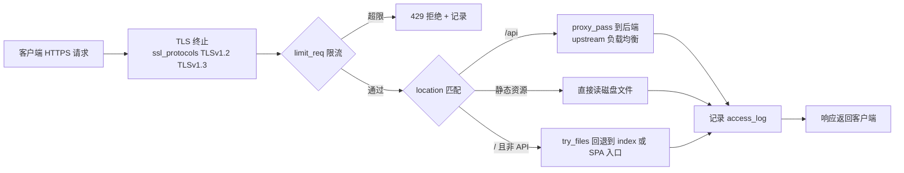

# Nginx 1.31 安全修复与现代部署：22 年反向代理的常青之道

2026 年 5 月，Nginx 连续发布多条安全修复，焦点都落在 ngx_http_rewrite 模块。5 月 22 日，主线版 1.31.1 与稳定版 1.30.2 同批放出，一起修复了该模块的堆缓冲区溢出漏洞 CVE-2026-9256；更早一公告披露、代号 "Nginx Rift" 的同类堆溢出 CVE-2026-42945 已随 1.31.0 修复。对还在跑老版本 rewrite 的服务器，这两条都不能跳过。

因为 CVE 上热搜是 Nginx 的常态——它不像前端工具链那样有范式更替，但只要有安全公告，运维圈就会集体升一轮。

## 1.31.1 修复了什么

1.31.1 与 1.30.2 都是纯安全修复版本，核心是 rewrite 模块的堆缓冲区溢出：

- **CVE-2026-9256**：ngx_http_rewrite 模块的堆缓冲区溢出，影响主线 0.1.17 到 1.31.0、稳定 0.1.17 到 1.30.1。官方按 CVSS 4.0 评 9.2（严重）、CVSS 3.1 评 8.1（高危）；NVD 独立评估为 7.5（高危），主要视为拒绝服务。直接升级到 1.31.1 或 1.30.2+。
- 触发不需要多绕：一条 `rewrite` 用了重叠的正则捕获组（如 `^/((.*))$`），替换串又同时引用多个捕获（如 `$1$2`），走 `redirect` 或 query string 分支时缓冲区长度被低估，多次捕获叠加就写穿了堆。未经认证的远程请求可打崩 worker；配合堆内容泄露和 ASLR 绕过，能升级到代码执行。
- 前一波的 rewrite 模块漏洞 CVE-2026-42945（即 "Nginx Rift"）已随 1.31.0 修复，1.31.1 自带该修复。

影响面看的是 rewrite 是否真的用了"重叠捕获 + 多捕获引用"这种写法，而不是有没有 rewrite 指令。粗分几档：只 `proxy_pass`、不带 rewrite 的最稳；`try_files` 回退 SPA、rewrite 只做干净跳转的次之；rewrite 带正则捕获且替换串引用多个捕获的，才是高危面。这个分级只帮你判断先修哪批，别反过来推导"我这个不升也行"——只要在受影响版本区间（主线 0.1.17–1.31.0、稳定 0.1.17–1.30.1），就该升。

## 为什么 2026 年还在用 Nginx

在 K8s 主导的时代，Nginx 的位置看似被 Envoy、Istio、Traefik 抢了。但扣除这些新场景，它依然把守着传统入口和反向代理的基本盘：

| 场景 | 主流选择 | 说明 |
|------|----------|------|
| 传统 Web 服务器 | Nginx | 稳定、文档多、CDN 默认支持 |
| Kubernetes Ingress | Nginx Ingress Controller、Traefik、Envoy Gateway | K8s 生态的分叉点 |
| API Gateway | Kong Gateway、APISIX（均基于 OpenResty/Nginx） | 在 Nginx 之上长出的商业层 |
| Service Mesh 数据面 | Envoy | 必须支持 xDS，Nginx 不做这层 |
| CDN 边缘 | 自研引擎（Cloudflare Pingora、Fastly 等） | 头部厂商基本弃用 Nginx 魔改 |

Nginx 在 AI 时代的用途，主要落在"入口代理"这一层，而不是业务网关：

- **AI Agent 网关**：很多团队把 LLM API 代理、token 限速、计费用 Nginx + Lua（OpenResty）。比 Kong 这类完整网关更轻，没有数据库依赖，配置可以纯文件进 git。
- **内网 LLM 推理服务入口**：vLLM、Ollama 的对外暴露层常用 Nginx 做 TLS 终止、限流、鉴权。
- **轻量反向代理**：个人项目、内网服务，一个 Nginx 或 Caddy 就够，不需要引入整套服务网格。

这几类用途落到配置上都很薄，核心通常就三段：`limit_req` 限速、`proxy_pass` 转发、TLS 终止。比如一个最小的 LLM API 代理：

```nginx
limit_req_zone $binary_remote_addr zone=llm:10m rate=10r/s;

server {
    listen 443 ssl;
    server_name llm.example.com;
    ssl_protocols TLSv1.2 TLSv1.3;
    ssl_certificate     /etc/nginx/llm.crt;
    ssl_certificate_key /etc/nginx/llm.key;

    location /v1 {
        limit_req zone=llm burst=20 nodelay;   # 超速直接 429，不落后端
        proxy_pass https://upstream-llm;        # 后端 vLLM / Ollama
        proxy_set_header Authorization $http_authorization;
    }
}
```

`limit_req_zone` 先在全局按 IP 建了一个限速桶（10 次/秒），`location` 里 `limit_req ... nodelay` 决定超速直接拒绝而不是排队。对 LLM 接口，这比到后端再限流省一次体量最大的推理调用。

## 与 Caddy / Traefik 的对比

| 维度 | Nginx | Caddy | Traefik |
|------|-------|-------|---------|
| 配置方式 | 文本 + reload | Caddyfile / API | TOML / label / API |
| 自动 HTTPS | 需 certbot | 内置（Let's Encrypt） | 内置（ACME） |
| 配置热加载 | reload（优雅，不中断连接） | reload（无中断） | 无中断动态 |
| 性能 | 高 | 中 | 中 |
| 学习曲线 | 中 | 低 | 低 |
| 生态 / 文档 | 极多 | 较少 | 较多 |

Nginx 的 `reload` 不是重启：它重读配置、优雅地让老 worker 处理完正在进行的连接后退出，新 worker 带着新配置接手，所以不中断在途请求。改完先在机器上 `nginx -t` 验证语法，再 `nginx -s reload` 让改动生效。

选型建议：个人或小团队直接上 Caddy，零运维；大流量生产环境 Nginx 仍然是性能与生态的首选；K8s 微服务用 Traefik 或 Envoy Gateway；需要完整 API 网关功能（限流、鉴权、计费、Dashboard）再上 Kong 这类基于 OpenResty 的产品。

## 一个请求怎么穿过 Nginx

用一个最常见的场景串一遍：一个静态站 + 后端 API 的入口，Nginx 同时做 TLS 终止、路由、限流。请求进来后依次经过：



把这个链路拆开看：

- **TLS 终止**在进入业务逻辑前完成，后端只跑明文 HTTP，证书只维护在 Nginx 一处。
- **限流**在路由之前，`limit_req_zone` 按 key（通常是 IP 或 API key）计数，超了直接 429，不落到后端。
- **路由**靠 `location` 匹配决定走 proxy、静态文件还是 SPA 回退，这是 `try_files` + rewrite 最常被用到的地方——也正是 rewrite 类漏洞的暴露面。
- **日志**统一出口，access_log 用 json 格式，方便接 Loki/ELK。

这一段不是让你照抄，而是理解 Nginx 的请求处理顺序：limit 在 location 之前，location 在 proxy 之前，所有输出都过 access_log。排查问题先按这个顺序看。

## 上手与升级

升级到 1.31.1：

```bash
# 注意：Debian/Ubuntu 官方仓库装的是 stable 分支（如 1.30.x，已含安全修复）
# 要装 mainline 1.31.x，需先加 nginx.org 官方源
sudo nginx -t      # 验证配置语法
sudo nginx -s reload   # 优雅 reload，不中断在途连接
```

容器场景（mainline 镜像）：

```dockerfile
FROM nginx:1.31.1-alpine
COPY nginx.conf /etc/nginx/nginx.conf
COPY dist/ /usr/share/nginx/html/
```

K8s 场景注意：Ingress-NGINX Controller 是独立版本线（v1.x），跟 nginx mainline 的 1.31.x 不是一回事，要不要升级得看它自己发布的镜像版本：

```bash
kubectl set image deployment/ingress-nginx-controller \
  controller=registry.k8s.io/ingress-nginx-controller:v1.13.0
kubectl rollout status deployment/ingress-nginx-controller
```

## 实践建议

1. **配置版本管理**：`nginx.conf` 永远进 git，改完先 `nginx -t` 再 `nginx -s reload`，别在生产裸 reload。
2. **日志结构化**：access_log 用 json 格式，方便接 Loki/ELK。
3. **限流必开**：`limit_req_zone` + `limit_conn_zone`，防止被 LLM 客户端刷爆。
4. **TLS 1.3 默认**：1.25.1 起 `ssl_protocols` 默认就含 TLSv1.3，老版本需要显式 `ssl_protocols TLSv1.2 TLSv1.3`。
5. **动态 upstream**：用 `resolver` + `set $backend` 做服务发现，比硬编码 upstream 灵活。前提是 `proxy_pass` 里用变量时必须先配好 `resolver`，否则启动会报错。

升完不确定自己有没有暴露面，可以先扫一遍 rewrite 里的多捕获引用：

```bash
# 找出替换串同时引用多个捕获组（$1$2…）的 rewrite 规则
grep -rnP 'rewrite\s+.*\$\d+\$\d+' /etc/nginx/
```

命中不等于已遭到利用，但一旦版本又落在受影响区间，就该升级，升级后务必备一条重叠捕获的规则做冒烟测试，确认正则分支没被改坏。

## 什么时候该用它、什么时候不用

- **个人 / 小团队 / 内网服务**：直接上 Caddy，自动 HTTPS 省掉 certbot 那套，配置更少。
- **大流量生产、已有 Nginx 存量、需要精细控制**：留在 Nginx，它的性能、文档和成熟度是现成的。
- **K8s 微服务**：用 Traefik 或 Envoy Gateway，跟云原生生态贴合。
- **要 API 网关那一层**（限流、鉴权、计费、Dashboard）：在 Nginx 之上加 OpenResty，或直接上 Kong。

一个判断顺序：先看你在哪一层——传统入口、Ingress、还是 API 网关；再看你要的是"少配置"还是"多控制"。Caddy 的取舍是省事，Nginx 的取舍是掌控，两者适合不同的人，谈不上谁更好。

## 参考资源

- 仓库：[github.com/nginx/nginx](https://github.com/nginx/nginx)
- 安全公告：[nginx.org/en/security_advisories.html](https://nginx.org/en/security_advisories.html)
- OpenResty（Lua 增强）：[openresty.org](https://openresty.org/)
- Ingress-NGINX 迁移指南：[kubernetes.github.io/ingress-nginx](https://kubernetes.github.io/ingress-nginx/)