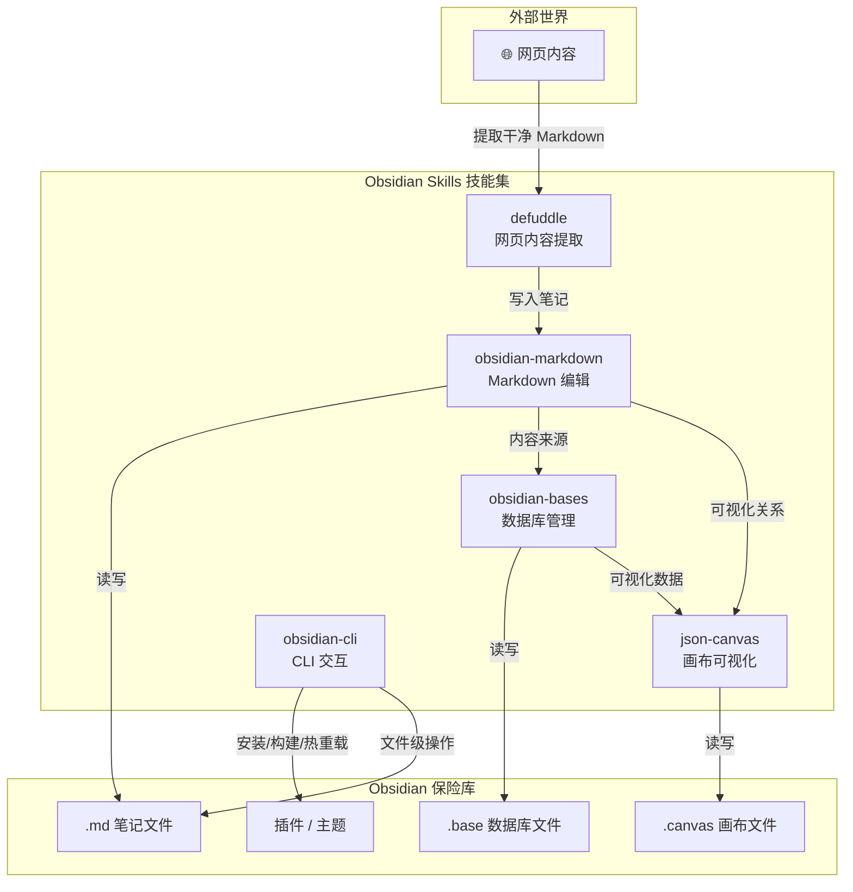

## 当 Obsidian 遇上 AI Agent

我用了五年 Obsidian，写了三千多篇笔记。最大的痛点从来不是"写什么"，而是"怎么管"——文件夹层级越深越焦虑，标签体系越复杂越懒得维护。最后你会发现，真正好用的知识库不是靠纪律堆出来的，是靠工具替你省掉那些机械操作。

kepano 开源的 [Obsidian Skills](https://github.com/kepano/obsidian-skills) 正是在解决这个问题。它把 Obsidian 特有的数据格式——Flavored Markdown、Bases 数据库、JSON Canvas 画布、CLI 构建工具——封装成五个遵循 Agent Skills 规范的技能包。装上之后，Claude Code、Codex CLI 或 OpenCode 就能直接读写你的保险库，理解 wikilinks 的语义、编辑 .base 文件里的视图配置、在画布上增删节点和边。

目前项目 20.2k stars，1.3k forks，MIT 协议，由 kepano 单人维护。不用纠结"竞品对比"——在这个细分方向上它没有竞品，Obsidian 官方生态里唯一一套成体系的 Agent Skills 实现。

## 五个核心技能的协作关系

把五个技能放进一张图，比文字描述直观得多：



核心逻辑其实很清晰：`obsidian-markdown` 是地基，剩下四个技能要么往上盖楼（bases 的结构化视图、canvas 的可视化），要么从外部运材料进来（defuddle 的内容抓取、CLI 的批量操作）。实际场景里你很少单独用某一个——这也是 Agent 比手工操作强的地方：它能按需组合技能，执行一连串跨文件的复杂动作。

下面逐个拆解。

## obsidian-markdown：地基技能

Obsidian 的 Markdown 不是标准 Markdown。它多了 wikilinks、embeds、callouts、properties、Dataview 代码块——这些是 Obsidian 知识库的血肉。没有这个技能，AI Agent 看到的只是一堆字符串，有它之后 Agent 能理解"`[[项目A]]` 是一根指向另一篇笔记的链接，链接断了后果很严重"。

```markdown
### Wikilinks 双向链接
[[Obsidian]]
[[Obsidian|显示文本]]
[[Obsidian#章节]]
[[Obsidian#章节|显示文本]]

### Embeds 嵌入
![[Obsidian]]
![[Obsidian#章节]]
![[Obsidian#^block-id]]

### Callouts 标注块
> [!note]
> [!warning]
> [!todo]
> [!abstract]- 折叠摘要

### Properties 前置元数据
---
aliases: ["Obsidian", "知识管理"]
tags: [obsidian, markdown]
cssclasses: [highlight]
---
```

实际工作中这技能的价值不是帮你写语法，而是帮你**批量修正和补全**。比如你有两百篇缺少 properties 的笔记，直接告诉 Agent："给所有 `projects/` 目录下的笔记补齐 `tags: [项目]`，并生成 `created` 日期"，它就能扫完文件夹逐篇处理。

## obsidian-bases：把笔记变成数据库

Bases 是 Obsidian 的结构化数据层，以 `.base` 文件的形式存在。你可以把它理解为 Obsidian 版的 Airtable——视图、筛选、分组、公式字段、汇总统计一应俱全。

```yaml
name: 项目跟踪
views:
  - name: 全部项目
    type: table
    columns:
      - { name: 项目名, field: name, width: 200 }
      - { name: 状态, field: status, width: 100 }
      - { name: 截止日期, field: due_date, width: 120 }
    filters:
      - { field: status, operator: not equal, value: 已完成 }
    sort:
      - { field: due_date, direction: ascending }
  - name: 我的项目
    type: kanban
    group_by: status
    filter:
      { field: owner, operator: equal, value: 当前用户 }
formulas:
  - name: 是否紧急
    expression: if(due_date < today(), "🔴紧急", "✅正常")
  - name: 剩余天数
    expression: due_date - today()
summaries:
  - name: 进行中
    expression: count() where status = "进行中"
```

关键不在于你能手写这些 YAML——AI Agent 能帮你做的事是：扫描某个文件夹里所有笔记的 properties，自动生成 bases 视图配置；或者根据你口述的需求（"我想看按负责人分组的项目看板"），直接输出完整的 `.base` 文件。

## json-canvas：画布上的知识图谱

Canvas 文件以 JSON 格式存储节点（nodes）、边（edges）和分组（groups）。和思维导图软件不同，Canvas 的节点可以直接关联真实笔记文件——点击一个节点就能跳转到对应文档。

```json
{
  "nodes": [
    {
      "id": "center",
      "type": "text",
      "x": 500, "y": 300,
      "width": 200, "height": 80,
      "text": "🚀 项目管理中心"
    },
    {
      "id": "dev-1",
      "type": "file",
      "x": 200, "y": 150,
      "width": 180, "height": 80,
      "file": "obsidian://open?vault=Main&file=projects/dev-sprint-12"
    }
  ],
  "edges": [
    {
      "id": "e1",
      "fromNode": "center", "fromSide": "right",
      "toNode": "dev-1", "toSide": "left"
    }
  ]
}
```

Canvas 的一个高频使用场景是：你有一批互相关联的笔记，想让 Agent 自动画一张关系图。Agent 会扫描 wikilinks 引用关系，在 canvas 上为每篇笔记创建一个 file 节点，再用 edges 还原链接拓扑。

## obsidian-cli：命令行的力量

CLI 技能解决的是批量操作和插件/主题开发的问题。文件级别的 CRUD、插件安装启停、主题切换、创建插件脚手架——这些不用离开终端。

```bash
obsidian vault open <path>
obsidian vault create <name>
obsidian vault list

obsidian file create <path>
obsidian file move <from> <to>
obsidian file delete <path>
obsidian file search <query>

obsidian plugin install <plugin-id>
obsidian plugin enable <plugin-id>
obsidian plugin disable <plugin-id>
obsidian plugin list

obsidian theme install <theme-id>
obsidian theme apply <theme-id>

obsidian dev create-plugin <name>
obsidian dev build
obsidian dev reload
```

插件开发者受益最大。visual hot reload 确实快，但写自动化测试脚本时你会发现 CLI 才是正途——Agent 可以替你跑 `obsidian dev build && obsidian dev reload` 的循环，在修改 TypeScript 源码后自动验证。

## defuddle：省 token 的内容提取器

Defuddle 是一个独立的网页内容提取工具，专为 AI 场景优化。它不是简单的 HTML-to-Markdown 转换——它会识别并剥离导航栏、侧边栏、广告、页脚这些对 AI 无意义的噪声区块，只保留正文结构。对大模型来说，这意味着同样的网页，喂进去的 token 数可能减少 60% 以上。

```bash
defuddle https://example.com/article
defuddle https://example.com/article -o article.md
defuddle https://example.com/article --content-only
defuddle https://dev.to/article -o article.md --keep-code
```

和 Obsidian 的管道集成非常自然：

```bash
defuddle https://blog.example.com/tech-article | \
  obsidian file create "Inbox/web-article-$(date +%Y%m%d).md"
```

Agent 会在需要引用外部资料时自动走这个管道：抓取 → 清洗 → 写入 Obsidian 保险库的指定目录。一步到位，不需要你手动复制粘贴再调格式。

## 安装：三个平台，四种方式

Obsidian Skills 基于 Agent Skills 规范，理论上兼容所有遵循该规范的 Agent。目前主要适配三个平台：

**Claude Code**

```bash
/plugin marketplace add kepano/obsidian-skills
/plugin install obsidian@obsidian-skills
```

或者手动克隆：

```bash
git clone https://github.com/kepano/obsidian-skills.git ~/.claude/obsidian-skills
```

**Codex CLI**

```bash
cp -r skills/ ~/.codex/skills/obsidian-skills
codex skills list
```

**OpenCode**

```bash
git clone https://github.com/kepano/obsidian-skills.git \
  ~/.opencode/skills/obsidian-skills
```

注意 OpenCode 要求完整的仓库目录结构——`~/.opencode/skills/obsidian-skills/skills/<skill-name>/SKILL.md`，不要只复制内部的 `skills/` 文件夹。

**npx 通用安装**

```bash
npx skills add git@github.com:kepano/obsidian-skills.git
```

安装后如果技能不生效，先检查目录结构是否正确，然后重启 Agent。

## 实战：用 Agent 从零搭建项目知识库

下面是一个完整的真实场景——不是演示语法，而是展示五个技能如何在实际工作流中串联起来。

### 背景

你接手了一个中型项目，已经有 50 多篇散落在不同文件夹里的 Markdown 笔记。目标：用 Agent 在五分钟内把这一摊散沙变成可检索、可视化、结构化的知识库。

### 第一步：cli 摸底 + markdown 补全

告诉 Agent：

> 扫描 `projects/new-project/` 下所有 .md 文件，统计总数，给每篇笔记补齐 tags 和 created 日期，将缺少 aliases 的统一用文件名生成。

Agent 会依次执行：`obsidian file search` 摸底文件清单 → 用 obsidian-markdown 技能逐篇读写 properties。几十篇笔记的补全在十几秒内完成。

### 第二步：bases 生成项目看板

> 根据笔记里的 status、owner、due_date 字段，生成一个 .base 文件，包含表格视图和按状态分组的看板视图。

Agent 先扫描所有 properties 的字段分布，确认有哪些字段、各自的值域，然后输出一份完整的 `.base` YAML 配置，包括 views、filters、formulas。你把文件放进保险库，刷新，就能看到一个可以筛选排序的项目数据库。

### 第三步：canvas 可视化引用关系

> 分析所有笔记之间的 wikilinks 引用关系，生成一张 canvas 文件，用 file 节点表示笔记，用 edges 表示引用，按引用密度自动分组。

Agent 扫描每篇笔记的 wikilinks，构建引用图，然后输出 `.canvas` JSON。高引用的笔记自动归入"核心文档"组，孤立笔记归入"待关联"组——一眼就能看出知识库的骨架和缺口。

### 第四步：defuddle 补充外部资料

> 把项目相关的重要技术文档页面抓下来，清洗后写入 `references/` 目录。

Agent 用 defuddle 批量抓取，管道接入 obsidian-cli 写入保险库。抓下来的内容已经去除了导航、广告，干净的 Markdown 可以直接被 wikilinks 引用。

五个技能在这个流程中的分工：

- **obsidian-cli**：文件发现与创建
- **obsidian-markdown**：元数据补全与校对
- **obsidian-bases**：结构化视图生成
- **json-canvas**：关系可视化
- **defuddle**：外部知识注入

单靠任何一个技能都做不完这件事——这才是 Agent 的价值：把五个技能当乐高块拼出完整的自动化流水线。

## FAQ

### Q1：我跟 Agent 说"帮我整理笔记"，它怎么知道该用哪个技能？

Agent 会根据提示词的语义自动匹配技能。比如你提到 wikilinks、callouts、properties 这些概念，Agent 会路由到 obsidian-markdown；提到视图、筛选、看板，则路由到 obsidian-bases。你也可以显式指定："用 obsidian-bases 技能生成一个数据库视图"。

### Q2：Defuddle 抓下来的内容和浏览器"另存为 Markdown"有什么本质区别？

浏览器插件做的是 DOM 到 Markdown 的机械转换——导航、侧边栏、页脚、广告全部保留。Defuddle 的提取逻辑是专门为 LLM 优化的：它用启发式算法识别页面的主内容区，丢弃噪声区块。实测同一个技术博客页面，Defuddle 输出比浏览器插件少 60%~70% 的 token 数，而且结构更干净，代码块保留更完整。

### Q3：Bases 和 Dataview 插件有什么区别，该选哪个？

Dataview 是社区插件，用内联代码块做实时查询，适合动态视图。Bases 是 Obsidian 原生功能，数据以 `.base` 文件固化存储，视图配置可版本管理，适合需要稳定输出和团队共享的场景。实际使用中两者互补：日常快速查询用 Dataview，正式项目管理和看板用 Bases。obsidian-bases 技能是 Agent 直接生成 `.base` 文件，不需要你手写 YAML。

### Q4：多个 Agent 同时操作同一个保险库会冲突吗？

会。Obsidian Skills 目前没有实现文件锁机制。如果你在 Claude Code 中让 Agent 批量修改 notes，同时又用 Codex CLI 对同一个目录操作，就会产生竞态。建议在一个 Agent 会话中集中处理一批任务，处理完再切换到另一个 Agent。

### Q5：Canvas 文件手写 JSON 太痛苦了，有没有更高效的方式？

这正是 json-canvas 技能存在的理由。你不需要手写 JSON——告诉 Agent"基于 `projects/` 目录的笔记生成一张项目关系图，按 tag 分组，核心节点用红色"，它会输出完整的 `.canvas` 文件。相比在 Obsidian 界面里手动拖拽节点，用 Agent 生成的优势在于可以批量处理——几十个节点和上百条边几秒钟搞定。

### Q6：Obsidian Skills 支持移动端吗？

obsidian-cli 和 defuddle 依赖 Node.js 运行时，在移动端 Obsidian 中无法直接使用。但 obsidian-markdown、obsidian-bases、json-canvas 这三个纯格式技能不受运行环境限制——只要你的 AI Agent 能在移动端运行，它就能操作对应的文件格式。实际场景中，很多人是在桌面端让 Agent 处理完一批任务，然后在移动端享用成果。

### Q7："Agent Skills 规范"是什么，我需要在别的工具里实现它吗？

Agent Skills 规范（[agentskills.io/specification](https://agentskills.io/specification)）定义了一套标准化的技能发现和加载机制：每个技能是一个文件夹，内含 `SKILL.md` 描述文件，Agent 启动时自动扫描指定路径加载。作为 Obsidian Skills 的用户，你不需要实现规范——你只需要把技能文件放在对应平台的 skills 目录下，Agent 会自动发现。如果你想为其他工具开发自定义技能，遵循这个规范可以保证跨平台兼容。

## 自检测试

完成安装和配置后，按以下清单逐项验证：

1. **技能发现**：在 Agent 中执行技能列表命令（如 Claude Code 的 `/plugin list`、Codex 的 `codex skills list`），确认能看到 5 个技能名称。
2. **markdown 创建**：让 Agent 用 obsidian-markdown 技能创建一篇包含 wikilinks、callouts 和 properties 的测试笔记，在 Obsidian 中打开确认渲染正确。
3. **bases 生成**：让 Agent 用 obsidian-bases 技能生成一个包含表格视图的 `.base` 文件，放入保险库后确认能在 Obsidian 中打开并正常显示列和筛选器。
4. **canvas 生成**：让 Agent 用 json-canvas 技能生成一个包含 3 个节点和 2 条边的 `.canvas` 文件，在 Obsidian 画布中打开确认布局正确。
5. **defuddle 抓取**：让 Agent 用 defuddle 抓取一个技术博客页面，检查输出是否只包含正文（无导航栏、广告残留），代码块是否完整保留。
6. **cli 文件操作**：让 Agent 用 obsidian-cli 在你的保险库中创建、移动、删除一个测试文件，确认操作成功且 Obsidian 中文件状态同步。
7. **组合任务**：给 Agent 一个组合指令（例如"扫描文件夹、补齐 properties、生成 bases 视图、生成 canvas 关系图"），验证多技能协作流程能完整跑通。

如果上述 7 项全部通过，你的 Obsidian Skills 环境就已就绪，可以放心地让 Agent 接管日常的知识库维护工作。

---

Obsidian 的真正威力不在某个单独功能，而在于所有数据都以明文文件存在本地——这意味着任何工具只要理解文件格式，就能成为你的知识库的"外脑"。Obsidian Skills 把这扇门彻底打开了。

[GitHub 仓库](https://github.com/kepano/obsidian-skills) | [Agent Skills 规范](https://agentskills.io/specification) | [Obsidian 官网](https://obsidian.md)