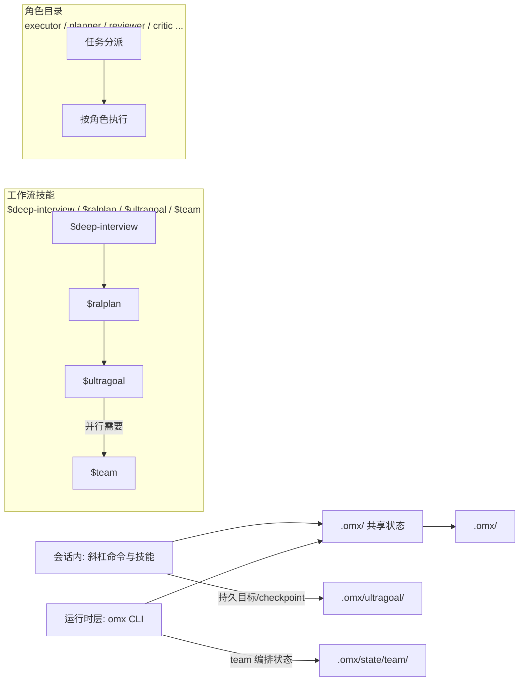

# OmX (oh-my-codex)：给 OpenAI Codex CLI 加上工作流、多智能体与 HUD 的运行时层

## 一句话判断

OmX 不提升 Codex 的模型能力，它改变的是你每天驱动 Codex 的方式。Codex CLI 仍然是执行引擎，OmX 在外面加了一层运行时：需求不清晰时用 `$deep-interview` 逐轮追问，动手前用 `$ralplan` 审规划，长任务用 `$ultragoal` 挂持久目标，活儿够大再用 `$team` 拆给多个 tmux worker 并行干。README 对自己的定位说得很直白——**更好的任务路由、更好的工作流、更好的运行时**，而不是一个手动操作的命令面板。

> 项目地址：[Yeachan-Heo/oh-my-codex](https://github.com/Yeachan-Heo/oh-my-codex)
>
> 本文以 npm 最新版 **v0.21.6**（2026-09-21 发布）为口径，仓库数据为 2026-09-29 GitHub API 读数。

一个需要先说的警示：README 专门声明，这个仓库（`Yeachan-Heo/oh-my-codex`）和 npm 包 `oh-my-codex` 才是官方本体，市面上叫 "OMX v2" 之类的第三方项目不是官方延续或替代版本——认准这两个安装目标。

## 项目定位

- **仓库**：`Yeachan-Heo/oh-my-codex`，TypeScript，MIT 协议，2026-02-02 建仓
- **热度**：33,410 stars / 2,542 forks（2026-09-29 读数），npm 包累计发布 136 个版本，最近一次 2026-09-21，迭代非常快
- **官方描述**："Your codex is not alone. Add hooks, agent teams, HUDs, and so much more."
- **前置依赖**：Node.js 20+，Codex CLI 已安装且完成认证（[openai/codex](https://github.com/openai/codex)）
- **平台口径**：macOS/Linux 是官方设计并调优的主路径；原生 Windows 和 Codex App 不是默认体验，支持较少

需要澄清一个常见误会：这里的 Codex 是 OpenAI 官方的开源编码 agent CLI。它和 2021 年那个为初代 GitHub Copilot 提供动力的 Codex 模型同名，但现在是独立演化的产品线，OmX 挂靠的是前者。

## 系统地图：三条主线

OmX 的功能容易看着杂，拆开其实是三条线，彼此通过 `.omx/` 目录共享状态：

| 主线 | 组成 | 解决什么 |
|------|------|----------|
| 工作流技能 | `$deep-interview`、`$ralplan`、`$ultragoal`、`$team`、`$plan`、`$code-review`、`$ultraqa`、`$autopilot` 等 29 个技能 | 把"从头到尾怎么干活"标准化 |
| 角色目录 | explore、analyst、planner、architect、debugger、executor、verifier、code-reviewer、designer、researcher、critic 等十余个 agent | 把"谁来干"变成可复用的专家分工 |
| 运行时基础设施 | 启动器（worktree/madmax/HUD）、Codex 原生 hooks、`omx doctor`、`omx mission`、`omx sparkshell`、`omx wiki` | 把会话状态、生命周期钩子、监控和批量执行做扎实 |

前两条线跑在 Codex 会话里（以斜杠命令和技能形式出现），第三条线是 `omx` 这个 CLI 本身。`omx list --json` 可以列出当前版本实际打包的技能与角色目录。

下面是这三条线和它们的落点，串成一张图：



角色与技能这两条线在 Codex 会话里以命令形式出现，`omx` CLI 提供启动器、HUD 与 hooks，统一落在 `.omx/` 目录共享状态。

## 核心机制

### 工作流链：从澄清到持久执行

官方推荐的分阶段流程是三段：

```text
$deep-interview "clarify the authentication change"
$ralplan "approve the auth plan and review tradeoffs"
$ultragoal "turn the approved plan into durable Codex goals"
```

`$deep-interview` 是独立的需求澄清阶段，用苏格拉底式追问把模糊需求逼成可执行的边界，状态可中断续跑；`$ralplan` 在澄清产物之上做架构、可行性与共识规划。这两个阶段都停在规划产物上，不会直接改代码——文档把这条边界写死了：**代码修改必须走执行 lane，也就是 `$ultragoal` 或 `$team`**。

`$ultragoal` 是 0.21 之后的默认完成路径，把多目标执行挂成持久账本（`.omx/ultragoal/` 下的 checkpoint），实现、测试、构建/lint/类型检查证据和跨会话恢复都由它管。`$team` 只在一个 ultragoal 故事确实需要并行 lane 时才加进来。

两个值得知道的细节：

- **`$ralph` 已经没了。** 这个"循环直到完成"的命令在 0.21 被移除，技能文件里留了迁移说明——它是单目标退化版的 ultragoal，现在用 `$ultragoal` 替代。网上不少早期教程还在教 `$ralph`，照着敲只会得到一条 sunset 提示。
- **`$autopilot` 是整条链的首选编排器**，`$deep-interview → $ralplan → $ultragoal` 这条链是它的默认行为，但每个阶段也可以单独调用。偏好研究前置的项目还有 `$best-practice-research` 和 `$autoresearch` 两个研究类技能。

另外还有两个会话内表面：`/goal` 给任务挂持久目标与检查点结构，`/skills` 浏览已装技能。README 提醒技能按需加载 2-5 个就好，一次性灌 20 个只会撑大上下文、分散模型注意力。

### Team：tmux 上的多 worker 编排

```bash
omx team 3:executor "fix the failing tests with verification"
omx team status <team-name>
omx team shutdown <team-name>
```

启动形态是 `omx team [N:agent-type] "<task>"`，不写数字默认 3 个 worker，不写角色默认 `executor`。`omx team ralph` 这种老用法已经被源码显式拒绝。运行时有几个设计值得注意：

- **worker 自动用独立 git worktree**，天然避免多 agent 改同一份工作区；`--worktree` 参数在 team 上只是兼容性覆盖。
- 状态落在 `.omx/state/team/<name>/`（config.json、manifest.v2.json、任务文件、worker 收件箱、派发队列），leader 与 worker 通过 mailbox 协调，也有 `omx team api send-message / read-task / transition-task-status` 这样的机器可读接口。
- 每个 agent 的推理力度用 `agentReasoning` 设（`low`/`medium`/`high`/`xhigh`/`max`）；worker 引擎不止 Codex，`OMX_TEAM_WORKER_CLI=codex|claude|auto` 可以换。
- 小到没必要并行的任务，Team 可能直接把隐式 fanout 压到 1 个 worker 并打过编排警告——它自己知道协同是有成本的。

### 启动器与安全边界

推荐的启动方式：

```bash
omx --worktree=feat/task --madmax --xhigh
```

`--madmax` 不是营销词，它是 Codex `--dangerously-bypass-approvals-and-sandbox` 的缩写——**移除正常审批与沙箱护栏**，只在可信仓库和可信环境里用。`--high`/`--xhigh` 对应 Codex 的 `model_reasoning_effort` 设置，现在官方推荐的是 `--xhigh`。在装了 tmux 的 macOS/Linux 上，这样启动会进入一个 OMX 管理的 detached tmux 会话，HUD 和运行时面板可创建、可恢复。

配套机制：`--worktree=<name>` 在 `../<repo>.omx-worktrees/` 下建命名工作树，并发的 `--madmax` 会话应各用一个；同一个 checkout 上第二个普通 `omx` 启动会直接失败（fail closed）而不是共享会话，开第二个会话要显式给 `OMX_ROOT` 环境变量；不想被 tmux/HUD 管可以用 `--direct`。

HUD（`omx hud --watch`）是监控面而非主工作流：显示版本、活跃 team 与 worker 数，每个 worker 一行实时状态（working/idle/blocked/done/failed/draining）。

### Hooks：现在有三层注册面

OmX 的生命周期钩子现在围绕 Codex 原生 hooks 组织：

- 插件安装（Codex 支持 plugin hooks 时）：注册面在 `plugins/oh-my-codex/hooks/hooks.json`；
- 传统安装：`.codex/hooks.json` 注册 OMX 管理的包装器，**你自己写的非 OMX hook 条目会在 setup 刷新和卸载时被保留**；
- OMX 插件自身的钩子：`.omx/hooks/*.mjs`；tmux 通知等还有运行时回退路径。

`omx doctor` 能检查这些文件的形态，但它只证明安装没坏——能否完成一次真实的认证请求，要靠 `codex login status` 加一条 `omx exec` 冒烟测试来验证。

## 一个任务如何流过 OmX

以"接手一个含糊的改造需求"为例。先正常启动强会话：

```bash
omx --worktree=feat/auth --madmax --xhigh
```

需求边界说不清，先跑 `$deep-interview "clarify the auth requirements"`——它会多轮追问、落成需求产物，中断了也能续。边界清楚了，`$ralplan` 基于产物出架构方案和取舍清单，你确认方案。确认后进 `$ultragoal`：目标挂进 `.omx/ultragoal/` 账本，Codex 开始实现，测试、构建、类型检查作为证据写入 checkpoint，会话断了下次能从账本恢复。如果方案里有三块能真正并行的活，在 ultragoal 故事里加 `$team`，三个 worker 各自领任务、各自在自己的 worktree 里干、通过 mailbox 汇报。收尾用 `$code-review` 做多轴审查（风格、质量、API、性能），要更严的验收再加 `$ultraqa`。全程 HUD 上能看到 team 状态，`omx team status` 随时查明细。

这条流水线里，你手动敲的命令其实很少——大多数时候就是在 Codex 会话里按阶段丢 `$` 命令。

## 安装与配置

```bash
# 已有 Codex CLI（Homebrew 或 npm 均可）
codex --version
npm install -g oh-my-codex

# 还没有 Codex CLI，让 npm 一并管理
npm install -g @openai/codex
npm install -g oh-my-codex
```

一个官方点名的坑：Homebrew 已经拥有 `codex` 时，不要跑 `npm install -g @openai/codex oh-my-codex` 这种合并安装——npm 会在创建同名二进制时以 `EEXIST` 失败。OmX 只要求 PATH 上有一个能用的、已认证的 `codex` 命令，不关心它怎么装的。

安装（或真实版本升级）之后做 scoped setup：

```bash
# 在目标 git 项目里跑，让项目持有 AGENTS.md 指导
omx setup --scope project --merge-agents

# 或做用户级 Codex 配置
omx setup --scope user
```

`--merge-agents` 保留项目已有的 `AGENTS.md`，把 OmX 生成段插在成对的标记注释之间。版本升级后的安装提示不会再自动跑 setup，显式跑上面的命令，或者用 `omx update`（检查 npm、装最新构建、重跑 setup 一步到位）。启动时的更新检查默认有节流并询问，`OMX_AUTO_UPDATE=0` 可关。

顺手一提：全新 setup 的默认模型是 `gpt-6-astra`，已有的模型配置和显式覆盖会被保留。

## 适用边界与采用建议

README 有一句少见的诚实话："如果你就想要纯 Codex，不需要额外工作流层，那你多半不需要 OmX。" 它适合的是已经用 Codex 且被这些问题困住的人：需求边界反复返工、长任务断线后没状态可续、想并行又怕几个 agent 互相踩工作区。

按情况给个顺序：

1. **macOS/Linux + 重度 Codex 用户**：直接按官方 quick start 走，先 `omx doctor` 再跑一次 `omx exec` 冒烟测试，然后从 `--worktree --madmax --xhigh` 起步。
2. **Windows 用户**：原生 Windows 是次要路径（tmux 兼容层走 `winget install psmux`），官方自己说 WSL2 是更稳的选择——先 WSL2。
3. **嫌它太重的**：同作者有个轻量替代 [gajae-code](https://github.com/Yeachan-Heo/gajae-code)，README 明确推荐给"觉得 OmX 有点过度"的用户。
4. **Intel Mac 用户注意一个已知问题**：`--madmax --high` 启动时 Gatekeeper 校验大量并发进程，可能顶高 `syspolicyd`/`trustd` CPU。官方给的办法是 `xattr -dr com.apple.quarantine $(which omx)`、把终端加进开发者工具白名单，或降低并发。

最后一条通用建议：迭代这么快的项目（七个多月发了 136 个 npm 版本），任何第三方教程都可能滞后，包括这一篇——遇到对不上的行为，以 `omx --help`、`omx list --json` 和仓库 docs/ 目录为准。

## 常见问题

**Q: OmX 和 Codex 是什么关系？**
A: OmX 是 Codex 外面的工作流层，不替换 Codex。Codex 负责真正的 agent 工作，OmX 负责任务路由、工作流和运行时（会话状态、hooks、HUD、tmux 编排）。

**Q: `$ralph` 敲不了了？**
A: 0.21 已移除，官方迁移路径是 `$ultragoal`——原来的"循环直到完成"就是单目标退化版的 ultragoal，持久化和完成验证能力都由后者接管。

**Q: 怎么确认装好了？**
A: 两步，缺一不可：`omx doctor` 验安装形态（文件、hooks、运行时前置）；`codex login status` 加 `omx exec --skip-git-repo-check -C . "Reply with exactly OMX-EXEC-OK"` 验真实认证链路。doctor 绿了但请求 401，通常是 shell 实际读到的 `~/.codex`（或 `CODEX_HOME`）不是你以为的那个。

**Q: 支持自定义 hook 吗？**
A: 支持，但要走 Codex 原生 hooks 的路子：你写在 `.codex/hooks.json` 里的自己的条目，OmX 的 setup 刷新和卸载都会保留，只动它自己的包装器。

## 相关链接

- GitHub：[Yeachan-Heo/oh-my-codex](https://github.com/Yeachan-Heo/oh-my-codex)（含 [Getting Started](https://github.com/Yeachan-Heo/oh-my-codex/blob/main/docs/getting-started.html)、[Agent 目录](https://github.com/Yeachan-Heo/oh-my-codex/blob/main/docs/agents.html)、[hooks 映射](https://github.com/Yeachan-Heo/oh-my-codex/blob/main/docs/codex-native-hooks.md)）
- 官网：[yeachan-heo.github.io/oh-my-codex-website](https://yeachan-heo.github.io/oh-my-codex-website/)
- npm：[oh-my-codex](https://www.npmjs.com/package/oh-my-codex)
- Codex CLI：[openai/codex](https://github.com/openai/codex)
