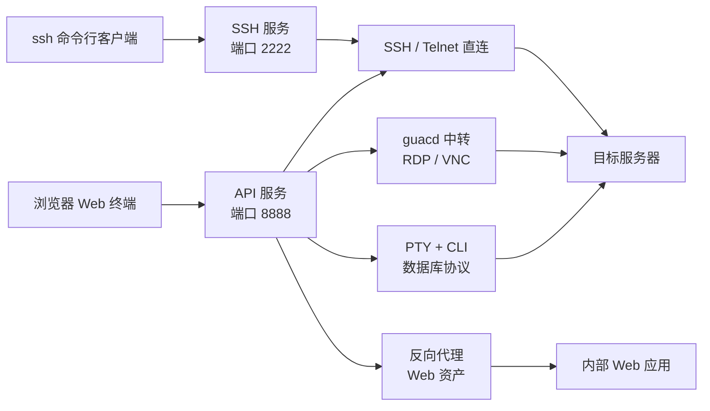

## 一台堡垒机要解决什么

基础设施的访问控制是个老问题。运维、开发、外包人员都要登录服务器，安全团队要知道谁在什么时间做了什么操作，合规审计要求每一条命令都可回溯。堡垒机（bastion host / jump server）就是放在人和基础设施之间的那道关卡——所有访问经过它中转，所有操作被它记录。

市面上并不缺堡垒机。JumpServer 是国内开源阵营里知名度最高的选择，背后有完整的商业公司支撑；Teleport 走云原生路线，由 Teleport（原 Gravitational）公司运营；Apache Guacamole 提供了 Web 端远程桌面的网关能力，但本身不是一个完整的堡垒机方案。商业产品更不少，齐治、行云管家、安恒都有成熟方案。

veops/oneterm 选了一个差异化的位置：**轻量**。后端用 Go 写，前端用 Vue.js，克隆仓库后在 `deploy/` 目录里 `docker compose up -d`，六个容器就能跑起来。没有微服务拆分，没有消息队列，没有 Elasticsearch。MySQL 存业务数据，Redis 做缓存，guacd 容器处理 RDP/VNC 协议——依赖就这么多。

这种定位适合两类场景：中小团队的内部运维接入，以及需要满足等保这类合规要求、但不想采购重型方案的企业。AGPL v3 允许免费使用和修改源码，但如果你基于它修改后做成对外提供的网络服务（SaaS），必须向用户开放修改后的完整源码。

> **仓库信息卡**
>
> | 项目 | 内容 |
> |------|------|
> | 仓库 | [veops/oneterm](https://github.com/veops/oneterm) |
> | Stars / Forks | 1,970 / 209（2026-10-04 快照） |
> | 语言 | Go（后端）+ Vue.js（前端） |
> | 许可证 | AGPL-3.0 |
> | 创建时间 | 2024-01-30 |
> | 最近 push | 2026-09-19 |
> | 在线 Demo | [oneterm.v1ops.com](https://oneterm.v1ops.com/)（demo 或 admin / 123456） |
> | 官网与文档 | [v1ops.com](https://v1ops.com/) · [v1ops.com/docs/design](https://v1ops.com/docs/design/) |

## 代码架构：一个二进制里的三个角色

先给一张系统地图。OneTerm 的访问路径可以拆成四段：用户从两种入口进来，落到同一个 Go 进程的三个角色上，再经协议连接层代理到目标资产。



`backend/cmd/server/main.go` 只有五十几行。入口用 [oklog/run](https://github.com/oklog/run) 编排四个 goroutine 组——一个监听 SIGTERM/中断信号，另外三个是业务角色：

```go
rg.Add(func() error { return api.RunApi() }, ...)
rg.Add(func() error { return sshsrv.RunSsh() }, ...)
rg.Add(func() error { return schedule.RunSchedule() }, ...)
```

三个业务角色分别是：

- **API 服务**（端口 8888）：Gin 框架的 HTTP API，处理前端请求、WebSocket 会话、文件传输
- **SSH 服务**（端口 2222）：用 gliderlabs/ssh 实现的内嵌 SSH 服务器，用户可以用原生 SSH 客户端直连堡垒机
- **定时任务**：资产连通性检查、存储清理等后台任务

一个二进制同时跑 HTTP API 和 SSH Server，省掉了进程编排。用户既可以通过浏览器访问 Web 终端，也可以在本地终端 `ssh admin@bastion -p 2222` 直接连上去，两种入口操作的是同一套资产和权限数据。

后端代码组织遵循 Go 社区常见的项目布局：

```text
backend/
├── cmd/server/main.go          # 入口
├── internal/
│   ├── api/                    # HTTP 路由、控制器、中间件、Swagger 文档
│   │   ├── controller/         # 27 个控制器文件（asset、session、connect...）
│   │   ├── middleware/         # auth、error、logger
│   │   └── router/router.go    # 路由注册
│   ├── connector/protocols/    # 协议连接层（核心）
│   │   ├── ssh.go              # SSH 连接
│   │   ├── guacd.go            # RDP/VNC 通过 guacd
│   │   ├── telnet.go           # Telnet 连接
│   │   ├── web.go              # Web 资产代理
│   │   └── db/                 # 数据库协议（MySQL、PostgreSQL、Redis、MongoDB）
│   ├── model/                  # GORM 数据模型
│   ├── repository/             # 数据访问层
│   ├── service/                # 业务逻辑层
│   ├── session/                # 会话管理 + 录像
│   ├── sshsrv/                 # 内嵌 SSH 服务器
│   ├── tunneling/              # 网关 SSH 隧道
│   ├── guacd/                  # guacd 协议封装
│   ├── schedule/               # 定时任务
│   └── i18n/                   # 国际化
├── pkg/
│   ├── storage/providers/      # 8 种存储后端
│   ├── db/                     # 数据库连接
│   ├── cache/                  # Redis 封装
│   └── logger/                 # 日志
└── go.mod
```

（前端在仓库顶层的 `oneterm-ui/` 目录，部署编排文件集中在 `deploy/`。）

从 go.mod 可以确认技术栈：Gin 做 Web 框架，GORM 做 ORM（同时支持 MySQL 和 PostgreSQL 驱动），go-redis 做缓存，gorilla/websocket 处理 WebSocket，gliderlabs/ssh 提供 SSH 服务器能力。日志用 zap + lumberjack 做轮转。命令行 UI 用了 charmbracelet 的 bubbletea / bubbles / lipgloss 三件套——SSH 交互式界面里渲染资产列表和选择菜单靠的就是这组库。

## 多协议连接层：OneTerm 的核心引擎

堡垒机的本质是一个协议代理。用户连到堡垒机，堡垒机代替用户连到后端资产。`internal/connector/protocols/` 目录就是这个代理引擎。

### SSH：Go 原生实现

SSH 连接走 Go 标准库 `golang.org/x/crypto/ssh`。从 `ssh.go` 源码看，连接流程是：

1. 通过 tunneling 模块建立到目标资产的 TCP 通道（可能经过网关跳转）
2. 从数据库读取账号凭证，构造 `ssh.AuthMethod`
3. `ssh.Dial` 建立连接，`NewSession` 创建会话
4. `RequestPty` 请求伪终端，`Shell` 启动交互式 Shell
5. 用 errgroup 管理三个 goroutine：等待会话结束、读取输出、处理窗口大小变化

会话的输入输出通过 `io.Pipe` 在 WebSocket 和 SSH 连接之间双向传递。终端窗口大小的动态调整通过 `WindowChan` channel 传递，调用 `sshSess.WindowChange` 同步到远端。

### RDP / VNC：通过 guacd 中转

RDP 和 VNC 没有成熟的 Go 原生库，OneTerm 引入 [Apache Guacamole](https://guacamole.apache.org/) 的 guacd 服务作为协议代理。从 `guacd.go` 源码看：

```go
t, err := guacd.NewTunnel("", sess.SessionId, w, h, dpi, cleanProtocol, 
    asset, account, gateway, permissions)
```

guacd 是一个 C 语言写的守护进程，监听 4822 端口，接收 Guacamole 协议指令并翻译为 RDP/VNC 协议通信。OneTerm 在 Go 侧封装了 `guacd.Tunnel`，通过 WebSocket 在前端和 guacd 之间中继数据。

Docker Compose 里 guacd 容器独立运行，挂载 replay 和 rdp 两个目录用于会话录像和 RDP 磁盘映射。RDP/VNC 的性能上限取决于 guacd 的实现，OneTerm 本身只做隧道转发和权限管控。

### 数据库协议：PTY + CLI 客户端

对 MySQL、PostgreSQL、Redis、MongoDB 这四种数据库协议，OneTerm 用了一个务实的方案：在 PTY 里启动对应的命令行客户端。从 `db/connect.go` 源码看：

```go
cmd := exec.CommandContext(sess.Gctx, clientConfig.Command, clientConfig.Args...)
ptmx, err := pty.Start(cmd)
```

以 MySQL 为例，`getMySQLConfig` 构造的命令是 `mysql -h <ip> -P <port> -u <user> -p<password>`。用户在 Web 终端里看到的就是一个真实的 mysql CLI 交互界面。后台 goroutine 会累积用户输入，回车后与 `ExitAliases` 配置的退出命令（exit、quit、\q）比对，匹配则让客户端进程自然退出、会话随之结束。

这种方案的好处是不需要自己实现各数据库的协议栈，代价是 API 容器镜像里必须打进这些客户端二进制——Docker 部署时已经替你处理好了。

### Telnet：完整的协议处理

`telnet.go` 是代码量最大的协议处理器（约 400 行），完整实现了 Telnet 协议的 IAC（Interpret As Command）协商逻辑：处理 WILL/WONT/DO/DONT 协商、子协商（SB/SE）、终端类型协商、窗口大小协商。认证流程通过监听服务器的 prompt 输出，自动匹配 "login"、"username"、"password" 关键字并发送凭证。

### Web 资产代理

OneTerm 不止处理传统远程登录协议，还支持 HTTP/HTTPS 类型的 Web 资产。`internal/service/web_proxy/` 实现了一个反向代理，可以在堡垒机域名下（`webproxy.*` 子域名）代理用户访问内部 Web 应用。路由注册中对 `webproxy.` 前缀的请求做特殊处理：

```go
if strings.HasPrefix(host, "webproxy.") {
    webProxy.ProxyWebRequest(c)
    return
}
```

Web 资产支持认证模式（none / smart / manual）、访问策略（full_access / read_only）、并发限制、路径屏蔽、会话水印等控制。堡垒机的覆盖范围由此从"服务器登录"扩展到了"内部应用访问"。

## 一次 SSH 会话如何流过系统

以上是各模块的静态拆解。下面用一个具体任务把它们串起来：用户通过浏览器连接一台 SSH 资产。

1. **前端发起**：用户在 Web 界面选择资产、账号、协议，前端通过 WebSocket 连接 `/api/oneterm/v1/connect/:asset_id/:account_id/:protocol`
2. **权限校验**：AuthMiddleware 验证用户身份，`AuthorizationV2` 模型检查该用户对指定资产+账号+协议是否有 `connect` 权限，同时校验时间模板（是否在允许的时间段内）和命令控制规则
3. **隧道建立**：`tunneling.Proxy` 判断资产是否配置了网关。如果有网关，通过 `TunnelManager` 建立 SSH 隧道——先 SSH 到网关主机，再从网关 Dial 到目标资产。隧道用本地端口映射，3 秒后自动关闭 listener
4. **协议连接**：`ConnectSsh` 用 `ssh.Dial` 连接目标（直连或通过隧道本地端口），请求 PTY，启动 Shell
5. **会话录像**：`Asciinema` recorder 从会话开始就记录所有输出，格式是 asciinema v2 cast 文件。窗口大小变化也会记录（`resize` 事件）
6. **实时监控**：管理员可以通过 `/connect/monitor/:session_id` 实时查看任何在线会话的屏幕输出，实现是共享 errgroup 的 OutChan
7. **文件传输**：SSH 会话建立后，SSH client 被缓存在 Session 对象中（`SetSSHClient`），SFTP 文件传输复用这条连接，避免二次认证
8. **会话结束**：用户断开、超时、管理员强制关闭、或时间模板过期都会触发会话终止。Asciinema 文件保存到本地或云存储

这条链路里有个细节值得一提：SSH 连接复用。`session.go` 里用 `sync.RWMutex` 保护 `SSHClient` 字段，`ConnectSsh` 成功后存入 client，SFTP 操作时取出复用。文件传输因此不用重新建立 SSH 连接。

## 权限模型：从 V1 到 V2

OneTerm 的权限系统经历过一次迭代，兼容逻辑写在 `model/asset.go` 的 `AuthorizationMap` 类型里。资产表里的 `authorization` 字段历史上是 V1 格式——`map[int][]int`，键是账号 ID，值是 ACL 角色 ID 列表，只能控制"谁能用哪个账号连这台资产"。现在的字段类型是 `map[int]AccountAuthorization`，每个账号除了角色列表，还带一组 V2 权限和规则 ID；`Scan` 和 `UnmarshalJSON` 会先按 V2 解析，失败再按 V1 解析并补上默认权限，老数据平滑升级。

**V2 模型**（`model/authorization_v2.go`）引入了 `AuthorizationV2` 实体，定义了细粒度的 `AuthPermissions`：

```go
type AuthPermissions struct {
    Connect      bool // 连接权限
    FileUpload   bool // 文件上传
    FileDownload bool // 文件下载
    Copy         bool // 复制
    Paste        bool // 粘贴
    Share        bool // 会话共享
}
```

V2 还引入了 `TargetSelector`，支持四种目标匹配方式：`all`（全部）、`ids`（指定 ID 列表）、`regex`（正则匹配）、`tags`（标签匹配）。配合 `AccessControl` 可以设置 IP 白名单、时间模板、最大并发会话数、会话超时、命令控制规则。

guacd 连接时（RDP/VNC）会批量检查这些权限：

```go
batchResult, err := service.DefaultAuthService.HasAuthorizationV2(ctx, sess,
    model.ActionCopy, model.ActionPaste,
    model.ActionFileUpload, model.ActionFileDownload)
```

权限结果传给 guacd tunnel，由 guacd 侧控制剪贴板和文件传输行为。RDP 协议本身不区分这些权限，OneTerm 通过 guacd 的拦截层实现了操作级别的管控。

## 会话录像与多云存储

SSH 会话录像用 asciinema v2 格式，这是一种基于时间戳的终端输出流记录。`session/record.go` 中的 `Asciinema` 结构体在内存中累积输出，会话结束时写入文件。文件按日期分层：`/replay/2026-02-03/<session_id>.cast`。

RDP/VNC 的录像由 guacd 直接生成，不走 asciinema 格式，存储为同名文件（无 `.cast` 后缀）。

存储层是 OneTerm 设计得比较用心的一块。`pkg/storage/providers/` 下提供了 **8 种存储后端**：

| Provider | 用途 |
|----------|------|
| local | 本地文件系统（默认） |
| S3 | Amazon S3 兼容存储 |
| MinIO | 自建 MinIO |
| OSS | 阿里云 OSS |
| COS | 腾讯云 COS |
| OBS | 华为云 OBS |
| Azure | Azure Blob Storage |
| OOS | 其他 S3 兼容对象存储 |

所有 provider 实现统一的 `Provider` 接口（`Upload` / `Download` / `Delete` / `Exists` / `GetSize` / `HealthCheck`）。会话录像通过 `storage.DefaultSessionReplayAdapter` 抽象层调用：配置了云存储就先写云端，写失败回退到本地文件（`record.go` 里 `Close` 的逻辑）。`MigrateLocalReplaysToStorage` 函数提供了从本地到云端的迁移能力。

这套设计让录像文件不必绑在堡垒机本地磁盘上。多节点部署或容器化环境里，录像进对象存储是更可靠的选择。

## 网关隧道：多跳访问的实现

很多企业的网络是分区的——DMZ 区可以直接访问，核心区需要通过跳板机。OneTerm 的网关功能（`internal/tunneling/`）实现了这种多跳访问。

`TunnelManager` 管理着 SSH 客户端连接池。当一个资产配置了 `GatewayId`，`Proxy` 函数会：

1. 检查是否已有到该网关的 SSH 连接（`sshClients` map），没有则建立
2. 在网关 SSH 连接上 Dial 到目标资产的 TCP 连接
3. 在本地监听一个随机端口，将本地端口的流量转发到远端
4. 返回本地地址给协议处理器，协议处理器以为自己在直连

连接池有引用计数（`sshClientsCount`），最后一个使用者断开后才关闭到网关的 SSH 连接。隧道在建立 3 秒后自动关闭 listener，防止端口泄露。

连通性检查（`schedule/connectable.go`）也利用了网关隧道。定时任务批量检查所有资产的可达性，用并发批次处理（`processConcurrentBatches`），批次大小和并发数可以通过配置调整。检查结果更新到资产的 `connectable` 字段，前端据此显示资产在线状态。

## ACL 集成与 veops 生态

OneTerm 不是孤立的产品。它的认证授权层集成了同属 veops 开源的 [ACL 系统](https://github.com/veops/acl)（一个基于角色 + 资源的通用权限框架）。Docker Compose 里 `acl-api` 容器使用 Flask + Gunicorn + Celery 技术栈，与 OneTerm 的 Go 后端通过 HTTP API 通信。

`deploy/config.yaml` 中可以看到 ACL 集成参数：

```yaml
auth:
  acl:
    appId: 5867e079dfd1437e9ae07576ab24b391
    secretKey: <secret>
    url: http://acl-api:5000/api/v1
```

OneTerm 自身不维护用户体系，用户管理、角色分配、部门结构都委托给 ACL 系统。这种架构让 OneTerm 专注于协议代理和审计能力，但也意味着部署 OneTerm 必须同时部署 ACL——两者是紧耦合的。

veops 开源生态中还有 [CMDB](https://github.com/veops/cmdb)（配置管理数据库）和 [messenger](https://github.com/veops/messenger)（消息发送服务）。README 明确写了 OneTerm 与 CMDB 紧密集成、支持一键从 CMDB 导入资产。前端代码 `oneterm-ui/src/api/cmdb.js` 封装了 CMDB API 调用，资产模型的 `CIId` 和 `CITypeId` 字段就是 CMDB 关联键。

## 部署：六容器架构

从 `deploy/docker-compose.yaml` 看，完整部署需要六个容器：

| 容器 | 镜像 | 职责 |
|------|------|------|
| oneterm-ui | oneterm-ui:v25.9.1 | Nginx 托管 Vue.js 前端 + 反向代理 |
| oneterm-api | oneterm-api:v25.9.1 | Go 后端（HTTP API + SSH Server + 定时任务） |
| oneterm-guacd | oneterm-guacd:1.5.4 | guacd 守护进程（RDP/VNC 协议代理） |
| acl-api | acl-api:2.2 | Flask 权限系统（Python） |
| mysql | mysql:8.2.0 | 业务数据存储 |
| redis | redis:7.2.3 | 缓存 |

所有容器在同一个 Docker 网络（`oneterm_network`，172.30.0.0/24）内通信。对外暴露五个端口：8666 是 Web UI，2222 是 SSH，13306 把 MySQL 映射出来便于调试，16379 与 14822 分别是 Redis 和 guacd。

部署脚本 `deploy/setup.sh` 会生成随机密码或让用户自定义，更新所有配置文件并创建备份。开发环境通过 `deploy/dev-start.sh` 分别启动前端（热更新）和后端的开发容器。

生产部署还可以用 `deploy/docker-compose.domain.yaml`（域名配置）和 `deploy/nginx.oneterm.conf.example`（Nginx 配置模板），项目为真实部署做了考虑。

## 与同类产品的定位差异

| 维度 | OneTerm | JumpServer | Teleport | Apache Guacamole |
|------|---------|------------|----------|------------------|
| 语言 | Go + Vue | Python + Vue | Go + React | Java + C |
| 协议覆盖 | SSH/RDP/VNC/Telnet/DB/Web | SSH/RDP/VNC/Telnet/DB | SSH/RDP/DB/Web | RDP/VNC/SSH/Telnet |
| 用户管理 | 外部 ACL 系统 | 内置 | 内置 / OIDC | 依赖外部数据源（DB/LDAP） |
| 部署复杂度 | 6 容器 | 约 10 个容器 | 单二进制 + Proxy | 2 容器（client + guacd） |
| 许可证 | AGPL-3.0 | GPL-3.0 | AGPL-3.0（社区版） | Apache-2.0 |
| Stars | 1,970 | 31,700+ | 21,000+ | 约 5,700（server + client） |

（Stars 为 2026-10-04 的 GitHub API 快照。）

OneTerm 的 Star 数远低于 JumpServer，但这不是唯一的评判维度。从代码结构看，OneTerm 的后端比 JumpServer 更收敛——Go 的静态类型加上 oklog/run 的极简并发模型，让整个服务在一个进程里跑完三个角色。JumpServer 的 core、koko、lion、Celery 异步任务各自独占容器，组件间协调成本更高。

Teleport 在架构理念上与 OneTerm 不同。Teleport 强调"无代理"和证书认证，用户不需要在目标机器上装 agent，通过短时证书（short-lived certificate）完成认证。OneTerm 走的是传统的账号密码/密钥代理路线，更接近传统堡垒机的心智模型。另外 Teleport 社区版从 v17 起改用 AGPL-3.0，许可证层面两者现在站在了同一边。

Apache Guacamole 不是一个完整的堡垒机——它只做 Web 端的远程桌面网关。OneTerm 实际上把 guacd 作为自己的 RDP/VNC 子组件，在其上叠加了权限管控、审计录像、资产管理等能力。

## Takeaway

1. **Go 单二进制跑三个角色**的设计降低了部署复杂度，但也意味着 API、SSH Server、定时任务共享进程资源。高并发场景可能需要调优 Go 的 GOMAXPROCS 和内存参数。如果你的团队偏好"一个进程干一件事"的隔离架构，这种打包方式需要评估。

2. **权限模型 V2** 的细粒度控制（连接/上传/下载/复制/粘贴/共享）配合时间模板和命令控制，覆盖了等保对运维审计的主要要求——谁连过哪台机器、执行了什么命令、能否回放。如果你在做等保合规，关注 `AuthorizationV2` 和 `CommandAnalyzer` 这两个模块，它们是 OneTerm 区别于简单 SSH 代理的地方。

3. **8 种存储后端**的抽象层让录像文件可以落到任何主流对象存储。堡垒机需要多节点部署或容器化运行时，把录像存到 MinIO 或 S3 是更可靠的方案。`storage.Provider` 接口也可以自行扩展。

4. **ACL 紧耦合**是部署时必须考虑的因素。OneTerm 的用户认证完全依赖外部 ACL 系统，不能独立运行。已有 veops ACL 用户体系的团队可以无缝衔接，从零开始的部署则要额外承担 ACL 的运维成本。

5. **AGPL-3.0 许可证**对内部使用没有限制，但如果你打算基于 OneTerm 做 SaaS 服务对外提供，必须开放修改后的源码。评估时建议让法务确认 AGPL-3.0 的网络条款是否符合商业策略。

---

*本文基于 veops/oneterm 仓库源码（main 分支，2026-10-04 快照）和 README 公开文档分析，不包含未公开信息。技术细节引用自代码文件和 docker-compose 配置。*
