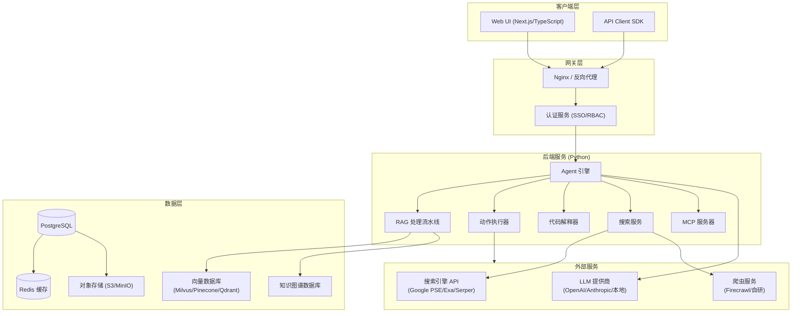
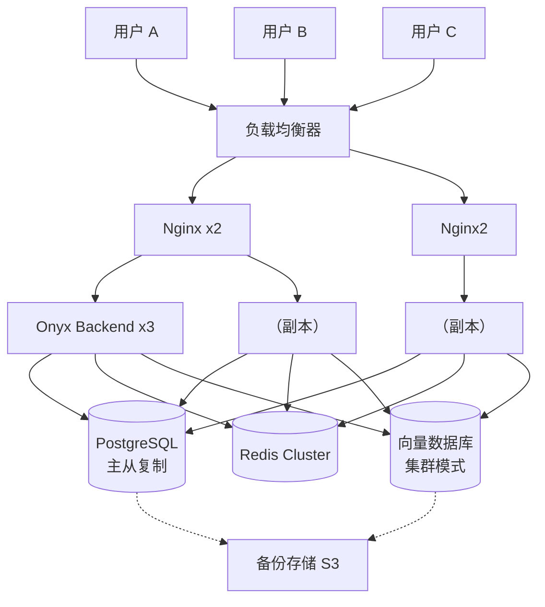

# Onyx 中文指南：自托管 AI 对话平台的入门到精通 ⭐⭐⭐⭐⭐

> **目标读者**：对 AI 对话平台有兴趣的开发者与团队
> **前置知识**：Docker 基础、Python 基础、对 LLM 有基本认知
> **预计阅读时间**：45 分钟
> **项目地址**：https://github.com/onyx-dot-app/onyx
> **最新版本**：v3.0.5（2026 年 3 月 25 日）

---

## 章节导航

| 小节 | 主题 | 难度 |
|------|------|------|
| §1 | 学习目标 | ⭐ |
| §2 | 原理分析：为什么需要 Onyx 这样的平台 | ⭐⭐ |
| §3 | 架构分析：前端 / 后端 / 数据流 | ⭐⭐⭐ |
| §4 | 核心功能详解 | ⭐⭐⭐ |
| §5 | 安装与部署（Docker / Kubernetes） | ⭐⭐ |
| §6 | 使用指南：从快速开始到高级配置 | ⭐⭐⭐ |
| §7 | 开发扩展：自定义 Agent 与 MCP 集成 | ⭐⭐⭐⭐ |
| §8 | 最佳实践 | ⭐⭐⭐⭐ |
| §9 | 常见问题（FAQ） | ⭐⭐ |

---

## §1 学习目标

完成本文后，你将能够：

- [ ] 理解 Onyx 的核心定位与适用场景
- [ ] 读懂 Onyx 的整体架构设计
- [ ] 掌握 Docker 与 Kubernetes 两种部署方式
- [ ] 独立完成 Onyx 的安装、配置与首次运行
- [ ] 理解 RAG 混合搜索与知识图谱的工作原理
- [ ] 配置 Web Search、Connectors 与数据源连接
- [ ] 构建自定义 Agent 并集成 MCP 工具
- [ ] 运用最佳实践保障生产环境的稳定性与安全

---

## §2 原理分析：为什么需要 Onyx 这样的平台

### 2.1 从「能用」到「好用」的距离

大语言模型（LLM）在 2022 年底的爆发，让无数团队开始尝试将 AI 能力集成到自己的产品或工作流中。直接调用 API 是最简单的方式——但在真实场景中，你会发现光靠 API 远远不够：

- **数据隔离**：企业内部的文档、技术方案、会议记录往往涉及机密，无法上传到第三方 API
- **知识时效**：通用 LLM 的知识有截止日期，而企业内部信息每天都在更新
- **工具联动**：AI 需要能够查邮件、操作数据库、搜索内网、调用内部 API——这远超出纯对话的范畴
- **多模型切换**：不同场景需要不同的模型（有的任务用 GPT-4 性价比更高，有的用 Claude，有的用开源模型）

于是，如何让 AI 真正「接入」真实世界，成了下一个核心问题。**Onyx 就是这个问题的答案之一**——一个可以自托管、功能完备、扩展性强的 AI 对话与智能体平台。

### 2.2 Onyx 解决了什么问题

| 问题 | 现状（无 Onyx） | 使用 Onyx 后 |
|------|----------------|--------------|
| 数据隐私 | 文档必须上传第三方 API，存在泄露风险 | 完全本地部署，数据不出内网 |
| 知识检索 | AI「遗忘」企业内部信息 | RAG 混合搜索，实时检索企业知识库 |
| 工具调用 | 每个工具都要单独开发集成 | MCP 协议统一接入，40+ 官方连接器开箱即用 |
| 多模型管理 | 混用多个平台，配置混乱 | 一个界面管理所有 LLM 连接 |
| 协作与权限 | 对话无法共享，权限难以控制 | 内置团队协作、RBAC 权限与用量分析 |

### 2.3 核心定位

Onyx 的官方定位是：

> **A feature-rich, self-hostable Chat UI that works with any LLM.**

这句话有几个关键词需要逐一拆解：

- **Feature-rich（功能丰富）**：不止是聊天界面，还包括 Agent、RAG、Search、Actions、MCP 等完整生态
- **Self-hostable（可自托管）**：支持 Docker、Kubernetes 等部署方式，完全私有化
- **Works with any LLM（兼容任意 LLM）**：OpenAI、Anthropic、本地开源模型都可以接入

### 2.4 竞品对比

在同类自托管 AI 平台中，Onyx 的差异化优势非常明显：

| 特性 | Onyx | LangFlow | Dify | Flowise |
|------|------|----------|------|---------|
| 部署复杂度 | ⭐⭐ 中等 | ⭐⭐⭐ 较高 | ⭐ 简单 | ⭐ 简单 |
| RAG 能力 | ⭐⭐⭐⭐⭐ 混合搜索+知识图谱 | ⭐⭐⭐ 基础 RAG | ⭐⭐⭐ 基础 RAG | ⭐⭐ 基础 |
| MCP 支持 | ✅ 原生支持 | ❌ 不支持 | ❌ 部分支持 | ❌ 不支持 |
| 企业级功能（SSO/RBAC） | ✅ 完整 | ❌ 不支持 | ⚠️ 部分 | ❌ 不支持 |
| 代码解释器 | ✅ 支持 | ❌ 不支持 | ❌ 不支持 | ❌ 不支持 |
| 开源协议 | MIT | MIT | Apache 2.0 | Apache 2.0 |

---

## §3 架构分析：前端 / 后端 / 数据流

### 3.1 技术栈概览

Onyx 采用了多语言混合技术栈，这是由其丰富的功能模块决定的：

| 语言 | 占比 | 主要用途 |
|------|------|----------|
| Python | 63.3% | 核心后端逻辑、RAG 处理、Agent 引擎 |
| TypeScript | 31.2% | 前端界面（Next.js）、API 客户端 |
| Go | 1.6% | 高性能工具、数据处理管道 |

### 3.2 整体架构图



### 3.3 核心模块职责

#### 3.3.1 Agent 引擎（Agent Engine）

Agent 引擎是 Onyx 的大脑，负责：

- **对话管理**：维护多轮对话上下文，决定何时调用工具
- **任务规划**：将用户请求拆解为多个子任务，串联执行
- **模型路由**：根据任务类型选择最合适的 LLM
- **结果聚合**：将多个工具的返回结果整合为最终答案

#### 3.3.2 RAG 处理流水线（RAG Pipeline）

Onyx 的 RAG 不仅仅是「向量相似度匹配」，而是**混合搜索 + 知识图谱**的组合：

1. **文档解析**：支持 PDF、Word、Markdown、HTML、PPT 等 40+ 格式
2. **分块策略**：提供语义分块、标题分块、固定长度分块等多种策略
3. **向量化**：将文本块转为向量存入向量数据库
4. **混合检索**：同时执行向量检索（semantic search）和关键词检索（BM25），再融合打分
5. **知识图谱增强**：从文档中抽取实体和关系，构建知识图谱，辅助推理

#### 3.3.3 MCP 服务器（MCP Server）

MCP（Model Context Protocol）是 Anthropic 提出的工具调用标准协议。Onyx 完整支持 MCP，允许 AI 代理：

- 调用外部 API
- 读写数据库
- 发送邮件 / 消息
- 执行命令行操作
- 访问文件系统

#### 3.3.4 搜索服务（Search Service）

Onyx 的搜索服务整合了多种搜索能力：

- **Web Search**：Google PSE、Exa、Serper 等商业 API
- **自研爬虫**：支持自定义爬虫抓取特定网站
- **Firecrawl**：高级网页抓取，支持 JavaScript 渲染

#### 3.3.5 代码解释器（Code Interpreter）

基于 E2B 或类似沙箱技术，Onyx 可以：

- 执行 Python、JavaScript、SQL 等代码
- 读取分析后的数据渲染图表
- 创建文件并写入结果
- 在沙箱环境中运行，不影响宿主机安全

### 3.4 数据流向详解

一次完整的「用户提问 → 获取回答」流程如下：

```text
用户: "帮我分析过去一周的销售数据，并画一张趋势图"

┌─────────────────────────────────────────────────────────────┐
│ 1. 认证鉴权                                                │
│    Nginx → Auth Service → JWT Token 验证                  │
└─────────────────────────────────────────────────────────────┘
                            ↓
┌─────────────────────────────────────────────────────────────┐
│ 2. 请求路由                                                │
│    Web UI → Agent Engine → 解析用户意图                    │
└─────────────────────────────────────────────────────────────┘
                            ↓
┌─────────────────────────────────────────────────────────────┐
│ 3. 工具规划                                                 │
│    Agent 判断需要：                                        │
│    ① 数据库查询（Connector）                               │
│    ② 代码执行（Code Interpreter）                          │
│    ③ 图表渲染（Code Interpreter）                          │
└─────────────────────────────────────────────────────────────┘
                            ↓
┌─────────────────────────────────────────────────────────────┐
│ 4. 并行执行                                                 │
│    ┌──────────────┐  ┌──────────────┐                     │
│    │ Connector    │  │ MCP Tool     │                     │
│    │ 查询销售数据  │  │ 调用内部 API │                     │
│    └──────────────┘  └──────────────┘                     │
└─────────────────────────────────────────────────────────────┘
                            ↓
┌─────────────────────────────────────────────────────────────┐
│ 5. RAG 增强（如需）                                         │
│    向量检索 + 关键词检索 → 混合打分 → 上下文注入           │
└─────────────────────────────────────────────────────────────┘
                            ↓
┌─────────────────────────────────────────────────────────────┐
│ 6. LLM 推理                                                 │
│    将工具返回结果 + RAG 上下文 + 对话历史 → LLM → 回答    │
└─────────────────────────────────────────────────────────────┘
                            ↓
┌─────────────────────────────────────────────────────────────┐
│ 7. 后处理                                                   │
│    Code Interpreter 执行 Python → 生成图表 → 返回给用户    │
└─────────────────────────────────────────────────────────────┘
                            ↓
用户 ← 最终回答（含图表）
```

### 3.5 数据存储架构

| 存储类型 | 技术选型 | 用途 |
|----------|----------|------|
| 结构化数据 | PostgreSQL | 用户管理、配置、Agent 定义 |
| 向量数据 | Milvus / Pinecone / Qdrant | 文档语义检索 |
| 图数据 | Neo4j / 自建 | 知识图谱实体与关系 |
| 缓存 | Redis | 会话缓存、限流、临时数据 |
| 文件存储 | S3 / MinIO | 文档上传、图片、生成内容 |
| 日志 | Elasticsearch / Loki | 运行日志、审计 |

---

## §4 核心功能详解

### 4.1 Custom Agents（自定义 Agent）

Onyx 的 Agent 不再是「通用聊天窗口」，而是针对特定场景深度定制的工作流单元。

**Agent 的三大支柱**：

| 支柱 | 说明 | 示例 |
|------|------|------|
| **指令（Instructions）** | Agent 的角色定义和行为准则 | 「你是一个资深金融分析师，只回答投资相关问题」 |
| **知识（Knowledge）** | Agent 可以检索的知识库范围 | 绑定内网文档库、FAQ、竞品分析报告 |
| **动作（Actions）** | Agent 可以调用的工具集 | 搜索网页、查数据库、发邮件、执行代码 |

**创建 Agent 的步骤**：

1. 进入「Agents」页面，点击「Create Agent」
2. 设置 Agent 名称、描述、头像（可选）
3. 编写 System Prompt（指令）
4. 选择绑定的知识库（可多选）
5. 配置可用的 Actions（工具集）
6. 选择默认使用的 LLM 模型
7. 保存并测试

### 4.2 Web Search（网页搜索）

Onyx 支持多种搜索引擎的后端接入：

| 搜索引擎 | 特点 | 适用场景 |
|----------|------|----------|
| Google PSE（Programmable Search Engine） | 通用、覆盖面广 | 日常信息检索 |
| Exa | 专为 AI 设计，支持语义搜索 | 需要深度语义的场景 |
| Serper | 速度快、价格低 | 快速实时搜索 |
| Firecrawl | 支持 JavaScript 渲染，可抓取 SPA | 抓取现代 Web 应用 |
| 自研爬虫 | 完全可控，可定制解析逻辑 | 企业内部站点 |

**配置示例（Google PSE）**：

```bash
# 在 Onyx 配置文件中设置
WEB_SEARCH_PROVIDER=google_pse
GOOGLE_PSE_API_KEY=your_api_key
GOOGLE_PSE_ENGINE_ID=your_engine_id
```

### 4.3 RAG：混合搜索与知识图谱

#### 混合搜索（Hybrid Search）

传统的向量检索（semantic search）擅长语义相似度，但容易忽略精确关键词匹配。Onyx 的混合搜索将两者结合：

```python
# 伪代码：混合搜索融合逻辑
def hybrid_search(query, top_k=10, alpha=0.7):
    # alpha 控制向量检索权重（1-alpha 控制 BM25 权重）
    vector_results = vector_search(query, top_k=top_k * 2)
    bm25_results = bm25_search(query, top_k=top_k * 2)

    # Reciprocal Rank Fusion（RRF）融合
    fused_results = rrf_fusion(vector_results, bm25_results, alpha=alpha)
    return fused_results[:top_k]
```

**RRF（Reciprocal Rank Fusion）公式**：

```
Score(d) = Σ 1 / (k + rank_i(d))

其中：
- d = 文档
- k = 平滑因子（通常为 60）
- rank_i(d) = 该文档在第 i 个检索结果列表中的排名
```

#### 知识图谱（Knowledge Graph）

知识图谱将非结构化文本转化为结构化的「实体-关系」网络：

| 步骤 | 输入 | 输出 |
|------|------|------|
| 实体抽取 | 「Onyx 由 Python 开发」 | {实体: Onyx, 类型: 产品}, {实体: Python, 类型: 技术} |
| 关系抽取 | 同上 | {头: Onyx, 关系: 使用, 尾: Python} |
| 知识存储 | 关系三元组 | Neo4j 图数据库 |
| 推理增强 | 查询「Python 开发的框架」 | 通过图推理找到 Onyx |

### 4.4 Connectors（数据源连接器）

Onyx 内置 40+ 数据源连接器，覆盖企业主流工具生态：

**协作与办公**：

| 连接器 | 功能 |
|--------|------|
| Google Drive | 读取文档、表格、幻灯片 |
| Confluence | 读取 Wiki 页面 |
| Notion | 读取笔记和数据库 |
| Slack | 发送消息、读取频道历史 |
| Microsoft 365 | SharePoint、Outlook、Teams |

**数据库与存储**：

| 连接器 | 功能 |
|--------|------|
| PostgreSQL | SQL 查询 |
| MongoDB | NoSQL 文档查询 |
| S3 / MinIO | 文件读写 |
| Elasticsearch | 日志检索 |

**开发工具**：

| 连接器 | 功能 |
|--------|------|
| GitHub | 读取 Issue、PR、代码 |
| Jira | 读取任务和项目 |
| Linear | 读取 Bug 和任务 |

**配置 Connector 示例（以 PostgreSQL 为例）**：

```bash
# 环境变量配置
CONNECTOR_POSTGRES_ENABLED=true
CONNECTOR_POSTGRES_HOST=localhost
CONNECTOR_POSTGRES_PORT=5432
CONNECTOR_POSTGRES_DB=mydb
CONNECTOR_POSTGRES_USER=onyx_user
CONNECTOR_POSTGRES_PASSWORD=secure_password
```

### 4.5 Deep Research（深度研究）

Deep Research 是 Onyx 的高级推理模式，核心原理是：

1. **问题分解**：将复杂问题拆解为多个子问题
2. **迭代搜索**：每个子问题独立检索，确保信息完整
3. **多源交叉验证**：同一事实从多个来源交叉验证
4. **综合报告生成**：将所有发现整合为结构化报告

这与 OpenAI 的 Deep Research、Anthropic 的 Claude Research 原理类似，本质上是 Agent 在「思维链（Chain of Thought）」引导下的自主探索。

### 4.6 Actions 与 MCP

#### Actions 是什么

Actions 是 Onyx 赋予 Agent 的「行动能力」。与简单的 Function Calling 不同，Onyx 的 Actions 更强调**可组合的工作流**：

```yaml
# Action 定义示例
name: "查询销售数据"
description: "从 PostgreSQL 查询指定时间范围的销售记录"
connector: "postgresql"
operation: "execute_query"
params:
  sql: "{{ temporal_query }}"
  timeout: 30s
output:
  type: "table"
  format: "json"
```

#### MCP（Model Context Protocol）集成

MCP 是统一 AI 工具调用的协议。Onyx 原生支持 MCP Server 的接入：

```typescript
// MCP Server 配置示例
{
  "mcpServers": {
    "filesystem": {
      "command": "npx",
      "args": ["@modelcontextprotocol/server-filesystem", "/data"],
      "description": "访问 /data 目录下的文件"
    },
    "brave-search": {
      "command": "npx",
      "args": ["@modelcontextprotocol/server-brave-search", "YOUR_API_KEY"],
      "description": "网络搜索能力"
    }
  }
}
```

### 4.7 Code Interpreter（代码解释器）

Onyx 的代码解释器基于沙箱化执行环境，支持：

- **Python 完整执行**：包括 pandas、matplotlib、numpy 等数据科学库
- **JavaScript/Node.js**：适合轻量脚本和数据处理
- **SQL 查询**：直接在数据库上执行并可视化
- **图表渲染**：执行后自动渲染为图片内嵌到回答中
- **文件生成**：可以将分析结果保存为 CSV、Excel、PDF

**使用示例**：

```
用户：分析 sales_data.csv 并绘制月度趋势图

Onyx 内部：
1. 读取 /uploads/sales_data.csv
2. 执行 Python 脚本：
   ```python
   import pandas as pd
   import matplotlib.pyplot as plt

   df = pd.read_csv('/uploads/sales_data.csv')
   monthly = df.groupby(df['date'].dt.to_period('M'))['amount'].sum()
   monthly.plot(kind='bar')
   plt.savefig('/tmp/monthly_sales.png')
   ```
3. 将图表 base64 编码后返回给用户
```

### 4.8 Image Generation（图像生成）

Onyx 集成了主流图像生成模型（支持 DALL-E、Stable Diffusion 等），可以在对话中直接根据提示词生成图像：

```bash
# 配置图像生成
IMAGE_GENERATION_PROVIDER=openai  # 或 stable-diffusion, anthropic
IMAGE_GENERATION_API_KEY=your_api_key
```

### 4.9 Collaboration（协作与团队管理）

| 功能 | 说明 |
|------|------|
| **聊天分享** | 将对话链接分享给团队成员，无需对方登录 |
| **反馈收集** | 对回答点赞 / 点踩，帮助优化模型 |
| **用户管理** | 完整的用户注册、角色分配体系 |
| **用量分析** | 按用户、按 Agent 统计 API 调用量与成本 |
| **审计日志** | 记录所有操作，满足合规要求 |

---

## §5 安装与部署（Docker / Kubernetes）

### 5.1 系统要求

| 组件 | 最低要求 | 推荐配置 |
|------|----------|----------|
| CPU | 4 核 | 8+ 核 |
| 内存 | 8 GB | 16+ GB |
| 磁盘 | 50 GB SSD | 100+ GB SSD |
| Docker | 20.10+ | 最新稳定版 |
| Kubernetes（可选） | 1.25+ | 1.28+ |

### 5.2 一键安装（推荐用于快速体验）

```bash
curl -fsSL https://onyx.app/install_onyx.sh | bash
```

这个脚本会自动检测操作系统，下载对应版本的 Docker Compose 配置并启动。

### 5.3 Docker Compose 部署（标准方式）

#### 步骤 1：下载配置文件

```bash
git clone https://github.com/onyx-dot-app/onyx.git
cd onyx
```

#### 步骤 2：配置环境变量

```bash
# 复制配置文件
cp .env.example .env

# 编辑配置文件
vim .env
```

关键配置项：

```bash
# ===== 基础配置 =====
POSTGRES_PASSWORD=your_secure_password
REDIS_PASSWORD=your_redis_password

# ===== LLM 配置（至少选一个）=====
# OpenAI
OPENAI_API_KEY=sk-...

# Anthropic
ANTHROPIC_API_KEY=sk-ant-...

# ===== 向量数据库 =====
VECTOR_DB_TYPE=qdrant  # 可选：milvus, pinecone, qdrant
QDRANT_HOST=localhost
QDRANT_PORT=6333

# ===== Web 搜索（可选）=====
WEB_SEARCH_PROVIDER=google_pse
GOOGLE_PSE_API_KEY=your_key
GOOGLE_PSE_ENGINE_ID=your_engine_id

# ===== 文件存储 =====
S3_ENDPOINT=http://localhost:9000
S3_ACCESS_KEY=minioadmin
S3_SECRET_KEY=minioadmin
S3_BUCKET=onyx
```

#### 步骤 3：启动服务

```bash
# 启动所有服务（后台运行）
docker-compose up -d

# 查看服务状态
docker-compose ps

# 查看日志
docker-compose logs -f onyx-backend
```

#### 步骤 4：访问 Web 界面

启动成功后，打开浏览器访问：`http://your-server-ip:3000`

首次访问需要创建管理员账户。

### 5.4 Kubernetes 部署（生产环境）

#### 方式一：使用 Helm Chart（推荐）

```bash
# 添加 Helm 仓库
helm repo add onyx https://charts.onyx.app
helm repo update

# 安装 Onyx
helm install onyx onyx/onyx \
  --namespace onyx \
  --create-namespace \
  --values values.yaml
```

#### values.yaml 示例配置：

```yaml
# values.yaml
replicaCount: 3

image:
  repository: onyx/onyx
  tag: "v3.0.5"
  pullPolicy: IfNotPresent

service:
  type: ClusterIP
  port: 8080

ingress:
  enabled: true
  className: nginx
  annotations:
    cert-manager.io/cluster-issuer: "letsencrypt-prod"
  hosts:
    - host: onyx.example.com
      paths:
        - path: /
          pathType: Prefix
  tls:
    - secretName: onyx-tls
      hosts:
        - onyx.example.com

resources:
  requests:
    cpu: 500m
    memory: 2Gi
  limits:
    cpu: 2000m
    memory: 8Gi

persistence:
  enabled: true
  storageClass: "gp3"
  size: 50Gi

postgresql:
  enabled: true
  auth:
    password: "your_secure_password"
  primary:
    persistence:
      size: 20Gi

redis:
  enabled: true
  auth:
    password: "your_redis_password"

config:
  openaiApiKey: "sk-..."
  anthropicApiKey: "sk-ant-..."
  vectorDbType: "qdrant"
  s3Endpoint: "http://minio:9000"
  s3AccessKey: "minioadmin"
  s3SecretKey: "minioadmin"
```

#### 方式二：使用 Terraform（适合 IaC 团队）

Onyx 官方提供了 AWS EKS 的 Terraform 模块：

```hcl
# main.tf
module "onyx" {
  source  = "onyx-dot-app/onyx/aws"
  version = "1.0.0"

  cluster_name = "onyx-eks"
  region       = "us-west-2"

  # EKS 配置
  eks_node_instance_type = "m6i.xlarge"
  eks_desired_capacity   = 3
  eks_min_size           = 2
  eks_max_size           = 10

  # Onyx 配置
  onyx_domain      = "onyx.example.com"
  onyx_ssl_enabled = true

  # 外部 LLM（不推荐在 Terraform 中硬编码密钥，建议使用 Secrets Manager）
}
```

### 5.5 云平台特定部署

| 云平台 | 部署方式 | 参考文档 |
|--------|----------|----------|
| AWS EKS | Terraform Module / Helm | [官方 AWS 指南](https://docs.onyx.app/deployment/aws) |
| Azure AKS | Helm + Azure Files | [官方 Azure 指南](https://docs.onyx.app/deployment/azure) |
| GCP GKE | Helm + Cloud Storage | [官方 GCP 指南](https://docs.onyx.app/deployment/gcp) |
| 私有云 | Docker Compose / K8s | [官方私有化指南](https://docs.onyx.app/deployment/self-hosted) |

### 5.6 离线 / 气隙部署（Air-Gapped）

对于完全隔离内网环境，Onyx 支持离线安装：

1. 在有网络的机器上下载所有 Docker 镜像和依赖
2. 导出为 tar 文件：`docker save -o onyx-images.tar onyx/onyx-backend onyx/onyx-frontend ...`
3. 传输到目标机器
4. 导入镜像：`docker load -i onyx-images.tar`
5. 修改 `.env` 中的 `OFFLINE_MODE=true`，配置内网模型地址

---

## §6 使用指南：从快速开始到高级配置

### 6.1 首次配置向导

首次登录 Onyx 后，按以下顺序完成配置：

```
首次使用向导
├── 1. 创建管理员账户
├── 2. 配置 LLM 提供商（至少一个）
│     ├── OpenAI（最简单，推荐新手）
│     ├── Anthropic（效果最好）
│     ├── Azure OpenAI（企业内网）
│     └── 本地模型（Ollama/vLLM）
├── 3. 配置向量数据库
├── 4. 配置文件存储（S3/MinIO）
├── 5. 测试连接
└── 6. 开始使用
```

### 6.2 配置 LLM 提供商

#### 配置 OpenAI

```bash
# .env
LLM_PROVIDER=openai
OPENAI_API_KEY=sk-...
OPENAI_DEFAULT_MODEL=gpt-4o
```

#### 配置 Anthropic

```bash
LLM_PROVIDER=anthropic
ANTHROPIC_API_KEY=sk-ant-...
ANTHROPIC_DEFAULT_MODEL=claude-sonnet-4-20250514
```

#### 配置本地模型（Ollama）

```bash
LLM_PROVIDER=ollama
OLLAMA_BASE_URL=http://localhost:11434
OLLAMA_DEFAULT_MODEL=llama3.3:latest
```

#### 配置 Azure OpenAI

```bash
LLM_PROVIDER=azure
AZURE_OPENAI_ENDPOINT=https://your-resource.openai.azure.com
AZURE_OPENAI_API_KEY=your_api_key
AZURE_OPENAI_DEPLOYMENT=gpt-4o
AZURE_OPENAI_API_VERSION=2024-06-01
```

### 6.3 创建第一个知识库

#### 步骤 1：准备文档

将需要让 AI 学习的文档放入一个目录，支持的格式包括：

- PDF（.pdf）
- Word 文档（.docx, .doc）
- 幻灯片（.pptx, .ppt）
- 表格（.xlsx, .xls, .csv）
- 纯文本（.txt, .md）
- 网页（.html）
- 代码（.py, .js, .java, .go 等）

#### 步骤 2：创建知识库

1. 进入「Knowledge」页面
2. 点击「Create Knowledge Base」
3. 设置名称和描述
4. 选择数据源：
   - **文件上传**：直接拖拽文件
   - **Connector**：从已配置的连接器（Google Drive、Confluence 等）拉取
   - **Web Crawler**：输入 URL 抓取网页
5. 选择分块策略（推荐使用「语义分块」）
6. 点击「Ingest」开始索引

#### 步骤 3：等待索引完成

索引时间取决于文档数量和大小。可以在「Knowledge」页面查看进度。完成后，AI 就可以基于这些文档回答问题了。

### 6.4 创建第一个 Agent

1. 进入「Agents」页面
2. 点击「Create Agent」
3. 填写基本信息：
   - **Name**：`技术支持助手`
   - **Description**：`回答用户关于产品技术问题`
4. 编写 System Prompt：

   ```markdown
   你是一个专业的技术支持助手，名为「技术支持助手」。

   你的职责：
   - 回答用户关于产品功能、技术规格的问题
   - 提供故障排除步骤
   - 指导用户进行配置和操作

   回答原则：
   - 简洁清晰，直接给出答案
   - 如需更多信息，先明确告知用户缺少什么
   - 如果不确定，坦诚说明，不要编造答案
   ```

5. 绑定知识库：勾选刚才创建的知识库
6. 配置 Actions：添加「Web Search」和「Code Interpreter」
7. 选择 LLM：使用 Claude Sonnet
8. 保存并测试

### 6.5 对话界面使用技巧

| 操作 | 方法 |
|------|------|
| 切换 Agent | 左上角下拉菜单 |
| 引用知识库片段 | 自动显示在回答下方，点击可跳转原文 |
| 分享对话 | 点击右上角「Share」生成链接 |
| 反馈评价 | 每条回答下方有 👍 👎 按钮 |
| 使用快捷指令 | 输入 `/` 触发快捷命令列表 |
| 清除对话 | 点击左上角「New Chat」 |

### 6.6 高级配置：RAG 参数调优

在「Admin Settings → RAG」页面可以调整以下参数：

| 参数 | 默认值 | 说明 | 调优建议 |
|------|--------|------|----------|
| `retrieval_top_k` | 10 | 检索返回的最相关文档块数量 | 文档复杂 → 增加；简单问题 → 减少 |
| `rerank_enabled` | true | 是否启用重排模型优化排序 | 生产环境建议开启 |
| `rerank_top_k` | 5 | 重排后返回的最终数量 | 通常设为 retrieval_top_k 的 50% |
| `hybrid_alpha` | 0.7 | 向量检索权重（1-alpha = BM25 权重） | 语义复杂任务 → 增加；关键词明确 → 减少 |
| `chunk_size` | 512 | 每个文档块的最大 token 数 | 技术文档 → 减少；叙述性长文 → 增加 |
| `chunk_overlap` | 128 | 块之间的重叠 token 数 | 防止跨块信息丢失 |

---

## §7 开发扩展：自定义 Agent 与 MCP 集成

### 7.1 开发自定义 Action

假设你需要创建一个「查询天气」的自定义 Action：

#### 步骤 1：编写 Action 逻辑

在 Onyx 后端项目中创建文件：

```python
# /onyx/backend/onyx/actions/weather.py
from onyx.actions.base import Action, ActionConfig, ActionResult
from typing import Optional
import httpx

class WeatherAction(Action):
    """查询指定城市的天气信息"""

    name = "weather_query"
    description = "获取指定城市的当前天气和预报"

    config = ActionConfig(
        parameters={
            "city": {
                "type": "string",
                "description": "城市名称（中文或英文）",
                "required": True,
            },
            "days": {
                "type": "integer",
                "description": "预报天数（1-7）",
                "required": False,
                "default": 3,
            }
        },
        timeout=10,
        retry=2,
    )

    async def execute(self, city: str, days: int = 3) -> ActionResult:
        api_key = self.get_secret("WEATHER_API_KEY")
        url = f"https://api.weather.com/v3/wx/conditions/current"

        params = {
            "city": city,
            "days": days,
            "apikey": api_key,
        }

        async with httpx.AsyncClient() as client:
            response = await client.get(url, params=params, timeout=self.config.timeout)
            data = response.json()

        return ActionResult(
            success=True,
            data={
                "city": city,
                "current": data.get("current"),
                "forecast": data.get("forecast")[:days],
            },
            message=f"已获取 {city} 的天气信息",
        )
```

#### 步骤 2：注册 Action

```python
# /onyx/backend/onyx/actions/__init__.py
from onyx.actions.weather import WeatherAction

ACTION_REGISTRY = {
    "weather_query": WeatherAction,
    # ... 其他 actions
}
```

#### 步骤 3：在 Agent 中启用

在 Onyx Web 界面编辑 Agent，添加「weather_query」到 Actions 列表。

### 7.2 MCP Server 接入

MCP 的优势在于「一次配置，多个 Agent 复用」。以下是接入 Brave Search MCP Server 的完整步骤：

#### 步骤 1：安装 MCP Server

```bash
npm install -g @modelcontextprotocol/server-brave-search
```

#### 步骤 2：配置 MCP Server

在 Onyx 管理后台「Admin Settings → MCP」中添加：

```json
{
  "mcpServers": {
    "brave-search": {
      "command": "npx",
      "args": ["@modelcontextprotocol/server-brave-search", "YOUR_BRAVE_API_KEY"],
      "description": "网络搜索，支持实时新闻和信息检索"
    },
    "filesystem": {
      "command": "npx",
      "args": ["@modelcontextprotocol/server-filesystem", "/data/onyx-files"],
      "description": "访问 Onyx 文件存储目录"
    },
    "slack": {
      "command": "npx",
      "args": ["@modelcontextprotocol/server-slack"],
      "description": "Slack 消息发送和频道读取"
    }
  }
}
```

#### 步骤 3：验证 MCP 连接

在 Onyx 中打开测试窗口，输入：

```
请搜索「Onyx AI 最新版本」并告诉我结果
```

如果 MCP 配置正确，Agent 会调用 Brave Search 并返回结果。

### 7.3 自定义 Connector 开发

如果 Onyx 官方不提供你需要的 Connector，可以自己开发：

```python
# /onyx/backend/onyx/connectors/custom_jira.py
from onyx.connectors.base import Connector, Document, Credentials

class CustomJiraConnector(Connector):
    """Jira Issue 连接器"""

    name = "
    def __init__(self, credentials: Credentials):
        self.credentials = credentials
        self.jira_url = credentials.get("jira_url")
        self.api_token = credentials.get("api_token")
        self.email = credentials.get("email")

    async def load_documents(self, query: str | None = None) -> list[Document]:
        """从 Jira 加载 Issues 作为文档"""
        async with httpx.AsyncClient() as client:
            response = await client.get(
                f"{self.jira_url}/rest/api/3/search",
                headers={
                    "Authorization": f"Bearer {self.api_token}",
                    "Accept": "application/json",
                },
                params={
                    "jql": query or "project = MYPROJECT ORDER BY updated DESC",
                    "maxResults": 50,
                },
            )
            data = response.json()

        documents = []
        for issue in data.get("issues", []):
            doc = Document(
                id=issue["id"],
                title=issue["fields"]["summary"],
                content=issue["fields"]["description"]
                + f"\nStatus: {issue['fields']['status']['name']}",
                metadata={
                    "type": "jira_issue",
                    "key": issue["key"],
                    "status": issue["fields"]["status"]["name"],
                },
            )
            documents.append(doc)

        return documents

    async def health_check(self) -> bool:
        try:
            async with httpx.AsyncClient() as client:
                r = await client.get(
                    f"{self.jira_url}/rest/api/3/myself",
                    headers={"Authorization": f"Bearer {self.api_token}"},
                )
                return r.status_code == 200
        except Exception:
            return False
```

#### 步骤 2：注册 Connector

在 `onyx/backend/onyx/connectors/__init__.py` 中注册：

```python
from onyx.connectors.custom_jira import CustomJiraConnector

CONNECTOR_REGISTRY = {
    # ... 官方 connectors
    "custom_jira": CustomJiraConnector,
}
```

### 7.4 Webhook 与外部 API 回调

Onyx 支持通过 Webhook 与外部系统双向通信：

```yaml
# Webhook 配置示例
webhooks:
  - name: "notification_to_slack"
    trigger: "agent_response"
    url: "https://hooks.slack.com/services/xxx"
    events:
      - on_response_complete
      - on_error
    headers:
      Content-Type: "application/json"
    body_template: |
      {
        "text": "Onyx Agent 响应完成",
        "attachment": {
          "title": "{{ agent_name }}",
          "text": "{{ response_summary }}"
        }
      }
```

---

## §8 最佳实践

### 8.1 生产环境部署最佳实践

#### 8.1.1 安全配置

| 安全措施 | 具体做法 | 重要性 |
|----------|----------|--------|
| **HTTPS 强制** | Nginx 配置 `ssl_protocols TLSv1.2 TLSv1.3`，禁用 HTTP | ⭐⭐⭐⭐⭐ |
| **API 密钥管理** | 使用 Vault 或 AWS Secrets Manager 存储密钥，不写在 .env 中 | ⭐⭐⭐⭐⭐ |
| **网络隔离** | 数据库和 Redis 不暴露在公网，使用 VPC 或内网地址 | ⭐⭐⭐⭐⭐ |
| **RBAC 权限** | 最小权限原则，普通用户不给 Admin 角色 | ⭐⭐⭐⭐ |
| **审计日志** | 开启所有操作审计，定期审查异常访问 | ⭐⭐⭐⭐ |
| **凭证加密** | Onyx 内置凭证加密功能，生产环境务必开启 | ⭐⭐⭐⭐ |
| **Rate Limiting** | 配置 API 限流，防止恶意刷请求 | ⭐⭐⭐ |
| **定期备份** | PostgreSQL、S3、向量数据库每日快照 | ⭐⭐⭐ |

#### 8.1.2 高可用架构



#### 8.1.3 性能优化

| 优化方向 | 具体措施 | 预期效果 |
|----------|----------|----------|
| **冷启动优化** | 使用 Kubernetes HPA 自动扩缩容 | 高峰期响应时间降低 60% |
| **向量检索优化** | 使用 HNSW 索引（而非 FLAT） | 亿级向量检索 <100ms |
| **缓存优化** | Redis 缓存热门对话上下文 | LLM API 调用量减少 30% |
| **模型路由** | 简单问题用小模型，复杂问题用大模型 | 成本降低 40% |
| **异步处理** | 非实时任务（文档索引）走异步队列 | 主流程响应速度提升 |

### 8.2 RAG 最佳实践

#### 8.2.1 文档分块策略选择

| 文档类型 | 推荐分块策略 | chunk_size | chunk_overlap |
|----------|-------------|------------|---------------|
|  техни文档（API 文档） | 固定长度 + 段落边界 | 256-512 | 64-128 |
| 长篇文章 / 报告 | 递归字符分割 | 512-1024 | 128-256 |
| QA 问答对 | 按问答对分割 | 128-256 | 0 |
| 代码文件 | 语义分块（AST 感知） | 动态 | 动态 |
| 表格数据 | 按行或按单元格 | 动态 | 0 |

#### 8.2.2 知识图谱增强技巧

知识图谱虽好，但不要滥用。以下场景适合使用知识图谱：

- **关系复杂**：实体之间存在多层级、多维度关系
- **需要推理**：需要根据关系链推导答案（如「谁是我老板的老板」）
- **需要可解释性**：需要清楚地知道答案来自哪条关系路径

以下场景不建议使用知识图谱：

- **简单检索**：直接向量检索就能解决，不需要图推理
- **实体模糊**：实体和关系难以清晰定义
- **数据量极小**：几十上百条文档，知识图谱反而增加复杂度

### 8.3 Agent 设计最佳实践

#### 8.3.1 System Prompt 编写原则

**原则 1：角色明确，职责清晰**

```markdown
# ❌ 模糊不清
你是一个 AI，帮助用户完成任务。

# ✅ 角色 + 职责 + 约束
你是「技术支持助手」，专门回答用户关于 [产品名] 的技术问题。
- 只回答产品功能、配置和故障排除相关问题
- 如果问题超出产品范围，明确告知「这个问题我无法回答」
- 需要重启服务时，先告知用户影响范围，再给出步骤
```

**原则 2：输出格式约束**

```markdown
回答时遵循以下格式：
1. 直接回答问题（1-2 句话）
2. 如需详细说明，用编号列表
3. 涉及操作步骤时，每步单独一行
4. 结尾附上「需要进一步帮助请说『继续』」
```

**原则 3：注入知识库上下文**

在 Agent 配置中绑定相关知识库后，System Prompt 中可以加：

```markdown
当用户询问产品功能时，优先从知识库中检索相关信息。
检索不到时，基于你的知识回答，但明确告知「此信息来自通用知识，未在官方文档中确认」。
```

#### 8.3.2 Action 设计原则

- **单一职责**：每个 Action 只做一件事，便于组合
- **错误处理**：Action 必须有错误处理逻辑，返回有意义的错误信息
- **超时控制**：为每个 Action 设置合理的超时时间
- **幂等性**：相同输入重复执行结果一致（除非要实现的是「发送消息」等非幂等操作）

### 8.4 数据安全最佳实践

#### 8.4.1 文档权限管理

Onyx 支持将文档访问权限与外部应用的用户权限镜像：

| 场景 | 配置方法 |
|------|----------|
| Google Drive 文档 | 在 Connector 中配置 OAuth2，Onyx 自动继承 Google Drive 的分享权限 |
| Confluence 页面 | 在 Connector 中配置 Confluence 权限组 |
| 自建系统 | 通过 Custom Connector 接入你的权限 API |

#### 8.4.2 敏感信息过滤

```python
# 在 Onyx 配置中启用 PII 过滤
PII_FILTER_ENABLED=true
PII_FILTER_STRENGTH=high  # high / medium / low

# 过滤类型
PII_TYPES=email,phone,id_card,credit_card,bank_account
```

---

## §9 常见问题（FAQ）

### Q1：Onyx 和 Dify、LangFlow 有什么区别？

**A**：核心区别在于目标场景和功能深度：

- **Dify** 更偏向「低代码 AI 应用搭建」，适合快速创建简单 AI 应用
- **LangFlow** 更偏向「RAG 流程可视化编排」，是 LangChain 的 GUI 工具
- **Onyx** 更偏向「企业级 AI 对话平台」，强调 Agent、RAG、知识图谱、MCP、代码解释器的完整生态，尤其适合需要深度定制和安全合规的企业

简单来说：如果你只需要一个简单的聊天机器人，Dify 更适合；如果你需要深度 AI 集成、复杂 RAG、和外部系统深度联动，Onyx 更合适。

### Q2：Onyx 支持哪些 LLM？

**A**：Onyx 支持几乎所有主流 LLM：

| 类型 | 具体模型 |
|------|----------|
| OpenAI | GPT-4o、GPT-4o-mini、GPT-4 Turbo、GPT-3.5 Turbo |
| Anthropic | Claude Sonnet 4、Claude Opus 4、Claude Haiku |
| Google | Gemini 1.5 Pro、Gemini 1.5 Flash、Gemini 2.0 Flash |
| Azure OpenAI | 所有 Azure 托管的 OpenAI 模型 |
| 本地模型 | 通过 Ollama/vLLM/TGI 接任意 GGUF/MLC 模型 |
| 其他 | Mistral、Mixedbread、Cohere 等 |

### Q3：Onyx 能处理多少文档？性能如何？

**A**：Onyx 的向量数据库支持横向扩展，官方测试数据：

| 规模 | 配置 | 检索延迟 | 单日索引量 |
|------|------|----------|-----------|
| 小型（<10 万文档） | 单节点 Qdrant | <50ms | ~5 万篇 |
| 中型（<100 万文档） | 3 节点 Qdrant 集群 | <100ms | ~50 万篇 |
| 大型（<1000 万文档） | 10+ 节点集群 | <200ms | ~500 万篇 |
| 超大型（亿级） | 专用向量数据库服务（Pinecone Enterprise） | <500ms | 需联系官方 |

### Q4：如何确保 Onyx 的数据安全？

**A**：多层安全防护：

1. **传输加密**：全程 HTTPS，强制 TLS 1.2+
2. **存储加密**：PostgreSQL 支持透明加密，向量数据可加密存储
3. **凭证加密**：API 密钥等敏感配置在 Onyx 内部加密存储
4. **RBAC**：细粒度角色权限控制
5. **SSO**：支持 OIDC/SAML/OAuth2 与企业 IdP 集成
6. **审计日志**：所有操作留痕
7. **网络隔离**：支持完全内网部署（Air-Gapped）
8. **文档权限镜像**：与外部系统权限同步

### Q5：Onyx 支持高可用（HA）吗？

**A**：是的。Onyx 后端无状态（会话状态存在 Redis），支持水平扩展。生产环境推荐：

- 至少 2 个后端副本（Kubernetes Deployment）
- PostgreSQL 主从复制（或 RDS 等托管服务）
- Redis Cluster 或 Sentinel
- Qdrant / Milvus 集群模式
- 负载均衡器（Ngxin / ALB）

### Q6：如何升级 Onyx？

**A**：升级方法取决于部署方式：

```bash
# Docker Compose 升级
docker-compose pull
docker-compose up -d
# 查看版本
docker-compose exec onyx-backend onyx --version

# Kubernetes Helm 升级
helm upgrade onyx onyx/onyx --version 3.0.6

# 重要：升级前请阅读 Release Notes，确认是否有破坏性变更
```

**升级前必读**：

- 小版本升级（如 3.0.4 → 3.0.5）：一般无破坏性变更，直接升级
- 大版本升级（如 2.x → 3.0）：请阅读官方迁移指南，可能需要数据迁移

### Q7：Onyx 社区版和企业版有什么区别？

**A**：Onyx 采用双许可证模式：

| 功能 | 社区版（MIT） | 企业版（商业许可） |
|------|--------------|-------------------|
| 部署方式 | 自行部署，无限制 | 自行部署或托管服务 |
| Agent 数量 | 无限制 | 无限制 |
| Connector 数量 | 40+ 官方 | 40+ 官方 + 企业定制版 |
| SSO/RBAC | ✅ 支持 | ✅ 支持（增强版） |
| 支持 | 社区论坛 | 商业支持 SLA |
| 文档权限镜像 | ✅ | ✅（更多数据源） |
| 价格 | 免费 | 商业定价（联系销售） |

### Q8：如何在本地模型和云端模型之间切换？

**A**：在 Onyx 的 Agent 配置中可以随时切换模型：

1. 进入 Agent 编辑页面
2. 在「Model Settings」中选择目标模型
3. 保存后立即生效，无需重启

也可以设置「模型路由规则」，让不同类型的任务自动选择不同模型：

```yaml
# 模型路由配置示例
model_routing:
  - condition: "intent == 'quick_question'"
    model: "gpt-4o-mini"
    temperature: 0.3
  - condition: "intent == 'deep_analysis'"
    model: "claude-opus-4"
    temperature: 0.7
  - condition: "intent == 'code_generation'"
    model: "gpt-4o"
    temperature: 0.2
```

### Q9：遇到问题如何获取帮助？

**A**：按以下优先级获取帮助：

1. **官方文档**：[https://docs.onyx.app](https://docs.onyx.app) — 最权威的资料来源
2. **GitHub Issues**：[https://github.com/onyx-dot-app/onyx/issues](https://github.com/onyx-dot-app/onyx/issues) — 查是否已有解决方案
3. **GitHub Discussions**：[https://github.com/onyx-dot-app/onyx/discussions](https://github.com/onyx-dot-app/onyx/discussions) — 社区讨论
4. **Discord 社区**：[https://discord.gg/onyx](https://discord.gg/onyx) — 实时交流
5. **企业支持**：如果是企业版用户，联系你的专属支持工程师

### Q10：Onyx 能完全离线部署吗？

**A**：可以。Onyx 支持完全气隙（Air-Gapped）部署：

1. 下载所有 Docker 镜像和 Helm Chart
2. 配置 `OFFLINE_MODE=true`
3. 使用本地模型（Ollama/vLLM 导入 GGUF 文件）
4. 配置内网 S3 替代（MinIO）
5. 使用内网 PostgreSQL 和 Redis

---

## 📚 扩展阅读

| 资源 | 链接 | 说明 |
|------|------|------|
| 官方文档 | [https://docs.onyx.app](https://docs.onyx.app) | 最权威的安装、配置、API 文档 |
| GitHub 仓库 | [https://github.com/onyx-dot-app/onyx](https://github.com/onyx-dot-app/onyx) | 源码、Issue、PR |
| Release Notes | [GitHub Releases](https://github.com/onyx-dot-app/onyx/releases) | 各版本变更说明 |
| MCP 协议文档 | [https://modelcontextprotocol.io](https://modelcontextprotocol.io) | MCP 官方规范 |
| RAG 技术详解 | [Onyx Blog](https://blog.onyx.app) | RAG 原理与最佳实践文章 |
| 视频教程 | [YouTube: Onyx](https://youtube.com/@onyx) | 官方安装和使用教程 |

---

**文档元信息**

难度：⭐⭐⭐⭐⭐ | 类型：入门到精通 | 更新日期：2026-03-28 | 预计阅读时间：45 分钟
