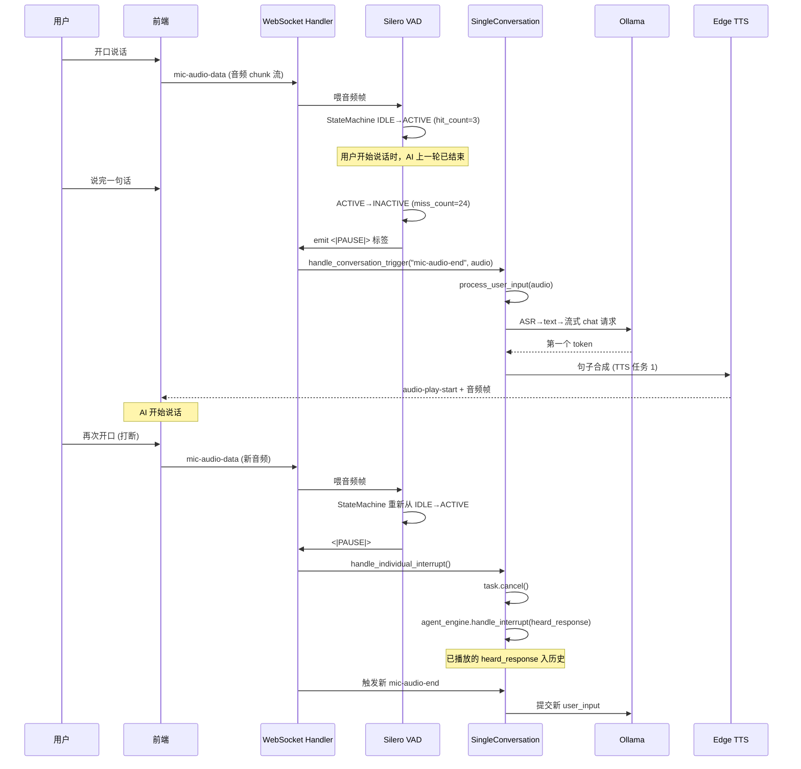

## 阅读指引

**目标读者**：对本地语音 Agent、多模态实时交互、Live2D 接入 LLM 感兴趣的 Python 后端 / 全栈工程师，以及想评估"桌面 AI 伴侣"作为可运行参考实现的从业者。

本文拆解的内容：
- 桌面 AI 伴侣与传统桌面宠物（电子小鸡、桌面精灵）在"打断通道"上的本质差异
- Open-LLM-VTuber 仓库里 `websocket_handler → service_context → vad/silero → agent/transformers → conversations` 这条主链路的职责切分
- Silero VAD 状态机（IDLE / ACTIVE / INACTIVE）+ `asyncio.Task.cancel()` 如何实现"AI 正在说话也能被插嘴"
- LLM 流式输出如何被 `sentence_divider → actions_extractor → tts_filter → display_processor` 一串装饰器逐步改写成"句子 + 表情 + 嘴型 + 字幕"四种信号
- 本地部署时，Ollama / sherpa-onnx / CosyVoice / Edge TTS 各自落到管线的哪一节

**前置知识**：Python 异步编程基础（`asyncio.Task` / `await`），WebSocket 基本概念，对 LLM 流式接口有大致印象。不需要事先了解 Live2D SDK。

**不覆盖**：Live2D Cubism Web SDK 内部实现、Live2D 模型商用授权细节、v2.0 重写方向、具体第三方模型的训练数据。

---

## 一句话核心判断

Open-LLM-VTuber（[仓库地址](https://github.com/Open-LLM-VTuber/Open-LLM-VTuber)，8.3k stars，MIT 后端 / 前端 Live2D 模型单独授权）在 Python 单进程里把"麦克风采样 → VAD 端点检测 → ASR 文字 → 流式 LLM 推理 → 句级切片 → TTS 合成 → Live2D 表情 + 嘴型"做成一条**支持任意环节被打断的实时管线**。当 AI 正在念一长段回答时，你随时可以开口，它能在亚秒级（受 LLM 推理与 TTS 合成链路共同影响）停下、收听你的新输入、然后接话。这种"被打断"的体验，是它和"按一下按钮问一句"的桌面助手在工程复杂度上最关键的鸿沟。

> 注：项目当前最新 release 为 v1.2.1（2025-08-26），v2.0 正在做完整重写，本文所有源码引用基于 `main` 分支当前快照。

---

## 一张图：五段式架构 + 打断通道

```mermaid
graph TB
    subgraph 客户端 "前端 (Live2D Web SDK + Web Audio)"
        MIC[麦克风采样<br/>Web Audio API]
        FE[Live2D 模型<br/>Cubism 5]
    end

    subgraph 服务端 "Python (FastAPI + WebSocket)"
        WS[websocket_handler<br/>消息路由]
        SC[service_context<br/>每客户端一份]
        VAD[vad/silero<br/>语音活动检测]
        ASR[asr/*<br/>7 种实现]
        AG[agent/<br/>BasicMemoryAgent]
        TF[transformers<br/>sentence_divider 等]
        CONV[conversations/<br/>单聊 / 群聊]
        TTS[tts/*<br/>19 种实现]
    end

    subgraph 后端 "可插拔的外部服务"
        OLL[Ollama / OpenAI / Claude / Gemini]
        ASRE[sherpa-onnx / Whisper / FunASR]
        TTSE[Edge TTS / CosyVoice / GPTSoVITS]
    end

    MIC -->|audio chunks| WS
    WS -->|原始音频| VAD
    VAD -->|检测到端点 → mic-audio-end| WS
    WS -->|触发会话| CONV
    CONV -->|请求文字| ASR
    ASR -->|转写文本| CONV
    CONV -->|user_input| AG
    AG -->|流式 token| TF
    TF -->|句子级 chunk| CONV
    CONV -->|TTS 任务| TTS
    TTS -->|音频帧| WS
    WS -->|websocket 推送| FE
    AG -.调用.-> OLL
    ASR -.调用.-> ASRE
    TTS -.调用.-> TTSE

    MIC -.用户再次开口.-> VAD
    VAD -.中断信号.-> WS
    WS -.cancel + 新会话.-> CONV

    style VAD fill:#f96,stroke:#333,stroke-width:2px
    style WS fill:#bbf,stroke:#333,stroke-width:2px
```

阅读这张图的关键不是"几个模块"，而是中间那条**竖向红线**（VAD → WS → CONV）：只要这条打断链路成立，无论你换 Ollama 还是 Claude 都没影响；只要它不成立，再多花哨的 Live2D 模型也只是个"按按钮念台词"的木偶。

---

## 与传统桌面宠物的差异

很多人第一次看到"Live2D + LLM"会自然联想到桌面上"小鸡、小恐龙"那种电子宠物。它们的差异不在形象，在**主循环（main loop）的设计**：

| 维度 | 传统桌面宠物 | 语音助手式桌面宠物 | Open-LLM-VTuber |
|------|-------------|-------------------|-----------------|
| 输入通道 | 鼠标点击、托盘菜单 | 按住说话键 | **免提常驻麦克风** |
| 打断能力 | 不存在 | 需要手动松开按键 | **VAD 自动检测，AI 说话中可被打断** |
| 状态机 | 单向 | 半双工 | **全双工 + 取消旧 asyncio.Task** |
| 输出形式 | 动画 + 文字气泡 | TTS 完整句 | **流式 TTS，首句到达即可发声** |
| 模型可换 | 形象换皮 | 通常锁定云 API | **LLM/ASR/TTS 三类后端都做工厂解耦** |
| Live2D 表情 | 内置 idle 动画 | 一般不支持 | **后端 prompt 注入表情标签，agent 装饰器链解析** |

所谓"全双工"在代码里就一句：`current_conversation_tasks[client_uid].cancel()`。但要做到这句话安全、可重复、不打架，就要先有完整的"任务登记表 + 状态机 + 装饰器链"。

---

## 关键源码拆解

下面这些路径全部来自仓库 `main` 分支当前快照（路径相对于 `src/open_llm_vtuber/`）。我只挑出和"打断 + 表情 + 多后端解耦"这三条主叙事相关的文件。

### 1. `websocket_handler.py` —— 入口与消息路由

整个服务端只有一个 WebSocket endpoint（`server.py` 注册），所有交互都通过 WS 消息的 `type` 字段分发：

```python
# src/open_llm_vtuber/websocket_handler.py
class MessageType(Enum):
    GROUP      = ["add-client-to-group", "remove-client-from-group"]
    HISTORY    = ["fetch-history-list", "fetch-and-set-history", "create-new-history", "delete-history"]
    CONVERSATION = ["mic-audio-end", "text-input", "ai-speak-signal"]
    CONTROL    = ["interrupt-signal", "audio-play-start"]
    DATA       = ["mic-audio-data"]
```

`WebSocketHandler.handle_new_connection()` 给每个新客户端**复制一份** `ServiceContext`（`model_copy(deep=True)`），这是"多客户端互不污染"的工程基线。每个客户端持有自己的 `asr_engine / tts_engine / vad_engine / agent_engine / live2d_model` 引用。

WS 任务表 `current_conversation_tasks: Dict[str, Optional[asyncio.Task]]` 正是打断机制的**核心寄存器**：

```python
self.current_conversation_tasks: Dict[str, Optional[asyncio.Task]] = {}
```

> 注意：单聊用 `client_uid` 当 key，群聊用 `group_id` 当 key，这一步的解耦让"打断某个人"和"打断一个群"在调用栈上是对称的。

### 2. `vad/silero.py` —— 语音活动检测的状态机

VAD 是"打断"这件事的**触发器**。如果 VAD 反应慢/反应过激，AI 就会要么话没说完就闭嘴，要么听不见你说话。

仓库里 VAD 抽象是 `VADInterface`，当前内置实现是 Silero VAD（`silero-onnx` + PyTorch），关键参数写在 `SileroVADConfig`：

```python
class SileroVADConfig(BaseModel):
    orig_sr: int = 16000
    target_sr: int = 16000
    prob_threshold: float = 0.4      # 帧级语音概率阈值
    db_threshold: int = 60           # 帧级音量阈值（dB）
    required_hits: int = 3            # 连续 3 帧 = 0.096s 才确认开始
    required_misses: int = 24        # 连续 24 帧 ≈ 0.768s 才确认结束
    smoothing_window: int = 5        # 滑动窗口平滑
```

`window_size_samples = 512`，即每 32ms 一帧（512/16000）。Silero VAD 的设计是"小窗口连续判定"：

```python
class State(Enum):
    IDLE     = 1   # 等待说话
    ACTIVE   = 2   # 正在说话
    INACTIVE = 3   # 已停口
```

`StateMachine` 在 IDLE 状态下累计 `hit_count`，达到 `required_hits` 才切到 ACTIVE；进 ACTIVE 后累计 `miss_count`，达到 `required_misses` 才切到 INACTIVE。**这套"双阈值 + 平滑窗口"是它能"不戴耳机也听得清你"的关键**——README 把它列为"voice interruption without headphones (AI won't hear its own voice)"的能力，本质就是这两个阈值的取舍。

AI 自己 TTS 出来的声音会通过扬声器回灌麦克风。`db_threshold=60` 的音量门限把"AI 在远处说话"这种低分贝声音直接过滤掉，而 `required_misses=24`（约 0.8s）又让 AI 的句子之间不会因为短暂停顿被误判成"用户开口了"。

### 3. `conversations/conversation_handler.py` —— 打断的实际执行

打断的代码比想象中短，但要读懂它要先把角色分清楚：

- 前端通过 WS 发 `mic-audio-end`（VAD 检测到用户说完一段）或 `interrupt-signal`（用户主动中断）
- 后端走 `handle_individual_interrupt`：

```python
# src/open_llm_vtuber/conversations/conversation_handler.py
async def handle_individual_interrupt(
    client_uid: str,
    current_conversation_tasks: Dict[str, Optional[asyncio.Task]],
    context: ServiceContext,
    heard_response: str,
):
    if client_uid in current_conversation_tasks:
        task = current_conversation_tasks[client_uid]
        if task and not task.done():
            task.cancel()                          # 1) 取消正在跑的协程
            logger.info("🛑 Conversation task was successfully interrupted")

    try:
        context.agent_engine.handle_interrupt(heard_response)   # 2) 通知 LLM agent
    except Exception as e:
        logger.error(f"Error handling interrupt: {e}")

    if context.history_uid:
        store_message(...)                        # 3) 把被打断的回合存进历史
        store_message(role="system", content="[Interrupted by user]")
```

三步缺一不可：

1. **`task.cancel()`** —— Python 协程的取消会顺着 `await` 边界冒泡到所有正在 `await` LLM token / TTS 音频的子协程，让正在排队播放的 TTS 音频立刻停止派发。
2. **`agent_engine.handle_interrupt(heard_response)`** —— 让 LLM agent 知道"用户刚才那段话我没听完，但会被记录"；具体行为由 agent 实现决定（`interrupt_method="user"` 或 `"system"`，见 `BasicMemoryAgent`）。
3. **写历史** —— 把 `heard_response`（AI 已经说出的部分）写进 `chat_history_manager`，并插入一条 `[Interrupted by user]` 系统消息，下次会话载入历史时不会丢失上下文。

**群聊的打断几乎是同一套模板**，只不过 task key 从 `client_uid` 换成 `group_id`，且打断时还会广播给群里的所有成员。

### 4. `agent/transformers.py` —— 把 LLM token 流改写成"能驱动 Live2D"的多路信号

这是整个项目里最 Pythonic 的一段：4 个装饰器把一个 `AsyncIterator[str]` 的流式 LLM 输出，逐步转成 4 类信号。

```python
# src/open_llm_vtuber/agent/transformers.py
@actions_extractor(live2d_model)            # (1) 抽出情绪标签 → Live2D 表情
@display_processor()                         # (2) 解析 display_text → 内心独白
@tts_filter(tts_preprocessor_config)        # (3) 过滤掉 TTS 不能念的字符
@sentence_divider(faster_first_response=True, segment_method="pysbd")  # (4) 切成完整句
async def chat(memory, user_input): ...      # 你的纯流式 LLM 调用
```

实际顺序（装饰器从下往上应用）是 `chat → sentence_divider → tts_filter → display_processor → actions_extractor`，最后 yield 出 `(SentenceWithTags, Actions)` 元组或 `dict`。

最关键的是 **(1) 表情抽取**。`Live2dModel` 在初始化时把 `model_dict.json` 里模型的 `emotionMap` 读成 `emo_map`：

```python
# src/open_llm_vtuber/live2d_model.py
self.emo_map: dict = {k.lower(): v for k, v in self.model_info["emotionMap"].items()}
self.emo_str: str = " ".join([f"[{key}]," for key in self.emo_map.keys()])
# 例如 "[fear], [anger], [disgust], [sadness], [joy], [neutral], [surprise]"
```

`emo_str` 会被拼进 system prompt，告诉 LLM："你想表达情绪时，请在句子里直接写 `[joy]` / `[sadness]` 这种标签"。后端装饰器 `actions_extractor` 解析这些标签后，调用 `live2d_model.extract_emotion(sentence.text)`，把情绪事件通过 WS 推给前端，前端 Live2D SDK 切到对应表情。

**表情驱动不是写死在 prompt 模板里"if 包含'开心'→joy"的字符串匹配，而是 LLM 自己在流式输出中插入结构化标签**。换模型、换人设都不影响表情驱动——只要模型支持中文/英文标签输出。

### 5. `conversations/single_conversation.py` —— 把句子送进 TTS 的实际编排

每条 WS 触发的会话会创建一个 `TTSTaskManager`：

```python
tts_manager = TTSTaskManager()  # 每条会话一个
```

它的职责是接收"句子级 chunk"并调度 TTS 合成 / 取消。流水线大致是：

```text
LLM token stream
  → sentence_divider 切成完整句
  → actions_extractor 抽出表情
  → tts_filter 清洗 TTS 不可读字符
  → TTSTaskManager.audio_to_proactive_speak / speak
  → tts_engine.async_generate_audio(sentence) 
  → 音频流通过 WS 推给前端
  → 前端 Live2D SDK 播放声音 + 切换表情
```

当打断信号来临时，`tts_manager` 收到 `interrupt-signal`，会丢弃尚未播完的句子；已发到前端的音频在 `audio-play-start` 帧之后就被截断。

### 6. `agent/agents/` —— Agent 的可插拔性

仓库的 Agent 设计遵循"接口 + 多种实现"：

| Agent 实现 | 适用场景 | 关键依赖 |
|------------|----------|----------|
| `BasicMemoryAgent` | 默认，滚动窗口记忆 + 工具调用 | 自带 `sentence_divider` 装饰器链 |
| `LettaAgent` | 长期记忆（v1.2.0 新增） | `letta-client` |
| `Mem0LLM` | 第三方记忆系统 | `mem0` |
| `HumeAI` | Hume 的 EVI 情感对话 API | `hume` SDK |

它们都实现 `AgentInterface`：

```python
class AgentInterface(ABC):
    async def chat(...): ...
    def handle_interrupt(self, heard_response: str): ...
    async def close(self): ...
```

用户继承 `AgentInterface` 就可以塞自己设计的 agent（Hume EVI、OpenAI Her、Mem0 等），仓库 README 也明确鼓励这种扩展。

> 顺带一提，**仓库里目前实际可用的 Agent 抽象实现只有这 4 种**（不含前端 MCP/HTTP 客户端）。它不像 LLM/ASR/TTS 有 20+ 后端，agent 维度是"少而精"——这是有意的取舍，避免过早陷入 agent 框架之争。

> Inherit and implement the Agent interface to integrate any Agent architecture, such as HumeAI EVI, OpenAI Her, Mem0, etc.

Open-LLM-VTuber 不打算和你抢 agent 设计的活——它只做"把 agent 输出接上 Live2D 嘴型 + TTS 音频 + 打断通道"这一段，**前端、外观、流式管线三件套**。

### 7. v1.2.0 关键里程碑（来自 Release Notes）

值得在拆解时提一下的几项 v1.2.0 变更（[release 页面](https://github.com/Open-LLM-VTuber/Open-LLM-VTuber/releases/tag/1.2.0)）：

- **MCP（Model Context Protocol）支持** —— agent 可以调外部工具，内置 `time` / `ddg-search` MCP server，浏览器侧还能用 BrowserBase 的 Live View。
- **Letta 长期记忆** —— 之前一直说"long-term memory is temporarily removed"，v1.2.0 借 `LettaAgent` 还回来了。
- **Live2D 升级到 Cubism 5** —— 前端从 `pixi-live2d-display-lipsync` 切到官方 Live2D Web SDK；副作用是 **Cubism 2.1 模型不再支持**，README 明确提示这是 breaking change。
- **B 站直播弹幕接入** —— `live/bilibili_live.py` 把 B 站弹幕转成 `user_input`，理论上可以让 AI 在直播间里"看到"弹幕互动。
- **LM Studio / SparkTTS / SiliconFlow TTS / MiniMax TTS** —— 后端矩阵再扩。

这一波变更说明项目在"对话质量 + 长期记忆 + 工具调用 + 跨平台直播"四个方向同时推进，但**打断机制本身没改动**——它已经是 v1.0.0 时就稳定下来的核心架构。

---

### 8. LLM / ASR / TTS 后端矩阵的工程含义

把"插拔"做到这个粒度不是炫技，而是因为"延迟 × 隐私 × 离线"在每一层的取舍完全不同：

- **LLM 层**：云 API（Claude / GPT-4o / Gemini）质量上限高、隐私差；Ollama / vLLM / LM Studio / llama.cpp 是本地化主力，**Ollama 是 v1.2.0 后配置里 `llm_provider` 的预设项**。
- **ASR 层**：本地离线阵营（sherpa-onnx + SenseVoiceSmall、faster-whisper、whisper.cpp、FunASR）和云 API 阵营（OpenAI Whisper、Groq Whisper、Azure ASR）并行。仓库 release zip 预下载了 `SenseVoiceSmall` 离线模型（**这个文件名是 release notes 写明的**），对内地用户比较友好。
- **TTS 层**：19 种实现里既有 Edge TTS（免 API key 的微软云服务）、ElevenLabs / Cartesia / Azure（云）、也有 CosyVoice（v1+v2）/ GPTSoVITS / MeloTTS / pyttsx3 / Fish Audio（本地+可声音克隆）。**v1.3 计划上"流式 TTS"**——目前多数实现要等整句合成完才发前端，是首句延迟的瓶颈。

> 这种"每层都有 7-19 种可换实现"的工程代价是 `*_factory.py` 抽象层会比较啰嗦，但好处是：你可以**只换一层**做实验，比如把 ASR 从云 Whisper 换到本地 sherpa-onnx，对比首句延迟和准确率，而不必动 LLM 和 TTS。

---

## 一段"用户插嘴"的完整时序

下面是我读代码后还原的、一次典型的"AI 正在回答，被用户打断"的事件流：



注意几个工程细节：

1. **`<|PAUSE|>` 标签是 Silero VAD 的内部协议** —— 在 IDLE→ACTIVE 转换瞬间 yield 这个特殊字节，告诉上层"这里是一段连续语音的开始"，让前端/服务端能正确切分 buffer。
2. **打断的"已听清的部分"是 `heard_response`** —— 它是从 LLM 输出中收集到的、已经经过装饰器链处理过的字符串，由 `TTSTaskManager` 在取消时同步返回。把它写进历史，而不是写 `[用户在 X 时刻说话]`，能保住"上下文连续"。
3. **新会话的 trigger 可以是 `mic-audio-end / text-input / ai-speak-signal` 三种** —— `ai-speak-signal` 用于"AI 主动说话"功能（proactive speaking），由前端定时器触发。

---

## 装上跑一遍的最小路径

这是从仓库 README 和 pyproject.toml 还原出的最小可用步骤，**不要照搬 v1.0.0 之前的老文档**（README 明确说 v1.0.0 是不兼容更新）：

```bash
# 1. 克隆（带 frontend 子模块）
git clone --recurse-submodules https://github.com/Open-LLM-VTuber/Open-LLM-VTuber.git
cd Open-LLM-VTuber

# 2. 安装 uv（项目推荐用 uv 来管依赖）
#    macOS:  brew install uv
#    其他:   https://docs.astral.sh/uv/

# 3. 同步依赖（注意 README 强调 conf.yaml 不再入库）
uv sync

# 4. 启动
uv run run_server.py
```

启动后访问 `http://localhost:8000`（或 electron 桌面端），第一次启动会提示你从 `config_templates/` 复制 `conf.yaml` 模板并填好 LLM / ASR / TTS 后端信息。

### 推荐的后端组合（按"零云、纯本地"严格排序）

| 层级 | 推荐 | 备注 |
|------|------|------|
| LLM | **Ollama** + Qwen2.5 / Llama3.1 | 本地推理，断网可跑；GGUF 也可走 llama.cpp |
| ASR | **sherpa-onnx** + SenseVoiceSmall | 完全离线，中文/英文/日文/韩文都覆盖；预下载在 release zip 里 |
| TTS | **Edge TTS**（免 API key，但需联网） / **CosyVoice** / **GPTSoVITS** | 想纯离线就选 CosyVoice 或 pyttsx3 |
| VAD | **Silero VAD**（默认） | 已经内置 |

> ⚠️ 跨机访问：麦克风 API 只在 `https` / `localhost` 下能拿到 `getUserMedia`，所以手机远程访问桌面端需要反代 + HTTPS，README 也专门提醒了这一点。

---

## 适用边界与决策建议

| 场景 | 建议 |
|------|------|
| 想做"按一下按钮问一句"的桌面助手 | 不必上 Open-LLM-VTuber，直接 LangChain / LlamaIndex 桌面化更轻 |
| 想要"全双工 + Live2D"的伴侣 / 助手 / 直播间数字人 | ✅ 这是它的强项 |
| 想研究"AI 说话中插嘴"的工程范式 | ✅ 仓库代码就是一份开源参考实现 |
| 想要长期记忆 + 工具调用 | ✅ v1.2.0 起有 Letta agent + MCP |
| 想做企业内私有部署 | ⚠️ 注意 Live2D 模型商用授权，中大规模企业单独谈 |
| 想要低延迟直播口播 | ⚠️ 当前 TTS 多数非流式（v1.3 计划补流式 TTS），首句延迟主要由 LLM 首 token + TTS 首包共同决定 |
| 想接 GPT-4o realtime 那种原生多模态语音 | ❌ 当前仓库主要做"模块化拼接"，原生多模态是另一条路线 |

**采用顺序建议**（这是我假设你从零开始做这件事）：

1. **先跑通最小链路**：Ollama + sherpa-onnx + Edge TTS + 默认 Live2D 模型（`mao_pro`），确认能正常对话。
2. **再上打断**：默认配置里打断就是开的，验证你能正常插嘴。
3. **再换形象**：用你自己的 Live2D Cubism 5 模型，编辑 `model_dict.json` 配上 `emotionMap`。
4. **再换声线**：TTS 切到 CosyVoice 或 GPTSoVITS 做声音克隆。
5. **最后接工具/记忆**：上 MCP + Letta agent。

**不要做反了** —— 很多人在第一步就试图塞自定义 agent，结果排查问题时不知道是 LLM 端、网络端、TTS 端还是 WS 端出问题。

---

## FAQ（来自常见问题，但答案以仓库证据为准）

**Q: 它和 neuro-sama 是什么关系？**

README 直接说了：项目名称叫 `Open-LLM-Vtuber` 而不是 `Open-LLM-Waifu`，是因为**最初目标是用开源方案在 Windows 之外的平台上复现 neuro-sama**（闭源 AI VTuber）。它不接 neuro-sama 的模型，但设计目标对标它的体验。

**Q: 真的能"免提 + 不戴耳机"被插嘴吗？**

可以，因为 Silero VAD 的状态机 + `db_threshold` 把"AI 自己 TTS 出来的较远声音"挡掉了。代价是如果你离麦克风很近且开大声，AI 偶尔会听见自己尾音、误以为你要插嘴——这时调高 `db_threshold` 即可。

**Q: MCP 是什么？**

[Model Context Protocol](https://modelcontextprotocol.io/) 是 Anthropic 推动的"让 LLM 调用外部工具"的标准。仓库 v1.2.0 起内置了 `time` 和 `ddg-search` 两个 MCP server，你也可以自己接 BrowserBase 等服务。需要在前端 status bar 看工具调用状态。

**Q: v1.x 和 v2.0 怎么选？**

README 顶部明确写：**v2.0 是一次完整重写**，目前还在早期规划阶段，开发者会修 v1 的 bug，但**不建议在 v1 上提新功能 PR**。新项目可以从 v1.x 起步学思路，但生产部署要评估迁移成本。

**Q: 能在树莓派上跑吗？**

仓库没有显式声明支持 ARM SBC，但 `pyproject.toml` 里对 macOS x86_64 / arm64 都有 `torch` 标记。要在树莓派上跑主要瓶颈是 LLM 推理速度（SBC 上 Ollama 大模型基本不可用），可以考虑用云 API 做 LLM、ASR/TTS/VAD 仍然本地。

**Q: 前端必须用它的 web/desktop 客户端吗？**

是的，至少 v1.x 的 Live2D 表情驱动逻辑在 `frontend/` 子模块里和后端 WS 协议绑定。如果你要换前端，需要复刻 `transformers.emo_str` 那一套 prompt 约定和 WS 消息格式（仓库 `frontend/` 是 `Open-LLM-VTuber-Web` 的 git submodule）。

**Q: 商用 Live2D 模型会被怎么影响？**

仓库的 sample 模型（`shizuku`、`mao_pro` 等）由 Live2D Inc. 单独授权，**MIT 不覆盖它们**。中大型企业商用前要单独谈 Live2D Free Material License Agreement。v1.2.0 之后默认模型换成了 `mao_pro`，因为 `shizuku` 在 Live2D 5 版本里去掉了官方表情。

---

## 结语：参考实现，不是产品

Open-LLM-VTuber 的最大价值不是"给你一个完美 AI 女友"，而是它**完整暴露了一套"语音 + LLM + Live2D + 打断"的开源参考架构**：

- 想知道怎么用 Silero VAD 区分"自己说话 vs 用户说话"？看 `vad/silero.py`。
- 想知道怎么把 LLM 流式输出切到 Live2D 表情？看 `agent/transformers.py`。
- 想知道"AI 正在念台词时被插嘴"怎么工程化？看 `conversations/conversation_handler.handle_individual_interrupt`。
- 想知道怎么给 LLM 装上可插拔 ASR/TTS/MCP？看 `service_context.py` + 各 `*_factory.py`。

每个模块都是"**实现 + 工厂 + 接口**"三层，留好扩展点。

如果你的目标是在生产里跑一个"AI 数字员工"或"AI 直播间主播"，可以把它当作起点；如果只是好奇"桌面 AI 伴侣怎么搭"，clone 下来、按推荐配置跑一遍、再顺着本文这几条路径去翻源码，1~2 小时就能理解这条管线的全貌。

---

## 引用清单

- 仓库主页与 README: <PROTECTED_147>
- Release Notes v1.2.0: <PROTECTED_148>
- v1.2.0 与 v1.1.0 release 页： <PROTECTED_149>
- 项目文档： <PROTECTED_150>
- 关键源码：
  - `src/open_llm_vtuber/websocket_handler.py`
  - `src/open_llm_vtuber/service_context.py`
  - `src/open_llm_vtuber/vad/silero.py`
  - `src/open_llm_vtuber/conversations/conversation_handler.py`
  - `src/open_llm_vtuber/agent/transformers.py`
  - `src/open_llm_vtuber/agent/agents/basic_memory_agent.py`
  - `src/open_llm_vtuber/live2d_model.py`
  - `pyproject.toml` / `requirements.txt`
- Silero VAD 文档： <PROTECTED_151>
- MCP 协议： <PROTECTED_152>
