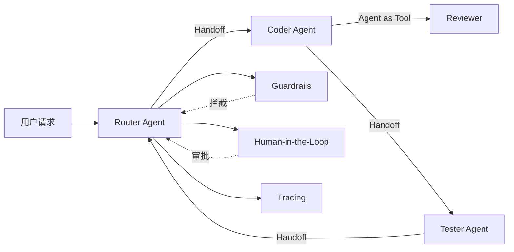
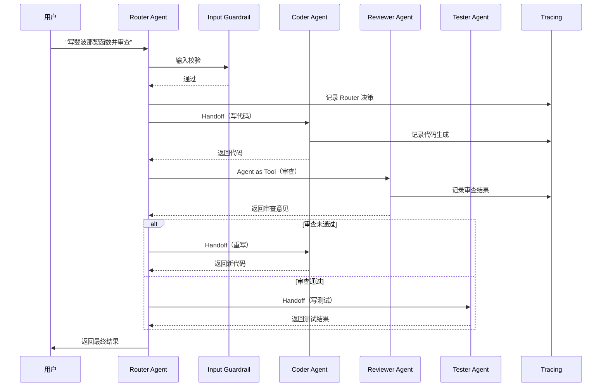

# OpenAI Agents SDK：官方多智能体工作流框架

OpenAI Agents SDK 真正解决的问题不是"调用模型"，而是把多个 LLM 调用组织成一条可观测、可校验、可交接的流水线。它把 Agent、工具、安全检查、人工介入和会话管理打包成同一套编程模型，目标读者是已经在用 LLM API、但发现单 Agent 架构在复杂任务中不够用的开发者。

> **前置知识**：Python 基础、LLM API 使用经验、对 Agent 概念有基本了解
> **技术栈**：Python 3.10+ / OpenAI Responses API / MCP / Pydantic v2

## 这篇文章覆盖什么

文章重点在 SDK 的设计取舍，不在 API 签名。下面几个问题是阅读时的主线：
1. OpenAI Agents SDK 和 LangChain / LangGraph 的定位差异
2. Agent、Handoff、Tool 三者的协作关系与各自边界
3. Sandbox Agent 在什么场景下比普通 Agent 更合适
4. Guardrails 的拦截时机（输入前 / 输出后）和失败后的行为
5. Human-in-the-loop 的触发条件设计与动态介入
6. 用 Tracing 定位 Agent 行为异常的实际步骤

---

## 单 Agent 为什么不够用

当一个 Agent 试图覆盖所有任务时，最直接的问题是系统提示词膨胀——为了告诉模型"什么时候该做什么"，instructions 越写越长，模型反而更容易漏掉关键约束。工具列表同理，把搜索、代码执行、文件读写、数据库查询全挂在一个 Agent 上，模型在工具选择上的出错率会明显上升。

更隐蔽的问题是上下文污染。一次代码生成任务里夹带的错误日志，会影响后续无关问答的质量；一次工具调用返回的超长结果，会挤掉早期的关键指令。单 Agent 架构里，这些上下文都共享同一个对话窗口，没有自然的隔离边界。

多 Agent 架构的思路是把职责拆开：每个子 Agent 只做一件事，指令更短，上下文更干净，出错的爆炸半径也更小。Agent 之间通过明确的交接协议协作，Guardrails 在交接边界上做安全检查，Tracing 让每一步都有据可查。OpenAI Agents SDK 就是把这套思路落成了一组可复用的 Python 原语。

## SDK 总览：先分清几套并行机制

SDK 内部有几套容易混淆的机制，先明确边界，再看细节会清晰很多。



最容易混的三组机制：

| 机制 | 作用 | 触发方式 | 典型场景 |
|------|------|----------|----------|
| `tools=[agent]`（Agent as Tool） | 把子 Agent 当工具调用，父 Agent 拿到返回值后继续 | 模型自主决定调用 | 代码生成 → 代码审查（子 Agent 只出结果，不接管会话） |
| `handoffs=[agent]` | 把会话控制权完整交给另一个 Agent | 父 Agent 指令触发 `handoff_to()` | 路由分发、多轮子任务 |
| `handoff(agent, context=...)` | 带上下文交接，传递优先级/部门等元信息 | 通过 `handoff()` 包装 | 带紧急标记的任务路由 |
| 条件 Handoff | 在运行时根据输入动态选择目标 Agent | 自定义函数返回值 | 按用户意图动态分发 |

关键区分点：Agent as Tool 是"调用—返回"，父 Agent 始终掌握会话；Handoff 是"移交—接管"，目标 Agent 拿到控制权后，原 Agent 不再参与本轮。这两种模式不能互相替代——需要保留上下文连续性时用 Tool，需要切换主导权时用 Handoff。

为什么要把这些机制拆开？因为多 Agent 系统里最常见的故障源就是控制权混乱——父 Agent 以为子 Agent 只是个工具，结果子 Agent 接管了会话；或者父 Agent 想保留决策权，却用了 Handoff 把控制权交了出去。把 Tool 和 Handoff 做成显式区分的 API，是为了让控制流在代码层面可读，而不是藏在 instructions 的措辞里。

SDK 的整体定位：

| 特性 | 说明 |
|------|------|
| **Provider Agnostic** | 支持 OpenAI API 及 100+ 第三方 LLM |
| **类型安全** | 完整 Pydantic v2 集成 |
| **内置能力** | Sandbox / Tracing / Handoff / Guardrails 全部内置 |
| **生产验证** | 已用于 OpenAI 内部多个生产级 Agent 系统 |

---

## Agent 体系：LLM + 指令 + 工具 + 安全配置

### Agent 的定义

Agent 是 LLM、指令、工具和安全配置的组合：

```python
from agents import Agent

agent = Agent(
    name="Research Assistant",      # Agent名称
    instructions="""                # 系统指令
        You are a research assistant.
        You excel at finding accurate information
        and citing your sources.
    """,
    tools=[search_web, read_file],  # 可用工具列表
    model="gpt-4o",                 # 指定模型（可选）
)
```

### Agent 的核心组件

```python
Agent(
    # 身份与指令
    name: str,                      # Agent名称（唯一标识）
    instructions: str | Callable,   # 系统提示词（静态或动态生成）

    # 模型配置
    model: str | Model = "gpt-4o", # 模型选择
    model_provider: str = "openai", # 模型提供商

    # 工具系统
    tools: list[Tool] = [],         # 可用工具列表
    tool_classes: list[type] = [],  # 工具类（自动实例化）

    # 安全与控制
    guardrails: list[Guardrail] = [],  # 输入输出安全校验
    handoffs: list[Agent] = [],         # 可转交的Agent列表

    # 记忆与会话
    session_recency_config = None,   # 记忆配置
    max_tokens = None,              # 输出token限制
)
```

`instructions` 支持传入函数，函数接收运行上下文，返回字符串。这在需要根据用户身份、会话历史动态生成系统提示词时有用——同一个客服 Agent，对 VIP 用户和普通用户给出不同的服务承诺，靠的就是这个机制。

### 内置 Agent 类型

**普通 Agent**：基于 LLM 的对话 Agent

```python
agent = Agent(name="Assistant", instructions="You are helpful.")
```

**Sandbox Agent**：隔离环境执行的 Agent（v0.14.0+）

```python
from agents.sandbox import SandboxAgent, Manifest, GitRepo

sandbox_agent = SandboxAgent(
    name="Code Assistant",
    instructions="Inspect files and run commands in the sandbox.",
    default_manifest=Manifest(entries={"repo": GitRepo(repo="owner/repo", ref="main")}),
)
```

**Realtime Agent**：语音交互 Agent

```python
from agents.realtime import RealtimeAgent

voice_agent = RealtimeAgent(
    name="Voice Assistant",
    instructions="You are a helpful voice assistant.",
    model="gpt-realtime-1.5",
)
```

Sandbox Agent 和普通 Agent 的区别不在"能不能执行代码"，而在"执行环境是否隔离"。普通 Agent 调用 `function_tool` 时，代码直接跑在宿主进程里；Sandbox Agent 通过 Manifest 声明可访问的文件源（Git 仓库、本地目录、URL），在独立的沙箱客户端里执行命令，适合让 LLM 操作不可信代码或不可信仓库。

---

## 工具系统：Function Calling + MCP

### Function Tool

定义 Python 函数作为 Agent 工具：

```python
from agents import Agent, function_tool

@function_tool
def search_web(query: str) -> str:
    """Search the web for information."""
    # 实现搜索逻辑
    return f"Results for: {query}"

@function_tool
def calculate(expression: str) -> float:
    """Evaluate a math expression."""
    return eval(expression)

agent = Agent(
    name="Assistant",
    instructions="You can use tools to help answer questions.",
    tools=[search_web, calculate],
)
```

`@function_tool` 会从函数签名和 docstring 自动生成工具 schema，Pydantic 负责参数校验。函数的 type hint 越精确，模型调用时传错参数的概率越低。上例里的 `eval` 仅作演示，生产环境应换成 `ast.literal_eval` 或专用的表达式解析库，避免注入风险。

### MCP (Model Context Protocol) Tool

连接外部 MCP 服务器的工具：

```python
from agents import Agent
from agents.tools.mcp import MCPTool

# 连接MCP服务器
mcp_tool = MCPTool(
    command="npx",
    args=["-y", "@modelcontextprotocol/server-filesystem", "/path/to/files"],
)

agent = Agent(
    name="File Assistant",
    instructions="You can read and write files.",
    tools=[mcp_tool],
)
```

MCP 把工具做成可复用的独立服务：一个 MCP 服务器写好后，任何支持 MCP 的客户端（Claude Desktop、Cursor、Agents SDK）都能直接调用，不用为每个宿主重写工具封装。

### Agents as Tools

Agent 本身也可以作为工具被其他 Agent 调用：

```python
# 定义子Agent
coder = Agent(
    name="Coder",
    instructions="You write Python code.",
    tools=[...],
)

reviewer = Agent(
    name="Reviewer",
    instructions="You review code for bugs.",
)

# 父Agent可以使用子Agent
parent_agent = Agent(
    name="Team Lead",
    instructions="Coordinate a coding team.",
    tools=[coder, reviewer],  # Agent作为工具
    handoffs=[coder, reviewer],
)
```

同一个子 Agent 可以同时出现在 `tools` 和 `handoffs` 里——父 Agent 既可以把它当工具调用（拿到结果后继续），也可以把会话移交给它（让它接管后续对话）。选择哪种模式取决于父 Agent 是否需要保留控制权。

---

## Handoff：Agent 间的会话移交

### Handoff 机制

Handoff 是 Agent 之间的"交接棒"机制：

```python
# Agent A
agent_a = Agent(
    name="Router",
    instructions="Classify the user's intent and hand off to the right agent.",
    handoffs=[coder_agent, writer_agent, analyst_agent],
)

# Agent B
coder_agent = Agent(
    name="Coder",
    instructions="You write code.",
)

# 从Agent A交接给Agent B
# 在Agent A的指令中触发：handoff_to(coder_agent)
```

Handoff 触发后，目标 Agent 接管会话，原 Agent 不再参与本轮。这意味着目标 Agent 的 instructions 会替换原 Agent 的，工具列表也会切换。如果希望目标 Agent 知道"为什么被叫过来"，需要通过上下文传递。

### 带上下文的 Handoff

Handoff 可以传递上下文信息：

```python
from agents import Agent, RunContextWrapper, handoff

# 带配置的Handoff
handoff_to_analyst = handoff(
    agent=analyst_agent,
    # 传递额外上下文
    context={
        "priority": "high",
        "department": "engineering",
    },
)

router = Agent(
    name="Router",
    instructions="Route to analyst with priority context.",
    handoffs=[handoff_to_analyst],
)
```

### 条件 Handoff

```python
async def route_to_specialist(context: RunContextWrapper) -> Agent:
    """根据用户输入决定转交给哪个Agent"""
    user_input = context.messages[-1].content.lower()

    if "code" in user_input or "debug" in user_input:
        return coder_agent
    elif "write" in user_input or "article" in user_input:
        return writer_agent
    else:
        return general_agent

agent = Agent(
    name="Router",
    instructions="Route to the appropriate specialist.",
    handoffs=[coder_agent, writer_agent, general_agent],
    handoff_condition=route_to_specialist,
)
```

条件 Handoff 适合意图分类不稳定的场景——当模型自主判断不可靠时，用规则函数兜底。但规则函数本身也会成为维护负担，意图分支多了之后，规则会越写越脆。一个实用的折中是：常见意图走规则，长尾意图交给模型自主 Handoff。

---

## Guardrails：在边界上做安全校验

### Guardrail 的工作位置

Guardrails 在输入和输出阶段进行安全校验：

```
用户输入 → [Input Guardrail] → Agent处理 → [Output Guardrail] → 用户输出
                   │                                    │
                   ▼                                    ▼
             验证/过滤/拒绝                        验证/过滤/拒绝
```

Input Guardrail 在 Agent 处理之前运行，Output Guardrail 在 Agent 返回之后运行。两者都是可选的，触发后会抛出异常或返回拒绝结果，具体行为取决于 Guardrail 的实现。

### 内置 Guardrails

```python
from agents.guardrails import (
    PIIGuardrail,      # 个人身份信息检测
    ToxicityGuardrail, # 有害内容检测
    RelevanceGuardrail, # 相关性检测
)

agent = Agent(
    name="Assistant",
    instructions="You are a helpful assistant.",
    guardrails=[
        PIIGuardrail(),        # 拒绝包含PII的输入
        ToxicityGuardrail(),   # 拒绝有害输出
        RelevanceGuardrail(threshold=0.3),  # 拒绝不相关输入
    ],
)
```

### 自定义 Guardrail

```python
from agents.guardrails import InputGuardrail, OutputGuardrail, GuardrailFunctionOutput

class CustomInputGuardrail(InputGuardrail):
    name = "custom_input_guardrail"

    async def check(self, context: RunContextWrapper) -> GuardrailFunctionOutput:
        user_input = context.messages[-1].content

        # 自定义检查逻辑
        if contains_profanity(user_input):
            return GuardrailFunctionOutput(
                tripwire_triggered=True,
                message="Please use appropriate language.",
            )

        return GuardrailFunctionOutput(tripwire_triggered=False)

agent = Agent(
    name="Assistant",
    guardrails=[CustomInputGuardrail()],
)
```

`tripwire_triggered=True` 会中断当前运行，触发 `GuardrailTripwireTriggered` 异常。生产环境通常需要在 Runner 外层捕获这个异常，转成用户友好的提示，而不是把堆栈直接抛给前端。Guardrails 的代价是延迟——每条 Guardrail 都是一次额外调用，叠加多了会让首字响应明显变慢，建议只保留与业务强相关的检查。

---

## Human-in-the-Loop：在关键节点插入人工审批

### 介入模式

```python
from agents import Agent
from agents.human_in_the_loop import Approval, Form

# 方式1：Approval（简单批准）
agent = Agent(
    name="Assistant",
    instructions="Ask for approval before executing dangerous actions.",
    human_in_the_loop=[
        Approval(prompt="Approve this action?", tools=["delete_file"]),
    ],
)

# 方式2：Form（结构化输入）
human_feedback_form = Form(
    name="feedback",
    description="Get feedback from human",
    fields=[
        {"name": "approved", "type": "boolean", "description": "Is this correct?"},
        {"name": "correction", "type": "string", "description": "What should be changed?"},
    ],
)

agent = Agent(
    name="Assistant",
    human_in_the_loop=[human_feedback_form],
)
```

Approval 适合二值决策（执行/不执行），Form 适合需要补充信息的场景（比如让用户修正 Agent 的理解）。两者都通过 `tools` 参数限定触发范围——只有调用指定工具时才弹出审批，避免每个动作都打断流程。

### 动态介入

```python
from agents import Agent, RunConfig

# 根据条件决定是否介入
run_config = RunConfig(
    human_in_the_loop=[
        Approval(
            prompt="Confirm deployment?",
            tools=["deploy_to_production"],
            condition=lambda ctx: "production" in ctx.messages[-1].content,
        ),
    ],
)
```

`condition` 让审批只在特定条件下触发——比如只有当用户消息包含"production"时，部署操作才需要人工确认。这比"所有操作都要审批"实用得多，后者会让 Agent 的响应延迟高到不可用。

---

## Sandbox Agent：隔离执行不可信代码

### Sandbox Agent 概述

Sandbox Agent 在隔离环境中执行任务，适合需要文件系统访问、命令执行的场景：

```python
from agents import Runner
from agents.run import RunConfig
from agents.sandbox import Manifest, SandboxAgent, SandboxRunConfig
from agents.sandbox.entries import GitRepo, LocalFiles

agent = SandboxAgent(
    name="Workspace Assistant",
    instructions="Inspect the workspace before answering.",
    default_manifest=Manifest(
        entries={
            "repo": GitRepo(repo="openai/openai-agents-python", ref="main"),
            "local": LocalFiles(path="/path/to/project"),
        }
    ),
)

result = Runner.run_sync(
    agent,
    "What files were modified in the last commit?",
    run_config=RunConfig(
        sandbox=SandboxRunConfig(
            client=UnixLocalSandboxClient(),  # 本地隔离环境
        )
    ),
)
```

### Manifest 配置

```python
from agents.sandbox import Manifest
from agents.sandbox.entries import GitRepo, URL, LocalFiles

manifest = Manifest(
    entries={
        "repo": GitRepo(
            repo="owner/repo",
            ref="main",
            include=["*.py", "*.md"],  # 只同步特定文件
        ),
        "docs": URL(url="https://docs.example.com"),
        "local": LocalFiles(path="/path/to/data"),
    }
)
```

Manifest 是 Sandbox 的访问控制清单——只有声明在 entries 里的资源，沙箱才能访问。`include` 参数可以进一步过滤，比如只同步 `.py` 和 `.md` 文件，避免把整个仓库（包括二进制、密钥文件）拉进沙箱。

### Sandbox 类型

| Sandbox 类型 | 说明 | 适用场景 |
|-------------|------|----------|
| UnixLocalSandboxClient | 本地 Unix 环境 | 开发/测试 |
| DockerSandboxClient | Docker 容器 | 生产隔离 |
| E2BSandboxClient | 云端沙箱 | 付费托管 |

开发阶段用 UnixLocalSandboxClient 足够，生产环境建议切到 Docker 或 E2B——前者依赖宿主机的隔离能力，后者把执行环境完全外包，适合不想自己维护沙箱基础设施的团队。

---

## Tracing：让每一步都有据可查

### 内置 Tracing

OpenAI Agents SDK 内置 Tracing，无需额外配置：

```python
from agents import Agent, Runner
from agents.tracing import trace

# 方式1：自动Tracing
agent = Agent(name="Assistant", instructions="You are helpful.")
result = await Runner.run(agent, "Hello!")

# 方式2：手动Tracing
with trace("My Agent Workflow"):
    result = await Runner.run(agent, input)
```

### Tracing UI

SDK 自动将追踪数据发送到 OpenAI 的 Tracing 服务，可在 UI 中查看：
- Agent 调用链
- 工具执行时间
- Token 消耗
- 中间输出

### 自定义 Span

```python
from agents.tracing import trace, Span

with trace("Custom Workflow") as span:
    span.set_attribute("user_id", user_id)

    with trace("Step 1"):
        result1 = await step1()

    with trace("Step 2"):
        result2 = await step2(result1)

    span.set_status("success")
```

Tracing 在调试多 Agent 链路时几乎是必需的——当一次请求穿过 Router → Coder → Reviewer 三个 Agent，光看最终输出很难定位是哪个环节的 instructions 写得不对。Tracing UI 能展开每一步的输入、输出和耗时，把"黑盒"变成"白盒"。排查思路通常是：先看调用链是否按预期 Handoff，再看每一步的输入是否被上游污染，最后看 Token 消耗是否异常飙升。

---

## Sessions：跨轮次的会话管理

### 自动会话管理

```python
from agents import Agent, Runner
from agents.sessions import Session

# 自动创建和管理会话
session = await Session.create()

agent = Agent(name="Assistant", instructions="You are helpful.")

# 第一次对话
result1 = await Runner.run(agent, "My name is Alice.", session_id=session.id)

# 第二次对话（自动包含历史）
result2 = await Runner.run(agent, "What's my name?", session_id=session.id)
# → "Your name is Alice."
```

### Redis 会话存储（可选）

```bash
pip install 'openai-agents[redis]'
```

```python
from agents.sessions import RedisSessionManager

session_manager = RedisSessionManager(
    redis_url="redis://localhost:6379",
)

session = await Session.create(
    session_manager=session_manager,
    user_id="user_123",
)
```

默认的会话存储是内存级的，进程重启就丢。生产环境用 Redis 后端，可以跨进程、跨实例共享会话历史，适合部署在多副本架构里。如果每次请求都是一次性的（比如无状态的分类任务），可以不启用 Sessions，避免不必要的存储开销。

---

## 任务流案例：一次代码审查请求如何穿过系统

把前面几个机制串起来看。假设用户发来一条请求："帮我写一个斐波那契函数，然后审查一下"。



这条请求在系统里的实际路径：

1. **Router 接收请求**，Input Guardrail 先检查输入是否包含敏感信息或越界请求。
2. **Router 判断意图**，识别出"写代码 + 审查"是复合任务，决定先 Handoff 给 Coder。
3. **Coder 接管会话**，生成斐波那契函数，完成后 Handoff 回 Router。Tracing 记录这一步的输入、输出和 Token 消耗。
4. **Router 调用 Reviewer**——这里用的是 Agent as Tool 而不是 Handoff，因为 Router 需要拿到审查结果后继续决策，不能让 Reviewer 接管会话。
5. **如果审查未通过**，Router 再次 Handoff 给 Coder 重写；如果通过，Handoff 给 Tester 写测试。
6. **Tester 完成后**，Router 汇总结果返回给用户。整个链路的每一步都在 Tracing 里有记录。

这个案例里最关键的取舍是第 4 步：为什么用 Agent as Tool 而不是 Handoff？因为审查是 Router 决策链的一环，Router 需要根据审查结果决定"重写还是测试"。如果用 Handoff，Reviewer 会接管会话，Router 就失去了对流程的控制权。主干用 Handoff、分支用 Tool 的混合模式，是多 Agent 编排里常见的实用写法。

如果发现 Router 经常把请求移交给错误的 Agent，调整顺序通常是：先改 instructions（最轻，但效果最不确定），再调整 handoffs 列表的组成，最后才引入条件 Handoff（最重，但最可控）。

---

## 完整示例：多 Agent 协作

### 代码审查团队

```python
from agents import Agent, Runner, RunConfig, handoff

# 定义三个专业Agent
coder = Agent(
    name="Coder",
    instructions="You write clean, efficient Python code.",
)

reviewer = Agent(
    name="Reviewer",
    instructions="You review code for bugs, security issues, and style problems.",
)

tester = Agent(
    name="Tester",
    instructions="You write comprehensive tests for the code.",
    handoffs=[reviewer],  # 测试失败转回审查
)

# 协调Agent
coordinator = Agent(
    name="Coordinator",
    instructions="""You coordinate a code review team.
    1. First, hand off to Coder to write the code
    2. Then hand off to Reviewer to review it
    3. If there are issues, the Reviewer will send it back to Coder
    4. Once approved, hand off to Tester to write tests
    5. If tests fail, Tester sends back to Reviewer""",
    handoffs=[
        handoff(agent=coder),
        handoff(agent=reviewer),
        handoff(agent=tester),
    ],
)

# 执行工作流
result = await Runner.run(coordinator, "Write a function to calculate fibonacci numbers.")
```

### 带 Guardrail 和 Tracing 的完整配置

```python
from agents import Agent, Runner, RunConfig
from agents.guardrails import PIIGuardrail, ToxicityGuardrail

config = RunConfig(
    tracing_export_endpoint="https://api.openai.com/tracing",  # 可选
    human_in_the_loop=[Approval(prompt="Proceed?", tools=["delete_data"])],
)

agent = Agent(
    name="Safe Assistant",
    instructions="You are a helpful assistant.",
    guardrails=[
        PIIGuardrail(),
        ToxicityGuardrail(),
    ],
)

result = await Runner.run(agent, "Hello!", run_config=config)
```

---

## 部署与生产

### 环境要求

- Python 3.10+
- OpenAI API Key（或第三方 LLM API Key）

### 安装

```bash
# 标准安装
pip install openai-agents

# 带语音支持
pip install 'openai-agents[voice]'

# 带Redis会话支持
pip install 'openai-agents[redis]'
```

### 与 LangChain/LangGraph 对比

| 特性 | OpenAI Agents SDK | LangChain | LangGraph |
|------|------------------|-----------|-----------|
| **定位** | 多 Agent 协作框架 | LLM 应用框架 | 图编排框架 |
| **学习曲线** | 低 | 中 | 高 |
| **Guardrails** | 内置 | 需第三方 | 需第三方 |
| **Sandbox** | 内置 | 无 | 无 |
| **Tracing** | 内置 | LangSmith（付费） | LangSmith（付费） |
| **Provider** | OpenAI 官方 | 社区驱动 | 社区驱动 |

这张表不是"谁更好"的排名。LangChain 适合需要大量预置工具集成和文档处理管道的场景；LangGraph 适合需要精细状态管理和复杂图编排的场景；OpenAI Agents SDK 的优势在于多 Agent 交接、Sandbox 和 Guardrails 都内置，且与 OpenAI 生态深度集成。如果工作流以"多角色协作 + 安全校验"为主，SDK 的开箱即用程度最高。

---

## 采用顺序与适用边界

**建议先上的团队**：已经在用 OpenAI 生态、需要将单 Agent 拆分为多 Agent 协作的团队；当前工作流中有明确的角色分工（如代码生成 → 审查 → 测试），但缺乏系统化交接机制的团队。

**可以先观望的情况**：团队已深度绑定了 LangGraph 的图编排模式，并且需要更细粒度的状态管理；或者工作流仍以单 Agent + 工具调用为主、暂时不需要多 Agent 交接的场景。

**起步建议**：从 Agent + handoffs 的最小组合开始，先不引入 Sandbox 和 Human-in-the-loop；跑通一条两 Agent 交接链路后，再加入 Guardrails 和 Tracing。Sandbox 和 Human-in-the-loop 涉及更多基础设施（沙箱环境、审批前端），最后再上。

---

## FAQ

**Q1：OpenAI Agents SDK 只能用于 OpenAI 模型吗？**
不限于 OpenAI。它是 provider-agnostic 的，支持 OpenAI、Azure、Anthropic 及 100+ 第三方 LLM。

**Q2：Sandbox Agent 安全吗？**
Sandbox Agent 在隔离环境中执行文件操作和命令，默认只读本地 Git 仓库。生产环境建议使用 Docker 或云端沙箱。

**Q3：Guardrails 会影响性能吗？**
会有轻微延迟（通常 <100ms），但相比无防护时因有害输出导致的回滚成本，这点开销是合理的。叠加多条 Guardrails 时要注意累计延迟。

**Q4：如何调试 Agent 行为？**
使用内置 Tracing，可以查看每个 Agent 调用、工具执行、Token 消耗的详细信息。排查顺序通常是：先看调用链是否按预期 Handoff，再看每步输入是否被上游污染，最后看 Token 消耗是否异常。

**Q5：支持语音 Agent 吗？**
支持。使用 Realtime Agent 配合 `gpt-realtime-1.5` 模型即可构建语音交互 Agent。

**Q6：Agent as Tool 和 Handoff 怎么选？**
需要保留会话控制权时用 Agent as Tool（父 Agent 拿到结果后继续决策）；需要切换主导权时用 Handoff（目标 Agent 接管后续对话）。两者可以混用——主干流程用 Handoff，分支决策用 Tool。

---

## 相关资源

- **GitHub 仓库**：https://github.com/openai/openai-agents-python
- **官方文档**：https://openai.github.io/openai-agents-python/
- **JavaScript 版本**：https://github.com/openai/openai-agents-js
- **示例代码**：https://github.com/openai/openai-agents-python/tree/main/examples
