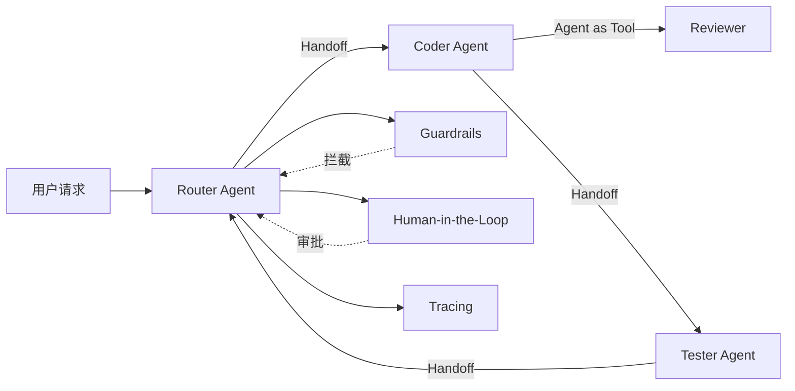
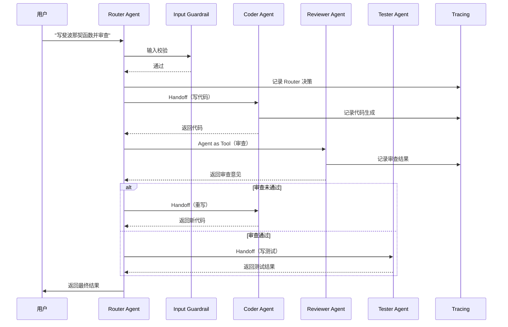

# OpenAI Agents SDK：官方多智能体工作流框架

OpenAI Agents SDK 真正解决的问题不是"调用模型"，而是把多个 LLM 调用组织成一条可观测、可校验、可交接的流水线。它把 Agent、工具、安全检查、人工介入和会话管理打包进同一套编程模型，目标读者是已经在用 LLM API、但发现单 Agent 架构在复杂任务里不够用的开发者。

> **前置知识**：Python 基础、LLM API 使用经验、对 Agent 概念有基本了解
> **技术栈**：Python 3.10+ / OpenAI Responses API / MCP / Pydantic v2
> **版本口径**：正文以 `openai-agents` 0.22.3（2026-09-17 发布）与 main 分支为准，核对日期 2026-09-29。SDK 迭代很快，API 以你安装的版本为准。

## 这篇文章覆盖什么

重点在 SDK 的设计取舍，不在逐条 API 签名。阅读主线：

1. Agents SDK 和 LangChain / LangGraph 的定位差异
2. Agent 作为 Tool（`Agent.as_tool()`）和 Handoff 的边界与选择
3. Sandbox Agent 在什么场景下比普通 Agent 更合适
4. Guardrails 的三种拦截位置（输入前 / 输出后 / 工具调用）与执行模式
5. Human-in-the-loop（人工审批）的触发条件与暂停恢复流程
6. 用 Tracing 定位多 Agent 链路异常的实际步骤

---

## 单 Agent 为什么不够用

当一个 Agent 试图覆盖所有任务，最直接的问题是系统提示词膨胀。为了告诉模型"什么时候该做什么"，instructions 越写越长，模型反而更容易漏掉关键约束。工具列表同理，把搜索、代码执行、文件读写、数据库查询全挂在一个 Agent 上，模型在工具选择上的出错率会明显上升。

更隐蔽的问题是上下文污染。一次代码生成任务里夹带的错误日志，会影响后续无关问答的质量；一次工具调用返回的超长结果，会挤掉早期的关键指令。单 Agent 架构里，这些上下文都共享同一个对话窗口，没有自然的隔离边界。

多 Agent 的思路是把职责拆开：每个子 Agent 只做一件事，指令更短、上下文更干净、出错的爆炸半径也更小。Agent 之间通过明确的交接协议协作，Guardrails 在交接边界做校验，Tracing 让每一步都有据可查。Agents SDK 就是把这套思路落成一组可复用的 Python 原语。

## SDK 总览：先分清两种协作机制


```mermaid
flowchart LR
    U[用户请求] --> R[Router Agent]
    R -->|Handoff| C[Coder Agent]
    C -->|Agent as Tool| RV[Reviewer]
    C -->|Handoff| T[Tester Agent]
    T -->|Handoff| R
    R --> G[Guardrails]
    G -.->|拦截| R
    R --> H[Human-in-the-Loop]
    H -.->|审批| R
    R --> TR[Tracing]
```

最容易混的两组机制，区别在会话控制权谁掌握：

| 机制 | 作用 | 触发方式 | 典型场景 |
|------|------|----------|----------|
| `Agent.as_tool()` | 把子 Agent 当工具调用，父 Agent 拿到返回值后继续 | 模型自主决定调用 | 代码生成 → 代码审查（子 Agent 只出结果，不接管会话） |
| `handoffs=[agent]` | 把会话控制权完整交给另一个 Agent | 模型调用对应的 `transfer_to_*` 交接工具 | 路由分发、多轮子任务 |

关键判断点：Agent as Tool 是"调用—返回"，父 Agent 始终掌握会话；Handoff 是"移交—接管"，目标 Agent 拿到控制权后，原 Agent 不再主导本轮。两者不能互相替代——需要保留上下文连续性时用 Tool，需要切换主导权时用 Handoff。

为什么要显式区分？多 Agent 系统里最常见的故障源就是控制权混乱：父 Agent 以为子 Agent 只是个工具，结果它接管了会话；或者父 Agent 想保留决策权，却用了 Handoff 把控制权交出去。把 Tool 和 Handoff 做成两种 API，是为了让控制流在代码层面可读，而不是藏在 instructions 的措辞里。

SDK 的整体定位：

| 能力 | 说明 |
|------|------|
| **原语少** | Agent、Tools、Handoffs、Guardrails、Sessions、Tracing，Python-first |
| **Provider-agnostic** | 内置 OpenAI Responses 与 Chat Completions 两种 API，官方宣称支持 100+ LLM；第三方模型经 any-llm 或 LiteLLM 适配器接入 |
| **类型安全** | Pydantic v2 全程参数校验 |
| **血统** | OpenAI 官方出品，是早期实验项目 Swarm 的生产级升级版 |

---

## Agent 体系：LLM + 指令 + 工具 + 安全配置

### Agent 的定义

Agent 是 LLM、指令、工具和安全配置的组合：

```python
from agents import Agent

agent = Agent(
    name="Research Assistant",
    instructions="""You are a research assistant.
        You excel at finding accurate information and citing sources.""",
    tools=[search_web, read_file],
)
```

没有指定 `model`，SDK 会用运行时默认模型。想固定型号就显式传 `model="gpt-5.6-luna"` 这样的字符串，或传一个 `Model` 实例。（这里的 `search_web`、`read_file` 假设已按下一节的 `@function_tool` 方式定义。）

### Agent 的核心组件

```python
Agent(
    name: str,                          # Agent 名称（唯一标识）
    instructions: str | Callable | None,  # 系统提示词（静态字符串或动态生成函数）
    prompt: Prompt | Callable | None,   # 声明式 Prompt 对象（在代码外配置指令与工具；仅 OpenAI 模型的 Responses API 支持）
    model: str | Model | None = None,   # 模型选择；None 时用默认模型
    model_settings: ModelSettings,      # 温度、推理力度等模型参数
    tools: list[Tool] = [],             # 可用工具
    mcp_servers: list[MCPServer] = [],  # 挂载的 MCP 服务器
    handoffs: list[Agent | Handoff] = [],  # 可转交的 Agent
    input_guardrails: list[InputGuardrail] = [],   # 输入安全校验
    output_guardrails: list[OutputGuardrail] = [], # 输出安全校验
    output_type: type | None = None,    # 结构化输出的类型
    tool_use_behavior: ...,             # 工具结果是否直接作为最终输出
    reset_tool_choice: bool = True,     # 工具调用一轮后是否重置 tool_choice
)
```

注意几个容易想当然的地方：`model` 不传时不是写死某个型号，而是取运行时默认模型（0.22.x 里是 `gpt-5.6-luna`，可用环境变量 `OPENAI_DEFAULT_MODEL` 覆盖）；安全校验没有统一的 `guardrails` 字段，输入和输出分成 `input_guardrails`、`output_guardrails` 两组。

`instructions` 支持传入函数，函数接收运行上下文和 Agent 实例，返回字符串（同步或异步皆可）。需要根据用户身份、会话历史动态生成提示词的场景用得上——同一个客服 Agent，对 VIP 用户和普通用户给出不同的服务承诺，靠的就是这个机制。

### 内置 Agent 类型

**普通 Agent**：基于 LLM 的对话 Agent

```python
agent = Agent(name="Assistant", instructions="You are helpful.")
```

**Sandbox Agent**：在隔离工作区执行的 Agent（beta）

```python
from agents.sandbox import Manifest, SandboxAgent
from agents.sandbox.entries import LocalDir

sandbox_agent = SandboxAgent(
    name="Code Assistant",
    instructions="Inspect files and run commands in the sandbox.",
    default_manifest=Manifest(
        entries={"repo": LocalDir(src="/path/to/local/repo")}
    ),
)
```

**Realtime agent**：面向语音交互的 Agent，配合 `gpt-realtime-2.1` 这类实时模型使用，官方 README 列出的能力包括自动打断检测、上下文管理和护栏。需要构建"模型边说话边听"的体验时考虑它。

Sandbox Agent 和普通 Agent 的区别不在"能不能执行代码"，而在"执行环境是否隔离"。普通 Agent 调用工具时，代码直接跑在宿主进程里；Sandbox Agent 通过 Manifest 声明可访问的文件源（本地目录、Git 仓库、远程物），在独立的沙箱客户端里执行命令，适合让 LLM 操作不可信代码或不可信仓库。

---

## 工具系统：Function Calling + MCP

### Function Tool

定义 Python 函数作为 Agent 工具：

```python
from agents import Agent, function_tool

@function_tool
def search_web(query: str) -> str:
    """Search the web for information."""
    return f"Results for: {query}"

@function_tool
def calculate(expression: str) -> float:
    """Evaluate a math expression."""
    return eval(expression)

agent = Agent(
    name="Assistant",
    instructions="You can use tools to help answer questions.",
    tools=[search_web, calculate],
)
```

`@function_tool` 从函数签名和 docstring 自动生成工具 schema，Pydantic 负责参数校验。type hint 越精确，模型调用时传错参数的概率越低。上例里的 `eval` 仅作演示，生产环境要换成 `ast.literal_eval` 或专门的表达式解析库，避免注入风险。

### MCP（Model Context Protocol）Tool

SDK 原生支持多种 MCP 传输。最常见的 stdio 方式是启动一个本地进程、通过 stdin/stdout 通信：

```python
from agents import Agent
from agents.mcp import MCPServerStdio

server = MCPServerStdio(
    name="Filesystem",
    params={
        "command": "npx",
        "args": ["-y", "@modelcontextprotocol/server-filesystem", "/path/to/files"],
    },
)

agent = Agent(
    name="File Assistant",
    instructions="You can read and write files.",
    mcp_servers=[server],
)
```

除 stdio 外，还支持 `MCPServerSse`（HTTP + Server-Sent Events）、`MCPServerStreamableHttp`（Streamable HTTP），以及 `HostedMCPTool`——后者把整个工具调用放到 OpenAI 的服务器上执行，由 Responses API 代为连接公开可达的 MCP 服务器。

MCP 的价值在可复用：一个 MCP 服务器写好后，任何支持 MCP 的客户端（Claude Desktop、Cursor、Agents SDK）都能直接调用，不用为每个宿主重写工具封装。

### Agents as Tools

Agent 可以作为工具挂到另一个 Agent 上。当前推荐的写法是用 `Agent.as_tool()`：

```python
coder = Agent(
    name="Coder",
    instructions="You write clean Python code.",
)

reviewer = Agent(
    name="Reviewer",
    instructions="You review code for bugs.",
)

team_lead = Agent(
    name="Team Lead",
    instructions="Coordinate a coding team.",
    tools=[coder.as_tool(), reviewer.as_tool()],  # 当工具调用
    handoffs=[coder, reviewer],                    # 也可以直接移交
)
```

同一个子 Agent 可以同时出现在 `tools` 和 `handoffs` 里——父 Agent 既可以把它当工具调用（拿结果继续），也可以把会话移交给它（让它接管后续对话）。选哪种取决于父 Agent 是否要保留控制权。

默认情况下，`as_tool()` 生成的工具只有一个字符串参数 `input`，父 Agent 用一句自然语言指令调用它。子 Agent 需要结构化输入时，传 `parameters=...` 声明入参 schema（Pydantic 模型或 dataclass）；返回值也可以用 `custom_output_extractor` 自定义提取。

---

## Handoff：Agent 间的会话移交

### Handoff 机制

Handoff 是 Agent 之间的"交接棒"。在模型眼里，每个 Handoff 是一个 `transfer_to_<agent_name>` 工具：

```python
from agents import Agent

coder_agent = Agent(
    name="Coder",
    instructions="You write code.",
    handoff_description="Hand off when the user needs code written.",
)

router_agent = Agent(
    name="Router",
    instructions="Classify the user's intent and hand off to the right agent.",
    handoffs=[coder_agent],
)
```

Handoff 触发后，目标 Agent 接管会话，它的 instructions 和工具列表会替换原 Agent 的。`handoff_description` 用来提示模型"什么时候该选这个交接"，避免模板判断。

### 用 `handoff()` 定制交接

`handoff()` 可以在交接时附加行为，最常用的是 `on_handoff` 回调、`input_type`（结构化元数据）和 `input_filter`（过滤接收方看到的上下文）：

```python
from pydantic import BaseModel
from agents import Agent, handoff, RunContextWrapper

class EscalationData(BaseModel):
    reason: str
    priority: str = "low"

async def on_handoff(
    ctx: RunContextWrapper[None], input_data: EscalationData
) -> None:
    print(f"Escalated: {input_data.reason} ({input_data.priority})")

escalation = Agent(name="Escalation agent")

router = Agent(
    name="Router",
    instructions="Escalate when the user asks for a manager.",
    handoffs=[
        handoff(
            agent=escalation,
            on_handoff=on_handoff,
            input_type=EscalationData,
        )
    ],
)
```

`input_type` 描述 Handoff 工具调用本身的入参：模型调用交接时带上 `reason`、`priority` 这些字段，SDK 本地校验后把解析结果传给 `on_handoff`。它不是给接收 Agent 的主输入，也不会改变交接目标——只是让模型在交接这一刻多交一点元信息，方便记录或分发。

### 动态控制：`is_enabled`

如果想让某个交接在特定条件下才可用（比如"只有管理员会话才允许转接退款"），用 `handoff(..., is_enabled=...)`，传布尔或返回布尔的可调用：

```python
from agents import Agent, handoff, RunContextWrapper

refund_open = True  # 可由你的路由、权限系统决定

def refund_available(ctx: RunContextWrapper) -> bool:
    return refund_open and is_admin(ctx)  # 应用内的判断逻辑

router = Agent(
    name="Router",
    handoffs=[handoff(agent=refund_agent, is_enabled=refund_available)],
)
```

意图分类不稳定的场景，与其靠模型自主选目标，不如把"谁能被转到"收窄到规则里。规则越多越脆，一个实用折中是：常见的稳定分支用 `handoff_description` + 预置交接让模型自己选，少数受权限或状态约束的分支用 `is_enabled` 收口。

---

## Guardrails：在边界上做安全校验

### Guardrail 的工作位置

Guardrails 有三处注入点：

```
输入 Guardrail（仅首个 Agent）→ Agent 处理 → 输出 Guardrail（仅产出最终结果的 Agent）
                                                        │
                                    工具 Guardrail（每次 function-tool 调用前后）
```

- **输入 Guardrail** 只对链路里的第一个 Agent 生效，检查最初的用户输入。
- **输出 Guardrail** 只对产出最终结果的那个 Agent 生效。
- **工具 Guardrail** 对每次受保护的 function-tool 调用生效（本地 MCP 工具也可配置），适合在既有 manager / handoff / 委派链里对每步工具调用做校验。

### 触发与执行模式

每条 Guardrail 跑完产生一个 `GuardrailFunctionOutput`，`tripwire_triggered=True` 时中断当前运行并抛出 `InputGuardrailTripwireTriggered` 或 `OutputGuardrailTripwireTriggered` 异常。示例：

```python
from agents import Agent, Runner, InputGuardrailTripwireTriggered

try:
    result = await Runner.run(agent, user_input)
except InputGuardrailTripwireTriggered as e:
    # 拦截到越界输入，转成用户友好的提示
    handle_blocked_input(e)
```

输入 Guardrail 有两种执行模式：

- **并行（默认）**：Guardrail 与 Agent 同时开始，延迟最低，但 tripwire 触发时模型可能已经消耗了 token、执行了工具。
- **阻塞（`run_in_parallel=False`）**：Guardrail 先跑完，Agent 再启动。触发即拦截，省 token、避免副作用，适合对成本敏感或需要 "失败即止" 的场景。

要说明的是：SDK 本身不内置"现成的 PII 检测 / 有害内容检测"这类开箱组件。PII、毒性这些能力要么自己写 Guardrail 函数，要么用独立的 [openai-guardrails](https://github.com/openai/openai-guardrails-python) 包（它提供 `GuardrailAgent` 作为 `Agent` 的平替）。Guardrails 的代价是延迟——每条都是一次额外调用，叠多了首字响应明显变慢，建议只保留与业务强相关的检查。

---

## Human-in-the-loop：在关键节点插入人工审批

### 标记需要审批的工具

SDK 的做法是在工具上声明"这个调用要审批"，而不是在 Agent 上挂一个审批列表：

```python
from agents import Agent, Runner
from agents.decorators import tool

@tool(needs_approval=True)
async def cancel_order(order_id: int) -> str:
    """Cancel a customer's order."""
    return f"Cancelled order {order_id}"

agent = Agent(
    name="Support agent",
    instructions="Handle tickets and ask for approval when needed.",
    tools=[cancel_order],
)
```

`needs_approval` 除了传 `True`，还能传一个异步函数，按每次调用的参数决定要不要审批——比如"subject 里带 refund 才需要人工确认"。`ShellTool`、`ApplyPatchTool`、`Agent.as_tool()`、本地 MCP 服务器（`require_approval`）也都支持同样的机制。

### 暂停、批准、恢复

工具需要审批时，运行会暂停，`result.interruptions` 里会出现待批准的调用。典型处理是转成 `RunState`，审批后带着状态继续跑：

```python
result = await Runner.run(agent, "Cancel order 12345")

if result.interruptions:
    state = result.to_state()
    for interruption in result.interruptions:
        if user_approves(interruption):   # 你的审批前端
            state.approve(interruption)
        else:
            state.reject(interruption)
    result = await Runner.run(agent, state)
```

`RunState` 可序列化（`to_json` / `to_string`），长时审批可以把暂停状态存进数据库或队列，另一进程 `from_json` / `from_string` 恢复后再跑。每次审批只对当次调用生效；想在一个运行里对同一工具以后的所有调用统一放行或拒绝，用 `state.approve(..., always_approve=True)` 或 `state.reject(..., always_reject=True)`。

---

## Sandbox Agent：隔离执行不可信代码

### Sandbox Agent 概述

Sandbox Agent 在独立工作区执行，适合需要文件系统访问、命令执行的场景：

```python
from agents import Runner
from agents.run import RunConfig
from agents.sandbox import Manifest, SandboxAgent, SandboxRunConfig
from agents.sandbox.entries import LocalDir
from agents.sandbox.sandboxes import UnixLocalSandboxClient

agent = SandboxAgent(
    name="Workspace Assistant",
    instructions="Inspect the workspace before answering.",
    default_manifest=Manifest(
        entries={"project": LocalDir(src="/path/to/project")}
    ),
)

result = Runner.run_sync(
    agent,
    "What files were modified in the last commit?",
    run_config=RunConfig(
        sandbox=SandboxRunConfig(client=UnixLocalSandboxClient()),
    ),
)
```

### Manifest：访问控制清单

Manifest 是 Sandbox 的权限清单——只有声明在 `entries` 里的资源，沙箱才能访问：

```python
from agents.sandbox import Manifest
from agents.sandbox.entries import LocalDir, GitRepo

manifest = Manifest(
    entries={
        "repo": GitRepo(repo="owner/repo", ref="main"),
        "local": LocalDir(src="/path/to/data"),
    }
)
```

`GitRepo` 拉取仓库的指定分支，`LocalDir` 挂载本地目录。整个沙箱的可见范围都由这份清单决定，避免把无关目录、密钥文件暴露给模型控制的环境。

### 选择 Sandbox 客户端

| Client | 安装 | 适用场景 |
|-------------|------|----------|
| `UnixLocalSandboxClient` | 无需额外安装 | macOS / Linux 上信任的本地开发；Linux 上并**不**提供强 OS 级隔离；Windows 不支持 |
| `DockerSandboxClient` | `openai-agents[docker]` | 容器隔离，或想用某个镜像复现目标环境；Windows 官方推荐用它或托管客户端 |
| `E2BSandboxClient` 等托管客户端 | 各自的 extra（`openai-agents[e2b]` 等，还有 Modal、Daytona、Cloudflare、Runloop、Blaxel、Vercel） | 把工作区边界交给云厂商托管 |

开发阶段用 `UnixLocalSandboxClient` 最省事，但它只是"本地进程 +（macOS 上）sandbox-exec 的文件限制"，不适合跑不可信输入。生产需要真正的隔离边界时，换成 Docker 或托管客户端，用 `SandboxRunConfig(client=..., options=...)` 指定。

---

## Tracing：让每一步都有据可查

### 内置 Tracing

SDK 内置 Tracing，默认把追踪数据上报到 OpenAI 的 Tracing 服务，无需额外的可视化基础设施：

```python
from agents import Agent, Runner

agent = Agent(name="Assistant", instructions="You are helpful.")

# 自动 Tracing：每次 run 自带一条 trace
result = await Runner.run(agent, "Hello!")

# 手动命名 trace：把多次调用装进同一条工作流
with trace("My Agent Workflow"):
    result = await Runner.run(agent, "Hello!")
```

### Tracing 能看什么

Tracing 服务里可以展开：

- Agent 调用链与每次 handoff / tool 调用的先后
- 工具执行耗时与每一步的输入输出
- Token 消耗
- 中间的模型响应

调多 Agent 链路时这几乎是刚需——当一次请求穿过 Router → Coder → Reviewer 三个 Agent，光看最终输出很难定位是哪一环的 instructions 写得不对。排查顺序通常是：先看调用链是否按预期交接，再看每一步的输入有没有被上游污染，最后看 Token 消耗是否异常飙升。

---

## Sessions：跨轮次的会话管理

### 自动会话历史

Sessions 是 SDK 内置的会话记忆：在 `Runner.run` 里传一个 session，SDK 自动帮你取历史、追加本轮内容，省去手动拼 `.to_input_list()`：

```python
from agents import Agent, Runner, SQLiteSession

session = SQLiteSession("conversation_123")
agent = Agent(name="Assistant", instructions="Reply concisely.")

result = await Runner.run(agent, "My name is Alice.", session=session)

# 第二轮自动带上第一轮上下文
result = await Runner.run(agent, "What's my name?", session=session)
print(result.final_output)  # 会记住 "Alice"
```

`SQLiteSession` 是内置的轻量实现，默认内存存储，可传数据库文件路径做持久化。

### 多副本共享：Redis 会话

```bash
pip install openai-agents[redis]
```

```python
from agents import Agent, Runner
from agents.extensions.memory import RedisSession

session = RedisSession.from_url("user_123", url="redis://localhost:6379/0")
result = await Runner.run(agent, "Hello", session=session)
await session.close()
```

内存 Store 进程一重启就丢。需要跨进程、跨实例共享会话历史（多副本部署）时，换成 `RedisSession`（`agents.extensions.memory` 里还有 `AsyncSQLiteSession`、`SQLAlchemySession`、`MongoDBSession`）。如果每次请求都是一次性的无状态任务，可以不开 Sessions，省掉存储开销。

---

## 任务流案例：一次代码审查请求如何穿过系统

把前面几个机制串起来。用户发来："帮我写一个斐波那契函数，然后审查一下"。


```mermaid
sequenceDiagram
    participant U as 用户
    participant R as Router Agent
    participant G as Input Guardrail
    participant C as Coder Agent
    participant RV as Reviewer Agent
    participant T as Tester Agent
    participant TR as Tracing

    U->>R: "写斐波那契函数并审查"
    R->>G: 输入校验
    G-->>R: 通过
    R->>TR: 记录 Router 决策
    R->>C: Handoff（写代码）
    C->>TR: 记录代码生成
    C-->>R: 返回代码
    R->>RV: Agent as Tool（审查）
    RV->>TR: 记录审查结果
    RV-->>R: 返回审查意见
    alt 审查未通过
        R->>C: Handoff（重写）
        C-->>R: 返回新代码
    else 审查通过
        R->>T: Handoff（写测试）
        T-->>R: 返回测试结果
    end
    R->>U: 返回最终结果
```

这条请求的实际路径：

1. **Router 接收请求**，输入 Guardrail 先检查用户输入是否越界。注意输入 Guardrail 只对第一个 Agent（Router）生效。
2. **Router 判断意图**，识别出"写代码 + 审查"是复合任务，决定 Handoff 给 Coder。
3. **Coder 接管会话**，生成函数，完成后 Handoff 回 Router。Tracing 记录这一环的输入、输出、token。
4. **Router 调用 Reviewer**——这里用 `as_tool()` 而不是 Handoff，因为 Router 要拿着审查意见继续决策，不能让 Reviewer 接管会话。
5. **审查未通过**，Router 再 Handoff 给 Coder 重写；通过则 Handoff 给 Tester 写测试。
6. **Tester 完成后**，Router 汇总结果返回。整条链路的每一步都在 Tracing 里有记录。

第 4 步是最关键的取舍：为什么用 Tool 而不是 Handoff？因为审查是 Router 决策链的一环，Router 要根据结果决定"重写还是测试"。用了 Handoff 的话，Reviewer 会接管会话，Router 就失去了流程控制权。主干走 Handoff、分支走 Tool 的混合写法，是多 Agent 编排里常见的实用模式。

---

## 完整示例：多 Agent 协作

### 代码审查团队

```python
from agents import Agent, Runner

coder = Agent(
    name="Coder",
    instructions="You write clean, efficient Python code.",
)

reviewer = Agent(
    name="Reviewer",
    instructions="You review code for bugs, security issues, and style problems.",
)

tester = Agent(
    name="Tester",
    instructions="You write comprehensive tests for the code.",
    handoffs=[reviewer],
)

coordinator = Agent(
    name="Coordinator",
    instructions="""You coordinate a code review team.
    1. Hand off to Coder to write the code.
    2. Hand off to Reviewer to review it.
    3. If there are issues, Reviewer sends it back to Coder.
    4. Once approved, hand off to Tester to write tests.
    5. If tests fail, Tester sends back to Reviewer.""",
    handoffs=[coder, reviewer, tester],
)

result = await Runner.run(
    coordinator,
    "Write a function to calculate fibonacci numbers.",
)
```

### 带人工审批的完整配置

```python
from agents import Agent, Runner
from agents.decorators import tool

@tool(needs_approval=True)
async def delete_data(key: str) -> str:
    """Delete a stored value. Requires approval."""
    return f"Deleted {key}"

agent = Agent(
    name="Safe Assistant",
    instructions="Help the user, but ask for approval on destructive actions.",
    tools=[delete_data],
)
```

这里 `delete_data` 声明了 `needs_approval=True`，真正执行删除前会暂停等人工确认；外面的进程负责把 `interruptions` 转成审批界面。输入/输出 Guardrail 按前面的 `InputGuardrailTripwireTriggered` 模式在外层捕获。

---

## 部署与生产

### 环境要求

- Python 3.10+
- OpenAI API Key（或第三方 LLM API Key）

### 安装

```bash
# 标准安装
pip install openai-agents

# 带语音 / 实时能力
pip install 'openai-agents[voice]'

# 带 Redis 会话
pip install 'openai-agents[redis]'

# 带 Docker 沙箱
pip install 'openai-agents[docker]'
```

### 与 LangChain / LangGraph 对比

| 特性 | OpenAI Agents SDK | LangChain | LangGraph |
|------|------------------|-----------|-----------|
| **定位** | 多 Agent 协作框架 | LLM 应用框架 | 图编排框架 |
| **学习曲线** | 低 | 中 | 高 |
| **原语** | Agent / Handoff / Tool / Guardrail | 链与组件 | 节点与边 |
| **Guardrails** | 内置机制（需自写函数） | 需第三方 | 需第三方 |
| **Sandbox** | 内置 | 无 | 无 |
| **Tracing** | 内置 | LangSmith（独立服务） | LangSmith（独立服务） |
| **Provider** | OpenAI 官方 + any-llm / LiteLLM 适配器 | 生态广泛 | 生态广泛 |

这张表不是"谁更好"的排名。需要大量预置工具集成和文档处理管道，LangChain 顺手；需要精细状态管理和图编排，LangGraph 更强。Agents SDK 的优势在于多 Agent 交接、Sandbox、Guardrails 都内置，与 OpenAI 生态深度集成。如果工作流以"多角色协作 + 安全校验"为主，SDK 的开箱即用程度最高。

---

## 采用顺序与适用边界

**建议先上的团队**：已经在用 OpenAI 生态、想把单 Agent 拆成多 Agent 协作的团队；当前工作流中有明确角色分工（代码生成 → 审查 → 测试），但缺乏系统化交接机制的团队。

**可以先观望的情况**：已深度绑定 LangGraph 的图编排，且需要更细粒度的状态管理；或工作流仍以单 Agent + 工具调用为主、暂时不需要交接。

**起步建议**：从 `Agent + handoffs` 的最小组合开始，先不引入 Sandbox 和 HITL。跑通一条两条 Agent 的交接链路后，再加 Guardrails 和 Tracing。Sandbox、HITL 涉及更多基础设施（沙箱环境、审批前端/Sessions 存储），最后再上。

---

## FAQ

**Q1：OpenAI Agents SDK 只能用于 OpenAI 模型吗？**
不是。内置支持 OpenAI Responses 与 Chat Completions 两种 API，SDK 是 provider-agnostic 的；其他模型经官方的 any-llm 或 LiteLLM 适配器接入（`agents.extensions.models` 里的 `AnyLLMModel`、`LitellmModel`）。

**Q2：Sandbox Agent 安全吗？**
取决于客户端。`UnixLocalSandboxClient` 在 Linux 上不做 OS 级隔离，适合信任的本地开发；跑不可信代码要用 Docker 或托管客户端，把隔离边界交给沙箱后端。

**Q3：Guardrails 影响性能吗？**
每次 Guardrail 都是一次额外调用，会有延迟。输入 Guardrail 用并行模式可压延迟，代价是触发时模型可能已跑了一段；对成本敏感或要"失败即止"的用阻塞模式。

**Q4：如何调试 Agent 行为？**
用内置 Tracing。排查顺序：先看调用链是否按预期交接，再看每步输入有没有被上游污染，最后看 token 消耗是否异常。

**Q5：支持语音 Agent 吗？**
支持。Realtime agent 配合 `gpt-realtime-2.1` 这类实时模型处理语音交互。

**Q6：Agent as Tool 和 Handoff 怎么选？**
要保留会话控制权用 Tool（`Agent.as_tool()`，父 Agent 拿结果继续）；要切换主导权用 Handoff（目标 Agent 接管后续对话）。两者可混用——主干用 Handoff，分支决策用 Tool。

---

## 相关资源

- **GitHub 仓库**：https://github.com/openai/openai-agents-python
- **官方文档**：https://openai.github.io/openai-agents-python/
- **中文文档**（社区翻译，覆盖常用章节）：https://openai.github.io/openai-agents-python/zh/
- **JavaScript 版本**：https://github.com/openai/openai-agents-js
- **示例代码**：https://github.com/openai/openai-agents-python/tree/main/examples
- **独立的守卫组件包**：https://github.com/openai/openai-guardrails-python