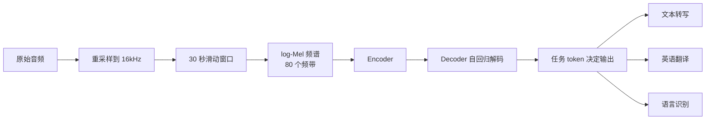

## 一句话判断

Whisper 真正改变的不是"把语音转成文字"这件事本身——语音识别模型一直存在。它把传统识别管线里分属不同环节的活——检测有没有人说话、识别是哪一种语言、把语音转成文字、再把外语翻成英语——全部收进同一个序列到序列（sequence-to-sequence）模型，用一组特殊 token 把它们当成同一类解码问题处理。一段音频进去，decoder 输出哪一类结果，取决于它先吐出的那一个任务 token。

## 项目坐标

数据来自 GitHub API（2026-08-29 验证）：

| 指标 | 值 |
|------|------|
| GitHub Stars | 80,317（约 8 万） |
| GitHub Forks | 9,643 |
| 许可证 | MIT |
| 语言 | Python |
| 默认分支 | main |
| 创建时间 | 2022-09-16 |
| 最近推送 | 2025-01-04 |

官方仓库仍在发版（最新 v20250625），但功能增量有限；生态上的活跃更多发生在第三方实现（faster-whisper、whisper.cpp 等）一侧。

## 系统总览

一段音频在 Whisper 里大致走这条链路：



核心在最后一步：decoder 不是一次性吐出文本，而是先输出 `<|startoftranscript|>`、`<|zh|>`、`<|transcribe|>` 这类特殊 token，用它们决定接下来按什么任务、什么语言、要不要时间戳来生成。

## 它把什么拆平了：传统管线和单模型的分界

传统语音识别是一条多阶段链路：先做语音活动检测（voice activity detection，VAD）判断哪里有人声，再靠音素识别、发音词典、语言模型把声学特征拼成词，最后用单独的翻译模型处理跨语言。每一段都要单独训练、单独调参，误差会沿着链路累积。

Whisper 把这套东西拆掉，换成两步：把音频切成 30 秒的窗口，转成 log-Mel 频谱喂进 Transformer encoder，再由 decoder 按任务 token 直接生成结果。识别、翻译、语言分类共享同一组参数，模型在 68 万小时弱监督音频上训练，用数据量抵消掉对显式词典和发音规则的依赖。代价是推理成本高——每 30 秒窗口都要完整跑一遍解码，而不是复用上一帧的中间结果。

## 核心机制

### 1. 多任务用一组特殊 token 表示

Whisper 不用不同的模型头去分任务，而是把任务本身编码进 token 序列。decoder 生成序列的开头固定是：

```text
<|startoftranscript|> <|语言|> <|任务|> <|要不要时间戳|> 正文...
```

`<|语言|>` 决定按哪种语言解码，`<|任务|>` 在 `<|transcribe|>`（转写）和 `<|translate|>`（翻成英语）之间选，时间戳 token 决定是否输出逐段起止时间。这套约定让"换任务"变成"换一个 token"，模型结构因此可以保持单一。

### 2. 30 秒滑动窗口 + 自回归解码

`transcribe()` 内部把整段音频按 30 秒窗口滑动处理，每个窗口独立做一次自回归 seq2seq 解码。窗口之间靠 `condition_on_previous_text` 决定是否沿用前一个窗口的文本作为上下文，让长音频的转写更连贯；代价是——如果前文有一处错，可能顺着带偏后面，所以官方把它做成可开关的选项。

### 3. 五档基础模型 + turbo

README 的模型表是 5 档，另有 `.en` 英文专用版：

| 规模 | 参数量 | 英文专用版 | 多语言版 | 所需显存 | 相对速度 |
|------|--------|-----------|----------|----------|----------|
| tiny | 39 M | tiny.en | tiny | ~1 GB | ~32x |
| base | 74 M | base.en | base | ~1 GB | ~16x |
| small | 244 M | small.en | small | ~2 GB | ~6x |
| medium | 769 M | medium.en | medium | ~5 GB | ~2x |
| large | 1550 M | 无 | large | ~10 GB | 1x |

相对速度以 large 为基准，来自 README 的估算，实际受硬件影响很大。`.en` 系列只做英文，在 tiny.en、base.en 上比多语言版效果更好，到 small.en、medium.en 差距就明显缩小。

### 4. turbo：官方第六档，也是 CLI 默认模型

2024 年 9 月发布的 `large-v3-turbo`（简称 turbo）是官方模型的第 9 个，model card 已经收录。它的做法是把 large-v3 的解码器从 32 层剪到 4 层，编码器保持不变，参数从 1550 M 降到约 809 M，再配合 `F.scaled_dot_product_attention`，在 A100 上转录速度大约快 8 倍，显存需求降到约 6 GB。代价有两条：训练时排除了翻译数据，翻译质量没有保证；泰语、粤语等少数语言上的错误率比 large 明显上升。

turbo 从 20240930 版本起就进了 `openai-whisper` 的 `load_model` 支持列表，`whisper.load_model("turbo")` 可以直接加载，不必绕道 faster-whisper 或 transformers。CLI 的默认模型也从这一版开始从 small 换成 turbo——不带 `--model` 直接跑 `whisper audio.wav`，用的就是它。README 的主表没收录 turbo，是文档没跟上发布节奏，不代表这个包不支持。

## 一次转写流过系统

拿一段中文播客音频举例。`whisper.load_model("medium")` 后调用 `model.transcribe("podcast.mp3", language="zh")`：

1. `load_audio` 用 ffmpeg 转成 16kHz 单声道 float32。
2. 音频按 30 秒窗口切分，每段补零对齐。
3. 每段转成 80 个频带的 log-Mel 频谱，进 encoder。
4. decoder 先输出 `<|startoftranscript|> <|zh|> <|transcribe|>`，再逐 token 生成中文文本。
5. 结果按窗口合并，`result["text"]` 是全文，`result["segments"]` 是带起止时间戳和置信度的分段。

如果要的是英文翻译，把任务 token 换成 `<|translate|>`（即 `--task translate`），decoder 输出就从中文文字变成英文译文。

## 这些准确率数字怎么读

Whisper 论文在 Common Voice、Fleurs、LibriSpeech 等基准上报告了 WER（词错误率）和 CER（字错误率）。怎么读这些数字：

- **测的是什么**：在标准公开数据集上，把模型输出和人工转写逐词比对算出的错误比例。它衡量的是"这段音频转得准不准"。
- **数字反映系统的哪部分**：主要反映 encoder 对声学特征的提取质量和 decoder 对语言规律的把握。语言之间的差异往往大于模型规模之间的差异——英文这类高资源语言错误率低很多，低资源语言会明显偏高。
- **不能推出什么**：不能推出在具体生产音频上的表现——噪声、口音、专业术语、领域方言都会让 WER 上涨；也不能推出推理延迟或某块特定硬件上的速度，那些要看实现和硬件。

## 怎么用起来

安装依赖 ffmpeg，然后任选 pip 包或源码安装：

```bash
pip install -U openai-whisper   # 或 pip install git+https://github.com/openai/whisper.git
```

命令行最简用法（不带 `--model` 时默认 turbo，这是 20240930 版本起的默认值）：

```bash
whisper audio.wav --model medium                # 转写
whisper japanese.wav --language Japanese        # 指定非英语语言
whisper japanese.wav --language Japanese --task translate  # 翻成英语
whisper audio.wav --model medium --format srt   # 出字幕
```

Python 里先加载模型再转写：

```python
import whisper

model = whisper.load_model("base")
result = model.transcribe("audio.mp3")
print(result["text"])
```

只有 30 秒以内的音频，或想直接拿语言和文本，可以用底层的 `decode`：

```python
import whisper

model = whisper.load_model("base")
audio = whisper.load_audio("audio.mp3")
audio = whisper.pad_or_trim(audio)
mel = whisper.log_mel_spectrogram(audio).to(model.device)

_, probs = model.detect_language(mel)
print(f"语言: {max(probs, key=probs.get)}")

options = whisper.DecodingOptions()
result = whisper.decode(model, mel, options)
print(result.text)
```

`decode` 不做窗口滑动，只处理传入的 30 秒以内的音频，适合需要精细控制解码参数的场景。

## 生态与选型

Whisper 的模型权重被多个实现复用，选哪个取决于落地约束：

| 实现 | 定位 | 适合 |
|------|------|------|
| openai-whisper | 官方参考实现 | 基准测试、原型、需要 word_timestamps 的官方接口 |
| faster-whisper | CTranslate2 重实现，推理快 | 生产转写、GPU/多核 CPU 高吞吐 |
| whisper.cpp | C/C++，CPU 友好 | 离线、嵌入式、无 Python 环境 |
| transformers | Hugging Face 生态 | 需要微调、和 Transformers pipeline 混用 |
| WhisperX | 加 wav2vec2 强制对齐 | 需要词的精确时间戳 |

微调一般走 transformers：加载 `openai/whisper-small`，配一个标好语言和文本的音频数据集（重采样到 16kHz），用 `--language zh --num_train_epochs 3` 这类参数训练。数据量没有硬性门槛，但目标语言或领域的样本越多、越干净，效果越好。

## 什么时候值得用

- **先上**：需要多语言识别或离线转写，先用默认的 turbo——速度接近 small，精度接近 large，显存只要约 6 GB，多数场景的最省心起点。跨语言翻译要用 large-v3 或 medium；对单语言精度要求极致再上 large。
- **可以等**：对词的精细时间戳强要求时，先评估 WhisperX；纯英文、CPU 受限、要极致吞吐时，直接看 faster-whisper 或 whisper.cpp，别从官方实现起步。
- **别指望**：拿某个基准的 WER 直接当生产预期，也别忘了官方实现推理偏重，长音频和实时场景要单独做性能测试。

## 常见问题

**`whisper.load_model("turbo")` 报 Model not found？**
大概率是装的 `openai-whisper` 早于 20240930，那时 turbo 还没进支持列表。升级到最新版即可；`whisper.available_models()` 能列出当前包支持的全部模型名。

**转写出现重复内容，或静音段也出了文字？**
seq2seq 模型对低置信度片段容易复读或产生幻觉。官方对策是温度调度：首轮用温度 0 的 beam search，失败后按 0.2、0.4……逐级升温重试，并用 `no_speech_threshold` 判定"这段没人说话"。`hallucination_silence_threshold` 可进一步滤掉静音段附近的幻觉输出。

**长音频中途某段明显跑偏？**
检查 `condition_on_previous_text` 是否开着。它沿用前一个窗口的文本作上下文，能提升连贯性，但一处错可能顺着带偏后面；CLI 用 `--condition_on_previous_text False` 可以关掉。

**转写慢、显存紧？**
`.en` 系列只处理英文，`tiny.en`/`base.en` 比多语言版更省资源；纯英文且 CPU 受限，直接换 faster-whisper 或 whisper.cpp。

## 结尾

Whisper 的开源价值，是证明了一条更省时的路径：模型不依赖显式的词典、发音规则和分阶段管线，靠足够大的弱监督数据，就把识别、翻译、语言分类并进同一个 seq2seq 模型。它今天的实用形态也不局限于这个仓库——权重散落在 faster-whisper、whisper.cpp、transformers 这些实现里，选型时先分清"模型的条目"和"跑模型的实现"是两回事。

## 官方资源

- GitHub：https://github.com/openai/whisper
- 论文：https://arxiv.org/abs/2212.04356
- Model Card：https://github.com/openai/whisper/blob/main/model-card.md
- Colab 示例：https://colab.research.google.com/github/openai/whisper/blob/master/notebooks/LibriSpeech.ipynb