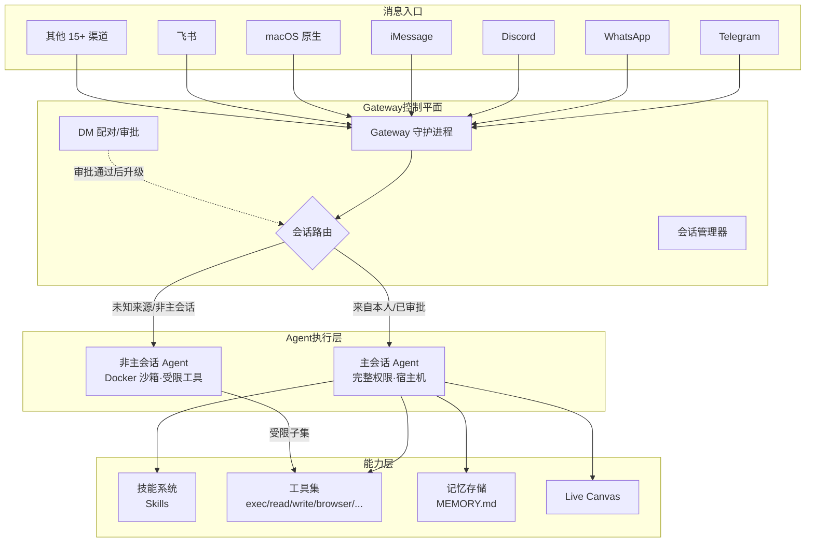

# OpenClaw：本地优先的个人 AI 助手平台

## 学习目标

- 理解 Gateway 在架构中的角色——代理转发只是它最浅的一层，它实际上是会话、工具和权限的控制平面
- 掌握多渠道消息路由的工作方式，包括 DM 配对机制的安全动机
- 厘清 Session、Agent、Skill 三者的边界：各自管什么，什么时候创建
- 理解安全沙箱的分层策略：主会话与非主会话的权限差异来自什么工程权衡
- 能追踪一条消息从渠道到 AI 再返回的完整数据流

---

## 1. 这篇文章在判断什么

大多数个人 AI 助手产品把「多平台」当作附加功能来做——先有云端对话引擎，再往 Telegram、WhatsApp 上打补丁。**OpenClaw 的设计方向正好相反**：它假设用户已经有自己习惯的聊天渠道，AI 助手应该像一个可以同时在所有渠道登录的「人」，而非锁在某个 App 里的对话窗口。

这个假设带来了三个连锁设计：

1. **Gateway 必须是本地守护进程**，而不是云端服务——否则所有渠道的消息都要先上云再回来，本地优先就无从谈起。
2. **会话管理必须是第一公民**——不同渠道、不同联系人需要独立的上下文，而不是混在一个对话线程里。
3. **工具权限必须按会话来源分级**——来自你本人的 Telegram 消息和来自陌生人的 Discord DM，不应该拥有相同的系统访问权。

理解了这三条，再看 OpenClaw 的架构模块会清楚很多。下面先给一张总览图，再逐个拆开。

---

## 2. 架构总览：Gateway 是控制平面

OpenClaw 的运行时分为两个层面——控制面与数据面，不是主从关系：

- **Gateway（网关）**：常驻守护进程，负责渠道接入、会话管理、工具注册和事件分发。在 macOS 上通过 launchd 启动，Linux 上通过 systemd。
- **Assistant（助手）**：运行在 Gateway 之上的 AI 能力层——模型调用、记忆存取、技能匹配和工具执行都在这一层完成。



安装 Gateway 的标准流程：

```bash
npm install -g openclaw@latest
openclaw onboard --install-daemon
```

`openclaw onboard` 会引导完成 Gateway 配置、渠道接入和首个技能安装。

---

## 3. 多渠道消息路由

OpenClaw 的多渠道不是「用同一个后端对接不同 API」这么简单。它要解决的问题是：**同一个对话上下文，如何在 Telegram、WhatsApp 和 Discord 之间保持一致**。

### 3.1 渠道矩阵

OpenClaw 支持 20+ 消息渠道，分三类：

**文本消息渠道：**
Telegram, WhatsApp, Signal, iMessage, Microsoft Teams, IRC, Matrix, 飞书， LINE, Mattermost, Nostr, Synology Chat, WeChat, QQ

**协作平台渠道：**
Slack, Discord, Google Chat, Twilio, WebChat

**语音与原生渠道：**
- macOS / iOS：Voice Wake（语音唤醒词）+ Talk Mode
- Android：Voice Wake + 连续语音识别（ElevenLabs，fallback 到系统 TTS）
- macOS 菜单栏应用 + Live Canvas（可视化工作空间）

### 3.2 渠道配置

每个渠道在 `~/.openclaw/openclaw.json` 中独立声明：

```json5
{
  channels: {
    telegram: {
      enabled: true,
      botToken: "YOUR_BOT_TOKEN",
      dmPolicy: "pairing",
    },
    feishu: {
      enabled: true,
      appId: "YOUR_APP_ID",
      appSecret: "YOUR_APP_SECRET",
    },
    discord: {
      enabled: true,
      botToken: "YOUR_DISCORD_BOT_TOKEN",
      dmPolicy: "pairing",
    },
  },
}
```

### 3.3 DM 安全策略：为什么默认拒绝陌生人

OpenClaw 的默认 DM 策略是 `pairing`——任何未配对发送者的消息都会被拦截，机器人返回配对码而**不把消息内容交给 AI 处理**。

这个决策来自一个简单但关键的威胁模型：如果 AI 助手有 `exec` 和 `write` 权限，那么任何一个能发 DM 给你的人，都可能通过提示注入在你的机器上执行命令。对于跑在本地、拥有文件系统读写权限的工具链来说，这不是学术风险。

三条安全规则：

- 未知发送者的 DM → 返回配对码，消息不进 AI 上下文
- 管理员通过 `openclaw pairing approve <channel> <code>` 手动审批
- 若要完全开放某渠道的 DM，须显式设置 `dmPolicy: "open"` 并配置 allowlist

由于这些规则作用在 Gateway 层（消息还没到达 Agent），恶意提示无法绕过。

---

## 4. Session、Agent、Skill 的边界

这三个概念在 OpenClaw 的文档和配置中频繁出现，但容易混淆——它们分别管不同层面的事。

| 概念 | 管什么 | 生命周期 | 创建时机 |
|------|--------|----------|----------|
| **Session（会话）** | 对话历史、当前工具列表、上下文窗口 | 与一次对话绑定 | 用户发消息时由 Gateway 创建或复用 |
| **Agent（代理）** | 模型配置、workspace 路径、工具权限策略、沙箱规则 | 持久配置 | 在 `openclaw.json` 中声明，Gateway 启动时加载 |
| **Skill（技能）** | 工具定义、触发规则、多步骤工作流 | 按需激活 | 由用户安装或 Agent 按触发条件拉取 |

一句话：**Agent 决定「用哪个模型、给多少权限」，Session 承载「当前在说什么」，Skill 提供「能做什么」**。

### 4.1 Session 的细节

每个 Session 包含：
- 完整对话历史
- 当前活跃的工具列表（由 Agent 配置决定）
- Memory / Context 引用
- 与特定 `渠道 + 用户` 的绑定关系

Gateway 管理 Session 的创建、恢复和销毁。同一个用户在 Telegram 和 Discord 上各有一个独立 Session，不会串上下文。

### 4.2 多 Agent 路由

不同渠道可以路由到不同的 Agent 实例——不同 Agent 可以用不同的模型、不同的 workspace、不同的工具白名单：

```json5
{
  agents: {
    defaults: {
      model: "openai/gpt-4o",
      workspace: "~/.openclaw/workspace",
    },
    channels: {
      whatsapp: {
        model: "anthropic/claude-sonnet-4-20250514",
        workspace: "~/.openclaw/workspace-whatsapp",
      },
    },
  },
}
```

这个设计解决了一个实际痛点：工作渠道用能力强但更贵的模型，个人闲聊渠道用轻量模型，各取所需。

---

## 5. 一条消息的完整旅程

追踪一条真实消息从头到尾怎么走，是理解架构最快的方式。以 Telegram 为例：

```
用户 "Alice" 在 Telegram 上向你的 OpenClaw Bot 发送：
  "帮我把 ~/Downloads 里今天的 CSV 文件合并成一张表"

① Gateway 的 Telegram 适配器收到 Webhook 推送
② Gateway 根据 channel=telegram, user=Alice 查找或创建 Session
③ DM 配对检查：Alice 是否在已审批列表中？
   → 是 → 放行
④ Gateway 根据 Agent 路由配置，将消息投递给对应 Agent
⑤ Agent 加载 System Prompt（AGENTS.md、SOUL.md 等）和当前 Session 历史
⑥ Agent 判断需要调用工具，通过 Function Calling 发出 tool_use：
   - exec: "ls -lt ~/Downloads/*.csv"
   - read: 逐个读取文件内容
   - write: 生成合并后的 CSV
⑦ 工具调用在 Agent 的权限边界内执行：
   - 主会话 Agent → 直接在宿主机执行
   - 非主会话 Agent → 在 Docker 沙箱内执行
⑧ 执行结果返回给模型，模型生成最终回复文本
⑨ Gateway 将回复通过 Telegram Bot API 发送回 Alice
⑩ Session 保存本轮对话历史，工具调用结果缓存在上下文窗口内
```

从这个流程可以看出几个架构特征：

- **Gateway 承担了所有准入判断**（配对、路由），Agent 不对消息来源做二次判断
- **工具调用在 Agent 配置阶段就决定了权限边界**——主会话有权的一切工具，对非主会话直接不可见，不是「先执行再检查」
- **上下文完全在本地**：消息、工具调用日志、生成回复都落在宿主机上，不经过任何 OpenClaw 云端服务（用户自己配置的模型 API 除外）

---

## 6. 技能（Skills）系统

### 6.1 Skill 是什么

Skill 是 OpenClaw 的扩展单元——一个包含 `SKILL.md` 文件的目录。SKILL.md 用 Markdown + YAML frontmatter 定义技能的元信息、触发条件和执行逻辑。

```
~/.openclaw/workspace/skills/
├── github/
│   └── SKILL.md
├── weather/
│   └── SKILL.md
└── ...
```

### 6.2 SKILL.md 结构

```markdown
---
name: weather
description: "查询指定城市的天气预报"
---

# Weather Skill

当用户问天气时激活本技能。

## 触发条件
- 用户消息包含"天气"
- 用户请求"weather <city>"

## 执行逻辑
使用风 weather API 获取天气预报...
```

Skills 的能力范围：
- 定义工具（Tool），供 AI 在对话中调用
- 定义触发器（Trigger），按消息模式自动激活
- 定义工作流（Workflow），编排多步骤任务
- 打包外部工具（MCP Server 等）

### 6.3 为什么用 SKILL.md 而非代码文件作为入口

Skills 是**被 AI 读取的指令文件**，不是插件二进制包。SKILL.md 全文会注入到 Agent 的 System Prompt 中，模型直接根据 Markdown 里的描述决定是否激活和如何调用。这个设计与 Anthropic 的 Claude Code 的 `CLAUDE.md`、Cursor 的 `.cursorrules` 同属一个思路：让 AI 自己读说明书，而不是通过 SDK 注册回调。

安装技能：

```bash
openclaw skills add <skill-name>
# 或通过 npm
npx skills@latest add <author>/<skill-name>
```

技能市场 [ClawHub](https://clawhub.ai/) 提供社区发布和发现。

---

## 7. 工具（Tools）系统与安全分层

### 7.1 内置工具清单

这些工具暴露给 AI 模型作为 Function Calling 候选：

| 工具 | 做什么 |
|------|--------|
| `exec` | 在宿主机上执行 shell 命令 |
| `read` | 读取文件内容 |
| `write` | 写入文件 |
| `edit` | 编辑文件 |
| `process` | 管理后台进程 |
| `canvas` | 控制 Live Canvas（截图、点击等）|
| `browser` | 浏览器自动化 |
| `nodes` | 控制远程节点设备 |
| `cron` | 定时任务调度 |
| `sessions_*` | 会话管理工具族 |

### 7.2 安全分层：不是「允许 / 拒绝」两个档位

OpenClaw 的工具权限按 Agent 类型分层，不是全局开关：

```text
主会话 Agent（来自用户本人）
  ├── 运行位置：宿主机
  ├── 可用工具：全部（exec, read, write, edit, browser, canvas, ...）
  └── 信任基础：这是你自己的设备，你自己发起的对话

非主会话 Agent（来自其他人或外部触发）
  ├── 运行位置：Docker 容器（默认）
  ├── 默认允许：bash, process, read, write, sessions_list, sessions_history, sessions_send, sessions_spawn
  ├── 默认拒绝：browser, canvas, nodes, cron, discord, gateway
  └── 信任基础：消息来源不可信，默认按「最小权限」处理
```

这个分层对应了一个清晰的工程权衡：**信任边界画在 Agent 层面，而不是工具层面**。好处是不需要在每个工具内部做调用者身份检查——Agent 配置本身就决定了工具可见性。代价是，如果用户想给某个特定外部渠道开放特定工具（比如只允许 `read` 但不允许 `write`），需要为那个渠道单独声明 Agent 配置，不能通过全局沙箱白名单一次性解决。

按渠道自定义沙箱规则：

```json5
{
  agents: {
    defaults: {
      sandbox: {
        mode: "non-main",
        backend: "docker",
        allow: ["bash", "read", "write", "process"],
        deny: ["browser", "canvas"],
      },
    },
  },
}
```

---

## 8. Live Canvas 与 Workspace 结构

### 8.1 Live Canvas

Live Canvas 是 OpenClaw 的可视化工作表面——AI 可以操控一个实时浏览器或应用界面来完成图形化任务（生成图表、操作网页、预览 UI）。它支持 A2UI（Agent-to-User Interface）协议，用户可以在 Canvas 上看到 AI 的操作过程并介入。

```bash
# macOS 上触发 Canvas 模式
openclaw agent --message "帮我分析这份数据并生成图表" --canvas
```

### 8.2 Workspace 目录

OpenClaw 的工作数据全部落在 `~/.openclaw/workspace`：

```
~/.openclaw/workspace/
├── skills/          # 用户安装的技能
├── memory/          # 记忆数据
├── AGENTS.md        # Agent 系统提示
├── SOUL.md          # Agent 性格设定
├── TOOLS.md         # 本地工具配置
├── MEMORY.md        # 长期记忆
└── content/         # 用户内容（文档、代码等）
```

AGENTS.md、SOUL.md、TOOLS.md 在每次对话开始时注入到 System Prompt 中，分别控制行为边界、对话风格和可用工具声明。这种文件驱动的配置方式意味着改一次就影响所有后续对话，不需要重启 Gateway。

---

## 9. 对比与定位

### 9.1 与同类产品的差异

| 特性 | OpenClaw | ChatGPT | Claude Desktop |
|------|----------|---------|----------------|
| 消息渠道 | 20+（Telegram, WhatsApp 等）| 仅 OpenAI App | 仅 Claude.ai |
| 运行位置 | 本地 Gateway | 云端 | 云端 |
| 多渠道并发 | ✅ 同一助手跨渠道 | ❌ | ❌ |
| 工具扩展 | Skills + MCP | Plugins | ❌ |
| 本地文件访问 | 原生，无限制 | 受限 | 受限 |
| 入站 DM 安全 | 配对审批制 | 依赖平台 | 依赖平台 |
| 部署门槛 | 需要配置 Node.js + 模型 API | 开箱即用 | 开箱即用 |

### 9.2 适用边界

OpenClaw 不是 ChatGPT 或 Claude 的替代品——它在模型能力上依赖外部 API，不提供内置模型或免费 token 额度。它的关键价值在于**渠道整合 + 本地控制 + 工具链扩展**。

**适合：**
- 已经有常用聊天渠道（Telegram / WhatsApp / Discord），希望 AI 助手「入住」这些渠道的用户
- 需要 AI 直接操作本地文件系统、执行脚本、管理进程的开发者
- 对数据隐私有硬性要求、不接受对话记录上传到第三方云端的场景

**不适合：**
- 只想要一个开箱即用的聊天机器人，不想管理模型 API 和 Node.js 运行时的用户
- 对终端操作不熟悉、需要全套 GUI 管理界面的场景（OpenClaw 的配置目前以 JSON 文件和 CLI 为主）
- 只需要在单一平台上使用的场景——如果只在 ChatGPT App 里用 AI，OpenClaw 的多渠道优势不存在

---

## 10. 采用顺序

决定试 OpenClaw 的话，建议按以下顺序推进，避免一次性配置 20 个渠道后陷入排查地狱：

1. **安装 Gateway + 接入一个渠道（推荐 Telegram）**：先跑通「发消息 → AI 回复」的最小闭环，确认模型 API 和 Gateway 守护进程正常工作。
2. **配置 Agent 和沙箱规则**：在确认基础对话可用后，再调整模型、workspace 和沙箱权限。
3. **安装第一个社区 Skill**：从 ClawHub 选一个与你工作流相关的技能，观察 SKILL.md 如何被 Agent 加载和调用。
4. **扩展第二、第三个渠道**：每加一个渠道就测试一遍 DM 配对和会话隔离，确认新渠道的 Session 不会串入旧渠道的上下文。
5. **编写自己的 SKILL.md**：当你需要 AI 执行特定领域的多步骤任务时，写一个 Skill 比每次在对话里解释流程可靠得多。

---

## 常见问题

**Q: OpenClaw 需要自己付模型 API 费用吗？**

是的。OpenClaw 不提供内置模型，需要用户自行配置 OpenAI、Anthropic、Google 或 OpenRouter 等提供商的 API Key，费用由相应提供商按使用量收取。

**Q: Gateway 崩溃后对话历史会丢吗？**

不会。Session 状态和对话历史持久化在 `~/.openclaw` 目录下。Gateway 重启后会自动恢复所有活跃 Session。

**Q: 同一个 Telegram 群里的多人对话如何隔离？**

群聊中，OpenClaw 按 `群 ID + 用户 ID` 创建独立 Session。每个群成员与机器人的对话互不影响。

**Q: 如果不在 macOS 上，能用到 Canvas 功能吗？**

Canvas 依赖操作系统 GUI 能力，目前主要在 macOS 上成熟可用。其他平台的支持取决于对应渠道的适配状态，需查阅最新文档。

---

延伸资源：
- [OpenClaw 官网](https://openclaw.ai)
- [OpenClaw 文档](https://docs.openclaw.ai)
- [OpenClaw GitHub](https://github.com/openclaw/openclaw)
- [ClawHub（技能市场）](https://clawhub.ai)
- [DeepWiki 技术解析](https://deepwiki.com/openclaw/openclaw)