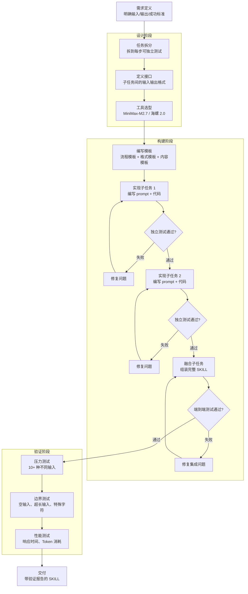

# 如何做一个生产级 SKILL：MiniMax-M2.7 给 OpenClaw 写 SKILL 的保姆教程

> 本文基于 karminski-牙医（26.8 万粉丝 AI 博主）2026 年 3 月 28 日发布的视频教程。核心问题只有一个：为什么你写的 SKILL 时好时坏，而有些人写的 SKILL 跑一百次都稳定输出？

大多数 SKILL 开发者的挫败感来自同一个根因：**把"让 AI 干活"理解成了"让 AI 自己决定怎么干"**。结果就是，同样的输入跑三次出三个不同的结果，调试时根本不知道是 prompt 的问题还是模型随机性的问题。

karminski-牙医在视频里给出的解法非常直白：

> SKILL 稳定的核心其实就是模板化，把流程尽量用逻辑（代码）固定下来就不容易出错。

这句话的价值不在于它多新颖——模板化不是什么新鲜概念——而在于它戳破了一层窗户纸：**你追求的不是 AI 的创造性，是 AI 的执行确定性**。这两个目标需要完全不同的工程策略。

读完这篇文章，你能回答这几个问题：

- 一个 SKILL 从"玩具"到"生产级"的蜕变，具体差在哪几个维度
- 模板化的三个层次（流程、格式、内容）各自解决什么问题
- 复杂 SKILL 的拆分策略和融合时机怎么判断
- MiniMax-M2.7 + 海螺 2.0 这套工具链在什么场景下是最优解
- 从零到一把一个产品爆炸图 SKILL 跑通，完整代码长什么样

| → | [核心方法论](#核心方法论) | [开发流程图](#开发流程图) | [代码实战](#代码实战) | [工具链选型](#工具链选型) | [商业化路径](#商业化路径) | [FAQ](#faq) | [自测](#自测)

---

## 核心方法论

### 模板化：把不确定性关进笼子里

一个 SKILL 运行不稳定的本质，是你在关键路径上留了太多让 AI "自由发挥"的空间。模板化就是把那些不该自由发挥的地方，用代码和结构化 prompt 锁死。

```text
❌ 反模式：给 AI 一个开放目标，让它自己规划路径
   输入 → AI 自由规划 → 不可预测的输出

✅ 生产级模式：固定流程骨架，AI 只填充内容
   输入 → 固定模板 → AI 填充变量 → 可预测的输出
```

模板化不是限制了 AI 的能力，而是**在正确的地方给 AI 正确的自由度**。一个产品爆炸图网页的 HTML 骨架应该被固定，但你传给模板的文案、图片路径、颜色变量可以交给 AI 去生成。

模板化有三个层次，层层递进：

| 层次 | 做什么 | 锁死什么 | 放开什么 |
|------|--------|---------|---------|
| **流程模板** | 固定步骤顺序和分支逻辑 | 先做什么后做什么、什么条件下跳转 | 无——流程必须完全确定 |
| **格式模板** | 固定输出的结构和样式 | HTML 标签结构、CSS 类名体系、API 响应格式 | 内容文本、图片 URL、配色变量 |
| **内容模板** | 固定内容生成的数据结构 | 字段名、类型约束、长度限制 | 字段的具体值 |

拿视频中的产品爆炸图网页举例。如果不做模板化，你给 AI 的 prompt 可能是这样：

```text
帮我生成一个 Apple 风格的产品爆炸图网页，展示 iPhone 的多角度视图，
要有精致的动画和统一的视觉风格。
```

跑三次，你可能拿到三次完全不同的 HTML——结构不一样、CSS 类名不一样、动画效果不一样。而模板化的做法是：

```text
用以下 HTML 骨架生成页面。你必须严格使用这个结构，只能替换
{{ PRODUCT_NAME }}、{{ PRODUCT_IMAGES }}、{{ COLOR_THEME }} 这三个占位符：

<div class="exploded-view" data-theme="{{ COLOR_THEME }}">
  <header class="ev-header">
    <h1 class="ev-title">{{ PRODUCT_NAME }}</h1>
  </header>
  <section class="ev-gallery">
    {{ PRODUCT_IMAGES }}
  </section>
  <footer class="ev-footer">
    <div class="ev-specs">{{ SPECS }}</div>
  </footer>
</div>

CSS 必须使用以下类名体系：
.ev-header, .ev-title, .ev-gallery, .ev-footer, .ev-specs

动画定义：
.ev-gallery img { transition: transform 0.6s cubic-bezier(0.16, 1, 0.3, 1); }
.ev-gallery img:hover { transform: scale(1.05) rotate(-1deg); }
```

这样做的结果是：无论 AI 给你填充什么产品名、什么图片，输出的 HTML 结构和 CSS 类名始终一致。后续如果你要批量生成 100 个产品的页面，只改占位符内容就行——这就是"生产级"的含义。

### 先拆分后融合：复杂任务的分治策略

模板化解决的是单个步骤的稳定性。但当 SKILL 本身包含多个异质子任务（比如既要生成网页又要生成视频），复杂度会指数级上升。这时候需要拆分。

拆分的核心判断标准只有一个：**每一步能不能独立测试通过**。如果某一步你没法单独验证它是否正确，说明拆得还不够细。

视频里，karminski-牙医把产品爆炸图 SKILL 拆成了三步：

```text
复杂任务：生成完整的产品爆炸图网页（含视频）
        ↓
子任务 1：生成静态网页（HTML + CSS + JS）
    验证方式：打开 HTML 文件，检查布局、动画、响应式
        ↓
子任务 2：生成首尾帧视频
    验证方式：检查视频首帧和尾帧是否与网页风格一致
        ↓
子任务 3：合并网页和视频
    验证方式：检查视频嵌入位置、自动播放、循环逻辑
        ↓
最终输出：完整的、带视频的产品爆炸图网页
```

拆分完之后，每一步都可以独立调试。如果网页样式有问题，你不需要重新生成视频。如果视频首尾帧对不上，你不需要动 HTML。这就是分治带来的工程收益。

融合阶段有个容易踩的坑：子任务之间的接口要对齐。具体来说，子任务 1 输出的 HTML 里需要预留视频嵌入的占位符，子任务 2 生成的视频路径需要能被子任务 3 引用到。这些接口约定要在拆分阶段就定义好，不是到了融合阶段再临时拼。

---

## 开发流程图

下图展示了从需求到交付的完整 SKILL 开发流程。注意每一步都有对应的验证节点——这是生产级 SKILL 和 demo 级 SKILL 的分水岭。



图中最重要的三个判断节点是 `独立测试通过?`、`端到端测试通过?` 和 `压力测试`。一个 SKILL 能不能叫"生产级"，就看这三个节点是不是真的跑了——不是跑一次，是每次改完代码都跑。

---

## 代码实战

以下是一个完整的产品爆炸图网页生成 SKILL 的实现。它包含两个子任务：静态网页生成和首尾帧视频生成，最后融合输出。

### 项目结构

```text
product-exploder/
├── skill.json
├── templates/
│   ├── page.html
│   └── style.css
├── prompts/
│   ├── html-gen.md
│   └── video-gen.md
├── scripts/
│   ├── generate.py
│   └── validate.py
└── output/
    └── .gitkeep
```

### skill.json

```json
{
  "name": "product-exploder",
  "version": "1.0.0",
  "description": "批量生成 Apple 风格产品爆炸图网页，含首尾帧视频",
  "models": {
    "text": "MiniMax-M2.7",
    "video": "Hailuo-2.0"
  },
  "steps": [
    {
      "id": "generate-html",
      "model": "MiniMax-M2.7",
      "prompt_file": "prompts/html-gen.md",
      "template": "templates/page.html",
      "timeout_ms": 60000,
      "retry": 3,
      "validate": {
        "required_selectors": [".ev-header", ".ev-gallery", ".ev-footer"],
        "max_page_size_kb": 500
      }
    },
    {
      "id": "generate-video",
      "model": "Hailuo-2.0",
      "prompt_file": "prompts/video-gen.md",
      "depends_on": "generate-html",
      "timeout_ms": 120000,
      "retry": 2,
      "validate": {
        "min_duration_s": 3,
        "max_duration_s": 15,
        "required_format": "mp4"
      }
    }
  ],
  "merge": {
    "strategy": "replace-placeholder",
    "placeholder": "{{ VIDEO_SLOT }}",
    "video_position": "after-gallery"
  }
}
```

### templates/page.html

```html
<!DOCTYPE html>
<html lang="zh-CN" data-theme="{{ COLOR_THEME }}">
<head>
  <meta charset="UTF-8">
  <meta name="viewport" content="width=device-width, initial-scale=1.0">
  <title>{{ PRODUCT_NAME }} — 产品展示</title>
  <link rel="stylesheet" href="style.css">
</head>
<body>
  <div class="exploded-view">
    <header class="ev-header">
      <div class="ev-badge">{{ BADGE_TEXT }}</div>
      <h1 class="ev-title">{{ PRODUCT_NAME }}</h1>
      <p class="ev-subtitle">{{ PRODUCT_TAGLINE }}</p>
    </header>
    <section class="ev-gallery">
      {{ PRODUCT_IMAGES }}
    </section>
    {{ VIDEO_SLOT }}
    <section class="ev-specs">
      <h2 class="ev-specs-title">技术规格</h2>
      <div class="ev-specs-grid">
        {{ SPECS_TABLE }}
      </div>
    </section>
    <footer class="ev-footer">
      <p class="ev-footer-text">{{ FOOTER_TEXT }}</p>
    </footer>
  </div>
</body>
</html>
```

### templates/style.css

```css
:root {
  --ev-bg: #000000;
  --ev-text: #f5f5f7;
  --ev-accent: #0071e3;
  --ev-muted: #86868b;
  --ev-radius: 18px;
  --ev-transition: 0.6s cubic-bezier(0.16, 1, 0.3, 1);
}

[data-theme="light"] {
  --ev-bg: #f5f5f7;
  --ev-text: #1d1d1f;
}

.exploded-view {
  background: var(--ev-bg);
  color: var(--ev-text);
  font-family: -apple-system, BlinkMacSystemFont, "SF Pro Display", sans-serif;
  min-height: 100vh;
  padding: 80px 24px;
  max-width: 1200px;
  margin: 0 auto;
}

.ev-header {
  text-align: center;
  margin-bottom: 80px;
}

.ev-badge {
  display: inline-block;
  color: var(--ev-accent);
  font-size: 14px;
  font-weight: 600;
  letter-spacing: 0.1em;
  text-transform: uppercase;
  margin-bottom: 16px;
}

.ev-title {
  font-size: 56px;
  font-weight: 700;
  letter-spacing: -0.02em;
  line-height: 1.1;
  margin: 0 0 12px 0;
}

.ev-subtitle {
  font-size: 21px;
  color: var(--ev-muted);
  font-weight: 400;
  margin: 0;
}

.ev-gallery {
  display: grid;
  grid-template-columns: repeat(auto-fit, minmax(320px, 1fr));
  gap: 24px;
  margin-bottom: 80px;
}

.ev-gallery img {
  width: 100%;
  border-radius: var(--ev-radius);
  transition: transform var(--ev-transition);
}

.ev-gallery img:hover {
  transform: scale(1.03);
}

.ev-video-wrapper {
  margin: 0 auto 80px;
  max-width: 900px;
  border-radius: var(--ev-radius);
  overflow: hidden;
  box-shadow: 0 20px 60px rgba(0, 0, 0, 0.3);
}

.ev-video-wrapper video {
  width: 100%;
  display: block;
}

.ev-specs {
  margin-bottom: 80px;
}

.ev-specs-title {
  font-size: 28px;
  font-weight: 600;
  text-align: center;
  margin-bottom: 40px;
}

.ev-specs-grid {
  display: grid;
  grid-template-columns: repeat(auto-fit, minmax(240px, 1fr));
  gap: 2px;
  background: var(--ev-muted);
  border-radius: var(--ev-radius);
  overflow: hidden;
}

.ev-specs-grid .ev-spec-item {
  background: var(--ev-bg);
  padding: 24px;
}

.ev-spec-item .spec-label {
  font-size: 12px;
  color: var(--ev-muted);
  text-transform: uppercase;
  letter-spacing: 0.05em;
  margin-bottom: 4px;
}

.ev-spec-item .spec-value {
  font-size: 17px;
  font-weight: 600;
}

.ev-footer {
  text-align: center;
  padding-top: 40px;
  border-top: 1px solid rgba(134, 134, 139, 0.2);
}

.ev-footer-text {
  font-size: 14px;
  color: var(--ev-muted);
}
```

### prompts/html-gen.md

```markdown
你是一个前端开发专家。你的任务是使用指定的 HTML 模板和 CSS 生成一个产品展示页面。

## 严格规则

1. 你必须使用 templates/page.html 中的 HTML 结构，不得添加、删除或修改任何 class 名
2. 你必须使用 templates/style.css 中定义的样式，不得内联 style 属性
3. 你只能替换 `{{ }}` 包裹的占位符变量
4. {{ PRODUCT_IMAGES }} 必须使用  标签，格式为：
   ``
5. {{ SPECS_TABLE }} 必须使用以下结构：
   ```html
   <div class="ev-spec-item">
     <div class="spec-label">规格名称</div>
     <div class="spec-value">规格值</div>
   </div>
   ```
6. {{ VIDEO_SLOT }} 不要动，融合阶段会自动替换
7. 不要输出任何解释、说明或 markdown 标记，只输出完整 HTML

## 输入数据

产品名称：{product_name}
产品标语：{tagline}
徽章文字：{badge}
配色主题：{color_theme}
技术规格：{specs}
产品图片列表：{images}
页脚文案：{footer_text}
```

### prompts/video-gen.md

```markdown
你是一个视频生成模型。根据以下产品信息和页面风格描述生成一段产品展示视频。

## 参数

风格参考：Apple 产品宣传片风格 — 极简、高对比度、平滑转场
视频时长：8 秒
分辨率：1920x1080
帧率：30fps
首帧：与产品主图保持一致，深色背景 + 产品居中
尾帧：产品图淡出，显示产品名称居中
背景音乐：无

## 产品信息

产品名称：{product_name}
主图 URL：{hero_image_url}
配色主题：{color_theme}

## 输出

只返回视频文件的路径，不要返回其他内容。
```

### scripts/generate.py

```python
import json
import shutil
import subprocess
import sys
from pathlib import Path
from dataclasses import dataclass, field


@dataclass
class ProductInput:
    name: str
    tagline: str
    badge: str
    color_theme: str
    specs: dict[str, str]
    images: list[dict[str, str]]
    footer_text: str
    hero_image_url: str


@dataclass
class SkillConfig:
    steps: list[dict]
    models: dict[str, str]
    merge: dict[str, str]


def load_config(config_path: Path) -> SkillConfig:
    with open(config_path) as f:
        raw = json.load(f)
    return SkillConfig(steps=raw["steps"], models=raw["models"], merge=raw["merge"])


def load_template(template_path: Path) -> str:
    return template_path.read_text(encoding="utf-8")


def fill_html_template(template: str, product: ProductInput) -> str:
    images_html = "\n".join(
        f'      '
        for img in product.images
    )

    specs_html = "\n".join(
        f"""        <div class="ev-spec-item">
          <div class="spec-label">{label}</div>
          <div class="spec-value">{value}</div>
        </div>"""
        for label, value in product.specs.items()
    )

    return (
        template.replace("{{ COLOR_THEME }}", product.color_theme)
        .replace("{{ PRODUCT_NAME }}", product.name)
        .replace("{{ PRODUCT_TAGLINE }}", product.tagline)
        .replace("{{ BADGE_TEXT }}", product.badge)
        .replace("{{ PRODUCT_IMAGES }}", images_html)
        .replace("{{ SPECS_TABLE }}", specs_html)
        .replace("{{ FOOTER_TEXT }}", product.footer_text)
        .replace("{{ VIDEO_SLOT }}", "")
    )


def call_ai_model(prompt: str, model: str, template: str) -> str:
    result = subprocess.run(
        [
            "openclaw", "run",
            "--model", model,
            "--prompt", prompt,
            "--template", template,
            "--output-format", "text",
        ],
        capture_output=True,
        text=True,
        timeout=120,
    )
    if result.returncode != 0:
        raise RuntimeError(f"模型调用失败: {result.stderr}")
    return result.stdout.strip()


def validate_html(html: str, required_selectors: list[str]) -> list[str]:
    errors = []
    for selector in required_selectors:
        if selector not in html:
            errors.append(f"缺少必要选择器: {selector}")
    size_kb = len(html.encode("utf-8")) / 1024
    if size_kb > 500:
        errors.append(f"HTML 过大: {size_kb:.1f}KB (限制 500KB)")
    return errors


def generate_html_step(
    prompt_template: str,
    html_template: str,
    product: ProductInput,
    model: str,
    retry: int,
) -> str:
    filled_prompt = prompt_template.format(
        product_name=product.name,
        tagline=product.tagline,
        badge=product.badge,
        color_theme=product.color_theme,
        specs=json.dumps(product.specs, ensure_ascii=False),
        images=json.dumps(product.images, ensure_ascii=False),
        footer_text=product.footer_text,
    )

    for attempt in range(retry):
        print(f"  HTML 生成尝试 {attempt + 1}/{retry}...")
        raw_output = call_ai_model(filled_prompt, model, html_template)

        if raw_output.startswith("<!DOCTYPE html>"):
            return raw_output

        print(f"  输出不是有效 HTML，重试...")

    raise RuntimeError(f"HTML 生成失败，已重试 {retry} 次")


def generate_video_step(
    prompt_template: str,
    product: ProductInput,
    model: str,
    retry: int,
) -> str:
    filled_prompt = prompt_template.format(
        product_name=product.name,
        hero_image_url=product.hero_image_url,
        color_theme=product.color_theme,
    )

    for attempt in range(retry):
        print(f"  视频生成尝试 {attempt + 1}/{retry}...")
        video_path = call_ai_model(filled_prompt, model, "")
        if video_path.endswith(".mp4"):
            return video_path
        print(f"  输出不是 mp4 路径，重试...")

    raise RuntimeError(f"视频生成失败，已重试 {retry} 次")


def merge_html_and_video(html: str, video_path: str, placeholder: str) -> str:
    video_block = f"""<section class="ev-video-wrapper">
      <video src="{video_path}" autoplay loop muted playsinline></video>
    </section>"""
    return html.replace(placeholder, video_block)


def generate(product: ProductInput, project_dir: Path) -> Path:
    config = load_config(project_dir / "skill.json")
    html_template = load_template(project_dir / "templates" / "page.html")
    style_css = load_template(project_dir / "templates" / "style.css")

    html_step = config.steps[0]
    video_step = config.steps[1]

    prompt_html = (project_dir / html_step["prompt_file"]).read_text(encoding="utf-8")
    prompt_video = (project_dir / video_step["prompt_file"]).read_text(encoding="utf-8")

    print(f"[1/3] 生成静态网页...")
    html = generate_html_step(
        prompt_html, html_template, product,
        config.models["text"], html_step["retry"],
    )

    errors = validate_html(html, html_step["validate"]["required_selectors"])
    if errors:
        for e in errors:
            print(f"  验证错误: {e}")
        raise RuntimeError("HTML 验证失败")

    print(f"[2/3] 生成首尾帧视频...")
    video_path = generate_video_step(
        prompt_video, product,
        config.models["video"], video_step["retry"],
    )

    print(f"[3/3] 融合网页和视频...")
    final_html = merge_html_and_video(
        html, video_path, config.merge["placeholder"],
    )

    output_dir = project_dir / "output"
    output_dir.mkdir(exist_ok=True)

    product_slug = product.name.lower().replace(" ", "-")
    page_dir = output_dir / product_slug
    page_dir.mkdir(exist_ok=True)

    (page_dir / "index.html").write_text(final_html, encoding="utf-8")
    shutil.copy(project_dir / "templates" / "style.css", page_dir / "style.css")
    shutil.copy(video_path, page_dir / Path(video_path).name)

    return page_dir


if __name__ == "__main__":
    product = ProductInput(
        name="iPhone 17 Pro",
        tagline="钛金属。钛强大。",
        badge="全新发布",
        color_theme="dark",
        specs={
            "芯片": "A19 Pro",
            "显示屏": "6.7 英寸 Super Retina XDR",
            "摄像头": "48MP Fusion 系统",
            "材质": "钛金属设计",
            "电池": "视频播放最长 29 小时",
            "系统": "iOS 21",
        },
        images=[
            {"url": "https://example.com/iphone-front.png", "alt": "正面视图"},
            {"url": "https://example.com/iphone-back.png", "alt": "背面视图"},
            {"url": "https://example.com/iphone-side.png", "alt": "侧面视图"},
            {"url": "https://example.com/iphone-angle.png", "alt": "45° 视角"},
        ],
        footer_text="© 2026 Apple Inc. 保留所有权利。",
        hero_image_url="https://example.com/iphone-hero.png",
    )

    project_dir = Path(__file__).resolve().parent.parent
    try:
        output_path = generate(product, project_dir)
        print(f"✓ 生成完成: {output_path}")
    except RuntimeError as e:
        print(f"✗ 生成失败: {e}", file=sys.stderr)
        sys.exit(1)
```

### scripts/validate.py

```python
import sys
from pathlib import Path


def check_output(output_dir: Path) -> list[str]:
    issues = []

    index_file = output_dir / "index.html"
    if not index_file.exists():
        issues.append("缺少 index.html")
        return issues

    html = index_file.read_text(encoding="utf-8")

    required_selectors = [".ev-header", ".ev-gallery", ".ev-footer"]
    for sel in required_selectors:
        if sel not in html:
            issues.append(f"缺少选择器: {sel}")

    if "<video" not in html:
        issues.append("缺少 <video> 标签")

    if 'autoplay' not in html:
        issues.append("视频缺少 autoplay 属性")

    if 'playsinline' not in html:
        issues.append("视频缺少 playsinline 属性")

    style_file = output_dir / "style.css"
    if not style_file.exists():
        issues.append("缺少 style.css")

    size_kb = len(html.encode("utf-8")) / 1024
    if size_kb > 500:
        issues.append(f"HTML 过大: {size_kb:.1f}KB (限制 500KB)")

    return issues


if __name__ == "__main__":
    output_path = Path(sys.argv[1]) if len(sys.argv) > 1 else Path("output")
    issues = check_output(output_path)

    if issues:
        print("验证失败:")
        for i in issues:
            print(f"  ✗ {i}")
        sys.exit(1)
    else:
        print("验证通过 ✓")
```

---

## 工具链选型

### MiniMax-M2.7 对比 M2.5

MiniMax-M2.7 不是 M2.5 的小版本升级。它的定位很明确：**专门为 OpenClaw 场景做 Agent 能力优化**。

| 维度 | MiniMax-M2.5 | MiniMax-M2.7 |
|------|-------------|-------------|
| **定位** | 通用多模态模型 | OpenClaw Agent 优化版 |
| **指令遵循** | 良好 | 大幅提升——精确到"只用指定 class 名"这种约束 |
| **多轮推理** | 支持但偶有漂移 | 长链路任务中上下文保持更稳定 |
| **工具调用** | 基础支持 | 原生优化，调用格式更规范 |
| **Token 经济** | 标准定价 | Token Plan 下的性价比有明显优势 |

对于 SKILL 开发场景，M2.7 的指令遵循能力提升是决定性因素。模板化要求 AI 严格执行"用这个结构、这个类名、不要加额外元素"——这种约束在通用模型上很容易被忽略，M2.7 在这方面的表现明显更好。

### 海螺 2.0 的首尾帧能力

海螺 2.0 在视频生成领域有一个独特优势：**首尾帧控制**。大多数视频生成模型只能控制文本 prompt，无法保证视频的第一帧和最后一帧长什么样。海螺 2.0 允许你指定首帧图片和尾帧图片，模型在中间补全过渡。

这在产品展示场景里非常重要——你希望视频开头的画面和网页上的产品主图完全一致，结尾的画面和品牌标识对齐。没有首尾帧控制，你只能在生成后裁剪，效果大打折扣。

### MiniMax Token Plan

如果你需要批量生成 100 个产品的页面，每次调用都按量付费的话成本会很高。MiniMax Token Plan 提供了预付费的 Token 包，单位成本更低，适合：
- 需要大量测试迭代的开发阶段
- 批量内容生成的自动化流水线
- 频繁调用 AI 的生产环境

---

## 商业化路径

karminski-牙医在视频末尾提了一句：

> "聪明的同学甚至可以用我这个美化了一下包个 SAAS 出去大赚特赚了哈哈哈"

这句话不是随口一说。产品爆炸图网页生成有真实的商业需求：电商卖家需要产品展示页、品牌方需要宣传落地页、独立开发者需要作品集展示。一个能批量生成、风格统一的 SKILL，天然适合 SaaS 化。

具体的商业化路径：

| 路径 | 做法 | 适合谁 |
|------|------|--------|
| **API 服务** | 把 SKILL 封装成 REST API，按调用次数收费 | 有后端开发能力的独立开发者 |
| **浏览器插件** | 在电商后台（Shopify、淘宝）中一键生成产品页 | 能理解平台插件生态的产品开发者 |
| **垂直定制** | 针对珠宝、家具、电子产品等细分行业做定制化模板 | 有行业资源的创业者 |
| **白标服务** | 把生成能力卖给代理商，让他们贴自己的品牌 | 想做 toB 生意的小团队 |

无论选哪条路，基础都是同一件事：**把 SKILL 跑到 99% 以上的稳定性**。商业化的前提是技术可靠。

---

## FAQ

**Q1: 我的 SKILL 里用了模板化，为什么还是不稳定？**

模板化只是手段，不是银弹。检查三件事：第一，你是不是在所有关键路径上都模板化了（不只是 HTML 结构，还有 prompt 本身的输出格式约束）；第二，模板里的变量占位符数量是否控制了——变量越多，AI 自由发挥的空间越大；第三，有没有做重试和验证——模板化保证的是"大概率对"，重试验证保证的是"一定对"。

**Q2: 拆分的粒度有没有一个量化标准？**

有两条硬规则：每一步的输出必须能独立验证（不依赖其他步骤就能判断对不对）；每一步的输入和输出必须有明确的 schema 定义。软规则：如果某一步的 prompt 超过了 500 字，大概率可以拆。

**Q3: MiniMax-M2.7 相比 Claude 或 GPT-4 有什么特别优势？**

M2.7 的核心优势不在通用能力，在特定场景的深度优化——它专门为 OpenClaw 的 Agent 调用模式做了适配。如果你的 SKILL 跑在 OpenClaw 上，M2.7 的指令遵循和工具调用一致性明显更好。如果是跑在别的 Agent 框架上，这个优势就不存在了。

**Q4: 首尾帧视频生成失败率很高怎么办？**

首尾帧对输入图片质量要求很高。两个容易被忽略的点：首帧和尾帧的分辨率必须一致，否则模型会在缩放过程中引入模糊；首帧和尾帧的构图差异不要太大，模型在"补全中间"时如果发现两个端点的差异过大，容易产生跳帧或画面崩坏。建议先用同一张图的首帧和尾帧跑通流程，再逐步替换成不同的帧。

**Q5: 批量生成 100 个产品页面时，怎么控制成本？**

三个策略叠加使用：Token Plan 降低单价；复用模板（同一个 HTML 骨架 + CSS 只生成一次，后面 99 个只替换变量）；在 prompt 中限制输出长度（明确告诉模型"输出不超过 300 行"）。实测下来，批量 100 个产品的 Token 消耗大约是单次的 3-5 倍，而不是 100 倍。

**Q6: 怎么判断一个 SKILL 已经达到了"生产级"？**

跑一轮完整的测试矩阵：10 种不同的产品输入 × 每种跑 5 次 = 50 次运行。如果 50 次里至少有 49 次输出通过 validate.py 的检查（98% 成功率），可以认为是生产级。低于 95%，回退到拆分和模板化阶段排查。

---

## 自测

做完一个 SKILL 后，用以下 7 个检查项验收：

1. **模板完整性**：打开你的 prompt 文件，圈出所有"让 AI 自己决定"的措辞（如"根据情况选择"、"你认为合适的"、"灵活处理"）。如果圈出来超过 3 处，模板化不够彻底。
2. **独立可测性**：取出任何一个子任务的输出，在不依赖其他子任务的情况下，你能否用一段不超过 20 行的脚本验证它是否正确？不行的话，这个子任务还需要再拆。
3. **重试健壮性**：连续调用同一个子任务 10 次，看成功率是不是 ≥ 90%。低于这个数，说明 prompt 的约束不够紧。
4. **接口一致性**：检查所有子任务之间的数据传递——是否每个子任务的输出 schema 都能被下一个子任务直接消费？有没有"隐式约定"（靠口头描述而非代码定义）？
5. **边界输入**：给 SKILL 输入一个极端值——空产品名、500 个规格项、一张 20MB 的产品图。看它是不是优雅报错而不是崩溃。
6. **输出漂移**：同一个输入跑 5 次，用 diff 工具比较 5 个输出。结构部分（HTML 标签层级、CSS 选择器）应该完全一致，内容部分（文案、图片 URL）可以有差异。如果结构也在变，说明模板没有锁死关键路径。
7. **成本基线**：记录一次完整运行消耗的 Token 数和耗时，写在 skill.json 旁边的一个 `BASELINE.md` 里。后续每次改 prompt 后重新跑，如果成本波动超过 20%，说明改了不该改的地方。

---

> 把这个 SKILL 当作一个工程产品而不是一个 prompt 实验。跑通只是开始，跑稳才是交付。