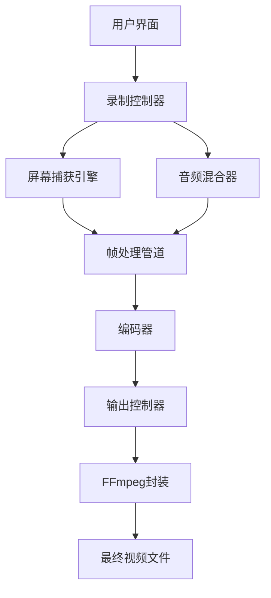

# openscreen：开源项目演示录制工具

## §1 学习目标

学完本文后，你将掌握：

- 理解 openscreen 的定位和适用场景
- 掌握 openscreen 的安装和配置方法
- 能够使用 openscreen 创建专业级的产品演示视频
- 了解 openscreen 的技术架构和扩展开发方法
- 能够在项目中集成 openscreen 进行自动化 demo 生成

## §2 原理分析

### 2.1 项目解决什么问题

在产品开发过程中，录制高质量的 demo 视频一直是开发者的痛点。商业工具如 Screen Studio 价格昂贵，且存在水印和使用限制。openscreen 正是为了解决这一问题而诞生的开源替代方案。

免费、开源、无水印、商用友好的专业 demo 录制工具

**解决的核心问题**：
- 录屏工具价格高昂（Screen Studio 每月$29 起）
- 商业工具存在水印，影响专业形象
- 缺乏自动化录制 API，难以集成到 CI/CD 流程
- 导出格式单一，缺乏灵活性

### 2.2 竞品对比

| 特性 | openscreen | Screen Studio | Camtasia | OBS |
|------|-----------|---------------|----------|-----|
| 价格 | 免费开源 | $29/月 | $249 一次性 | 免费 |
| 水印 | 无 | 无 | 无 | 无 |
| 商用 | 友好 | 付费 | 付费 | 免费 |
| 自动化 API | 支持 | 部分 | 不支持 | 支持 |
| AI 辅助 | 待定 | 是 | 否 | 否 |
| 平台 | 全平台 | macOS | Windows | 全平台 |

### 2.3 目标用户

- 开源项目维护者，需要为 GitHub 项目录制演示
- SaaS 产品团队，制作产品演示视频
- 技术博主，录制教程和演示
- 独立开发者，展示项目功能
- 市场营销团队，制作产品宣传片

## §3 架构分析

### 3.1 技术栈

```yaml
核心框架: Electron
前端: TypeScript + React
后端: Node.js
视频处理: ffmpeg
GPU加速: GPU.js
```

### 3.2 核心模块



### 3.3 数据流

1. **屏幕捕获**：通过 Electron 的 desktopCapturer API 获取屏幕流
2. **帧处理**：对捕获的帧进行缩放、裁剪、添加水印等处理
3. **音频混合**：混合系统音频和麦克风输入
4. **编码输出**：使用 FFmpeg 进行最终编码，输出 MP4/WebM 格式

## §4 功能详解

### 4.1 核心功能

#### 4.1.1 智能帧率控制

openscreen 能够根据屏幕内容变化自动调整录制帧率：
- 静态内容：降低帧率以减小文件体积
- 动态内容：自动提升帧率保证流畅度
- 用户可手动设置目标帧率（24/30/60fps）

#### 4.1.2 自动聚焦

录制过程中，openscreen 会自动识别鼠标位置和屏幕变化区域，智能调整录制窗口，确保关键内容始终在画面中心。

#### 4.1.3 丰富的视觉标注

支持在录制过程中添加：
- 箭头和形状标注
- 文字注释
- 高亮框
- 序号标记
- 模糊处理（保护隐私）

#### 4.1.4 多轨音频

- 系统音频录制
- 麦克风录音
- 音频混合和音量调整
- 降噪处理

### 4.2 输出格式

| 格式 | 适用场景 | 压缩率 |
|------|---------|--------|
| MP4 (H.264) | 通用场景，兼容性最好 | 中 |
| WebM (VP9) | 网页嵌入，加载快 | 高 |
| GIF | 社交媒体分享 | 低 |

### 4.3 高级功能

#### 4.3.1 脚本化录制

```typescript
import { OpenScreen } from 'openscreen';

const recorder = new OpenScreen({
  fps: 30,
  audio: {
    system: true,
    microphone: true
  }
});

// 开始录制
await recorder.start();

// 执行自动化操作
await recorder.focusWindow('terminal');
await recorder.type('npm run build');
await recorder.delay(2000);

// 停止并导出
await recorder.stop({
  format: 'mp4',
  output: './demo.mp4'
});
```

#### 4.3.2 场景切换

支持在录制过程中无缝切换不同场景：
- 屏幕共享
- 窗口录制
- 特定区域录制
- 多显示器支持

## §5 使用说明

### 5.1 安装

#### macOS

```bash
# 使用Homebrew安装
brew install openscreen

# 或下载DMG包
# 访问 https://github.com/siddharthvaddem/openscreen/releases
```

#### Windows

```powershell
# 使用Scoop安装
scoop bucket add extras
scoop install openscreen

# 或下载MSI安装包
# 访问 https://github.com/siddharthvaddem/openscreen/releases
```

#### Linux

```bash
# 使用Snap安装
sudo snap install openscreen

# 或使用AppImage
wget https://github.com/siddharthvaddem/openscreen/releases/latest/openscreen.AppImage
chmod +x openscreen.AppImage
./openscreen.AppImage
```

### 5.2 快速入门

**步骤 1：启动应用**

安装完成后，在应用列表中找到"OpenScreen"并启动。

**步骤 2：选择录制源**

- 点击"新建录制"
- 选择要录制的屏幕/窗口/区域
- 启用音频（系统音频+麦克风）

**步骤 3：开始录制**

- 点击红色录制按钮
- 应用会显示 3 秒倒计时
- 倒计时结束后开始录制

**步骤 4：添加标注（可选）**

录制过程中，可以：
- 按`Space`暂停/恢复
- 按`M`添加标注
- 按`F`全屏切换

**步骤 5：结束导出**

- 按`Ctrl+E`（Mac: `Cmd+E`）结束录制
- 选择输出格式和质量
- 点击导出

### 5.3 快捷键

| 功能 | macOS | Windows/Linux |
|------|-------|---------------|
| 开始/暂停 | `⌘R` | `Ctrl+R` |
| 结束录制 | `⌘E` | `Ctrl+E` |
| 添加标注 | `⌘M` | `Ctrl+M` |
| 全屏切换 | `F` | `F` |
| 静音 | `⌘⇧M` | `Ctrl+Shift+M` |

## §6 开发扩展

### 6.1 API 接口

openscreen 提供了完整的 JavaScript API，可以在其他应用中进行集成调用。

```typescript
interface OpenScreenOptions {
  fps?: number;           // 录制帧率，默认30
  quality?: 'low' | 'medium' | 'high';
  audio?: {
    system?: boolean;    // 是否录制系统音频
    microphone?: boolean; // 是否录制麦克风
  };
  video?: {
    format?: 'mp4' | 'webm' | 'gif';
    codec?: 'h264' | 'vp9';
  };
}

class OpenScreen {
  constructor(options: OpenScreenOptions);
  
  start(): Promise<void>;
  pause(): Promise<void>;
  resume(): Promise<void>;
  stop(): Promise<string>; // 返回输出文件路径
  addAnnotation(type: AnnotationType, options: AnnotationOptions): void;
}
```

### 6.2 插件开发

openscreen 支持插件扩展，可以添加自定义功能。

```typescript
// my-plugin.ts
import { Plugin } from 'openscreen';

export default class MyPlugin implements Plugin {
  name = 'my-plugin';
  
  onInit(app: OpenScreenApp) {
    // 注册自定义命令
    app.registerCommand('highlight', this.highlight.bind(this));
  }
  
  async highlight() {
    // 实现高亮功能
  }
}

// 在配置中启用插件
// openscreen.config.ts
export default {
  plugins: [
    require('./my-plugin')
  ]
};
```

### 6.3 CI/CD 集成

```yaml
# .github/workflows/demo.yml
name: Generate Demo

on:
  push:
    branches: [main]

jobs:
  demo:
    runs-on: ubuntu-latest
    steps:
      - uses: actions/checkout@v3
      
      - name: Install openscreen
        run: npm install -g openscreen-cli
      
      - name: Record demo
        run: |
          openscreen record \
            --fps 30 \
            --output demo.mp4 \
            --script ./scripts/demo-sequence.txt
      
      - name: Upload artifact
        uses: actions/upload-artifact@v3
        with:
          name: demo
          path: demo.mp4
```

## §7 实践建议

### 7.1 性能优化

1. **合理设置帧率**：一般 30fps 足够，代码演示可用 24fps
2. **选择合适分辨率**：1080p 是最佳平衡点
3. **控制录制时长**：单个 demo 建议控制在 2-5 分钟
4. **关闭后台应用**：减少干扰和性能开销

### 7.2 安全生产

1. **敏感内容处理**：使用模糊功能遮盖密码等信息
2. **音频检查**：录制前测试麦克风音量
3. **备份原始文件**：保留未压缩的录制文件

### 7.3 生产环境部署

对于需要批量生成 demo 的场景，建议使用命令行版本：

```bash
# 批量生成多个demo
#!/bin/bash
for project in project1 project2 project3; do
  openscreen record \
    --project $project \
    --output ./demos/$project.mp4 \
    --fps 30 \
    --format mp4
done
```

## §8 FAQ

**Q: openscreen 是否真的完全免费？**
A: 是的，openscreen 采用 MIT 许可证，完全免费，商用友好，无任何隐藏费用。

**Q: 录制的视频有水印吗？**
A: 完全无水印，可以直接用于商业用途。

**Q: 支持 Linux 吗？**
A: 支持，可通过 Snap 或 AppImage 在 Linux 上安装使用。

**Q: 如何实现自动化录制？**
A: 使用 CLI 版本或 JavaScript API，可编写脚本实现自动化录制流程。

**Q: 导出格式支持哪些？**
A: 支持 MP4 (H.264)、WebM (VP9) 和 GIF 格式。

**Q: 可以录制系统音频吗？**
A: 可以，macOS 需要授予屏幕录制和音频权限，Windows/Linux 直接支持。

**Q: 如何在 CI/CD 中集成？**
A: 提供 openscreen-cli 工具，可在任何 CI/CD 平台中使用，具体见本文第 6.3 节。

---

## 📚 更多资源

- **GitHub 仓库**：[siddharthvaddem/openscreen](https://github.com/siddharthvaddem/openscreen)
- **官方文档**：[openscreen.dev](https://openscreen.dev)
- **社区讨论**：[GitHub Discussions](https://github.com/siddharthvaddem/openscreen/discussions)

---

*本文由钳岳星君🦞撰写于 2026 年 4 月 4 日*
