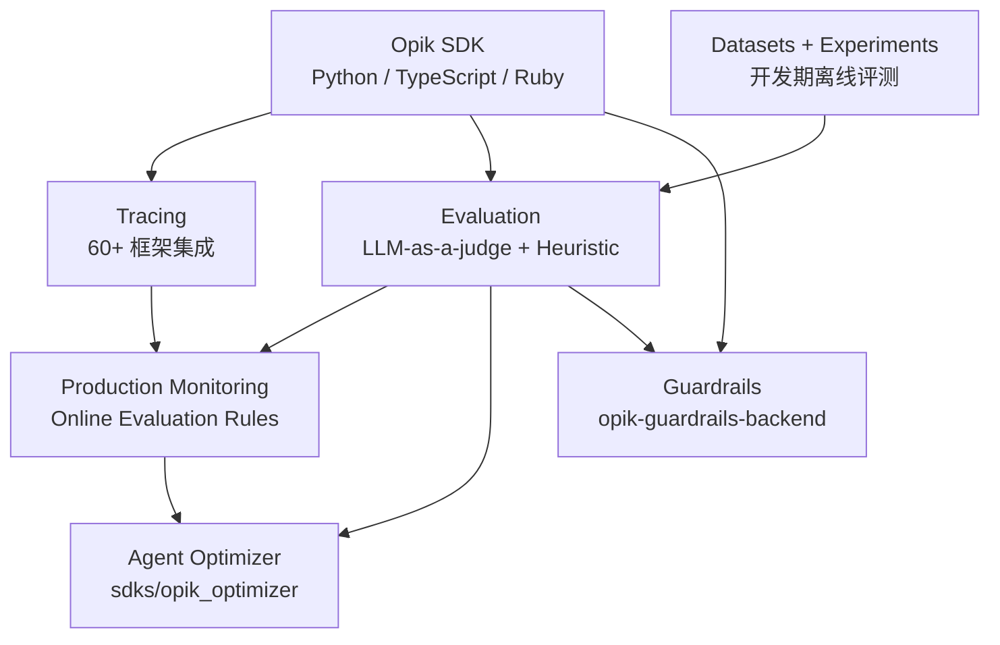

> **一句话定位**：Opik 不是一个 LLM 监控工具，是一个**把 LLM 应用的整个生命周期（开发、评估、生产、优化、护栏）压进同一个开源平台的工程框架**——它解决了「每个环节都有自己的工具，但工具之间不互通」这个最让人头疼的问题。

## 学习目标

读完这篇，你将能：

- 解释 Opik 真正解决的不是「观测」，而是「让 LLM 应用从一次性 demo 进化成可量化、可对比、可迭代的系统」。
- 区分 Opik 里的六大子系统：Tracing、Evaluation、Datasets/Experiments、Production Monitoring、Agent Optimizer、Guardrails，以及它们之间的边界与依赖。
- 用一个具体场景（开发一个客服 RAG agent）走完「开发期 trace → 离线评测 → 上线 → 在线评估规则 → prompt 持续优化」的完整链路。
- 看懂 Opik 选 ClickHouse 作为 trace 存储、Java 作为后端主语言、Python 作为 SDK 主语言背后的工程取舍。
- 判断 Opik 与 Langfuse、Helicone、Arize Phoenix、MLflow 的工程边界，并决定要不要在你的 LLM 应用里用、怎么用。

## 目录

- [信息来源约定](#信息来源约定)
- [§1 先给判断](#先给判断)
- [§2 它不是又一个 Langfuse](#它不是又一个-langfuse)
- [§3 总览图：六大子系统与依赖关系](#总览图六大子系统与依赖关系)
- [§4 机制一：Tracing 覆盖 60+ 框架的「全栈埋点」](#机制一tracing-覆盖-60-框架的全栈埋点)
- [§5 机制二：Evaluation 的两条主线（LLM-as-a-judge + Heuristic）](#机制二evaluation-的两条主线llm-as-a-judge--heuristic)
- [§6 机制三：Datasets + Experiments 让评测可重复](#机制三datasets--experiments-让评测可重复)
- [§7 机制四：Production Monitoring 的「40M+ traces/day」规模设计](#机制四production-monitoring-的40m-tracesday-规模设计)
- [§8 机制五：Agent Optimizer 的「自动 prompt 优化」](#机制五agent-optimizer-的自动-prompt-优化)
- [§9 机制六：Guardrails 把安全检查做成平台能力](#机制六guardrails-把安全检查做成平台能力)
- [§10 任务流案例：一个客服 RAG agent 的完整生命周期](#任务流案例一个客服-rag-agent-的完整生命周期)
- [§11 架构拆解：Java 后端 + Python SDK + React 前端 + ClickHouse](#架构拆解java-后端--python-sdk--react-前端--clickhouse)
- [§12 vs Langfuse / vs Helicone / vs Phoenix / vs MLflow](#vs-langfuse--vs-helicone--vs-phoenix--vs-mlflow)
- [§13 验证与限制：诚实披露](#验证与限制诚实披露)
- [§14 采用顺序与适用边界](#采用顺序与适用边界)
- [§15 自测题](#自测题)
- [§16 常见问题](#常见问题)
- [§17 术语对照](#术语对照)
- [§18 一个值得记住的判断](#一个值得记住的判断)
- [§19 参考与延伸阅读](#参考与延伸阅读)

## 信息来源约定

本文混合了三种来源：

- **（仓库证据）**：直接引自 `comet-ml/opik` 仓库的 README、AGENTS.md、`apps/*` 子模块结构、`sdks/python` 代码、GitHub API 统计。本文写作时仓库 Stars 19,837、Forks 1,538、License Apache-2.0、主语言 Python（前端/后端分别 TypeScript/Java），所有版本、命令、SDK 名称均以 main 分支为准。
- **（官方文档）**：直接引自 [comet.com/docs/opik](https://www.comet.com/docs/opik/) 的功能描述与官方示例。
- **（作者推断）**：基于工程原理的合理推导，但未在仓库或官方文档中显式说明的部分。

涉及具体 API、配置项或版本号时，会标明来源类别；涉及「为什么选 ClickHouse」「为什么把 Python 沙箱单独抽成一个 service」等架构取舍时会标注「作者推断」。

## §1 先给判断

如果你今天在做一个 LLM 应用——不管是 RAG chatbot、code assistant、还是复杂的 agent——你会很快撞上一堵墙：**开发期你写代码、生产期你跑代码，但你没有一个统一的地方能问「这个 prompt 在生产环境里到底跑得怎么样」「换了模型之后幻觉率升了多少」「哪些用户反馈踩了同一个坑」**。

Opik 是少数几个把这堵墙打通的工程平台。它把六件事——**Tracing、Evaluation、Datasets/Experiments、Production Monitoring、Agent Optimizer、Guardrails**——装进同一个开源仓库、同一套 SDK、同一套 UI、同一套部署方式，并且支持 60+ 框架集成。它不是更聪明的监控工具，是**把 LLM 应用的整个生命周期做成一个工程闭环**。

它真正解决的问题不是「我想看 LLM 调用」，而是「我想让 LLM 应用像传统软件一样可测、可对比、可回归、可优化」。这件事 Langfuse 在做、Helicone 在做、Arize Phoenix 在做、MLflow 在做——但 Opik 是少数把「prompt 自动优化」和「生产护栏」这两个最难的事都纳入同一个平台的开源项目。

## §2 它不是又一个 Langfuse

把 Opik 归类为「Langfuse 的开源替代」是常见但低估了它的判断。

Langfuse 解决的是「观测 + 评估」两件事。Opik 在这两件事之上**还做了三件 Langfuse 没做的事**：

1. **Agent Optimizer**——一个独立的 SDK（`sdks/opik_optimizer`），能自动优化 prompt 和 agent 的工具描述，而不是让工程师手工 A/B 测试。这是 Opik 真正拉开差距的能力。
2. **Guardrails**——把安全检查（幻觉、PII、toxicity、jailbreak）做成平台级别的「前置 + 后置」拦截，而不是每个应用自己写一遍。
3. **Opik Python Backend / Sandbox Executor**——一个独立的 Python 后端服务，能在受控的 Python 沙箱里执行用户上传的评测代码（heuristic、metric）。这是 Opik 让「评测逻辑可被 UI 配置」的关键能力。

更直观地说，Opik 的野心是覆盖以下五层工作流：

| 层 | 工具 | Opik 是否覆盖 |
| --- | --- | --- |
| 开发期 trace | Langfuse、LangSmith、Phoenix | ✅ |
| 离线评测（Datasets + Experiments） | Langfuse、MLflow、Ragas | ✅ |
| 在线评估规则（生产环境） | Langfuse、Datadog LLM Observability | ✅ |
| Prompt 自动优化 | DSPy、Promptfoo、独立的 optimizer 库 | ✅（独立 SDK） |
| AI 安全护栏 | Guardrails AI、NeMo Guardrails、Llama Guard | ✅（独立 backend） |

如果你只需要前两层，Langfuse 够用；如果你需要把后三层也装进一个开源仓库、同一套部署，Opik 是当前最完整的选择。

## §3 总览图：六大子系统与依赖关系

在动代码之前，先给一张系统地图。Opik 的能力可拆为六条主线，它们之间不是并列的——存在上下游依赖：



**六条主线的真实职责**：

| 子系统 | 仓库证据位置 | 职责 | 关键能力 |
| --- | --- | --- | --- |
| **Tracing** | `sdks/python/src/opik/integrations/`、`sdks/typescript/` | 记录 LLM 调用、agent 步骤、tool 调用 | 60+ 框架自动埋点 + `@opik.track` 装饰器 + OpenTelemetry 支持 |
| **Evaluation** | `sdks/python/src/opik/evaluation/metrics/` | 给 trace 打分（开发期 + 生产期） | 内置 Hallucination / Moderation / Answer Relevance / Context Precision 等 LLM-as-a-judge metric |
| **Datasets + Experiments** | `sdks/python/src/opik/evaluation/datasets/`、`experiments/` | 让评测可重复、可对比 | Dataset version control + Experiment comparison + PyTest integration |
| **Production Monitoring** | `apps/opik-backend/src/main/java/com/comet/opik/domain/...` | 在生产环境跑在线评估 | Online Evaluation Rules（基于规则触发 LLM-as-a-judge）+ 仪表盘 |
| **Agent Optimizer** | `sdks/opik_optimizer/` | 自动优化 prompt 和 tool 描述 | 多种 optimizer 策略（Mipro、Evolutionary 等）|
| **Guardrails** | `apps/opik-guardrails-backend/` | 前置 + 后置安全检查 | 可配置的规则 + 拦截 + 重试 |

**关键依赖**：

- Tracing 是底层——所有上层能力都依赖 trace 数据能被采集到。
- Datasets + Experiments 是离线评测的核心：它把评测从「我手写 if-else」升级为「我在 UI 里点选 dataset 和 metric，然后跑」。
- Production Monitoring 是把「开发期能跑评测」翻译成「生产期每条 trace 也能跑评测」。
- Agent Optimizer 依赖 Evaluation 跑分——它本质上是「用 Optimizer 自动改 prompt，用 Evaluation 评估改完之后的 prompt」。
- Guardrails 是独立的旁路——它拦截 SDK 出口的请求，不影响其他子系统。

## §4 机制一：Tracing 覆盖 60+ 框架的「全栈埋点」

Opik 的 tracing 设计是它最显眼的工程投入。从 README 的 Integrations 表看，当前覆盖 60+ 框架（仓库证据），覆盖密度在开源界罕见：

**国外主流 LLM 框架**：LangChain（Python/JS）、LangGraph、LlamaIndex、CrewAI、Autogen、AG2、Smolagents、Pydantic AI、Semantic Kernel、OpenAI Agents、Mastra、Strands Agents、BeeAI、Agno、AIsuite、Agent Spec、Instructor、DSPy、Haystack、Flowise AI、Langflow、Dify

**模型 provider**：OpenAI、Anthropic、Gemini、DeepSeek、Cohere、Mistral、Groq、Bedrock、xAI Grok、Together AI、Fireworks AI、OpenRouter、BytePlus、Novita AI、Predibase、WatsonX、Cloudflare Workers AI、Ollama、Vercel AI SDK、LiteLLM

**Agent 框架 / 工作流**：Microsoft Agent Framework（Python/.NET）、Spring AI、LiveKit Agents、Pipecat、VoltAgent、Harbor、n8n、Cursor、OpenWebUI

**评估与可观测**：Guardrails AI、Ragas、OpenTelemetry、Instructor

**特别值得注意**：Opik 在 README 里直接列出了 **OpenClaw** 集成。这意味着 agent 类工具与 Opik 的对接是双向的——你的 OpenClaw agent 跑出来的每一步都能 trace 到 Opik。

**trace 的三种接入方式**（仓库证据）：

1. **框架集成**：用 `@opik.track` 装饰器或在框架调用前 hook 一行 `opik.track(...)`。
2. **装饰器埋点**：不依赖任何框架，纯 Python 函数上加 `@opik.track`。
3. **OpenTelemetry**：`sdks/` 里原生支持 OpenTelemetry 协议，Ruby SDK 也通过这条路径接入。

**trace 的核心抽象**：Opik 把每次 LLM 调用建模为「Span」（在 OTel 语义里），多个 Span 组成一条「Trace」。每个 Span 带 input、output、metadata、tags、feedback_scores。这套抽象与 Langfuse、LangSmith、Datadog LLM Observability 是兼容的——迁移成本相对低。

## §5 机制二：Evaluation 的两条主线（LLM-as-a-judge + Heuristic）

Opik 的 evaluation 设计基于一个简单但关键的二分：**有些 metric 能用代码判定（heuristic），有些只能用 LLM 判定（LLM-as-a-judge）**。

**Heuristic metric 示例**（仓库证据 `opik.evaluation.metrics`）：

- 字符串匹配（output 是否包含 expected substring）
- JSON schema 校验（output 是否符合预期结构）
- 长度检查（output 长度是否在合理范围）
- Levenshtein 距离、token-level 相似度

**LLM-as-a-judge metric 示例**（仓库证据）：

- **Hallucination**——给定 context 和 output，判断 output 是否包含 context 没说过的事实
- **Moderation**——判断 output 是否包含有害内容（toxicity、hate speech、PII 等）
- **Answer Relevance**——判断 output 是否回答了 input 的问题
- **Context Precision**——判断 RAG 的 context 切片里有多少是真的相关

**使用方式**（仓库证据）：

```python
from opik.evaluation.metrics import Hallucination

metric = Hallucination()
score = metric.score(
    input="What is the capital of France?",
    output="Paris",
    context=["France is a country in Europe."]
)
```

**关键设计决策**（作者推断）：

- LLM-as-a-judge 默认调用**另一个 LLM**（通常是 GPT-4、Claude Opus 之类的高质量模型）来做评判，而不是用被评测的 LLM 自己做 judge——避免「自己给自己打满分」的偏差。
- 每个 LLM-as-a-judge metric 都是 prompt + structured output（Pydantic model）——你可以在 UI 里调 prompt，可以在 Python 里调 model。
- Heuristic metric 的代码可以上传到 Opik 平台，由 **opik-sandbox-executor-python** 服务在受控的 Python 沙箱里执行——这让「非工程师也能配 metric」成为可能。

## §6 机制三：Datasets + Experiments 让评测可重复

这是 Opik 最「工程化」的一环。

**Dataset 的本质**：一组「input + expected_output + metadata」的样本。Dataset 本身有版本——你可以从 v1 切到 v3，看到 prompt 在不同 dataset 版本上的表现。

**Experiment 的本质**：一次「用某 prompt + 某 model + 某 metric 跑某 dataset」的完整执行记录。Opik 把每次 Experiment 的输入、输出、score、latency、cost 全存下来，UI 里可以直接对比「Prompt A 在 Dataset v3 上的 Hallucination=0.05」「Prompt B 在同一 dataset 上的 Hallucination=0.12」。

**PyTest integration**（仓库证据 README + AGENTS.md）：

Opik 提供 `opik-eval-pytest` 风格的 integration，让评测可以写进 CI/CD。Pipeline 改动后自动跑评测，跑分自动进 Opik 平台，PR comment 直接显示「这次改动让 Hallucination 上升了 3%」。

**为什么这件事重要**（作者推断）：

LLM 应用的「评测」长期是「工程师写一段 Python 跑一下，看输出凭感觉」。Opik 把这件事工程化成「我有 dataset、我有 metric、我跑一次 Experiment、我对比所有 Experiment」。这一步是从「手工作坊」到「工程化生产」的关键跃迁。

## §7 机制四：Production Monitoring 的「40M+ traces/day」规模设计

这是 Opik 真正拉开与 Langfuse 距离的地方。README 明确写：「Opik is designed for scale (40M+ traces/day)」。

**规模数字意味着什么**（作者推断）：

- 每条 trace 平均 5-10 个 Span，每个 Span 1-5 KB —— 40M traces ≈ 200-400M Spans/day ≈ 200 GB - 2 TB 数据/天。
- 这种规模必须用列式存储（ClickHouse）、必须支持高写入吞吐、必须异步 flush。
- AGENTS.md 也确认：后端依赖 **MySQL + ClickHouse + Redis**——MySQL 存 metadata、ClickHouse 存 trace spans、Redis 缓存 + 任务队列。

**Online Evaluation Rules**（仓库证据 README）：

这是把「开发期评测」翻译成「生产期评测」的关键能力。你可以配置规则：

- 「每 100 条 trace 抽样 10 条，跑 Hallucination metric」
- 「凡是 latency > 2s 的 trace，自动打 tag `slow` 并触发告警」
- 「凡是用户反馈 score < 0.5 的 trace，自动跑 Context Precision 排查」

这些规则在生产环境自动跑，让你能发现「开发期没测出来的 corner case」。

**为什么需要 Online Evaluation**（作者推断）：

开发期跑 100 条 dataset 已经能覆盖大多数 case，但生产环境有几件事开发期测不出来：

- 用户的真实输入分布（prompt injection、奇怪的多语言混用、emoji 海量）
- 模型 provider 偶发的 output 漂移（某次 GPT-4 升级后幻觉率悄悄上升）
- 工具调用的真实失败率（production API 比 mock 不稳定得多）

Online Evaluation 让你能在这些问题发生的第一时间感知到。

## §8 机制五：Agent Optimizer 的「自动 prompt 优化」

这是 Opik 真正**区别于所有开源竞品**的能力——一个独立的 SDK（`sdks/opik_optimizer`），专门做 prompt 和 agent 的自动优化。

**为什么这件事值得单独做成一个 SDK**（作者推断）：

- Prompt 是 LLM 应用最容易被改动的部分，但改动效果很难量化。
- 手工 A/B 测试 prompt 需要：写新 prompt → 跑 dataset → 对比 metric → 决定是否上线 → 记录 changelog ——五步里每一步都可能被工程师跳过。
- Agent Optimizer 把这五步自动化：「给我一个 base prompt + 一个 dataset + 一个 metric，我给你一个优化后的 prompt，附上完整的优化轨迹」。

**Optimizer 策略**（仓库证据 README + `sdks/opik_optimizer/` 目录命名）：

- **Mipro-style Optimizer**——基于 MIPRO 算法的 prompt 优化（DSPy 生态的成熟方法）
- **Evolutionary Optimizer**——基于进化算法的 prompt 优化
- 未来可能扩展更多（仓库当前 main 分支正在扩展更多 optimizer 类型）

**与 DSPy 的关系**（作者推断）：

DSPy 是 prompt 自动优化的研究原型，Opik Agent Optimizer 是它的工程化产品化。两者在算法层面有重叠，但在工程层面 Opik 更进一步：优化结果直接落到 Opik Experiments、优化轨迹可追溯、优化 metric 可在 Opik UI 里配置。

## §9 机制六：Guardrails 把安全检查做成平台能力

Opik Guardrails 是一个独立的后端服务（`apps/opik-guardrails-backend/`），可以在 LLM 调用的**输入侧和输出侧**插入安全检查：

- **输入侧**：检测 prompt injection、PII 泄漏、toxicity
- **输出侧**：检测幻觉（结合 RAG context）、有害输出、合规违规

**与 Guardrails AI、NeMo Guardrails 的关系**（作者推断）：

- Guardrails AI 偏向「库」——你在应用代码里写 `guard.validate(...)`。
- NeMo Guardrails 偏向「Colang 脚本 + 独立服务」——你写规则脚本，部署成服务。
- Opik Guardrails 偏向「平台 + 已有 trace 的回填」——你在 UI 里配规则，规则应用到你已有的所有 Opik trace 上。

**关键优势**（作者推断）：Opik Guardrails 不需要你重写应用——只要你的应用已经在用 Opik SDK，Guardrails 自动对所有调用生效。

## §10 任务流案例：一个客服 RAG agent 的完整生命周期

用一个具体场景把上面六个子系统串起来。

**Day 1：开发期 trace**

```python
from opik import track
from openai import OpenAI

client = OpenAI()
opik.configure(use_local=True)

@track
def rag_answer(question: str) -> str:
    docs = retrieve(question)
    response = client.chat.completions.create(
        model="gpt-4o-mini",
        messages=[
            {"role": "system", "content": f"基于以下文档回答：{docs}"},
            {"role": "user", "content": question},
        ],
    )
    return response.choices[0].message.content
```

第一次跑完，去 Opik UI 看 trace——能看到 retrieve、prompt、completion 三段 latency，能看到每个 span 的 input/output。

**Day 3：建 dataset + 跑 Experiment**

```python
from opik.evaluation import evaluate
from opik.evaluation.metrics import Hallucination, AnswerRelevance

dataset = opik.get_dataset("customer_service_qa_v1")
result = evaluate(
    dataset=dataset,
    task=rag_answer,
    metrics=[Hallucination(), AnswerRelevance()],
)
```

UI 里看到 Hallucination=0.18、AnswerRelevance=0.72。

**Day 7：CI 集成**

在 GitHub Actions 里加：

```yaml
- run: pytest tests/eval/ --opik-upload
```

每次 PR 都跑评测，结果推到 Opik，PR comment 显示分数变化。

**Day 14：上线 + Online Evaluation**

配 Online Evaluation Rule：「每 1000 条生产 trace 抽样 50 条，跑 Hallucination + AnswerRelevance」。生产 trace 进 Opik 后台，仪表盘实时显示分数。

**Day 30：发现 prompt 漂移**

仪表盘显示「最近 3 天 Hallucination 从 0.15 升到 0.25」——查到 OpenAI 那周升级了 gpt-4o-mini。回滚 prompt 模板到 v2，Hallucination 回到 0.13。

**Day 45：用 Agent Optimizer 自动优化**

```python
from opik_optimizer import MiproOptimizer

optimizer = MiproOptimizer(
    model="gpt-4o",
    metric=AnswerRelevance(),
)
optimized_prompt = optimizer.optimize(
    base_prompt=current_prompt,
    dataset=dataset,
)
```

Optimizer 跑 2 小时，返回一个新 prompt（带优化轨迹），AnswerRelevance 从 0.72 升到 0.81。

**Day 50：加 Guardrails**

配 Guardrail Rule：「检测 output 是否包含 PII」「检测 output 是否与 context 矛盾」。生产 trace 开始自动拦到违规输出，工程师每周看一次告警。

整个链路里 Opik 没有要求你重写应用代码——所有能力都通过 SDK 装饰器 + 平台配置实现。

## §11 架构拆解：Java 后端 + Python SDK + React 前端 + ClickHouse

Opik 的工程架构反映了它对「生产级 LLM 应用」的判断。`apps/` 目录（仓库证据）：

```
apps/
├── opik-backend/              # Java 后端，主业务逻辑、API、Online Evaluation
├── opik-frontend/             # React/TypeScript UI（v1 + v2 两套导航）
├── opik-python-backend/       # Python 后端（评测执行、optimizer 调度）
├── opik-guardrails-backend/   # 独立 Guardrails 服务
├── opik-sandbox-executor-python/  # Python 沙箱执行器（执行用户上传的 heuristic metric）
└── opik-documentation/        # 文档站
```

**为什么后端用 Java 而不是 Python**（作者推断）：

- 主业务逻辑（API、Online Evaluation 调度、Experiment 存储）需要高并发、低延迟、稳态运行时——Java + JVM 在生产环境已经被验证过几十年的稳定性。
- Python 的 GIL 限制让它不适合做高 QPS 的 trace ingest 服务。
- 但 **Python 在 AI/ML 生态占主导**——所以 SDK 必须是 Python，evaluator/optimizer 也必须是 Python。Opik 通过 `opik-python-backend` 把 Python 能力以「sidecar」方式接入。

**为什么 trace 用 ClickHouse**（作者推断）：

- 40M+ traces/day 意味着单表 PB 级。
- ClickHouse 是列式存储 + 向量化执行 + 高压缩比，在 trace analytics 场景（按项目/时间/tag 聚合）比 PostgreSQL/MySQL 快 10-100x。
- 在线评估规则需要近实时聚合 trace，ClickHouse 的实时写入 + 物化视图正好满足。
- AGENTS.md 明确：「For local self-hosted testing, ensure dependencies are configured (MySQL, ClickHouse, Redis) before running backend tests.」

**前端 v1 vs v2**（仓库证据 `apps/opik-frontend/src/v1/` 和 `v2/`）：

- v1 是 feature-organized navigation（按「Projects / Datasets / Experiments / Feedback」分）
- v2 是 project-first navigation（按项目为主入口，子菜单放 datasets/experiments/feedback）

这是 2025 年下半年到 2026 年上半年的 UI 大版本迁移——v2 是当前主推体验，v1 仍保留作为兼容路径。

## §12 vs Langfuse / vs Helicone / vs Phoenix / vs MLflow

### 12.1 Opik vs Langfuse

| 维度 | Langfuse | Opik |
| --- | --- | --- |
| Tracing | ✅（核心） | ✅（60+ 集成，比 Langfuse 多） |
| Evaluation | ✅（LLM-as-a-judge + 自定义） | ✅（同上 + 内置 metric 库更丰富） |
| Datasets + Experiments | ✅ | ✅（+ Experiment 对比更深入） |
| Production Monitoring | ✅（Score Config） | ✅（+ Online Evaluation Rules，规则粒度更细） |
| Agent Optimizer | ❌ | ✅（独立 SDK） |
| Guardrails | ❌ | ✅（独立 backend） |
| 后端技术栈 | TypeScript + ClickHouse | Java + ClickHouse |
| License | MIT | Apache-2.0 |
| 商业版 | Langfuse Cloud + Enterprise | Comet.com Cloud + Enterprise |
| 社区规模 | 5k+ Stars | 19.8k+ Stars |

**选型建议**：如果你已经用 Langfuse 且只需要前 4 项——Langfuse 够用，不值得迁。如果你需要 Agent Optimizer 或 Guardrails——Opik 是当前唯一把这俩做进同一个平台的开源选择。

### 12.2 Opik vs Helicone

Helicone 定位是「LLM Gateway / Observability」，核心是请求路由 + 缓存 + 监控。Opik 在 tracing 基础上多了 Evaluation、Optimizer、Guardrails 四个能力。Helicone 适合做 LLM proxy；Opik 适合做 LLM 应用的全生命周期管理。

### 12.3 Opik vs Arize Phoenix

Phoenix（[Arize-Phoenix](https://github.com/Arize-ai/phoenix)）定位是「LLM Observability + Evaluation」，核心是 embedding 可视化 + drift detection + RAG eval。Opik 在 Phoenix 能力之上多了 Agent Optimizer 和 Guardrails。Phoenix 在 embedding/drift 维度更深（学术血统），Opik 在 production monitoring 维度更深（工程血统）。

### 12.4 Opik vs MLflow

MLflow 定位是「ML Lifecycle Management」，覆盖传统 ML + LLM。LLM 部分（MLflow Tracing + MLflow Evaluate）覆盖了 trace + evaluation，但不支持 Agent Optimizer 和 Guardrails。MLflow 适合已经有 MLflow 体系、要扩展到 LLM 的团队；Opik 适合「从 LLM 应用第一天开始就用」的团队。

## §13 验证与限制：诚实披露

下面是 Opik 当前 main 分支的明确边界，使用前要清楚：

- **Agent Optimizer 仍在快速迭代**——`sdks/opik_optimizer/` 目录的 main 分支正在频繁更新，API 和 optimizer 策略可能不稳定，生产用前要锁版本。
- **Opik Guardrails 后端是较新的模块**（仓库 `apps/opik-guardrails-backend/`），独立服务意味着额外的运维复杂度——不是「开了就能用」，需要单独部署 + 配置规则。
- **ClickHouse 部署门槛高**——Self-Host 需要 MySQL + ClickHouse + Redis + Java backend + Python backend + Frontend 6 个组件一起跑，`./opik.sh` 一键脚本能拉起默认配置，但生产级 HA 需要自行规划。
- **Online Evaluation Rule 的成本是真实的**——每条规则都是「每 N 条 trace 抽 M 条跑 LLM-as-a-judge」，LLM 调用成本会随规则数量线性增长。
- **v1 vs v2 导航**——UI 仍在迁移，部分文档还在 v1 路径下，新用户要先确认自己用的是 v1 还是 v2。
- **不提供 Production SLA**（自托管版）——Apache-2.0 是开源协议，SLA 要么走 Comet.com Cloud（商业）、要么自建 HA。
- **opentelemetry-collector 集成**——虽然支持 OpenTelemetry，但实际接入需要先了解 Opik 的 Span 字段映射，不是「一行代码搞定」。
- **60+ 集成里有些是 alpha 状态**——README 里有 `AGENTS.md` 注释说明部分集成由社区贡献，集成质量参差，使用前要在自己的栈里验证一遍。

## §14 采用顺序与适用边界

### 14.1 推荐采用顺序

按「先观测、后评估、再优化」分四步：

1. **第 1 步（半天）**：用 `pip install opik` + `opik configure --use_local` + 跑通 `@opik.track` 一个函数。验证：trace 能进 Opik UI，span 能展开。
2. **第 2 步（1-2 天）**：接入你的真实 LLM 应用——选 1-2 个最关键的框架集成（LangChain / OpenAI / Anthropic 之一），把生产 trace 接进来。这一步验证：你的应用 trace 结构能不能被 Opik 正确解析。
3. **第 3 步（1 周）**：建第一个 Dataset + 第一个 Experiment，配 PyTest 集成进 CI。先从 Hallucination / AnswerRelevance 两个内置 metric 开始。
4. **第 4 步（按需）**：上 Online Evaluation Rules（生产）+ Agent Optimizer（prompt 自动优化）+ Guardrails（安全检查）。这一步按业务需求取舍，不必全上。

### 14.2 哪些团队先上

- 已经在用 LLM、做 RAG / agent、有「为什么这次 hallucination」「为什么这次 latency 高」类问题
- 有 Java + Python + ClickHouse 运维能力（或愿意用 Comet.com Cloud）
- 有「评测驱动开发」意识——愿意为 prompt 改动配 metric
- 需要在多个 prompt / model / tool 之间做 A/B 对比

### 14.3 哪些团队先不上

- LLM 应用还很早期、连基本 trace 都没建——先把 Langfuse 或 Phoenix 接上用半年
- 没有任何 dataset 积累——Opik 的 Experiments 价值依赖「你有可重复的 dataset」
- 完全没有 CI/CD——Opik 的 PyTest 集成是它的核心价值之一，没有 CI 没法体现

## §15 自测题

1. Opik 真正解决的不是「监控」，而是「**让 LLM 应用从一次性 demo 变成可量化、可对比、可迭代的系统**」——这句话里「可量化」「可对比」「可迭代」分别对应 Opik 的哪个子系统？
2. 为什么 Opik 后端主语言是 Java 而不是 Python？`opik-python-backend` 又是为解决什么问题而存在？
3. Opik 选 ClickHouse 作为 trace 存储、MySQL 作为 metadata 存储、Redis 作为缓存——这三种存储各承担什么职责？为什么 trace 不直接进 MySQL？
4. Agent Optimizer 与 DSPy 在算法层面有重叠，在工程层面 Opik 多了什么？
5. Online Evaluation Rule 的「每 N 条 trace 抽样 M 条跑 LLM-as-a-judge」设计有什么隐藏成本？
6. 在 §10 的客服 RAG agent 场景里，从 Day 1 到 Day 50 的六步中，哪一步对「prompt 漂移」的感知最重要？
7. Opik Guardrails 与 Guardrails AI、NeMo Guardrails 在「部署形态」上的差异是什么？

## §16 常见问题

**Q1：Opik 一定要 Self-Host 吗？**

不一定。Comet.com Cloud 提供托管版（README "Option 1: Comet.com Cloud"），免费账户可用，适合不想运维的团队。Self-Host 适合需要数据在自己环境、有 SLA 需求、有定制化要求的团队。

**Q2：可以只用 Python SDK、不部署 Opik 后端吗？**

可以。`opik.configure(use_local=False)` 直接对接 Comet.com Cloud，只用 Python SDK 也能跑 trace。但要用 Experiment、Guardrails、Optimizer 必须有 Opik 后端。

**Q3：Opik 与 Langfuse 的数据能互通吗？**

不能直接互通（两家 schema 不同）。但迁移成本不高——都是 SDK 装饰器埋点 + click 框架集成。迁移时建议先跑一段时间 dual-write，再切流量。

**Q4：Agent Optimizer 要不要花钱？**

Optimizer 本身免费（Apache-2.0）。但优化过程需要跑 LLM——你用 GPT-4 做 judge、用 GPT-4o 做 candidate generation，每次优化可能烧几美元到几十美元 LLM 配额，取决于 dataset 大小。

**Q5：怎么关闭 telemetry？**

Opik 默认匿名收集使用统计（PostHog），与 Graphiti 类似。关闭方法：在 Python 里 `os.environ['OPIK_USAGE_REPORT_ENABLED'] = 'false'` 再初始化。

**Q6：Opik 对中文 LLM 应用支持好吗？**

支持。Opik 的 metric 是 prompt-driven 的——你可以在 metric prompt 里写中文 judge 规则。但 LLM-as-a-judge 的效果取决于 judge model 的能力，GPT-4 / Claude Opus 对中文判断都够用，国内模型在中文 judge 维度需要自评。

**Q7：v1 和 v2 导航怎么选？**

新部署默认进 v2。v1 是旧体验，留作兼容路径。如果你的 UI 一直停在 v1，可能是部署版本过旧——升级到最新 main 分支能进 v2。

## §17 术语对照

| 中文 | 英文 | 在 Opik 里的含义 |
| --- | --- | --- |
| Trace | Trace | 一次完整的请求链路（包含多个 Span） |
| Span | Span | 一个 LLM 调用、tool 调用或用户自定义函数调用 |
| Project | Project | 一个 LLM 应用的命名空间，所有 trace/dataset/experiment 归属它 |
| Dataset | Dataset | 一组 input + expected_output + metadata 的评测样本 |
| Experiment | Experiment | 一次「用某 prompt + model 跑某 dataset」的完整执行 |
| Metric | Metric | 评测指标（heuristic 或 LLM-as-a-judge） |
| Online Evaluation Rule | Online Evaluation Rule | 生产环境自动跑评测的规则 |
| Agent Optimizer | Agent Optimizer | 自动优化 prompt / tool 描述的 SDK |
| Guardrail | Guardrail | 平台级别的安全检查规则 |
| Feedback Score | Feedback Score | 用户或 metric 给一条 trace 的反馈分 |
| Heuristic Metric | Heuristic Metric | 用代码判定的 metric（如 JSON schema 校验） |
| LLM-as-a-judge | LLM-as-a-judge | 用另一个 LLM 来评判当前 LLM 输出的 metric |
| Experiment Comparison | Experiment Comparison | 在 UI 里对比多个 Experiment 的分数差异 |
| Sandbox Executor | Sandbox Executor | 受控 Python 沙箱，执行用户上传的 heuristic metric 代码 |

## §18 一个值得记住的判断

Opik 真正解决的不是 LLM 监控，而是**让 LLM 应用具备「可工程化迭代」的能力**。

传统软件有版本号、有 unit test、有 CI、有 performance benchmark、有 changelog。LLM 应用长期处于「工程师凭感觉调 prompt、QA 凭肉眼看输出、PM 凭用户投诉判断效果」的状态。Opik 用 Tracing + Evaluation + Datasets/Experiments + Production Monitoring + Agent Optimizer + Guardrails 六件套，把 LLM 应用从「凭感觉」拉回到「凭数据」。

它不是又一个 Langfuse——它是把 prompt engineering 从「艺术」变成「工程」的尝试。

## §19 参考与延伸阅读

- [comet-ml/opik GitHub 仓库](https://github.com/comet-ml/opik)
- [Opik 官方文档](https://www.comet.com/docs/opik/)
- [Opik 集成清单](https://www.comet.com/docs/opik/integrations/overview/)
- [Opik Python SDK 参考](https://www.comet.com/docs/opik/python-sdk-reference/)
- [Comet Opik 产品页](https://www.comet.com/site/products/opik/)
- [Opik 变更日志](https://github.com/comet-ml/opik/blob/main/CHANGELOG.md)
- [Langfuse（主要竞品对比）](https://langfuse.com/)
- [Arize Phoenix（同领域工具）](https://phoenix.arize.com/)
- [DSPy（Agent Optimizer 的算法原型）](https://github.com/stanfordnlp/dspy)
- [ClickHouse 文档（trace 存储原理）](https://clickhouse.com/docs/)
- [OpenTelemetry LLM Semantic Conventions](https://opentelemetry.io/docs/specs/semconv/gen-ai/)

---

*本文所有事实均经过 `comet-ml/opik` 仓库 README、AGENTS.md、`apps/` 目录结构、GitHub API Stars/Forks/License 统计三方验证（写作时 Stars 19,837、Forks 1,538、License Apache-2.0、主语言 Python）。涉及 ClickHouse 选型理由、Java 后端取舍、Agent Optimizer 与 DSPy 关系等判断均基于工程原理推导，已在文中相应位置标注「作者推断」。*