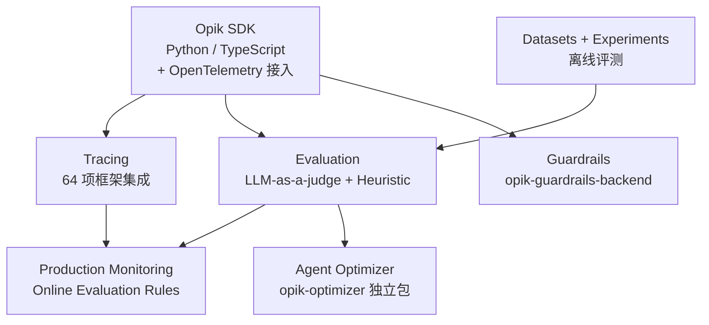

如果你在做一个 LLM 应用——RAG chatbot、code assistant 还是复杂 agent 都一样——很快会撞上一堵墙：开发期你写代码，生产期你跑代码，但没有一个统一的地方能回答「这个 prompt 在生产环境里跑得怎么样」「换了模型之后幻觉率升了多少」「哪些用户反馈踩了同一个坑」。tracing 工具有、评测工具有、护栏也有，但它们互不相通，每接一个都要重写一遍胶水代码。

Opik（comet-ml/opik）是 Comet 开源的 LLM 工程平台，Apache-2.0 协议，后端连同前端全部可自托管。它把六件事装进同一个仓库、同一套 SDK、同一个部署：**Tracing、Evaluation、Datasets/Experiments、Production Monitoring、Agent Optimizer、Guardrails**。截至 2026-09-25，仓库 22,228 Stars、1,826 Forks，README 明确写它按 40M+ traces/day 的量设计。集成表收录 64 项，从 LangChain、LlamaIndex 到 OpenClaw、Claude Code 都有官方对接。

它真正解决的问题不是「我想看 LLM 调用」，而是「我想让 LLM 应用像传统软件一样可测、可对比、可回归」。这件事 Langfuse 在做，Arize Phoenix 在做，MLflow 也在做——但把「prompt 自动优化」和「生产护栏」纳入同一个开源平台的，目前主要是 Opik。

## 目录

- [1. 它不是又一个 Langfuse](#1-它不是又一个-langfuse)
- [2. 系统地图：六条主线与依赖关系](#2-系统地图六条主线与依赖关系)
- [3. Tracing：64 项集成怎么接](#3-tracing64-项集成怎么接)
- [4. Evaluation：代码能判的和只能 LLM 判的](#4-evaluation代码能判的和只能-llm-判的)
- [5. Datasets + Experiments：让评测可重复](#5-datasets--experiments让评测可重复)
- [6. Production Monitoring：40M+ traces/day 意味着什么](#6-production-monitoring40m-tracesday-意味着什么)
- [7. Agent Optimizer：六种优化器与统一接口](#7-agent-optimizer六种优化器与统一接口)
- [8. Guardrails：独立后端的前置与后置检查](#8-guardrails独立后端的前置与后置检查)
- [9. 任务流案例：一个客服 RAG agent 的五十天](#9-任务流案例一个客服-rag-agent-的五十天)
- [10. 架构拆解：Java 后端 + Python SDK + ClickHouse](#10-架构拆解java-后端--python-sdk--clickhouse)
- [11. 与 Langfuse、Phoenix、MLflow 的边界](#11-与-langfusephoenixmlflow-的边界)
- [12. 边界、成本与采用顺序](#12-边界成本与采用顺序)

## 1. 它不是又一个 Langfuse

把 Opik 归类为「Langfuse 的开源替代」低估了它，也高估了它——两类错同时发生。

高估在于社区规模：Langfuse（langfuse/langfuse）35k Stars，比 Opik 的 22.2k 大一圈，生态成熟度也更高。低估在于功能覆盖：Langfuse 的核心是「观测 + 评估」，Opik 在这两件事之上还多做了三件——

1. **Agent Optimizer**：独立的 Python 包（PyPI 上的 `opik-optimizer`），自动优化 prompt 和 agent 工具描述，而不是工程师手工 A/B 测试。
2. **Guardrails**：独立后端服务（`apps/opik-guardrails-backend/`），把幻觉、PII、toxicity 等安全检查做成输入侧和输出侧的平台能力。
3. **沙箱评测执行**：`apps/opik-sandbox-executor-python/` 在受控 Python 沙箱里跑用户上传的评测代码，这是「评测逻辑能在 UI 里配置」的前提。

一个直观的分层：开发期 trace 和离线评测两层，Langfuse 完全够用；要把 prompt 优化和护栏也装进同一个仓库、同一套部署，Opik 是当前覆盖最全的开源选择。代价是组件更多、部署更重——这笔账在第 12 节算。

## 2. 系统地图：六条主线与依赖关系

六条主线不是并列的，存在上下游依赖：


```mermaid
graph TD
    SDK[Opik SDK<br/>Python / TypeScript<br/>+ OpenTelemetry 接入]
    Trace[Tracing<br/>64 项框架集成]
    Eval[Evaluation<br/>LLM-as-a-judge + Heuristic]
    DS[Datasets + Experiments<br/>离线评测]
    Mon[Production Monitoring<br/>Online Evaluation Rules]
    Opt[Agent Optimizer<br/>opik-optimizer 独立包]
    GR[Guardrails<br/>opik-guardrails-backend]

    SDK --> Trace
    SDK --> Eval
    DS --> Eval
    Eval --> Mon
    Trace --> Mon
    Eval --> Opt
    SDK --> GR
```

| 子系统 | 代码位置 | 职责 |
| --- | --- | --- |
| Tracing | `sdks/python/src/opik/integrations/`、`sdks/typescript/` | 记录 LLM 调用、agent 步骤、tool 调用 |
| Evaluation | `sdks/python/src/opik/evaluation/metrics/` | 给输出打分，内置 heuristic 与 LLM-as-a-judge 两类 metric |
| Datasets + Experiments | `sdks/python/src/opik/evaluation/` | 评测样本管理与可重复执行 |
| Production Monitoring | `apps/opik-backend/` | 在线评估规则、生产仪表盘 |
| Agent Optimizer | `sdks/opik_optimizer/`（独立 PyPI 包） | 自动优化 prompt 与 tool 描述 |
| Guardrails | `apps/opik-guardrails-backend/` | 输入/输出两侧的安全检查 |

依赖方向一句话能说完：Tracing 是地基，所有上层能力都吃它采到的数据；Datasets + Experiments 把评测从手写脚本变成可重复的执行记录；Production Monitoring 把同一套评测搬到生产流量上；Agent Optimizer 用 Evaluation 打分来驱动 prompt 迭代；Guardrails 是独立旁路，不依赖其余子系统。

## 3. Tracing：64 项集成怎么接

Tracing 是 Opik 工程投入最集中的地方。README 的集成表收录 64 项，按类型分几撮：

- **编排框架**：LangChain（Python/JS）、LangGraph、LlamaIndex、CrewAI、Autogen、AG2、Google ADK、Smolagents、Pydantic AI、Semantic Kernel、OpenAI Agents、Mastra、Strands Agents、BeeAI、Agno、AIsuite、Agent Spec、Instructor、DSPy、Haystack、Flowise AI、Langflow、Dify
- **模型 provider**：OpenAI、Anthropic、Gemini、DeepSeek、Cohere、Mistral、Groq、Bedrock、xAI Grok、Together AI、Fireworks AI、OpenRouter、BytePlus、Novita AI、Predibase、WatsonX、Cloudflare Workers AI、Ollama、LiteLLM
- **Agent 与工作流工具**：Microsoft Agent Framework（Python/.NET）、Spring AI、LiveKit Agents、Pipecat、VoltAgent、Harbor、n8n、Cursor、OpenWebUI、OpenClaw、Claude Code（通过 opik-claude-code-plugin）
- **评测与协议**：Guardrails AI、Ragas、OpenTelemetry、MCP Server（opik-mcp）

接入有三种方式。最省事的是框架集成——装好 SDK 后大多数框架自动埋点；裸 Python 函数用 `@track` 装饰器：

```python
from opik import track

@track
def my_function(input: str) -> str:
    return input
```

README 的 Quick Start 原话：装饰之后「Every call to my_function is now logged to Opik, including nested calls」——嵌套调用自动组成完整 trace，这正好覆盖 agent 的多步场景。第三种是 OpenTelemetry 协议：Python 和 TypeScript 之外的语言（README 点名 Java、Ruby、.NET）没有官方 SDK，走 OTel 接入，Spring AI 和 Ruby 的集成文档都是这条路径。

trace 的数据模型与主流工具兼容：每次调用记录为 Span，多个 Span 组成一条 Trace，每个 Span 带 input、output、metadata、tags、feedback scores。从 Langfuse 或 LangSmith 迁移时，语义概念能一一对上，成本主要在埋点方式的重接，不在数据模型。

值得单独一提的是 MCP Server：`uvx opik mcp configure` 一条命令，就能让 Claude Code、Cursor 这类编码 agent 在对话里直接读 trace、跑评测。README 里 MCP 被放在 Quick Start 的显眼位置——评测平台开始反向接入 agent 工作流，这个方向值得留意。

## 4. Evaluation：代码能判的和只能 LLM 判的

Opik 的 metric 设计基于一个二分：能用代码判定的（heuristic）和只能用 LLM 判定的（LLM-as-a-judge）。

Heuristic 一侧比想象中厚。`opik.evaluation.metrics` 里除了 Contains、Equals、IsJson、RegexMatch 这类结构检查，还有 GLEU、ChrF、METEOR、BERTScore、ROUGE、BLEU、LevenshteinRatio 这些 NLP 传统指标，以及 Sentiment、VADERSentiment、Tone、Readability、PromptInjection、LanguageAdherence 等专项检查，外加 JSDivergence、KLDivergence 两个分布指标。

LLM-as-a-judge 一侧内置了 Hallucination（判断 output 是否包含 context 之外的事实）、Moderation（有害内容）、Answer Relevance（是否回答了问题）、Context Precision（RAG 切片的相关占比），以及一组 G-Eval 预设（AgentTaskCompletionJudge、AgentToolCorrectnessJudge、ComplianceRiskJudge 等，面向 agent 场景）。

直接用内置 metric 长这样——这是仓库 docstring 里的原始示例：

```python
from opik.evaluation.metrics import Hallucination

metric = Hallucination()
score = metric.score(
    input="What is the capital of France?",
    output="Paris",
    context=["France is a country in Europe."],
)
```

两个工程细节值得知道。其一，judge metric 的模型可以换：构造时传 `model` 参数，不传则用 `OpikConfig().default_llm` 的默认配置（底层走 LiteLLM，所以各家模型都能接）。其二，用户自定义的 heuristic metric 代码可以上传到平台，由 opik-sandbox-executor-python 在沙箱里执行——这让不懂 Python 的团队成员也能在 UI 里配置评测规则，代价是多运维一个服务。

## 5. Datasets + Experiments：让评测可重复

这是 Opik 最「工程化」的一环，思路是把评测拆成两个对象。

**Dataset** 是一组「input + expected_output + metadata」样本，带版本管理——prompt 在 dataset v1 和 v3 上的表现可以分开看，改评测集不再污染历史对比。

**Experiment** 是一次完整执行记录：某 prompt + 某 model + 某 metric 跑某 dataset。输入、输出、分数、latency、cost 全部落库。UI 里可以直接对比「Prompt A 在 v3 上 Hallucination=0.05」「Prompt B 同一 dataset 上 Hallucination=0.12」。

评测进 CI 靠 pytest 集成。Opik 在 Python SDK 里注册了 pytest 插件（`pytest11` entry point 指向 `opik.plugins.pytest.hooks`），开启方式是命令行加 `--opik` 开关，或在 pytest 配置里设 `opik_pytest_enabled = true`。跑完的测试结果作为 experiment 进平台，PR 改动对评测分数的影响就有了落点。

这件事的重要性在于链条完整性：LLM 应用的评测长期停留在「工程师写段脚本跑一下，凭感觉看输出」，缺的不是单点工具，而是「dataset、metric、执行记录、历史对比」这四件事的闭环。有了闭环，prompt 改动才能走「改 → 测 → 对比 → 决定上线」的流程，而不是「改了再说」。

## 6. Production Monitoring：40M+ traces/day 意味着什么

README 原文：「Opik is designed for scale (40M+ traces/day)」。这个数字的含义不在「量大」本身，而在它决定了存储和后端的选型——第 10 节展开。这里先看生产侧独有的能力：Online Evaluation Rules。

规则把开发期的评测搬到生产流量上。你可以配「每 N 条 trace 抽样 M 条跑 Hallucination」，也可以按延迟、用户反馈分数触发。这些规则由 Java 后端（`apps/opik-backend/`）调度，分数回到仪表盘。

为什么生产环境还需要跑评测——开发期的 dataset 覆盖不了三件事：

- 真实输入的分布：prompt injection、多语言混杂、超长上下文，这些都是开发期造不出来的。
- 模型 provider 的静默漂移：provider 升级模型后，幻觉率可能悄悄上升，没有在线评估就只能等用户投诉。
- 工具调用的真实失败率：生产 API 的稳定性远不如开发期的 mock。

在线评估的成本是真实的：每条规则都在消耗 LLM 调用（judge 要跑模型），成本随规则数量线性增长。抽样比例是成本和覆盖率的直接权衡，不是免费的质量保险。

## 7. Agent Optimizer：六种优化器与统一接口

Agent Optimizer 是 Opik 拉开差异的能力，也是迭代最活跃的部分。它是独立的 PyPI 包（`pip install opik-optimizer`），不在主 SDK 里。

按 `sdks/opik_optimizer/README.md`，当前有六种优化器，全部实现统一的 `optimize_prompt()` 接口，返回统一的 `OptimizationResult`：

| 优化器 | 方法 |
| --- | --- |
| `MetaPromptOptimizer` | 元提示词技术，改写指令本身 |
| `FewShotBayesianOptimizer` | 贝叶斯优化挑选 few-shot 示例组合 |
| `EvolutionaryOptimizer` | 遗传算法进化 prompt |
| `GepaOptimizer` | GEPA（Genetic-Pareto）方法 |
| `HRPO` | 基于失败模式合成的层次化根因分析 |
| `ParameterOptimizer` | 优化 temperature、top_p 等调用参数 |

官方 quickstart 的 FewShotBayesianOptimizer 示例（摘自该包 README）：

```python
from opik.evaluation.metrics import LevenshteinRatio
from opik_optimizer import FewShotBayesianOptimizer, ChatPrompt
from opik_optimizer.datasets import hotpot

dataset = hotpot(count=300)

prompt = ChatPrompt(
    messages=[
        {"role": "system", "content": "You are a helpful assistant."},
        {"role": "user", "content": "{question}"},
    ]
)

optimizer = FewShotBayesianOptimizer(
    model="gpt-4o-mini",
    min_examples=3,
    max_examples=8,
    n_threads=16,
    seed=42,
)

def levenshtein_ratio(dataset_item, llm_output):
    return LevenshteinRatio().score(reference=dataset_item["answer"], output=llm_output)

result = optimizer.optimize_prompt(
    prompt=prompt,
    dataset=dataset,
    metric=levenshtein_ratio,
    n_samples=150,
)

result.display()
```

三个设计点值得注意。接口统一意味着优化器可以链式串接——一个优化器的输出 prompt 直接喂给下一个。`metric` 参数是普通 Python 函数，所以第 4 节的内置 metric 都能直接用。优化过程需要真实调用 LLM（candidate 生成和评估都烧 token），跑一次优化的成本随 dataset 大小和迭代轮数增长，用量敏感时先用小 dataset 试参数。

与 DSPy 的关系：两者在「程序化优化 prompt」这件事上思路同源，DSPy 偏研究框架，Opik Optimizer 的差异化在工程侧——优化结果直接落成 Opik 实验、轨迹可追溯、metric 复用平台内置指标。这是基于两者公开文档的推断，算法层面的差异没有权威对比，选型时建议各自跑一遍自己的场景。

## 8. Guardrails：独立后端的前置与后置检查

Opik Guardrails 是独立后端服务（`apps/opik-guardrails-backend/`），在 LLM 调用的输入侧和输出侧插检查：输入侧管 prompt injection、PII、toxicity；输出侧管幻觉（结合 RAG context）、有害输出、合规违规。

和同类项目的部署形态差异：

- Guardrails AI 是「库」——应用代码里调 `guard.validate(...)`，跟着应用部署。
- NeMo Guardrails 是「Colang 脚本 + 服务」——写规则脚本，部署成独立服务。
- Opik Guardrails 是「平台能力」——UI 里配规则，作用在已经经 Opik SDK 的调用上。

对已经用 Opik SDK 的团队，第一种差异是实际好处：不用改应用代码，护栏规则在平台侧配置即可生效。代价是独立服务的运维成本——自托管时多一个组件要维护。它不是「开了就能用」的开关。

## 9. 任务流案例：一个客服 RAG agent 的五十天

用一个客服 RAG agent 把六条主线串起来。

**Day 1，接 trace。** 十行代码：

```python
from opik import track
from openai import OpenAI

client = OpenAI()
opik.configure(use_local=True)

@track
def rag_answer(question: str) -> str:
    docs = retrieve(question)
    response = client.chat.completions.create(
        model="gpt-4o-mini",
        messages=[
            {"role": "system", "content": f"基于以下文档回答：{docs}"},
            {"role": "user", "content": question},
        ],
    )
    return response.choices[0].message.content
```

`use_local=True` 指向自托管实例（`opik.configure` 的这个参数决定走本地还是云端 URL，出自 `sdks/python/src/opik/configurator/configure.py`）。第一次跑完，UI 里能看到 retrieve、prompt、completion 三段延迟，每个 span 的输入输出都能展开。

**Day 3，建评测。** 从客服记录里整理 200 条问答建 dataset，跑第一个 experiment：

```python
import opik
from opik.evaluation import evaluate
from opik.evaluation.metrics import Hallucination, AnswerRelevance

client = opik.Opik()
dataset = client.get_dataset("customer_service_qa_v1")
result = evaluate(
    dataset=dataset,
    task=rag_answer,
    scoring_metrics=[Hallucination(), AnswerRelevance()],
)
```

注意参数名是 `scoring_metrics`——这是 `evaluate()` 的真实签名（`sdks/python/src/opik/evaluation/evaluator.py`），网上不少示例写 `metrics=`，照抄会报错。UI 显示 Hallucination=0.18、AnswerRelevance=0.72，后者不达标。

**Day 7，进 CI。** pytest 配置里开启 `opik_pytest_enabled = true`，把评测用例跑进 GitHub Actions。每次 PR 自动出分数，改动对评测的影响从「上线后才发现」提前到「合并前」。

**Day 14，上在线评估。** 配规则：每 1000 条生产 trace 抽 50 条，跑 Hallucination + Answer Relevance。仪表盘开始持续出分。

**Day 30，抓到一次漂移。** 仪表盘显示最近三天 Hallucination 从 0.15 升到 0.25，排查发现 provider 那周升级了 gpt-4o-mini。回滚 prompt 模板到 v2，分数回到 0.13。没有在线评估，这件事要到用户投诉才会被发现。

**Day 45，跑一次 prompt 优化。** 把线上 prompt 包成 `ChatPrompt`，用元提示词优化器改写（注意 `MetaPromptOptimizer` 的构造参数里没有 `project_name`，那是 `FewShotBayesianOptimizer` 等优化器的参数——优化器之间的签名并不完全一致）：

```python
from opik.evaluation.metrics import AnswerRelevance
from opik_optimizer import MetaPromptOptimizer

optimizer = MetaPromptOptimizer(model="gpt-4o")
result = optimizer.optimize_prompt(
    prompt=current_prompt,
    dataset=dataset,
    metric=AnswerRelevance(),
)
```

优化跑了约两小时，`result` 里带完整轨迹，Answer Relevance 从 0.72 升到 0.81。上线前先在 Day 3 的 dataset 上复跑一遍确认不是过拟合。

**Day 50，加护栏。** UI 里配两条规则：输出侧查 PII、输出侧对照 context 查矛盾。之后每周看一次告警。

整个链路里应用代码只动了两处：加 `@track`，改 `evaluate` 调用。其余能力全部是平台侧配置——这是「装进同一个平台」的直接收益。

## 10. 架构拆解：Java 后端 + Python SDK + ClickHouse

`apps/` 目录六个组件：

```
apps/
├── opik-backend/                  # Java 后端：API、业务逻辑、在线评估调度
├── opik-frontend/                 # React/TypeScript UI
├── opik-python-backend/           # Python 后端服务
├── opik-guardrails-backend/       # Guardrails 独立服务
├── opik-sandbox-executor-python/  # 用户评测代码的沙箱执行器
└── opik-documentation/            # 文档站
```

**后端为什么是 Java。** AGENTS.md 写明后端测试的依赖是 MySQL、ClickHouse、Redis 三件套：MySQL 存元数据，ClickHouse 存 trace span，Redis 做缓存和任务队列。40M+ traces/day 折算下来每天要写入数亿个 span，高写入吞吐、稳态运行这些诉求下 JVM 是保守但合理的选择。而 AI 生态的主语言是 Python，SDK、metric、optimizer 都必须是 Python——`opik-python-backend` 把 Python 能力以旁路服务的形式接进来，各干各的。这两条选型理由是作者推断，组件分工本身是仓库事实。

**trace 为什么用 ClickHouse。** 列式存储 + 向量化执行 + 高压缩比，在「按项目/时间/标签聚合」的 trace 分析场景里是对的选择；在线评估规则需要近实时聚合，ClickHouse 的写入吞吐正好接得上。「比 PostgreSQL/MySQL 快 10-100x」这类数字因查询模式而异，不要当成普适结论。

**前端的两套导航。** 新版 UI 在 `apps/opik-frontend/src/v2/`，旧版代码仍在 `src/` 根目录，处于迁移过渡期。新部署默认进 v2；如果你看到的 UI 结构和文档对不上，先确认自己在哪套导航里。

自托管的最小启动是仓库根目录的 `./opik.sh`，它会拉起默认配置的全套组件。也正因为「全套」，自托管的真实门槛不在安装而在运维：Java 后端 + 两个 Python 服务 + 前端 + 三个存储，生产级的高可用要自己规划。

## 11. 与 Langfuse、Phoenix、MLflow 的边界

先给仓库现状（GitHub API，2026-09-25）：Opik 22,228 Stars / Apache-2.0；Langfuse 35,026 Stars；Helicone 6,176 Stars；Phoenix 11,606 Stars；MLflow 28,128 Stars。Opik 不是同类里社区最大的——Langfuse 和 MLflow 的 star 数都比它高。

| 维度 | Langfuse | Opik |
| --- | --- | --- |
| Tracing | ✅（核心） | ✅（64 项集成） |
| Evaluation | ✅ | ✅ |
| Datasets + Experiments | ✅ | ✅ |
| Production Monitoring | ✅ | ✅（Online Evaluation Rules） |
| Prompt 自动优化 | ❌ | ✅（opik-optimizer） |
| Guardrails | ❌ | ✅（独立后端） |
| 后端技术栈 | TypeScript | Java + ClickHouse + MySQL + Redis |
| License | MIT 核心平台，企业模块商业授权 | Apache-2.0（README 声明全平台含后端） |
| Stars | 35k | 22.2k |

这张表的选型结论和 star 数有关：Langfuse 社区更大、更成熟，如果你的需求就在前四行，没有理由迁走。Opik 的位置是「后两行也要」的团队——把优化和护栏收进同一个平台的收益，值得多扛一个 Java 后端时才选它。License 上两者都算开放，Langfuse 核心是 MIT，企业模块单独收费；Opik 按 README 说法是「全平台 Apache-2.0，含后端」，这在「自托管完整平台」这个维度上是更彻底的承诺。

**Opik vs Helicone**：Helicone 的核心是 LLM 网关——请求路由、缓存、限流，顺带做观测；Opik 的核心是应用侧的评测与迭代。要管 API 流量，Helicone；要管应用质量，Opik。两者不互斥，不少团队网关和评测平台各挂一个。

**Opik vs Arize Phoenix**：Phoenix 定位 LLM observability + evaluation，在 embedding 可视化和 drift detection 上更深，许可证是 source-available（Elastic License 2.0，非 OSI 认证）；Opik 在生产监控和优化侧更深，Apache-2.0 全开放。看重 drift 分析选 Phoenix，看重平台完整性和协议纯度选 Opik。

**Opik vs MLflow**：MLflow 是 ML 全生命周期平台，LLM 部分（Tracing + Evaluate）覆盖 trace 和评测，但没有独立的 prompt 优化器和护栏。已有 MLflow 体系的团队扩展到 LLM，先用 MLflow 顺理成章；LLM-first 的团队从第一天起用 Opik 这类专用平台，少绕一层抽象。

README 里官方的对比口径还包括 LangSmith（闭源）、Arize AX（闭源）、W&B Weave（SDK 开源、平台商业化）和 Braintrust（闭源）——「开源 + 可自托管」这个筛子过一遍，剩下的主要就是 Opik 和 Langfuse 两个，这也解释了为什么两者总被放在一起比。

## 12. 边界、成本与采用顺序

用之前要知道的边界：

- **Agent Optimizer 迭代快**。`sdks/opik_optimizer/` 是仓库里提交最频繁的目录之一，API 可能变，生产使用锁版本。
- **Guardrails 和沙箱执行器都是独立服务**。自托管意味着额外运维，不是装完主平台就自带。
- **在线评估的成本线性增长**。每条规则都在跑 LLM 调用，规则数量和抽样比例直接写进账单。
- **部分集成质量参差**。64 项集成由 Comet 和社区共同维护，冷门集成的成熟度不一，接入前先在自己的栈里验证。
- **自托管的高可用自己扛**。`./opik.sh` 拉起的是默认配置，生产级 HA（ClickHouse 集群、Redis 哨兵、后端多副本）是另一档工作量。
- **SDK 默认开启产品分析上报**。`OpikConfig.analytics_enable` 默认为 `True`，官方注释明确上报的是「哪些 SDK 功能被使用」的事件、不含业务数据 payload；介意的话把它设为 `False`，或把 `analytics_url` 置空。

推荐按这个顺序上，每步有独立的验证点：

1. **半天**：`pip install opik`，`opik configure`，跑通一个 `@track` 函数，确认 trace 进 UI、span 能展开。
2. **一两天**：选一到两个最关键的框架集成（LangChain / OpenAI / Anthropic 之一），把真实应用的 trace 接进来，确认 trace 结构被正确解析。
3. **一周**：建第一个 dataset 和 experiment，开 pytest 集成进 CI。从 Hallucination 和 Answer Relevance 两个内置 metric 起步。
4. **按需**：Online Evaluation Rules、Agent Optimizer、Guardrails 逐个上，每个都先算成本。不必全上——第 1、2 节的判断在这步兑现：你到底需不需要后两行能力。

适用边界反过来读也成立：应用还在原型期、连 trace 都没有的团队，先用 Langfuse 或 Phoenix 把观测做起来，半年后再评估要不要平台化；没有任何评测 dataset 积累的团队，Opik 的 Experiments 价值发挥不出来——它的核心主张「可对比」依赖你有可重复的基准。

回到开头的判断。传统软件有单测、CI、benchmark、changelog，LLM 应用长期停在「凭感觉调 prompt、凭肉眼看输出、凭用户投诉判断效果」。Opik 的六件套把这条链路补成工程流程——它不是把 prompt engineering 从手艺变成科学，但它确实让「改了 prompt 之后到底变好没有」变成了一个可以查数据的问题。这在一个模型每周都在换的行业里，比任何单个功能都值钱。

---

*数据口径：Stars/Forks/License 来自 GitHub API（2026-09-25，comet-ml/opik、langfuse/langfuse、Helicone/helicone、Arize-ai/phoenix、mlflow/mlflow）；40M+ traces/day、集成数量、PyTest 集成、Optimizer 清单引自仓库 README 与 `sdks/opik_optimizer/README.md`（main 分支，2026-09-25）；`evaluate(scoring_metrics=)` 签名出自 `sdks/python/src/opik/evaluation/evaluator.py`，`use_local` 参数出自 `sdks/python/src/opik/configurator/configure.py`，遥测配置出自 `sdks/python/src/opik/config.py`。ClickHouse 选型理由、Java 后端取舍、Opik 与 DSPy 的关系标注为作者推断。*
