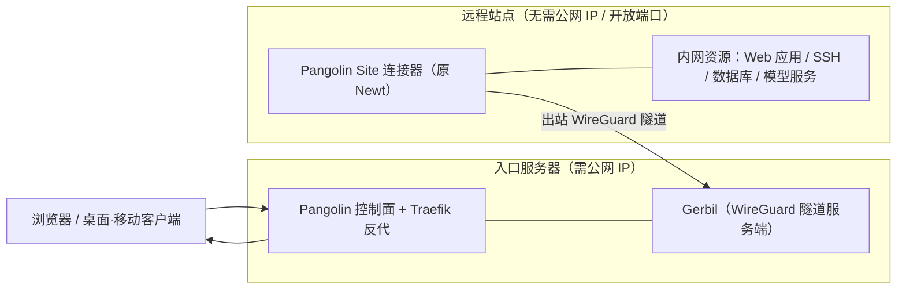

# Pangolin：半年八个版本，从 WireGuard 远程访问平台长成开源 SASE

今年 4 月写这篇文章时，Pangolin README 第一句还是 "an open-source, identity-based remote access platform built on WireGuard"——一个基于 WireGuard 的身份感知远程访问平台。半年后的今天再打开仓库，同一句的位置写的是 "an open-source SASE platform"，并直接点名对标的对象：Cloudflare One、Zscaler、Prisma，只是开源、可自托管。官方仓库描述也从"远程访问"改成了 "networking and security platform ... and AI workloads"。

这个转向不是改个口号。半年里 Pangolin 从 1.17.0 走到 1.24.0，浏览器里跑 SSH/RDP/VNC、特权访问管理（PAM）、资源启动主页这些能力陆续进来，8 月底的 1.22 更是直接加了身份感知 AI 网关——给 Claude Code、Codex 这类 coding agent 一个统一的、免散落 API key 的入口。底下的东西没变：出站 WireGuard 隧道、按资源而非按网络授权的零信任模型。变的是覆盖面，从"让人访问应用和内网"扩到了"给人和 AI 代理的统一网络入口"。

这篇文章把两件事讲清楚：这套系统的核心机制在发文时是什么样、经过哪些核实；以及这半年它到底长了什么、哪些值得你现在上手时关注。

## 一、系统地图：一个控制面，两类资源，三种入口

Pangolin 由四个部分组成。控制面是主仓库 `fosrl/pangolin`，TypeScript 写的 Next.js 应用，管身份、策略和隧道调度；Gerbil（`fosrl/gerbil`，Go）是 WireGuard 接口管理服务端，负责隧道终结；Newt（`fosrl/newt`，Go）是装在远程网络里的站点连接器，1.23 起改名叫 Pangolin Site；再加各平台的桌面/移动客户端。主仓库语言构成以 TypeScript 为绝对主体（Go 只占约 0.6%，都在配套仓库里），数据库支持 SQLite 和 PostgreSQL 双驱动，由启动脚本切换。



理解它的关键是资源两分法——两类资源走两条不同入口，但共用同一套身份和策略：

| | 公共资源（反向代理入口） | 私有资源（客户端隧道入口） |
|---|---|---|
| 访问方式 | 浏览器直接打开，过 Traefik 反代 | 装 Pangolin 客户端，走 WireGuard 隧道 |
| 典型对象 | HTTPS 应用、AI 网关、浏览器版 SSH/RDP/VNC | 主机/端口段/CIDR、内网 HTTPS、CLI SSH |
| 客户端要求 | 无，浏览器即可 | 需安装客户端 |
| 授权粒度 | 用户/角色 + 规则（IP、地理位置、URL 路径等） | 同一套身份体系，按资源逐个授权 |

官方在文档里把定位讲得很直白：反向代理只会暴露 Web 应用、VPN 会给你整张扁平网络，Pangolin 把两者合在一起——公共资源承担代理的职责，私有资源承担 VPN 的职责，而身份、访问规则和日志对所有协议以同样的方式生效。

## 二、零信任怎么落地：按资源授权，不按网络

传统 VPN 的访问模型是"连上之后你就在网内"——拿到整张网络的可见性，访问控制在网络层，验证手段常常只是 IP 和凭据。Pangolin 的做法拆开看是三条：

**按资源授权。** 用户被明确授予的是某个资源，不是某个网段。每个资源可以单独配用户、角色、端口限制。官方文档把这当作与 VPN 的第一分界：VPN 给整个扁平网络的可见性，Pangolin 私有资源只路由到特定主机、子网或内部应用。

**身份加上下文的规则。** 公共资源支持 SSO、MFA，以及基于身份、角色、地理位置、IP、URL 路径的访问规则；1.20 又给地理封锁加了 "Country Is Not" 匹配类型。1.24 起规则还能匹配 HTTP 方法。

**协议无关。** 不管下面是 HTTPS、SSH、RDP、VNC 还是 AI 提供商的 API，认证和策略是同一套。这是它后来做 AI 网关能"顺滑"的底层原因——网关只是又一种被反代的资源，权限模型不用重造。

发文时源码里就已经有完整的 OIDC 身份提供商路由（`server/routers/idp/` 下的 OIDC 回调、校验、更新全套）和审计日志路由（`server/routers/auditLogs/`），这两块不是后来补的。现行 README 还补了一句官方对开箱身份的说法：可以自带 IdP，也可以直接用 Pangolin 自建身份。

## 三、两条访问主线怎么工作

### 站点连接器：出站隧道，免开端口

站点连接器部署在远程网络里，主动向入口服务器发起出站 WireGuard 连接，配合 NAT 穿透穿过限制性防火墙。所以远程站点不需要公网 IP、不需要开放任何入站端口——这是它和"自建 WireGuard 网关"最实际的区别，后者总得在某处开个 UDP 口。

这里要纠正一个容易读宽的说法："无需公网 IP"针对的是**远程站点一侧**。自己自托管控制面时，入口服务器本身需要公网 IP、一个指向它的域名，以及开放 80/443（TCP）和 51820/21820（UDP）这些端口——这是官方 quick install 文档列明的前置条件。真正做到"哪里都能部署"的是站点那一侧。

1.18 给站点线加了一组运维能力：uptime 追踪、任意健康检查（HTTP/TCP，可不挂资源独立配）、告警规则（邮件、webhook 等通知站点和资源状态变化）。1.21 加了同网检测——客户端和资源在同一网络时直连，不再绕出口中继。1.24 则把出口节点（exit nodes）做了进来，客户端可以把整个出口流量交给某个站点。

### 浏览器反代：入口即认证

Web 应用通过身份感知的反代暴露，Pangolin 处理路由、负载均衡、健康检查和自动 SSL 证书，网络本身不经公网直接暴露。认证这一层支持 PIN 码、通行码、邮箱 OTP、地理封锁、允许名单这些次要手段，主入口还是 SSO。

1.19 的发布标题是 "Browser Remote Access — SSH, RDP, VNC & More"：SSH 终端、远程桌面直接跑在浏览器里，SSH 侧带特权访问管理（PAM）——会话审批、录制这类运维审计能力。这一步让"运维人员接内网机器"这个场景彻底摆脱了客户端：浏览器开个标签页就能进。1.22 把浏览器 SSH/RDP/VNC 和私有 SSH/HTTPS 资源从企业版下放到了社区版。

### 客户端隧道：私有资源与 DNS 别名

装了客户端的设备可以访问主机/端口段、CIDR 网段、内网 HTTPS 资源，连接器支持部署多个做冗余。私有 HTTPS 资源的 TLS 在站点边缘终止，应用从公共互联网完全不可达。DNS 别名给内网地址配好记的名字，客户端解析后直连。1.24 给客户端这侧补齐了体验：iOS/macOS 按需激活、Android 常连接、Windows 登录即连、Linux CLI 支持子网路由做 site-to-site。

## 四、AI 网关：这半年最重要的新东西

1.22（2026-08-27）加入的 identity-aware AI gateway 值得单独一节，因为它改变了这个项目的适用面。

它本质是一种新的资源类型：像 HTTPS 资源一样有域名、在反代后面、复用同一套用户和角色，但代理的是 AI API 流量——Chat Completions、Anthropic Messages、Gemini generateContent 这些格式按请求转发到匹配的上游。上游可以是云端的 OpenAI、Anthropic、Gemini、Bedrock、Vertex AI、OpenRouter，也可以通过自定义 provider 接 Ollama、vLLM 这类自托管模型服务器，甚至经站点连接器隧道进内网模型。一个 URL 同时服务 Claude、GPT 和本地模型。

解决的问题是 API key 的散落：真实上游密钥只存在 Pangolin，客户端拿虚拟 API key（每个用户自带身份密钥，机器和服务可以发手动 key），网关校验后转发并附上 Remote-* 身份头。私有网关更进一步——只有 Pangolin 客户端在线的设备能访问，官方原话是 "the connected client is the credential"，连接本身即凭证。对 Claude Code、Codex 这种强制要求 key 字段的客户端，官方 CLI 提供了 `pangolin configure claude` / `pangolin configure codex` 直接写好配置。

配套的管控都在：按 provider、模型、资源、角色或虚拟 key 设美元或 token 预算，请求前检查、超限阻断；用量分析按同样维度汇总成本和 token。唯一要留意版本的是会话日志（保存每次调用的 prompt 和响应）只限 Cloud 和自托管企业版。

## 五、一次真实访问怎么流过系统

以"外网开发者要调内网 Grafana，顺手 SSH 到内网机器"为例，走一遍 Pangolin 1.22+ 的完整链路：

1. 管理员事先在内网机器上装好 Pangolin Site 连接器，它向入口服务器建起出站 WireGuard 隧道；Grafana 被添加为公共资源，绑定 `grafana.example.com`，授权给"平台组"；内网机器 22 端口被添加为私有 SSH 资源。
2. 开发者在家用浏览器打开 `grafana.example.com`。Traefik 反代收到请求，发现没有会话，重定向到 Pangolin 登录页；OIDC 跳转到公司 IdP 完成认证，MFA 通过。
3. 策略引擎检查该用户是否在"平台组"、来源 IP 和地理位置是否命中规则，全部放行后反代把请求经隧道转发到内网 Grafana——Grafana 服务器上没有任何入站端口开放。
4. 同一个浏览器里，开发者打开资源面板点开那台机器的 SSH 资源，Pangolin 在浏览器内起终端会话；如果走的是客户端，则通过 WireGuard 隧道直连该主机的 22 端口，DNS 别名让它看起来就像在局域网里敲 `ssh web-01`。
5. 整个过程落在审计日志里：谁、何时、从哪个 IP、访问了哪个资源。

如果是 1.22 之后的 coding agent 场景，把第 2 步的浏览器换成 `pangolin configure claude` 写好的 Claude Code 配置：agent 调模型时打向网关域名，网关认出这是某个用户的客户端会话，按预算检查后转发给上游——开发者全程没碰过任何真实 API key。

## 六、部署：官方路径是一条安装器命令，不是 docker-compose

原文把自托管部署写成 "git clone + 复制 compose 示例 + docker-compose up，默认端口 8080"——这里要更正：8080 是错的，克隆仓库也不是官方推荐路径。官方 quick install 是在入口服务器上执行：

```bash
curl -fsSL https://static.pangolin.net/get-installer.sh | bash
sudo ./installer
```

安装器交互式问几件事：版本（社区版/企业版）、根域名（如 `example.com`）、仪表盘子域（默认 `pangolin.example.com`）、Let's Encrypt 邮箱、是否安装 Gerbil 做隧道（不装则退化为纯反向代理）。文件全部落在当前目录。前置条件在文档里列得很清楚：Linux + root、公网 IP、指向服务器的域名、防火墙开放 80/443/TCP 和 51820/21820/UDP，推荐 Ubuntu 20.04+ 或 Debian 11+。

仓库里确实有 `docker-compose.example.yml`，那是给手动部署准备的，内容是三个服务：`pangolin`（控制面，容器内 3001 健康检查）、`gerbil`（监听 51820/21820/UDP 与 80/443/TCP）、`traefik` v3.6（与 gerbil 共享网络命名空间做反代）。不想自己管这些时，DigitalOcean Marketplace 有一键镜像。

三种模式怎么选，官方的边界画得比发文时更清楚：

| 模式 | 适合谁 | 关键差异 |
|---|---|---|
| Pangolin Cloud | 不想碰服务器 | 官方托管仪表盘、数据库、证书和分布式节点；可配"远程节点"把隧道流量留在自己带宽上 |
| 自托管社区版 | 个人、小团队、想审计每一行代码 | 免费 AGPL-3；1.22 后浏览器 SSH/RDP/VNC、私有 SSH/HTTPS 资源都已进 CE |
| 自托管企业版 | 需要集群高可用、日志流、AI 会话日志、更多 IdP | FCL 许可，个人及年收入低于 10 万美元的组织免费（需 license key） |

企业版许可 wording 这半年精确过一次：从"年收入低于 $100K"改成了"**毛**年收入低于 $100K USD"（gross annual revenue），性质没变，口径更严了。

## 七、半年变迁清单：1.17.0 → 1.24.0

发文时最新版是 1.17.0（tag 打于 2026-04-04），到 2026-10-05 复核时已到 1.24.0，共 8 个 minor 版本、仓库累计 94 个 tag。按版本过一遍这半年：

| 版本 | 时间（tag） | 主要变化 |
|---|---|---|
| 1.18.0 | 2026-04-28 | HTTPS 私有资源；多站点路由（按延迟/健康度选路）；uptime 追踪与独立健康检查；告警规则；通配符资源 `*.my-resource.domain.com` |
| 1.19.0 | 2026-06-11 | 浏览器远程访问 SSH/RDP/VNC；SSH 资源成为独立类型（需 Badger 插件 v1.4.1+） |
| 1.20.0 | 2026-07-09 | 资源启动主页 Resource Launcher 与全局命令面板（CE 即有）；地理封锁 Country Is Not；VNC 认证支持用户名（兼容 macOS） |
| 1.21.0 | 2026-07-20 | 同网检测（同网络直连不走中继）；分享链接可绑定账户、支持会话持久化；记住上次使用的 IdP |
| 1.22.0 | 2026-08-27 | **AI 网关**（云 + 自托管模型、虚拟 key、keyless、预算强制、用量分析）；浏览器 SSH/RDP/VNC 与私有 SSH/HTTPS 资源从 EE 下放 CE；证书状态进 CE |
| 1.23.0 | 2026-09-16 | 企业版自助高可用与集群；服务器管理员可多人；**Newt 更名 Pangolin Site**，CLI 命令进站点安装向导 |
| 1.24.0 | 2026-09-30 | 出口节点（exit nodes）；资源规则支持 HTTP 方法匹配；四端客户端体验更新；Linux CLI 子网路由 |

数据面的同期变化：stars 从发文当天的 20,151（Wayback Machine 实拍）涨到 23,003，forks 793，贡献者 121，main 分支提交 8,587 个，仓库仍在以周为单位活跃推进（2026-10-04 仍有推送）。

## 八、采用建议

**可以认真考虑的**：需要给分布式团队/多站点提供远程访问，但不想把流量交给 Cloudflare Access 这类闭源 SaaS；站点在 NAT 后、开不了入站端口；或者正在给团队配 AI 网关、想让 coding agent 用上统一的身份和预算管控——1.22 之后 Pangolin 在"自托管 SASE + AI 网关"这个组合上是少有的开源选项，README 自己的类比也准确：Cloudflare One 的想法，开源可自托管的做法。

**不必急着上的**：如果需求只是"自己几台机器互相访问"，Tailscale 或裸 WireGuard 更省事——Pangolin 的价值在资源粒度的授权、面向外部用户的入口和审计，纯设备组网用不着这些。想要企业版集群高可用的，1.23 刚落地自助 HA，可以再观察一个版本周期。

**从哪开始**：先在 Pangolin Cloud 上把概念跑通（资源和策略模型与自托管完全一致），再决定是否自托管；自托管前确认入口服务器满足公网 IP、域名、四个端口的硬条件；站点侧从一台机器装 Pangolin Site 连接器开始，先反代一个内网 Web 应用，验证 SSO 和规则，再扩客户端隧道。

---

## 口径说明

本文 2026-04-12 首发时基于 commit `9e50569c`（发文前约 21 小时）的仓库状态，当时定位语、三种部署模式、四大功能、OIDC 与审计日志等均对照该时点源码与 README 核实。2026-10-05 按 main 分支、1.24.0 版本 release notes、官方文档（quick install、产品对比、Cloud 与自托管对比、AI 网关公告）复核并改写，历史读数 20,151 stars 来自 Wayback Machine 2026-04-12 快照。Pangolin 迭代很快，具体功能边界请以官方文档为准。
