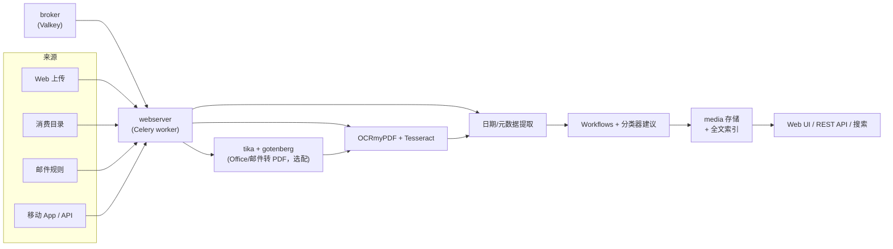

> **判断**：paperless-ngx 解决的不是「把纸变成 PDF」——扫描仪和 OCR 工具早就能做这件事——而是扫完之后的三件事：文字进全文索引、元数据自动归位、多年之后还能按关键词、标签、日期、通讯者把一份文件找回来。为此它把消费（consume）、OCR、机器学习分类、Workflows 规则、全文检索、权限与审计压成一条流水线，用一组 Docker 容器交付。它不是轻量工具：至少要养 webserver 和消息队列两个容器，选配文档转换还要再加两个。换来的是文档一旦入库，人工只剩「看一眼建议对不对」。

> **读完后能做什么**：说清一份扫描件从进入消费目录到被搜到的完整路径；分清「机器学习建议」和「Workflows 规则」两种自动化各自适合什么；写得出中文 OCR 要改哪几个变量；知道备份该用哪个命令、导入为什么被版本锁死；以及判断自己的场景适不适合自托管这套东西。

> **依据**：[paperless-ngx/paperless-ngx](https://github.com/paperless-ngx/paperless-ngx) `main` 分支 `docs/` 目录（configuration、setup、usage、api、advanced_usage、administration、faq），最新 release 为 v3.2.1（2026-09-20），GitHub API（应用程序接口）在 2026-09-30 读到 46,164 stars / 3,193 forks / GPL-3.0，主语言 Python。历史沿革按 the-paperless-project/paperless 与 jonaswinkler/paperless-ng 的仓库元数据及前者 README 核对。文中所有配置变量名逐一对照过 docs/configuration.md，与网上旧教程冲突处以官方文档为准。

## 目录

- [§1 系统地图：一条消费流水线与一组协作容器](#1-系统地图一条消费流水线与一组协作容器)
- [§2 三个名字：paperless、paperless-ng、paperless-ngx](#2-三个名字paperlesspaperless-ngpaperless-ngx)
- [§3 文档怎么进来：五条消费路径](#3-文档怎么进来五条消费路径)
- [§4 一份扫描件的完整旅程](#4-一份扫描件的完整旅程)
- [§5 自动整理：机器学习建议与 Workflows 规则](#5-自动整理机器学习建议与-workflows-规则)
- [§6 检索：Tantivy 索引与搜索语法](#6-检索tantivy-索引与搜索语法)
- [§7 安装与关键配置](#7-安装与关键配置)
- [§8 备份与升级](#8-备份与升级)
- [§9 权限、认证与安全边界](#9-权限认证与安全边界)
- [§10 AI 功能：v3 的新增能力](#10-ai-功能v3-的新增能力)
- [§11 采用顺序与适用边界](#11-采用顺序与适用边界)
- [§12 常见问题与排查](#12-常见问题与排查)
- [§13 自测题](#13-自测题)
- [§14 事实核验与引用](#14-事实核验与引用)

## §1 系统地图：一条消费流水线与一组协作容器

paperless-ngx 是前后端分离的 Django 应用：后端 Python + Django REST Framework 提供 API，前端 Angular（TypeScript）单页应用，OCR 委托给 OCRmyPDF 调 Tesseract。跑起来至少两个容器，常见四个：

| 服务 | 镜像 | 职责 | 是否必选 |
|------|------|------|---------|
| webserver | `ghcr.io/paperless-ngx/paperless-ngx` | Web UI、REST API，也是 Celery worker：消费、OCR、分类都跑在这里 | 必选 |
| broker | `docker.io/valkey/valkey:9-alpine` | Celery 的消息队列，消费任务先进这里排队 | 必选 |
| gotenberg | `docker.io/gotenberg/gotenberg:8.37` | 把 Office 文档等转换成 PDF | 选配 |
| tika | `docker.io/apache/tika:3.3.1.0` | 从 Office 文档、邮件附件里抽取文本和元数据 | 选配 |

两个细节值得记住。broker 用的是 Valkey 而不是 Redis：官方 FAQ 说任何兼容 Redis 协议的服务都行，Redis 改了许可证之后，官方 compose 文件默认捆了 Valkey，存量部署原地换实现也可以。gotenberg 和 tika 只在带 `-tika` 后缀的 compose 变体里出现——如果你只处理扫描件和 PDF，可以不装；要收 Office 文档和邮件附件，就需要它们。

数据库走 `PAPERLESS_DBENGINE` 三选一：默认 SQLite（零配置，文件在 `data/db.sqlite3`），多用户或高吞吐场景官方推荐 PostgreSQL，MariaDB 可用但文档里专门有一节 MySQL Caveats，选前先读。数据落盘是四个 Docker 卷：media（文档本体）、data（索引、SQLite 等辅助数据）、pgdata / dbdata（用了外部数据库才有）。

一条文档的流水线长这样：



## §2 三个名字：paperless、paperless-ng、paperless-ngx

网上教程常把这三者混着叫，实际是三个仓库、两代交接：

- **paperless**（the-paperless-project/paperless）：2015 年 12 月创建的原始项目。作者后来在 README 里写明，项目火到超出个人维护能力，转交组织维护也没能解决，仓库已归档，最后一次推送停在 2021 年 4 月。
- **paperless-ng**（jonaswinkler/paperless-ng）：Jonas Winkler 写的 fork，原项目 README 亲口说它 "really good" 且在积极维护。ng 把前端换成了 Angular（ngx 沿用至今），今天的主体架构就是那一次定下来的。这个仓库同样已归档，最后推送停在 2023 年 2 月。
- **paperless-ngx**（paperless-ngx/paperless-ngx）：2022 年 2 月由社区从 paperless-ng fork 出来接手维护，也就是本文讨论的仓库。当前主线版本 v3.x。

流传较广的一种说法是「原项目 2016 年由某作者发起、2021 年 jonaswinkler 接手出 ngx」——两处都不对：ng 不是原作者的续作而是 fork，ngx 也不是 jonaswinkler 接手，而是 ng 停滞后社区另起的 fork。判断教程新旧最简单的办法是看它写的配置变量：还在教 Whoosh、`docker-compose`（v1 语法）或 `web` 容器名的，基本是 ng 时代的遗物，本文 §6 和 §8 会讲到它们现在的样子。

## §3 文档怎么进来：五条消费路径

| 路径 | 入口 | 关键配置 / 前提 |
|------|------|----------------|
| Web 界面 | 登录后在应用内任意位置拖放文件 | 无 |
| 消费目录 | 监视一个文件夹，放进去就自动导入 | `PAPERLESS_CONSUMPTION_DIR`；`PAPERLESS_CONSUMER_RECURSIVE` 递归监视子目录，`PAPERLESS_CONSUMER_SUBDIRS_AS_TAGS` 把子目录名转成标签 |
| 邮件收件 | Web 界面 `/settings/mail` 里配邮箱账户和规则 | IMAP 拉取附件；规则可决定消费成功后对邮件做什么 |
| 移动 App | 第三方应用，走 REST API | 官方 wiki 的 Related Projects 页维护着清单，见下 |
| REST API | `POST /api/documents/post_document/` | multipart 表单，字段名是 `document`；可附 `title` 等表单字段 |

两条容易踩的坑。第一，邮件抓取在 Web 界面里配置，不在环境变量里——`PAPERLESS_EMAIL_*` 这组变量现在管的是**发件**（Email workflow 动作、从 UI 发文档、密码重置邮件），旧教程用它配收件已经过时。第二，没有官方移动客户端：Android 上常见的是 Paperless Mobile，iOS 上有 Swift Paperless、QuickScan 等，全是第三方应用，通过 API 与服务器交互，选型前留意各自的维护状态。

API 这条路适合程序化对接。认证用 `POST /api/token/` 换 Token（或在「My Profile」页面生成），之后每个请求带 `Authorization: Token <token>` 头。上传的最小示例：

```bash
curl -X POST https://your-paperless.example.com/api/documents/post_document/ \
  -H "Authorization: Token YOUR_TOKEN" \
  -F "document=@invoice.pdf" \
  -F "title=Invoice 2026-09"
```

注意表单字段名是 `document`，不少网上示例写成 `file`，服务器会收不到文件。

## §4 一份扫描件的完整旅程

把 §1 的地图走一遍。场景：手机拍了一张纸质发票，要让它进库并且三年后能搜到。

1. **进入系统**。用移动 App 直接推给 API，或把 PDF 丢进消费目录。文件落盘后，webserver 里的 Celery worker 从 broker 领到消费任务。
2. **格式归一**。如果带 tika 组件，Office 和邮件附件先经 tika/gotenberg 转成 PDF；扫描件本身就是 PDF，跳过。
3. **OCR 判定**。`PAPERLESS_OCR_MODE` 默认 `auto`：先用 pdftotext 检测文件里有没有现成文本层，文字够了就跳过 OCR——纯数字生成的 PDF 不会浪费算力；没有文本层才调 OCRmyPDF + Tesseract，按 `PAPERLESS_OCR_LANGUAGE`（默认 `eng`）识别，产出带文字层的 PDF/A 归档副本。
4. **日期与元数据**。paperless 默认从文档文本里找日期；设了 `PAPERLESS_FILENAME_DATE_ORDER` 则先查文件名再查正文。标题、通讯者的初步猜测也在这阶段产生。
5. **规则与建议**。Workflows 按触发器执行确定性动作（§5）；机器学习分类器再给一遍建议——该挂哪个标签、哪个通讯者、哪个文档类型、放哪个存储路径。
6. **入库可检索**。文本进全文索引（§6），文件按 `PAPERLESS_FILENAME_FORMAT` 模板或 storage path 落到 media 目录，文档详情页里那些建议等你确认。确认完从收件箱标签里移出去，这份文档就算归档完毕。

整个过程里人工只有两处：拍的那一下，和最后看一眼建议。中间环节全部异步，浏览器关掉也不影响。

## §5 自动整理：机器学习建议与 Workflows 规则

这是最容易被混为一谈的两套机制，边界其实很清楚。

**机器学习建议**不需要写任何规则。分类器是一个非 LLM 的传统模型，用你库里已经归好类的文档训练，然后对新文档给出标签、通讯者、文档类型、存储路径的建议，在详情页里显示，接受或拒绝都行。它的前提是存量数据：库里已经有几百份归类一致的文档，建议才开始靠谱；全新安装的空库，它给不出有价值的东西。训练频率由 `PAPERLESS_TRAIN_TASK_CRON` 控制，默认每小时。

**Workflows**（v2.3 引入，取代旧的 Consumption Templates）是确定性规则，适合「文件名含 invoice 就打发票标签」这类需求。四类触发器：

| 触发器 | 时机 | 能过滤什么 |
|--------|------|-----------|
| Consumption Started | 消费开始前 | 来源（目录/API/邮件）、文件名与路径通配符、邮件规则 |
| Document Added | 文档入库后 | 内容匹配、已有标签/类型/通讯者 |
| Document Updated | 文档更新时 | 同上 |
| Scheduled | 定时（每小时检查一次） | 按文档日期或自定义字段加偏移量触发 |

动作有三种：assignment（批量设置标签、类型、owner、权限等）、email（发信）、webhook（回调外部服务）。webhook 的行为受 `PAPERLESS_WEBHOOKS_ALLOWED_SCHEMES`、`PAPERLESS_WEBHOOKS_ALLOWED_PORTS`、`PAPERLESS_WEBHOOKS_ALLOW_INTERNAL_REQUESTS` 几个变量约束，默认不允许往 localhost 之类内网地址发。

实践中两者配合：Workflows 负责能写成规则的确定部分，分类器负责写不成规则的长尾。原文和一些教程里「文件名含 invoice 自动打标签」的例子，在今天的 paperless-ngx 里应该用 Workflows 实现，而不是环境变量。

## §6 检索：Tantivy 索引与搜索语法

全文检索引擎是 Tantivy（Rust 实现的搜索库）。旧版 paperless-ng 及更早教程里的 Whoosh 已经被替换——如果你在哪篇文档里看到「基于 Whoosh」，那讲的是 ng 时代的架构。索引由后台任务维护，`PAPERLESS_INDEX_TASK_CRON` 控制定时刷新，默认每天零点。

顶部搜索栏是全局搜索，能同时命中文档、标签、通讯者等对象；文档结果用下面的语法往深里查：

```text
invoice unpaid                  # 不写操作符就是 AND
shopname AND (product1 OR product2)
invoice NOT draft
"quick brown fox"               # 引号：精确短语
type:invoice tag:unpaid         # 字段搜索
correspondent:"acme corp"
asn:[50 to 150]                 # 归档序号范围
invoice*                        # 通配符
```

几个官方文档里专门强调的点：

- `AND`、`OR`、`NOT` 必须大写，小写会被当普通词。
- **前导 `-` 不排除词条**。`invoice -secret` 找的是同时含两个词的文档，排除要用 `invoice NOT secret`。这是从其他搜索引擎过来的人最容易踩的坑。
- `tag:bills,unpaid` 要求同时具有两个标签；多词字段值要加引号。
- 匹配默认与词序、重音、分隔符无关：搜 `1312` 能命中 `A-1312/B`，搜 `resume` 能命中 `résumé`。
- 模糊匹配默认关闭，设 `PAPERLESS_ADVANCED_FUZZY_SEARCH_THRESHOLD`（0.5 是文档建议的起点）后，近似结果排在精确结果之下。
- 词干化由 `PAPERLESS_SEARCH_LANGUAGE` 控制，默认从 OCR 语言推断，改语言会触发索引重建。

## §7 安装与关键配置

官方推荐用安装脚本，交互式问完所有问题，装完访问 `http://127.0.0.1:8000`：

```bash
bash -c "$(curl --location --silent --show-error https://raw.githubusercontent.com/paperless-ngx/paperless-ngx/main/install-paperless-ngx.sh)"
```

介意 `curl | bash` 的话，脚本在仓库根目录，可以先看再跑。手动部署则从仓库 `docker/compose/` 目录选一个 compose 文件：按数据库（sqlite / postgres / mariadb）和是否带 tika 两组维度组合命名，镜像统一是 `ghcr.io/paperless-ngx/paperless-ngx`。

配置有三个入口：环境变量（Docker 部署）、`paperless.conf`（裸机）、Web 界面设置页（需要 AppConfig 权限）。部分老的环境变量已被界面设置取代，界面设置优先生效。最常用的变量：

| 变量 | 作用 | 默认 / 说明 |
|------|------|------------|
| `PAPERLESS_SECRET_KEY` | 签名会话与敏感数据 | **必填**，不设拒绝启动 |
| `PAPERLESS_TIME_ZONE` | 时区 | UTC；中国用户设 `Asia/Shanghai` |
| `PAPERLESS_DBENGINE` | 数据库引擎 | `sqlite`；`postgresql` / `mariadb` 需显式设置并配 `PAPERLESS_DBHOST` |
| `PAPERLESS_OCR_LANGUAGE` | OCR 识别语言 | `eng`；简体中文 `chi_sim`，繁体 `chi_tra` |
| `PAPERLESS_OCR_LANGUAGES` | Docker 里额外安装的 Tesseract 语言包 | 想识别中文必须加 `chi_sim` |
| `PAPERLESS_OCR_MODE` | 何时执行 OCR | `auto`（默认）/ `redo` / `force` / `off` |
| `PAPERLESS_TASK_WORKERS` / `PAPERLESS_THREADS_PER_WORKER` | 并行的后台任务数（消费、邮件、索引等，默认 1）/ 单份文档内并行 OCR 的页数 | 两者的乘积不要超过 CPU 核数，否则反而变慢 |
| `PAPERLESS_ADMIN_USER` / `PAPERLESS_ADMIN_PASSWORD` | 启动时自动创建超级用户 | Kubernetes、ECS 这类不方便手动跑 `createsuperuser` 的场景官方就推荐用它 |
| `PAPERLESS_CONSUMPTION_DIR` | 消费目录 | 默认 `../consume/`；Docker 部署不要改这个变量（它只影响容器内路径），要改 compose 文件里的卷映射 |
| `PAPERLESS_FILENAME_FORMAT` | 归档文件名模板 | 默认关闭；占位符形如 `{{ created_year }}/{{ correspondent }}/{{ title }}` |
| `PAPERLESS_AUDIT_LOG_ENABLED` | 文档与元数据变更审计 | 2.7 起默认开启 |

OCR 模式单独立一张表，因为网上教程几乎全是旧的：

| 模式 | 行为 | 适合 |
|------|------|------|
| `auto`（默认） | 先用 pdftotext 检测文本层，够用就跳过 OCR | 混合文档库，最省心 |
| `redo` | 重 OCR 全部页面并替换旧文本层 | 扫描仪自带 OCR 质量差的文档 |
| `force` | 先栅格化再整体 OCR | 修复识别质量，产物更大更模糊 |
| `off` | 从不调 OCR 引擎，PDF 只抽现成文本 | 纯数字 PDF 库，省 CPU |

旧教程里的 `skip`、`yes` 取值已经不存在，写了会报错。

一条安全提醒放在配置旁边正合适：README 明确警告，文档以明文存储、静态未加密，不要把 paperless-ngx 跑在不受信任的主机上。它是给可信环境（家里的 NAS、自己的服务器）设计的，不是给公网裸奔的机器设计的。

## §8 备份与升级

备份用自带的导出命令，不是手工复制文件夹：

```bash
docker compose exec -T webserver document_exporter ../export
```

加 `-z` 打包压缩。导出器支持增量更新已有导出，配 rsync 做例行备份是官方文档点名的用法。三件事要记住：

1. **导出不含 API Token**，恢复之后要重新生成。
2. **导入被版本锁死**：用某个版本的 paperless 生成的导出，只能导回同一版本——导出是数据库的精确镜像，跨版本结构可能已变。所以备份要连版本一起记。
3. 也可以直接备份 Docker 卷（media、data、pgdata/dbdata），这是另一种官方认可的路线，恢复时卷对卷还原。

升级前看一眼 release notes。v3.0 有破坏性变更，官方要求先按迁移指引手动处理再升级——从 v2 直接跳 v3 的部署尤其要读。

## §9 权限、认证与安全边界

认证这块的实况，和不少二手资料描述的有出入：

- **本地账号 + 双因素认证**。2FA 是内置的：My Profile 里扫码绑定 TOTP 应用，给 10 个恢复码，超管可以在用户管理里帮丢失设备的用户关闭 2FA。
- **SSO 走 django-allauth**：OIDC、SAML 等提供者通过 `PAPERLESS_APPS` 启用对应插件，还能把第三方系统的用户组同步到本地组。
- **没有内置 LDAP**。官方文档里 LDAP 零次出现。需要 AD 的环境，思路是中间架一个能桥接 OIDC 的身份层，而不是找一个不存在的 `PAPERLESS_LDAP_*` 变量。

授权分两层：全局权限（用户/组能干什么）和对象级权限（owner、可见、可改，可以按文档、标签、通讯者逐个设）。Workflows 的 assignment 动作可以按规则批量赋权，比如按上传目录给文档分配 owner。审计方面，2.7 起默认记录文档及其元数据的每次变更。

对外分享有两种：share links（详情页 Send 按钮或批量编辑器生成的公开链接）和邮件发送。前者适合临时给外部人看一份文件，用完记得吊销。

## §10 AI 功能：v3 的新增能力

v3 系列加入了一组可选的 AI 功能，默认关闭，显式 opt-in：LLM 建议文档标题、日期、标签、通讯者和类型；对单份或多份文档问答（document chat）；以及为提升问答质量的 RAG 索引。后端支持 OpenAI 兼容 API 和本地 Ollama，核心变量是 `PAPERLESS_AI_ENABLED`、`PAPERLESS_AI_LLM_BACKEND`、`PAPERLESS_AI_LLM_ENDPOINT`、`PAPERLESS_AI_LLM_MODEL`、`PAPERLESS_AI_LLM_API_KEY`。

两个判断。一，它和 §5 的分类器建议是并存关系，开了 AI 也不会关掉原有建议，两者可以对照着用。二，隐私代价写在官方警告里：开启即意味着文档内容会被发给所配置的模型提供方，用远程 API 时尤其要想清楚——一份税务记录值不值得发出去。全本地 Ollama 是规避方案，代价是自己的算力。

## §11 采用顺序与适用边界

**适合的场景**：个人或家庭把纸质文档（账单、合同、证件、说明书）做长期数字化归档；小团队共用一个档案库——PostgreSQL 加对象权限加审计，够支撑几十人规模的检索型使用；愿意维护一台常开机器和一份备份的人。

**先别用的场景**：对存储层加密或合规有硬性要求的（明文存储是官方明说的）；没有常开机器的轻度用户，网盘加现成 OCR 工具更省心；想找托管服务直接注册用的——paperless-ngx 没有官方 SaaS，demo.paperless-ngx.com（demo/demo 登录）只是演示环境，内容会被频繁重置，官方页面上挂着勿传隐私文件的提醒。

**和纯 OCR 工具的分工**：只要「把一份文件扫成可搜索 PDF」，paperless 内部用的 OCRmyPDF 单独就够，不用架一整套服务。要的是文档长期积累后的自动整理和检索，才是 paperless-ngx 的主场。

**建议的切入顺序**：先在 demo 里确认界面和工作流符合预期；再用安装脚本部署到自己的机器；接着配中文 OCR（§7 表格里两个变量都要改）；导入一批存量文档跑一两周，看分类器建议的准确率；确认真的一致在用，再考虑迁 PostgreSQL、接 SSO、开备份例行任务。

## §12 常见问题与排查

**Q: 怎么支持中文 OCR？**

两个变量都要动：`PAPERLESS_OCR_LANGUAGES=chi_sim` 让 Docker 镜像装上中文语言包，`PAPERLESS_OCR_LANGUAGE=chi_sim` 让识别真正用中文。带连字符的写法（chi-sim）在这里必须写成下划线。繁体用 `chi_tra`。

**Q: 数据库怎么选？**

单用户家用，SQLite 默认就好，零维护。多用户或每天几十上百份文档的吞吐，迁 PostgreSQL（官方推荐位）。MariaDB 能用，但文档里专门列了 MySQL Caveats，选之前先读那一节，别只看「支持」两个字。

**Q: 文件放进消费目录了，怎么没出现？**

按顺序查三处：目录路径和 `PAPERLESS_CONSUMPTION_DIR` 与容器卷挂载是否对得上；文件格式是否在支持列表里；`docker compose logs webserver` 里消费任务的报错。消费是异步的，OCR 大文件本来就要等一会儿。

**Q: API 一直 401？**

Token 认证的请求头是 `Authorization: Token <token>`，注意 `Token` 这个词本身要带上。Token 在「My Profile」页面生成，或用 `POST /api/token/` 换。换用户新建的 Token 要重新生成——备份导出里不含它（§8）。

**Q: 手写体识别效果差，有开关吗？**

Tesseract 面向印刷体文字，手写内容没有可靠的识别开关可调，效果完全取决于具体文档。对手写需求不要指望调参解决。

**Q: 界面和搜索支持中文吗？**

界面文案由 Crowdin 社区翻译成多种语言，在 Web 界面设置里切换。全文搜索不需要为中文做额外配置：OCR 出的文本照常进索引，上面 §6 的语法照常可用。词干化行为可由 `PAPERLESS_SEARCH_LANGUAGE` 调整，默认从 OCR 语言推断。

## §13 自测题

**1. `PAPERLESS_OCR_MODE` 有哪几个合法取值？默认是哪个，行为是什么？**

<details>
<summary>参考答案</summary>

`auto` / `redo` / `force` / `off`。默认 `auto`：先用 pdftotext 检测文本层，文字够了就跳过 OCR。旧教程里的 `skip`、`yes` 已不存在。

</details>

**2. 机器学习建议和 Workflows 分别适合什么场景？空库上哪个有用？**

<details>
<summary>参考答案</summary>

分类器建议靠存量文档训练，适合长尾；Workflows 是确定性规则，适合「文件名含 invoice 就打标签」这类明确需求。空库上分类器没有训练数据，先靠 Workflows 和手动归类攒存量。

</details>

**3. 想排除含 "secret" 的发票搜索结果，`invoice -secret` 行不行？**

<details>
<summary>参考答案</summary>

不行。前导 `-` 不排除词条，这个查询会命中同时含两个词的文档。正确写法是 `invoice NOT secret`。

</details>

**4. 备份导出后换了个新版本 paperless 导入，会怎样？**

<details>
<summary>参考答案</summary>

导入失败。导出是数据库的精确镜像，官方明确不能跨版本导入；恢复要么用相同版本，要么直接对卷做备份还原。另外导出不含 API Token，恢复后需重新生成。

</details>

**5. 团队要求用 LDAP 登录，paperless-ngx 支持吗？**

<details>
<summary>参考答案</summary>

没有内置 LDAP 支持（官方文档零提及）。可行路径是通过 django-allauth 启用 OIDC/SAML 等提供者，让中间身份层去桥接 AD。

</details>

## §14 事实核验与引用

- 仓库数据（stars 46,164 / forks 3,193 / GPL-3.0 / Python / created_at 2022-02-12）与最新 release v3.2.1（2026-09-20）：GitHub API，2026-09-30 读取。
- 配置变量与默认值：[docs.paperless-ngx.com/configuration](https://docs.paperless-ngx.com/configuration/)（源文件 `docs/configuration.md` @ main，2026-09-30 读取）。OCR 模式取值、`PAPERLESS_SECRET_KEY` 必填、数据库引擎选项、审计默认开启均出自此页。
- 安装路径、compose 文件清单、服务镜像版本：[docs.paperless-ngx.com/setup](https://docs.paperless-ngx.com/setup/) 与仓库 `docker/compose/` 目录、`src-ui/package.json`（Angular）。
- 消费路径、Workflows 触发器、搜索语法、AI 功能、2FA、share links：[docs.paperless-ngx.com/usage](https://docs.paperless-ngx.com/usage/)。
- API 端点（`/api/token/`、`/api/documents/post_document/`、`document` 表单字段、Token 头格式）：[docs.paperless-ngx.com/api](https://docs.paperless-ngx.com/api/)。
- 备份与升级（`document_exporter`、版本锁、四个 Docker 卷、v3.0 破坏性变更）：[docs.paperless-ngx.com/administration](https://docs.paperless-ngx.com/administration/)。
- 移动端应用清单：官方 wiki [Related Projects](https://github.com/paperless-ngx/paperless-ngx/wiki/Related-Projects)（Paperless Mobile、Swift Paperless 等）。
- 项目历史：the-paperless-project/paperless（created 2015-12-20，archived，README 述及项目移交与 paperless-ng fork 的出现）、jonaswinkler/paperless-ng（archived，最后推送 2023-02）仓库元数据，GitHub API 2026-09-30 读取。
- 明文存储警告、demo 环境（demo/demo，DigitalOcean 托管，内容频繁重置）、Crowdin 界面翻译：仓库 README @ main。
- 时效声明：版本号、stars/forks、镜像 tag 都是时点数据，以仓库与文档实时值为准；本文的配置变量名以 docs/configuration.md 为最终依据。
