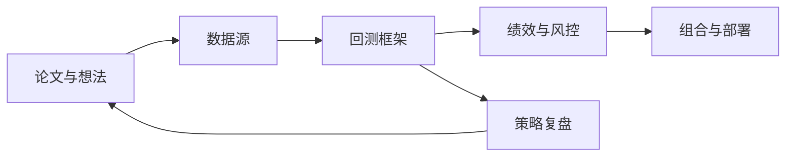

<!-- markdownlint-disable-file MD003 MD041 -->

## 路线图

`paperswithbacktest/awesome-systematic-trading` 把系统化交易拆成几条可以分别学习的主线：数据、回测、分析、论文、书单和课程。刚接触量化的人，最大的瓶颈不是"没有资料"，而是"入口太散"——这份仓库解决的就是这个问题。

但 2026 年再看它，需要多读一层上下文。GitHub 仓库依然是一个好用的入口。README 列出 97 个库（按事件驱动框架、向量化框架、加密货币、分析、经纪商 API、数据源、数据库、机器学习等子类编排）、40+ 策略（含论文链接和 Sharpe/波动率/调仓频率等指标）、55 本书（按初学者到高频交易分层）、23 个视频，以及博客和课程索引，另有独立的中文版 README_zh.md。

与此同时，官方站点已经把重心转到产品化平台本身。首页展示 5,000+ 篇可运行论文（官方也把它们称作"策略"）、1.04 TB 清洗数据、60+ 课程内容、30,000+ Discord 社区成员。README 的策略区也直接写了"Strategies are now hosted here"——仓库是索引，官方网站是工作平台。

下面按这个顺序展开：先讲清仓库、官网、课程和博客各自负责什么，再看回测框架怎么选，最后用一条最小任务流把这些资源串起来。

## 学习目标

- 看懂 GitHub 仓库、官方站点、课程和博客各自扮演的角色。
- 知道在什么场景下优先选 Backtrader、vectorbt、vnpy、Freqtrade、Lean 或 HFTBacktest。
- 学会把论文、数据、回测和绩效分析拼成第一条可运行的研究闭环。
- 避免把 high Sharpe、热门项目或 AI 量化标签误读成"可以直接上实盘"。

## 先分清边界：GitHub 仓库和官方平台是两套东西

仓库本身已经不再承担"完整策略目录"的全部职责。还按 2023 年那种"README 就是全部知识库"的方式阅读，后面的判断容易出问题。

| 载体 | 它现在负责什么 | 该怎样使用 |
| ---- | ---- | ---- |
| GitHub README | 资源导航、项目入口、书单和课程索引 | 用来做第一轮筛选和建立知识地图 |
| paperswithbacktest.com | 5,000+ 可运行论文、数据、API、MCP、工作台 | 已经知道要查什么时，直接去站内搜策略和数据 |
| Course | 61 节内容、25 个 code notebook，覆盖 Python 基础、数据采集、回测、ML/DL/LLM，以及协整、卡尔曼滤波、过拟合、p-hacking 等量化金融专题 | 适合按章节系统补课，零散查资料效率低 |
| Blog (Substack) | 27,000+ 订阅者，覆盖策略组合、期权定价、加密货币季节性与量化研究方法 | 用来跟踪作者的最新判断，补充 README 的静态内容 |

但注意：官网可以免费浏览论文目录和课程大纲，完整的可运行代码、清洗数据和一键实盘部署在付费档之后（Backtester 约 $50/mo）。把它当工作台之前，先掂量这笔投入对现阶段值不值。

数据基础设施可以接 [OpenBB：开源金融数据平台专家级技术文档]()，AI 量化研究流水线可以接 [Qlib：微软亚洲研究院 AI 量化投资平台从入门到精通]()。

## 一张够用的系统地图



这张图就是这份仓库的阅读顺序。初学者容易一上来就盯着框架名字，但系统化交易是一条闭环：先有研究假设，再决定数据需求，再进入回测与绩效分析，最后才谈部署。它把这条闭环上的主要入口都摆在同一页，省掉的就是四处翻找的时间。

策略复盘经常被跳过，可它决定了后面的参数调整有没有依据。一次复盘要回答的不是"赚没赚钱"，而是"这笔钱到底赚在哪"——趋势、均值回归，还是运气。跑完回测不复盘就直接换参数，等于在跑一条没有反馈回路的研究流程。仓库的 Analytics 和 Risk 分类覆盖了 quantstats、pyfolio、Riskfolio-Lib 等工具，正好补上这个环节。

| 主线 | README 里主要看什么 | 要解决的问题 |
| ---- | ---- | ---- |
| 研究层 | Strategies、Books、Courses、Blogs | 你要研究哪类市场效应，论文从哪里起步 |
| 数据层 | Data Sources、Databases | 数据质量能不能支撑结论 |
| 执行层 | Backtesting、Broker APIs、Trading bots | 做原型、模拟撮合还是准备接实盘 |
| 评估层 | Analytics、Risk、Optimization | 策略赚的是什么钱，风险暴露在哪里 |

## 为什么这份仓库值得看

它把事件驱动回测、向量化原型、加密框架、数据源、组合优化和策略论文放在了同一个结构里——散落在 20 个独立仓库里做不到这一点。同时，README 的策略区把论文和代码入口放在一起，每条策略同时给出 Sharpe、波动率、调仓频率、论文链接和 QuantConnect 实现入口。这些数字不能直接拿来比实盘价值，但把"看到论文标题"到"找到第一份代码"之间的距离从几小时缩短到了几分钟。

用它排优先级也很直接：不需要把 97 个库都装一遍。先回答自己是研究、回测、部署、还是做组合管理，就能把大部分无关选项排除掉。仓库近一年已转入低频维护、退居索引角色，但配合仍在维护的中文版 README_zh.md，用来建知识地图依然够用——把它当资源索引，而不是实时更新的知识库。

仓库的 Broker APIs 和 Databases 分类也值得单独看。Broker APIs 涵盖 IBKR（Ib_insync）、CCXT、Coinnect、PENDAX 等券商与交易所接口；Databases 收录 Marketstore、Tectonicdb、ArcticDB 这类面向行情与订单簿的时序存储方案。这些是量化基础设施的关键组件，但经常被只关注回测框架的人跳过。

## 回测框架怎么选

### 验证想法，还是模拟交易流程

验证一个信号有没有基本效果，向量化框架比事件驱动框架划算得多。vectorbt 这类工具快，适合参数扫描和原型推演；Backtrader、Lean、vnpy 这类事件驱动框架贴近真实交易路径，适合处理订单、滑点、手续费和撮合细节。

### 做哪个市场

市场决定了框架边界。做 A 股、期货，或对接中文券商接口时，vnpy、QUANTAXIS、WonderTrader 比欧美社区最热的教程框架更实用；做加密货币时，Freqtrade、Jesse、Hummingbot 这类 7x24 场景工具更贴近实际工作流。

### 离实盘还有多远

离实盘还远，先用易学和迭代快的工具建立闭环；已经明确需要从回测迁移到执行层，Lean、NautilusTrader、HFTBacktest 这类更偏工程化的平台才值得投入时间。容易把"未来可能需要"错当成"现在必须掌握"。

| 场景 | 第一选择 | 原因 |
| ---- | ---- | ---- |
| 刚入门，先把策略跑通 | Backtrader | 文档多，样例成熟，足够理解事件驱动回测 |
| 要快速扫参数和做原型 | vectorbt | 基于 Pandas、NumPy、Numba，反馈速度快 |
| 做 A 股或国内期货 | vnpy / QUANTAXIS / WonderTrader | 国内接口和社区经验更贴地气 |
| 做加密货币自动化 | Freqtrade / Jesse / Hummingbot | 交易所接入和 7x24 场景更完整 |
| 准备从研究走向部署 | Lean / NautilusTrader | 回测到实盘的迁移链路更短 |
| 做高频或订单簿研究 | HFTBacktest | 对 tick 级与高频数据更有针对性 |

## 一个真实任务流：从论文到第一次回测

这份仓库最该拿来跑通第一条任务流，收藏仓库名没有意义。下面是一个最小示例，演示怎样把论文、数据和回测接起来。

1. 先在 Strategies 区域挑一条规则足够简单、调仓频率不太高的策略，比如趋势跟踪、均值回归或配对交易。

2. 再去 Data Sources 里挑一套拿得到、也能解释清楚的数据。学习阶段用 yfinance、AkShare、TuShare 没问题，但不适合当成生产级行情源。

3. 原型阶段优先选 vectorbt 或 backtesting.py，先把“信号有没有基本效果”回答掉，不要一开始就搭整套实盘框架。vectorbt 对 numpy/numba 版本较敏感，装不上时优先建一个干净虚拟环境，或先退回更好装的 backtesting.py。

4. 跑出结果后，把绩效输出交给 quantstats、pyfolio、ffn 这类分析工具，检查收益、回撤和 Sharpe 来自哪里。

5. 只有当信号、数据和评估都稳定了，才值得迁移到 Lean、vnpy、Freqtrade 这类更靠近执行层的平台。

```python
import yfinance as yf
import vectorbt as vbt
# auto_adjust 取复权价；squeeze 把单列 DataFrame 压成 Series，规避新版 yfinance 的 MultiIndex 列
close = yf.download("SPY", start="2018-01-01", auto_adjust=True)["Close"].squeeze()
fast = close.rolling(20).mean()
slow = close.rolling(50).mean()
pf = vbt.Portfolio.from_signals(close, fast > slow, fast < slow, fees=0.001, slippage=0.001)
print(pf.stats()[["Total Return [%]", "Max Drawdown [%]", "Sharpe Ratio"]])
```

示例里特意保留了 `fees=0.001, slippage=0.001`：把这两个参数删掉，Sharpe 和收益往往立刻好看一截——纸面回测默认零成本，这正是它最容易骗人的地方。还要留意标的是 SPY 这只指数 ETF，本身没有幸存者偏差、不停牌、也没有复权争议；一旦换成个股或 A 股，下面“常见错误”里的数据坑才会真正冒头。所以这个示例只回答一件事：一个最简单的双均线想法，在一套公开数据上能不能跑出可参考的历史结果。它还没有回答成交约束、交易时段差异和样本外稳定性，离实盘结论还很远。

跑出裸回测结果后，可以用 quantstats 生成一份 HTML 报告，把回撤分布、月度收益、滚动 Sharpe 等信息可视化：

```python
import quantstats as qs

# 延用上面的 vectorbt 结果
returns = pf.returns()
qs.reports.html(returns, output="spy_ma_cross_report.html")
```

这份报告会展示收益分布、最大回撤期间、夏普比率的稳定性，以及策略在牛熊市中的不同表现。把这份报告和回测曲线放在一起，才能判断这个双均线策略值不值得继续往下走。

## 如何读仓库里的 Sharpe 比率

README 的策略区很吸引人，因为每条策略都给出 Sharpe、波动率、调仓频率和论文链接。但这些数字是研究线索，离统一 benchmark 还有距离。

- 它们主要来自原论文或对应实现，回测期间、费用假设、样本外验证和再平衡细节并不统一。
- 同样是 Sharpe 0.8，周频股票反转、日内比特币季节性和跨资产趋势跟踪，背后的容量、换手、滑点与执行难度完全不是一回事。
- README 现在已经明确把策略主阵地迁到了官方站点。稳妥的做法是：先用仓库发现方向，再去站内或原论文核对实现细节。

高 Sharpe 在这里是"值得看一眼"的信号，离"可以直接上仓位"还有距离。

## 一条学习路径

1. 基础阶段：先把 Pandas、NumPy、收益率、回撤、再平衡、手续费这些词吃透，再开始写第一个策略。
2. 研究阶段：从一条规则简单的论文入手，把信号、样本区间、调仓频率和风险暴露都写清楚，不要只抄代码。
3. 组合阶段：开始接触 PyPortfolioOpt、Riskfolio-Lib、quantstats，搞清楚为什么"多策略组合"通常比死磕"单一神策略"更靠得住。
4. 进阶阶段：等能稳定复现实验之后，再去碰 QLib、FinRL、MlFinLab、LLM for Trading 这类更容易过拟合的方向。

按资料类型来排优先级：先读 README 建地图，再读一篇论文和一份实现，再补课程里的研究方法与统计内容，最后才是博客和 AI 量化扩展材料。

## 常见错误与排查

- **把向量化回测结果当成真实成交**。向量化框架默认你能在理想价位成交，回头得检查策略是不是依赖了 intraday 成交顺序、订单簿深度、滑点或手续费模型——这些它通常没算进去。
- **拿论文里的 Sharpe 直接横向比**。先把样本区间、资产池、换手率、交易成本和再平衡频率列在同一张纸上，再决定这两个数字放在一起比有没有意义。
- **在免费数据上跑出漂亮结果，就默认它能过实盘**。复权、幸存者偏差、停牌处理、时区对齐、缺失值修补，任何一项没处理干净，结果都可能是不可靠的。
- **太早把机器学习当成 alpha 发生器**。线性规则、因子模型、简单动量都还没稳定复现时，先问清楚复杂模型到底在解决什么问题。
- **在同一个数据集上反复调参，直到曲线"完美"**。这是过拟合最常见的入口：做样本外测试或交叉验证，把数据按时间切开——比如 2018-2022 用来调参、2023-2025 只用来验证，测试段在最终评估前绝不回看；如果样本外表现远差于样本内，说明参数拟合的只是历史噪声。
- **忽略前视偏差（look-ahead bias）**。回测中不小心使用了未来信息——比如用当天的收盘价计算当天开盘时的信号，或在财报发布前使用财报数据。这类错误在向量化框架中尤其隐蔽，因为所有数据在同一时刻可用，信号计算天然没有"时间先后"的概念。

## 练习

1. 从 README 的 Strategies 区域任选一条月频或周频策略，用上面的最小示例先做一个简化复现，再写出你删掉了哪些现实约束。
2. 分别选一个事件驱动框架和一个向量化框架，写出它们最能回答的问题，不要只比较 Star 数量。
3. 找出仓库里一个你现在最想学的方向，给自己列一个三周计划：第一周补基础，第二周复现，第三周做一次参数或样本外验证。

## 自测问题

- 你现在最缺的是研究假设、数据质量、回测框架，还是绩效分析？答不出来，说明还没找到自己的瓶颈。
- 你能不能解释清楚同一个 Sharpe 数字在不同资产、频率和交易成本假设下为什么不能直接比较？
- 你有没有一条从"读论文标题"到"跑出第一张回测曲线"的完整路径，还是只停留在收藏仓库？

## 进阶

当已经知道自己要查什么，GitHub 仓库就可以退到"目录"位置，接下来去更靠近执行的地方工作。

- 要挖策略细节，去官方站点看 5,000+ 可运行论文、数据目录和实现入口。
- 要系统补课，直接走课程页那 61 节内容和 25 个 code notebook——零散博客拼不出完整的知识结构。
- 要程序化检索资源，可以继续看站点提供的 API 和 MCP 入口：它们把目录变成了可查询的接口，不需要每次手动翻网页。
- 要在本地脚本里直接调用，官方还提供了 Python 工具包 pwb-toolbox（`pip install pwb-toolbox`），把站内数据和策略接进自己的研究流程。

能不能把其中一条研究路径走完，是真正的分水岭：选假设、拿数据、跑回测、看风险、做复盘，再决定值不值得继续。

## 站内延伸阅读

- [OpenBB：开源金融数据平台专家级技术文档]()：把本文里的"数据层"继续展开，覆盖数据获取与多端消费。
- [Qlib：微软亚洲研究院 AI 量化投资平台从入门到精通]()：把研究流水线、模型层和策略层拆得更细，从"会回测"走向"会做研究框架"。
- [Stefan Jansen《Machine Learning for Trading》2nd：量化金融 ML 工程化完全指南]()：继续走机器学习、Notebook 实验和 Zipline-reloaded 这条线。
- [CZSC：缠中说禅技术分析工具完全指南]()：关心规则型技术分析和中文量化社区语境，这篇更贴近实战。

## 参考

- [paperswithbacktest/awesome-systematic-trading README](https://github.com/paperswithbacktest/awesome-systematic-trading/blob/main/README.md)
- [paperswithbacktest/awesome-systematic-trading 仓库](https://github.com/paperswithbacktest/awesome-systematic-trading)
- [paperswithbacktest 官方站点](https://paperswithbacktest.com/)
- [pwb-toolbox 官方 Python 工具包](https://github.com/paperswithbacktest/pwb-toolbox)
- [Algo Trading Course](https://paperswithbacktest.com/course)
- [Algo Trading & AI Blog](https://blog.paperswithbacktest.com/)
