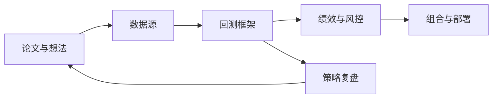

<!-- markdownlint-disable-file MD003 MD041 -->

## 先给结论：这份仓库最适合拿来做路线图，不适合直接当策略排行榜

`paperswithbacktest/awesome-systematic-trading` 最有用的地方，不是替你选出“最强框架”或“最高 Sharpe 策略”，而是把系统化交易拆成几条可以分别学习的主线：数据、回测、分析、论文、书单和课程。你第一次接触量化时，最大问题通常不是资料太少，而是入口太散；这份仓库做的就是第一轮收束。

但 2026 年再看它，必须多读一层上下文。GitHub 仓库仍然是一个好用的入口，README 里清楚列着 97 个库、40+ 篇策略论文、55 本书、23 个视频、博客和课程；与此同时，官方站点已经把重心转到产品化平台本身，首页主打 5,000+ 篇可运行论文、1.04 TB 清洗数据、60+ 课程内容，README 的策略区也直接写了“Strategies are now hosted here”。所以更准确的定位是：仓库是资源地图，站点是继续深挖的工作台。

把这篇文章当成一张目录地图来读：先分清仓库、官网、课程和博客各自负责什么，再看回测框架怎么选，最后用一条最小任务流把这些资源真的串起来。

## 学习目标

- 看懂 GitHub 仓库、官方站点、课程和博客各自扮演的角色。

- 知道在什么场景下优先选 Backtrader、vectorbt、vnpy、Freqtrade、Lean 或 HFTBacktest。

- 学会把论文、数据、回测和绩效分析拼成第一条可运行的研究闭环。

- 避免把 high Sharpe、热门项目或 AI 量化标签误读成“可以直接上实盘”。

## 先分清边界：GitHub 仓库和官方平台不是同一个东西

这一步很重要，因为仓库本身已经不再承担“完整策略目录”的全部职责；如果你还按 2023 年那种“README 就是全部知识库”的方式阅读，后面很多判断都会偏掉。

| 载体 | 它现在负责什么 | 你该怎样使用 |
| ---- | ---- | ---- |
| GitHub README | 资源导航、项目入口、书单和课程索引 | 用来做第一轮筛选和建立知识地图 |
| paperswithbacktest.com | 5,000+ 可运行论文、数据、API、MCP、工作台 | 当你已经知道要查什么时，直接去站内搜策略和数据 |
| Course | 61 节内容、25 个 code notebook 的学习路径 | 适合按章节系统补课，而不是零散查资料 |
| Blog | 对量化、AI 与研究方法的持续输出 | 用来跟踪作者的判断，不是替代 README |

如果你想顺着这张地图继续往下读，数据基础设施可以接 [OpenBB：开源金融数据平台专家级技术文档]()，AI 量化研究流水线可以接 [Qlib：微软亚洲研究院 AI 量化投资平台从入门到精通]()。

## 一张够用的系统地图



这张图也是这份仓库真正的阅读顺序。很多人一上来就盯着框架名字，其实系统化交易更像一条闭环：先有研究假设，再决定数据需求，再进入回测与绩效分析，最后才谈部署。仓库最强的地方，不是某一个库，而是它把这条闭环上的主要入口都摆在了同一页里。

| 主线 | README 里主要看什么 | 真正要解决的问题 |
| ---- | ---- | ---- |
| 研究层 | Strategies、Books、Courses、Blogs | 你要研究哪类市场效应，论文从哪里起步 |
| 数据层 | Data Sources、Databases | 你的数据质量能不能支撑结论 |
| 执行层 | Backtesting、Broker APIs、Trading bots | 你是在做原型、模拟撮合还是准备接实盘 |
| 评估层 | Analytics、Risk、Optimization | 策略赚的是什么钱，风险暴露在哪里 |

## 为什么这份仓库今天依然值得看

第一，它不是泛泛而谈的“量化资源大全”，而是把事件驱动回测、向量化原型、加密框架、数据源、组合优化和策略论文放在了同一个结构里。对初学者来说，这比单独收藏 20 个仓库有用得多。

第二，它把论文和代码入口放在一起。README 里的策略区不仅给出 Sharpe、波动率和调仓频率，还给出论文链接和 QuantConnect 实现入口。哪怕这些数字不能直接拿来比实盘价值，它依然大幅缩短了“看到论文标题”和“找到第一份代码”之间的距离。

第三，它天然适合做排优先级。你不需要把 97 个库都装一遍，只要先回答自己是研究、回测、部署、还是做组合管理，就能把大部分无关选项排除掉。

## 回测框架怎么选：先回答三个问题

### 1. 你是在验证想法，还是模拟交易流程

如果你只是想验证一个信号有没有基本效果，向量化框架通常比事件驱动框架划算得多。vectorbt 这类工具的优势是快，适合参数扫描和原型推演；Backtrader、Lean、vnpy 这类事件驱动框架的优势是贴近真实交易路径，适合处理订单、滑点、手续费和撮合细节。

### 2. 你做哪个市场

市场决定了框架边界。做 A 股、期货和中文券商接口时，vnpy、QUANTAXIS、WonderTrader 一类项目的现实价值会高于欧美社区最热的教程框架；做加密货币时，Freqtrade、Jesse、Hummingbot 这类 7x24 场景工具更贴近实际工作流。

### 3. 你离实盘还有多远

如果你离实盘还远，先用易学和迭代快的工具建立闭环；如果你已经明确需要从回测迁移到执行层，Lean、NautilusTrader、HFTBacktest 这类更偏工程化的平台才值得投入时间。很多人卡在这里，是因为把“未来可能需要”当成了“现在必须掌握”。

| 场景 | 第一选择 | 原因 |
| ---- | ---- | ---- |
| 刚入门，先把策略跑通 | Backtrader | 文档多，样例成熟，足够理解事件驱动回测 |
| 要快速扫参数和做原型 | vectorbt | 基于 Pandas、NumPy、Numba，反馈速度快 |
| 做 A 股或国内期货 | vnpy / QUANTAXIS / WonderTrader | 国内接口和社区经验更贴地气 |
| 做加密货币自动化 | Freqtrade / Jesse / Hummingbot | 交易所接入和 7x24 场景更完整 |
| 准备从研究走向部署 | Lean / NautilusTrader | 回测到实盘的迁移链路更短 |
| 做高频或订单簿研究 | HFTBacktest | 对 tick 级与高频数据更有针对性 |

## 一个真实任务流：从论文到第一次回测

这份仓库最该拿来做的，不是收藏，而是启动第一条任务流。下面给一个最小示例，演示怎样把论文、数据和回测接起来。

1. 先在 Strategies 区域挑一条规则足够简单、调仓频率不太高的策略，比如趋势跟踪、均值回归或配对交易。

2. 再去 Data Sources 里挑一套你拿得到、也能解释清楚的数据。学习阶段用 yfinance、AkShare、TuShare 没问题，但别把它们当成生产级行情源。

3. 原型阶段优先选 vectorbt 或 backtesting.py，把“信号有没有基本效果”先回答掉，不要一开始就搭整套实盘框架。

4. 跑出结果后，再把绩效输出交给 quantstats、pyfolio、ffn 这类分析工具，检查收益、回撤和 Sharpe 来自哪里。

5. 只有当信号、数据和评估都稳定了，才值得迁移到 Lean、vnpy、Freqtrade 这类更靠近执行层的平台。

```python
import yfinance as yf
import vectorbt as vbt
close = yf.download("SPY", start="2018-01-01")["Close"]
fast = close.rolling(20).mean()
slow = close.rolling(50).mean()
pf = vbt.Portfolio.from_signals(close, fast > slow, fast < slow)
print(pf.stats()[["Total Return [%]", "Max Drawdown [%]", "Sharpe Ratio"]])
```

这个示例只回答一件事：一个最简单的双均线想法，在一套公开数据上能不能跑出像样的历史结果。它还没有回答滑点、成交约束、交易时段差异和样本外稳定性，所以它是原型，不是实盘结论。

## 如何读仓库里的 Sharpe 比率

README 的策略区很吸引人，因为每条策略都给出 Sharpe、波动率、调仓频率和论文链接，但这些数字更像研究线索，不是统一 benchmark。

- 它们主要来自原论文或对应实现，回测期间、费用假设、样本外验证和再平衡细节并不统一。

- 同样是 Sharpe 0.8，周频股票反转、日内比特币季节性和跨资产趋势跟踪，背后的容量、换手、滑点与执行难度完全不是一回事。

- README 现在已经明确把策略主阵地迁到了官方站点，所以更稳的做法是：先用仓库发现方向，再去站内或原论文核对实现细节。

换句话说，高 Sharpe 在这里更像“值得看一眼”的信号，而不是“可以直接上仓位”的结论。

## 一条能落地的学习路径

1. 基础阶段：先把 Pandas、NumPy、收益率、回撤、再平衡、手续费这些词彻底吃透，再开始写第一个策略。

2. 研究阶段：从一条规则简单的论文入手，把信号、样本区间、调仓频率和风险暴露都写清楚，而不是只抄代码。

3. 组合阶段：开始接触 PyPortfolioOpt、Riskfolio-Lib、quantstats，理解“多策略组合”为什么往往比“单一神策略”更重要。

4. 进阶阶段：等你已经能稳定复现实验，再去碰 QLib、FinRL、MlFinLab、LLM for Trading 这类更容易过拟合的方向。

如果按资料类型来排优先级，我会给出一个更务实的顺序：先读 README 建地图，再读一篇论文和一份实现，再补课程里的研究方法与统计内容，最后才是博客和 AI 量化扩展材料。

如果你准备沿机器学习这条线往下走，站内最适合接着读的是 [Stefan Jansen《Machine Learning for Trading》2nd：量化金融 ML 工程化完全指南]()；如果你更偏中文量化研究与规则表达，可以直接转到 [CZSC：缠中说禅技术分析工具完全指南]()。

## 常见错误与排查

- 常见错误一：把向量化回测结果当成真实成交结果。排查方法是回头检查你的策略有没有依赖 intraday 成交顺序、订单簿深度、滑点或手续费模型。

- 常见错误二：拿论文里的 Sharpe 直接横向比较。排查方法是把样本区间、资产池、换手率、交易成本和再平衡频率列在同一张纸上，再决定这两个数字能不能比。

- 常见错误三：在免费数据上得到一个漂亮结果，就默认它能过实盘。排查方法是确认数据有没有复权、幸存者偏差、停牌处理、时区对齐和缺失值修补问题。

- 常见错误四：太早把机器学习当成 alpha 发生器。排查方法是先问自己，线性规则、因子模型或简单动量都没稳定复现时，复杂模型到底在解决什么问题。

## 练习

1. 从 README 的 Strategies 区域任选一条月频或周频策略，用上面的最小示例先做一个简化复现，再写出你删掉了哪些现实约束。

2. 分别选一个事件驱动框架和一个向量化框架，写出它们最适合回答的问题，而不是只比较 Stars 数。

3. 找出仓库里一个你现在最想学的方向，给自己列一个三周计划：第一周补基础，第二周复现，第三周做一次参数或样本外验证。

## 自测问题

- 你现在最缺的是研究假设、数据质量、回测框架，还是绩效分析？如果答不出来，说明还没真正定位自己的瓶颈。

- 你能不能解释清楚同一个 Sharpe 数字在不同资产、频率和交易成本假设下为什么不能直接比较？

- 你有没有一条从“读论文标题”到“跑出第一张回测曲线”的完整路径，而不是只停留在收藏仓库？

## 进阶与下一步

当你已经知道自己要查什么，GitHub 仓库就该退到“目录”位置，接下来应该去更靠近执行的地方工作。

- 要继续挖策略细节，去官方站点看 5,000+ 策略、数据目录和实现入口。

- 要系统补课，直接走课程页那 61 节内容和 25 个 code notebook，而不是靠零散博客拼知识。

- 要程序化检索资源，可以继续看站点提供的 API 和 MCP 入口，它们解决的是“如何把目录变成可查询能力”，不是单纯网页浏览。

真正的分水岭不在于你记住了多少项目名，而在于你能不能把其中一条研究路径走完：选假设、拿数据、跑回测、看风险、做复盘，再决定值不值得继续。

## 站内延伸阅读

- [OpenBB：开源金融数据平台专家级技术文档]()：把本文里的“数据层”继续展开，适合补齐数据获取与多端消费能力。

- [Qlib：微软亚洲研究院 AI 量化投资平台从入门到精通]()：把研究流水线、模型层和策略层拆得更细，适合从“会回测”走向“会做研究框架”。

- [Stefan Jansen《Machine Learning for Trading》2nd：量化金融 ML 工程化完全指南]()：更适合继续走机器学习、Notebook 实验和 Zipline-reloaded 这条线。

- [CZSC：缠中说禅技术分析工具完全指南]()：如果你关心的是规则型技术分析和中文量化社区语境，这篇会更贴近实战表达。

## 参考

- [paperswithbacktest/awesome-systematic-trading README](https://github.com/paperswithbacktest/awesome-systematic-trading/blob/main/README.md)

- [paperswithbacktest/awesome-systematic-trading 仓库](https://github.com/paperswithbacktest/awesome-systematic-trading)

- [paperswithbacktest 官方站点](https://paperswithbacktest.com/)

- [Algo Trading Course](https://paperswithbacktest.com/course)

- [Algo Trading & AI Blog](https://blog.paperswithbacktest.com/)
