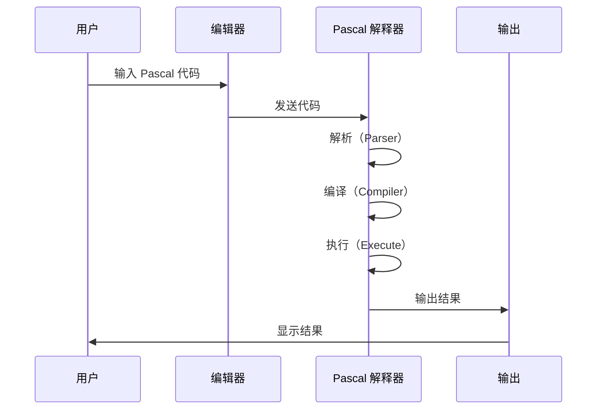

# Pascal.org Editor：从入门到精通 — 浏览器端 Pascal 编程学习平台

> **目标读者**：编程初学者、计算机专业学生、Pascal 语言学习者、教育工作者
> **前置知识**：无（入门课程不需要任何基础）
> **预计学习时间**：1-2 小时（入门），根据课程内容而定

---

## 🎯 学习目标

完成本文档后，你将掌握：

- ✅ 理解 Pascal.org Editor 的定位与功能
- ✅ 掌握使用 Pascal.org 进行在线编程的方法
- ✅ 从零开始学习 Pascal 编程基础
- ✅ 利用平台资源完成编程入门到进阶
- ✅ 理解 Web 端 Pascal 解释器的工作原理
- ✅ 了解项目目录结构和技术栈
- ✅ 为开源项目做贡献

---

## 一、项目概述与背景

### 1.1 什么是 Pascal.org Editor？

Pascal.org Editor（[pascalorg/editor](https://github.com/pascalorg/editor)）是 Pascal.org 平台的**在线 Pascal 编辑器和学习环境**，让你可以直接在浏览器中编写、编译和运行 Pascal 代码，无需安装任何开发环境。

**核心定位**：为零基础学习者提供零门槛的 Pascal 编程入门体验。


### 1.2 项目数据

| 指标 | 数值 |
|------|------|
| GitHub Stars | **18** |
| GitHub Forks | **2** |
| 许可证 | 未指定 |
| 主要语言 | JavaScript 100% |
| 平台 | pascal.org |

### 1.3 Pascal 语言简介

Pascal 是一种结构化编程语言，由 Niklaus Wirth 于 1970 年设计，最初用于教学目的。

| 特性 | 说明 |
|------|------|
| **语法严谨** | 适合初学者培养良好的编程习惯 |
| **强类型** | 编译时检查类型错误 |
| **结构化** | 支持过程、函数、记录等结构 |
| **可读性强** | 代码清晰易懂 |

### 1.4 Pascal.org 平台资源

| 资源 | 说明 |
|------|------|
| **pascal.org** | 主站，提供编程学习资源 |
| **resources.pascal.org** | 学习资源下载 |
| **Pascal.org Editor** | 在线编程编辑器 |

---

## 二、快速开始：5 分钟入门

### 2.1 访问编辑器

1. 打开浏览器
2. 访问 **pascal.org** 或直接使用 Pascal.org Editor
3. 开始编写代码

### 2.2 第一个程序

```pascal
program HelloWorld;

begin
    writeln('Hello, World!');
    writeln('Welcome to Pascal Programming!');
end.
```

**运行结果**：
```
Hello, World!
Welcome to Pascal Programming!
```

### 2.3 基本程序结构

每个 Pascal 程序都遵循以下结构：

```pascal
program ProgramName;  { 程序声明 }

{ 全局变量声明 }
var
    x: integer;
    y: real;

begin  { 程序开始 }
    { 程序代码 }
end.  { 程序结束 }
```

### 2.4 常用命令

| 命令 | 说明 |
|------|------|
| `writeln()` | 输出并换行 |
| `write()` | 输出不换行 |
| `readln()` | 读取输入 |
| `write()` | 输出不换行 |

---

## 三、Pascal 语法基础

### 3.1 数据类型

| 类型 | 说明 | 示例 |
|------|------|------|
| **integer** | 整数 | `x: integer;` |
| **real** | 浮点数 | `y: real;` |
| **char** | 字符 | `c: char;` |
| **string** | 字符串 | `s: string;` |
| **boolean** | 布尔值 | `flag: boolean;` |

### 3.2 变量声明

```pascal
var
    age: integer;           { 整数 }
    price: real;             { 浮点数 }
    name: string;             { 字符串 }
    isStudent: boolean;       { 布尔值 }
    grade: char;              { 字符 }
```

### 3.3 赋值语句

```pascal
var
    x: integer;

begin
    x := 10;      { 赋值 }
    x := x + 5;   { 数学运算 }
end;
```

### 3.4 运算

#### 算术运算

| 运算符 | 说明 | 示例 |
|--------|------|------|
| `+` | 加 | `a + b` |
| `-` | 减 | `a - b` |
| `*` | 乘 | `a * b` |
| `/` | 除（浮点） | `a / b` |
| `div` | 整除 | `a div b` |
| `mod` | 取余 | `a mod b` |

#### 布尔运算

| 运算符 | 说明 |
|--------|------|
| `and` | 逻辑与 |
| `or` | 逻辑或 |
| `not` | 逻辑非 |

### 3.5 条件语句

#### if 语句

```pascal
var
    score: integer;

begin
    score := 85;

    if score >= 60 then
        writeln('Pass!')
    else
        writeln('Fail!');
end;
```

#### if-else-if 语句

```pascal
var
    grade: char;

begin
    grade := 'A';

    if grade = 'A' then
        writeln('Excellent!')
    else if grade = 'B' then
        writeln('Good!')
    else if grade = 'C' then
        writeln('Average')
    else
        writeln('Need improvement');
end;
```

### 3.6 循环语句

#### for 循环

```pascal
var
    i: integer;

begin
    for i := 1 to 10 do
        writeln('Count: ', i);
end;
```

#### while 循环

```pascal
var
    i: integer;

begin
    i := 1;
    while i <= 10 do
    begin
        writeln('Count: ', i);
        i := i + 1;
    end;
end;
```

#### repeat-until 循环

```pascal
var
    i: integer;

begin
    i := 1;
    repeat
        writeln('Count: ', i);
        i := i + 1;
    until i > 10;
end;
```

---

## 四、函数与过程

### 4.1 函数（Function）

函数有返回值：

```pascal
function Add(a, b: integer): integer;
begin
    Add := a + b;  { 或 result := a + b; }
end;

var
    sum: integer;

begin
    sum := Add(3, 5);
    writeln('3 + 5 = ', sum);
end;
```

### 4.2 过程（Procedure）

过程无返回值：

```pascal
procedure PrintHello;
begin
    writeln('Hello!');
end;

begin
    PrintHello;  { 调用过程 }
end;
```

### 4.3 参数传递

```pascal
{ 值传递 }
procedure ByValue(x: integer);
begin
    x := x + 10;  { 不会影响原变量 }
end;

{ 引用传递 }
procedure ByRef(var x: integer);
begin
    x := x + 10;  { 会影响原变量 }
end;
```

---

## 五、复杂数据类型

### 5.1 数组（Array）

```pascal
var
    scores: array[1..5] of integer;
    i: integer;

begin
    scores[1] := 90;
    scores[2] := 85;
    scores[3] := 78;
    scores[4] := 92;
    scores[5] := 88;

    for i := 1 to 5 do
        writeln('Score ', i, ': ', scores[i]);
end;
```

### 5.2 记录（Record）

```pascal
type
    TStudent = record
        name: string[50];
        age: integer;
        grade: char;
    end;

var
    student: TStudent;

begin
    student.name := 'John Doe';
    student.age := 20;
    student.grade := 'A';

    writeln('Name: ', student.name);
    writeln('Age: ', student.age);
    writeln('Grade: ', student.grade);
end;
```

### 5.3 字符串（String）

```pascal
var
    s1, s2: string;

begin
    s1 := 'Hello';
    s2 := 'World';

    writeln(s1 + ' ' + s2);  { 连接字符串 }
    writeln('Length: ', length(s1));  { 长度 }
end;
```

---

## 六、文件操作

### 6.1 写入文件

```pascal
var
    f: text;

begin
    assign(f, 'output.txt');
    rewrite(f);
    writeln(f, 'Hello, File!');
    close(f);
    writeln('File written successfully!');
end;
```

### 6.2 读取文件

```pascal
var
    f: text;
    line: string;

begin
    assign(f, 'input.txt');
    reset(f);
    while not eof(f) do
    begin
        readln(f, line);
        writeln(line);
    end;
    close(f);
end;
```

---

## 七、示例程序

### 7.1 计算器

```pascal
program Calculator;

var
    a, b: real;
    op: char;
    result: real;

begin
    writeln('Simple Calculator');
    writeln('Enter expression (e.g., 10 + 5):');

    readln(a, op, b);

    case op of
        '+': result := a + b;
        '-': result := a - b;
        '*': result := a * b;
        '/': if b <> 0 then result := a / b
             else writeln('Division by zero!');
    else
        writeln('Invalid operator!');
    end;

    if (op = '+') or (op = '-') or (op = '*') or (op = '/') then
        writeln('Result: ', a, ' ', op, ' ', b, ' = ', result:0:2);
end.
```

### 7.2 猜数字游戏

```pascal
program GuessNumber;

var
    secret, guess: integer;

begin
    randomize;
    secret := random(100) + 1;  { 1-100 随机数 }

    writeln('Guess the number (1-100)!');
    writeln('Enter your guess:');

    repeat
        readln(guess);
        if guess > secret then
            writeln('Too high! Try again:')
        else if guess < secret then
            writeln('Too low! Try again:')
        else
            writeln('Congratulations! You got it!');
    until guess = secret;
end.
```

### 7.3 冒泡排序

```pascal
program BubbleSort;

var
    arr: array[1..5] of integer;
    i, j, temp: integer;

begin
    arr[1] := 64;
    arr[2] := 34;
    arr[3] := 25;
    arr[4] := 12;
    arr[5] := 22;

    writeln('Before sorting:');
    for i := 1 to 5 do
        write(arr[i], ' ');
    writeln;

    { 冒泡排序 }
    for i := 1 to 4 do
        for j := 1 to 5-i do
            if arr[j] > arr[j+1] then
            begin
                temp := arr[j];
                arr[j] := arr[j+1];
                arr[j+1] := temp;
            end;

    writeln('After sorting:');
    for i := 1 to 5 do
        write(arr[i], ' ');
    writeln;
end.
```

---

## 八、技术架构解析

### 8.1 目录结构

```
pascalorg/editor/
├── .github/                # GitHub Actions 配置
├── assets/                 # 静态资源
│   ├── css/              # 样式文件
│   ├── fonts/            # 字体文件
│   ├── images/           # 图片资源
│   └── js/               # JavaScript 文件
├── node_modules/         # 依赖包
├── pages/                # Next.js 页面
│   ├── _components/     # 页面组件
│   ├── _document.tsx   # HTML 文档
│   ├── index.tsx       # 首页
│   └── org/
│       └── [org]/
│           └── [repo]/
│               └── [version].tsx
├── components/           # 可复用组件
├── public/               # 公开静态文件
├── styles/               # 全局样式
├── scripts/              # 构建脚本
├── next.config.js       # Next.js 配置
├── package.json         # 依赖配置
└── tsconfig.json        # TypeScript 配置
```

### 8.2 技术栈

| 层级 | 技术 | 说明 |
|------|------|------|
| 框架 | Next.js | React SSR 框架 |
| 语言 | TypeScript | 类型安全 |
| UI | React | 组件化 |
| 样式 | CSS | 样式表 |
| 运行时 | JavaScript | 浏览器执行 |

### 8.3 工作原理

Pascal.org Editor 在浏览器中运行 Pascal 代码，核心流程：



---

## 九、Web 端 Pascal 解释器原理

### 9.1 解释器架构

Pascal.org Editor 使用的解释器通常包含以下模块：

| 模块 | 职责 |
|------|------|
| **词法分析器（Lexer）** | 将代码分解为 Token |
| **语法分析器（Parser）** | 构建抽象语法树（AST） |
| **语义分析器** | 类型检查、作用域分析 |
| **解释器（Interpreter）** | 执行 AST |
| **标准库** | 提供 writeln、readln 等内置函数 |

### 9.2 词法分析

```pascal
writeln('Hello');
```

Token 序列：
| Token | 类型 |
|-------|------|
| writeln | 标识符 |
| ( | 左括号 |
| 'Hello' | 字符串 |
| ) | 右括号 |
| ; | 分号 |

### 9.3 语法树

```
Program
└── CallStatement: writeln
    └── Argument: 'Hello'
```

---

## 十、开发扩展

### 10.1 克隆项目

```bash
git clone https://github.com/pascalorg/editor.git
cd editor
```

### 10.2 安装依赖

```bash
npm install
# 或
yarn install
```

### 10.3 启动开发服务器

```bash
npm run dev
# 或
yarn dev
```

访问 http://localhost:3000

### 10.4 构建生产版本

```bash
npm run build
npm run start
```

### 10.5 贡献代码

1. Fork 仓库
2. 创建分支：`git checkout -b feature/new-feature`
3. 修改代码
4. 提交：`git commit -m "Add new feature"`
5. 推送：`git push origin feature/new-feature`
6. 创建 Pull Request

---

## 十一、使用场景

### 11.1 编程入门教学

Pascal 语言语法严谨、类型安全，非常适合：
- 计算机专业大一课程
- 编程入门培训
- 算法与数据结构学习

### 11.2 快速原型验证

无需配置环境，直接在浏览器中验证 Pascal 算法逻辑。

### 11.3 考试与练习

教师可以使用 Pascal.org 创建在线考试和练习系统。

---

## 十二、常见问题

### Q1: Pascal 和 C 语言有什么区别？

| 特性 | Pascal | C |
|------|-------|---|
| 类型检查 | 强类型 | 弱类型 |
| 语法风格 | 结构化 | 灵活 |
| 布尔表达 | 内置 | 整数替代 |
| 字符串 | 独立类型 | 字符数组 |
| 用途 | 教学 | 系统/应用 |

### Q2: Pascal 还能用于实际开发吗？

可以。Pascal 的现代版本如 Free Pascal 和 Delphi 仍被用于：
- Windows 桌面应用开发
- 数据库应用
- 网络编程

### Q3: 如何调试 Pascal 程序？

```pascal
begin
    writeln('Step 1');
    writeln('Step 2');
    { 使用 writeln 输出中间变量 }
    writeln('Debug: x = ', x);
end;
```

### Q4: Pascal.org Editor 支持其他语言吗？

目前主要支持 Pascal 语言。具体多语言支持情况请参考官网。

---

## 十三、总结

Pascal.org Editor 是一款简洁高效的在线 Pascal 学习工具：

| 优势 | 说明 |
|------|------|
| 🎯 **零门槛** | 无需安装，直接浏览器编程 |
| 📚 **专注教学** | Pascal 语言适合入门 |
| ⚡ **即时反馈** | 实时编译运行 |
| 📱 **响应式** | 支持移动设备 |
| 🔓 **开源** | 可自由贡献改进 |

**下一步推荐**：

1. 访问 [pascal.org](https://pascal.org) 开始学习
2. 完成第一个 "Hello World" 程序
3. 学习 Pascal 语法基础
4. 尝试编写简单算法（如排序）

---

**文档信息**

- 难度：⭐（入门）
- 类型：完整教程
- 更新日期：2026-03-31
- 预计学习时间：1-2 小时（入门）
- GitHub：https://github.com/pascalorg/editor
- 官网：https://pascal.org

🦞 由钳岳星君撰写 | 项目源码：https://github.com/pascalorg/editor