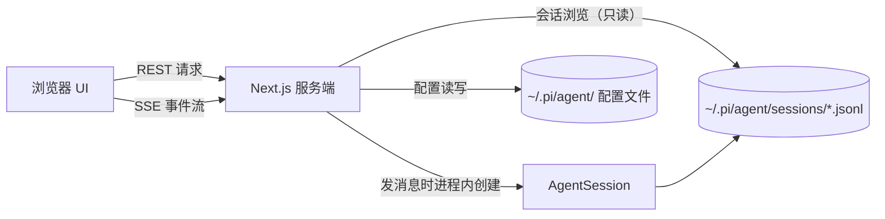

## 项目定位

用 pi 编程智能体做工日常开发，会话记录都以 JSONL 文件形式落在 `~/.pi/agent/sessions/` 目录下。想在终端历史里翻回上周某次调试对话，并不轻松。Pi Web 解决的就是这个问题：它把这份本地数据搬进浏览器，提供会话浏览、实时对话、模型配置、文件预览和工作区终端。

值得先说清的是，Pi Web 不自带智能体，也不另建存储。它读的是 pi 的会话与配置文件，写的也是。这个定位决定了它的价值与边界：pi 用户多了一个可视工作台，数据与 CLI 完全互通；不用 pi 的人，它没有用武之地。

[Pi Web](https://github.com/agegr/pi-web) 由 agegr 开发，TypeScript 编写，MIT 许可。截至 2026-10-01，GitHub 上有 6,981 Star、1,017 forks，最新版本 v0.9.3（2026-09-23 发布），迭代非常快。

它驱动的 [pi](https://github.com/earendil-works/pi) 是 Mario Zechner（badlogic）发起的 Pi Agent Harness 项目，现托管于 earendil-works 组织（原 badlogic/pi-mono，旧链接自动重定向）。pi 本体是一套 monorepo：统一多供应商 LLM API、带工具调用的 Agent 运行时、终端 UI 库，以及自扩展的编码代理 CLI，2026-10-01 读数 110,766 Star。Pi Web 通过 `@earendil-works/pi-coding-agent` 等 SDK 包在进程内驱动 pi，上游 pi 更新后，Pi Web 会跟进同步依赖。

没有安装过 pi，也可以先在[官方在线演示](https://agegr.github.io/pi-web/)里体验：完整的 Pi Web 界面直接跑在浏览器中，带示例会话、文件和模型，回复都是预设内容，不调用任何模型。

## 系统总览

Pi Web 是一个 Next.js 应用，所有逻辑都跑在本机。系统里只有三个角色：



按功能分，它有三条主线：

| 主线 | 浏览器里做什么 | 背后发生什么 |
|------|--------------|-------------|
| 会话浏览 | 按项目查看、搜索、导出对话 | 服务端直接读 `.jsonl` 文件，只读，不创建智能体会话 |
| 代理对话 | 发消息、看流式回复和工具调用 | 进程内创建 AgentSession，经 SSE 推送事件 |
| 配置与资源 | 管理模型、技能、插件 | 直写 `~/.pi/agent/` 下 pi 自己的配置文件 |

三条主线共用同一份磁盘数据，这是理解 Pi Web 的关键：浏览器里改的每一项配置，pi 命令行立刻可见；CLI 里产生的每个会话，刷新页面就能看到。

## 会话工作区

主界面按项目分组展示会话列表，列表上标有运行状态、上下文占用、花费和压缩信息。会话完整保留结构化的 Markdown 渲染、工具调用记录和智能体响应，比终端里的原始输出易读得多。

几个实用功能：

- **会话全文搜索**（v0.9.0 起）：输入关键词查看命中片段，直接跳转到具体消息。
- **两种分支方式**：**新会话**从较早的消息创建独立会话文件；**从此处编辑**在当前会话内创建分支。前者适合"换个思路重试"，后者适合在原上下文里修正方向。
- **选中即问**（v0.9.0 起）：选中助手回复中的文本，可以在当前对话继续追问，或从该位置创建带引用的新分支。
- **重命名、导出与自动命名**：会话可导出为 HTML 存档，标题也支持自动生成。
- **顶部状态栏**：上下文使用量、费用、压缩状态和系统提示词详情一目了然。

## 项目文件工具

左侧是文件树，右侧是多标签预览面板，支持源码、Markdown、图片、音频、PDF、DOCX 和视频（v0.9.0 起），文件变化后自动刷新。面板里还能查看 Git Diff，智能体改了哪些文件、改了什么，不用切回编辑器。通过 `@` 提及可以把文件引用插进对话。

访问有明确边界：文件浏览器只覆盖在 Pi Web 中选中的工作目录，以及它已知的会话与项目根目录，不是通用文件系统浏览器。这既是安全设计，也意味着想看别的目录，得先在项目选择器里打开它。

## 模型与资源管理

Models 面板接管了 pi 的大部分配置工作：

- **Provider 登录与 API Key**：支持 OAuth 设备码流程和 API Key 两种方式，凭据存进 pi 自己的认证存储，CLI 与 Pi Web 共用。
- **模型配置**：直接读写 `~/.pi/agent/models.json`，可测试模型连通性，也能从模型目录按需刷新上游列表（v0.9.2 起）。单个模型的启用/停用开关同样在 v0.9.2 落地，不必再手动编辑配置文件。
- **技能（Skills）**：查看已加载技能、关闭模型自动调用，还能通过 `npx skills add` 安装新技能，或在 skills.sh 上搜索。
- **插件包**：管理 pi 插件，带版本检查、单项与批量更新（v0.9.0 起）。
- **用量配额**：查看各 Provider 的用量（v0.9.1 起）。

## 终端与 Worktree

v0.9.0 在文件面板里加了工作区终端：基于 node-pty 的真实 PTY，不是模拟的命令回显。工程细节做得扎实——输出经 SSE 传输，断线重连只补缺失的部分；服务端为每个终端保留最多 128 KiB 历史输出；隐藏面板或切换标签只断开浏览器连接，不杀进程，回来接着用。`sessionStorage` 还能在页面刷新后恢复终端标签。

Git worktree 切换器出现在侧边栏（仅当选中的目录是仓库根目录时）。它解决的是多分支并行的问题：从菜单创建的 worktree 会落在 `<仓库>-worktrees/<分支名>` 下，同一仓库的所有 worktree 会话在侧边栏里归为一组。切换 worktree 影响的是新会话和文件浏览器；打开已有会话时，工作目录自动回到该会话自己的 checkout，不会串。

## 一次真实任务的流转

把机制串起来看一个场景：上周用 pi 排查过一个内存泄漏，现在想从当时的关键结论继续。

1. 打开 Pi Web，在侧边栏按项目找到那次会话；记不清名字就在搜索框里输关键词，从命中片段直接跳到那条消息。
2. 在关键结论下方选择"新会话"，Pi Web 复制该消息之前的上下文，生成一个独立的 `.jsonl` 文件，原会话原封不动。
3. 输入第一条消息，服务端在进程内创建 AgentSession，流式回复和工具调用经 SSE 实时回到浏览器，顶栏同步显示上下文占用和费用。
4. 智能体修改代码时，在文件面板里看 Git Diff 确认改动范围；要跑测试，开一个工作区终端，切走改文档再回来，进程还在。
5. 会话文件落回 `sessions/` 目录。第二天在终端里运行 `pi`，这份上下文照样可用——两个界面，同一份数据。

## 安装与运行

要求 Node.js 22.19.0 或更高版本。免安装直接运行：

```bash
npx @agegr/pi-web@latest
```

或全局安装：

```bash
npm install -g @agegr/pi-web@latest
pi-web
```

服务就绪后自动打开 `http://127.0.0.1:30141`，默认仅监听本机回环地址。更新时用 `Ctrl+C` 停掉进程，重新执行同一条安装命令即可。

### 常用选项

命令行参数优先于对应的环境变量。`pi-web --help` 可打印全部启动选项。

```bash
pi-web -p 8080 -H 0.0.0.0 --no-open

# 环境变量等效写法
PORT=8080 pi-web
PI_WEB_HOSTNAME=0.0.0.0 pi-web
PI_WEB_NO_OPEN=1 pi-web
```

| 参数或环境变量 | 用途 | 默认值 |
|---------------|------|--------|
| `--port`、`-p` 或 `PORT` | 服务端口 | `30141` |
| `--hostname`、`-H` 或 `PI_WEB_HOSTNAME` | 监听主机名 | `127.0.0.1` |
| `--no-open` 或 `PI_WEB_NO_OPEN=1` | 不自动打开浏览器 | 自动打开 |
| `PI_WEB_PASSWORD` | 启用浏览器密码登录 | 不启用认证 |
| `PI_WEB_ALLOWED_HOSTS` | 额外允许的代理或自定义主机名，逗号分隔，精确匹配 | 未设置 |
| `PI_WEB_IDLE_TIMEOUT_MS` | 会话空闲回收超时（毫秒），`0` 为禁用（v0.9.0 起） | `600000`（10 分钟） |
| `PI_WEB_SKIP_VERSION_CHECK=1` | 关闭更新检查 | 未设置 |

### HTTP 代理

服务端的模型和 API 请求遵循标准代理环境变量：

```bash
HTTP_PROXY=http://127.0.0.1:7890 \
HTTPS_PROXY=http://127.0.0.1:7890 \
NO_PROXY=localhost,127.0.0.1 \
npx @agegr/pi-web@latest
```

Windows 下在 PowerShell 里用 `$env:HTTP_PROXY = "..."` 设置同样的三个变量。

## 安全注意事项

Pi Web 能驱动一个拥有完整文件与进程权限的编码智能体，暴露面要认真对待：

- 设置 `PI_WEB_PASSWORD` 后，浏览器访问需要密码登录，API 客户端则使用用户名为 `pi` 的 Basic Auth。密码以明文传输，公网裸奔 HTTP 不可接受，远程访问应走 HTTPS 反向代理或可信 VPN。
- 反向代理转发的外部主机名与监听地址不一致时，把确切域名加进 `PI_WEB_ALLOWED_HOSTS`。这个白名单只影响 Host 校验，不改变实际监听地址。
- 版本要跟紧：v0.9.2 的发布公告明确提示，旧版依赖的 Next.js 存在无需登录即可在服务器上执行代码的漏洞，可从公网访问的部署应尽快升级到 v0.9.2 或更新版本。
- 默认只监听 `127.0.0.1`，这个默认值值得保留；绑到 `0.0.0.0` 意味着局域网内任何人都能驱动你的智能体。

## 数据与文件结构

Pi Web 不自建数据库，一切以 pi 的本地文件为准：

| 数据 | 位置 | 说明 |
|------|------|------|
| 会话文件 | `~/.pi/agent/sessions/<编码后的项目路径>/<时间戳>_<uuid>.jsonl` | 按项目路径编码存放，按时间戳排列 |
| 模型配置 | `~/.pi/agent/models.json` | 自定义 Provider 与模型定义 |
| 设置与开关 | `~/.pi/agent/settings.json` | 模型启用开关等（v0.9.2 起由界面写入） |
| 数据目录重定向 | `PI_CODING_AGENT_DIR` 环境变量 | 指向其他 pi 数据目录 |

文件读写都在这份目录约束之内，注意 Pi Web 需要能读到会话中记录过的工作目录，跨容器或跨用户共享会话时，让两者跑在同一个文件系统环境里。

## 适用边界与采用建议

**适合**：

- 把 pi 当日常编码工具，需要一个比终端历史好用的会话管理界面
- 同时推进多个项目或多个 worktree 分支，需要对比和延续不同会话
- 想在图形界面里完成模型、技能、插件配置，不想手编 JSON
- 需要盯着智能体干活：Git Diff、文件预览、工作区终端都在同一个页面里

**不适合**：

- 不使用 pi 的团队——Pi Web 是 pi 生态的界面层，不独立工作
- 需要多用户协作或权限隔离的场景——它默认是单用户本地工具，认证只有一道密码

采用节奏上，建议先在本地以默认回环地址跑起来，熟悉会话工作区和模型配置；确实需要局域网协作时，再绑非回环地址并强制密码；公网访问放到最后，且必须 HTTPS 反代加强密码，并把版本保持最新。迭代速度是它目前最确定的事实——三个月内从 v0.8.7 走到 v0.9.3，功能面几乎每两三周就变一次，这也意味着现在下任何结论都该留出余地：跟着 release notes 走，比跟着任何一篇解读文走都可靠，包括本文。

---

*项目地址：[github.com/agegr/pi-web](https://github.com/agegr/pi-web) · 在线演示：[agegr.github.io/pi-web](https://agegr.github.io/pi-web/) · 许可证：MIT · 数据读数截至 2026-10-01*
