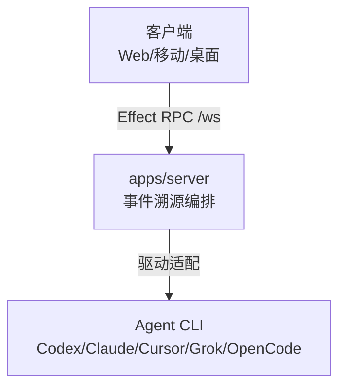

# T3 Code：Theo 的 Agent 控制台，远程驾驭 Claude Code 与 Codex

不少 AI 编程 agent（智能体）都有一个不足：它们跑在你电脑的终端里，你就得坐在终端前。Claude Code 在跑一个跨文件重构时，你出去吃顿饭，回来发现它停在某个审批点等你——这半小时本不必守在屏幕前。T3 Code 解决了这个问题：agent 的进程仍在你的机器上，操控面搬到手机、浏览器和桌面，人不必守在电脑前。

T3 Code 是 agent 套壳，它不跑模型、不做代码生成，只管理你已安装并认证的 agent 进程。你可以坐在沙发上，偶尔低头看一眼进度，随手指挥 agent 干活。

T3 Code 想做的是最好用的 agent 开发体验——Codex 桌面应用、Conductor、Claude Desktop、Cursor Glass 这些现成方案，都没到它的标准。
它的设计原则可归纳为三条：性能达标、远程原生、透明度可验证——仓库采用 MIT 许可证，提供 Windows、macOS、Linux 各平台安装包，遥测仅在本地执行资源监控，不上传任何数据。

## 目录

**实践篇**

- 一、它解决的是什么
- 二、与同类工具的对比
- 三、快速上手
- 四、常见问题 FAQ
- 五、适用边界与采用建议

**学习篇**

- 六、系统地图
- 七、核心机制
- 八、远程访问：四种连接目标
- 九、示例：一次 bug 修复如何流过系统
- 十、学习目标
- 十一、自测题
- 十二、进阶方向
- 十三、源码开发：从源码跑起来，自己改
- 十四、参考资料

## 一、它解决的是什么

| 维度 | 数据 |
|------|------|
| 仓库 | pingdotgg/t3code |
| Stars | 17,600+（2026-08） |
| Forks | 4,000+ |
| 语言 | TypeScript（Effect 生态） |
| 许可证 | MIT |
| 作者 | Theo Browne（pingdotgg） |

项目创建于 2026 年 2 月 8 日，半年间 Stars 突破 17,000。增长速度引人注目，一方面来自 Theo 本人的社区号召力，另一方面则源于仓库本身的几项关键举措——MIT 许可证、零遥测上传、全平台安装包、`npx t3@latest` 免安装体验——共同压低了体验门槛，新用户从知晓到跑通几乎没有阻滞。活跃 Issue 数亦超过 1,000。

## 二、与同类工具的对比

Agent 远程控制与编排并非 T3 Code 独有能力。以下将其与几款常被并列提及的工具加以对照（Parallel Code、Superset 的特性按其公开产品信息归纳，细节或随版本演进）：

| 特性 | T3 Code | Parallel Code | Superset |
|------|---------|---------------|----------|
| 多 Agent | Codex/Claude/Cursor/Grok/OpenCode | 通用 | 通用 |
| 远程控制 | ✅ 移动/Web/桌面 | ❌ 仅桌面 | ❌ 仅桌面 |
| 会话隔离 → Git worktree | ✅ | 独立 workspace | 未披露 |
| 一键 PR | ✅ 自动变更日志 | 未披露 | 未披露 |
| 许可证 | MIT | 不开源 | Elastic 2.0（source-available） |

三者的取舍方向判然有别：T3 Code 定位于远程控制与多 Agent 统一入口；Superset 取「编辑器形态 + 高并发度」路线；Parallel Code 则强调每个 Agent 独立工作空间。对脱离主机操作 Agent 有刚性需求的场景，T3 Code 是当前最为直接的选项；若需要同时运行大量 Agent，Superset 的方向可能更贴合需求。

T3 Code 与 Cursor、Copilot 亦不属同一品类。Cursor 是以 AI 为核心的编辑器，Copilot 是嵌于 IDE 内的补全插件，两者均根植于编辑生态；T3 Code 则独立于编辑器之外，管理的是完整的 Agent 会话生命周期——它不绑定任何编辑器，即便仅有终端亦可运行。因此它们之间是互补关系，而非替代关系。

## 三、快速上手

### 基础安装

T3 Code 提供两种启动路径：免安装 CLI 体验适合快速验证，桌面应用适合长期使用。

**免安装 CLI 体验**（要求 Node.js 22.16+ / 23.11+ / 24.10+）：

```bash
# 启动本地服务器并打开 Web 控制台
npx t3@latest

# 完整命令行参数参考
npx t3@latest --help
```

**前置条件**：至少安装并认证一个受支持的 Agent 提供方，确认其在终端可正常运行。T3 Code 不产生 Agent 能力，只调用本机已有的会话。各提供方的认证命令如下：

- Claude Code：`claude auth login`
- Codex：`codex login`
- Cursor CLI：`agent login`
- Grok Build：`grok login`
- OpenCode：`opencode auth login`

**桌面应用安装**（各平台包管理器）：

| 平台 | 安装命令 |
|------|----------|
| Windows | `winget install T3Tools.T3Code` |
| macOS | `brew install --cask t3-code` |
| Arch Linux（AUR） | `yay -S t3code-bin` |

或直接从 GitHub Releases 下载安装包。远程访问的完整配置参见官方文档 remote-access.md，后文「八、远程访问」亦会从连接层展开机制说明。

### 实战：手机从外网连回家中机器

后文「八、远程访问」一节将从连接层视角阐释「链路如何建立」，覆盖四种连接目标：本地主连接、Bearer 配对、Relay 中继、SSH。本节切换到使用者视角，聚焦一个更具体的问题：手机在蜂窝网络或公司 Wi‑Fi 等外部环境下，如何安全、稳定地接入家中机器上的 T3 Code。

首先明确两套分类体系的边界：

- **技术分类**（后文展开）：按 WebSocket 链路的建立方式划分，关注「这条连接怎么建」。
- **操作分类**（本节展开）：按使用者的接入手段划分，关注「你用什么方式连进去」。

按操作分类，实际可执行的路径共有四条：Tailscale 组网、Relay 中继、SSH 远程环境、托管配对。

一个需要提前说明的问题：Tailscale 并非后文技术分类中的第五种连接目标，与本节将其单独列为路径并不矛盾。原因在于——Tailscale 仅是 HTTPS 端点的发布载体，手机端最终仍通过标准 Bearer 配对链路接入；是否部署 Tailscale 属于使用者在连接层之上的独立选择，因此在操作分类中单列，同时也是本节最推荐的方案。

核心取舍可提前明确：**日常场景优先采用 Tailscale，中继（Relay）作为不可用时的兜底方案**；SSH 与托管配对仅适用于特定场景。下文将先厘清各路径背后的概念，再给出横向对比、组合建议与逐步操作指南。

#### 认识 Tailscale（新手必读）

Tailscale 并非 T3 Code 的组成部分，而是一款独立的组网工具；T3 Code 仅利用其能力实现高质量远程接入。鉴于两者名称首次接触时易产生混淆，本节先明确其定位与核心属性：

- **产品定位**：基于 WireGuard 的组网工具。将手机与家中机器加入同一私人虚拟网络（tailnet）后，两台设备即可像处于同一局域网般直接互访——即便一方在移动蜂窝网络下，另一方位于无可直接路由公网 IP 的 NAT 之后。
- **与 VPN 代理的区别**：Tailscale 仅在特定设备之间建立加密直连通道，不将全量流量转发至第三方出口服务器（仅在极少数 NAT 打洞失败时通过内置 DERP 中继兜底）。因此，启用 Tailscale 不影响设备的常规互联网访问，仅在访问 tailnet 内节点时走加密隧道。
- **T3 Code 推荐的理由**：它一次性提供远程控制场景最需要的三项基础能力——稳定可达的寻址、原生 HTTPS 端点、无需向公网暴露端口。后文涉及 `--tailscale-serve` 参数时将会看到，Tailscale 还可将本机服务直接发布为 `https://机器名.tailnet名.ts.net/` 格式的 HTTPS 地址。

**注册与安装步骤：**

1. **账号注册**：直接使用 GitHub / Google / Microsoft 账号登录，或通过邮箱注册。免费版支持 3 用户、100 台设备，个人使用无需付费。
2. **家中机器（以 macOS 为例）**：访问 tailscale.com/download 下载桌面客户端，或通过 Homebrew 执行 `brew install --cask tailscale`，安装后登录上述账号。
3. **移动设备（iOS / Android）**：在 App Store 或 Google Play 搜索「Tailscale」安装，登录与家中机器**相同的账号**——两台设备登录同一账号后，将自动加入同一 tailnet。

**稳定性和维护：**

- 网络：底层是 WireGuard，T3 Code 官方文档专门推荐 tailnet 就是因为稳定。它自动处理 NAT 穿透——两台设备只要能上网就能连上，即使家中机器没有公网 IP。NAT 穿透失败（极少见）时，Tailscale 用内置的 DERP 中继兜底，不会断连。
- 维护：装好后作为系统服务开机自启、自动重连，不需要手动重启，平时感觉不到它的存在。装一次，长期不用管。

**验证是否就绪：** 在终端跑 `tailscale status`，看到两台设备都在列表里、状态是 Connected，就说明组网成功，可以进入下面的 T3 Code 配对步骤了。

#### 四种方案横评

| 维度 | Tailscale | Relay 中继 | SSH 远程环境 | 托管配对 |
|------|-----------|-----------|--------------|----------|
| 上手成本 | 两台设备各装一个客户端，扫码即用 | 一条命令，零安装 | 家机需开 SSH 服务并配好登录 | 需自备 HTTPS 入口 |
| 功能 | 稳定地址 + 可选 HTTPS，App 与网页通吃 | 只解决「连上」，无附加能力 | 桌面 App 顺手管理远端机器 | 仅网页版配对 |
| 网络强壮性 | WireGuard 直连，打洞失败自动回退 DERP 中继，弱网稳定 | 依赖 Cloudflare 隧道，受第三方节点影响 | 依赖家宽上行与 SSH 配置质量 | 依赖你自己的 HTTPS 隧道质量 |
| 安全 | 端到端加密，服务不暴露公网 | 流量经第三方隧道中转，依赖其可用性 | 需暴露 SSH 端口，攻击面最大 | 配对 token 落在 URL 里 |
| 手机端要求 | Tailscale + T3 Code 两个 App | 只装 T3 Code App | 由桌面 App 引导，手机不直接参与 | 浏览器即可 |

逐条拆开看：

- **Tailscale**：两端加入同一个 tailnet 后，T3 server 只监听 tailnet 私有地址，公网扫描不到，安全层级最高；WireGuard 在传输层加密，手机切 4G/5G/Wi-Fi 不断线；缺点是两台设备都要装客户端、依赖 Tailscale 账号。**适合绝大多数人，官方也把它列为首选。**
- **Relay 中继**：`t3 connect` 一条命令穿透 NAT，不需要账号和安装；代价是数据经 Cloudflare 隧道转发、依赖第三方服务，多一跳网络、延迟略高。**适合不想装 Tailscale 的人，或 Tailscale 被网络环境限制时兜底。**
- **SSH 远程环境**：桌面 App 帮你登录远端、启动 T3 server 并转发端口，适合「用桌面 App 管理一台远程机器」；但它是桌面功能，手机 App 无法发起，对「手机直连家机」这个目标并不直接解决。**适合已有 SSH 基础设施、主要用桌面端的人。**
- **托管配对**：`app.t3.codes` 网页版直连你的后端，前提是后端能被浏览器经 HTTPS/WSS 访问——也就是说你得先有自己的 HTTPS 入口（比如 Cloudflare Tunnel 配域名）。**适合已经有 HTTPS 隧道的人，其余场景绕远了。**

#### 最优组合：Tailscale 为主，Relay 兜底

两者互补：Tailscale 给到「不暴露 + 强加密 + 弱网稳」，四条路里最省心；万一在公司网络、酒店等环境里 Tailscale 的 UDP 打洞被拦，一条 `npx t3 connect` 就能临时顶上，不用改任何其他配置。SSH 和托管配对只在它们对应的特定场景里才划算，日常不必考虑。

#### 方案一：Tailscale（首选）

前提：

- 家中机器和手机均安装 Tailscale，使用同一账号登录并加入同一 tailnet
- 手机端安装 T3 Code App（App Store 或 Google Play 搜索「T3 Code」）——此为移动端必备，无 CLI 替代
- 家中机器已安装并认证至少一个 Agent 提供方（参见上文「基础安装」）
- 家中机器运行 T3 Code 后端，可选用**桌面 App** 或 **CLI 无界面服务器（Headless Server）** 两种路径，下文对两者做横向对比并给出 CLI 安装说明

**家中机器：桌面 App vs CLI 横向对比**

T3 Code 在服务端提供两种形态，手机端连接体验完全一致，差异集中在管理、部署和维护层面：

| 维度 | 桌面 App | CLI（`npx t3 serve` / `t3 auth`） |
|------|----------|-----------------------------------|
| 安装方式 | 系统包管理器（`winget` / `brew cask` / `yay`）或 GitHub Releases 安装包 | 无需单独安装，通过 `npx t3@latest …` 免安装执行；或 `npm i -g t3` 全局安装（要求 Node.js `^22.16 \|\| ^23.11 \|\| >=24.10`） |
| 适合场景 | 日常使用、本机有人值守、偏好 GUI 管理 | 远程机器 / 无图形界面主机、希望通过 `systemd` 或 `launchd` 托管、SSH 登录的服务器 |
| 网络可达 | 在「Settings → Connections」中手动开启「Network access」及 Tailscale HTTPS，重启后生效 | 启动参数显式指定：`--tailscale-serve` 或 `--host "$(tailscale ip -4)"` |
| 配对二维码 | 界面内「Create Link」或主界面 QR | `serve` 启动时在终端直接打印配对 QR 与链接；运行中服务需补发配对时，通过桌面 App「Create Link」图形化界面，或用 `t3 auth` 子命令在 CLI 中吊销 / 签发会话凭据 |
| 后台保活 | 桌面应用窗口或托盘存活即可 | 需自行处理（`tmux` / `screen`、`nohup`、或系统级服务）——Linux 官方文档另提供 `background-service.md` 指南 |
| 版本同步 | 桌面 App 自升级或包管理器升级 | `npx t3@latest` 每次取最新版；全局安装需手动 `npm up -g t3`；版本与手机端 / Web 端不一致时会给出连接提示 |
| 配置持久化 | 图形化界面保存默认端点、偏好、远程环境列表 | `~/.t3` 目录承载配对会话、环境、密钥，与桌面 App 共用 |

**如何选择：**

- **日常本机 + 有人值守 → 桌面 App**：一键开关网络访问、图形化列出端点、配合 SSH 启动流程管理远程环境，综合门槛最低。
- **服务器 / 无头机 / SSH 登录机 → CLI**：一条 `npx t3 serve …` 即可，与桌面 App 使用相同的后端代码和配对协议，手机端体验无差别。
- **临时救急、两者都可 → CLI 免安装**：无需下载安装包，满足 Node 版本要求即可跑起来。

**家中机器 CLI 安装与启动步骤（可选路径）：**

若选择 CLI 而非桌面 App，按以下步骤准备服务端：

1. 确认 Node.js 版本：`node --version` 需满足 `^22.16 || ^23.11 || >=24.10`（T3 Code 服务端 `engines.node` 硬要求）。未达标的通过 nvm / mise / fnm 等版本管理器切换。
2. 免安装执行或全局安装，二选一：
   ```bash
   # 免安装（推荐，始终获取最新版）
   npx t3@latest --help

   # 或全局安装（之后可直接用 t3 命令）
   npm install --global t3
   t3 --help
   ```
3. 长期后台运行时，建议通过 `tmux` / `screen` 或系统服务托管；Linux 用户可参阅仓库文档 Running T3 Code in the Background。

**家中机器端启动与配对，二选一：**

- 服务端尚未启动：启动并发布服务（手机 App 与网页版均可用）：
  ```bash
  npx t3 serve --tailscale-serve
  ```
  仅需手机 App、不打算用 `https://app.t3.codes` 的话，绑定 tailnet IP 更为轻量，且不受浏览器混合内容规则限制：
  ```bash
  npx t3 serve --host "$(tailscale ip -4)"
  ```
  该形式仅监听 tailnet 私有地址，不依赖 Tailscale Serve，也绕开了下文「常见问题」中 tailnet 层面未授权 Serve 功能的坑。
- 服务端已经在运行，需要为新设备补发配对二维码时，按实际部署方式选择：
  - **桌面 App 启动的服务**：在主界面或「Settings → Connections」点击「Create Link」，图形化生成配对链接或二维码。
  - **CLI `serve` 启动的服务**：直接使用 `t3 pair` 子命令补发配对二维码：
    ```bash
    npx t3 pair --tailscale
    ```
    该命令会通过 Tailscale Serve 发布 HTTPS 端点并打印配对二维码。如需签发纯 CLI 环境的额外访问凭据（如查看活跃配对、吊销旧凭据），使用 `t3 auth pairing` / `t3 auth session` 子命令，详细用法见 `t3 auth --help`。

`--tailscale-serve` 会自动配置 Tailscale Serve 的 HTTPS 映射，将服务发布至 `https://<机器名>.<tailnet名>.ts.net/`。该映射持续生效，直到手动关闭：

```bash
tailscale serve --https=443 off
```

**CLI 特有注意事项：**

- 版本漂移：`npx t3 serve` 在没有 `@latest` 时可能使用本地缓存的旧版。出现「版本不一致」告警时，改用 `npx t3@latest serve …` 或运行全局升级命令。
- SSH 启动流程：它是桌面 App 独占功能，CLI 不支持。反向使用 CLI 启动远端、再在桌面 App「Add Environment」手动填入配对 URL 同样可行。
- 非交互 shell 的 `node` 解析：若通过 `systemd` / cron / 脚本拉起 CLI，务必用与 T3 要求一致的绝对路径或版本管理器激活命令。官方 `remote-access.md` 中提供了一条故障排查命令：
  ```bash
  ssh user@example.com 'sh -lc "command -v node && node --version"'
  ```

**手机端：**

1. 打开 T3 Code App
2. 点击「Add Environment」
3. 扫描终端显示的二维码，完成配对
4. 在环境列表选择刚添加的机器，连接

配对一次后，环境会保存下来，之后直接点一下就能连，不需要重复扫码。

**常见问题：**

- 扫完码连不上：确认手机和家机登录了同一个 Tailscale 账号、Tailscale 状态显示 Connected，再试一次
- 混合内容错误：浏览器里的 app.t3.codes 是 HTTPS 页面，只能连 HTTPS/WSS 端点；如果环境是纯 HTTP 就会报混合内容错误。`--tailscale-serve` 自动配好 HTTPS，正常不会触发
- 服务端日志报 `TailscaleCommandTimeoutError`：多半是 **tailnet 没开启 Serve 功能**。`tailscale serve` 需要先在 tailnet 层面授权，否则命令会一直卡到超时。手动跑 `sudo tailscale serve --https=443 http://localhost:3773` 时若提示 `Serve is not enabled on your tailnet`，按提示打开 `https://login.tailscale.com/f/serve?node=<你的节点>` 批准即可。批准后重新执行 `sudo tailscale serve ...`，再改回 `npx t3 serve` 启动（避免重复触发超时调用）

#### 方案二：Relay 中继（兜底）

没有 Tailscale 或它不可用时，用 T3 官方中继隧道穿透 NAT，不需要公网 IP：

```bash
npx t3 connect
```

终端打印配对二维码，手机端操作和方案一一样：T3 Code App → Add Environment → 扫码配对。注意两点：中继 Worker 只交换凭据和托管端点，应用流量实际走 Cloudflare 隧道主机名，不经中继服务器；也正因数据多走一跳第三方隧道，延迟和稳定性略逊于 Tailscale，适合临时救急。

#### 方案三：SSH 远程环境（桌面 App 引导）

适合「用桌面 App 管理一台远程机器」，不适合作为手机直连家机的主路径：

1. 桌面 App 打开 Settings → Connections
2. 在 Remote Environments 里选择 Add environment
3. 选 SSH 启动流程，填入目标，如 `user@example.com`
4. 确认启动：App 探测主机，启动或复用远端 T3 server，本地端口转发，保存环境

远程机器需要满足：SSH 可登录；Node.js 版本在 `^22.16 || ^23.11 || >=24.10` 范围内，且非交互 shell 能直接找到 `node` 命令（用 nvm 的话需要 `nvm alias default 24` 这类默认别名，否则启动会报 `node: command not found`）。

#### 方案四：托管配对（已有 HTTPS 入口时）

如果你的家机已经有一个 HTTPS 可达的入口（比如自己配了 Cloudflare Tunnel 加域名），可以直接用网页版配对：

```text
https://app.t3.codes/pair?host=https://backend.example.com:3773#token=配对码
```

浏览器直连你的后端，托管页不代理流量，配对 token 放在 URL hash 里。注意纯 HTTP 的局域网地址（`http://192.168.x.x:3773`）不能走这条路——HTTPS 页面连 HTTP 后端会被浏览器拦掉，这种情况回到方案一或方案二。

#### 桌面 App 用户路线（图形化，零命令行）

前面四个方案大多围绕 CLI 展开。如果你只装了桌面 App、不想碰命令行，按下面两个阶段照做就行，全部在设置界面里完成。

**第一阶段：局域网跑通**

1. Mac mini 打开 T3 Code 桌面 App
2. Settings → Connections → 找到 This environment → 打开 Network access 开关（App 会重启，后端开始监听所有网络接口）
3. 点 Create Link 生成配对链接，界面同步显示二维码
4. 手机打开 T3 Code App → Add Environment → 扫码或粘贴链接
5. 连接成功，环境保存后随点随连

同一 Wi-Fi 下不需要装任何额外软件。连不上时先确认手机和 Mac 在同一个子网——很多路由器把访客网络和设备隔离开了，手机连了访客网络就扫不到。

**第二阶段：外网接入**

1. Mac mini 和手机都装 Tailscale，登录同一个账号
2. Mac mini 的 T3 Code App：Settings → Connections → 打开 Tailscale HTTPS 开关（App 自动重启后端，并让 Tailscale Serve 把 HTTPS 代理到本地后端）
3. Connections 面板出现 HTTPS 端点：`https://<机器名>.<tailnet名>.ts.net/`
4. 手机 T3 Code App → Add Environment → 用这个 HTTPS 地址配对
5. 完成。蜂窝网络、公司网络都能连，4G/5G/Wi-Fi 切换不断线

这个路线踩的坑和方案一一致：手机 Tailscale 没显示 Connected 会导致扫码失败；网页版 app.t3.codes 是 HTTPS 页面，连纯 HTTP 的局域网地址会报混合内容错误——开了 Tailscale HTTPS 就不会碰到后者。

## 四、常见问题 FAQ

**手机点「Add Environment」报错 MobileSecureStorageError**

错误全文通常为：`Could not load the local connection catalog: MobileSecureStorageError: Mobile secure storage operation read failed for key t3code.connection-catalog.v1`。

这是移动端安全存储（iOS Keychain / Android Keystore）在读取连接目录时的初始化或读取失败，常见于首次安装、系统升级、换机迁移、或长期未重启后存储状态脏掉的情况。按排查优先级尝试以下步骤：

1. **强制退出 App 后重启**：上滑关闭 T3 Code（iOS 双击 Home / 上滑至 App 切换器；Android 多任务键滑出），静置 10 秒后重新打开 App 再尝试。
2. **确认锁屏安全已启用**：iOS 必须设置锁屏密码（面容 ID / Touch ID / 六位密码），Android 必须设置 PIN / 图案 / 密码——安全存储依赖锁屏保护链，无密码设备会被拒绝写入。
3. **卸载后重装 App**：最彻底的恢复方式。若旧版升级或迁移导致本地目录损坏，卸载会清除损坏的安全条目。桌面 App / CLI 服务端的配对信息不受影响，重装后重新扫描配对二维码即可。
4. **iOS 附加步骤**：前往「设置 → T3 Code」，确认「面容 ID 与密码」项下权限未被关闭；再检查「设置 → 密码 → 钥匙串」是否已启用 iCloud Keychain（关闭时本地 Keychain 条目偶发性只读）。
5. **Android 附加步骤**：在系统「设置 → 应用 → T3 Code → 权限」中确认「生物识别 / 安全存储」未被拒绝；MIUI、ColorOS、One UI 等厂商 ROM 如开启「应用加密」需允许 T3 Code 访问加密存储区域。

若以上步骤均无效，可在桌面或 CLI 端通过 `t3 auth session list` 先确认服务端会话存在，再用手机端 App 内「设置 → 清除本地数据」重置状态后重新扫码。

**Agent 列表为空或显示未认证**
确认 agent 已在本机安装并完成认证。依次运行 `claude auth login`、`codex login` 等命令，成功后重启服务端刷新状态。

**手机无法连接到服务器**
先确认手机 Tailscale 已连接且与家中机器处于同一 tailnet。随后按上文「方案一：Tailscale（首选）」的流程操作：首次配对时在服务端用 `npx t3 serve --tailscale-serve`（或 `--host "$(tailscale ip -4)"`）启动并打印 QR，扫描配对，避免手输 IP 引入混合内容与端口错误；若服务端已在运行，桌面 App 用户直接走「Settings → Connections」中的图形化配对，或使用「Create Link」生成配对链接；CLI 用户直接用 `npx t3 pair --tailscale` 补发二维码。未部署 Tailscale 时改用 `t3 connect` 建立中继隧道。

**WebSocket 频繁断连**
T3 Code 的实时通道依赖 WebSocket，弱网可能断连。优先在稳定网络下使用，或换 SSH 隧道。Linux 上以 systemd 后台服务运行时，用 `npx t3@latest service status` 检查服务状态，`npx t3@latest service update` 修复。

**如何更新 T3 Code**
`npx t3@latest` 每次运行自动拉最新版；桌面 App 在 GitHub Releases 下载新版，macOS 可 `brew upgrade t3-code`。注意客户端和服务端版本不一致时，界面会提示同步操作，更新前先结束进行中的任务——服务端会短暂重启。

**T3 Code 免费吗**
开源免费，MIT 许可证。费用只来自你已有的 agent 订阅——Claude Code、Codex 等各自的账单，T3 Code 本身不额外收费。

**数据会经过第三方服务器吗**
不会。agent 进程、文件、git 操作都发生在你自己的机器上，客户端只传输指令和状态。项目唯一的遥测是本地资源监控——一个独立的 Rust 监控进程采样 CPU 和内存，历史只在诊断时汇总，不落盘、不上传，也不是行为追踪。即使走托管配对（app.t3.codes），浏览器也是直连你的后端，配对 token 放在 URL hash（哈希）里，不经托管页转手。

**如何反馈问题**
GitHub Issues 提交 bug（不保证修复速度），Discord 社区讨论。项目明确「mostly not accepting contributions yet」，小修复可能被考虑，大功能不要抱期待。

## 五、适用边界与采用建议

**适合的人**：

- 已在用 Claude Code / Codex / Cursor 的开发者，想把监控从终端挪到手机
- 需要跨设备接管编码 Agent 的场景（公司机器跑任务，回家继续盯）
- 同时用多个 Agent 后端、想要一个统一入口的人
- 想要线程自动分支 + 一键 PR 的开发者

**不适合的人**：

- 没有 Agent 订阅的用户——T3 Code 本身不产生任何智能
- 需要深度定制或大功能贡献的团队——README 明确「mostly not accepting contributions yet」，目前只收小修复
- 对 Electron 体积和内存敏感的场景
- 弱网下对连接稳定性有苛刻要求的场景（需自行验证）

**如何开始**：

- **个人开发者**：已装 Claude Code 或 Codex 的，从 `npx t3@latest connect` 或 `serve` 起步。远程场景按前文「方案一：Tailscale」验证一次流程，跑通了再决定投入。仅在本地终端使用时溢价有限，其核心价值在于脱离主机的操控面。
- **小团队**：若有人专门维护 Agent 机器，远程控制与 Git 工作流自动化可降低「谁在哪台 Agent 上跑了什么」的同步成本；但社区现阶段只接小修复，遇到特定 Bug 需要自行准备规避路径。
- **正评估 Agent 编排方案**：T3 Code 与 Superset 建议并列评估——前者见长于远程与多 Agent 统一入口，后者见长于并行规模与编辑器形态，选哪个取决于当前最稀缺的能力。

## 六、系统地图

T3 Code 的架构可以压缩成一张图：客户端通过一条 WebSocket 连到服务端，服务端通过驱动适配器指挥各个 agent CLI（命令行工具）。这张图里没有「远程模式」和「本地模式」之分——客户端在哪，不影响服务端怎么跑。



四个层次各管一件事：

| 层 | 职责 | 关键组件 |
|------|------|----------|
| 客户端层 | 连接管理、认证、RPC、Atom 状态 | packages/client-runtime |
| 服务编排层 | 事件溯源、投影、检查点、终端、文件系统 | OrchestrationEngine、DrainableWorker |
| Provider 层 | 驱动注册与适配 | 5 个内置 driver + adapter（适配器模式） |
| Agent 运行时 | 实际执行编码任务 | Codex / Claude / Cursor / Grok / OpenCode |

分层原则：客户端只负责连接和渲染，所有 provider 进程、终端、git 操作、文件读取都发生在服务端。手机上的 App 只是服务端状态的投影。

客户端和服务端之间的契约，是 Effect RPC 组，不是自造的推送协议。`rpc.ts` 声明 `WS_METHODS` 并组装 `WsRpcGroup`，每个成员要么是 unary（单次调用）要么是服务端流（`stream: true`）。`orchestration.subscribeThread`、`orchestration.subscribeShell`、`subscribeServerConfig`、`terminal.attach` 这些流式成员，取代了原来那种广播推送总线：客户端只订阅自己需要的，服务端只在对应订阅上推送。想实时看某条线程的 diff，就订阅它；不想看 shell，就不订阅。

## 七、核心机制

### 7.1 编排：事件溯源，不靠轮询

T3 Code 的服务端不直接改应用状态。客户端派发类型化命令，编排引擎把命令变成持久化事件，再由投影器推导出读模型——标准的 event sourcing 结构。命令的入口是唯一一个 RPC 方法 `orchestration.dispatchCommand`，客户端永远不会直接调某个 provider。

`OrchestrationEngine` 内部是一条单 worker 的命令队列，命令处理完全有序：先查持久化收据保证重试幂等，再用纯函数 `decider` 从「命令 + 当前状态」产出事件，最后在同一个 SQL 事务里追加事件、更新内存读模型、写回投影表、记录收据。因为持久化和投影共享一个事务，读模型永远不可能和事件日志不一致。派发失败时，引擎会重读起始序列之后的事件对账，而不是把状态交给猜测。`decider` 保持纯函数不是洁癖——事件要能重放，重放要能得出同样结果，任何副作用（写文件、发请求、读时钟）都会让重放失真。

命令和事件在契约层有明确的命名边界。客户端可以派发 `thread.create`、`thread.turn.start`、`thread.approval.respond` 这类命令；而 `thread.message.assistant.delta`、`thread.turn.diff.complete` 这类事件只能由服务端 reactor 产出，客户端造不出来。turn 何时结束也由投影器判定——session 离开 running 状态的那一刻，而不是检查点收尾的时刻。

为什么绕这么大一圈？因为 agent 会话天然是长时、异步、跨设备的。轮询 git 状态或定时器猜进度，一旦服务端重启或网络抖动，状态就对不上了。事件溯源让「发生了什么」成为唯一事实来源，任何客户端重连后都能从日志重建视图。

### 7.2 队列：DrainableWorker 与确定性等待

长时间运行的后续工作（provider 事件归一化、命令反应、检查点处理）跑在基于队列的工作器里。`DrainableWorker` 把事务性队列和事务性的未完成计数配对：入队即原子递增，处理完成必递减，`drain` 一直重试到计数归零。

这个设计最直接的受益者是测试。异步里程碑不再靠「sleep 一会儿再断言」，而是等待「队列空且当前项完成」这个确定点。三个核心工作器（`ProviderRuntimeIngestion`、`ProviderCommandReactor`、`CheckpointReactor`）都暴露 `drain` 接口，测试代码可以精确地停在任意异步边界上。

`ProviderRuntimeIngestion` 里还有一个取舍：assistant 文本默认走 buffered 交付，不逐字流式推送。缓冲上限是 24,000 字符，一旦某次追加会越过这个值，就把整段累积文本作为单个 delta 吐出去。缓冲并非死等到 turn 结束才清空——在交互边界（审批请求弹出、需要用户输入）时也会整体冲刷。客户端收到的是完整的、可读的块，代价是长回复会有一瞬间的停顿。对远程控制场景，手机上出现一段完整文字，比逐字蹦字更实用。

### 7.3 Provider：五套驱动，一个抽象

服务端内置五个驱动：Codex、Claude、Cursor、Grok、OpenCode。每个驱动声明自己的类型、配置 schema（模式），并创建适配器；两个注册表把「配置的实例」和「活的进程」分开管理——`ProviderInstanceRegistry` 管实例，`ProviderAdapterRegistry` 把实例解析成活的适配器，`ProviderService` 路由会话和 turn 操作时根本不知道背后是哪个 agent。

客户端面向 provider 的命令也走同一个抽象：`thread.turn.start`、`thread.turn.interrupt`、`thread.approval.respond`、`thread.user-input.respond`、`thread.checkpoint.revert`、`thread.session.stop`，外加两个模式设定 `thread.runtime-mode.set`、`thread.interaction-mode.set`。调用方只认线程，不认 agent。

加一个新 agent 的成本被压得很低：写一个 driver 加一个 adapter，注册进 `BUILT_IN_DRIVERS`，编排层、契约层、客户端一行都不用改。

### 7.4 检查点：每一次 turn 都有快照

每个 turn 都被工作区检查点括起来，diff 和回滚因此是精确的。`CheckpointStore` 通过 VCS 驱动把状态存成隐藏的 Git ref——`VcsCheckpointOps` 是存储契约，Git 是当前唯一实现。`CheckpointReactor` 协调基线捕获、turn 完成捕获、diff 投影，以及工作区和 provider 会话的双重回滚；`CheckpointDiffQuery` 负责回答单次 turn 或整条线程的 diff 请求。你在手机上看到的每一处 diff，背后都是一次真实的 Git 快照对比。

## 八、远程访问：四种连接目标

T3 Code 的远程模型很简单：远程只存在于连接层，运行时从不拆分。客户端永远只认「一条到某个 T3 server 的 WebSocket」，至于这条 WebSocket 是怎么建立的，有四种目标。容易误判的是 Tailscale：它不是第五种目标类型，只是走普通 bearer 配对路径接入的端点提供者，接不接都不改核心模型。

| 目标类型 | 用途 |
|----------|------|
| 本地主连接 | 桌面应用或 CLI 管理的本机服务端 |
| Bearer 配对 | 手动配对任意直连 HTTP/WebSocket 端点 |
| Relay 中继 | `t3 connect` 托管隧道，穿透 NAT（网络地址转换） |
| SSH | 桌面应用托管 SSH 远程环境 |

局域网直连是最简单的方式，手机和服务器在同一个子网即可。服务器在 NAT 后面或要跨公网访问时，走 Relay 中继隧道——注意中继 Worker 只交换凭据和托管端点，应用流量走的是 Cloudflare 隧道主机名，不经过中继本身。Tailscale 用户可通过 `npx t3 serve --tailscale-serve` 或配合 `--host "$(tailscale ip -4)"` 将服务发布到 tailnet 的 HTTPS 地址或私有地址；该 HTTPS 映射会持续保留，直到手动执行 `tailscale serve --https=443 off` 关闭。桌面应用还能通过 SSH 在远程机器上启动或复用 T3 server，再把端口转发回来。

配对流程不走传统的长效 token（令牌）登录：`t3 serve` 在启动阶段签发一次性配对 token，远程设备用它交换会话，之后访问全部基于会话，不需要长期秘密。已在运行中的服务如需新增配对，桌面应用可直接使用「Create Link」生成配对链接或二维码；纯 CLI 场景则由 `t3 auth` 统一处理签发新凭据、查看活跃会话、吊销不再信任的配对等操作。WebSocket 的认证票据独立签发，默认五分钟过期，且每个 RPC 方法还各自校验权限范围——拿到一条合法连接不代表能调所有方法。

托管配对（app.t3.codes）只是个客户端便利，不是中继。它不代理 HTTP 或 WebSocket 流量，浏览器直接连你给的后端地址，配对 token 放在 URL hash（哈希）里，连托管页都看不到。前提是后端必须能被浏览器直接访问——HTTPS 页面只能连 HTTPS/WSS 后端，纯 HTTP 的局域网地址还得走桌面或 CLI 的直连配对。

客户端和服务端版本不一致时，连接层不会静默失败：环境描述符携带运行中的服务端版本，UI 据此显示对应的同步操作，服务端也支持更新回滚。远程环境在客户端升级期间保持在线，断线重连由连接管理器统一处理，和普通网络抖动走同一条恢复路径。

## 九、示例：一次 bug 修复如何流过系统

最常见的场景：你在手机上看到 CI 报了一个 TypeScript 类型错误，想远程让 agent 修掉。

1. 手机打开 T3 Code App，选 Claude Code 作为 provider
2. 输入指令：「修复 src/utils/parser.ts 第 42 行的类型错误，错误信息是 …」
3. 客户端经 WebSocket 发出 `orchestration.dispatchCommand`，携带 `thread.turn.start` 命令，RPC 层完成鉴权
4. 引擎持久化该事件，`ProviderCommandReactor` 据此派发 provider 调用
5. Claude Code 在服务器上读取文件、分析类型、生成修改、写回磁盘

到这里，agent 在服务器上继续跑，手机可以锁屏。异步里程碑由服务端队列推进，与设备是否在线无关：

6. `ProviderRuntimeIngestion` 消费 Claude Code 的事件流，归一化为编排命令
7. 遇到需要授权的操作，agent 停在审批点，手机弹出审批请求，你点一下批准，客户端据此派发 `thread.approval.respond` 命令
8. `CheckpointReactor` 捕获 turn 完成时的快照，`CheckpointDiffQuery` 投影出 diff
9. 服务端通过 `orchestration.subscribeThread` 订阅推送把进度和 diff 实时同步到手机
10. 你审阅 diff，点一键 PR，分支和变更日志自动就位

整个过程里，手机上流动的只有指令和状态；代码执行、git 操作、文件变更全部发生在服务器上。

## 十、学习目标

读完这篇文章，四个问题应该能回答：T3 Code 在架构上如何实现「远程只存在于连接层」；事件溯源为什么比轮询更适合 agent 会话；五个内置驱动如何做到增删 agent 不动编排层；四种连接目标分别在什么网络条件下使用。能复述「客户端不执行任何 agent 工作」这条边界，说明理解到位了。

## 十一、自测题

1. 为什么 T3 Code 把 provider 进程、git 操作、文件读取全部放在服务端，而不是客户端？
2. 事件溯源中，`decider` 为什么要保持纯函数、无副作用？
3. 手机锁屏后 agent 为什么还能继续执行？服务端靠什么机制保证这一点？
4. Relay 中继和传统反向代理有什么区别？流量最终走哪条路？
5. 为什么说 Tailscale 不是第五种连接目标？它接入的路径是什么？

答案分散在六至九章，答不上来的回去重读对应章节。

## 十二、进阶方向

- 读 架构文档，关注 `OrchestrationEngine` 的命令/事件循环和 `DrainableWorker` 的队列语义
- 读 providers.md，理解 driver + adapter 的分工，试着自己为某个 CLI agent 写一个最小驱动
- 动手搭一条 SSH 远程环境，观察配对票据的签发与 WebSocket 的鉴权流程，把「连接层 vs 运行时」的抽象亲手验证一遍
- 读 remote.md，对照四种目标类型和端点提供者模型，理解「访问方式」和「启动方式」为什么是两个独立概念

## 十三、源码开发：从源码跑起来，自己改

如果你已经装了 agent、跑过 `npx t3@latest`，接下来顺理成章想从源码跑起来，边跑边改。这一节给一套能走通的开发工作流。先说明一点：T3 Code 的构建链是 Vite+（命令叫 `vp`），不是 `pnpm`/`npm` 直接跑，第一次接触容易懵，按下面顺序走就行。以下命令全部来自官方 `docs/internals/scripts.md` 和 `workspace-layout.md`。

**前置要求**

- Node.js 24（`vp` 工具链的要求；只跑发布版 CLI 的话 `^22.16 || ^23.11 || >=24.10` 即可）
- 至少一个已认证的 agent CLI（见「三、快速上手」的前置条件）
- 能联网的终端

**第一步：拉代码、装依赖**

```bash
git clone https://github.com/pingdotgg/t3code.git
cd t3code

# 安装全局 vp 命令行（Windows 用: irm https://vite.plus/ps1 | iex）
curl -fsSL https://vite.plus | bash

# 安装工作区依赖（pnpm workspace，由 vp 驱动）
vp i
```

**第二步：起开发环境**

```bash
vp run dev
```

`vp run dev` 用 watch 模式同时拉起 contracts、server 和 web——改代码自动重载，不用手动重启。启动时它会打印一个一次性配对 URL，浏览器打开它完成首次鉴权（否则第一次页面导航会被拦）。dev 模式下默认端口是：server `13773`、web `5733`，和发布版的端口不是一回事，别拿它去对「远程访问」那几节的示例。

常用变体：

- `vp run dev:server`：只起 server（`node --watch src/bin.ts`，方便打断点）
- `vp run dev:web`：只起 web 的 Vite dev server
- `vp run dev:desktop`：起 Electron 壳，连到 dev server
- `vp run dev --share`：把 web 端口发布到本机 tailnet 的 HTTPS，方便手机一起联调；退出时自动移除映射
- `vp run dev --browser`：自动开浏览器（默认不开）

在 git worktree 里跑 dev 时，会按 worktree 路径自动算端口偏移，避免多个实例撞端口。想强制隔离，用 `--home-dir <path>` 指定独立数据目录。

**dev 状态目录（划重点）**

主 checkout 里跑 dev，状态放在 `~/.t3/dev`，和正式数据 `~/.t3/userdata` 分开；在 worktree 里跑则用 `<worktree>/.t3`。好处是：你边改边跑，不会污染真正在用的 agent 配置。

**第三步：改代码，验证，测试**

dev 是 watch 模式，改动即时生效。形成「改一下 → 静态检查 → 跑测试」的循环：

```bash
vp check          # format + lint + typecheck
vp run typecheck  # 严格 TypeScript 类型检查（check 里 typeCheck 是关的，需单独跑）
vp run test       # 跑工作区测试
vp run lint:mobile # 手机端原生静态检查（改了 mobile 才需要）
```

**第四步：构建产物**

改完想跑生产版或打包：

```bash
vp run build              # 构建 apps/* 和 packages/*
vp run build:desktop      # 桌面端（desktop + server）
vp run start              # 跑生产 server，托管构建好的 web 静态文件
```

桌面安装包：`vp run dist:desktop:dmg`（macOS 的 .dmg，出在 `./release`）、`dist:desktop:linux`、`dist:desktop:win`。默认未签名，macOS 首次打开要右键 → 打开。

**从哪下手改**

和「七、核心机制」对应着读：想动编排逻辑看 `apps/server/src/orchestration/`；想加 provider 看 `apps/server/src/provider/` 的 driver + adapter；改契约（RPC、命令、事件）在 `packages/contracts/`。仓库里 `docs/internals/` 的 overview、providers、remote 三篇和本文「学习篇」一一对应，边读边改最快。改完跑 `vp run test`，异步边界正好用 DrainableWorker 的 `drain` 等确定性点（见 7.2），不用 sleep 猜进度。

**几个易踩的坑**

- 改 `packages/contracts` 的 RPC / 命令 / 事件定义后，server 和 client 都要重新过类型检查，漏一边会报对不上。
- provider 的 CLI 必须能被 server 找到：要么在 `PATH` 里，要么在 Settings → 该 provider → Binary path 里显式指定。装了版本管理器把 CLI 挡在 PATH 外的，多半要走显式路径。
- Cursor 的常见坑：二进制叫 `cursor-agent`，但认证命令是 `agent login`，别搞混。

## 十四、参考资料

- 仓库：github.com/pingdotgg/t3code
- 架构总览：docs/internals/overview.md
- Provider 机制：docs/internals/providers.md
- 远程架构：docs/internals/remote.md
- 远程访问指南：docs/user/remote-access.md
- 资源遥测：docs/internals/resource-telemetry.md
- Web App：app.t3.codes