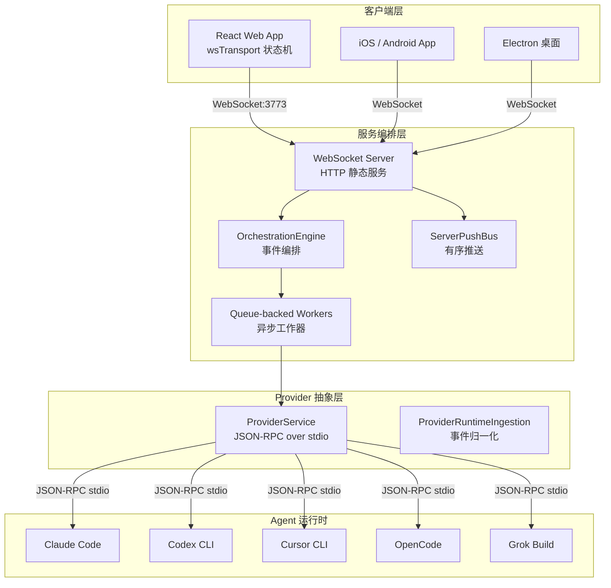

## 一句话判断

T3 Code 解决的核心问题是：AI 编程 agent（Claude Code、Codex 等）都跑在你的电脑上，但你不想一直坐在电脑前盯着终端。T3 Code 给这些 agent 加了一层远程控制界面——手机、浏览器或桌面应用都能操控，agent 还在你机器上跑。

## 项目概览

| 维度 | 数据 |
|------|------|
| 仓库 | pingdotgg/t3code |
| Stars | ~16,000（2026-07） |
| 语言 | TypeScript |
| 许可证 | MIT |
| 作者 | Theo Browne（pingdotgg） |

T3 Code 在 README 里把自己定位为 "minimal web GUI for coding agents"，但 Theo 在视频中更深一层的解释是——它本质上是一个 agent 的 control surface（控制面板），不替代 Claude Code 或 Codex，而是在它们之上加一层 UI 和远程访问能力。

## 架构分层：T3 Code 不是"一个 Web 界面"

T3 Code 的架构比表面看起来复杂。官方文档把它拆成四层，每层解决不同的问题：



**客户端层**是 React Web 应用，通过 `wsTransport` 状态机管理 WebSocket 连接。所有 typed push 事件在客户端边界解码，服务端运行时细节不会泄露到 UI 层。

**服务编排层**是 `apps/server` 模块。它同时承担 WebSocket 服务端和 HTTP 静态文件服务的角色。关键组件包括 `ServerPushBus`（保证推送顺序）、`ServerReadiness`（启动屏障，确保所有服务就绪后才接受客户端连接）、`OrchestrationEngine`（事件持久化与读模型更新）和 `CheckpointReactor`（检查点处理）。

**Provider 抽象层**通过 `ProviderService` 与底层 agent 通信。协议是 JSON-RPC over stdio——T3 Code 把 agent 进程当作子进程启动，通过标准输入输出发送 JSON-RPC 请求。`ProviderRuntimeIngestion` 把 provider 原生事件归一化为编排事件，供上层消费。

**Agent 运行时**就是你自己安装的 Claude Code、Codex CLI 等工具。T3 Code 不自己跑模型，它假设你已经装好了这些工具并且完成了认证。

这套架构中的**异步工作器队列**值得单独拿出来看。长时间运行的任务（runtime ingestion、命令反应、检查点处理）通过 `DrainableWorker` 队列运行，保证副作用有序执行，测试代码也能在确定性的等待点停下来。异步里程碑完成时，服务端通过 `RuntimeReceiptBus` 发送 typed receipt，编排代码和测试代码都等在这些 receipt 上，不需要轮询 git 状态或定时器。

## 支持的 Agent

T3 Code 目前支持五种 agent 后端，前提是它们已在本机安装并认证：

| Agent | 认证命令 |
|-------|----------|
| Claude Code | `claude auth login` |
| Codex | `codex login` |
| Cursor | `cursor-agent login` |
| Grok Build | `grok login` |
| OpenCode | `opencode auth login` |

如果这些 agent 在你电脑上能正常跑，T3 Code 就能接管它们。

## 四端客户端

T3 Code 提供四种使用方式：

1. **iOS App**：App Store 上架
2. **Android App**：Google Play 上架
3. **Web App**：[app.t3.codes](https://app.t3.codes)，浏览器直接用
4. **桌面 App**：Electron，GitHub Releases 下载

最快体验方式无需安装——只要 Node.js 22.16+：

```bash
npx t3@latest
```

这会在本机启动 T3 Code 后端和本地 Web 应用。

### 桌面安装

```bash
# Windows
winget install T3Tools.T3Code

# macOS
brew install --cask t3-code

# Arch Linux
yay -S t3code-bin
```

## 远程控制与 Git 自动化

T3 Code 最实用的场景是**远程控制**。你在公司电脑上跑着 Claude Code 处理一个大重构，然后出门吃午饭。手机上打开 T3 Code App，查看 agent 进度，发消息指导方向，回来时代码已经改好了。

这是传统终端 agent 做不到的——你被绑在键盘前。T3 Code 把这个约束解掉了。

### 远程访问机制

T3 Code 的远程访问不走自己的服务器。它依赖你已有的网络基础设施：

- **本地局域网**：设备和服务器在同一个子网时直接连接
- **Tailscale**：通过 `npx t3 pair --tailscale` 将服务发布到 Tailscale Serve HTTPS，利用 Tailscale 的 mesh 网络实现跨设备访问
- **SSH 隧道**：手动建立 SSH 隧道转发端口

配对流程是：在服务器上运行 `npx t3 pair` 生成一次性配对 token，手机上扫描二维码完成连接。token 有过期时间（默认值可配置），配对完成后即失效。

### Git 工作流自动化

T3 Code 把每个 agent 线程映射到独立的 Git 分支。启动一个新功能线程时，自动创建专用分支；agent 完成任务后，一键 PR 功能将代码提交到 GitHub，附带自动生成的变更日志（来自 agent 执行的上下文）。这个流程省掉了手动管理分支、写 commit message、推 PR 的重复操作。

### 其他能力

- **权限模式**：控制 agent 能做什么、不能做什么
- **源码控制集成**：agent 的代码变更可追踪，内联 diff 审查
- **多账号**：支持同时使用多个 Codex 或 Claude 账号
- **键盘快捷键**：完整的键绑定体系
- **Linux 后台服务**：可作为 systemd 服务运行

## 任务流案例：一次 bug 修复的完整路径

假设你在手机上发现 CI 报了一个 TypeScript 类型错误，想远程让 agent 修掉。

1. 手机打开 T3 Code App，选择 Claude Code 作为 provider
2. 输入指令："修复 src/utils/parser.ts 第 42 行的类型错误，错误信息是 ..."
3. 浏览器（服务端）的 WebSocket 收到请求，`wsServer` 解码后路由到 `ProviderService`
4. `ProviderService` 通过 JSON-RPC over stdio 启动或恢复 Claude Code 会话
5. Claude Code 在服务器上执行：读取文件 → 分析类型 → 生成修改 → 写回文件
6. `ProviderRuntimeIngestion` 轮询 provider 事件，归一化为编排事件
7. `OrchestrationEngine` 持久化事件，更新读模型
8. `ServerPushBus` 通过有序推送通道把进度推送到手机
9. 手机上实时看到 agent 的每一步操作和 diff
10. agent 完成后，手机端显示改动摘要，你可以直接审查 diff 或一键 PR

整个过程中，agent 代码在服务器上跑，手机上只传输状态和指令。即使手机锁屏，agent 也会继续执行（由服务器端的 `DrainableWorker` 队列保证）。

## 技术判断

T3 Code 的技术选择反映了几层思考：

**T3 Code 的角色是 agent 的壳，不是 agent 本身**。它不跑模型、不做代码生成，依赖你已经有的 Claude Code 或 Codex 订阅和认证，只负责提供更好的操控界面。这意味着 T3 Code 的成功与 agent 生态深度绑定。

**TypeScript + Electron + React Native（推测）**。四端覆盖的技术代价是 Electron 桌面 + Web + 移动原生，这对小团队来说是合理的快速覆盖策略。不过 Electron 的包体积和内存占用在设计时就需要计入。

**WebSocket 作为核心传输协议**。架构文档显示，T3 Code 使用 typed WebSocket 合约在客户端和服务端之间传输状态。`ServerPushBus` 保证推送顺序，`RuntimeReceiptBus` 让异步处理可等待。这套设计比轮询或 Server-Sent Events 更适合实时 agent 监控场景，但要求网络连接稳定——在弱网环境下，WebSocket 重连和状态恢复是需要关注的。

**开源但不接受大贡献**。README 明确说 "mostly not accepting contributions yet"——小修复可能考虑，大功能不接受。这更像是一个产品团队的开源发布，而非社区项目。截止 2026-07，仓库有 2,219 commits，但主要贡献者集中在 Theo 和核心成员。

**Vite+ 构建**。项目使用了 Vite+（vp）作为构建工具，需要全局安装 `vp` CLI。这是较新的工具链选择，好处是构建速度快，但增加了新贡献者的环境配置成本。

## 与同类工具的对比

T3 Code 不是唯一一个做 agent 远程控制和编排的工具。同类产品里，Parallel Code 和 Tollecode 也在做类似的事情，只是切入点不同：

| 特性 | T3 Code | Parallel Code | Tollecode |
|------|---------|---------------|-----------|
| 多 agent 支持 | Claude Code / Codex / Cursor / Grok / OpenCode | 通用 | 通用 |
| 远程控制 | ✅ iOS/Android/Web | ❌ 仅桌面 | ❌ 仅桌面 |
| 自动 Git 分支 | ✅ 线程→分支映射 | ✅ 专用分支 | ❌ |
| 一键 PR | ✅ 自动变更日志 | ❌ | ❌ |
| 隐私架构 | 零遥测，本地凭据 | 本地优先 | 本地优先 |
| 开源 | ✅ MIT | ❌ | ❌ |

T3 Code 的差异化优势在**远程控制**和**多 agent 统一入口**。Parallel Code 更专注于"每个 agent 一个独立 workspace"，Tollecode 则强调任务执行的精细控制。离开电脑后还要操作 agent，T3 Code 是目前最直接的选择。

## 快速上手

```bash
# 最简方式（需 Node.js 22.16+/23.11+/24.10+）
npx t3@latest

# 查看完整 CLI 选项
npx t3@latest --help
```

桌面用户安装后直接启动即可。默认连接本机的 agent 后端。

**前置条件**：至少安装并认证一个 agent（Claude Code / Codex / Cursor / Grok / OpenCode），确认它能在本机终端正常工作。

远程访问配置参见 [remote-access.md](https://github.com/pingdotgg/t3code/blob/main/docs/user/remote-access.md)。

## 常见问题

**Agent 列表为空或显示未认证**
确认 agent 已在本机安装并完成认证。在终端依次运行 `claude auth login` 或 `codex login` 等命令，确保认证成功后，再启动 T3 Code。如果已经启动，重启服务端即可刷新状态。

**手机无法连接到服务器**
先确认手机和服务器在同一网络（或已配置 Tailscale 等 mesh 网络）。在服务器上运行 `npx t3 pair` 生成配对二维码，手机扫描后自动连接，不要直接输入 IP 地址。使用 `--tailscale` 选项时，确保 Tailscale 已在服务器上登录并运行。

**WebSocket 频繁断连**
T3 Code 依赖 WebSocket 做实时通信，弱网环境可能出现断连。建议在稳定网络下使用，或通过 SSH 隧道建立连接。如果服务端以 systemd 服务运行，可通过 `journalctl -u t3code` 查看日志辅助排查。

**如何更新 T3 Code**
`npx t3@latest` 方式每次运行都会自动拉取最新版本。桌面 App 用户可在 GitHub Releases 页面下载新版，或通过 `brew upgrade t3-code`（macOS）更新。

## 适用边界

**适合**：

- 已经在用 Claude Code / Codex / Cursor agent 的开发者
- 需要远程监控和指导 agent 工作的场景
- 希望用手机或平板控制电脑上编码 agent 的用户
- 同时使用多种 agent 后端的团队
- 想要自动 Git 分支管理和一键 PR 的开发者

**不适合**：

- 没有 agent 订阅的用户（T3 Code 不提供 agent 能力本身）
- 需要深度定制的团队（项目当前不接受大功能贡献）
- 对 Electron 应用有性能顾虑的场景
- 弱网环境下对 WebSocket 重连有较高要求的场景（需自行验证）

## 采用建议

个人开发者如果已经在用 Claude Code 或 Codex，从 `npx t3@latest` 开始，花十分钟验证远程控制流程是否通顺——如果只在本地用，T3 Code 的价值有限。

小团队场景下，有人专门负责 agent 机器的话，T3 Code 的远程控制和 Git 工作流自动化能减少"谁在哪个 agent 上跑了什么"的信息损耗。不过项目不接受大贡献，遇到特定 bug 不要指望能快速修掉。

如果正在评估 agent 编排方案，可以同时看看 T3 Code 和 Parallel Code。前者强在远程和多 agent 统一入口，后者强在每个 agent 的工作区隔离。两个工具解决的是不同维度的问题，可以按实际场景选。

## 相关链接

- 仓库：[github.com/pingdotgg/t3code](https://github.com/pingdotgg/t3code)
- 架构文档：[docs/architecture/overview.md](https://github.com/pingdotgg/t3code/blob/main/docs/architecture/overview.md)
- Web App：[app.t3.codes](https://app.t3.codes)
- iOS：[App Store](https://apps.apple.com/us/app/t3-code-remote-claude-more/id6787819824)
- Android：[Google Play](https://play.google.com/store/apps/details?id=com.t3tools.t3code)
- Discord：[discord.gg/jn4EGJjrvv](https://discord.gg/jn4EGJjrvv)