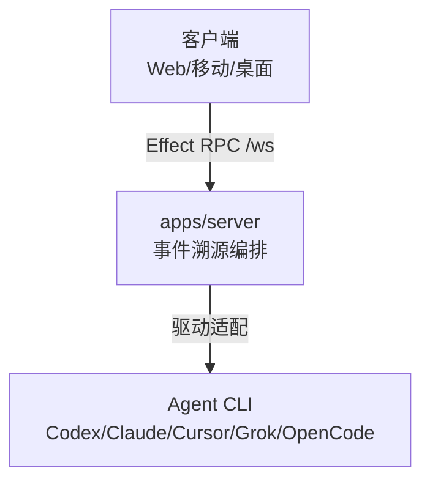

# T3 Code：Theo 的 Agent 控制台，远程驾驭 Claude Code 与 Codex

不少AI 编程 agent（智能体）都有一个缺点：它们跑在你电脑的终端里，你就得坐在终端前。Claude Code 在跑一个跨文件重构时，你出去吃顿饭，回来发现它停在某个审批点等你——这半小时本可以不用守在屏幕前。T3 Code 解决的就是这个痛点：agent 的进程仍在你的机器上，操控面搬到手机、浏览器和桌面，人不必再守在电脑前。

T3 Code 是agent套壳，它不跑模型、不做代码生成，管理你已安装并认证的 agent 进程，你可以坐在沙发上，偶尔低头看一眼进度，然后用语音指挥你的agent牛马不停的干活。

T3 Code，只是想要最好用的 agent 开发体验，而 Codex 桌面应用、Conductor、Claude Desktop、Cursor Glass 这些现成方案都没到他们的标准。
T3 Code 想做到性能优秀、能远程、真正开放，并明说「万一走错了方向，你可以 fork（派生）去构建自己编辑器所需的一切」。「真正开放」具体所指：MIT、不上传遥测、自带安装包，都能在仓库里检验。

## 目录

**理解篇**

- [一、它解决的是什么](#一它解决的是什么)
- [二、系统地图](#二系统地图)
- [三、核心机制](#三核心机制)
- [四、远程访问：四种连接目标](#四远程访问四种连接目标)
- [五、示例：一次 bug 修复如何流过系统](#五示例一次-bug-修复如何流过系统)

**实践篇**

- [六、与同类工具的对比](#六与同类工具的对比)
- [七、快速上手](#七快速上手)
- [八、常见问题 FAQ](#八常见问题-faq)
- [九、适用边界](#九适用边界)
- [十、采用建议](#十采用建议)

**学习篇**

- [十一、学习目标](#十一学习目标)
- [十二、自测题](#十二自测题)
- [十三、进阶方向](#十三进阶方向)
- [十四、参考资料](#十四参考资料)

## 一、它解决的是什么

| 维度 | 数据 |
|------|------|
| 仓库 | pingdotgg/t3code |
| Stars | 16,000+（2026-08） |
| Forks | 3,600+ |
| 语言 | TypeScript（Effect 生态） |
| 许可证 | MIT |
| 作者 | Theo Browne（pingdotgg） |
是的哦，你说得对哟
项目 2026 年 2 月 8 日创建，半年出头冲到 16k stars，commit（提交）数 2,200+。增长快，一部分靠 Theo 的号召力，但仓库本身的做法——MIT、不上传遥测、自带各平台安装包、`npx t3@latest` 免安装体验——让新用户从看到到跑通几乎没有门槛。开 issue 数超过 1,000。

## 二、系统地图

T3 Code 的架构可以压缩成一张图：客户端通过一条 WebSocket 连到服务端，服务端通过驱动适配器指挥各个 agent CLI（命令行工具）。这张图里没有「远程模式」和「本地模式」之分——客户端在哪，不影响服务端怎么跑。



四个层次各管一件事：

| 层 | 职责 | 关键组件 |
|------|------|----------|
| 客户端层 | 连接管理、认证、RPC、Atom 状态 | packages/client-runtime |
| 服务编排层 | 事件溯源、投影、检查点、终端、文件系统 | OrchestrationEngine、DrainableWorker |
| Provider 层 | 驱动注册与适配 | 5 个内置 driver + adapter（适配器模式） |
| Agent 运行时 | 实际执行编码任务 | Codex / Claude / Cursor / Grok / OpenCode |

分层原则：客户端只负责连接和渲染，所有 provider 进程、终端、git 操作、文件读取都发生在服务端。手机上的 App 只是服务端状态的投影。

客户端和服务端之间的契约，是 Effect RPC 组，不是自造的推送协议。`rpc.ts` 声明 `WS_METHODS` 并组装 `WsRpcGroup`，每个成员要么是 unary（单次调用）要么是服务端流（`stream: true`）。`orchestration.subscribeThread`、`orchestration.subscribeShell`、`subscribeServerConfig`、`terminal.attach` 这些流式成员，取代了原来那种广播推送总线：客户端只订阅自己需要的，服务端只在对应订阅上推送。想实时看某条线程的 diff，就订阅它；不想看 shell，就不订阅。

## 三、核心机制

### 3.1 编排：事件溯源，不靠轮询

T3 Code 的服务端不直接改应用状态。客户端派发类型化命令，编排引擎把命令变成持久化事件，再由投影器推导出读模型——标准的 event sourcing 结构。命令的入口是唯一一个 RPC 方法 `orchestration.dispatchCommand`，客户端永远不会直接调某个 provider。

`OrchestrationEngine` 内部是一条单 worker 的命令队列，命令处理完全有序：先查持久化收据保证重试幂等，再用纯函数 `decider` 从「命令 + 当前状态」产出事件，最后在同一个 SQL 事务里追加事件、更新内存读模型、写回投影表、记录收据。因为持久化和投影共享一个事务，读模型永远不可能和事件日志不一致。派发失败时，引擎会重读起始序列之后的事件对账，而不是把状态交给猜测。`decider` 保持纯函数不是洁癖——事件要能重放，重放要能得出同样结果，任何副作用（写文件、发请求、读时钟）都会让重放失真。

命令和事件在契约层有明确的命名边界。客户端可以派发 `thread.create`、`thread.turn.start`、`thread.approval.respond` 这类命令；而 `thread.message.assistant.delta`、`thread.turn.diff.complete` 这类事件只能由服务端 reactor 产出，客户端造不出来。turn 何时结束也由投影器判定——session 离开 running 状态的那一刻，而不是检查点收尾的时刻。

为什么绕这么大一圈？因为 agent 会话天然是长时、异步、跨设备的。轮询 git 状态或定时器猜进度，一旦服务端重启或网络抖动，状态就对不上了。事件溯源让「发生了什么」成为唯一事实来源，任何客户端重连后都能从日志重建视图。

### 3.2 队列：DrainableWorker 与确定性等待

长时间运行的后续工作（provider 事件归一化、命令反应、检查点处理）跑在基于队列的工作器里。`DrainableWorker` 把事务性队列和事务性的未完成计数配对：入队即原子递增，处理完成必递减，`drain` 一直重试到计数归零。

这个设计最直接的受益者是测试。异步里程碑不再靠「sleep 一会儿再断言」，而是等待「队列空且当前项完成」这个确定点。三个核心工作器（`ProviderRuntimeIngestion`、`ProviderCommandReactor`、`CheckpointReactor`）都暴露 `drain` 接口，测试代码可以精确地停在任意异步边界上。

`ProviderRuntimeIngestion` 里还有一个取舍：assistant 文本默认走 buffered 交付，不逐字流式推送。缓冲上限是 24,000 字符，一旦某次追加会越过这个值，就把整段累积文本作为单个 delta 吐出去。缓冲并非死等到 turn 结束才清空——在交互边界（审批请求弹出、需要用户输入）时也会整体冲刷。客户端收到的是完整的、可读的块，代价是长回复会有一瞬间的停顿。对远程控制场景，手机上出现一段完整文字，比逐字蹦字更实用。

### 3.3 Provider：五套驱动，一个抽象

服务端内置五个驱动：Codex、Claude、Cursor、Grok、OpenCode。每个驱动声明自己的类型、配置 schema（模式），并创建适配器；两个注册表把「配置的实例」和「活的进程」分开管理——`ProviderInstanceRegistry` 管实例，`ProviderAdapterRegistry` 把实例解析成活的适配器，`ProviderService` 路由会话和 turn 操作时根本不知道背后是哪个 agent。

客户端面向 provider 的命令也走同一个抽象：`thread.turn.start`、`thread.turn.interrupt`、`thread.approval.respond`、`thread.user-input.respond`、`thread.checkpoint.revert`、`thread.session.stop`，外加两个模式设定 `thread.runtime-mode.set`、`thread.interaction-mode.set`。调用方只认线程，不认 agent。

加一个新 agent 的成本被压得很低：写一个 driver 加一个 adapter，注册进 `BUILT_IN_DRIVERS`，编排层、契约层、客户端一行都不用改。

### 3.4 检查点：每一次 turn 都有快照

每个 turn 都被工作区检查点括起来，diff 和回滚因此是精确的。`CheckpointStore` 通过 VCS 驱动把状态存成隐藏的 Git ref——`VcsCheckpointOps` 是存储契约，Git 是当前唯一实现。`CheckpointReactor` 协调基线捕获、turn 完成捕获、diff 投影，以及工作区和 provider 会话的双重回滚；`CheckpointDiffQuery` 负责回答单次 turn 或整条线程的 diff 请求。你在手机上看到的每一处 diff，背后都是一次真实的 Git 快照对比。

## 四、远程访问：四种连接目标

T3 Code 的远程模型很简单：远程只存在于连接层，运行时从不拆分。客户端永远只认「一条到某个 T3 server 的 WebSocket」，至于这条 WebSocket 是怎么建立的，有四种目标。容易误判的是 Tailscale：它不是第五种目标类型，只是走普通 bearer 配对路径接入的端点提供者，接不接都不改核心模型。

| 目标类型 | 用途 |
|----------|------|
| 本地主连接 | 桌面应用或 CLI 管理的本机服务端 |
| Bearer 配对 | 手动配对任意直连 HTTP/WebSocket 端点 |
| Relay 中继 | `t3 connect` 托管隧道，穿透 NAT（网络地址转换） |
| SSH | 桌面应用托管 SSH 远程环境 |

局域网直连是最简单的方式，手机和服务器在同一个子网即可。服务器在 NAT 后面或要跨公网访问时，走 Relay 中继隧道——注意中继 Worker 只交换凭据和托管端点，应用流量走的是 Cloudflare 隧道主机名，不经过中继本身。Tailscale 用户可以直接用 `npx t3 pair --tailscale` 把服务发布到 tailnet 的 HTTPS 地址，那个映射会一直保留到你手动关掉 `tailscale serve --https=443 off`。桌面应用还能通过 SSH 在远程机器上启动或复用 T3 server，再把端口转发回来。

配对流程设计得比传统 token（令牌）登录干净：`t3 serve`（或对运行中的服务器执行 `t3 pair`）签发一次性配对 token，远程设备用它交换会话，之后访问全部基于会话，不需要长期秘密。桌面应用里还能用「Create Link」生成一个配对链接，直接分享给另一台设备。WebSocket 的认证票据独立签发，默认五分钟过期，且每个 RPC 方法还各自校验权限范围——拿到一条合法连接不代表能调所有方法。会话管理单独交给 `t3 auth`：签发额外凭据、查看活跃会话、吊销不再信任的配对，都在这一条命令下完成。

托管配对（app.t3.codes）只是个客户端便利，不是中继。它不代理 HTTP 或 WebSocket 流量，浏览器直接连你给的后端地址，配对 token 放在 URL hash（哈希）里，连托管页都看不到。前提是后端必须能被浏览器直接访问——HTTPS 页面只能连 HTTPS/WSS 后端，纯 HTTP 的局域网地址还得走桌面或 CLI 的直连配对。

客户端和服务端版本不一致时，连接层不会静默失败：环境描述符携带运行中的服务端版本，UI 据此显示对应的同步操作，服务端也支持更新回滚。远程环境在客户端升级期间保持在线，断线重连由连接管理器统一处理，和普通网络抖动走同一条恢复路径。

## 五、示例：一次 bug 修复如何流过系统

最常见的场景：你在手机上看到 CI 报了一个 TypeScript 类型错误，想远程让 agent 修掉。

1. 手机打开 T3 Code App，选 Claude Code 作为 provider
2. 输入指令：「修复 src/utils/parser.ts 第 42 行的类型错误，错误信息是 …」
3. 客户端经 WebSocket 发出 `orchestration.dispatchCommand`，携带 `thread.turn.start` 命令，RPC 层完成鉴权
4. 引擎持久化该事件，`ProviderCommandReactor` 据此派发 provider 调用
5. Claude Code 在服务器上读取文件、分析类型、生成修改、写回磁盘

到这里，agent 在服务器上继续跑，手机可以锁屏。异步里程碑由服务端队列推进，与设备是否在线无关：

6. `ProviderRuntimeIngestion` 消费 Claude Code 的事件流，归一化为编排命令
7. 遇到需要授权的操作，agent 停在审批点，手机弹出审批请求，你点一下批准，客户端据此派发 `thread.approval.respond` 命令
8. `CheckpointReactor` 捕获 turn 完成时的快照，`CheckpointDiffQuery` 投影出 diff
9. 服务端通过 `orchestration.subscribeThread` 订阅推送把进度和 diff 实时同步到手机
10. 你审阅 diff，点一键 PR，分支和变更日志自动就位

整个过程里，手机上流动的只有指令和状态；代码执行、git 操作、文件变更全部发生在服务器上。

## 六、与同类工具的对比

agent 远程控制和编排不是 T3 Code 独有。拿它跟几个常被一起提起的工具摆在一起看（以下对 Parallel Code、Superset 的描述按其公开产品信息归纳，细节可能随版本变化）：

| 特性 | T3 Code | Parallel Code | Superset |
|------|---------|---------------|----------|
| 多 agent | Codex/Claude/Cursor/Grok/OpenCode | 通用 | 通用 |
| 远程控制 | ✅ 移动/Web/桌面 | ❌ 仅桌面 | ❌ 仅桌面 |
| 线程→Git worktree | ✅ | 独立 workspace | 未披露 |
| 一键 PR | ✅ 自动变更日志 | 未披露 | 未披露 |
| 许可证 | MIT | 不开源 | Elastic 2.0（source-available） |

T3 Code 的取舍很清晰：远程控制和多 agent 统一入口。Superset 走的是「编辑器形态 + 十路并行」路线，Parallel Code 强调每个 agent 独立 workspace。想离开电脑操作 agent，T3 Code 目前是最直接的选择；如果一次要跑十个 agent，Superset 的方向可能更接近你的需求。

它和 Cursor、Copilot 也不是一类东西。Cursor 是 AI 优先的编辑器，Copilot 是 IDE（集成开发环境）里的插件，都长在编辑生态内；T3 Code 站在 IDE 之外，管理的是完整的 agent 会话——它不依赖你用哪个编辑器，你甚至可以没有编辑器，只有终端。两者可以共存，不构成替代关系。

## 七、快速上手

### 基础安装

```bash
# 最简方式，需 Node.js 22.16+ / 23.11+ / 24.10+
npx t3@latest

# 完整 CLI 参考
npx t3@latest --help
```

**前置条件**：至少安装并认证一个 agent——`claude auth login`、`codex login`、`agent login`（Cursor）、`grok login` 或 `opencode auth login`，确认它在终端能正常跑。T3 Code 不产生 agent 能力，它只驱动你已经有的。

桌面安装走各平台包管理器：Windows 用 `winget install T3Tools.T3Code`，macOS 用 `brew install --cask t3-code`，Arch 用 `yay -S t3code-bin`。远程访问的完整配置见 [remote-access.md](https://github.com/pingdotgg/t3code/blob/main/docs/user/remote-access.md)。

### 实战：手机从外网连家中机器

第四章从连接层讲了「能连」的机制——四种连接目标：本地主连接、Bearer 配对、Relay 中继、SSH。这一节换一个角度，回答更实际的问题：手机在外面（蜂窝网络、公司 Wi-Fi）时，怎么连回家里的机器？

先厘清一个容易混淆的点：这里的分类和第四章不是一回事。第四章说的是连接层「这条 WebSocket 怎么建」，属于技术分类；本章说的是使用者「用什么方式接入」，属于操作分类。按操作方式，实际路径有四条：Tailscale、Relay 中继、SSH 远程环境、托管配对。

第四章说 Tailscale 不是第五种连接目标，这里却单独算了它一条，初看矛盾。其实不矛盾：Tailscale 只是把服务发布成 HTTPS 端点的提供者，手机最终仍走普通 bearer 配对连进来；但站在使用者角度，「要不要装、要不要用 Tailscale」是独立于连接层的选择，所以单独算一条路径，也是本章最推荐的方式。

方向先定下来：**日常首选 Tailscale，它不可用时用 Relay 中继兜底**；SSH 和托管配对只适用于特定场景。下面先把概念讲清楚，再横评、组合、给逐步操作。

#### 认识 Tailscale（新手必读）

Tailscale 不是 T3 Code 的一部分，它是独立的组网工具，T3 Code 只是善用了它。很多人第一次接触这两个词容易混淆，先把它讲清楚：

- **它是什么**：一个基于 WireGuard 的组网工具。把「手机」和「家中机器」加入同一个私人虚拟网络（叫 tailnet）后，两台设备就像在同一个局域网里，互相能直接访问——即使它们一个在 4G 网络、一个在公网 IP 都没有的路由器后面。
- **它不是 VPN 代理**：Tailscale 只在你的设备之间建立加密直连通道，不把流量转发到第三方服务器（极少数 NAT 打洞失败时才走内置的 DERP 中继兜底）。所以手机开着 Tailscale 不影响正常上网，只有访问家中机器时才走这条加密隧道。
- **为什么 T3 Code 官方推荐它**：它给 T3 Code 提供「稳定地址 + HTTPS 端点 + 不暴露公网」，正好补齐远程控制最需要的三件事。后面用到 `--tailscale-serve` 时你会看到，Tailscale 还能把本机服务发布成 `https://机器名.tailnet名.ts.net/` 这样的 HTTPS 地址。

**注册与安装：**

1. 注册：用 GitHub / Google / Microsoft 账号直接登录，或邮箱注册，一两分钟搞定。免费版包含 3 个用户、100 台设备，个人用完全够，不需要付费。
2. 家中机器（macOS）：访问 [tailscale.com/download](https://tailscale.com/download) 下载 App，或 `brew install --cask tailscale`，安装后登录你的账号。
3. 手机（iOS/Android）：App Store / Google Play 搜 Tailscale 安装，登录**同一个账号**。两台设备登录同一账号后，自动加入同一个 tailnet。

**稳定性和维护：**

- 网络：底层是 WireGuard，T3 Code 官方文档专门推荐 tailnet 就是因为稳定。它自动处理 NAT 穿透——两台设备只要能上网就能连上，即使家中机器没有公网 IP。NAT 穿透失败（极少见）时，Tailscale 用内置的 DERP 中继兜底，不会断连。
- 维护：装好后作为系统服务开机自启、自动重连，不需要手动重启，平时感觉不到它的存在。装一次，长期不用管。

**验证是否就绪：** 在终端跑 `tailscale status`，看到两台设备都在列表里、状态是 Connected，就说明组网成功，可以进入下面的 T3 Code 配对步骤了。

#### 四种方案横评

| 维度 | Tailscale | Relay 中继 | SSH 远程环境 | 托管配对 |
|------|-----------|-----------|--------------|----------|
| 上手成本 | 两台设备各装一个客户端，扫码即用 | 一条命令，零安装 | 家机需开 SSH 服务并配好登录 | 需自备 HTTPS 入口 |
| 功能 | 稳定地址 + 可选 HTTPS，App 与网页通吃 | 只解决「连上」，无附加能力 | 桌面 App 顺手管理远端机器 | 仅网页版配对 |
| 网络强壮性 | WireGuard 直连，打洞失败自动回退 DERP 中继，弱网稳定 | 依赖 Cloudflare 隧道，受第三方节点影响 | 依赖家宽上行与 SSH 配置质量 | 依赖你自己的 HTTPS 隧道质量 |
| 安全 | 端到端加密，服务不暴露公网 | 流量经第三方隧道中转，依赖其可用性 | 需暴露 SSH 端口，攻击面最大 | 配对 token 落在 URL 里 |
| 手机端要求 | Tailscale + T3 Code 两个 App | 只装 T3 Code App | 由桌面 App 引导，手机不直接参与 | 浏览器即可 |

逐条拆开看：

- **Tailscale**：两端加入同一个 tailnet 后，T3 server 只监听 tailnet 私有地址，公网扫描不到，安全层级最高；WireGuard 在传输层加密，手机切 4G/5G/Wi-Fi 不断线；缺点是两台设备都要装客户端、依赖 Tailscale 账号。**适合绝大多数人，官方也把它列为首选。**
- **Relay 中继**：`t3 connect` 一条命令穿透 NAT，不需要账号和安装；代价是数据经 Cloudflare 隧道转发、依赖第三方服务，多一跳网络、延迟略高。**适合不想装 Tailscale 的人，或 Tailscale 被网络环境限制时兜底。**
- **SSH 远程环境**：桌面 App 帮你登录远端、启动 T3 server 并转发端口，适合「用桌面 App 管理一台远程机器」；但它是桌面功能，手机 App 无法发起，对「手机直连家机」这个目标并不直接解决。**适合已有 SSH 基础设施、主要用桌面端的人。**
- **托管配对**：`app.t3.codes` 网页版直连你的后端，前提是后端能被浏览器经 HTTPS/WSS 访问——也就是说你得先有自己的 HTTPS 入口（比如 Cloudflare Tunnel 配域名）。**适合已经有 HTTPS 隧道的人，其余场景绕远了。**

#### 最优组合：Tailscale 为主，Relay 兜底

两者互补：Tailscale 给到「不暴露 + 强加密 + 弱网稳」，是四条路里性价比最高的；万一在公司网络、酒店等环境里 Tailscale 的 UDP 打洞被拦，一条 `npx t3 connect` 就能临时顶上，不用改任何其他配置。SSH 和托管配对只在它们对应的特定场景里才划算，日常不必考虑。

#### 方案一：Tailscale（首选）

前提：

- 家中机器和手机都安装 [Tailscale](https://tailscale.com/)，用同一个账号登录，加入同一个 tailnet
- 手机装好 T3 Code App（App Store 或 Google Play 搜索 T3 Code）
- 家中机器已安装并认证至少一个 agent（见上面的「基础安装」）

**家中机器端，二选一：**

- 服务端还没启动：启动并发布服务，一步到位（手机 App 和网页版都能连）：
  ```bash
  npx t3 serve --tailscale-serve
  ```
  只想让手机 App 连、不打算用网页版的话，绑 tailnet IP 更省：
  ```bash
  npx t3 serve --host "$(tailscale ip -4)"
  ```
  这条只监听 tailnet 私有地址，不依赖 Tailscale Serve，也就绕开了下面「常见问题」里那个 Serve 未开启的坑——手机 App 连纯 HTTP 不受浏览器混合内容限制，所以完全够用。
- 服务端已经在跑：不用重启，直接签发配对二维码：
  ```bash
  npx t3 pair --tailscale
  ```

`--tailscale-serve` 会自动配置 Tailscale Serve 的 HTTPS 映射，把服务发布到 `https://<机器名>.<tailnet名>.ts.net/`。这个映射一直保留，直到你手动关掉：

```bash
tailscale serve --https=443 off
```

**手机端：**

1. 打开 T3 Code App
2. 点击「Add Environment」
3. 扫描终端显示的二维码，完成配对
4. 在环境列表选择刚添加的机器，连接

配对一次后，环境会保存下来，之后直接点一下就能连，不需要重复扫码。

**常见问题：**

- 扫完码连不上：确认手机和家机登录了同一个 Tailscale 账号、Tailscale 状态显示 Connected，再试一次
- 混合内容错误：浏览器里的 app.t3.codes 是 HTTPS 页面，只能连 HTTPS/WSS 端点；如果环境是纯 HTTP 就会报混合内容错误。`--tailscale-serve` 自动配好 HTTPS，正常不会触发
- 服务端日志报 `TailscaleCommandTimeoutError`：多半是 **tailnet 没开启 Serve 功能**。`tailscale serve` 需要先在 tailnet 层面授权，否则命令会一直卡到超时。手动跑 `sudo tailscale serve --https=443 http://localhost:3773` 时若提示 `Serve is not enabled on your tailnet`，按提示打开 `https://login.tailscale.com/f/serve?node=<你的节点>` 批准即可。批准后重新执行 `sudo tailscale serve ...`，再改回 `npx t3 serve` 启动（避免重复触发超时调用）

#### 方案二：Relay 中继（兜底）

没有 Tailscale 或它不可用时，用 T3 官方中继隧道穿透 NAT，不需要公网 IP：

```bash
npx t3 connect
```

终端打印配对二维码，手机端操作和方案一一样：T3 Code App → Add Environment → 扫码配对。注意两点：中继 Worker 只交换凭据和托管端点，应用流量实际走 Cloudflare 隧道主机名，不经中继服务器；也正因数据多走一跳第三方隧道，延迟和稳定性略逊于 Tailscale，适合临时救急。

#### 方案三：SSH 远程环境（桌面 App 引导）

适合「用桌面 App 管理一台远程机器」，不适合作为手机直连家机的主路径：

1. 桌面 App 打开 Settings → Connections
2. 在 Remote Environments 里选择 Add environment
3. 选 SSH 启动流程，填入目标，如 `user@example.com`
4. 确认启动：App 探测主机，启动或复用远端 T3 server，本地端口转发，保存环境

远程机器需要满足：SSH 可登录；Node.js 版本在 `^22.16 || ^23.11 || >=24.10` 范围内，且非交互 shell 能直接找到 `node` 命令（用 nvm 的话需要 `nvm alias default 24` 这类默认别名，否则启动会报 `node: command not found`）。

#### 方案四：托管配对（已有 HTTPS 入口时）

如果你的家机已经有一个 HTTPS 可达的入口（比如自己配了 Cloudflare Tunnel 加域名），可以直接用网页版配对：

```text
https://app.t3.codes/pair?host=https://backend.example.com:3773#token=配对码
```

浏览器直连你的后端，托管页不代理流量，配对 token 放在 URL hash 里。注意纯 HTTP 的局域网地址（`http://192.168.x.x:3773`）不能走这条路——HTTPS 页面连 HTTP 后端会被浏览器拦掉，这种情况回到方案一或方案二。

#### 桌面 App 用户路线（图形化，零命令行）

前面四个方案大多围绕 CLI 展开。如果你只装了桌面 App、不想碰命令行，按下面两个阶段照做就行，全部在设置界面里完成。

**第一阶段：局域网跑通**

1. Mac mini 打开 T3 Code 桌面 App
2. Settings → Connections → 找到 This environment → 打开 Network access 开关（App 会重启，后端开始监听所有网络接口）
3. 点 Create Link 生成配对链接，界面同步显示二维码
4. 手机打开 T3 Code App → Add Environment → 扫码或粘贴链接
5. 连接成功，环境保存后随点随连

同一 Wi-Fi 下不需要装任何额外软件。连不上时先确认手机和 Mac 在同一个子网——很多路由器把访客网络和设备隔离开了，手机连了访客网络就扫不到。

**第二阶段：外网接入**

1. Mac mini 和手机都装 Tailscale，登录同一个账号
2. Mac mini 的 T3 Code App：Settings → Connections → 打开 Tailscale HTTPS 开关（App 自动重启后端，并让 Tailscale Serve 把 HTTPS 代理到本地后端）
3. Connections 面板出现 HTTPS 端点：`https://<机器名>.<tailnet名>.ts.net/`
4. 手机 T3 Code App → Add Environment → 用这个 HTTPS 地址配对
5. 完成。蜂窝网络、公司网络都能连，4G/5G/Wi-Fi 切换不断线

这个路线踩的坑和方案一一致：手机 Tailscale 没显示 Connected 会导致扫码失败；网页版 app.t3.codes 是 HTTPS 页面，连纯 HTTP 的局域网地址会报混合内容错误——开了 Tailscale HTTPS 就不会碰到后者。

## 八、常见问题 FAQ

**Agent 列表为空或显示未认证**
确认 agent 已在本机安装并完成认证。依次运行 `claude auth login`、`codex login` 等命令，成功后重启服务端刷新状态。

**手机无法连接到服务器**
先确认手机 Tailscale 已连接且和家中机器在同一个 tailnet。然后按[七、快速上手](#实战手机从外网连家中机器)的 Tailscale 方案操作，用 `npx t3 pair --tailscale` 生成二维码扫描配对，不要手输 IP。没有 Tailscale 时改用 `t3 connect` 中继隧道。桌面 App 用户也可以走 Settings → Connections 的图形化配对流程，或直接用 Create Link 生成配对链接。

**WebSocket 频繁断连**
T3 Code 的实时通道依赖 WebSocket，弱网可能断连。优先在稳定网络下使用，或换 SSH 隧道。Linux 上以 systemd 后台服务运行时，用 `npx t3@latest service status` 检查服务状态，`npx t3@latest service update` 修复。

**如何更新 T3 Code**
`npx t3@latest` 每次运行自动拉最新版；桌面 App 在 GitHub Releases 下载新版，macOS 可 `brew upgrade t3-code`。注意客户端和服务端版本不一致时，界面会提示同步操作，更新前先结束进行中的任务——服务端会短暂重启。

**T3 Code 免费吗**
开源免费，MIT 许可证。费用只来自你已有的 agent 订阅——Claude Code、Codex 等各自的账单，T3 Code 本身不额外收费。

**数据会经过第三方服务器吗**
不会。agent 进程、文件、git 操作都发生在你自己的机器上，客户端只传输指令和状态。项目唯一的遥测是本地资源监控——一个独立的 Rust 监控进程采样 CPU 和内存，历史只在诊断时汇总，不落盘、不上传，也不是行为追踪。即使走托管配对（app.t3.codes），浏览器也是直连你的后端，配对 token 放在 URL hash（哈希）里，不经托管页转手。

**如何反馈问题**
GitHub Issues 提交 bug（不保证修复速度），Discord 社区讨论。项目明确「mostly not accepting contributions yet」，小修复可能被考虑，大功能不要抱期待。

## 九、适用边界

**适合**：

- 已在用 Claude Code / Codex / Cursor 的开发者，想把监控从终端挪到手机
- 需要跨设备接管编码 agent 的场景（公司机器跑任务，回家继续盯）
- 同时用多个 agent 后端、想要一个统一入口的人
- 想要线程自动分支 + 一键 PR 的开发者

**不适合**：

- 没有 agent 订阅的用户——T3 Code 本身不产生任何智能
- 需要深度定制或大功能贡献的团队——README 明确「mostly not accepting contributions yet」，目前只收小修复
- 对 Electron 体积和内存敏感的场景
- 弱网下对连接稳定性有苛刻要求的场景（需自行验证）

## 十、采用建议

个人开发者如果已经在用 Claude Code 或 Codex，从 `npx t3@latest` 开始。远程场景优先按第七章的 Tailscale 方案搭：两端装好、扫码配对，外网连回家机十分钟内就能验证是否可行，跑通了再决定深入投入。如果只在本地用终端，T3 Code 的价值有限——它的溢价全在「离开电脑」这个动作上。

小团队有人专门负责 agent 机器的话，远程控制和 Git 工作流自动化能省掉「谁在哪个 agent 上跑了什么」的沟通损耗。但项目不收大贡献，遇到特定 bug 别指望能快速修掉，要有自己绕路的准备。

正在评估 agent 编排方案的话，同时看 T3 Code 和 Superset：前者强在远程和多 agent 统一入口，后者强在并行规模和编辑器形态。两者解决的不是同一个维度的问题。

## 十一、学习目标

读完这篇文章，四个问题应该能回答：T3 Code 在架构上如何实现「远程只存在于连接层」；事件溯源为什么比轮询更适合 agent 会话；五个内置驱动如何做到增删 agent 不动编排层；四种连接目标分别在什么网络条件下使用。能复述「客户端不执行任何 agent 工作」这条边界，说明理解到位了。

## 十二、自测题

1. 为什么 T3 Code 把 provider 进程、git 操作、文件读取全部放在服务端，而不是客户端？
2. 事件溯源中，`decider` 为什么要保持纯函数、无副作用？
3. 手机锁屏后 agent 为什么还能继续执行？服务端靠什么机制保证这一点？
4. Relay 中继和传统反向代理有什么区别？流量最终走哪条路？
5. 为什么说 Tailscale 不是第五种连接目标？它接入的路径是什么？

答案都在正文的机制段落里，答不上来的小节回去重读对应章节。

## 十三、进阶方向

- 读 [架构文档](https://github.com/pingdotgg/t3code/blob/main/docs/internals/overview.md)，关注 `OrchestrationEngine` 的命令/事件循环和 `DrainableWorker` 的队列语义
- 读 [providers.md](https://github.com/pingdotgg/t3code/blob/main/docs/internals/providers.md)，理解 driver + adapter 的分工，试着自己为某个 CLI agent 写一个最小驱动
- 动手搭一条 SSH 远程环境，观察配对票据的签发与 WebSocket 的鉴权流程，把「连接层 vs 运行时」的抽象亲手验证一遍
- 读 [remote.md](https://github.com/pingdotgg/t3code/blob/main/docs/internals/remote.md)，对照四种目标类型和端点提供者模型，理解「访问方式」和「启动方式」为什么是两个独立概念

## 十四、参考资料

- 仓库：[github.com/pingdotgg/t3code](https://github.com/pingdotgg/t3code)
- 架构总览：[docs/internals/overview.md](https://github.com/pingdotgg/t3code/blob/main/docs/internals/overview.md)
- Provider 机制：[docs/internals/providers.md](https://github.com/pingdotgg/t3code/blob/main/docs/internals/providers.md)
- 远程架构：[docs/internals/remote.md](https://github.com/pingdotgg/t3code/blob/main/docs/internals/remote.md)
- 远程访问指南：[docs/user/remote-access.md](https://github.com/pingdotgg/t3code/blob/main/docs/user/remote-access.md)
- 资源遥测：[docs/internals/resource-telemetry.md](https://github.com/pingdotgg/t3code/blob/main/docs/internals/resource-telemetry.md)
- Web App：[app.t3.codes](https://app.t3.codes)