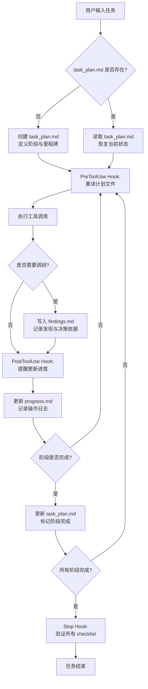

# Planning with Files：Manus 风格的 AI Agent 持久化规划工作流

2025 年 12 月 29 日，Meta 宣布以 20 亿美元收购 Manus。一家从上线到过亿美元收入仅用了 8 个月的公司，被巨头用这个价格买走，最让人好奇的不是它的产品形态——聊天界面早已泛滥——而是它底层的工作流引擎。Manus 官方将这套引擎概括为一句话：

> Markdown is my 'working memory' on disk. Since I process information iteratively and my active context has limits, Markdown files serve as scratch pads for notes, checkpoints for progress, building blocks for final deliverables.

这句话背后是一个被大量验证过的工程判断：把文件系统当作 Agent 的外存，而不是把所有东西塞进上下文窗口。**Planning with Files** 正是这套判断的开源实现，GitHub 18.6k Stars、30 位贡献者、MIT 协议——它让你在 Claude Code、Cursor、Gemini CLI 等 16+个平台上复现 Manus 的核心规划模式。

## 问题的根源：上下文窗口不是工作记忆

当前所有 LLM 驱动的编程 Agent 共享同一个架构缺陷：上下文窗口充当了唯一的工作记忆。这在短任务中足够，但在跨越数十次工具调用的复杂任务中会迅速失效。具体表现为四种退化模式：

| 退化模式 | 触发条件 | 后果 |
|----------|----------|------|
| **易失记忆** | Context reset / 会话重建 | TodoWrite 工具状态全部丢失，进度归零 |
| **目标漂移** | 工具调用超过 50 次 | Agent 逐渐偏离原始任务方向，产出不可用 |
| **错误遗忘** | 失败未被持久化 | 同一错误在不同会话中反复出现 |
| **上下文膨胀** | 所有中间产物塞进 context | Token 成本上升，推理质量下降 |

这四个问题不是 Agent 模型不够聪明造成的，而是架构层面的设计缺陷。你把 RAM 当硬盘用，断电必然丢数据。正确的做法是：

```
Context Window = RAM（易失，有限）
Filesystem     = Disk（持久，无限）

任何重要信息 → 写入磁盘
```

## 3-文件模式：Agent 的外存架构

Planning with Files 的核心设计是三个 Markdown 文件，各自承担明确且不重叠的职责。

### 文件职责矩阵

| 文件 | 职责 | 读时机 | 写时机 |
|------|------|--------|--------|
| `task_plan.md` | 阶段规划、进度追踪、错误记录 | 每次决策前 | 阶段变更、遇到错误 |
| `findings.md` | 研究发现、技术调研、决策依据 | 面临技术选型 | 每次调研后 |
| `progress.md` | 会话日志、测试结果、时间线 | 会话恢复 | 每个操作完成后 |

三个文件的分工遵循一个简单规则：**计划驱动执行，发现支撑决策，日志还原过程**。

### 工作流全景



这张图展示了一个关键特征：**每次工具调用前后，Agent 都被强制回到文件系统读取状态**。这不是建议，是 Hook 机制强制的。PreToolUse Hook 在工具执行前触发，确保 Agent 不会在长时间运行中丢失上下文；Stop Hook 在会话结束前触发，确保没有遗漏的阶段。

### task_plan.md 实例

```markdown
# 项目任务计划

## 阶段一：需求分析
- [x] 收集用户需求
- [x] 编写PRD文档
- [ ] 评审并定稿

## 阶段二：系统设计
- [ ] 架构设计
- [ ] 数据库设计
- [ ] API设计

## 错误记录
- 阶段一中发现：原始需求中身份验证模块遗漏，已回补到PRD
```

### findings.md 实例

```markdown
# 研究发现

## 用户研究
- 目标用户：独立开发者
- 核心痛点：多平台管理混乱，切换成本高

## 技术调研
- 方案A：原生开发 — 开发成本高，性能最优
- 方案B：React Native — 开发效率高，原生模块受限
- 决策：方案B，对性能敏感的支付模块用原生桥接
```

### progress.md 实例

```markdown
# 会话进度日志

## 2026-04-12 14:30
- 创建了项目脚手架，使用 Vite + React + TypeScript
- 完成了认证模块，接入 Supabase Auth
- 遇到问题：第三方支付API响应超时（超时阈值 30s）
- 解决：增加了指数退避重试机制，最多 3 次

## 2026-04-12 15:45
- 完成了用户管理模块
- 测试覆盖率：78%（Jest + Testing Library）
- 下一步：集成 WebSocket 实时通知
```

## Hook 机制：把"建议"变成"强制"

3-文件模式真正的工程价值不在文件本身，而在于 Hook 系统。没有 Hook，Agent 可能"忘记"读文件；有了 Hook，读取是强制的。

### Hook 生命周期

| Hook | 触发时机 | 行为 |
|------|----------|------|
| PreToolUse | 每次工具调用前 | 检查是否需要重读 task_plan.md；阈值内跳过，超出阈值强制读取 |
| PostToolUse | 每次工具调用后 | 检查是否有新发现未写入 findings.md；提醒更新 progress.md |
| Stop | 会话结束前 | 遍历 task_plan.md 所有 checklist；未完成的阶段阻止退出 |

PreToolUse 的重读阈值默认是 10 次工具调用——每 10 步操作后，Agent 会被强制重新读取计划文件，用磁盘上的真实状态覆盖上下文中的过期记忆。这个设计直接解决了目标漂移问题。

### 自定义 Hook 行为

在 `.claude/settings.json` 中可以调整阈值：

```json
{
  "hooks": {
    "pre_tool_use": {
      "enabled": true,
      "plan_reread_threshold": 10
    },
    "post_tool_use": {
      "enabled": true,
      "reminder_delay_ms": 500
    }
  }
}
```

## 实战案例：从零构建一个多租户 SaaS 后台

下面用一个具体任务演示 Planning with Files 在实战中的行为轨迹。任务目标：构建一个支持多租户的 SaaS 管理后台，包含认证、RBAC 权限、账单和 WebSocket 实时通知。

### 阶段一：需求分析与技术选型

```
[Agent 创建 task_plan.md]

## 阶段一：需求分析
- [x] 梳理租户隔离需求
- [x] 确定技术栈
- [ ] 编写数据模型草案

[Agent 读取项目描述，开始调研]
→ PreToolUse Hook 触发：重读 task_plan.md ✓
→ 调研多租户数据隔离方案（独立数据库 vs 共享表 + tenant_id）
→ 调研 RBAC 权限模型（Casbin vs CASL vs 自研）
→ PostToolUse Hook 触发：提醒写入 findings.md ✓
```

此时 `findings.md` 的内容：

```markdown
# 研究发现

## 多租户数据隔离
| 方案 | 隔离级别 | 复杂度 | 成本 |
|------|----------|--------|------|
| 独立数据库 | 最高 | 高（迁移脚本需遍历所有库） | 高 |
| 共享表 + tenant_id | 中 | 低（单次迁移） | 低 |
| 独立 Schema | 中高 | 中 | 中 |

决策：采用共享表 + tenant_id 方案，通过 Row-Level Security 在数据库层强制隔离。

## RBAC 权限模型
备选：Casbin（功能全面但学习曲线陡）、CASL（与前端天然配合）、自研（灵活但维护成本高）
决策：采用 CASL，前端可直接复用权限定义，减少前后端不一致风险。
```

### 阶段二：核心模块实现

```
[Agent 开始编码]
→ PreToolUse Hook 触发：重读 task_plan.md，确认当前阶段 ✓

第 1-5 次工具调用：搭建 NestJS 项目骨架，配置 TypeORM + PostgreSQL
第 6 次工具调用：实现 tenant 中间件，从 JWT 中提取 tenant_id
→ PreToolUse Hook 触发（达到阈值 10）：强制重读 task_plan.md ✓

第 11-15 次工具调用：实现认证模块（注册、登录、刷新令牌）
→ PostToolUse Hook 触发：提醒更新 progress.md ✓
→ Agent 发现：JWT 刷新令牌未考虑多租户场景下的跨租户安全问题
→ 写入 task_plan.md 错误记录：
  "- 认证模块：刷新令牌应绑定 tenant_id，防止租户A的刷新令牌用于租户B"
```

### 阶段三：遇到阻塞并恢复

```
第 25 次工具调用：实现 WebSocket 实时通知
→ 错误：Socket.IO 的 Redis adapter 在集群模式下连接失败

[Agent 的处理流程]
1. 错误写入 task_plan.md："WebSocket Redis adapter 连接超时（尝试 1/3）"
2. 尝试方案A：更换 Redis 连接配置 → 仍然失败
3. 错误更新："WebSocket Redis adapter 连接超时（尝试 2/3），方案A无效"
4. 尝试方案B：切换到 PostgreSQL LISTEN/NOTIFY 方案 → 成功
5. 发现写入 findings.md："Redis adapter 在集群 NAT 环境下不稳定，PostgreSQL LISTEN/NOTIFY 延迟低于 50ms，适合当前规模"
```

这个案例的要点：错误被持久化并带上了尝试次数（1/3、2/3），Agent 不会重复同样的无效操作。如果这是一个无 Skill 的 Agent，它在每次会话重建后都会重新踩进同一个坑。

### 阶段四：验证与交付

```
→ Stop Hook 触发：遍历 task_plan.md 所有 checklist

阶段一：需求分析
  [x] 梳理租户隔离需求
  [x] 确定技术栈
  [x] 编写数据模型草案

阶段二：核心模块实现
  [x] 认证模块（含多租户刷新令牌修复）
  [x] RBAC 权限模块
  [x] 租户管理API

阶段三：高级功能
  [x] 账单模块
  [x] WebSocket 实时通知（已解决 Redis adapter 问题）

阶段四：测试
  [x] 单元测试覆盖率 82%
  [x] 集成测试通过 24/24
  [ ] 压力测试 ← 未完成！

Stop Hook 阻止退出：阶段四未全部完成
→ Agent 补充压力测试后重新触发 Stop Hook → 全部通过 → 任务结束
```

## 基准测试：方法论与数据

Planning with Files 不是靠直觉设计的。v2.22.0 引入了一套基于 Anthropic skill-creator 框架的正式评估体系：

- **10 个并行子 Agent**：消除单次运行的随机偏差
- **5 种任务类型**：CRUD 构建、数据迁移、重构、Bug 修复、研究调研
- **30 个客观可验证的断言**：非主观评分，每个断言只有通过/失败两种状态
- **3 次盲 A/B 对比**：评估者不知道哪个结果来自有 Skill 的 Agent

| 指标 | 有 Skill | 无 Skill | 差距 |
|------|----------|----------|------|
| 30 断言通过率 | 96.7%（29/30） | 6.7%（2/30） | +90pp |
| 3-文件模式遵循率 | 100%（5/5） | 0%（0/5） | +100pp |
| 盲 A/B 胜率 | 100%（3/3） | 0%（0/3） | +100pp |
| 平均评分（/10） | 10.0 | 6.8 | +47% |

6.7% 对比 96.7% 不只是一个数字差异——它意味着在复杂任务中，没有 Skill 的 Agent 几乎总是失败。那个 6.7% 恰好是通过了 2 个最简单的断言，而非真正完成了任务。

## 安装与配置

### 一键安装

```bash
npx skills add OthmanAdi/planning-with-files --skill planning-with-files -g
```

### 支持平台

Planning with Files 覆盖了当前主流的 16+ 个 AI 编程平台：

| 平台 | 安装方式 | 备注 |
|------|----------|------|
| Claude Code | npx / Plugin | 最完整的 Hook 支持 |
| Cursor | Skill | 支持自定义规则注入 |
| Codex | Skill | OpenAI 官方平台 |
| Gemini CLI | Skill + Hooks | Google 平台 |
| OpenClaw | Skill | 开源 Agent 框架 |
| Kiro | Skill |  |
| Continue.dev | Skill | VS Code / JetBrains 插件 |
| Mastra Code | Skill | TypeScript Agent 框架 |
| GitHub Copilot | Hooks | 仅 Hook 模式 |
| Pi Agent | npm package |  |
| BoxLite | Sandbox | 沙箱环境 |

### Claude Code 命令

| 命令 | 简写 | 功能 | 引入版本 |
|------|------|------|----------|
| `/planning-with-files:plan` | `/plan` | 启动规划会话 | v2.11.0 |
| `/planning-with-files:status` | `/plan:status` | 显示当前规划进度 | v2.15.0 |
| `/planning-with-files:start` | `/planning` | 原始启动命令（兼容） | v1.0.0 |

### 多语言支持

从 v2.25.0 起支持简体中文，v2.28.0 起支持繁体中文，v2.33.0 覆盖英语、阿拉伯语、德语、西班牙语。通过环境变量切换：

```bash
export PLANNING_FILES_LANG="zh-CN"
```

### 自定义文件根目录

默认在项目根目录创建三个文件。需要变更路径时：

```bash
export PLANNING_FILES_ROOT="./my-planning"
```

## 使用场景决策树

判断当前任务是否需要启动 Planning with Files 的决策逻辑：

```
任务步骤数 > 3？ → 是 → 使用
跨多个工具调用？ → 是 → 使用
涉及技术调研？ → 是 → 使用
需要跨会话恢复？ → 是 → 使用

以上全部为否？ → 跳过，直接执行
```

典型适用场景：全栈项目搭建、大型重构（跨 10+ 文件）、技术选型调研、多模块集成。
典型不适用场景：修一个拼写错误、改一行配置、回答"What is git status?"。

## 衍生生态

社区基于 Planning with Files 开发了多个垂直场景的变体：

| Fork | 作者 | 差异化功能 |
|------|------|------------|
| devis | @st01cs | 技术面试场景优化，自动生成面试问题与评估矩阵 |
| multi-manus-planning | @kmichels | 多项目并行规划，每个项目独立文件集 |
| plan-cascade | @Taoidle | 多级任务编排，父任务完成后自动派生子任务 |
| agentfund-skill | @TheRioGreat-ai | 区块链众筹场景，集成智能合约部署流程 |

## 常见问题

**Q1：三个文件都在项目根目录，会不会污染 Git 历史？**

这三个文件是会话临时产物，建议加入 `.gitignore`：

```gitignore
task_plan.md
findings.md
progress.md
```

如果希望团队共享规划文件，可以只保留 `task_plan.md` 进入版本控制，将其余两个文件忽略。

**Q2：多个 Agent 同时操作同一套文件会不会冲突？**

会。Planning with Files 目前没有实现文件锁机制，多 Agent 并行操作会导致竞态条件。如果是多 Agent 场景，建议通过 `PLANNING_FILES_ROOT` 为每个 Agent 分配独立的文件目录。

**Q3：Hook 的阈值设多少合适？默认 10 次工具调用会不会太频繁？**

这取决于任务类型。高频小操作（如逐文件重构）建议调到 20-30；低频大操作（如调研阶段）保持 10 甚至更低。经验法则：如果你的 Agent 在任务中频繁出现方向偏离，调低阈值；如果觉得读文件拖慢了节奏，调高阈值。

**Q4：能不能只用一个文件而非三个？**

技术上可以——你在 `task_plan.md` 中嵌入发现和日志也能跑。但三个文件的分离是刻意设计：它强制 Agent 区分"我要做什么"（计划）、"我发现了什么"（知识）和"我做了什么"（日志）。这种分离对应了人类的认知分工模型，合并文件会显著削弱效果。

**Q5：不使用 Claude Code 的话，Hook 机制还能工作吗？**

取决于平台。Cursor 和 Gemini CLI 有原生的 Skill + Hooks 支持，功能完整。GitHub Copilot 只支持 Hooks，缺少 Skill 层的命令系统。其余平台需要手动在 Prompt 中注入重读指令来模拟 PreToolUse Hook 的行为。具体参考各平台的安装文档。

**Q6：与传统项目管理工具（Jira、Linear）相比，这套模式的价值在哪里？**

传统工具的规划是给人看的，Agent 不会主动读取 Jira Ticket 来指导自己的行为。Planning with Files 的规划是给 Agent 自己读的——文件格式、Hook 触发时机、checklist 语法都是为了 Agent 的解析和执行而设计。它不替代 Jira，它在 Jira 和 Agent 之间补了一层机器可执行的规划层。

**Q7：基准测试中"无 Skill 通过率 6.7%"是不是太低了？**

6.7% 对应 30 个断言中通过了 2 个。这 2 个是最简单的文件存在性检查，而非任务质量的衡量。去掉这两个检查后，无 Skill 组在实质性任务断言上的通过率是 0%。这反映出当前 Agent 在处理 20+ 步骤的复杂任务时，如果没有持久化规划，完成率趋近于零——这不是夸张，是实测数据。

## 自检测试

使用以下检查项评估你的 Planning with Files 配置是否到位：

1. **文件生成测试**：执行 `/plan` 命令后，确认项目根目录生成了 `task_plan.md`、`findings.md`、`progress.md` 三个文件，且 `task_plan.md` 中至少包含一个阶段定义。
2. **PreToolUse 触发测试**：启动一个 3 阶段任务，观察 Agent 在第 10 次工具调用前后是否主动重新读取了 `task_plan.md`。可以在 `progress.md` 中看到"重读计划"的日志条目。
3. **Stop Hook 拦截测试**：在 `task_plan.md` 中故意留一个未勾选的 checklist 项，然后尝试结束会话。Agent 应该拒绝退出并指出未完成项。
4. **错误持久化测试**：让 Agent 执行一个必然会失败的操作（如连接一个不存在的主机），观察失败信息是否被写入了 `task_plan.md` 的错误记录区域，以及后续会话中 Agent 是否主动查阅了这条错误记录。
5. **跨会话恢复测试**：在一个会话中让 Agent 完成阶段一，`exit` 退出，新建会话后使用 `/plan` 重新启动。Agent 应该自动读取已有的 `task_plan.md`，从阶段二开始继续，而非重新从阶段一开始。
6. **阈值调优测试**：在同一个任务中分别测试阈值 5 和阈值 20，记录 Agent 完成任务的耗时和偏离次数。找到你工作场景下的最优值并写入 `.claude/settings.json`。
7. **findings.md 引用测试**：让 Agent 在调研阶段写入 `findings.md`，然后在后续实施阶段观察 Agent 是否引用了 `findings.md` 中的决策依据来指导编码，而非重新调研已经决定的事项。

## 项目结构

```
planning-with-files/
├── commands/
│   ├── plan.md
│   └── start.md
├── skills/
│   └── planning-with-files/
│       ├── SKILL.md
│       ├── templates/
│       └── scripts/
├── docs/
│   ├── installation.md
│   ├── quickstart.md
│   ├── workflow.md
│   ├── troubleshooting.md
│   └── evals.md
├── .claude-plugin/
├── .cursor/
├── .gemini/
└── CHANGELOG.md
```

## 关键规则速查

| 规则 | 说明 |
|------|------|
| 先建计划 | `task_plan.md` 不存在则拒绝执行任何操作 |
| 2-操作规则 | 每 2 次 view/browser 操作后将发现写入 findings.md |
| 错误必录 | 所有失败操作必须写入错误记录区域 |
| 永不重复失败 | 每次失败记录尝试次数，第 3 次必须切换方案 |

## 资源链接

| 资源 | 地址 |
|------|------|
| GitHub 仓库 | https://github.com/OthmanAdi/planning-with-files |
| 官方文档 | https://github.com/OthmanAdi/planning-with-files/tree/master/docs |
| 基准测试报告 | https://github.com/OthmanAdi/planning-with-files/blob/master/docs/evals.md |
| Skills Playground | https://skillsplayground.com/skills/othmanadi-planning-with-files-planning-with-files |
| Loaditout 安全评级 | https://loaditout.ai/skills/OthmanAdi/planning-with-files |

Planning with Files 解决的并不是 Agent"不够聪明"的问题，而是一个更底层的架构缺陷：我们给了 Agent 一个强大的推理引擎，却只给它配了"易失内存"，然后惊讶于它在复杂任务中迷失方向。Manus 的 20 亿美元估值，本质上是对这个架构洞察的定价——文件系统作为外存的思路朴素得近乎显而易见，但把它做成 Hook 强制的工程规范，并覆盖 16+ 个平台，才是真功夫。

96.7% vs 6.7% 的基准测试差距不是营销话术。它说明了一件事：在当前的 Agent 架构下，把规划写进磁盘不是可选项，是生存条件。