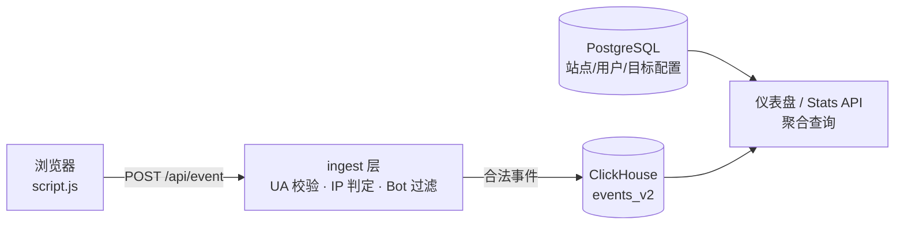

> **判断**：Plausible 真正的产品不是「一个界面好看的 Google Analytics 替代品」，而是把「测量流量，不测量个人」写进了数据模型——事件表里没有 IP、没有 Cookie、没有跨站标识，隐私合规因此从法务问题变成了架构的默认行为。代价同样真实：你拿不到用户级画像，只能做聚合统计。云托管版和自托管社区版（CE）的分界也不在界面，而在两处：高级 Bot 过滤（云版默认排除约 3.2 万个数据中心 IP 段）和原始数据访问权（只有 CE 能直接查 ClickHouse）。
>
> **依据**：[plausible/analytics](https://github.com/plausible/analytics) `master` 分支，GitHub API 在 2026-09-29 读到 29,252 stars / 1,878 forks / AGPL-3.0，最新 release 为 v3.2.1（2026-05-15）；自托管流程出自 [plausible/community-edition](https://github.com/plausible/community-edition) v3.2.1 分支的 README 与 `compose.yml`；隐私口径出自仓库 README 与[数据政策页](https://plausible.io/data-policy)；脚本体积与定价读自 [plausible.io](https://plausible.io) 首页 2026-09-29 快照；事件接口逐字段对照[官方 Events API 文档](https://plausible.io/docs/events-api)，`events_v2` 表结构取自源码 `lib/plausible/clickhouse_event_v2.ex`。本文不覆盖 Plausible EE（企业版闭源，不在公开仓库）。

## 目录

- [§1 项目坐标](#1-项目坐标2026-09-29-核对)
- [§2 隐私主张怎么落到工程上](#2-隐私主张怎么落到工程上)
- [§3 一次 pageview 的完整链路](#3-一次-pageview-的完整链路)
- [§4 采集脚本：默认捕捉了什么，怎么接管](#4-采集脚本默认捕捉了什么怎么接管)
- [§5 Events API：服务端发事件的正确姿势](#5-events-api服务端发事件的正确姿势)
- [§6 存储：Postgres 管配置，ClickHouse 管事件](#6-存储postgres-管配置clickhouse-管事件)
- [§7 报表层：渠道、来源、目标与搜索关键词](#7-报表层渠道来源目标与搜索关键词)
- [§8 云托管 vs CE：分界在过滤和原始数据](#8-云托管-vs-ce分界在过滤和原始数据)
- [§9 自托管 CE：v3.2.1 官方流程](#9-自托管-cev321-官方流程)
- [§10 常见故障排查](#10-常见故障排查)
- [§11 采用顺序与边界](#11-采用顺序与边界)

## 1. 项目坐标（2026-09-29 核对）

| 字段 | 值 |
|---|---|
| 仓库 | [plausible/analytics](https://github.com/plausible/analytics)，2018-12-04 建仓 |
| 读数 | 29,252 stars / 1,878 forks / 64 open issues（GitHub API 2026-09-29） |
| 许可 | AGPL-3.0 |
| 语言构成 | Elixir 7.2 MB 为主，TypeScript 1.3 MB（仪表盘前端），JavaScript 0.2 MB（tracker 脚本） |
| 最新 release | v3.2.1（2026-05-15）；前一版 v3.2.0（2026-01-26）、v3.1.0（2025-11-13） |
| 自托管仓库 | [plausible/community-edition](https://github.com/plausible/community-edition)（原名 plausible/hosting，已随版本更名，默认分支即版本号 `v3.2.1`） |
| 商业形态 | [云托管](https://plausible.io)付费；CE 自托管免费，由云收入资助（CE README 原话：*"Plausible CE is funded by our cloud subscribers"*） |

两点提醒。其一，网上大量教程（包括本文旧版）还在写 `git clone https://github.com/plausible/hosting`——这个仓库已更名为 `community-edition`，默认分支不再是 `master` 而是 `v3.2.1` 这类版本分支，旧命令会 404。其二，云托管版与 CE 不是同一份功能的两个部署：闭源 EE 模块（更细的报表与协作能力）只存在于云上，公开仓库里 `on_ee` 宏标注的位置就是两侧的分界。

## 2. 隐私主张怎么落到工程上

Plausible 的 README 第一段给出核心口径（原文直译）：**测量流量，而非个人。不存储个人数据或 IP 地址，不使用 Cookie 或持久标识符。完全符合 GDPR、CCPA 与 PECR。**

这句口号能成立，靠的是三组工程决定：

1. **数据模型里没有「人」这个粒度。** 访客去重靠一个由请求 IP 和 User-Agent 算出的匿名 `user_id`，原始 IP 不落库。事件表 `events_v2` 的字段清单（源码 `lib/plausible/clickhouse_event_v2.ex`）里能看到的只有 `name`、`pathname`、`referrer`、UTM 五件套、国家/城市码、屏幕尺寸、操作系统、浏览器——没有任何可以回溯到具体用户的字段。
2. **不设 Cookie，就没有「同意」问题。** 需要同意提示的是 Cookie 类存储行为；Plausible 不设任何 Cookie 或持久标识符，官方口径因此是[不需要 Cookie 提示条](https://plausible.io/data-policy)。注意这是厂商措辞而非法律意见，不同司法辖区的执法口径有差异。
3. **云版合规靠基础设施边界兜底。** 出于 GDPR 与 Schrems II 判决，云托管版的全部访客数据只在欧盟自有基础设施上处理，官方明确写了 *"Your website data never leaves the EU"*。

理解这个架构的代价同样重要：因为没有用户标识，你做不了用户级留存、跨设备归因、再营销受众——Plausible 有意不做这些。它对标的场景是「我的网站流量怎么样、从哪来、转化了多少」，不是「这个用户是谁、下一步推什么」。

## 3. 一次 pageview 的完整链路

把一次真实访问从头走到尾，四个环节各有各的守门人：



**采集**。页面 `<head>` 里一行 `script.js`（下一节展开），把 pageview 或自定义事件发给采集端点。

**ingest**。事件进入 `POST /api/event`，ingest 层做三件事：校验 User-Agent（缺失或可疑的 UA 算不出来访客 id，直接进不了库）；判定真实客户端 IP（直发时用连接来源 IP，后端转发时看 `X-Forwarded-For`，IP 属于已知数据中心段的事件会被静默丢弃）；执行 Bot 过滤。注意接口**永远返回 202**，被丢弃也返回 202——排查丢事件要靠响应头 `x-plausible-dropped: 1` 和请求头 `X-Debug-Request: true`（官方文档原话，后者会告诉你 Plausible 认定的客户端 IP）。

**存储**。合法事件写入 ClickHouse 的事件表；站点、用户、目标（Goal）定义这类低频配置放在 PostgreSQL。两条写路径分开，是后面所有查询性能讨论的基础。

**查询**。仪表盘和 [Stats API](https://plausible.io/docs/stats-api) 都只做聚合查询：按时间、来源、页面、地理等维度 group by。因为事件表天生没有用户粒度，这里不存在「查某人」的路径——数据边界和查询边界是同一张 schema 定的。

健康检查端点是 `GET /api/health`，自托管部署的容器探针就用它。

## 4. 采集脚本：默认捕捉了什么，怎么接管

标准片段一行，放进 `<head>`（站点专属片段在设置页 Tracking → Site installation 里能拿到）：

```html
<script defer data-domain="example.com" src="https://plausible.io/js/script.js"></script>
```

`data-domain` 决定事件归属的站点，`defer` 保证不阻塞渲染。体积方面官方不再给绝对 KB 数，2026-09-29 的[首页口径](https://plausible.io)是：脚本比 Google Analytics **小 54 倍**，每次访问**少下载 135 KB** JavaScript。（早年流传的「<1 KB」是旧口径，GA 的 gtag 这几年在膨胀，相对值随时间漂移，引用时注意时点。）

现行脚本的默认行为比很多教程写的多：

- **单页应用自动适配**。脚本监听 History API，`history.pushState` 触发时自动补发 pageview——旧教程里「SPA 必须手动推送」的说法对现行脚本已不成立。
- **默认捕捉出站链接、文件下载、表单提交**，无需额外配置。
- 新脚本提供 `plausible.init()` 配置入口：`hashBasedRouting`（hash 路由的站点）、`fileDownloads`、`outboundLinks`、`formSubmissions`、`captureOnLocalhost`、`autoCapturePageviews`（默认 `true`）等，见[脚本扩展文档](https://plausible.io/docs/script-extensions)。

需要完全手动控制时（比如 Turbo/Turbolinks 这类自己做页面替换的框架），关掉自动捕捉、在事件里补发：

```html
<script defer data-domain="example.com" src="https://plausible.io/js/script.js"></script>
<script>window.plausible = window.plausible || function () { (window.plausible.q = window.plausible.q || []).push(arguments); }</script>
<script>
  document.addEventListener("turbo:load", function () {
    plausible("pageview");
  });
</script>
```

被广告拦截器拦掉 `plausible.io` 域名的站点，官方给的是[自建代理方案](https://plausible.io/docs/proxy/introduction)：用自己的域名反代采集端点，脚本和事件同源，拦截规则就摸不到特征。

## 5. Events API：服务端发事件的正确姿势

自定义事件在前端一行代码：

```javascript
plausible("Signup", { props: { plan: "free" } });
```

关键业务事件建议从服务端发（不依赖客户端 JS 是否执行成功）。这里网上教程错误最密集——**现行 Events API 不需要 API Key**，事件靠请求体里的 `domain` 字段归属到站点。下面是[官方文档](https://plausible.io/docs/events-api)的 curl 原例：

```bash
curl -i -X POST https://plausible.io/api/event \
  -H 'User-Agent: Mozilla/5.0 (Macintosh; Intel Mac OS X 10_15_6) AppleWebKit/537.36 (KHTML, like Gecko) Chrome/85.0.4183.121 Safari/537.36 OPR/71.0.3770.284' \
  -H 'X-Forwarded-For: 127.0.0.1' \
  -H 'Content-Type: application/json' \
  --data '{"name":"pageview","url":"http://dummy.site","domain":"dummy.site"}'
```

逐字段过一遍（全部出自官方文档）：

| 字段 | 必填 | 说明 |
|---|---|---|
| `domain` | ✅ | 站点域名，事件归属的唯一依据 |
| `name` | ✅ | 事件名；`pageview` 是保留名，其余为自定义事件 |
| `url` | ✅ | 页面完整 URL，hostname 参与访客识别 |
| `referrer` | — | 解析进来源报表 |
| `props` | — | 自定义属性键值对，**最多 30 对** |
| `revenue` | — | `{ "currency": "USD", "amount": 99.99 }`，配电商收入报表 |
| `interactive` | — | 设 `false` 把事件排除出跳出率计算 |

三个最容易踩的坑：**User-Agent 请求头必填**——没有它算不出访客与浏览器信息，事件等于白发；从服务器发时用 `X-Forwarded-For` 传真实客户端 IP，转发了自己机房 IP 的事件会被 Bot 过滤静默丢弃；`Content-Type` 必须是 `application/json` 或 `text/plain`（后者仍按 JSON 解析）。API Key 是 [Stats API](https://plausible.io/docs/stats-api)（读数据）的认证方式，别和发事件的接口搞混。

## 6. 存储：Postgres 管配置，ClickHouse 管事件

两条数据线在 schema 层面就分开了：

| | PostgreSQL | ClickHouse |
|---|---|---|
| 存什么 | 用户、站点、目标定义、API Key 等低频配置 | 每一条访问事件（pageview 与自定义事件） |
| 表 | 常规 Ecto schema | `events_v2`（事件）、`sessions_v2`（会话） |
| 写模式 | 行级事务 | 批量写入，应用侧缓冲后刷盘 |
| 查谁 | 仪表盘的配置读取 | 仪表盘全部统计指标 |

`events_v2`（v3.2.1 全新安装的口径，源码 `lib/plausible/clickhouse_event_v2.ex`）每行一条事件，字段分四组：`name`/`pathname`/`timestamp` 标识「谁在哪页发生了什么」，`session_id` 串起会话，`meta.key`/`meta.value` 两个并列数组存自定义属性，其余是采集时补齐的维度（`referrer_source`、`utm_*`、`country_code`、`screen_size`、`browser`、`operating_system`）和会话快照（`scroll_depth`、`engagement_time`）。

为什么必须上 ClickHouse：网站分析的全部查询都是「过去 30 天每天多少访客」这类高维聚合，数据量随流量线性涨。列式存储按列压缩、按列扫描，聚合查询快几个数量级，存储成本也低。这类查询在行式数据库上不是不能跑，是跑不便宜。

自托管时这两个库就在你的 compose 栈里，所以 CE 有云版给不了的原始数据访问权。查询注意库名：应用默认连 `CLICKHOUSE_DATABASE_URL=http://plausible_events_db:8123/plausible_events_db`（`config/runtime.exs` 默认值），所以表全名是 `plausible_events_db.events_v2`，不是裸的 `events`：

```sql
SELECT toDate(timestamp) AS date,
       countIf(name = 'pageview') AS views
FROM plausible_events_db.events_v2
WHERE timestamp >= now() - INTERVAL 7 DAY
GROUP BY date
ORDER BY date
```

```bash
docker compose exec plausible_events_db clickhouse-client
```

## 7. 报表层：渠道、来源、目标与搜索关键词

仪表盘顶栏是当前在线、独立访客、页面浏览量、每次访问页数、跳出率、访问时长六个指标。来源报表分三个标签页（[官方文档](https://plausible.io/docs/top-referrers)）：**Channels** 按 GA 对齐的高层渠道分组（Organic Search、Organic Social、Email、Direct、Referral、Paid Search……以及一个 **AI Assistants** 渠道——ChatGPT、Claude、Perplexity、Gemini、Copilot 等 AI 工具带来的引荐流量单独成组）；**Sources** 展示原始引荐域名；**Campaigns** 按 UTM 参数聚合，也识别 `gclid`/`msclkid` 付费点击参数。

转化侧三件事：**目标**（[Goals](https://plausible.io/docs/goal-conversions)）把页面访问或自定义事件定义成转化；**自定义属性**（[Props](https://plausible.io/docs/custom-props/introduction)）给事件挂维度，比如 `plan=free`；**漏斗**（[Funnel analysis](https://plausible.io/docs/funnel-analysis)）把多步目标串成转化路径看流失。

搜索关键词走 [Google Search Console 集成](https://plausible.io/docs/google-search-console-integration)：站点设置 → Integrations → Continue with Google 授权后，Sources 标签页里出现 Google 分组，能看到查询词、点击、展示、CTR、排名。两个官方写明的限制：数据延迟约 24–36 小时；至少有一次点击的关键词才会出现。自托管实例要用这个集成，需要先给应用配 `GOOGLE_CLIENT_ID`/`GOOGLE_CLIENT_SECRET`（compose 里有对应变量位，CE wiki 有 [Google-Integration](https://github.com/plausible/community-edition/wiki/Google-Integration) 页）。

## 8. 云托管 vs CE：分界在过滤和原始数据

仓库 README 里的对比表是唯一权威口径，核心差异浓缩成一张表：

| | 云托管 | CE（自托管） |
|---|---|---|
| Bot 过滤 | 算法识别非人类流量模式 + UA 过滤 + **默认排除约 3.2 万个数据中心 IP 段** + 引荐垃圾域 | 基础过滤：常见 UA 特征 + 引荐垃圾域 |
| 数据访问 | 仪表盘聚合 + [CSV 导出](https://plausible.io/docs/export-stats) + [Stats API](https://plausible.io/docs/stats-api) + [Looker Studio 连接器](https://plausible.io/docs/looker-studio) | 以上外加**直接查 ClickHouse 原始数据**；无 Looker Studio 连接器 |
| 数据位置 | 只在欧盟（德国）基础设施处理 | 任意国家任意服务器 |
| 地理库 | 内置 | 开箱内置 DB-IP 国家库（镜像内 `priv/geodb/dbip-country.mmdb.gz`），配 `MAXMIND_LICENSE_KEY` 后默认升到 GeoLite2-City |
| 功能面 | 含闭源 EE 能力 | 仅公开仓库代码 |
| 价格 | Starter $9/月起（10k 月浏览量、单站、3 年数据留存）、Growth $14/月（3 站、3 成员）（官网 2026-09-29 读数） | 免费，自担服务器与运维 |

Bot 过滤这一行要单独说：没有数据中心 IP 过滤时，爬虫和监控探针会混进「独立访客」，数字虚高且无法事后剔除。这是云版与 CE 在「数据干净度」上的实际差距，选型时按流量构成掂量——技术受众的站点爬虫占比高，差得不小。

更新节奏用 release 日期说话：v3.1.0（2025-11-13）→ v3.2.0（2026-01-26）→ v3.2.1（2026-05-15），大约一季度一个版本。云版与 CE 的功能差距参考 §8 对比表。

## 9. 自托管 CE：v3.2.1 官方流程

先说硬件底线（CE README 原文要求）：Docker 与 Docker Compose；CPU 支持 **SSE4.2 或 NEON** 指令集（ClickHouse 的硬要求）；**内存至少 2 GB** 起步。

官方路径是跑**预构建镜像**，不自己 build 源码（CE README 全流程直译如下）：

```bash
# 1. 克隆仓库——注意 -b 钉住版本分支
git clone -b v3.2.1 --single-branch https://github.com/plausible/community-edition plausible-ce
cd plausible-ce

# 2. 建环境文件，只有两项必填
touch .env
echo "BASE_URL=https://plausible.example.com" >> .env   # 改成实际域名，DNS 指向本机
echo "SECRET_KEY_BASE=$(openssl rand -base64 48)" >> .env

# 3. 要直接对外提供 80/443 并自动签发 Let's Encrypt 证书时，加 override
echo "HTTP_PORT=80" >> .env
echo "HTTPS_PORT=443" >> .env
cat > compose.override.yml << EOF
services:
    plausible:
        ports:
            - 80:80
            - 443:443
EOF

# 4. 启动
docker compose up -d

# 5. 浏览器打开 $BASE_URL，在网页里创建第一个用户
```

三个和旧教程完全不同的关键点：

- **没有 `create_user` 命令了**。建库和迁移由容器启动命令自动完成（`compose.yml` 里 `plausible` 服务的 command 是 `db createdb && db migrate && run`），首个账号直接在网页上注册。想关掉公开注册，先注册好管理员，再启用 `DISABLE_REGISTRATION` 变量。
- **不用手写数据库连接**。`DATABASE_URL`/`CLICKHOUSE_DATABASE_URL` 都有 compose 内部默认值，除非你外接数据库。
- **本地试跑时设 `BASE_URL=http://localhost:8000` 就够**，端口映射照 README 的 TIP 改成 `- 8000:80`，不必碰 TLS。

栈内三个服务（`compose.yml` 原文）：`plausible`（镜像 `ghcr.io/plausible/community-edition:v3.2.1`）、`plausible_db`（postgres:16-alpine）、`plausible_events_db`（clickhouse-server:24.12-alpine），数据分别落在 `plausible-data`、`db-data`、`event-data` 三个卷里——备份就是备份这三个卷加 `.env`。

可选配置都有 wiki 页背书：邮件 SMTP 一组变量的真实名字是 `SMTP_HOST_ADDR`/`SMTP_HOST_PORT`/`SMTP_USER_NAME`/`SMTP_USER_PWD`/`SMTP_HOST_SSL_ENABLED`（不是某些教程写的 `SMTP_HOST`/`SMTP_PORT`），另有 Postmark/Mailgun/SendGrid/mandrill 的 API Key 适配，见 [Configuration](https://github.com/plausible/community-edition/wiki/Configuration)；反代场景用 [Reverse-Proxy](https://github.com/plausible/community-edition/wiki/Reverse-Proxy) 页替代内置 TLS。

升级按 [Upgrade wiki](https://github.com/plausible/community-edition/wiki/Upgrade)：

```bash
cd plausible-ce
git pull origin v3.2.1    # 换成目标版本分支
docker compose up -d
```

wiki 的两条告诫值得抄在这里：镜像 tag 按需钉住——`v3.2.1` 精确锁定，`v3.2` 跟随补丁更新；**安全修复不回补旧版本**，长周期不升级等于裸奔。跨大版本（如 v2 → v3）可能涉及数据迁移，先读 release notes。

## 10. 常见故障排查

**仪表盘没数据，按链路逐段查**：

1. 脚本加载了吗——浏览器控制台看 `plausible.io/js/script.js` 是否 200，`data-domain` 是否与站点设置里的域名一字不差（协议、`www`、大小写都对得上）。
2. 事件被拦了吗——被广告拦截器特征拦截是头号原因，改走[自建代理](https://plausible.io/docs/proxy/introduction)。
3. 事件被丢了吗——对 Events API 的调用**永远返回 202**，成败要看响应头 `x-plausible-dropped`；加 `X-Debug-Request: true` 请求头能拿到 Plausible 认定的客户端 IP，多数「事件消失」都丢在这一步（UA 缺失或转发 IP 落在数据中心段）。

**自托管栈起不来**：先 `docker compose ps` 看三个服务的健康状态，ClickHouse 首次启动有 1 分钟 healthcheck 宽限期（`compose.yml` 里 `start_period: 1m`）；内存不足 2 GB 时 ClickHouse 可能被 OOM kill，镜像里的 `low-resources.xml` 已经是压过的配置，再低就得加内存了。

**GSC 集成不出关键词**：先等过 24–36 小时延迟窗口，再确认关键词至少有一次点击——这是官方写明的两条门槛，不是故障。

**想清空某个站点的数据**：站点设置里删除站点即删除其全部历史数据；CE 环境还可以直接操作 `plausible_events_db` 库，但先备份再动手。

## 11. 采用顺序与边界

按场景给顺序，不按功能清单：

1. **个人博客、中小站点，要合规省事**——云托管 Starter（$9/月档）直接上，当天能用，合规边界由官方背书。
2. **数据不能出镜/出境，或流量大到云版不划算**——CE 自托管，按 §9 流程走；预算 2 GB 内存和一季度一次的升级纪律，接受基础级 Bot 过滤。
3. **要原始数据做自己的报表**——只有 CE 给你 ClickHouse 的钥匙；云版最多到 CSV 和 Stats API。
4. **需要用户级画像、跨设备归因、再营销**——别用 Plausible，这不是它缺功能，是它拒绝做的产品决策；这类需求看产品分析工具（PostHog、Mixpanel 这类），代价是重新把个人数据扛回合规流程里。
5. **CE 的支持预期**——README 原话：CE 是社区支持项目，**官方不保证为自托管问题提供支持**，求助走 [discussions 的 Self-hosted Support 分区](https://github.com/plausible/analytics/discussions/categories/self-hosted-support)。把它当「免费但自己负责」的选项来预算人力。

最后回到开头那句判断。Plausible 把「不存个人数据」从一个需要法务审批的承诺，变成了数据库 schema 里查无此字段的事实——这是它对网站分析这个品类真正的重构。反过来说，选它就是接受聚合统计的天花板。想清楚你要的是「流量仪表」还是「用户显微镜」，选型不会纠结超过十分钟。

---

*本文核对记录：GitHub API（仓库/语言/release，2026-09-29）、`community-edition` v3.2.1 README 与 `compose.yml`、`analytics` master 分支 `config/runtime.exs` 与 `lib/plausible/clickhouse_event_v2.ex`、plausible.io 首页与 docs 各页（events-api/script-extensions/top-referrers/goal-conversions/funnel-analysis/google-search-console-integration/export-stats/stats-api/proxy/self-hosting），全部链接 2026-09-29 验活 200。*
