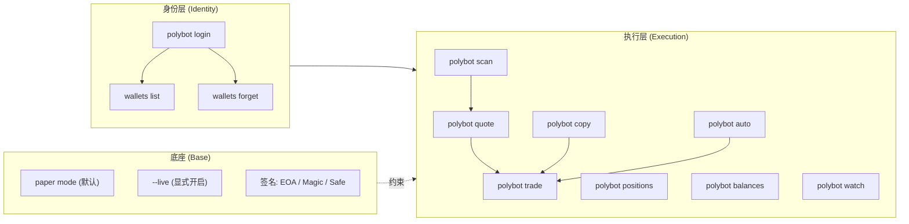

> ⚠️ **本文已撤下**（`draft: true`），原因：本文引用的两条关键外链在 2026-06 验证时已不可达：
>
> - `https://github.com/texsellix/polymarket-trading-bot` —— **HTTP 404**（GitHub API 返回 `Not Found`）
> - `https://github.com/dev-protocol/polymarket-ai-synth-trading-bot-telegram` —— **HTTP 404**
>
> 与此同时，npm 上的 `polymarket-trading-cli` 0.1.1 仍在持续发布，**包与仓库之间出现了断链**：读者按文章跑命令时没有源码可审计，策略实现继续是黑盒，且无法核实 npm 上 0.1.1 二进制是否仍与已下架仓库对应版本一致。在外链恢复或换成仍可访问的对照项目之前，不建议以本文作为安装 / 复制交易决策的参考。
>
> 下面保留原内容，供作者后续在仓库恢复或迁移到新项目时重写。

在 Polymarket 上挂单需要懂 CLOB（中央限价订单簿）、API key、Polygon 钱包签名类型，以及一套不算短的状态机。Polybot（npm 包名 `polymarket-trading-cli`、仓库 `texsellix/polymarket-trading-bot`、版本 0.1.1）想做的事情，是把这条链压缩成 `polybot login && polybot copy --target 0xWhale --size-multiplier 0.05 --live` 这样一行命令。

它确实把 5 步流程收进了 1 行。但这次拆解关心的不是"复不复杂"，而是：

- 它在 npm 0.1.1 这一版上**真正交付了什么**、哪些细节还是 README 上没写明的承诺？
- 一条 `polybot copy` 命令背后，钱包身份、订单签名、纸面模拟和实盘之间是**怎样分层的**？
- 对技术读者来说，它应该被当作"低门槛的实验沙盒"，还是"能上生产的跟单基础设施"？

这三条问题的答案，构成本文后面所有判断的基础。

## 学习目标

读完之后，你应该能：

- 看懂 `polybot` 的命令集与 npm 0.1.1 实际暴露的功能边界
- 区分 Polybot 文档中**已确认**的事实和**未公开的承诺**（特别是策略实现、风险引擎细节）
- 在 EOA、Polymarket Proxy / Magic / Safe 这几种钱包模式下分别完成基础配置
- 理解 `paper` 模式与 `--live` 模式的边界，避免在自动化脚本里误触发真实成交
- 判断在什么场景下 Polybot 够用、在什么场景下应该上更重的方案（Poly Syncer、自托管、Quicknode 模板）

## 阅读导航

- 想先看结论：「一句话判断」「谁适合、谁该等等」
- 想知道命令怎么用：「总览地图」「命令集」「一个完整的 copy 任务流」
- 关心钱包与签名：「钱包与签名模式」
- 关心策略与风险边界：「自动策略」「纸面与实盘的边界」「README 没写明但你需要知道的事」
- 关心决策：直接跳到「采用顺序」

---

## 一句话判断

Polybot 0.1.1 是一个**早期但已经能跑通主路径**的预测市场 CLI。它的价值在于把"钱包登录 → 行情扫描 → 单笔下单 → 跟单鲸鱼 → 跑自动策略"压到 5 条命令内，并把"纸面模拟"设为默认来兜底风险；但**它不是生产级跟单系统**：仓库尚未公开策略实现细节，风控条目大多停留在 README 段落，不应被当作策略库的稳定 API。

## 谁适合、谁该等等

| 你现在在做的事 | 建议 |
| ------ | ------ |
| 想在终端里以最低成本跑一次 Polymarket 跟单 | 直接试，polybot 是最快路径 |
| 写自动化脚本、定期跑套利 / 动量 / 终局策略 | 试 0.1.1，但要清楚策略是黑盒，0.1.x 版本 API 可能变 |
| 维护一个要"上生产"的跟单产品 | Polybot 还不够，看 [Poly Syncer](https://www.polysyncer.com/docs) 这类方案或自托管 Quicknode 模板 |
| 想用单一 EOA 跑生产资金、要求 < 1.5s 跟单延迟 | 别用 CLI，CLI 路径不适合严格时延预算 |
| 只想看盘、不下单 | `polybot scan` / `polybot quote` 当行情查询也够用 |

---

## 总览地图

Polybot 的能力面可以拆成**两条主线**和**一层底座**。先看图，再展开。



**两条主线**：

- **身份层**：管钱包、决定后续命令以哪个私钥身份下单。`login` 一次性建索引；`wallets list` / `wallets forget` 维护本地映射。
- **执行层**：从行情扫描到下单、跟单、自动策略、实时事件流，共 7 条命令。

**一层底座**：所有执行层命令默认走 `paper` 模式，需要在命令末尾加 `--live` 才会触发真实成交；同时签名身份由 `POLY_SIGNATURE_TYPE`（0 = EOA、1 = Magic、2 = Safe）控制。

对应到具体命令后，`scan / quote / trade` 走单笔路径，`copy / auto` 走自动化路径，不会被命名相近的几条搞混。

---

## 命令集（基于 npm 0.1.1 公开说明）

下表的命令与行为均来自 npm 包的 README 段落，npm 周下载量在 100 量级，仍处于早期版本。

| 命令 | 作用 | 备注 |
| --- | --- | --- |
| `polybot login` | 一次性连接钱包 | 私钥在传输中加密、落盘只保留地址 + 短指纹 |
| `polybot wallets list` | 列出本机已连接钱包 | 显式管理多钱包 |
| `polybot wallets forget <addr>` | 断开指定钱包 | 删除本地映射，不动链上资产 |
| `polybot scan` | 列出 Polymarket 当前热门市场 | 行情入口 |
| `polybot quote` | 查询指定市场的实时买卖报价 | 跟 `scan` 配合使用 |
| `polybot trade` | 下单（默认 paper） | 加 `--live` 才出真单 |
| `polybot copy` | 镜像目标钱包的全部成交 | 见下文「一个完整的 copy 任务流」 |
| `polybot auto` | 跑内置自动策略 | 支持 `arbitrage / momentum / mean-reversion / endgame` 四种 |
| `polybot positions` | 查看当前持仓与浮盈浮亏 | |
| `polybot balances` | 查看 USDC 余额 + CTF 授权状态 | 链上授权不全时下单会失败 |
| `polybot watch` | 流式接收当前钱包的成交 / 挂单事件 | 类似 tail，少量采样调试用 |

注意：

1. 命令名是 `polybot`，但 **npm 包名是 `polymarket-trading-cli`，安装包名是 `polymarket-bot`**。这条是 0.1.x 阶段最容易踩的坑。
2. 文档里只列了策略名字（`arbitrage / momentum / mean-reversion / endgame`），**没有公开每种策略的触发条件、参数默认值、退出条件**。`polybot auto --strategies arbitrage,endgame --per-trade 25` 这类调用能跑通，但策略细节属于黑盒。

---

## 一个完整的 copy 任务流

下面把一次 `polybot copy` 的端到端路径走一遍，命令与行为来自 npm 0.1.1 README。

```bash
# 1. 安装
npm i -g polymarket-bot

# 2. 连接钱包（首次会要求输入私钥，私钥在传输中加密、内存里立刻擦除，
#    本地只保留地址 + 短指纹；明文不会写盘，也不会进日志）
polybot login

# 3. 列一下已经连过的钱包，验证 login 是否真的落索引
polybot wallets list

# 4. 先用 paper 模式镜像一个鲸鱼，每笔按 5% 缩放、单笔不超过 50 USDC
polybot copy --target 0xWhale --size-multiplier 0.05 --max-trade 50

# 5. 在 watch 里看自己的成交和挂单事件流
polybot watch

# 6. 看一眼 USDC 余额和 CTF 授权是否就位
polybot balances

# 7. 确认行为正确后，再切换到实盘（加 --live）
polybot copy --target 0xWhale --size-multiplier 0.05 --max-trade 50 --live
```

### 这次任务的关键边界

- 步骤 4 与步骤 7 的**唯一区别是 `--live` 这个 flag**。把命令放进 cron、systemd、CI 之前，**先确认仓库里没有任何脚本会悄悄加上 `--live`**，也别在 `~/.bashrc` 里写 alias 把 `--live` 默认打开。
- `size-multiplier` 是**线性缩放**鲸鱼的成交金额；它不会去读鲸鱼账户的实际资金量，也不会按你的余额做风险等比。鲸鱼 1000 USDC × 0.05 等于 50 USDC，与你账户里有多少钱无关。
- `max-trade 50` 是**单笔硬上限**，但**不是**日累计上限。`polybot` 0.1.1 README 写到的本地风控只有这一条；任何更细的限额（每日亏损、波动率熔断等）目前**不来自 polybot，需要在外层脚本里加**。

---

## 钱包与签名模式

Polymarket 的链上身份和"哪个钱包"下单并不是同一件事。Polybot 用两个环境变量把这层关系挑明：

```bash
# 普通 EOA（默认路径）
# 什么都不用设，polybot login 时输入的私钥就是签名身份

# Polymarket Proxy / Magic Link 钱包
export POLY_SIGNATURE_TYPE=1   # 1 = Magic
export POLY_FUNDER_ADDRESS=0xYourPolymarketProxy

# Polymarket Safe（多签）
export POLY_SIGNATURE_TYPE=2   # 2 = Safe
export POLY_FUNDER_ADDRESS=0xYourSafe

# 无头服务器（拿不到交互式 login 的场景）
PRIVATE_KEY=0x... polybot auto --live
```

判断自己该用哪种：

- **多数人**：`polybot login` 走 EOA 路径，**不需要碰环境变量**。
- **已经在 Polymarket 网站上用邮箱 / Magic 登录过、生成过代理钱包**的用户：必须显式设 `POLY_SIGNATURE_TYPE=1` + `POLY_FUNDER_ADDRESS`，否则下单会因为"签名身份与资金身份不匹配"失败。
- **管团队资金、走 Safe 多签**的：设 `POLY_SIGNATURE_TYPE=2`。

`PRIVATE_KEY=0x…` 这种"内联私钥"的形式适合 CI / 远端节点，但意味着**进程环境里会短暂存在明文私钥**。在多人共用的机器上慎用，更别把它写进 `~/.bash_history` 可被读到的位置。

---

## 自动策略

`polybot auto` 暴露四种内置策略，README 表格里只列了名字和**归属类别**（arbitrage / momentum / mean-reversion / endgame），没有给出每个策略的：

- 触发条件与阈值
- 默认仓位规模、冷却时间
- 退出条件（止盈、止损、超时）
- 与外部行情（CEX 现货、Binance/Bybit WebSocket）的耦合方式

| 策略 | README 给出的描述 | 公开资料里**没**说的 |
| --- | --- | --- |
| `arbitrage` | arbitrage | 套利阈值、滑点假设、最大并发 |
| `momentum` | momentum | 趋势识别窗口、反转止损、跟踪止盈 |
| `mean-reversion` | mean-reversion | 均线周期、偏离阈值、回归判据 |
| `endgame` | endgame | 临近结算的距离阈值、ITM 深度、到期前多少时间停止加仓 |

> 表格里"README 给出的描述"列就是策略名字本身；"公开资料里没说的"那列是**主动列出来让你知道哪些是空**。在动真金白银之前，先用 paper 模式跑至少一轮完整结算周期，把空白一项一项填出来，再决定要不要把它推进到 `--live`。

要叠加多个策略时，按 README 的示例传逗号串：

```bash
polybot auto --strategies arbitrage,endgame --per-trade 25 --live
```

`--per-trade 25` 是每笔触发时的金额，不是总仓位上限。多个策略共享同一笔 USDC，**策略间没有总额风控**，跟单/套利/终局同时触发时不会互相让位。

---

## 纸面与实盘的边界

Polybot 0.1.1 在"误下单"这件事上的设计是相对保守的：

- **默认 paper 模式**：所有 `trade` / `copy` / `auto` 不带 `--live` 时只打印，不发单。
- **`--live` 必须显式**：没有环境变量可以"全局开实盘"，也不会从配置文件中"默认开"。
- **私钥不落盘**：login 之后本地只留地址 + 短指纹，明文私钥不会进 `~/.config/polybot/` 之类的目录，也不会进日志。

几条边界需要外层来兜：

1. **没有进程级总额风控**。`copy` 的 `--max-trade 50` 是单笔上限，CLI 不会汇总当日成交。
2. **没有自动撤销已挂单**。`polybot auto` 触发后挂出去的单不会被自动撤掉；停掉进程只会停止发新单。
3. **没有结算监控**。到期市场的盈利赎回（redeem）目前不是 polybot 的内置动作，需要外层脚本或人工去 Polymarket 网站点一下。
4. **`watch` 不是风控工具**。它只是事件流显示，不会因为价格暴跌帮你撤单。

把这四条和外层运维（cron + 日志 + 告警）一起搭起来，比"信任 polybot 内部会兜底"更稳。

---

## README 没写明但你需要知道的事

把目前 npm 0.1.1 公开页面里**没看到、但又很常被问到**的点列一下：

- **签名类型与 EOA 的关系**。文档里 `POLY_SIGNATURE_TYPE` 给了 `1=Magic, 2=Safe`，对 EOA（最常见路径）的取值是 `0` 还是默认即 EOA 没说。多数同类工具的默认就是 0，但**首次跑 EOA 命令前值得 `--help` 一次确认**。
- **策略的参数默认值**。`polybot auto` 跑 `arbitrage` 时，套利阈值、冷却时间、最大并发单这些都没有显式默认值被公开。
- **跟单延迟**。从鲸鱼成交到本地发单之间的延迟，README 没有数字。CLI 路径天然不擅长做 < 1s 的低延迟跟单。
- **CTF 授权**。`balances` 会显示 USDC + CTF allowance，但文档没说明"第一次下单时 polybot 会不会自动触发 setApproval"。常见做法是要求用户提前在 Polymarket 网站上点一次 approve，CLI 不会替你做。
- **网络与 RPC**。Polybot 默认走哪个 RPC endpoint、能不能用自定义 RPC（Quicknode、Alchemy）目前没有公开说明。
- **版本与破坏性变更**。当前是 0.1.1，仍在 0.1.x，`--strategies`、`--size-multiplier` 这类参数在不同小版本之间**有可能变**。生产脚本里要锁版本。

这些不是"问题清单"，而是写自动化脚本前**该自己测一遍**的事项。`polybot --help` 和 `--help` 子命令是第一站。

---

## 与同类工具的对照

把 Polybot 放进更大的工具谱系里，能更快判断它值不值得装。

| 工具 | 运行形态 | 主要差异 | 适合谁 |
| --- | --- | --- | --- |
| **Polybot**（本文） | 全局 npm CLI | 一行命令跑通主路径；策略黑盒 | 想最快跑一次跟单 / 跑 paper 验证想法 |
| **Poly Syncer**（商用 SaaS） | Web 控制台 + 链上签名 | 提供领导钱包评分、Sharpe 排名、风控面板、p99 延迟 1.8s | 严肃跟单、愿意付费的中小资金 |
| **Quicknode 模板** `qn-guide-examples/defi/polymarket-copy-bot` | 自托管 Node.js | 源码可见，可改可审计；EOA-only | 开发者 / 需要在内部合规审计的团队 |
| **dev-protocol/polymarket-ai-synth-trading-bot-telegram** | 监听 mempool（待打包交易） | 跟单信号来自 mempool 而非已成块交易，延迟更低 | 想抢在交易上链前跟单的进阶用户 |

挑哪一个，看的是你要回答的问题是什么：

- **只是想看一次跟单怎么跑起来**——Polybot 0.1.1 已经够用。
- **已经在挑生产级方案**——把 Polybot 当 demo，把 Poly Syncer / Quicknode 模板 / dev-protocol 那条线当候选。

---

## 采用顺序

按"先 paper、再观察、再实盘、再扩量"的顺序通常最省事：

1. **先 paper 跑一遍**：`polybot copy` / `polybot auto` 在不加 `--live` 的情况下盯 1–3 天，把日志和 `positions` 变化看清楚。
2. **再小资金实盘**：从 25 USDC 起步，验证 `wallets list`、`balances`、`positions` 的输出和你的预期一致。
3. **再上规模**：把 `size-multiplier` 调到目标值，并**在外层加总额风控和告警**，不要让 CLI 自己"看着办"。
4. **再考虑换工具**：当跟单规模到了"心疼"的程度，再去看 Poly Syncer / 自托管 Quicknode 模板，让延迟、可观测性、策略透明度一起升级。

需要绕开 Polybot 的场景：

- 团队资金走多签，且**不允许在生产机器上跑 npm 全局包**——Polybot 默认是全局安装。
- 跟单延迟要求 < 1s——CLI 路径不是为这件事设计的。
- 策略要可审计、可白盒——`auto` 的策略实现目前**没有公开源码细节**。

---

## 动手验证：跑一次再说

下面是按"先 paper、再观察、再实盘"逻辑组织的三档练习。每一档都假设你用一个**单独的测试钱包**跑，不动主力资金。

### 练习 1（理解型 · 10 分钟）

目标：把 5 条命令的输出都看一遍。

```bash
# 0. 准备：用全新 EOA 测试钱包，给它转入 50 USDC + 少量 MATIC
#    （建议从你的主钱包 split 出一个小号，永远不要拿主钱包直接试）

# 1. 装 + login
npm i -g polymarket-bot
polybot login
# 此时按提示粘贴测试钱包私钥；本机应弹出"encrypted, stored ciphertext-only"

# 2. 验证 login
polybot wallets list
# 预期看到：1 个地址 + 短指纹

polybot balances
# 预期看到：USDC 余额 ≈ 50，CTF allowance 行
#            如果 CTF allowance 是 0，先去 polymarket.com 用同一个钱包点一次
#            approve，CLI 不会替你做
```

预期输出（大致形态）：

```
> polybot wallets list
0xAbCd…1234   fp:9af1   (test)

> polybot balances
USDC.e         50.00
CTF allowance  0.00   ← 第一次会是 0
gas (MATIC)    0.42
```

### 练习 2（应用型 · 1–3 天）

目标：在 paper 模式下确认 `copy` 与 `auto` 的行为与你的预期一致。

```bash
# 1. 选一个公开 leaderboard 上历史 30 天交易 ≥ 40 笔的地址
polybot scan
polybot quote --market <一个高流动性市场>

# 2. 镜像 24 小时
polybot copy --target 0xLeader --size-multiplier 0.05 --max-trade 5
# 期间另开一个终端跑：
polybot watch
polybot positions

# 3. 跑一个简单 auto 组合
polybot auto --strategies arbitrage,endgame --per-trade 5
```

练习 2 自检：跑完 24 小时后，回答下面 5 个问题——能答上来再考虑进入练习 3：

1. `positions` 里看到的成交条数，比 `copy` 命令应该触发的预期条数多还是少？
2. 哪些成交**没有**被复制？是 `--max-trade 5` 卡掉的，还是网络延迟没追上？
3. `auto` 跑 `arbitrage` 时，你盯的几个市场上**实际触发的阈值**大概是多少？
4. 整个过程中，你的 `USDC.e` 余额变化方向和金额，是不是和你"理论上该赚/亏"的数字对得上？
5. 如果对不上——是模型假设错了、还是数据源晚了、还是 polybot 的策略实现跟你想的不一样？

### 练习 3（分析型 · 上量前一次性做）

目标：在动真金白银之前，给这次部署写下"退出条件"。

把它当成一份上线清单（不写也得在脑子里过一遍）：

- **触发实盘的资金量上限**是多少？到了就停下。
- **单日最大亏损**是多少？到了 `polybot auto` 进程直接被外层脚本 kill。
- **策略信号失真**怎么判定？比如 arbitrage 触发频率突然翻倍，先停而不是加仓。
- **对账方式**：每天把 `positions` 的本地浮盈浮亏和 Polymarket 网站上的实际持仓对一次，偏差 > X% 立刻停。
- **私钥轮换**：什么时候把测试钱包淘汰，主力钱包多久换一次。
- **回退计划**：发现策略持续亏损、或者 polybot 升级破坏参数，第一步做什么。

写完之后，这份清单要**留在仓库**而不是留在脑子里——后半夜被叫起来排查的人不一定是你。

---

## 典型 paper 模式输出长什么样

第一次跑 `polybot copy` 在 paper 模式下，控制台大致会按这个节奏输出（具体字段名以你本机 `0.1.1` 实际为准）：

```text
> polybot copy --target 0xWhale --size-multiplier 0.05 --max-trade 50
[mode]   paper
[target] 0xWhale
[scale]  0.05
[cap]    50 USDC per fill
[follow] watching target via Polymarket Data API…
[event]  00:00:12  target BUY 250 YES @ 0.41  market=will-eth-hit-10k
[calc]   250 * 0.05 = 12.5 USDC
[paper]  would BUY 12.5 USDC @ 0.41 (FOK)
[event]  00:08:54  target BUY 800 NO  @ 0.58  market=will-btc-q3-100k
[calc]   800 * 0.05 = 40 USDC
[paper]  would BUY 40 USDC @ 0.58 (FOK)
…
```

几个可以直接盯的字段：

- `[mode] paper` 出现在第一行——如果没出现，说明环境变量或别名把它悄悄覆盖了。
- `[cap]` 出现在启动横幅里——`--max-trade` 没有默认值是无限的；不加 `--max-trade` 等于不限单笔。
- `[calc]` 这一行是 polybot 自己算的"应跟金额"。**记录第一天的 `[calc]`，日后对账就有基准**。
- `would` 这个动词只出现在 paper 模式。实盘 `--live` 下同样的位置会变成 `filled / partial / rejected`。

把它和练习 2 的"24 小时自检"配合：跑完一次完整结算周期，你应该能用这份日志和 `positions` 输出，**自己**回答出"实盘跟单时 PnL 会是多少"。

---

## 结尾判断

Polybot 0.1.1 在 2026 年 5 月这一版的 npm 页面看上去很克制：12 条命令、4 个策略名字、一句"默认 paper"。这正是它适合被推荐的地方——**没有把策略、风控、评分这些重活揽进 CLI**。

反过来看边界，结论同样清楚：

- 策略实现是黑盒，0.1.x API 不承诺稳定。
- 钱包登录用本地加密索引，**不是**托管，但**也不等于**企业级密钥管理。
- 跑生产跟单需要的"延迟可观测 / 总额风控 / 异常熔断"目前**不在 CLI 里**，需要在外层补。

把它当成"30 秒装好、3 天试完、决定是否上更重的方案"的低门槛沙盒，价值清晰；当成"开箱即用的生产跟单系统"，则高估了它。

---

**仓库**：[github.com/texsellix/polymarket-trading-bot](https://github.com/texsellix/polymarket-trading-bot)
**npm**：[polymarket-trading-cli · 0.1.1](https://www.npmjs.com/package/polymarket-trading-cli)（安装时包名 `polymarket-bot`，命令名 `polybot`）
**运行环境**：Node.js 20+
**许可证**：MIT
